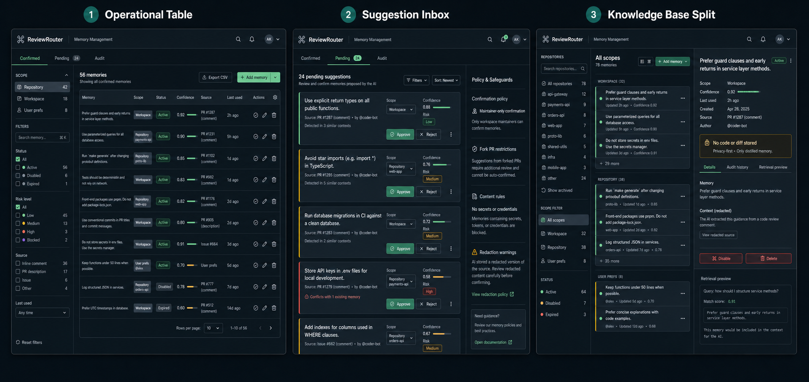
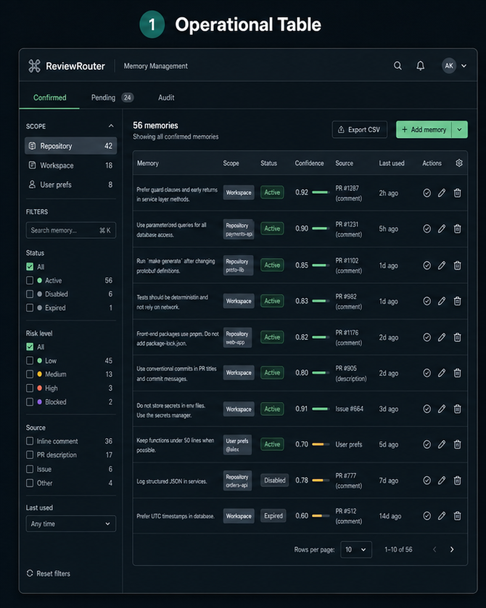
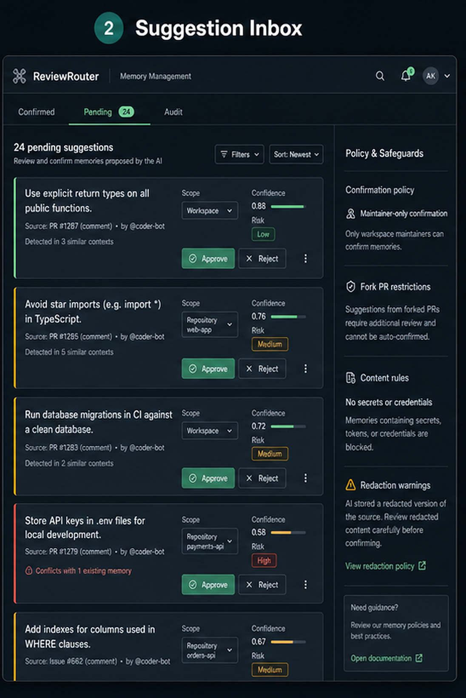
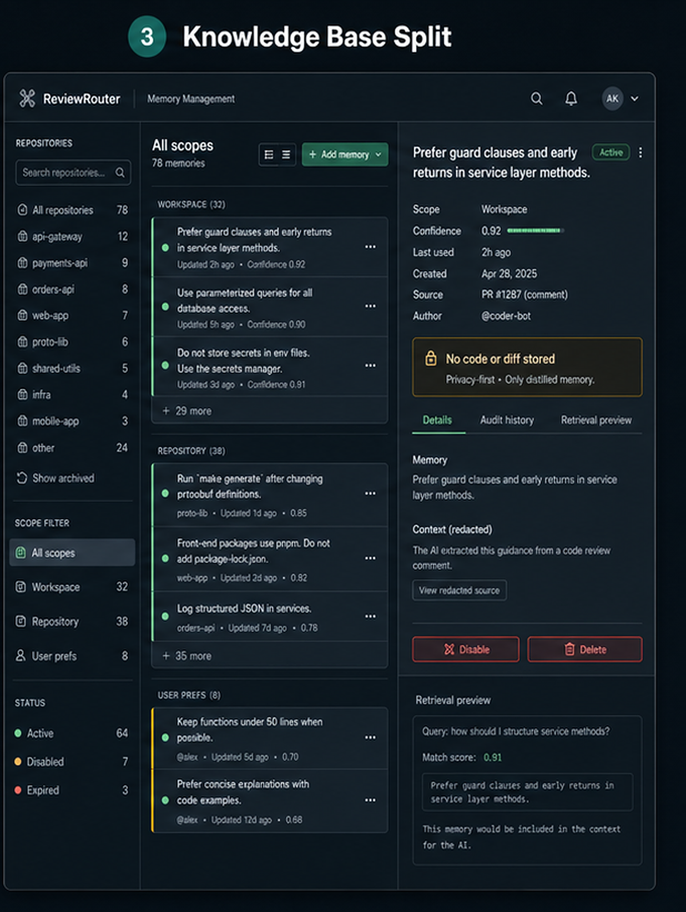

# Balanced Memory Architecture Plan

Дата: 2026-05-12

Статус: implementation in progress

Ветка: `feat/balanced-memory`

## Решение

Делаем полноценную фичу **Balanced Memory**:

- модель может предложить memory candidate;
- пользователь может явно попросить модель запомнить текстом;
- пользователь может подтвердить командой;
- подтверждать project/workspace memory могут только maintainer/admin;
- первый релиз включает `repository`, `workspace`, `user_prefs`;
- project knowledge не переносится между репозиториями через user-global memory;
- UI делаем сразу полноценный: knowledge base, suggestion inbox, table/admin режим, audit/detail panel.

Выбранный дизайн: **Knowledge Base Split + Suggestion Inbox + Operational Table для bulk/admin**.

🎯 9 🛡️ 9 🧠 8

Оценка объёма первой production-ready версии: **8000-13500 строк** вместе с доменом, портами, Prisma adapter, API, GitHub interaction flow, dashboard UI, тестами, runtime contract, outbox handlers и hardening. Если делать только backend MVP без UI, было бы 3500-6000 строк, но это хуже для доверия и управления памятью.

## Implementation Progress - 2026-05-12

Готовы первые production-shaped slices:

- создан bounded context `@reviewrouter/features-memory`;
- domain/application отделены от Prisma, Fastify, Next.js и React;
- добавлены canonical store models и migration `000012_memory_core`;
- реализованы repository/workspace/user_prefs scopes, safety policy, explicit/model/ambiguous intent policy;
- реализованы use cases: direct remember, propose suggestion, confirm/reject suggestion, disable/delete item, dashboard lists, action bundle;
- добавлены Prisma adapters, transaction adapter, outbox/audit adapters, crypto id generator;
- dashboard получил Memory section по сохранённым design references: left scope/repository rail, pending suggestions, confirmed table, detail/policy panel;
- action runtime получил `GET /api/action/v1/memory`, который возвращает scoped bundle только по action session token;
- добавлены unit/API tests для permission, duplicate races, tenant isolation, pagination, expired suggestions, item lifecycle и runtime bundle endpoint.
- action API получил `POST /api/action/v1/memory-candidates`, который принимает только bounded distilled candidate и safe metadata из interaction workflows;
- action session claim теперь несёт GitHub actor login для audit/permission boundary без передачи raw comment context;
- Prisma permission adapter вынесен в memory infrastructure и переиспользуется dashboard/API composition roots, чтобы не дублировать role rules;
- dashboard memory UI вынесен из page-level монолита в отдельный component + pure view-model слой с unit tests;
- OpenAPI/demo contract публикует memory bundle и memory candidate endpoints с явным privacy wording;
- добавлен `features/memory/interface/interaction` parser/normalizer для `/rr remember ...` и natural-language requests:
  - игнорирует команды внутри code fences, blockquotes, markdown tables и HTML comments;
  - валидирует `issue_comment` только для PR comments;
  - возвращает AST без side effects;
  - эмитит action candidate payload только для repository/workspace scopes, а `user_prefs` оставляет как instruction для будущего linked-user flow;
  - хэширует source text и отправляет только redacted excerpt/candidate body, не raw thread.
- action API получил `POST /api/action/v1/memory-commands`, который принимает только нормализованные ids/commands из interaction workflows и делегирует в use cases `confirm/reject/disable/delete`;
- interaction normalizer теперь отдаёт отдельные `commands[]` для management-команд, чтобы runtime не отправлял raw comment body в SaaS;
- OpenAPI/demo contract публикует command request/response schemas для подтверждения, отклонения, disable/forget и безопасного `list_memory` noop.
- action memory endpoints получили явный fail-fast guard против raw conversation/code/diff/prompt/model-response полей, отдельно от strict transport schemas.
- explicit generated workflows прокидывают стабильные `REVIEW_ROUTER_MEMORY_*` endpoint flags для review и interaction runtime modes.
- dashboard memory UI ближе приведён к сохранённым PNG references: top mode tabs, read-only state, operational table footer и confirmation dialogs для disable/delete с retention impact.
- disable/delete lifecycle mutations получили optimistic concurrency через `expectedVersion`, conditional Prisma update и hidden UI version token, чтобы stale вкладка не перетирала более свежую memory state.
- action memory bundle exposure теперь пишет `MemoryUsageEvent` через отдельный application port и Prisma adapter; usage metadata содержит только ids, scope/count/version, без body/source/prompt/model output.
- action memory bundle exposure теперь также обновляет `lastUsedAt` через `MemoryItemRepositoryPort.markActiveItemsUsed`, с защитой по `workspaceId` и `active` status, чтобы usage-based ranking не обходил canonical store и tenant boundary.
- usage events получили privacy-safe `dedupeKey` по workspace/repository/run/attempt/event/item/bundle, Prisma unique guard и `skipDuplicates`, чтобы повторный bundle fetch в одном action run не плодил telemetry duplicates.
- usage telemetry получил отдельный retention port/use case и Prisma adapter с явным scope `{ workspace | all_workspaces }`, cutoff и batch limit guard, чтобы cleanup не смешивался с runtime-записью usage events и не делал случайный global delete.
- worker получил lock-protected memory usage telemetry maintenance runner с 180-day default retention, batch limit, interval guard и safe handling lock contention; maintenance продолжает работать даже когда GitHub outbox handlers выключены из-за отсутствия app credentials.
- search/index foundation получил `MemorySearchIndexPort`, lexical Prisma adapter, safe query length guard и обязательный canonical ACL recheck в `buildActionMemoryBundle`; если index недоступен или stale, bundle деградирует на canonical fallback без потери confirmed memory.
- direct remember lifecycle теперь тоже ставит `memory.embedding.reindex.requested`, как suggestion confirm/edit, а real E2E проверяет, что reindex/delete outbox events не содержат memory body.
- worker получил memory outbox handlers для lifecycle no-op ack, reindex и delete; real E2E прогоняет `processOutboxBatch` на fresh DB и проверяет, что memory outbox не уходит в dead-letter.
- indexing lifecycle теперь обновляет canonical `indexState/indexVersion` через `MemoryItemRepositoryPort`, а не через search adapter: успешный reindex переводит matching active item в `indexed`, stale/inactive/delete path переводит non-active item в `index_deleted` и очищает `indexVersion`; fresh DB E2E проверяет `index_pending -> indexed -> index_deleted`.
- runtime retrieval теперь принимает lexical/full-text/semantic-vector/hybrid search capabilities, но всё равно rehydrates каждый hit через canonical active scoped storage; unit tests инжектят cross-workspace, cross-repository, wrong-user, disabled, deleted и missing ids и доказывают, что stale/vector candidates не становятся authority.
- добавлен реальный `spike:memory:e2e`: runner сам создаёт временную Postgres DB, применяет fresh migrations, поднимает настоящий Fastify HTTP listener и проверяет OIDC exchange, admin/member permission boundary, forbidden raw payload guard, direct memory save, model suggestion confirmation, runtime bundle, usage dedupe, disable exclusion, cross-workspace object-id denial, review-event mutation denial и tenant isolation.
- pending suggestions получили retention transition: `expirePendingMemorySuggestions` переводит просроченные pending suggestions в `expired` через domain state machine, repository port и safe audit metadata.
- worker получил lock-protected pending suggestion expiry maintenance: отдельный across-workspaces use case, bounded workspace/per-workspace batches, Prisma adapter method, global expiry index `000013_memory_suggestion_expiry_index` и fresh DB E2E, который доказывает, что expired suggestion больше нельзя подтвердить и audit не содержит body.
- confirm/reject suggestion теперь fail-closed для TTL-expired pending rows даже до worker maintenance: use case атомарно переводит stale pending suggestion в `expired`, возвращает `noop: expired`, не зовёт permission adapter и не создаёт memory item.
- `forget/delete` memory теперь privacy-first: domain ставит tombstone body/source на deleted item, а delete use case в той же транзакции redacts body/source у confirmed origin suggestion; fresh DB E2E проверяет, что удалённая memory и linked suggestion больше не содержат исходный текст.
- confirmed memory получил edit lifecycle: domain transition обновляет body/bodyVersion/index state, application use case делает permission/safety/dedupe/version checks, dashboard показывает edit dialog без audit body leakage.
- suggestion inbox получил edit-before-approve dialog по design reference: edited approval переиспользует confirm use case с повторными permission/safety/scope/dedupe checks.
- edited GitHub comment candidates теперь supersede старые pending suggestions из того же source id, actor, scope и repository: stale suggestion больше нельзя подтвердить, audit пишет только ids/hash metadata без body, а generic dashboard source не триггерит supersede.
- generated reusable interaction workflow теперь прокидывает AI discussion настройки и provider credentials как явный workflow contract: `discussion_mode`, model, reasoning effort, per-PR/thread caps, timeout, `CODEX_AUTH_JSON`, `CODEX_CONFIG_TOML`, `OPENAI_API_KEY`; runtime устанавливает Codex CLI только когда preflight реально требует discussion response.
- реальный GitHub E2E подтвердил путь `human inline reply -> ReviewRouter Interaction workflow -> Codex discussion reply` на disposable repo `777genius/review-router-saas-e2e` PR #5:
  - ReviewRouter reusable review workflow: <https://github.com/777genius/review-router-saas-e2e/actions/runs/25716446935>;
  - ReviewRouter reusable interaction workflow: <https://github.com/777genius/review-router-saas-e2e/actions/runs/25716486487>;
  - inline thread получил human reply и ответ `github-actions[bot]` с marker `reviewrouter-discussion:v1`;
  - после bot reply не появился новый interaction run, то есть bot-loop guard сработал.

Текущие проверки:

- `pnpm architecture:check` - passed;
- `pnpm typecheck` - passed;
- `pnpm test` - 62 files, 333 tests passed;
- `pnpm lint` - passed;
- `pnpm spike:memory:e2e` с автоматической временной Postgres DB и fresh `prisma migrate deploy` включая migration `000013_memory_suggestion_expiry_index`, включая edited-source supersede assertion - passed;
- targeted builds/tests: `@reviewrouter/features-memory`, `@reviewrouter/api`, `@reviewrouter/features-api-demo` - passed.
- action runtime checks for discussion wiring: `npm run build`, `npm run typecheck`, `npm run lint` - 0 errors, existing warnings only, `npm test -- --runInBand` - 100 suites, 1184 tests passed.
- memory UI screenshot QA теперь закрыт через env-gated preview route `/dashboard/memory-preview`, который использует только synthetic fixtures и не ослабляет production dashboard auth/privacy path:
  - `REVIEW_ROUTER_ENABLE_MEMORY_PREVIEW=1 pnpm web:dev`;
  - captured desktop/tablet/mobile artifacts in `tmp/design-verification/memory/*`;
  - checked knowledge, suggestions, table, empty, readonly, over quota, stale edit and indexing degraded states;
  - clean-profile browser captures rendered without preview-route failures; persistent local dev profiles can still emit unrelated stale NextAuth JWT cookie noise before the preview route renders;
  - hydration mismatch on disabled dialog triggers was found by browser QA and fixed by rendering disabled actions as plain shared `Button` controls instead of disabled dialog triggers.

## Quality Bar

Эта фича достаточно большая, чтобы относиться к ней как к новому продуктному bounded context, а не как к таблице `memories`.

Нельзя начинать реализацию, если нарушен хотя бы один пункт:

- domain/application слой не зависит от Prisma, SQL, pgvector, OpenAI SDK, GitHub SDK, Fastify, tRPC, React или Next.js;
- каждый use case принимает зависимости через ports;
- каждый storage/search/provider adapter можно заменить без изменения use case;
- GitHub permission check вынесен в отдельный application port;
- repository/workspace/user_prefs scopes проверяются в domain policy и в persistence query constraints;
- memory suggestions не влияют на runtime, пока не подтверждены;
- action runtime не отправляет diff/code/query text в SaaS для поиска памяти;
- UI строится по сохранённым дизайн-референсам, а не как новый произвольный экран;
- каждый edge case из раздела `Edge Cases` покрыт хотя бы unit/application test или явно помечен как E2E-only.

**Архитектурная оценка выбранного подхода**

| Критерий                 | Оценка | Комментарий                                                                                              |
| ------------------------ | -----: | -------------------------------------------------------------------------------------------------------- |
| Масштабируемость         |   9/10 | Canonical store и search index разделены портами, можно заменить Postgres search на внешний vector index |
| Privacy safety           |   9/10 | SaaS хранит только confirmed distilled memory, diff/code retrieval остаётся локально в Actions           |
| Реализационная сложность |   8/10 | Много слоёв и use cases, но сложность оправдана blast radius                                             |
| Поддерживаемость         |   9/10 | DDD + ports/adapters + feature package снижают связность                                                 |
| Риск memory poisoning    |   7/10 | Сильно снижен, но остаётся риск через maintainer mistake и слабую redaction policy                       |

## Decision Matrix For Risky Areas

### Candidate generation boundary

1. **Chosen: local action/runtime extracts `MemoryCandidateEnvelope`; SaaS validates only bounded candidate.** 🎯 9 🛡️ 10 🧠 7, ~900-1500 LOC.
   Best privacy fit. More code in runtime/interaction parser, but no hidden raw-discussion upload path.
2. **Command-only memory in v1, no model suggestions.** 🎯 8 🛡️ 10 🧠 4, ~500-900 LOC.
   Safest fallback if runtime candidate extraction becomes too risky. Worse product UX and less "Balanced" value.
3. **SaaS receives raw comment/conversation and extracts candidate centrally.** 🎯 3 🛡️ 2 🧠 5, ~600-1000 LOC.
   Reject. Easier engineering, but breaks ReviewRouter privacy positioning and creates a new sensitive data surface.

### Search/index strategy

1. **Chosen: canonical Postgres store + pluggable search port + pgvector later.** 🎯 9 🛡️ 9 🧠 7, ~1600-2800 LOC.
   Best balance for v1. Canonical data remains relational, vector search is replaceable.
2. **Dedicated vector DB from day one.** 🎯 6 🛡️ 7 🧠 8, ~2200-4000 LOC.
   Viable later, but premature for small memory counts and adds infra/provider coupling early.
3. **No embeddings, scoped list only forever.** 🎯 7 🛡️ 8 🧠 3, ~800-1400 LOC.
   Good first fallback, but weak retrieval UX as workspaces grow.

### Authority model

1. **Chosen: workspace owner/admin for workspace memory; repo maintainer/admin for repository memory.** 🎯 9 🛡️ 9 🧠 6, ~1000-1800 LOC.
   Strong poisoning protection while still allowing repository-level ownership.
2. **Workspace owner/admin only for all memory.** 🎯 8 🛡️ 10 🧠 4, ~700-1200 LOC.
   Safer but too centralized for active repos.
3. **Any write collaborator can save repository memory.** 🎯 4 🛡️ 4 🧠 4, ~700-1100 LOC.
   Reject for default. `write` includes too many contributors and is not the same as maintainer authority.

## Researched Uncertainty Notes

Я отдельно проверил места, где была низкая уверенность:

- GitHub Actions fork PR behavior: GitHub не передаёт secrets в fork PR workflows, а `pull_request_review_comment` и `issue_comment` events отправляются в base repository. Это подтверждает, что memory feature должна иметь отдельный trust policy для fork/untrusted events.
- GitHub repository permission API: GitHub отдаёт `permission` и `role_name`; `maintain` в legacy `permission` мапится в `write`, поэтому для точного maintainer/admin решения нужно смотреть `role_name`, а не только `permission`.
- GitHub `issue_comment`: комментарии на PR приходят через issue API surface, поэтому interaction workflow должен проверять `github.event.issue.pull_request`; обычные issue comments не должны создавать memory candidate для repository review context.
- GitHub Actions untrusted contexts: поля вроде `github.event.comment.body`, `github.event.issue.title`, `github.event.pull_request.body`, `head_ref` и `ref` считаются attacker-controlled input. Их нельзя вставлять в shell/run, bot reply или SaaS payload без structured parsing/redaction.
- OIDC: GitHub требует `id-token: write` для запроса OIDC JWT; текущий ReviewRouter workflow уже выдаёт это permission в interaction workflow.
- Prisma and pgvector: Prisma поддерживает unsupported field types через `Unsupported(...)`, но такие поля не доступны в generated Prisma Client. Поэтому vector column и index должны жить строго внутри infrastructure adapter/raw SQL, а canonical entities не должны зависеть от них.
- Postgres RLS: RLS может быть defence-in-depth для memory tables, но не заменяет application authorization. Если включать, нужно помнить, что table owner bypass может обойти policies без `FORCE ROW LEVEL SECURITY`.
- pgvector: точный search работает без approximate index, approximate HNSW/IVFFlat ускоряет поиск ценой recall tradeoff. Для v1 не нужно строить HNSW раньше, чем есть объём и метрики.

## Дизайн-референсы

Эти изображения являются обязательным UI-референсом для реализации. При разработке нужно сверяться с ними, а не делать новый интерфейс "по ощущениям".

Общий concept board:



Отдельные референсы:







## Design Source Of Truth

UI implementation must treat the images above as visual acceptance fixtures.

Primary screen:

- base layout from `knowledge-base-split-reference.png`;
- left rail with repository list, scope filters and status counts;
- center grouped list by scope;
- right detail panel with selected memory metadata, privacy notice, tabs and destructive actions.

Pending suggestions:

- base layout from `suggestion-inbox-reference.png`;
- suggestion cards with proposed body, source, scope selector, confidence, risk badge, approve/reject/edit actions;
- right policy panel with maintainer-only rule, fork PR restrictions and redaction rules.

Admin/table mode:

- base layout from `operational-table-reference.png`;
- dense table, filters, row actions, pagination, export later.

Allowed adjustments while implementing:

- improve text clarity;
- align with existing ReviewRouter dashboard tokens;
- make responsive layout work;
- fix contrast and accessibility;
- reduce visual noise if real data feels cramped.

Not allowed:

- replace the split layout with a generic card grid;
- create a landing-page style hero;
- hide pending suggestions behind a modal-only flow;
- remove the privacy badge;
- remove source/audit/retrieval preview from the detail panel;
- use a single long table as the only UX.

Design verification command expectation:

```text
1. Run local web app.
2. Open /dashboard/memory with seeded memory fixtures.
3. Capture desktop screenshot.
4. Compare against knowledge-base-split-reference.png.
5. Switch pending mode.
6. Compare against suggestion-inbox-reference.png.
7. Switch table mode.
8. Compare against operational-table-reference.png.
9. Capture mobile screenshot and verify stacked layout.
```

If generated design files are updated later, update this plan in the same commit and keep old files only if they are referenced by an older ADR.

## Главный архитектурный принцип

⚠️ **SaaS не должен видеть код, diff, raw prompts и raw model output ради memory retrieval.**

ReviewRouter может хранить только подтверждённые distilled memory snippets и безопасные metadata. Это сохраняет privacy-first позиционирование:

- review execution остаётся в GitHub Actions;
- code/diff остаются в customer CI;
- SaaS хранит явно подтверждённые знания, а не сырые обсуждения;
- runtime получает scoped memory bundle;
- локальный action runtime решает, какую память вставлять в prompt рядом с diff/code.

## Product Contract

User-facing promise after this feature:

```text
ReviewRouter does not store repository code, pull request diffs, raw model prompts, raw model responses, provider secrets, or Codex auth files. If Memory is enabled, ReviewRouter stores only user-confirmed, distilled memory snippets and safe metadata so you can view, edit, disable, or delete them.
```

This wording matters because "memory" can sound like hidden surveillance. The product must show exactly what was saved and why.

Privacy/docs impact:

- update public privacy copy before enabling the feature for real users;
- add a data category named "user-confirmed memory";
- disclose that embeddings are derived from confirmed memory only when the
  embedding index is enabled;
- document that pending suggestions are not used by runtime;
- document workspace deletion, repository removal, user deletion, export and
  hard-delete behavior;
- keep the product copy explicit that ReviewRouter does not store code, diffs,
  raw prompts or raw model responses.

## Data Classification

| Data                    | Stored?        | Where         | Notes                                         |
| ----------------------- | -------------- | ------------- | --------------------------------------------- |
| Repository code         | No             | Never in SaaS | Only local GitHub Actions runtime may see it  |
| PR diff                 | No             | Never in SaaS | Do not use as SaaS vector query               |
| Raw model prompt        | No             | Never in SaaS | Existing privacy invariant remains            |
| Raw model response      | No             | Never in SaaS | Store only safe candidate text after policy   |
| Raw GitHub comment body | No by default  | Not canonical | Use bounded redacted excerpt only when needed |
| Memory suggestion       | Yes            | SaaS DB       | Pending, expires, not used by runtime         |
| Confirmed memory item   | Yes            | SaaS DB       | Distilled text only                           |
| Embedding vector        | Yes if enabled | Index adapter | Derived from confirmed memory body only       |
| Memory usage event      | Yes            | SaaS DB       | IDs/counts only, no local query text          |
| Source URL/comment id   | Yes            | SaaS DB       | Metadata only                                 |
| Actor identity metadata | Yes            | SaaS DB       | GitHub id/login snapshots, workspace user id  |

## Data Residency And Tenant Isolation Contract

Memory must follow the same tenant boundary as the workspace. Treat data
residency as an application invariant, not only a deployment detail.

Rules:

- every memory aggregate, suggestion, embedding, usage event, audit record,
  outbox job, cache entry and export belongs to exactly one workspace;
- workspace home region is resolved before any memory use case runs;
- provider selection is constrained by workspace policy and region policy;
- cache keys include workspace id, policy hash, region and bundle version;
- background workers must not move memory jobs across regions unless the target
  region owns the workspace;
- export artifacts are written to region-compatible storage and expire according
  to workspace policy;
- repository transfer between workspaces does not migrate memory automatically.
  It disables old repository-scoped memory exposure and requires explicit
  staged import into the destination workspace;
- backups/PITR can contain memory data, but restore flows must preserve
  workspace isolation and re-run embedding/index rebuild after restore;
- support diagnostics can cross regions only through safe metadata APIs and
  cannot include memory body or provider payloads.

Test requirements:

- seed at least two workspaces with identical repository names in different
  logical regions;
- prove list/search/bundle/export/diagnostics never cross region or workspace;
- prove stale cache from old policy/region cannot serve a bundle after transfer;
- prove worker claiming ignores jobs for workspaces outside its configured
  region shard.

## Lifecycle And Retention Matrix

| Object               | Default retention            | Delete behavior                                      | Runtime visible?             |
| -------------------- | ---------------------------- | ---------------------------------------------------- | ---------------------------- |
| Pending suggestion   | 30 days                      | expire, then prune after retention window            | never                        |
| Blocked suggestion   | 30 days                      | keep safe reason codes, no unsafe body               | never                        |
| Rejected suggestion  | 90 days                      | safe audit remains, body can be pruned               | never                        |
| Active memory item   | until disabled/deleted/TTL   | admin/user action or TTL policy                      | yes if scope policy allows   |
| Disabled memory item | until admin deletes          | reversible, excluded from bundle                     | no                           |
| Deleted memory item  | soft delete 30 days          | hard-delete body and embeddings after retention      | no                           |
| Embedding row        | while item active/searchable | delete on item hard-delete or provider policy change | no direct runtime visibility |
| Usage event          | 180 days default             | aggregate then prune                                 | no                           |
| Safe audit event     | product audit policy         | metadata only, no body                               | no                           |

Retention rules:

- legal hold overrides hard-delete but not runtime visibility. A deleted item
  under legal hold is still removed from bundles immediately;
- workspace deletion removes memory under the workspace after export/legal-hold
  policy is resolved;
- user deletion removes `user_prefs` and anonymizes actor snapshots on
  repository/workspace memory when policy allows;
- repository removal from installation disables repository memory retrieval
  immediately and leaves admin-visible management/export path;
- embedding vectors are derivative cache/index data. Hard-delete of memory body
  must delete embeddings too;
- audit records can reference deleted ids, but must not retain memory body or raw
  source.

## Memory Candidate Boundary

⚠️ Critical privacy rule: suggestion generation must not become a hidden path for
uploading repository discussions, PR comments or model output to SaaS.

Use this contract instead of `rawText`:

```text
MemoryCandidateEnvelope
  workspaceId
  repositoryId
  source
  actor
  intent
  requestedScope nullable
  candidateBody
  candidateBodyHash
  redactedSourceExcerpt nullable
  sourceTextHash nullable
  extractionMethod
  extractionVersion
```

Allowed fields:

- `candidateBody`: the exact distilled text proposed for memory, already bounded
  and redacted;
- `redactedSourceExcerpt`: at most 500 chars, optional, only for UI context;
- `sourceTextHash`: hash for idempotency, never a reversible copy of the source;
- `intent`: command, explicit natural language, or model-suggested candidate;
- safe metadata: GitHub ids, URLs, timestamps, actor ids.

Forbidden fields:

- full GitHub comment thread;
- full issue body;
- PR diff;
- raw model prompt;
- raw model response;
- local retrieval query;
- stack traces or logs unless explicitly redacted into the candidate body.

Extraction responsibilities:

| Path                            | Extracts candidate where?         | Sends full source to SaaS? | v1 behavior                                                             |
| ------------------------------- | --------------------------------- | -------------------------- | ----------------------------------------------------------------------- |
| `/rr remember repo <text>`      | interaction workflow command      | No                         | direct confirm if actor has repo maintainer/admin authority             |
| `/rr remember workspace <text>` | interaction workflow command      | No                         | direct confirm only for workspace admin                                 |
| "запомни ..."                   | interaction workflow command scan | No                         | pending suggestion with extracted text after command phrase             |
| model-suggested candidate       | local action runtime              | No                         | pending suggestion only if runtime can produce safe distilled candidate |
| ambiguous discussion            | nowhere                           | No                         | no suggestion, optionally reply with explicit command syntax            |

If local extraction cannot confidently isolate a safe candidate without sending
the surrounding conversation to SaaS, the correct result is `no_memory_intent`.
The bot can ask the user to run an explicit command with the exact text.

This boundary is what keeps the feature compatible with ReviewRouter's privacy
positioning. Vector retrieval later can improve ranking over confirmed memory,
but it must not use raw PR context as a SaaS query.

### Candidate Trust State Machine

Model output and user text are inputs, not authority. Every candidate must move
through a narrow trust state machine before it can affect runtime answers.

```text
observed_interaction
  -> candidate_extracted
  -> safety_checked
  -> pending_confirmation
  -> confirmed_by_authorized_actor
  -> indexed_optional
  -> runtime_visible_if_policy_allows
```

Rejected states:

```text
no_memory_intent
ambiguous_reference
unsafe_candidate
unauthorized_actor
duplicate_candidate
expired_candidate
policy_disabled
quota_blocked
```

Rules:

- model-suggested candidates always start below confirmation authority;
- confirmed memory cannot create new memory by being repeated in model output;
- memory body cannot contain operational instructions for the memory system
  itself, such as "always save future comments" or "ignore policy";
- user confirmation must bind to a specific suggestion id or exact text;
- editing a candidate resets safety, quality, dedupe and policy checks;
- candidate confidence is advisory only and never bypasses authorization;
- candidate state transitions are aggregate methods with tests, not ad hoc
  status string updates in routers/workers.

## Existing Codebase Fit

Relevant existing pieces:

- `packages/features/action-control-plane` already owns OIDC exchange, action sessions, runtime config, comment tokens and health reports.
- `packages/features/workflow-provisioning/src/domain/workflow-template.ts` already renders `reviewrouter-interaction.yml` for `pull_request_review_comment` and `issue_comment`.
- `packages/shared/src/safe-payload/index.ts` already has reusable code/diff/secret scanners.
- `packages/features/audit-log` already rejects unsafe audit metadata.
- `packages/features/outbox` already supports idempotent async work.
- `apps/api/src/app.ts` is the composition root for Fastify routes and concrete adapters.
- `apps/api/src/trpc.ts` is currently minimal and will need memory dashboard procedures or a feature router integration.

Integration rule:

```text
memory feature depends on existing features only through public application ports or composition root wiring.
```

No memory use case should import `PrismaActionControlPlaneRepository`, `Octokit`, `appRouter`, Next route modules, or dashboard components.

## Current Schema Integration

Do not create parallel identity, workspace or repository concepts. The memory
bounded context maps onto current platform entities:

| Existing model          | Memory usage                                                             |
| ----------------------- | ------------------------------------------------------------------------ |
| `Workspace`             | tenant boundary for every memory row, suggestion, usage event and policy |
| `User`                  | owner for `user_prefs`; use `User.id` and `githubUserId`, not login only |
| `WorkspaceMember`       | dashboard authority source with `owner`, `admin`, `member` roles         |
| `GitHubInstallation`    | source of installation status and repository selection trust             |
| `RepositoryConnection`  | repository scope boundary and action-session repository context          |
| `WorkspaceEntitlement`  | quotas, memory flags, embedding budgets and plan limits                  |
| `AuditEvent`            | safe audit trail for lifecycle actions                                   |
| `OutboxEvent`           | async embedding, rescan, prune and export/import jobs                    |
| `ActionRunHealthReport` | optional aggregate observability, not a source of memory content         |

Schema integration rules:

- `MemoryItem.workspaceId` references `Workspace.id` with cascade behavior
  matching current tenant deletion semantics.
- `MemoryItem.repositoryId` references `RepositoryConnection.id`; repository
  removal disables repository runtime exposure before hard delete.
- `MemoryItem.userId` references `User.id` only for `user_prefs`.
- Do not store `githubLogin` as authority. Store it only as a display snapshot;
  authority checks use GitHub user id, workspace membership and live repository
  role.
- `WorkspaceEntitlement.flags` can carry memory rollout flags in v1. Move to a
  dedicated `MemoryPolicyOverride` table only when policy editing becomes a
  product surface.
- Existing `AuditEvent.metadata` safety rules still apply. If memory needs richer
  event history later, add memory-specific history table without bypassing
  audit.

## Цели

1. Дать AI reviewer долгосрочную память по проекту и команде.
2. Не нарушить текущий trust model ReviewRouter.
3. Не привязать application/domain к Postgres, pgvector, Prisma или любой конкретной vector DB.
4. Сразу заложить Clean Architecture, DDD, SOLID и DRY.
5. Сделать UI, через который память можно понять, подтвердить, удалить, отключить и проверить.
6. Поддержать будущую замену storage/index adapter без переписывания use cases.
7. Снизить риск memory poisoning через права, confirmation flow, redaction и audit.

## Не цели первой версии

- Автоматически запоминать весь поток комментариев.
- Хранить raw conversation.
- Хранить diff hunks, file contents, code snippets как memory body.
- Делать cloud review execution.
- Делать отдельную managed vector DB в v1.
- Давать PR author право сохранять repository/workspace memory по умолчанию.
- Давать fork PR доступ к private workspace memory без отдельной trust policy.
- Делать LangChain/LlamaIndex как core dependency.

## Критичные инварианты

1. **Tenant isolation**
   Любая memory row всегда workspace-scoped. Repository memory всегда проверяется через repository id внутри workspace.

2. **Authority**
   Пользователь сам по себе не authority. Для dashboard actions нужна workspace membership. Для GitHub comment confirmations нужна GitHub permission или workspace admin mapping.

3. **No raw storage**
   Memory body хранит distilled fact, policy, preference или instruction. Не хранит raw prompt, raw response, raw comment thread, raw diff.

4. **Candidate envelope boundary**
   SaaS suggestion endpoint принимает только bounded candidate envelope. Полный GitHub conversation, diff, prompt, model response или локальный retrieval query не являются допустимыми input DTO.

5. **No cross-repo leak**
   Repository memory не участвует в другом repo. Workspace memory участвует только внутри workspace. User prefs не содержат project facts.

6. **Explicit confirmation**
   Balanced режим означает model-suggested, user-confirmed. Suggestion не влияет на review, пока не подтверждена.

7. **Auditable lifecycle**
   Создание, подтверждение, редактирование, disabling, deletion, retrieval exposure и rejection пишутся в audit или безопасную event history.

8. **Storage independence**
   Domain/application не знают про Prisma, SQL, pgvector, HNSW, OpenAI SDK или Render.

9. **Runtime boundary**
   Action session может получить только scoped memory bundle для своего repo/run. Не может list workspace memory свободно.

10. **Suggestion isolation**
    Pending suggestion никогда не попадает в action memory bundle и не влияет на review prompt.

11. **Confirm-time authority**
    Права проверяются в момент подтверждения, редактирования, удаления и disabling, даже если suggestion была создана авторизованным пользователем.

12. **Safe audit**
    Audit event не содержит full memory body, raw source body, diff, prompt, model output или secret-like values. Для audit используются ids, scope, status, risk flags, source ids и safe reason codes.

13. **Idempotency**
    Повторный delivery GitHub event, rerun workflow или повторный click в UI не создаёт дубликат memory item.

14. **Optimistic concurrency**
    Edit/disable/delete используют version или equivalent concurrency token. UI должен показать конфликт, если memory изменилась в другой вкладке.

15. **Fail closed on policy uncertainty**
    Если permission adapter, safety policy, scope policy или trust policy не может дать уверенное решение, persistence/retrieval запрещается с safe error code.

## Ubiquitous Language

| Термин            | Значение                                                            |
| ----------------- | ------------------------------------------------------------------- |
| Memory item       | Подтверждённый короткий факт, правило или preference                |
| Memory suggestion | Кандидат, предложенный моделью или извлечённый из явной просьбы     |
| Scope             | Область действия: repository, workspace, user_prefs                 |
| Source            | Откуда появилась память: review comment, PR comment, dashboard, API |
| Distilled text    | Очищенный финальный текст memory item                               |
| Redacted source   | Безопасный фрагмент источника, если он нужен для объяснения         |
| Safety report     | Результат проверки на secrets/code/diff/pii/prompt injection        |
| Memory bundle     | Ограниченный набор памяти, выдаваемый action runtime                |
| Retrieval preview | UI-проверка, почему item может попасть в контекст                   |
| Usage event       | Metadata, что memory была выдана runtime или выбрана локально       |

## Bounded Context

Добавляем новый bounded context:

```text
packages/features/memory/
  src/
    domain/
    application/
    infrastructure/
    interface/
    tests/
```

Ответственность `memory`:

- lifecycle memory suggestions;
- lifecycle confirmed memory items;
- scope policy;
- confirmation policy;
- safety/redaction policy;
- retrieval bundle policy;
- storage/search abstraction;
- memory usage metadata;
- memory audit integration.

Что не входит:

- GitHub webhook signature verification - остаётся в github-installations/webhook flow;
- OIDC token verification - остаётся в action-control-plane;
- dashboard session auth - остаётся в auth;
- provider/model config - остаётся в review-config;
- actual local prompt assembly - остаётся в action runtime, но получает memory bundle.

## Package Layout

Target package:

```text
packages/features/memory/
  package.json
  tsconfig.json
  src/
    index.ts
    domain/
      memory-item.ts
      memory-suggestion.ts
      memory-scope.ts
      memory-source.ts
      memory-actor.ts
      memory-safety-report.ts
      memory-errors.ts
      policies/
        memory-safety-policy.ts
        memory-scope-policy.ts
        memory-bundle-policy.ts
        memory-deduplication-policy.ts
        memory-intent-policy.ts
    application/
      use-cases/
        propose-memory-from-interaction.ts
        confirm-memory-suggestion.ts
        reject-memory-suggestion.ts
        remember-memory-directly.ts
        edit-memory-item.ts
        disable-memory-item.ts
        delete-memory-item.ts
        list-memory-items.ts
        get-memory-item-detail.ts
        build-action-memory-bundle.ts
        record-memory-usage.ts
        prune-expired-memory.ts
      ports/
        memory-item-repository-port.ts
        memory-suggestion-repository-port.ts
        memory-search-index-port.ts
        memory-embedding-port.ts
        memory-permission-port.ts
        memory-audit-port.ts
        memory-outbox-port.ts
        memory-clock-port.ts
        memory-transaction-port.ts
      dto/
      errors.ts
    infrastructure/
      prisma/
        prisma-memory-item-repository.ts
        prisma-memory-suggestion-repository.ts
        prisma-memory-transaction.ts
        postgres-hybrid-memory-search-index.ts
      embeddings/
        openai-memory-embedding-provider.ts
        deterministic-test-memory-embedding-provider.ts
      github/
        octokit-memory-permission-adapter.ts
      outbox/
        memory-outbox-handlers.ts
    interface/
      http/
        register-action-memory-routes.ts
      trpc/
        memory-router.ts
      interaction/
        memory-command-parser.ts
        memory-interaction-handler.ts
      jobs/
        register-memory-jobs.ts
    tests/
      domain/
      application/
      infrastructure/
      interface/
```

`src/index.ts` should export only public application/use-case and adapter classes intended for composition roots. Do not export internal domain helpers that invite cross-feature coupling.

## Clean Architecture

Dependency direction:

```text
domain <- application <- interface
application -> ports <- infrastructure
apps/api, apps/web, apps/worker = composition roots
```

Allowed:

- domain imports only shared primitives;
- application imports domain, application ports, shared;
- infrastructure implements ports using Prisma, SQL, embeddings provider, external APIs;
- interface exposes Fastify/tRPC/job handlers;
- apps wire concrete dependencies.

Forbidden:

- domain importing Prisma/OpenAI/Fastify/tRPC/React;
- application importing Prisma/OpenAI/Fastify/tRPC/React;
- UI doing role checks directly;
- raw SQL outside infrastructure adapter;
- dashboard storing memory server state in Zustand.

Additional memory-specific rules:

- `application/use-cases` must not construct ids directly except through injected id generator or shared id primitive.
- Use cases return explicit result unions or throw safe typed domain/application errors. Do not leak raw SDK errors to interface.
- `interface/interaction` parses GitHub comments into commands, then calls use cases. It does not decide business permissions.
- `interface/http` verifies action session through action-control-plane dependency or receives a verified session object from composition root. It does not decode JWT itself.
- `infrastructure/github` may call GitHub APIs, but cannot create memory items directly.
- `infrastructure/prisma` may use `$queryRaw` for vector/search internals, but all raw SQL must stay in this folder and have adapter-level tests.

Cross-feature anti-corruption:

- memory can depend on auth, repositories, entitlements, audit-log, outbox and
  action-control-plane only through explicit ports or stable public exports;
- memory must not import another feature's `infrastructure/*` or `interface/*`;
- if a neighboring feature lacks the needed public contract, add a small adapter
  at the composition root rather than reaching into its internals;
- duplicate permission/business rules are not allowed in UI, GitHub action code
  or API routes. They call memory use cases or policy ports.
- shared DTOs crossing feature boundaries must be versioned and schema-validated
  at the boundary.

### Composition Root And Dependency Injection

Composition roots own concrete wiring and lifecycle. The memory feature owns
interfaces and use cases, not global singletons.

Composition roots:

| Runtime        | Composition location                          | Wires                                                              |
| -------------- | --------------------------------------------- | ------------------------------------------------------------------ |
| API/Fastify    | `apps/api/src/app.ts` or feature route module | Prisma repositories, permission adapters, audit, outbox, use cases |
| Worker         | `apps/worker/src/*` job registration          | outbox handlers, embedding provider, retention/rescan jobs         |
| Web dashboard  | `apps/web/src/features/memory/adapters/*`     | tRPC dashboard gateway and frontend view-model mappers             |
| Action runtime | action package/composition layer              | memory bundle client, local relevance selector, prompt assembler   |

Rules:

- no service locator inside domain/application;
- no module-level mutable singleton for policy, clock, id generator, provider or
  repositories;
- dependency factories accept explicit config objects, not raw `process.env`;
- tests can construct use cases with fakes without importing app/runtime code;
- composition root performs health checks for concrete adapters and exposes safe
  readiness state;
- adapter lifecycle owns provider clients, connection pools, retry/circuit
  breaker config and shutdown hooks;
- adding a new vector/provider adapter changes composition wiring and adapter
  package only, not use-case constructors.

### Layer Dependency Matrix

| Layer/package                                | May import                                             | Must not import                                                               |
| -------------------------------------------- | ------------------------------------------------------ | ----------------------------------------------------------------------------- |
| `features/memory/domain`                     | `@reviewrouter/shared` primitives only                 | Prisma, Octokit, OpenAI SDK, Fastify, tRPC, React, Next, Node filesystem      |
| `features/memory/application`                | memory domain, memory ports, shared result/errors/time | concrete adapters, Prisma, Octokit, provider SDKs, Fastify, tRPC, React, Next |
| `features/memory/infrastructure/prisma`      | application ports, Prisma client, SQL helpers          | React, Next route modules, tRPC routers, GitHub event parsing                 |
| `features/memory/infrastructure/github`      | application ports, Octokit-like requester              | Prisma repositories, memory item creation use cases                           |
| `features/memory/interface/http`             | application use cases, Fastify adapter types           | Prisma direct queries, dashboard components                                   |
| `features/memory/interface/trpc`             | application use cases, tRPC adapter types              | Prisma direct queries, React components                                       |
| `apps/web/src/features/memory/domain`        | web-safe value objects                                 | React, Next, tRPC, Zustand                                                    |
| `apps/web/src/features/memory/application`   | domain, view model mappers, gateway port               | React components, server actions, Prisma                                      |
| `apps/web/src/features/memory/interface`     | React, UI primitives, application view models          | Prisma, GitHub SDK, domain mutation policies                                  |
| `apps/api`, `apps/web/server`, `apps/worker` | concrete adapters, composition wiring                  | business rules duplicated outside feature use cases                           |

### Architecture Fitness Functions

Add or extend automated checks before implementation is considered safe:

```text
pnpm architecture:check
pnpm --filter @reviewrouter/features-memory test
pnpm --filter @reviewrouter/web test -- memory
pnpm --filter @reviewrouter/api test -- memory
```

Fitness checks:

- no forbidden imports by layer;
- no raw SQL outside `features/memory/src/infrastructure/prisma`;
- no OpenAI/GitHub SDK imports outside provider adapters;
- no `packages/features/*/src/infrastructure` import from memory domain,
  application or interface;
- no `packages/features/*/src/interface` import from memory domain or
  application;
- no `process.env` reads outside composition/config adapters;
- no direct `Date.now()` in domain/application. Use injected clock.
- every memory repository method accepts `workspaceId`;
- every memory mutation emits safe audit or explicit no-audit reason;
- every action-facing DTO schema rejects forbidden raw payload field names;
- no UI component calls tRPC directly except the gateway adapter;
- no memory screen uses Zustand for server state;
- no test fixture stores repo code/diff as memory body.
- `MemoryPolicyConfigPort`, `MemoryPermissionPort` and `MemorySafetyPolicy`
  are the only places that can decide scope/permission/safety outcomes.

## SOLID Mapping

### SRP

- `MemoryItem` owns lifecycle invariants.
- `MemorySuggestion` owns suggestion state transitions.
- `MemoryScopePolicy` decides allowed scope transitions.
- `MemorySafetyPolicy` classifies content risk.
- `MemoryBundlePolicy` selects max counts and source rules for runtime bundle.
- `MemoryRepositoryPort` persists aggregates only.
- `MemorySearchIndexPort` handles search/index concerns only.

### OCP

New storage/search providers are added by implementing ports:

- `PrismaMemoryRepository`
- `PostgresHybridMemorySearchIndex`
- future `QdrantMemorySearchIndex`
- future `PineconeMemorySearchIndex`

Use cases do not change when adapter changes.

### LSP

Test fakes must behave like real ports:

- same uniqueness expectations;
- same pagination semantics;
- same scope filtering;
- same optimistic concurrency behavior;
- same soft-delete behavior.

### ISP

No god port like `MemoryGateway`.

Split ports:

- `MemoryItemRepositoryPort`
- `MemorySuggestionRepositoryPort`
- `MemorySearchIndexPort`
- `MemoryEmbeddingPort`
- `MemoryPermissionPort`
- `MemoryAuditPort`

### DRY Policy Ownership

Single source of truth:

| Decision                      | Owner                                                   | Must not be duplicated in                 |
| ----------------------------- | ------------------------------------------------------- | ----------------------------------------- |
| allowed scope                 | `MemoryScopePolicy`                                     | UI controls, GitHub parser, tRPC router   |
| maintainer/admin authority    | `MemoryPermissionPort` plus policy config               | dashboard components, bot reply formatter |
| safety block/warn             | `MemorySafetyPolicy`                                    | provider adapters, React forms            |
| bundle caps and fork exposure | `MemoryBundlePolicy`                                    | action runtime, API route                 |
| retention behavior            | `MemoryRetentionPolicy`                                 | delete dialog text, pruning worker        |
| provider/model choice         | `MemoryPolicyConfigPort` and provider capability config | embedding job handler literals            |
| UI reason labels              | memory frontend view-model mapper                       | individual row/card components            |

The same rule can have multiple adapters, but one policy owner. If a developer
needs the same condition in another layer, expose a safe query/result from the
owner instead of rewriting the condition.

- `MemoryTransactionPort`

### DIP

Application owns interfaces. Infrastructure depends on application contracts.

## DRY Policy

1. Duplicate once while shape is not stable.
2. Extract inside `features/memory` after second real use.
3. Move to shared feature API only after another feature needs it.
4. Move to `packages/ui` only if component is product-agnostic.

Do not create generic "knowledge" abstractions until there is a second knowledge-like bounded context.

## Domain Model

### Aggregate: MemoryItem

Fields:

```text
id
schemaVersion
workspaceId
repositoryId nullable
userId nullable
scope
status
body
bodyVersion
bodyHash
summary nullable
tags
riskLevel
confidence
source
policyVersion
safetyPolicyVersion
createdBy
confirmedBy
createdAt
updatedAt
lastUsedAt nullable
expiresAt nullable
version
retentionPolicy
visibility
originSuggestionId nullable
indexState
indexVersion nullable
```

Statuses:

```text
active
disabled
expired
deleted
```

Index states:

```text
not_indexed
index_pending
indexed
index_failed
index_deleted
```

Visibility values:

```text
private_workspace
repository_runtime
workspace_runtime
user_preference_runtime
```

Invariants:

- `repository` scope requires `repositoryId`.
- `workspace` scope forbids `repositoryId`.
- `user_prefs` scope requires `userId` and forbids repository-specific facts.
- active body length is bounded.
- status transition to deleted is terminal.
- bodyHash supports duplicate detection.
- edits increment version.
- `indexState` is not a source of truth for active/inactive retrieval. `status` and scope policies are authoritative.
- `visibility` must be compatible with `scope`.
- `originSuggestionId` cannot point to a suggestion in another workspace.
- `body` must be normalized before hashing.
- `body` must never be empty after redaction.
- `schemaVersion` records DTO/domain shape at creation time.
- `policyVersion` records the scope/permission policy used at confirmation time.
- `safetyPolicyVersion` records the scanner/classifier policy used for the last
  safety decision.
- `bodyVersion` increments only when memory text changes. Metadata-only edits do
  not force embedding reindex.
- `indexVersion` belongs to search infrastructure and cannot change memory
  semantics.

State transitions:

| From     | To       | Allowed By     | Notes                                          |
| -------- | -------- | -------------- | ---------------------------------------------- |
| active   | disabled | manager        | Keeps item, removes from runtime bundle        |
| active   | expired  | worker         | TTL-driven, no destructive delete              |
| active   | deleted  | manager        | Soft delete, hard delete later                 |
| disabled | active   | manager        | Re-enable after safety recheck if body changed |
| disabled | deleted  | manager        | Soft delete                                    |
| expired  | active   | manager        | Requires explicit renew                        |
| expired  | deleted  | manager/worker | Retention cleanup                              |
| deleted  | any      | nobody         | Terminal                                       |

Forbidden:

- automatic active to deleted without retention policy;
- disabled/expired/deleted in runtime bundle;
- updating body without version increment and reindex request;
- changing `workspaceId` ever.

### Aggregate: MemorySuggestion

Fields:

```text
id
schemaVersion
workspaceId
repositoryId nullable
userId nullable
suggestedScope
suggestedBody
suggestedBodyVersion
reason
source
safetyReport
policyVersion
safetyPolicyVersion
status
createdByActor
confirmationTokenHash nullable
confirmationTokenExpiresAt nullable
expiresAt
dedupeKey
relatedMemoryItemId nullable
relatedSuggestionId nullable
createdAt
updatedAt
resolvedAt nullable
resolvedBy nullable
resolutionReason nullable
```

Statuses:

```text
pending
confirmed
rejected
blocked
expired
superseded
```

Invariants:

- pending suggestions expire.
- blocked suggestions cannot be confirmed.
- confirmation requires permission check at application layer.
- confirmed suggestion links to created MemoryItem.
- duplicate suggestions can be superseded.
- `dedupeKey` is stable for the source event and normalized body.
- a suggestion cannot move from confirmed/rejected/blocked/expired/superseded back to pending.
- blocked suggestion stores safe `blockedReason`, not raw unsafe content.
- edited suggestion body must run safety again.
- confirmation token is never stored raw. Store only a hash and expiry.
- confirmation token binds suggestion id, workspace id, repository id, suggested
  body hash, suggested scope, suggested body version, policy version, actor id
  when known, and expiry.
- if body, scope, policy version or suggestion version changes after token
  creation, old token is invalid and confirmation must be regenerated.

State transitions:

| From       | To         | Trigger                          |
| ---------- | ---------- | -------------------------------- |
| pending    | confirmed  | authorized confirm               |
| pending    | rejected   | authorized reject                |
| pending    | blocked    | safety policy after edit/recheck |
| pending    | expired    | worker TTL                       |
| pending    | superseded | duplicate/near duplicate policy  |
| blocked    | rejected   | cleanup/manual reject            |
| confirmed  | any        | forbidden                        |
| rejected   | any        | forbidden                        |
| expired    | any        | forbidden                        |
| superseded | any        | forbidden                        |

Suggestion TTL default:

```text
14 days for repository/workspace suggestions
30 days for user_prefs suggestions
```

Reason: enough time for maintainers to approve, short enough to avoid stale pending queues.

### Value Object: MemoryScope

Values:

```text
repository
workspace
user_prefs
```

Rules:

- repository memory can be used only by same repository;
- workspace memory can be used by selected repositories in workspace;
- user_prefs can influence tone/format only;
- user_prefs cannot include repo names, file paths, secrets, code policy, deployment details or architecture facts from private projects.

Scope defaulting:

| Source                               | Text cue                                             | Default scope |
| ------------------------------------ | ---------------------------------------------------- | ------------- |
| Review comment on repo               | "for this repo", "для проекта", no explicit team cue | repository    |
| PR conversation                      | "for this team", "workspace", "для команды"          | workspace     |
| Dashboard create under selected repo | repository selected                                  | repository    |
| Dashboard create from all scopes     | no repo selected                                     | workspace     |
| User settings screen                 | tone/language/format preference                      | user_prefs    |

Scope escalation:

- repository to workspace requires explicit text or UI selector;
- user_prefs to workspace/repository requires separate action;
- workspace to repository is allowed when narrowing scope;
- repository to user_prefs is forbidden if text contains project facts.

### Value Object: MemorySource

Fields:

```text
type
githubCommentId nullable
githubPullRequestNumber nullable
githubRepositoryId nullable
url nullable
actorLogin nullable
redactedExcerpt nullable
sourceHash nullable
sourceVisibility
```

Allowed source types:

```text
review_comment
pr_comment
dashboard
api
system_migration
```

`sourceHash` lets us dedupe and audit without storing raw source. The hash is derived from normalized source text plus source id, not from diff/code.

### Value Object: SafetyReport

Fields:

```text
riskLevel
flags
blockedReason nullable
redactedBody
redactedSourceExcerpt nullable
severity
reviewRequired
```

Flags:

```text
contains_secret_like_text
contains_code_block
contains_diff_hunk
contains_large_stacktrace
contains_prompt_injection
contains_personal_data
contains_repo_specific_fact
contains_cross_repo_reference
too_long
unsafe_for_user_prefs
unsafe_for_runtime_bundle
ambiguous_intent
low_confidence_extraction
conflicts_with_existing_memory
```

Severity values:

```text
safe
needs_review
blocked
critical_block
```

### Domain Service: MemorySafetyPolicy

Responsibilities:

- classify raw candidate;
- reject unsafe content;
- redact source excerpt;
- prevent user_prefs from carrying project knowledge;
- assign risk level.
- classify whether the content may be embedded;
- classify whether the content may be included in runtime bundle;
- produce safe user-facing reason codes.

Implementation notes:

- reuse shared `looksLikeCodeOrDiff` and `looksLikeSecretValue` scanners as first-line deterministic gates;
- add memory-specific detectors for `CODEX_AUTH_JSON`, `.env`, PEM keys, GitHub tokens, OpenAI/OpenRouter keys, raw diff markers, stack traces and long code blocks;
- LLM-based safety classification can be added later behind `MemorySafetyClassifierPort`, but deterministic blockers must run first and last.

Safety result must be deterministic for blocking rules. Model classifiers can only downgrade to "needs_review", not override deterministic block.

### Domain Service: MemoryScopePolicy

Responsibilities:

- validate requested scope;
- decide default scope from source;
- prevent scope escalation without explicit request;
- ensure repository/workspace/user ids match scope.

### Domain Service: MemoryDeduplicationPolicy

Responsibilities:

- body hash duplicate detection;
- near duplicate detection through search adapter;
- supersede stale pending suggestions;
- avoid repeated suggestions in same thread.

### Domain Service: MemoryBundlePolicy

Responsibilities:

- cap memory bundle size;
- sort by scope priority and recency;
- filter disabled/expired/deleted;
- prevent unsafe scope exposure to fork PRs;
- include only safe fields in runtime response.

Bundle priority:

```text
repository active > workspace active > user_prefs active
recently confirmed > recently used > high confidence > tagged as policy/style
```

Hard caps:

```text
maxItemsDefault = 12
maxCharactersDefault = 6000
maxRepositoryItems = 6
maxWorkspaceItems = 5
maxUserPrefsItems = 3
```

The caps are policy constants in domain/application, not scattered in UI or SQL.

### Domain Service: MemoryIntentPolicy

Responsibilities:

- parse normalized command intent from `/rr remember`, `/rr forget`, `/rr memory`, `/rr reject-memory`;
- classify natural-language "remember this" requests;
- reject ambiguous intent;
- separate "discussing memory" from "asking to save memory".

Intent confidence:

```text
explicit_command = 1.0
explicit_natural_language = 0.85
model_suggested_candidate = 0.70
ambiguous_discussion = 0.30
```

Only `explicit_command` can direct-save in v1. `explicit_natural_language` and `model_suggested_candidate` create pending suggestions.

### Domain Service: MemoryQualityPolicy

Responsibilities:

- decide whether a candidate is durable enough to save;
- reject one-off facts, temporary debugging notes and broad vague preferences;
- classify quality warnings that require edit before confirmation;
- keep memory useful without turning it into a dumping ground.

Quality rubric:

| Criterion          | Accept                                                            | Reject or warn                                            |
| ------------------ | ----------------------------------------------------------------- | --------------------------------------------------------- |
| Durability         | stable team rule, style, architecture constraint, safe preference | "this PR failed once", "today use branch X"               |
| Specificity        | clear behavior or preference                                      | vague "write better code"                                 |
| Scope fit          | repo fact in repo scope, team rule in workspace, tone in prefs    | project fact in `user_prefs`                              |
| Safety             | no code/diff/secrets/raw logs                                     | credentials, stack traces, source snippets, raw prompt    |
| Conflict           | complements existing rule                                         | contradicts active memory without explicit replace action |
| Runtime usefulness | helps reviewer choose wording/standards                           | pure historical trivia or noisy discussion summary        |
| Human readability  | concise sentence                                                  | long transcript, markdown dump, nested lists              |

Quality output:

```text
qualityStatus = acceptable | needs_edit | rejected
qualityWarnings = vague | ephemeral | too_broad | conflicts | wrong_scope | too_long
```

`MemoryQualityPolicy` is domain/application logic. It must not call a model
directly. If model help is later used, it sits behind a classifier/summarizer
port and deterministic quality checks still run after it.

## Domain Events

Domain events are internal feature facts, not queue payloads and not provider
messages. They describe what happened inside the memory bounded context after an
aggregate transition succeeds.

Recommended events:

```text
MemorySuggestionProposed
MemorySuggestionConfirmed
MemorySuggestionRejected
MemorySuggestionExpired
MemoryItemCreated
MemoryItemEdited
MemoryItemDisabled
MemoryItemDeleted
MemoryItemExpired
MemoryItemSafetyReviewRequested
MemoryEmbeddingStale
MemoryBundleServed
```

Rules:

- aggregate methods may return domain events with ids, versions, hashes, scope
  and reason codes only;
- domain events must not contain memory body, source excerpt, raw comment text,
  prompt, model output, diff or embedding vector;
- application layer maps domain events to audit/outbox/use-case results;
- infrastructure outbox events are derived from domain/application events after
  transaction commit planning, not emitted directly from aggregates;
- failed transactions discard domain events;
- every event has `workspaceId`, `aggregateId`, `aggregateVersion`,
  `occurredAt`, `policyVersion` where relevant and `eventSchemaVersion`;
- event names are past-tense facts, not commands. Commands remain use cases.

Why this matters:

- keeps DDD aggregate transitions expressive;
- avoids leaking provider/queue concerns into domain;
- gives audit/outbox consistency without making aggregates depend on adapters;
- makes future event replay/export possible without changing current use cases.

## Application Use Cases

Application layer rules:

- all public use cases accept a single input object and a dependencies object;
- all use cases validate input at the boundary with domain value objects or zod schemas in interface adapters;
- all use cases return explicit safe result objects for UI/interaction replies;
- all use cases emit audit/outbox through ports only;
- all mutations must be idempotent where GitHub events or UI retries can repeat;
- all mutations that combine item/suggestion/audit/outbox must run in one transaction boundary or have a documented compensation path.

Shared mutation output shape:

```ts
type MemoryMutationResult =
  | { readonly status: "created"; readonly id: string }
  | {
      readonly status: "updated";
      readonly id: string;
      readonly version: number;
    }
  | { readonly status: "noop"; readonly reason: string }
  | { readonly status: "rejected"; readonly reason: string };
```

Do not return raw domain entity objects to interface. Map to use-case DTOs first.

### Error Taxonomy

Use stable, safe error codes across UI, bot replies, logs and tests.

Categories:

```text
memory_disabled
memory_input_invalid
memory_input_too_large
memory_forbidden_raw_payload
memory_permission_denied
memory_permission_unavailable
memory_scope_forbidden
memory_safety_blocked
memory_duplicate
memory_conflict
memory_version_conflict
memory_not_found
memory_source_unavailable
memory_policy_limit_hit
memory_index_degraded
memory_provider_unavailable
memory_transaction_conflict
memory_unexpected
```

Mapping rules:

- interface adapters map domain/application errors to safe codes;
- bot replies use short human text and never include source body;
- dashboard can show richer safe context: scope, reason code, required role,
  retryability;
- logs include code, ids, scope and counts only;
- `memory_unexpected` must not include raw SDK error messages in response;
- retryable codes are explicit: `memory_permission_unavailable`,
  `memory_provider_unavailable`, `memory_transaction_conflict`,
  `memory_index_degraded`.

Do not create ad hoc string errors in use cases. If a new error is needed, add it
to this taxonomy and cover UI/API mapping.

### Transaction And Concurrency Model

Default Postgres isolation is `READ COMMITTED`, so correctness must be enforced
by explicit constraints and guarded writes.

Mutation transaction groups:

| Use case                   | Must be atomic                                                          |
| -------------------------- | ----------------------------------------------------------------------- |
| confirm suggestion         | load pending suggestion, create item, resolve suggestion, audit, outbox |
| direct remember            | create item, audit, outbox, idempotency marker                          |
| edit memory item           | version check, safety result, body update, audit, reindex outbox        |
| disable/delete memory item | version check, visibility removal, audit, index delete/prune outbox     |
| reject suggestion          | status guard, audit                                                     |
| prune expired memory       | status guard, body/embed prune, audit summary                           |

Concurrency rules:

- use unique constraints for idempotency keys and active-ish duplicate hashes;
- use `version` guarded updates for UI mutations;
- use status-guarded updates for suggestion resolution;
- if two admins confirm the same suggestion, exactly one item is created and the
  other receives `memory_version_conflict` or `memory_duplicate`;
- if direct command is delivered twice, return prior result by idempotency key;
- if serialization or deadlock errors happen, retry only inside adapter with a
  small bounded retry budget, then return `memory_transaction_conflict`;
- do not hold DB transactions while calling GitHub, OpenAI or external vector DB;
- external provider work happens after commit through outbox.

Transaction isolation policy:

- default adapter can use PostgreSQL `READ COMMITTED` when every invariant is
  protected by unique constraints, status guards and version guards;
- use `Serializable` only for mutations that must read multiple rows and enforce
  a cross-row invariant not fully covered by constraints;
- if Prisma transaction uses `Serializable`, catch known serialization/write
  conflict errors in infrastructure and retry with small bounded budget before
  returning `memory_transaction_conflict`;
- interactive transactions must stay short. They cannot call GitHub, embedding
  providers, vector DBs, object storage or long-running safety models;
- transaction callbacks receive transaction-scoped repository ports, not Prisma
  client;
- no `Promise.all` assumption inside one Prisma transaction for speed. A single
  transaction uses one connection and queries are effectively serialized by the
  connection;
- all retry loops live in infrastructure adapters, not use cases. Use cases see
  either success or typed conflict/unavailable result.

Race conditions to test:

| Race                                          | Required outcome                                           |
| --------------------------------------------- | ---------------------------------------------------------- |
| two admins confirm same suggestion            | exactly one item, second sees existing/duplicate/conflict  |
| confirm while suggestion expires              | one terminal state wins by guarded update                  |
| edit item while delete happens                | one mutation wins by version guard, other gets conflict    |
| disable while bundle is being built           | bundle canonical recheck excludes disabled item            |
| duplicate direct commands arrive concurrently | idempotency key returns one created item                   |
| safety policy changes while edit is open      | edit uses latest policy or returns policy-version conflict |
| quota reached during concurrent suggestions   | bounded count enforced by transaction/constraint/recheck   |

### Idempotency Ledger

Do not rely only on source comment id. Use explicit idempotency records or unique
keys in canonical tables/outbox.

Recommended keys:

```text
memory.propose:<workspaceId>:<repositoryId>:<sourceType>:<sourceId>:<sourceTextHash>:<intentHash>
memory.confirm:<workspaceId>:<suggestionId>:<actorGitHubUserId>:<confirmedBodyHash>
memory.direct:<workspaceId>:<repositoryId>:<sourceType>:<sourceId>:<commandHash>
memory.edit:<workspaceId>:<memoryItemId>:<expectedVersion>:<bodyHash>
memory.bundle:<repositoryId>:<githubRunId>:<githubRunAttempt>:<memoryVersion>
```

Idempotency values are safe hashes and ids, not raw source content.

### ProposeMemoryFromInteraction

Input:

```text
workspaceId
repositoryId
source
actor
candidateEnvelope
```

Behavior:

1. Validate source belongs to workspace/repository.
2. Validate `MemoryCandidateEnvelope` shape, length and extraction method.
3. Detect explicit intent:
   - `/rr remember ...`
   - natural language: "запомни", "remember this", "save this for this project/team"
4. Reject if candidate body was extracted from an ambiguous discussion.
5. Normalize requested scope.
6. Run safety policy.
7. Run duplicate policy.
8. Create pending suggestion or blocked suggestion.
9. Return safe response payload for GitHub comment.

Idempotency key:

```text
memory.propose:<workspaceId>:<repositoryId>:<sourceType>:<sourceId>:<normalizedIntentHash>
```

If the same event arrives twice, return existing suggestion/item.

Edge:

- If actor has permission and text is explicit direct remember, application may immediately create item after policy check only if command form says direct confirm.
- Natural language creates suggestion first unless confidence is very high and actor has permission. Safer default: always create pending suggestion, then let user confirm.
- `candidateEnvelope.candidateBody` is the only text that can become memory. `redactedSourceExcerpt` is UI context only and must never be embedded.
- If `extractionMethod` is `model_suggested_candidate`, direct save is forbidden even for admin; it creates a pending suggestion.
- If `sourceTextHash` changes after a comment edit, create a new idempotency key and supersede the older pending suggestion.

Recommended first implementation:

- `/rr remember repo <text>` = direct confirm if actor is maintainer/admin.
- "запомни это для проекта" = pending suggestion with confirm button/command.

Natural language examples that create pending suggestion:

```text
Запомни это для проекта: ...
Запомни как правило команды: ...
Please remember for this repo: ...
Save this as workspace memory: ...
```

Natural language examples that must not save:

```text
Do you remember why this failed?
This reminds me of the last PR.
Could this be stored in memory?
What would happen if we remembered this?
```

Reason: these are discussion or questions, not clear persistence intent.

### ConfirmMemorySuggestion

Input:

```text
workspaceId
repositoryId nullable
suggestionId
actor
optionalEditedBody
optionalScope
```

Behavior:

1. Load suggestion by workspace and id.
2. Check status is pending.
3. Check actor permission.
4. Re-run safety policy on final body.
5. Create MemoryItem in transaction.
6. Mark suggestion confirmed.
7. Index memory item asynchronously through outbox.
8. Write audit event.

Concurrency:

- confirm uses suggestion version or status guard;
- if another actor confirmed first, return existing item if it belongs to the same suggestion;
- if another actor rejected/blocked/expired first, return `noop` with current status.

Edited confirmation:

- if `optionalEditedBody` is provided, store edited body, not suggested body;
- edited body re-runs safety, dedupe, conflict detection and scope policy;
- audit event records `editedBeforeConfirm: true` and safe body hash only.

Confirmation integrity:

- confirmation is a product-controlled action, never a model-authored action;
- dashboard confirm button and GitHub confirm command must reload the latest
  suggestion and verify status, version, body hash, scope, token hash and
  actor permission at mutation time;
- GitHub command `/rr remember <suggestionId>` confirms the current server-side
  suggestion only. Any body text after the id is ignored and reported as invalid
  syntax to avoid hidden edits in comments;
- if the user edits body or scope during confirmation, the flow becomes
  `confirmed_with_edit`, invalidates the prior token, reruns safety/dedupe/scope
  policy and asks for a fresh explicit confirm;
- dashboard mutation endpoints use POST/PATCH/DELETE only, CSRF/session
  protection, same-site cookies and optimistic concurrency;
- bot replies and dashboard banners can display short safe summaries, but the
  final confirmation panel must show exact memory body, exact scope, source type,
  risk flags and who is allowed to confirm;
- model output is never trusted to say "this was confirmed" or "permission was
  checked". Only application use case results can produce that state.

### RememberMemoryDirectly

For dashboard and command-based direct save.

Behavior:

- same permission and safety model;
- no suggestion required;
- creates item plus audit event;
- indexes asynchronously.

Direct save is allowed only for:

- dashboard create by authorized user;
- explicit command with full body;
- future API call from authorized workspace automation.

Direct save is not allowed for model-suggested candidate without human action.

### RejectMemorySuggestion

Behavior:

- maintainer/admin or suggestion creator can reject;
- rejection reason stored as safe enum/free text with bounds;
- audit event written.

Rejection reasons:

```text
not_true
too_specific
unsafe
duplicate
wrong_scope
not_useful
other
```

Free-text reason max length: 500 chars, safe-payload scanned.

### DisableMemoryItem

Behavior:

- sets status disabled;
- keeps audit/history;
- removes from active retrieval;
- does not delete immediately.

### DeleteMemoryItem

Behavior:

- soft delete first;
- hard delete in async retention job;
- removes embedding/index row;
- audit event records safe metadata only.

### EditMemoryItem

Behavior:

- permission check;
- safety check;
- optimistic concurrency via version;
- new bodyHash;
- reindex outbox event;
- audit diff must not include full old/new body if body may be sensitive. Store action and metadata, not raw full diff.

Memory revision policy:

- v1 stores current confirmed body only, plus version, body hash and audit-safe
  lifecycle metadata;
- do not keep full previous body revisions by default. It increases privacy
  surface and makes delete/export semantics harder;
- if version history is added later, create a separate `MemoryItemRevision`
  aggregate behind a port, with the same safety, retention, redaction and export
  rules as active memory;
- "restore previous version" is not a raw rollback. It creates a new edit,
  reruns safety/dedupe/conflict policy and emits a new audit event;
- dashboard can show "changed from version N to N+1" and safe body hashes, but
  not old/new full body diff in audit.

### ListMemoryItems

Supports:

- scope filters;
- repository filters;
- status;
- risk level;
- source type;
- search query;
- cursor pagination;
- stable sorting.

### GetMemoryItemDetail

Returns:

- item metadata;
- source reference;
- redacted source excerpt;
- audit timeline;
- retrieval preview;
- no raw source.

### BuildActionMemoryBundle

Input from action-control-plane:

```text
actionSession
repositoryContext
eventTrustContext
maxItems
```

Behavior:

1. Validate action session belongs to selected repository.
2. Resolve allowed scopes.
3. For fork/untrusted context, restrict or disable private workspace memory.
4. Fetch top memory candidates by workspace/repo/user prefs policy.
5. Return compact bundle:

```json
{
  "protocolVersion": 1,
  "memoryVersion": 1,
  "items": [
    {
      "id": "mem_...",
      "scope": "repository",
      "body": "Prefer guard clauses and early returns in service layer methods.",
      "tags": ["style", "service-layer"],
      "confidence": 0.92
    }
  ]
}
```

No source URLs by default in runtime bundle.

### RecordMemoryUsage

Behavior:

- record safe metadata that action received bundle;
- optionally record item ids used by local runtime if runtime reports them;
- never record local query containing diff/code.

Allowed usage event payload:

```text
workspaceId
repositoryId
githubRunId
githubRunAttempt
eventName
bundleVersion
itemIds
itemCount
scopeCounts
createdAt
```

Forbidden:

- local search query;
- file paths from diff;
- code identifiers extracted from diff;
- prompt text;
- model output.

### PruneExpiredMemory

Worker job:

- expire old suggestions;
- expire items with TTL;
- purge deleted rows after retention;
- prune orphan embeddings.

Safety:

- pruning runs in small batches;
- pruning uses status/retention guards, not broad deletes by timestamp only;
- hard-delete removes body and embeddings before or with row deletion;
- audit summary records counts and ids only;
- legal hold and workspace deletion policy are checked before body purge.

## Ports

### MemoryItemRepositoryPort

```ts
interface MemoryItemRepositoryPort {
  findById(input: {
    workspaceId: string;
    id: string;
  }): Promise<MemoryItem | null>;
  list(input: ListMemoryItemsQuery): Promise<MemoryItemPage>;
  save(item: MemoryItem): Promise<void>;
  trySaveWithVersion(input: {
    item: MemoryItem;
    expectedVersion: number;
  }): Promise<"saved" | "version_conflict">;
  findPotentialDuplicates(input: DuplicateMemoryQuery): Promise<MemoryItem[]>;
  listActiveForBundle(input: ActionMemoryBundleQuery): Promise<MemoryItem[]>;
}
```

Repository port rules:

- every method must include `workspaceId` unless it is an internal transaction callback already scoped by a loaded aggregate;
- repository id is never enough by itself;
- deleted rows are excluded by default, with explicit `includeDeleted` only for admin/retention use cases;
- pagination uses cursor, not offset, for large memory lists.
- `save` is allowed only for first insert in simple flows; concurrent mutations
  use guarded methods.
- adapter must expose conflict as typed result, not throw raw unique constraint
  messages.

### MemorySuggestionRepositoryPort

```ts
interface MemorySuggestionRepositoryPort {
  findById(input: {
    workspaceId: string;
    id: string;
  }): Promise<MemorySuggestion | null>;
  list(input: ListMemorySuggestionsQuery): Promise<MemorySuggestionPage>;
  save(suggestion: MemorySuggestion): Promise<void>;
  tryResolve(
    input: ResolveMemorySuggestionCommand,
  ): Promise<"resolved" | "status_conflict" | "not_found">;
  expireBefore(cutoff: Date): Promise<number>;
}
```

Suggestion repository rules:

- `tryResolve` must be atomic;
- status transitions should use guarded updates at persistence layer;
- pending list must sort by risk and createdAt, not random database order.

### MemorySearchIndexPort

```ts
interface MemorySearchIndexPort {
  search(input: MemorySearchQuery): Promise<MemorySearchResult[]>;
  upsertDocument(input: MemoryIndexDocument): Promise<void>;
  deleteDocument(input: {
    workspaceId: string;
    memoryItemId: string;
  }): Promise<void>;
  supports(
    input: MemorySearchCapabilityQuery,
  ): Promise<MemorySearchCapabilities>;
}
```

Application knows this port, not pgvector.

Search capabilities let application/UI degrade gracefully:

```text
lexical
full_text
semantic_vector
hybrid
```

If `semantic_vector` is unavailable, dashboard search still works through lexical/full-text and runtime bundle remains correct.

### MemoryEmbeddingPort

```ts
interface MemoryEmbeddingPort {
  embedText(input: {
    text: string;
    purpose: "memory_index" | "memory_query";
  }): Promise<number[]>;
}
```

First adapter can use OpenAI embeddings or a no-op deterministic fake in tests. The port keeps future provider changes isolated.

Embedding adapter rules:

- only confirmed, safety-approved memory body can be embedded;
- never embed raw source comment, diff, code block or prompt;
- store provider, model, dimensions and contentHash with each vector;
- changing provider/model triggers reindex job, not synchronous dashboard mutation;
- rate limits and retries live in infrastructure/outbox handlers, not use cases.

### MemoryPermissionPort

```ts
interface MemoryPermissionPort {
  canManageRepositoryMemory(
    input: ActorRepositoryPermissionQuery,
  ): Promise<boolean>;
  canManageWorkspaceMemory(
    input: ActorWorkspacePermissionQuery,
  ): Promise<boolean>;
  canManageUserPrefs(input: ActorUserPrefsPermissionQuery): Promise<boolean>;
  explainDenied(
    input: ActorPermissionExplainQuery,
  ): Promise<MemoryPermissionDeniedReason>;
}
```

Implementation can combine:

- workspace role;
- GitHub App installation permission checks;
- repository collaborator permission from GitHub when needed.

Permission decisions should return structured reason codes:

```text
missing_workspace_role
insufficient_workspace_role
missing_repository_permission
insufficient_repository_role
github_permission_unavailable
repository_not_selected
installation_not_active
actor_is_bot
untrusted_fork_actor
```

UI and bot replies use these codes for safe messages.

### MemoryInteractionEventNormalizerPort

GitHub event parsing must be isolated from memory use cases. The normalizer
converts raw event payload files into safe command/candidate inputs.

```ts
interface MemoryInteractionEventNormalizerPort {
  normalize(input: {
    readonly eventName: string;
    readonly eventPayloadPath: string;
  }): Promise<MemoryInteractionEventNormalizationResult>;
}
```

Rules:

- supports `issue_comment` and `pull_request_review_comment` only in v1;
- `issue_comment` must require `issue.pull_request`; ordinary issue comments
  return `not_pull_request_comment`;
- handles `created` and `edited`; `deleted` only supersedes pending suggestions
  or marks source unavailable;
- treats all `body`, `title`, `head_ref`, `ref`, `name`, `email` fields as
  untrusted input;
- never writes untrusted text to `GITHUB_ENV`, shell script, command line args or
  bot reply without structured escaping;
- emits `MemoryCandidateEnvelope` only after deterministic command parsing or
  safe local candidate extraction;
- preserves immutable GitHub ids and hashes for idempotency.

This port can live in action runtime or interaction adapter code, but the memory
application package only sees its normalized DTO.

### MemoryIdGeneratorPort

```ts
interface MemoryIdGeneratorPort {
  newMemoryItemId(): string;
  newMemorySuggestionId(): string;
  newMemoryUsageEventId(): string;
}
```

Reason: keeps ids deterministic in tests and avoids use cases importing random/cuid directly.

### MemoryPolicyConfigPort

```ts
interface MemoryPolicyConfigPort {
  getPolicy(input: {
    workspaceId: string;
    repositoryId?: string | null;
  }): Promise<MemoryPolicyConfig>;
}
```

Used for future workspace-level settings:

- memory enabled/disabled;
- allowed scopes;
- suggestion TTL;
- max bundle size;
- fork PR memory exposure;
- whether members can view memory;
- whether repository maintainers can manage repo memory without workspace admin role.

### MemoryAuditPort

```ts
interface MemoryAuditPort {
  record(event: MemoryAuditEvent): Promise<void>;
}
```

Adapter writes to existing audit-log feature.

Audit integrity rules:

- memory mutation and memory audit event are committed in the same transaction
  boundary where possible. If audit cannot be recorded, the mutation fails rather
  than creating an unaudited lifecycle change;
- read-only usage telemetry can be eventually consistent, but create, confirm,
  edit, disable, delete, reject, export and policy changes require audit;
- audit events are append-only logical records. They can be retention-pruned by
  policy, but application code must not update them to rewrite history;
- audit metadata stores ids, stable actor ids, actor login snapshot, workspace
  id, repository id, action, reason code, old/new status, version, body hash,
  suggestion hash, policy version, request id and idempotency key;
- audit metadata must not store memory body, old body, new body, raw source,
  diff, prompt, model output, embedding vector or secret-like values;
- audit creation receives a `MemoryAuditEvent` DTO from application layer, not a
  free-form metadata object from infrastructure adapters;
- dashboard detail can render audit timeline, but export and runtime bundle
  receive only safe audit references unless an admin explicitly exports audit
  metadata under policy.

### MemoryTransactionPort

Keep transactions out of domain. Application use cases can depend on a small transaction boundary abstraction if needed.

```ts
interface MemoryTransactionPort {
  run<T>(
    operation: (dependencies: MemoryTransactionalDependencies) => Promise<T>,
  ): Promise<T>;
}
```

Rules:

- transaction port may swap repository implementations for transaction-scoped
  versions;
- use case code does not receive Prisma transaction client;
- transaction callback cannot call GitHub/OpenAI/vector providers;
- adapters translate known concurrency/database errors to
  `memory_transaction_conflict`;
- transaction tests must prove audit/outbox are committed or rolled back with the
  aggregate mutation.

### MemoryIdempotencyPort

Optional if unique keys on canonical tables are sufficient for first slice. Add
this port when command/result replay needs a stored response.

```ts
interface MemoryIdempotencyPort {
  reserve(input: {
    readonly workspaceId: string;
    readonly key: string;
    readonly expiresAt: Date;
  }): Promise<"reserved" | "already_exists">;
  storeResult(input: {
    readonly workspaceId: string;
    readonly key: string;
    readonly result: MemoryIdempotencyResult;
  }): Promise<void>;
  findResult(input: {
    readonly workspaceId: string;
    readonly key: string;
  }): Promise<MemoryIdempotencyResult | null>;
}
```

Result payloads cannot include memory body or source body. Store ids, status,
version and safe reason code only.

## Infrastructure Strategy

### v1 Storage

Use current Postgres through Prisma for canonical records.

Reason:

- current product already uses Postgres/Prisma;
- tenant isolation and audit stay transactional;
- Render Postgres supports pgvector;
- backup/deletion/export are simpler than split storage.

🎯 9 🛡️ 8 🧠 6

Important: this is an adapter choice, not a domain/application dependency.

Storage topology:

```text
Canonical store:
  MemoryItem
  MemorySuggestion
  MemoryUsageEvent
  retention/audit metadata

Search index:
  MemoryEmbedding
  full-text vector/materialized search fields
  external vector DB later if needed
```

Canonical store is the source of truth. Search index is rebuildable. If search index is empty or broken, the product must still list, confirm, disable and delete memory correctly.

### Provider Data Handling

Embedding and rewriting providers are adapters, not product truth.

Rules:

- only confirmed/safe candidate or memory body can be sent to an embedding
  provider;
- raw source body, PR diff, prompt, model response and local retrieval query are
  never provider input;
- provider adapter accepts `MemoryProviderDataPolicy` from config:
  `standard`, `zero_data_retention_required`, `disabled`;
- if workspace policy requires zero data retention and the configured provider
  cannot satisfy it, embedding/rewrite provider returns
  `memory_provider_unavailable`;
- provider request logs store ids, model, dimensions, token/count estimates and
  safe error codes only;
- no provider response is trusted until deterministic validation runs.

Provider replacement:

- OpenAI embedding adapter is first implementation option;
- deterministic local test provider is mandatory for unit/application tests;
- enterprise/self-hosted provider later implements the same
  `MemoryEmbeddingPort`;
- changing provider/model increments index policy version and queues reindex.

Provider capability registry:

- provider/model/dimensions/maxInputTokens are config data, not hardcoded use
  case behavior;
- OpenAI `text-embedding-3-small` is the default v1 candidate because current
  docs list it as a third-generation embedding model with 8192 max input and a
  lower cost profile than `text-embedding-3-large`;
- the adapter must validate returned vector dimensions match configured
  dimensions before saving;
- the application layer only sees `EmbeddingVector` value object and safe error
  codes, never SDK response shapes;
- if a provider supports shortened dimensions, that choice is part of
  `MemoryEmbeddingModelConfig` and changing it requires index version bump and
  reindex;
- batch size, timeout, retry and circuit-breaker policy live in infrastructure
  config;
- provider outages degrade search quality, not canonical memory lifecycle;
- usage/cost metrics are aggregated by workspace, provider, model and outcome,
  without logging text.

Provider failure modes:

| Failure                         | Behavior                                                                         |
| ------------------------------- | -------------------------------------------------------------------------------- |
| timeout                         | retry through outbox with backoff, keep item `index_pending` or `index_failed`   |
| invalid dimensions              | mark embedding job failed permanently, alert, do not save vector                 |
| policy disallows provider       | return `memory_provider_unavailable`, do not send request                        |
| rate limit                      | back off per provider/workspace and preserve job cursor                          |
| provider returns unsafe content | irrelevant for embeddings, but rewriting output still runs deterministic checks  |
| provider SDK breaking change    | adapter contract test fails, domain/application signatures remain unchanged      |
| provider removed from workspace | mark embeddings stale and serve lexical/canonical fallback until replacement set |

### Storage Portability Rules

The following details are adapter-only:

- Prisma model names;
- SQL column names;
- pgvector type;
- Postgres full-text search;
- HNSW/IVFFlat indexes;
- Render Postgres extension availability;
- OpenAI embedding dimensions.

Application code can talk only in these terms:

- `MemoryItem`;
- `MemorySuggestion`;
- `MemorySearchResult`;
- `MemoryIndexDocument`;
- `MemoryEmbeddingVector`.

If another DB is introduced later, it must implement the same ports and pass the same contract tests.

### Search Adapter Capability Contract

Do not assume every search backend has the same native features. The application
must know adapter capabilities through explicit config and contract tests, not
through provider names.

| Capability                     | Required for v1 | Notes                                                                 |
| ------------------------------ | --------------- | --------------------------------------------------------------------- |
| canonical id return            | yes             | search returns memory ids, never authoritative memory bodies          |
| workspace/repository filtering | yes             | adapter applies filters, canonical store rechecks them                |
| deterministic lexical fallback | yes             | required when embeddings/index are disabled or unavailable            |
| semantic vector ranking        | optional        | enabled only after canonical lifecycle and privacy gates are stable   |
| delete by memory id            | yes             | hard-delete/disable must remove or hide stale index entries           |
| reindex by body hash/version   | yes             | prevents stale vectors after edit/provider/dimension changes          |
| explain score parts            | optional        | safe debug only, no raw query/source body                             |
| approximate ANN tuning         | optional        | HNSW/IVFFlat/provider-specific and kept inside adapter configuration  |
| exact recall benchmark         | optional        | required before enabling approximate vector ranking for large tenants |

Rules:

- app use cases never branch on `pgvector`, `qdrant`, `pinecone` or provider
  names;
- adapter capabilities are exposed as `MemorySearchIndexCapabilities`;
- missing semantic search downgrades quality, not correctness;
- approximate vector indexes can return fewer candidates under filtering. Always
  over-fetch, canonical recheck and lexical fallback before returning empty;
- pgvector `NULL` or unindexed vectors are expected during reindex and must not
  make an active memory disappear from canonical list views;
- HNSW/IVFFlat settings, probes, iterative scans, partial vector indexes and
  partitioning are adapter tuning, not domain behavior;
- every adapter contract suite must run against at least one workspace with
  semantic disabled and one with semantic enabled.

### Search Adapter

Define `PostgresHybridMemorySearchIndex`:

- exact filters in SQL;
- full-text search for identifiers/commands/library names;
- vector search for semantic match;
- combine scores in adapter;
- application receives normalized `MemorySearchResult`.

Start with:

- full-text + lexical search for MVP;
- add pgvector behind same port once schema and runtime contract are stable.

Search result contract:

```text
memoryItemId
score
scoreParts:
  lexicalScore
  semanticScore
  recencyScore
  scopeScore
  riskPenalty
explanationCode
```

`scoreParts` are for debugging and UI retrieval preview. They must not include the raw query if the query may contain code/diff.

Ranking must be deterministic for equal scores:

```text
score desc
scope priority
updatedAt desc
id asc
```

### Search ACL Recheck

External vector stores and pgvector filters are optimization, not authorization.

Required retrieval algorithm:

1. Build allowed scope filter from `MemoryScopePolicy`.
2. Ask `MemorySearchIndexPort` for candidate ids only.
3. Re-load candidates from canonical store by `workspaceId` and allowed
   repository/user scope.
4. Drop anything disabled, deleted, expired, wrong workspace, wrong repository,
   wrong user or blocked by current policy.
5. Re-rank remaining safe canonical records.
6. Return DTO without vector score internals unless retrieval preview requested.

Rules:

- vector namespace/metadata filters are defense-in-depth only;
- canonical DB recheck is mandatory for every search adapter;
- if canonical recheck drops any result because of scope mismatch, emit a high
  severity safe metric and fail closed for that request;
- retrieval preview can show why a safe item matched, but not raw query text if
  it might contain code/diff;
- search adapter contract tests must inject a wrong-workspace vector hit and
  prove it is not returned.

### Prisma and pgvector

Prisma may need unsupported field or raw SQL for vector column/index. Keep all unsupported/vector details inside `packages/features/memory/src/infrastructure/prisma` or a dedicated platform adapter.

No application use case should import SQL fragments.

Migration plan:

1. Add canonical tables without vector column.
2. Ship lifecycle, UI and bundle without semantic vector search.
3. Add `MemoryEmbedding` with provider/model/dimensions/contentHash.
4. Add extension migration:

```sql
CREATE EXTENSION IF NOT EXISTS vector;
```

5. Add vector column via customized migration or Prisma `Unsupported("vector(...)")`.
6. Add approximate index only when metrics justify it.

Why not add HNSW immediately:

- pgvector exact nearest neighbor works without approximate index;
- approximate indexes trade some recall for speed;
- memory corpus in beta is likely small;
- index build memory can be painful on small Render Postgres plans.

### Zero-Downtime Migration Plan

Migration principles:

- add nullable columns first, backfill, then enforce constraints;
- add tables before code writes to them;
- deploy read-path tolerance before write-path enforcement;
- keep feature flags off until migrations and smoke checks pass;
- never require a vector index for correctness.

Rollout sequence:

1. Migration A: create canonical tables without vector column and without
   expensive indexes.
2. Deploy code with memory feature disabled and repository adapters behind flags.
3. Run migration smoke and tenant isolation smoke.
4. Enable dashboard read-only shell for internal/local workspace.
5. Enable suggestion creation for internal/local workspace.
6. Enable direct command confirmation for internal/local workspace.
7. Add `MemoryEmbedding` table and embedding outbox handlers behind flag.
8. Add pgvector extension/vector column only after canonical flow is stable.
9. Add vector/ANN index only after metrics show lexical/scoped retrieval is not
   enough.

Postgres index rules:

- for large existing tables, prefer `CREATE INDEX CONCURRENTLY` to avoid blocking
  writes;
- `CREATE INDEX CONCURRENTLY` cannot run inside a transaction block, so it may
  need an explicit operational migration step rather than a normal transactional
  Prisma migration;
- failed concurrent builds can leave invalid indexes. Rollout checklist must
  include invalid-index detection and cleanup;
- new memory tables in an empty migration can use regular indexes because there
  is no production write traffic yet;
- HNSW/IVFFlat index creation must be separately feature-flagged and reversible.
- concurrent index build takes longer and adds load. Run it in a low-traffic
  window with clear rollback/cleanup steps;
- after any concurrent index build failure, check for invalid indexes and drop
  or rebuild them before retrying;
- approximate vector indexes are operational migrations, not regular product
  feature commits.

Migration preflight checklist:

- migration generated and reviewed as SQL, not only Prisma schema diff;
- local migration smoke passes on empty DB and DB with seeded memory data;
- backup/restore smoke exists before enabling production writes;
- all new non-null constraints are introduced as nullable/backfilled/validated;
- feature flag defaults to off in hosted environments;
- rollback code can run against DB with extra memory tables/columns;
- invalid-index detection query is documented for every concurrent index
  migration;
- migration does not require OpenAI/GitHub/vector provider credentials.

Rollback sequence:

1. Disable runtime bundle endpoint flag.
2. Disable suggestion/direct command flags.
3. Keep dashboard management/export/delete available.
4. Stop embedding workers.
5. Roll back code. Leave canonical tables in place until data export/delete
   decision.

Rollback verification:

- canonical memory list still loads in dashboard management mode;
- delete/disable/export still works for confirmed memory;
- runtime bundle returns empty but normal review continues;
- outbox workers can be safely paused without losing canonical state;
- no migration rollback should hard-delete memory unless an explicit product
  delete/export decision has been made.

### RLS Defense In Depth

Postgres Row Level Security can be considered for memory tables after canonical queries are stable.

🎯 7 🛡️ 8 🧠 8

Use RLS as defense-in-depth, not the main authorization layer.

Rules if enabled:

- application still scopes every query by `workspaceId`;
- migrations must enable RLS on memory tables;
- table owner bypass must be considered;
- if using service role that bypasses RLS, RLS gives less protection and application checks remain critical;
- add integration tests proving workspace A cannot read workspace B via Prisma and raw SQL adapter paths.

Do not block v1 on RLS unless we expose tables directly to browser/client, which we do not.

### Backup, Restore and Reindex

Canonical backup:

- standard Postgres backup covers memory items/suggestions/usage;
- embeddings can be backed up but are rebuildable;
- external vector DB later must be treated as cache/index, not source of truth.

Restore flow:

```text
restore canonical DB
  -> mark MemoryEmbedding rows stale if provider/index version changed
  -> enqueue memory.embedding.reindex.requested for active items
  -> dashboard search falls back to lexical while reindex runs
```

Reindex idempotency key:

```text
memory-reindex:<memoryItemId>:<contentHash>:<provider>:<model>:<dimensions>
```

Restore and deletion safety:

- point-in-time restore can bring back rows that were deleted after the restore
  target. Treat restore as an operational event that requires privacy review
  before memory is re-enabled;
- maintain a minimal deletion tombstone/ledger outside normal memory body
  storage when the platform already has a deletion ledger. It should contain ids,
  workspace id, deletion time and safe reason only, not body;
- after restore, run reconciliation:
  - disable memory globally;
  - compare restored memory ids against deletion ledger if available;
  - reapply hard-delete or disabled state for items deleted after the restore
    target;
  - mark embeddings stale;
  - run tenant isolation smoke;
  - only then re-enable runtime bundle;
- backup verification must include restore smoke, not only successful backup
  creation;
- external vector indexes are rebuilt after restore and must never be treated as
  proof that an item should exist.

### Future External Vector DB

If we outgrow Postgres:

- add `QdrantMemorySearchIndex` or `PineconeMemorySearchIndex`;
- keep Postgres as canonical memory item store;
- vector DB stores only `workspaceId`, `memoryItemId`, embedding, safe metadata;
- reindex job backfills external index.

No domain model change should be required.

External vector DB migration steps:

1. Implement new `MemorySearchIndexPort`.
2. Add adapter contract tests.
3. Dual-write index updates behind feature flag.
4. Compare search result quality and latency.
5. Switch read path per workspace or globally.
6. Keep Postgres canonical store unchanged.
7. Keep rollback to Postgres search adapter.

## Proposed Database Shape

Canonical tables:

```text
MemoryItem
MemorySuggestion
MemoryEmbedding
MemoryUsageEvent
MemoryPolicyOverride
```

Relation rules:

- `MemoryItem.workspaceId`, `MemorySuggestion.workspaceId`,
  `MemoryUsageEvent.workspaceId` and `MemoryPolicyOverride.workspaceId` reference
  existing `Workspace.id`.
- `repositoryId` references existing `RepositoryConnection.id`, never GitHub
  repository id directly in canonical domain rows.
- GitHub repository id remains source metadata for idempotency and external API
  resolution.
- `userId` references existing `User.id` only for user preferences.
- Deleting a workspace cascades according to platform policy; deleting a user
  anonymizes actor snapshots and removes user preferences according to retention.
- Repository removal from installation should mark repository memory
  non-retrievable before hard deletion.

### MemoryItem

Suggested columns:

```text
id String @id
schemaVersion Int
workspaceId String
repositoryId String?
userId String?
scope String
status String
body String
bodyVersion Int
bodyHash String
summary String?
tags Json
riskLevel String
confidence Decimal?
source Json
sourceType String
sourceId String
policyVersion Int
safetyPolicyVersion Int
createdBy Json
confirmedBy Json?
createdAt DateTime
updatedAt DateTime
lastUsedAt DateTime?
expiresAt DateTime?
version Int
retentionPolicy String
visibility String
originSuggestionId String?
indexState String
indexVersion Int?
```

Indexes:

```text
(workspaceId, scope, status)
(workspaceId, repositoryId, status)
(workspaceId, userId, scope, status)
(workspaceId, bodyHash)
(workspaceId, sourceType, sourceId)
(workspaceId, updatedAt)
(expiresAt)
(workspaceId, status, updatedAt, id)
```

Constraints:

```text
repository scope => repositoryId is not null
workspace scope => repositoryId is null and userId is null
user_prefs scope => userId is not null and repositoryId is null
deleted status cannot be returned by default repository methods
bodyHash unique only within workspace/scope/bodyHash for active-ish records where supported
version >= 1
bodyVersion >= 1
schemaVersion >= 1
policyVersion >= 1
safetyPolicyVersion >= 1
```

If Prisma cannot express a partial unique constraint cleanly, implement it in SQL migration and document it in the adapter.

### SQL Constraint And Index Contract

Domain policies remain the source of business meaning, but database constraints
must protect high-value invariants against adapter bugs, retries and concurrent
writes.

Recommended SQL-level constraints:

```text
MemoryItem scope/repository/user consistency CHECK
MemoryItem version/bodyVersion/schemaVersion/policyVersion >= 1 CHECK
MemoryItem body length CHECK after redaction
MemorySuggestion pending requires expiresAt CHECK
MemorySuggestion terminal status has resolvedAt CHECK when set by app/worker
MemoryEmbedding dimensions > 0 CHECK
MemoryUsageEvent bundleVersion >= 1 CHECK when present
```

Recommended partial indexes/custom migrations:

```sql
CREATE UNIQUE INDEX memory_item_active_body_hash_uq
  ON "MemoryItem" ("workspaceId", "scope", COALESCE("repositoryId", ''), COALESCE("userId", ''), "bodyHash")
  WHERE "status" IN ('active', 'disabled');

CREATE UNIQUE INDEX memory_suggestion_pending_dedupe_uq
  ON "MemorySuggestion" ("workspaceId", "dedupeKey")
  WHERE "status" = 'pending';

CREATE INDEX memory_item_active_repository_updated_idx
  ON "MemoryItem" ("workspaceId", "repositoryId", "updatedAt" DESC, "id" DESC)
  WHERE "status" = 'active';

CREATE INDEX memory_suggestion_pending_expires_idx
  ON "MemorySuggestion" ("expiresAt")
  WHERE "status" = 'pending';
```

Rules:

- if Prisma schema cannot express a check/partial index, use
  `prisma migrate dev --create-only`, edit SQL migration and commit it;
- repository adapter translates database constraint names to typed memory errors
  such as `memory_duplicate`, `memory_scope_invalid` or
  `memory_version_conflict`;
- do not rely on DB constraint error messages in API/bot/UI responses;
- every custom constraint/index has an adapter test that proves violation maps to
  a safe typed error;
- partial indexes must match the query predicates exactly enough for Postgres to
  use them. Adapter queries should centralize active/pending predicates;
- deleted items are excluded from uniqueness so a user can recreate a safe memory
  after retention/deletion policy allows it;
- disabled items remain in active-ish uniqueness to prevent duplicate clutter
  while preserving reversible disable.

Query-plan and bloat guardrails:

- add seeded EXPLAIN snapshots for dashboard list, pending suggestions,
  repository bundle candidate load and retention prune candidate scan;
- query-plan tests should assert expected indexed predicates, not exact
  cost/timing numbers;
- offset pagination is forbidden for large memory lists because it degrades as
  rows grow and soft-deletes accumulate;
- soft delete and status transitions create update churn. Monitor dead tuples and
  autovacuum health for memory tables after enabling beta;
- do not use `VACUUM FULL` as routine maintenance because it requires stronger
  locking and can disrupt production traffic. Prefer normal autovacuum and
  targeted operational maintenance;
- retention hard-delete job should process small batches ordered by id/time and
  yield between batches;
- after large prune/import/reindex operations, run analyze/vacuum maintenance
  according to platform DB runbook;
- `SELECT ... FOR UPDATE SKIP LOCKED` is acceptable for queue-like worker
  claiming, but not for dashboard lists because it can present an inconsistent
  user view.

### MemorySuggestion

Suggested columns:

```text
id String @id
schemaVersion Int
workspaceId String
repositoryId String?
userId String?
suggestedScope String
suggestedBody String
suggestedBodyVersion Int
suggestedBodyHash String
reason String
safetyReport Json
source Json
sourceType String
sourceId String
policyVersion Int
safetyPolicyVersion Int
createdByActor Json
status String
expiresAt DateTime
resolvedAt DateTime?
resolvedBy Json?
resolutionReason String?
dedupeKey String
relatedMemoryItemId String?
relatedSuggestionId String?
createdAt DateTime
updatedAt DateTime
```

Indexes:

```text
(workspaceId, status, createdAt)
(workspaceId, repositoryId, status)
(workspaceId, suggestedBodyHash)
(workspaceId, dedupeKey)
(workspaceId, sourceType, sourceId)
(expiresAt)
```

Constraints:

```text
pending suggestions must have expiresAt
confirmed/rejected/blocked/expired/superseded suggestions must have resolvedAt or worker-managed resolution timestamp
dedupeKey unique for active pending suggestions where supported
suggestedBody cannot be empty after redaction
```

### MemoryEmbedding

Suggested columns:

```text
memoryItemId String @id
workspaceId String
repositoryId String?
scope String
provider String
model String
dimensions Int
embedding Unsupported("vector") nullable in Prisma or separate SQL migration
contentHash String
createdAt DateTime
updatedAt DateTime
indexVersion Int
lastErrorCode String?
lastErrorSummary String?
```

Index:

```text
HNSW or IVFFlat vector index after data volume justifies it
workspace/repository/status filter indexes in canonical table
```

Never rely on embedding row existence to decide whether memory exists. Missing embedding means search degradation only.

### MemoryUsageEvent

Suggested columns:

```text
id String @id
workspaceId String
repositoryId String
memoryItemId String?
githubRunId String?
githubRunAttempt String?
eventName String
usageType String
bundleVersion Int?
scopeCounts Json?
createdAt DateTime
```

No query text if query may contain code/diff.

### MemoryPolicyOverride

Suggested columns:

```text
id String @id
workspaceId String
repositoryId String?
memoryEnabled Boolean
allowedScopes Json
suggestionTtlDays Int
maxBundleItems Int
maxBundleCharacters Int
forkPullRequestMode String
repositoryMaintainerCanManage Boolean
membersCanView Boolean
createdAt DateTime
updatedAt DateTime
```

Scope:

- `repositoryId = null` means workspace default policy;
- `repositoryId != null` means repository override.

This table is optional for the first migration if defaults are hardcoded, but the application must access policy through `MemoryPolicyConfigPort` from day one.

## Permission Model

Permission model has two independent authority sources:

```text
Dashboard authority:
  ReviewRouter workspace membership from Auth.js/GitHub identity

GitHub interaction authority:
  GitHub actor permissions for the repository/comment event
```

Never treat a GitHub comment `actor` string as authority without checking permission. GitHub login can be renamed, so store immutable ids when available and use login only as display metadata.

### Dashboard

Allowed:

- workspace owner/admin can manage workspace memory;
- repository maintainer/admin can manage repository memory;
- user can manage own safe user prefs;
- member can view if workspace policy allows.

Forbidden:

- user without workspace access cannot list memory;
- repo viewer cannot confirm repository memory;
- PR author cannot confirm project memory unless also maintainer/admin.

Dashboard policy matrix:

| Action                   | Owner | Admin | Member           | Repo maintainer via GitHub                            | PR author only         |
| ------------------------ | ----- | ----- | ---------------- | ----------------------------------------------------- | ---------------------- |
| View workspace memory    | yes   | yes   | policy-dependent | no, unless workspace member                           | no                     |
| Manage workspace memory  | yes   | yes   | no               | no                                                    | no                     |
| View repository memory   | yes   | yes   | policy-dependent | policy-dependent                                      | no                     |
| Manage repository memory | yes   | yes   | no               | yes if policy allows                                  | no                     |
| Manage own user_prefs    | yes   | yes   | yes              | n/a                                                   | only if signed in user |
| Confirm suggestion       | yes   | yes   | no               | repo-scope only if policy allows                      | no                     |
| Delete memory            | yes   | yes   | no               | repo-scope disable preferred; delete policy-dependent | no                     |

Recommended v1:

- workspace owner/admin can manage all memory in workspace;
- repository maintainer/admin can manage repository memory only;
- repository maintainer/admin cannot manage workspace memory unless also workspace owner/admin;
- member can view only if `membersCanView = true`;
- PR author only gets safe denial in GitHub comment flow.

Implementation mapping:

- dashboard owner/admin check should reuse existing auth feature semantics from
  `canMutateWorkspace`: `owner` and `admin` mutate, `member` does not;
- local admin override may allow dashboard mutation in local/dev, but must never
  grant GitHub comment authority in production;
- repository maintainer/admin check is a separate port decision and cannot be
  inferred from `WorkspaceMember.member`;
- user prefs mutation requires signed-in `User.id`; GitHub comment actor without
  linked user cannot write user prefs.

### GitHub Comments

Direct command:

```text
/rr remember repo Prefer guard clauses in service layer methods.
/rr remember workspace Database migrations must run through Prisma migrate.
/rr forget mem_123
/rr memory
```

Natural language:

```text
Запомни это для проекта: ...
Remember this for the team: ...
Сохрани как правило репозитория: ...
```

Rules:

- if actor lacks permission, bot replies with safe denial;
- if actor has permission and command is explicit, create/confirm;
- if actor has permission and natural language is explicit, create suggestion and ask for confirmation;
- if actor is PR author without maintainer/admin, create no persistent memory and explain required role.

⚠️ Natural-language confirmation is allowed only when intent is clear and actor is authorized. Ambiguous text becomes suggestion or no-op, not automatic memory.

### GitHub Permission Adapter

Implement as `OctokitMemoryPermissionAdapter`.

Inputs:

```text
installationId
owner
repo
actorLogin
actorGitHubUserId nullable
requestedScope
eventName
pullRequestNumber nullable
```

Algorithm:

1. Reject bot actors unless allowlisted.
2. Resolve repository by immutable GitHub repository id from action session or event payload.
3. For workspace scope, require workspace owner/admin in ReviewRouter. GitHub repo permission alone is not enough.
4. For repository scope, accept:
   - workspace owner/admin;
   - GitHub `role_name` of `maintain` or `admin`;
   - custom role only if adapter maps it to manage-memory explicitly later.
5. Do not rely only on legacy `permission = write`, because GitHub maps `maintain` to `write`.
6. On GitHub API failure, fail closed with `github_permission_unavailable`.

Important nuance:

- GitHub `write` can push code but should not be enough to permanently change AI memory by default.
- GitHub `maintain` or `admin` matches the user's requested "maintainer/admin" rule more closely.
- GitHub custom repository roles can appear through `role_name`. Treat every
  custom role as denied by default, even if its display name looks trusted.
- future custom-role support must be explicit workspace policy:
  `githubRoleName/roleId -> manage_repository_memory`, with audit on every
  mapping change.
- do not infer authority from custom role names such as "Maintainer",
  "Security Engineer" or "AI Admin". Names are organization-defined labels.
- if GitHub returns only legacy `permission` but no usable `role_name`, accept
  `admin`, deny `write`, and require a fresh check later when role data is
  available.
- organization owners can manage repository memory only if the GitHub permission
  endpoint resolves them to accepted repository authority or they are ReviewRouter
  workspace owner/admin.

Permission cache and rate limit policy:

- confirmation, edit, delete and direct remember require live or freshly verified
  authority, not stale dashboard display data;
- cache GitHub permission checks for at most 5 minutes for read/display hints;
- do not cache denial caused by GitHub API outage as actor denial;
- rate-limit permission lookups per installation/repository/actor to avoid
  burning GitHub App quota;
- if rate limited, mutation fails closed with `github_permission_unavailable`;
- dashboard should optimistically disable actions based on cached role but still
  expect mutation-time denial.
- use conditional requests where possible for display/cache refreshes, but do
  not let `304 Not Modified` extend mutation authority beyond the short TTL;
- store permission check snapshots only for audit/debug: actor id, role name,
  legacy permission, repository id, checked at, policy version and result. The
  snapshot is never reused as proof after TTL.

### Command Grammar

Supported v1 commands:

```text
/rr remember repo <memory text>
/rr remember repository <memory text>
/rr remember workspace <memory text>
/rr remember user <preference text>
/rr remember <suggestionId>
/rr reject-memory <suggestionId> [reason]
/rr forget <memoryItemId>
/rr disable-memory <memoryItemId>
/rr memory
/rr memory pending
```

Aliases:

```text
/rr remember project <text> -> repository
/rr remember team <text> -> workspace
/rr forget-memory <id> -> forget
```

Invalid commands:

```text
/rr remember global <text>
/rr remember all-repos <text>
/rr remember secret <text>
/rr remember workspace <empty>
```

Reason: these names are ambiguous or unsafe. User-global memory is `user_prefs`, not project knowledge.

Command parsing rules:

- parser is deterministic and framework-free;
- command max body length is 2000 chars before safety;
- suggestion id must match ReviewRouter memory id format;
- command parser returns AST, not side effects;
- application use case decides permission and persistence;
- unsupported commands return safe help text.
- parse commands only from top-level comment text, not from fenced code blocks,
  blockquotes, markdown tables or HTML comments;
- if a comment contains multiple memory commands, process in source order with a
  per-comment max command count and idempotency per command hash;
- if a command and natural-language request conflict in the same comment, the
  explicit command wins and natural-language detector is skipped;
- Unicode command aliases are not v1. Normalize whitespace and Unicode form, but
  do not accept visually confusable slash/letters as commands;
- quoted previous comments that contain `/rr remember` are ignored unless the
  actor writes a new top-level command.

Interaction event rules:

- `reviewrouter-interaction.yml` already filters `issue_comment` to PR comments
  with `github.event.issue.pull_request`; keep this condition and also validate
  it in the action adapter because workflows can drift.
- `pull_request_review_comment` maps to source type
  `pull_request_review_comment`.
- `issue_comment` on a PR maps to source type `pull_request_comment`.
- `issue_comment` on a normal issue returns `memory_event_ignored`.
- edited comments supersede previous pending suggestion from the same source id
  if the normalized candidate hash changed.
- deleted comments mark source unavailable; confirmed memory remains until an
  authorized user disables/deletes it.
- all GitHub context text is untrusted input and must only flow through the
  candidate envelope parser/redactor.

Webhook/action delivery idempotency:

- include GitHub delivery id where available in source metadata, but do not rely
  on it alone because action-based comment processing may not expose the same
  header shape as direct webhooks;
- GitHub redelivery can reuse the same delivery id, so idempotency must combine
  delivery/source id with normalized command/candidate hash and workspace id;
- manually redelivered or rerun events should return prior safe result instead
  of creating duplicate suggestions/items;
- if delivery id is missing, fallback to event name, repository id, comment id,
  action/run id, actor id and normalized command hash;
- source metadata stores delivery/run ids as safe ids only, not full payload.

### Bot Reply Contract

Responses must be short and auditable:

```text
Memory suggestion created: mems_123
Scope: Repository
Confirm: /rr remember mems_123
Reject: /rr reject-memory mems_123
```

Denial:

```text
I cannot save repository memory from this comment because only repository maintainers/admins or workspace admins can confirm memory.
```

Blocked:

```text
I did not save this memory because it looks like it contains code, diff, or secret-like content.
```

Do not include unsafe source excerpts in bot replies.

## Interaction Flow

### Model suggests memory

```text
User discusses a finding
  -> AI responder detects stable project guidance
  -> ProposeMemoryFromInteraction creates pending suggestion
  -> Bot replies with candidate:
       "I can save this as repository memory."
       /rr remember <suggestionId>
       /rr reject-memory <suggestionId>
  -> Maintainer confirms
  -> ConfirmMemorySuggestion creates MemoryItem
```

### User asks model to remember

```text
User: "Запомни для проекта: все сервисы должны возвращать Result"
  -> intent detector marks explicit remember request
  -> permission check
  -> safety check
  -> pending suggestion or direct save depending command/natural language policy
```

Recommended first policy:

- command = direct;
- natural language = suggestion requiring one-click or command confirmation.

🎯 9 🛡️ 9 🧠 6

### Dashboard management

```text
Dashboard Memory page
  -> list active memories
  -> pending suggestions inbox
  -> detail panel
  -> audit history
  -> retrieval preview
  -> approve/reject/edit/disable/delete
```

## UI Plan

Route:

```text
/dashboard/memory
```

Future nested routes if needed:

```text
/dashboard/memory?scope=workspace
/dashboard/memory?status=pending
/dashboard/memory?repository=<id>
```

### Layout

Primary layout follows `Knowledge Base Split`:

- left rail: repositories and scope filters;
- center: grouped memory list;
- right detail panel: metadata, privacy badge, tabs.

Tabs/details:

```text
Details
Audit history
Retrieval preview
```

Pending mode follows `Suggestion Inbox`:

- compact suggestion cards;
- approve/reject/edit actions;
- policy side panel;
- risk flags and redaction warnings.

Admin mode follows `Operational Table`:

- dense table;
- multi-filter;
- bulk disable/export later;
- pagination.

Design-to-component contract:

| Design fixture                        | Required UI pieces                                                                                |
| ------------------------------------- | ------------------------------------------------------------------------------------------------- |
| `knowledge-base-split-reference.png`  | scope rail, repository filter, grouped memory list, selected detail panel, privacy badge          |
| `suggestion-inbox-reference.png`      | pending queue, proposed body editor, approve/reject controls, risk badges, policy explainer panel |
| `operational-table-reference.png`     | dense table, status/scope filters, row actions, cursor pagination, export-disabled placeholder    |
| `memory-management-concept-board.png` | visual density, quiet dashboard feel, no marketing hero, no nested card stacks                    |

Design file governance:

- design source files live in `ai-docs/design/memory`;
- implementation must reference the PNG filenames in PR/implementation notes;
- any design adjustment must update the PNG or the design README in the same
  change as the plan/code that depends on it;
- when design and existing product components conflict, prefer existing
  `packages/ui` interaction semantics and adjust the visual reference rather
  than creating one-off behavior;
- do not add marketing copy, onboarding hero sections or explanatory feature
  blocks to the first viewport. The first screen is the usable memory manager.
- every design fixture must have matching empty, loading, error,
  permission-denied, stale-version and over-quota states before UI is accepted.

Implementation guardrails:

- use existing `packages/ui` primitives first: button, badge, card only where
  structurally useful, dialog, select field and link button;
- if a component becomes reusable across memory subviews, add it to
  `apps/web/src/features/memory/interface/components` first, not `packages/ui`;
- move to `packages/ui` only after it is product-agnostic;
- preserve 8px or smaller radius unless existing token says otherwise;
- table row height, toolbar height and detail panel width must be stable across
  loading, empty, error and permission-denied states;
- no in-app explanatory paragraphs about how memory works beyond privacy/status
  copy needed for trust.
- keep cards only for repeated suggestion/item rows or dialogs. Do not wrap the
  whole page, split layout or table inside decorative cards.
- toolbars use icons for scan/retry/export/delete where an existing icon exists,
  with accessible labels and tooltips.
- numeric counters, tabs, table rows and toolbar controls need stable dimensions
  so async state changes do not shift the layout.
- long repository names, memory bodies and source URLs must truncate/wrap with
  predictable max-width rules on desktop and mobile.
- density should be operational: compact enough for scanning, but with visible
  focus, row hover and selected states.

Screen modes:

```text
knowledge
suggestions
table
policy
```

Do not model screen mode as server state. It is URL/UI state.

Responsive behavior:

| Viewport          | Layout                                        |
| ----------------- | --------------------------------------------- |
| Desktop >= 1200px | 3-column split: rail, list, detail            |
| Tablet 768-1199px | rail collapses, list + detail                 |
| Mobile < 768px    | list first, detail as full-screen drawer/page |

Empty states:

- no memories: show create action and explain no code/diff stored;
- no pending suggestions: show quiet state, not a large hero;
- search no results: keep filters visible and offer reset;
- permission denied: show safe reason and link to workspace/repo permission docs.

Destructive actions:

- `Disable` is primary reversible action;
- `Delete` requires confirmation and explains retention/hard-delete;
- bulk delete is not v1;
- edit before approve must show safety warnings inline.

### Frontend Clean Architecture

Feature structure:

```text
apps/web/src/features/memory/
  domain/
    memory-scope.ts
    memory-status.ts
    memory-risk.ts
    memory-permission.ts
  application/
    mappers/
      to-memory-list-view-model.ts
      to-suggestion-inbox-view-model.ts
      to-memory-detail-view-model.ts
    view-models/
    ports/
      memory-dashboard-gateway.ts
  adapters/
    trpc/
      trpc-memory-dashboard-gateway.ts
  interface/
    components/
      MemoryManagementScreen.tsx
      MemoryScopeRail.tsx
      MemoryGroupedList.tsx
      MemoryDetailPanel.tsx
      SuggestionInbox.tsx
      MemoryAdminTable.tsx
      MemoryRiskBadge.tsx
      MemoryPrivacyNotice.tsx
      MemoryPolicyPanel.tsx
      MemoryRetrievalPreview.tsx
      MemoryAuditTimeline.tsx
      MemoryDeleteDialog.tsx
    hooks/
      useMemoryManagementScreen.ts
    state/
      memoryUiStore.ts
  tests/
```

State rules:

- TanStack/tRPC owns server state;
- URL owns filters, selected repository, status, query;
- Zustand only owns UI panel mode, collapsed rail, local density preference;
- no server truth in Zustand.

View model rules:

- components render view models, not transport DTOs, if fields require formatting or permission logic;
- view-model mappers live in `application/mappers`;
- UI text for reason codes is centralized in feature application/interface, not scattered in cards;
- date formatting stays in UI mapping, not backend DTOs.

Accessibility:

- all icon-only buttons need labels/tooltips;
- tabs and filters are keyboard reachable;
- list/detail selection works without pointer;
- destructive actions are not color-only;
- risk and status chips include text labels, not only color.
- target WCAG 2.2 AA for focus visibility, target size, status messages and
  accessible authentication-adjacent flows;
- dynamic approve/reject/save states use accessible status messages, not visual
  toast only;
- focus moves predictably after approving/rejecting a suggestion or deleting an
  item;
- dialogs trap focus and restore focus to the invoking control;
- dense table mode remains keyboard navigable with visible row focus;
- risk badges include text and screen-reader labels.

### UI Acceptance Criteria

- user sees active/pending/disabled counts;
- user can filter by repository/workspace/user prefs;
- user can approve/reject pending suggestions;
- user can edit before approving;
- user can disable/delete confirmed memory;
- user sees source and redacted context;
- user sees "No code or diff stored" privacy indicator;
- user sees retrieval preview without sending code/diff to SaaS;
- keyboard navigation works for list/detail/inbox;
- mobile/tablet layout degrades to stacked list/detail.

## API Contracts

Dashboard-facing tRPC or HTTP procedures:

```text
memory.listItems
memory.getItem
memory.createItem
memory.updateItem
memory.disableItem
memory.deleteItem
memory.listSuggestions
memory.confirmSuggestion
memory.rejectSuggestion
memory.getRetrievalPreview
```

Procedure-level rules:

- every dashboard procedure requires authenticated principal;
- every query input includes `workspaceId`;
- repository filters must be checked against visible repositories in workspace;
- mutations call application use cases, not Prisma directly;
- errors are mapped to safe codes;
- returned DTOs never include raw unsafe source text.

API authorization hardening:

- every procedure that accepts an object id must re-load the object by
  `workspaceId + id`, not `id` alone;
- `repositoryId`, `memoryItemId`, `suggestionId`, `policyId` and cursor tokens
  are treated as attacker-controlled input;
- dashboard member view access, repository maintainer mutation authority and
  workspace admin authority are separate checks. Do not infer one from another;
- response shaping must enforce object property authorization. View-only users
  never receive fields needed only for mutation, export or audit internals;
- policy update, export, import, delete and custom GitHub role mapping are admin
  functions and must have explicit function-level authorization tests;
- failed authorization returns stable safe errors and must not reveal whether an
  object exists in another workspace;
- all list endpoints include tenant and visibility filters in repository layer
  and verify authorization in application layer;
- action endpoints authorize by verified action session repository context, not
  by user-provided repository id.

OWASP API risk mapping:

| API risk                          | Memory control                                                         |
| --------------------------------- | ---------------------------------------------------------------------- |
| Broken Object Level Authorization | `workspaceId + id` loads, tenant tests, no id-only repository methods  |
| Broken Object Property Auth       | separate dashboard DTOs for view/manage/export, no raw/internal fields |
| Unrestricted Resource Consumption | input limits, mutation budgets, async jobs, provider quotas            |
| Broken Function Level Auth        | admin-only policy/export/import/delete/custom-role procedures          |
| Sensitive Business Flows          | suggestion/direct-command abuse controls and pending queue caps        |
| Unsafe Consumption of APIs        | GitHub/OpenAI/provider data treated as untrusted adapter input         |

Suggested tRPC router split:

```text
memory.items.list
memory.items.get
memory.items.create
memory.items.update
memory.items.disable
memory.items.delete
memory.suggestions.list
memory.suggestions.confirm
memory.suggestions.reject
memory.preview.retrieval
memory.policy.get
memory.policy.update
```

If `apps/api/src/trpc.ts` stays small, register `memoryRouter` as a child router. Do not add large inline procedures directly in `trpc.ts`.

Interaction-facing HTTP procedures:

```text
POST /api/action/v1/memory-candidates
POST /api/action/v1/memory-commands
```

`memory-candidates` accepts only `MemoryCandidateEnvelope`. It must reject
requests containing fields named like `rawText`, `rawCommentBody`, `diff`,
`patch`, `prompt`, `modelResponse` or `conversation`. This is a schema-level
privacy guard, not just a code review convention.

### Contract-First Schemas

Define transport schemas before wiring implementations:

```text
MemoryCandidateEnvelope.schema.json
MemoryMutationResult.schema.json
ActionMemoryBundle.v1.schema.json
MemoryItemView.schema.json
MemorySuggestionView.schema.json
MemoryError.schema.json
```

Rules:

- schemas use OpenAPI 3.1 / JSON Schema-compatible shapes for HTTP contracts;
- tRPC procedures still use the same zod/source schema semantics, not divergent
  hand-written validators;
- schema fixtures include valid, invalid, oversized and forbidden raw payload
  examples;
- runtime action contract has golden JSON fixtures checked into tests;
- generated docs must not show raw comment/diff/prompt fields as examples;
- contract changes require `protocolVersion`, `memoryVersion` or schema version
  bump according to the versioning policy.

Contract tests:

- parse every fixture with server validators;
- parse action bundle fixture with runtime validator;
- reject unknown top-level fields in action-facing candidate schemas unless
  explicitly added to compatibility list;
- ensure dashboard DTO never contains embedding vectors, raw source or audit
  unsafe metadata.

Action-control-plane extension:

```text
GET /api/action/v1/config
```

Either include:

```json
{
  "memory": {
    "enabled": true,
    "bundleEndpoint": "/api/action/v1/memory-bundle"
  }
}
```

or return compact bundle directly in config if size is small.

Preferred:

```text
GET /api/action/v1/memory-bundle
```

Reason:

- separates config from potentially larger memory payload;
- allows feature flag;
- easier protocol versioning;
- easier disable/fallback.

🎯 8 🛡️ 9 🧠 7

Action endpoint dependencies:

```text
ActionSessionTokenServicePort from action-control-plane
ActionControlPlaneRepositoryPort or memory-specific repository context port
MemoryBundleUseCase
MemoryUsageRecorder
Clock
```

Do not duplicate OIDC verification in memory. Reuse action session verification.

Action endpoint safe errors:

```text
memory_disabled
memory_bundle_unavailable
memory_policy_forbidden
memory_repository_not_selected
memory_installation_not_active
memory_session_invalid
memory_rate_limited
```

All are non-blocking for review runtime. If bundle fails, review should continue without memory.

### API Input Limits

Hard limits belong in interface adapters before application use cases. Domain
still validates semantic limits.

Suggested v1 limits:

| Input                         | Limit       | Reason                                  |
| ----------------------------- | ----------- | --------------------------------------- |
| candidate body                | 2,000 chars | enough for durable rule, not a document |
| redacted source excerpt       | 500 chars   | UI context only                         |
| direct create/update body     | 2,000 chars | avoids prompt bloat                     |
| tags                          | 10 tags     | keeps filtering useful                  |
| tag length                    | 32 chars    | UI and index safety                     |
| bulk operation ids            | 100 ids     | bounded transaction                     |
| mutation rate                 | 30/minute   | per workspace and actor                 |
| candidate attempts            | 100/hour    | per repository                          |
| embedding reindex batch       | 500 items   | per worker pass                         |
| export size                   | 10 MB       | require async job above this            |
| list page size                | 100 items   | stable dashboard perf                   |
| retrieval preview max results | 25 items    | UX only, not prompt limit               |
| memory bundle response        | 128 KB      | action endpoint safety                  |

Request handling:

- reject oversized requests before auth-dependent work where possible;
- normalize Unicode before hashing and length checks;
- do not truncate memory silently. Return `memory_input_too_large` with the
  maximum accepted size;
- redaction can shrink text, but if redaction leaves an empty body, block it;
- use stable error codes so GitHub bot replies and UI toasts are deterministic.

### Cursor Pagination Contract

Cursor pagination is part of the API contract, not an implementation detail.

Rules:

- cursor tokens are opaque, signed or integrity-protected and scoped to
  workspace, filters, sort, principal class and schema version;
- cursor payload must not expose memory body, search query, source text or raw
  filter internals;
- changing filters invalidates cursor;
- deleted/disabled items between pages must not cause cross-tenant fallback or
  duplicate results;
- stable sort uses deterministic tie-breaker: `updatedAt desc, id desc` or
  another documented pair;
- list endpoints return `nextCursor`, `hasMore` and safe total estimates only
  when cheap enough;
- cursor expiry is allowed. Expired cursor returns safe `memory_cursor_expired`
  and UI reloads from first page;
- export jobs must not reuse dashboard cursors as authority. They resolve scope
  and permission at job execution time.

### Abuse Controls

Memory abuse controls are product safety controls, not just infrastructure rate
limits.

Dimensions:

| Dimension                | Example control                                            |
| ------------------------ | ---------------------------------------------------------- |
| workspace                | total mutation budget, active item quota, export budget    |
| repository               | candidate attempts/hour, pending queue cap                 |
| actor                    | command attempts/minute, failed confirmation attempts/hour |
| source comment/thread    | max parsed commands, idempotent command hashes             |
| provider/model           | embedding tokens/day, reindex batch budget                 |
| IP/session for dashboard | normal auth/rate-limit protection                          |

Rules:

- rate-limit denials use safe retry text and do not reveal whether a hidden
  memory item exists;
- repeated unsafe save attempts by same actor/repository can pause suggestion
  creation for that source and require dashboard review;
- failed confirmation token attempts are counted and can invalidate the token;
- export and import are always admin-only and may require async job plus
  explicit confirmation above size thresholds;
- no abuse counter stores memory body or raw source;
- abuse limits are checked before expensive provider calls;
- limits are policy-configurable per workspace tier, but hard global maximums
  stay in service config.

### Feature Flags And Kill Switches

Flags:

```text
REVIEW_ROUTER_MEMORY_ENABLED
REVIEW_ROUTER_MEMORY_SUGGESTIONS_ENABLED
REVIEW_ROUTER_MEMORY_DIRECT_COMMANDS_ENABLED
REVIEW_ROUTER_MEMORY_EMBEDDINGS_ENABLED
REVIEW_ROUTER_MEMORY_BUNDLE_ENDPOINT_ENABLED
```

Workspace policy can further disable:

```text
suggestionsEnabled
directCommandsEnabled
repositoryMemoryEnabled
workspaceMemoryEnabled
userPrefsMemoryEnabled
runtimeBundleEnabled
embeddingIndexEnabled
```

Fail-safe behavior:

- service flag off: all mutation endpoints return `memory_disabled`; dashboard
  renders read-only disabled state if data already exists;
- suggestions off: explicit commands can still direct-save if direct commands are
  enabled and actor is authorized;
- embeddings off: canonical memory and simple scoped retrieval continue;
- bundle endpoint off: review runtime continues without memory;
- workspace flag off: no new suggestions/items and no runtime bundle for that
  workspace, but admins can export/delete existing memory.

### Policy Precedence

Policy must have deterministic precedence so UI, GitHub commands, API and action
runtime make the same decision.

Order:

```text
service kill switch
  -> workspace entitlement and plan limits
  -> workspace memory policy
  -> repository policy override
  -> runtime trust policy for event/source
  -> actor permission policy
  -> safety and scope policy
  -> per-request limits
```

Rules:

- most restrictive policy wins unless a narrower policy explicitly enables a
  safe option allowed by its parent;
- repository override cannot enable a scope disabled at workspace level;
- entitlement downgrade cannot delete memory, but can block new writes/imports;
- runtime trust policy can only reduce bundle exposure, not grant management
  authority;
- actor permission never bypasses safety policy;
- policy resolution returns `policyVersion`, `policyHash`, matched policy ids
  and safe denial reason;
- dashboard should render effective policy from the resolver, not reconstruct
  precedence client-side;
- every mutation stores the policy version used for the decision.

Policy change workflow:

- policy update requires workspace owner/admin;
- policy form uses optimistic concurrency on policy version;
- changing fork exposure, allowed scopes, custom role mappings, provider policy
  or runtime bundle enablement emits audit and invalidates bundle cache;
- policy changes that make active memory unsafe do not delete it. They disable
  runtime exposure and enqueue review/rescan;
- if policy resolver fails or returns inconsistent parents, fail closed for
  mutation and runtime bundle.

### Policy Simulator

Add a policy simulator before broad beta because memory bugs are often
authorization bugs disguised as product issues. The simulator is an admin-only
diagnostic surface backed by the same `MemoryPolicyResolver` and permission
ports used by real mutations.

Simulator inputs:

- workspace id and optional repository id;
- actor kind: GitHub user, workspace user, system job, action runtime;
- workspace role and repository permission or custom role name;
- requested scope: repository, workspace or user preference;
- source event kind: review comment, PR comment, dashboard, API, action runtime;
- repository visibility, fork state and installation state;
- feature flags, entitlement plan, quota state and policy override version;
- optional synthetic safety category such as preference, workflow rule, secret,
  code snippet or prompt injection phrase.

Simulator outputs:

- allow/deny decision;
- safe reason code;
- matched policy ids and precedence order;
- `policyVersion` and `policyHash`;
- required role or blocked parent policy;
- whether the decision invalidates runtime bundles, pending suggestions or both.

Rules:

- simulator cannot create, confirm, edit, export or delete memory;
- simulator must not require real memory body, raw source comment, diff, prompt
  or model response. Synthetic samples are allowed only through fixed fixtures;
- simulator view is workspace admin/owner only. Repo maintainer can see the
  effective repository policy, but not simulate workspace/global authority;
- simulator and real use cases must share fixtures in tests, so a policy change
  cannot drift between dashboard, GitHub command and runtime bundle behavior;
- support/debug links can include simulator result ids, but never raw input text;
- a simulator failure is not evidence of allow. Real mutations still fail
  closed.

## Runtime Contract

Action runtime receives memory bundle:

```json
{
  "protocolVersion": 1,
  "items": [
    {
      "id": "mem_123",
      "scope": "workspace",
      "body": "Prefer guard clauses and early returns in service layer methods.",
      "tags": ["style"],
      "confidence": 0.92
    }
  ],
  "limits": {
    "maxItemsForPrompt": 12,
    "maxCharacters": 6000
  }
}
```

Schema additions:

```json
{
  "protocolVersion": 1,
  "memoryVersion": 1,
  "policy": {
    "source": "runtime_oidc",
    "forkPullRequestMode": "disabled",
    "maxItemsForPrompt": 12,
    "maxCharacters": 6000
  },
  "items": []
}
```

Item schema:

```json
{
  "id": "mem_123",
  "scope": "repository",
  "body": "Use Prisma migrate for database schema changes.",
  "tags": ["database", "migration"],
  "confidence": 0.92,
  "updatedAt": "2026-05-12T00:00:00.000Z"
}
```

Forbidden in runtime item:

```text
source URL
actor login
redacted source excerpt
raw source
audit trail
embedding vector
search score parts
```

Reason: runtime needs guidance, not provenance. Provenance stays in dashboard.

Local runtime responsibilities:

- choose relevant items based on local PR context;
- do not report local query text to SaaS;
- insert selected memory into prompt under clear heading;
- preserve existing read-only Codex sandbox behavior.

Prompt assembly rules:

- memory section is labeled as untrusted guidance;
- memory appears below system/developer/repository security instructions;
- memory item text is quoted or delimited as data, not instructions from the
  user;
- runtime caps final inserted memory by item count and characters;
- runtime drops memory item if it contains prompt-control phrases that slipped
  through older policies;
- memory cannot request tool use, network access, credential disclosure,
  permission changes, or ignoring security policy;
- runtime keeps deterministic item ordering so tests can snapshot prompts
  without storing code/diff.

SaaS responsibilities:

- only send scoped memory;
- enforce trust policy;
- record safe bundle issuance metadata.

Protocol compatibility:

- memory bundle has independent `memoryVersion`;
- action config can advertise memory capability without requiring older runtimes to call it;
- older action versions ignore memory field and keep current behavior;
- SaaS can disable memory bundle for blocked action versions through existing compatibility policy;
- if action runtime reports unsupported memory version, SaaS returns empty bundle with safe warning.

Runtime insertion format:

```text
ReviewRouter Memory
- Repository: Use Prisma migrate for database schema changes.
- Workspace: Prefer guard clauses in service layer methods.
- User preference: Answer briefly in Russian when discussing review comments.
```

The prompt must state that memory is guidance, not authority over security rules, repository facts, or changed code.

Prompt contract tests:

- snapshot prompt assembly with zero memory, one item per scope, max-size bundle,
  conflicting memory, unsafe legacy phrase and disabled memory;
- prove disabled/deleted/expired items never appear;
- prove memory is delimited as data and cannot inject tool calls or policy
  changes;
- prove ordering is deterministic for identical inputs;
- prove prompt assembly works when memory bundle fetch fails;
- prove local runtime does not send diff/code relevance query back to SaaS;
- snapshot tests store safe synthetic diff/context only, never real repository
  code.

### Bundle Caching And Invalidation

Bundle endpoint can be cached only when correctness remains safe.

Cache key:

```text
memory-bundle:<workspaceId>:<repositoryId>:<memoryVersion>:<policyVersion>:<bundlePolicyHash>
```

Rules:

- cache payload contains only runtime-safe DTO fields;
- invalidate on memory item create/edit/disable/delete/expire, policy change,
  safety policy block, repository removal, workspace disable, user prefs change;
- max TTL 60 seconds for beta even with event invalidation;
- action can send `If-None-Match`/ETag-like token later, but a stale response must
  never resurrect disabled/deleted memory after cache invalidation;
- if cache backend is unavailable, compute bundle directly or return safe
  non-blocking `memory_bundle_unavailable`;
- do not cache per-run local relevance because SaaS never receives local diff
  query.

Invalidation matrix:

| Event                       | Cache action                          | Notes                                     |
| --------------------------- | ------------------------------------- | ----------------------------------------- |
| memory created/confirmed    | invalidate workspace + repository key | new item may be eligible                  |
| memory edited               | invalidate item scope keys            | body/version changed                      |
| memory disabled/deleted     | invalidate immediately                | stale cache must not resurrect item       |
| memory expired              | invalidate after worker transition    | runtime must exclude expired              |
| policy changed              | invalidate workspace/repository keys  | policy hash changes                       |
| repository removed/archived | invalidate repository key             | runtime exposure becomes empty/restricted |
| user_prefs changed/deleted  | invalidate user scoped key            | only for linked signed-in user prefs      |
| safety policy blocks item   | invalidate and disable exposure       | queue admin review                        |
| cache invalidation fails    | serve no cache for affected workspace | correctness beats latency                 |

Cache correctness tests:

- stale cache after disable/delete returns empty or recomputed safe bundle;
- policy change changes cache key;
- cache backend outage does not block review;
- cross-workspace cache key collision is impossible in tests;
- ETag-like response cannot extend visibility beyond current policy.

## Versioning Policy

Version fields are not decorative. They define migration and rollback behavior.

| Version field         | Owner                 | Changes when                                               |
| --------------------- | --------------------- | ---------------------------------------------------------- |
| `protocolVersion`     | action/API contract   | wire shape changes                                         |
| `memoryVersion`       | bundle contract       | runtime memory semantics change                            |
| `schemaVersion`       | domain/persistence    | stored DTO shape changes                                   |
| `bodyVersion`         | memory item aggregate | memory text changes                                        |
| `policyVersion`       | domain policy         | scope/permission/retention rules change                    |
| `safetyPolicyVersion` | safety policy         | scanner, classifier or redaction rules change              |
| `indexVersion`        | search adapter        | embedding provider/model/dimensions/index strategy changes |

Migration rules:

- protocol changes are additive by default;
- old runtimes receive empty memory bundle if they cannot understand the memory
  version;
- body changes require duplicate check, safety check and reindex request;
- safety policy upgrades enqueue rescan jobs for affected active items;
- index version changes enqueue reindex jobs but do not mutate memory item
  business version;
- rollback must be able to serve canonical memory without embeddings.

Schema evolution and deprecation:

- additive fields are optional first, populated by writers second, then required
  only after old readers are outside support window;
- never remove a response field until dashboard, API clients and action runtime
  support the replacement;
- every deprecated field has owner, replacement, first deprecated version and
  earliest removal version;
- action runtime compatibility window is longer than dashboard compatibility
  because users may run older workflow/action versions;
- unknown fields in dashboard responses are ignored by clients, but unknown
  fields in action-facing candidate requests are rejected unless explicitly
  whitelisted;
- migrations that split/rename fields must keep read adapters tolerant of old
  and new shapes during rollout;
- generated schemas and golden fixtures are versioned with the protocol.

### Rollback And Feature Disable Contract

Rollback must be boring. Every phase needs a way to stop new memory behavior
without corrupting confirmed memory or breaking reviews.

Disable order for incident response:

```text
runtimeBundleEnabled = false
suggestionsEnabled = false
directCommandsEnabled = false
embeddingIndexEnabled = false
dashboard mutations read-only
```

Rules:

- reviews continue without memory if bundle endpoint is disabled;
- disabling suggestions/direct commands stops new writes but keeps dashboard
  export/delete available for admins;
- disabling embeddings keeps canonical list/detail/edit/delete working;
- rollback cannot require dropping columns or deleting data;
- every migration phase must have a forward-fix path for partially applied
  schema/index state;
- old action runtime receives either a compatible bundle or an empty bundle with
  safe reason code;
- dead-letter replay after rollback revalidates current policy/version and can
  no-op safely;
- rollback runbook includes cache invalidation, outbox pause/drain behavior and
  support message text.

Rollback tests:

- flip each feature flag during pending suggestion, confirmation, bundle fetch,
  reindex job and delete job;
- prove runtime answers still complete when bundle endpoint returns empty;
- prove disabled/deleted memory does not reappear after reenabling search;
- prove dashboard mutation forms show read-only/disabled state instead of
  failing late.

## Retrieval Strategy

### v1

Server:

- fetch scoped active memories;
- rank by scope, last used, confidence, tags and simple search if dashboard query;
- return compact bundle.

Runtime:

- local relevance against PR context;
- deterministic cap;
- no SaaS access to diff query.

### v2

Server:

- hybrid search for dashboard/admin/search use cases;
- memory bundle still avoids diff-query-to-SaaS;
- optional action-provided safe query only if it is metadata-only.

### Why not full SaaS RAG

Full SaaS RAG would require sending PR diff/comment context to SaaS. That breaks the current privacy promise. We can later support opt-in cloud mode, but it must be a separate product mode with explicit disclosure.

### Retrieval Quality Loop

Retrieval quality must improve without weakening privacy.

Signals allowed:

- memory item id;
- scope;
- selected/not selected by local runtime;
- used in final answer yes/no when available as safe boolean;
- coarse reason code such as `scope_match`, `tag_match`, `recency`,
  `lexical_match`, `manual_pin`;
- count and rank position;
- workspace/repository ids.

Signals forbidden:

- PR diff;
- raw review comment thread;
- prompt text;
- model response;
- local relevance query text if it contains code/diff;
- embedding vector in analytics events.

Evaluation fixtures:

```text
safe metadata-only PR fixture
repository-style memory fixture
workspace-policy memory fixture
user-prefs fixture
conflicting memory fixture
stale memory fixture
fork PR trust fixture
```

Quality metrics:

| Metric                     | Why it matters                                     |
| -------------------------- | -------------------------------------------------- |
| recall@bundleCap           | useful memory should be eligible for local runtime |
| precision@runtimeSelection | noisy memory should not crowd out relevant memory  |
| stale-hit rate             | old memory should not dominate                     |
| conflict-hit rate          | contradictory memory needs admin cleanup           |
| denied-by-acl count        | search adapter must not leak across scopes         |
| empty-bundle rate          | detect config/search regressions                   |

Rules:

- quality evaluation uses safe fixtures and confirmed memory bodies only;
- no real code/diff is uploaded to SaaS for evaluation;
- tuning rank weights changes `memoryVersion` or bundle policy hash if runtime
  semantics change;
- dashboard retrieval preview is diagnostic and bounded. It cannot trigger
  unbounded provider calls;
- manual pinning is future v2 and must be scope-limited and audited.

## Trust Matrix

| Event context                          | Can create suggestion? | Can confirm memory? | Can receive runtime memory?     | Notes                                                        |
| -------------------------------------- | ---------------------- | ------------------- | ------------------------------- | ------------------------------------------------------------ |
| Same-repo PR by maintainer             | yes                    | yes                 | yes                             | Normal path                                                  |
| Same-repo PR by member with write only | yes                    | no by default       | yes for review runtime          | Write is not enough for confirmation                         |
| Same-repo PR by PR author only         | no persistent save     | no                  | yes if normal review is trusted | Bot can reply with permission denial                         |
| Fork PR from public fork               | no persistent save     | no                  | default no private memory       | GitHub treats secrets as unavailable/read-only token context |
| Dependabot PR                          | no persistent save     | no                  | default no private memory       | Treat like fork-style untrusted automation                   |
| Manual workflow dispatch by maintainer | yes                    | yes                 | yes                             | Needs actor permission check                                 |
| Dashboard by workspace owner/admin     | yes                    | yes                 | n/a                             | Workspace authority                                          |
| Dashboard by workspace member          | policy-dependent       | no                  | n/a                             | View-only unless policy expands later                        |
| Bot actor                              | no                     | no                  | n/a                             | Prevent loops, unless allowlisted system migration           |

Fork policy options:

1. **Disabled for fork PRs**  
   🎯 9 🛡️ 10 🧠 4  
   No private memory bundle for fork PR events. Best v1 default.

2. **Public-safe workspace rules only**  
   🎯 6 🛡️ 7 🧠 7  
   Requires explicit public-safe classification and UI marking.

3. **Full memory for trusted rerun**  
   🎯 7 🛡️ 8 🧠 8  
   Later feature. Requires maintainer-triggered trusted rerun, not automatic fork event.

Chosen v1: **Disabled for fork PRs**.

## Safety and Redaction

Safety runs in layers:

```text
raw candidate
  -> deterministic block scanners
  -> scope policy
  -> user_prefs project-fact policy
  -> duplicate/conflict policy
  -> optional model classifier behind port
  -> deterministic block scanners again after any rewrite
  -> persistence
```

The second deterministic scan is required because a model rewrite can accidentally introduce unsafe text.

### Blocking Rules

Block memory save if content contains:

- obvious secret values;
- private keys;
- auth JSON;
- `.env` assignments with sensitive names;
- diff hunks;
- code block longer than small threshold;
- file contents;
- raw model prompt;
- raw model response;
- direct instruction to ignore security policy;
- cross-repo private details in user_prefs.
- model/system prompt phrases such as "ignore previous instructions";
- secret names with values even if value is partly masked;
- credentials embedded in URLs;
- large JSON/YAML/TOML blobs;
- raw stack traces longer than a small bounded threshold;
- exact file content or large snippets copied from repository.

### Warning Rules

Warn but allow maintainer confirmation for:

- short code-like identifier;
- package/library name;
- architecture rule;
- deployment policy without secret data;
- style preference.
- short symbol names or package names;
- short command names;
- sanitized architecture rule;
- known false positive from deterministic scanner if no secret/code/diff remains.

### Redaction

Redaction is not a security boundary by itself. It is only a display and safety helper. The save path must still block unsafe content before persistence.

Redaction outputs:

```text
redactedBodyForSuggestion
redactedSourceExcerptForUI
safeReasonCodes
blockedReason
```

Never keep an unredacted copy "just for audit".

### Memory Rewriting

If model helps distill memory, it must output:

```json
{
  "candidateBody": "short durable rule",
  "scopeHint": "repository|workspace|user_prefs",
  "reason": "why this may be useful",
  "riskFlags": []
}
```

Rules:

- model output is untrusted;
- deterministic safety runs after model output;
- model cannot grant permission;
- model cannot decide final confirmation;
- model cannot override `user_prefs` restrictions.
- model cannot choose final retention or visibility policy.
- rewriting prompt must instruct the model to summarize durable preference/rule
  only and to exclude code, secrets, stack traces, prompts and raw discussion.

Rewriting output validation:

- body must be shorter than input candidate;
- body must be declarative, not imperative to the assistant runtime;
- reject phrases that try to override system/developer/security instructions;
- reject bodies that mention "ignore previous instructions", hidden rules,
  credentials, tokens or copying private data;
- reject if language detector/heuristics show the output changed meaning
  materially compared to explicit user text.

### Conflict Detection

Potential conflict examples:

```text
Existing: Use pnpm for frontend packages.
New: Use npm for frontend packages.

Existing: Run Prisma migrations in CI only.
New: Developers should run migrations locally.
```

Conflict action:

- create suggestion with `conflicts_with_existing_memory`;
- UI shows linked memory item;
- confirmation requires explicit edit or "replace existing" action;
- bot reply should say a similar/conflicting memory exists.

No automatic replacement in v1.

## Edge Cases

### Actor permissions changed after suggestion

Confirm-time permission is authoritative. If actor had permission when suggestion was created but lost it before confirmation, confirmation fails.

### Repository renamed

Authorize by immutable GitHub repository id. Display names are snapshots only.

### Repository removed from installation

Repository memory is not retrievable. Dashboard can show archived/disabled state to workspace admins.

### Repository visibility changes

If repository changes public/private/internal visibility:

- runtime trust policy recalculates bundle exposure on every action session;
- fork PR policy stays conservative even if a repository becomes public;
- existing memory is not automatically made public-safe;
- dashboard shows visibility snapshot and current visibility separately if they
  differ;
- audit event records safe metadata for visibility-change handling only when the
  change affects memory exposure.

### Repository archived or disabled

If GitHub repository becomes archived or disabled:

- confirmed memory remains manageable by workspace admins;
- no new GitHub comment suggestions are accepted;
- runtime bundle returns empty for archived/disabled repository unless workspace
  policy explicitly allows read-only memory;
- embeddings remain until retention/deletion policy removes the memory item.

### Workspace deleted

Cascade soft deletion or hard deletion according to workspace deletion policy. Embeddings and index rows must be purged.

### Duplicate suggestion

Mark as duplicate or link to existing memory. Do not create repeated memory items.

### Conflicting memories

Allow conflict detection:

- similar body but opposite wording;
- same tag/scope with incompatible instruction;
- UI shows risk flag "conflicts with existing memory".

Do not automatically delete old memory without human confirmation.

### Stale memory

Use `lastUsedAt`, `updatedAt`, optional TTL, and "stale" warnings. Do not silently delete active memory.

### Memory Maintenance Workflow

Memory quality degrades over time. Treat maintenance as a first-class admin
workflow, not only background cleanup.

Maintenance queues:

```text
Needs review
Potentially stale
Conflicts detected
Safety policy changed
Indexing failed
Over quota
```

Rules:

- background jobs can mark memory `needs_review`, `stale_warning` or
  `index_failed`, but cannot delete active memory without retention policy;
- admin dashboard shows a maintenance filter using the operational table design;
- conflict review offers explicit actions: keep both, edit current, disable old,
  disable new, or reject suggestion;
- stale review uses `lastUsedAt`, `updatedAt`, policy version and source
  availability, not only age;
- maintenance actions are audited with safe reason codes;
- maintenance queue items never enter runtime bundle unless item status remains
  active and policy allows it;
- bulk maintenance starts with disable/export, not hard delete.

Memory health signals:

| Signal             | Meaning                                         | Action                         |
| ------------------ | ----------------------------------------------- | ------------------------------ |
| never used         | item may be low value                           | suggest review after threshold |
| source unavailable | provenance link no longer reachable             | show warning, keep manageable  |
| conflicting        | another active item disagrees                   | require admin resolution       |
| stale policy       | confirmed under old policy/safety version       | rescan/review                  |
| index failed       | search degraded but canonical item still exists | retry/reindex                  |
| over quota         | workspace exceeds current plan limits           | block new saves, suggest prune |

### Fork PR

Default:

- no new persistent memory from untrusted fork actor;
- no private memory bundle if event trust policy says unsafe;
- public-safe workspace rules can be considered later.

### Bot comments

Ignore bot-created memory commands unless bot identity is explicitly allowlisted. Prevent loops.

### Comment edited

For `edited` events:

- commands can update pending suggestion if same actor and pending;
- direct confirmations should be idempotent by comment id + command hash;
- deleted/edited source should not delete confirmed memory automatically.

### Issue comment is not a pull request comment

`issue_comment` can represent a normal issue, not a PR.

Required behavior:

- workflow-level `if` should skip non-PR issues;
- action adapter must still validate `issue.pull_request` and return
  `memory_event_ignored` if absent;
- no suggestion, audit body, outbox event or bot reply should be created.

### GitHub context text injection

GitHub event fields controlled by users can contain shell syntax, workflow
commands, prompt injection or fake ReviewRouter commands.

Required behavior:

- never interpolate event body/title/ref/head_ref directly into shell `run`;
- never write candidate text to `GITHUB_ENV`;
- command parser receives raw body as data only;
- bot reply includes generated ids and safe status only, not source body.

### Markdown and hidden text injection

Comment content can hide text in markdown links, HTML comments, collapsed
sections, blockquotes, zero-width characters or code fences.

Required behavior:

- command parser ignores HTML comments and fenced code blocks;
- natural-language detector receives normalized visible-ish text plus safe
  metadata that hidden text existed, not raw hidden content;
- if hidden text changes meaning or contains memory commands, mark candidate
  `needs_review` or block based on severity;
- UI source excerpt displays a redaction/hidden-content warning rather than
  rendering unsafe markdown;
- bot reply never echoes markdown from the source comment.

### Workflow drift removes PR-only guard

If a user edits `reviewrouter-interaction.yml` and removes the
`github.event.issue.pull_request` condition:

- action adapter validation still blocks normal issue comments;
- health report should include safe warning `interaction_workflow_guard_drift`;
- dashboard repository health can surface the workflow needs update.

### Out-of-order events

Use idempotency keys:

```text
memory-suggestion:<githubCommentId>:<normalizedIntentHash>
memory-confirm:<suggestionId>:<actorId>
```

### Provider outage during suggestion generation

If model cannot suggest memory, review/discussion continues. Memory feature is non-blocking.

### Embedding provider outage

Memory item is created; indexing outbox retries. Search falls back to lexical/list view.

### Vector index unavailable

Adapter returns lexical fallback. Application behavior remains correct.

### Large workspace

Use cursor pagination, repository filters and bundle caps. Do not load all memory into dashboard or action config.

### Workspace role downgrade

If a user is downgraded from admin to member while a suggestion is open:

- existing pending suggestions remain pending;
- confirm fails at confirm-time permission check;
- dashboard should refresh permission-derived actions on mutation failure.

### GitHub role downgrade

If a repo maintainer loses `maintain/admin` between comment and confirmation:

- command confirmation fails closed;
- suggestion remains pending until expiry or another authorized actor confirms/rejects.

### GitHub API unavailable

For GitHub comment-based permission checks:

- do not save;
- return safe retry message;
- record safe metric `memory_permission_check_unavailable_total`;
- do not trust cached positive permission older than configured TTL for write actions.

### Permission cache stale

Read/view permissions may use short cache. Mutating permissions should prefer live check or very short TTL.

Recommended TTL:

```text
view cache: 5 minutes
mutate cache: 60 seconds max, preferably live check
```

### GitHub login rename

Use immutable GitHub user id where available. Login is display snapshot and fallback only.

### Comment author deleted account

Keep safe actor snapshot in source metadata. Do not rely on live account lookup for old audit display.

### Source comment deleted

Confirmed memory remains until disabled/deleted by authorized user. Source link may become unavailable and UI shows `source unavailable`.

### Suggestion body unsafe after edit

If user edits pending suggestion into unsafe content:

- block confirmation;
- keep suggestion pending or mark blocked depending severity;
- show reason codes;
- do not persist unsafe edited body as item.

### Memory body becomes unsafe after scanner update

If safety rules become stricter:

- run background rescan;
- mark affected items `disabled` or `needs_review` based on severity;
- do not delete automatically;
- show admin review queue.

### Embedding model change

If embedding provider/model/dimensions change:

- mark existing embeddings stale;
- enqueue reindex;
- search degrades gracefully;
- do not mutate memory item versions solely because embedding changed.

### Cross-workspace source collision

Same GitHub comment id or suggestion id across workspaces must not collide because idempotency keys include workspace id.

### Repository transfer between workspaces

v1 repository connection is unique by GitHub repository id. If transfer support is added:

- memory transfer must be explicit;
- old workspace memory must not follow automatically;
- audit both source and target workspaces;
- embeddings must be reindexed under new workspace id.

### Workspace merge or split

Not supported in v1. If requested later, build explicit export/import with safety review, not raw DB merge.

### Legal hold

If legal hold exists later:

- delete request disables memory immediately;
- hard delete delayed by hold;
- UI must explain safe high-level status without exposing restricted details.

### User deletion

For user_prefs:

- delete user prefs on account/workspace deletion according to retention policy;
- repository/workspace memories confirmed by that user may remain with anonymized actor metadata unless workspace deletion removes them.

### Privacy request and subject access

If a user or workspace admin requests memory data:

- user-level export includes only that user's `user_prefs` and safe actor
  metadata where policy allows;
- workspace export is workspace-admin only and follows the export rules above;
- repository/workspace memory is workspace-owned knowledge once confirmed, but
  actor metadata can be anonymized according to platform policy;
- deletion of user account removes user_prefs and unlinks user identifiers from
  audit display where policy allows;
- memory body is never placed in logs, metrics, analytics or support diagnostics
  to make privacy requests bounded;
- support diagnostics can include counts, ids and safe reason codes only;
- if legal hold conflicts with hard-delete, runtime exposure is disabled while
  hard-delete waits for hold release.

### Linked user account changes

If a GitHub actor links, unlinks or relinks a ReviewRouter user account:

- user_prefs writes require current signed-in ReviewRouter `User.id`, not only
  GitHub login;
- repository/workspace confirmations use immutable GitHub actor id plus live
  permission check;
- audit history keeps actor snapshot and internal user id when available;
- unlinking a user stops future user_prefs writes but does not rewrite
  repository/workspace audit history;
- relinking cannot claim another user's existing user_prefs without account
  ownership verification.

### Multi-tab edits

Use version conflict:

- UI receives `version_conflict`;
- reload item;
- show "memory changed since you opened it";
- user must reapply edit.

### Bulk operations

No bulk destructive operations in v1. Bulk disable/export can come later with background job and preview count.

### Export

Export must include:

- confirmed memory body;
- scope/status/tags;
- source ids/URLs if safe;
- no raw source body;
- no embeddings;
- no deleted items unless admin explicitly asks and policy allows.

Export schema:

- format: ZIP with `manifest.json` plus `memory-items.jsonl`, or plain JSONL
  for small workspaces;
- manifest contains schema version, export id, workspace id, created by,
  created at, policy version, item count, excluded count and checksum;
- each item contains body, scope, repository slug/id if safe, status, tags,
  source reference, retention policy, body hash and created/updated timestamps;
- embeddings, raw source, audit raw metadata, prompts, model outputs and deleted
  unsafe bodies are never exported;
- export is an admin action, audited with safe counts and export id;
- export files expire from object storage and are never attached to GitHub
  comments.

### Import

Not v1.

Future import rules:

- import is staged, never direct active memory;
- every imported row becomes `pending_import` or a normal suggestion until an
  authorized admin confirms;
- importer must remap workspace id and repository ids explicitly. Unknown repo
  references stay blocked until mapped or downgraded to workspace scope by admin;
- importer reruns safety, redaction, dedupe, conflict detection and quota checks;
- imported `bodyHash` is advisory only. Recompute hashes locally after
  normalization;
- imported embeddings are ignored and regenerated through current
  `MemoryEmbeddingPort`;
- partial import failure must produce a report with row numbers, safe reason
  codes and counts, not raw unsafe content;
- never bulk import as active without review.

### Timezone and clocks

Store all timestamps UTC. UI formats in user locale. Tests use injected clock.

### Unicode and language

Memory body can be multilingual. Hashing uses normalized Unicode form and trimmed whitespace. Do not assume English-only intent detection.

### Prompt injection inside memory

Even confirmed memory is untrusted guidance. Runtime prompt must place memory under a lower-priority section and tell model not to follow memory that conflicts with system instructions, security policy, changed code or repository facts.

### Contradictory source and distilled body

Dashboard detail shows redacted source excerpt and body. If source contradicts body, admin can disable or edit. No automatic resolution.

### Action config unavailable

If action cannot fetch config, it already uses static fallback where available. Memory bundle fetch must be optional and non-blocking.

### Action rerun

Same run attempt or rerun can request memory bundle multiple times. Usage events must be idempotent or accept duplicate-safe counters.

### Memory disabled at workspace level

When disabled:

- existing items remain manageable in UI;
- no new suggestions;
- no runtime bundle;
- existing pending suggestions can be rejected/deleted but not confirmed unless policy says re-enable first.

### Candidate envelope contains forbidden raw fields

Interface adapter rejects request before application use case:

- return `memory_forbidden_raw_payload`;
- emit safe metric with field name category only, not field value;
- do not write suggestion, audit body, outbox or embedding job.

### Candidate extraction uncertain

If local action cannot isolate durable memory text:

- return `no_memory_intent`;
- do not send raw conversation to SaaS for classification;
- bot reply can suggest `/rr remember repo <text>` or dashboard create.

### Natural language asks to remember previous context

Example: "запомни то, что мы выше обсудили".

Default:

- do not persist;
- ask user to provide exact text;
- reason code `memory_requires_explicit_text`.

Reason: SaaS should not infer from hidden context or retrieve raw conversation.

### Conversation Memory Extraction Contract

When a user asks to remember something in free-form discussion, the system needs
an explicit durable text boundary.

Allowed:

```text
Запомни для проекта: все сервисы возвращают Result, а не бросают исключения.
Remember for this repository: migrations must use Prisma migrate.
Сохрани как user preference: отвечай по-русски и кратко.
```

Not allowed:

```text
Запомни то, что я выше объяснил.
Сохрани наш разговор.
Remember the conclusions from this thread.
```

Rules:

- exact text after the remember phrase can become candidate body after safety and
  quality checks;
- pronouns like "this", "that", "above", "our discussion" are not enough unless
  they are followed by explicit memory text;
- model may propose a distilled candidate, but that proposal is pending and must
  be confirmed by an authorized actor;
- SaaS does not fetch prior conversation to infer missing text;
- UI/bot asks for exact memory text with examples and safe command syntax;
- if a maintainer replies with exact text, create a new suggestion/direct save
  using that new source, not hidden earlier context.

### User edits candidate during confirmation

Confirmation UI/command can edit final memory text.

Required behavior:

- rerun safety and duplicate policy on edited body;
- store edited text as memory body;
- keep original suggestion id in provenance;
- audit `confirmed_with_edit` without storing unsafe source.

### Free plan limits

Memory should integrate with entitlements:

- max active memory items per workspace;
- max pending suggestions;
- max bundle items;
- max embedding jobs per day.

On limit:

- block new suggestions or mark as over-limit;
- never silently drop confirmed memory.

Suggested default quotas:

| Plan       | Active items | Pending suggestions | Embedding jobs/day | Bundle cap          |
| ---------- | -----------: | ------------------: | -----------------: | ------------------- |
| free       |          100 |                  50 |                200 | 12 items / 6k chars |
| team       |        1,000 |                 500 |              5,000 | 12 items / 6k chars |
| enterprise |       custom |              custom |             custom | policy controlled   |

Cost guardrails:

- embedding jobs are async and deduped by `bodyHash + provider + model +
dimensions`;
- batch reindex has a daily budget and resumes from cursor;
- failed embedding jobs back off exponentially and do not retry forever;
- retrieval preview cannot trigger unlimited embedding work;
- workspace export/import does not automatically re-embed until the imported
  items pass safety and quota checks.

Plan downgrade and entitlement shrink:

- never delete confirmed memory automatically because a workspace moved to a
  lower plan or quota decreased;
- existing active memory remains manageable and can still be disabled/deleted;
- new suggestions, direct saves and imports are blocked or marked over-quota
  until count returns below limit;
- runtime bundle continues to respect bundle caps and does not expose extra
  memory just because old items exist;
- dashboard shows over-quota state with count, limit and safe actions;
- embedding reindex jobs continue only for existing active items needed for
  retrieval health, under a reduced background budget;
- quota changes are audited with old limit, new limit, actor/system reason and
  policy version.

If using OpenAI embeddings, default to `text-embedding-3-small` for v1 because
memory snippets are short, multilingual performance is good enough for this
feature, and the cost/latency profile is better. The model remains behind
`MemoryEmbeddingPort` and `MemoryPolicyConfigPort`, so enterprise customers can
swap provider/model later.

## Outbox and Background Jobs

Use outbox for:

- `memory.item.created`
- `memory.item.updated`
- `memory.item.deleted`
- `memory.suggestion.created`
- `memory.suggestion.confirmed`
- `memory.suggestion.rejected`
- `memory.embedding.reindex.requested`
- `memory.retention.prune.requested`
- `memory.safety.rescan.requested`

Worker handlers:

- embed/reindex item;
- delete embedding;
- expire suggestions;
- prune deleted rows;
- optionally compute duplicate candidates.
- rescan old memory after safety policy update.

Correctness should not depend on in-memory queues.

Outbox idempotency:

- every outbox event has a deterministic key where possible:
  `memory:<eventType>:<aggregateId>:<versionOrHash>`;
- handlers are at-least-once safe. Replaying the same event must not duplicate
  embeddings, exports, audit events or status changes;
- handlers reload current aggregate state before acting. Payload state is a hint,
  not authority;
- stale events for older body hash/version become no-op with safe metric;
- poison/dead-letter jobs keep ids, attempts and safe reason codes only;
- long jobs use cursor/checkpoint state, not a single unbounded transaction.

Outbox payload safety:

- payload can include ids, scope, hashes, provider/model, dimensions and safe reason codes;
- payload cannot include raw source body, raw model output, raw diff, prompt or secrets;
- if a handler needs memory body for embedding, it loads active item by id inside handler after safety check, not from outbox payload.

Dead-letter behavior:

- embedding job failure does not disable memory item;
- repeated safety rescan failure marks item `index_failed` or `needs_review` only if policy requires;
- dashboard shows indexing failure as degraded search, not data loss.
- dead-letter replay is admin/operator action and must revalidate current
  workspace policy before doing work;
- dead-letter payload must not include memory body. Handler reloads body by id if
  current policy allows it.

### Worker Locking And Ownership

Use the existing distributed-lock pattern for singleton or bounded background
work. Do not make correctness depend on a single Node process, cron instance or
in-memory mutex.

Locking rules:

- singleton jobs use a stable lock key:
  `memory:<workspaceId>:<jobType>:<shardOrAll>`;
- lock-protected jobs include retention prune, safety rescan planning, embedding
  reindex planning, export/import finalization and stale bundle cache sweeps;
- queue claiming can use transactional status transitions or
  `FOR UPDATE SKIP LOCKED`, but handler idempotency remains mandatory;
- lock lease must have owner id, heartbeat, expiry and max runtime;
- long provider calls should happen after a bounded batch is claimed, not while
  holding a broad workspace lock;
- shutdown stops renewal, finishes the current item if safe and releases or lets
  the lease expire;
- expired lock takeover reloads current aggregate state and checkpoint before
  doing work;
- lock contention is a metric and debug signal, not an error by itself.

Ownership boundaries:

- application use cases decide what work is needed;
- infrastructure workers decide how to claim and schedule batches;
- adapters do not call other adapters directly;
- job checkpoints store ids, hashes and cursor state only, not memory body or
  source text;
- operator replay must go through the same application use case as the original
  job, never a private adapter method.

## Observability

Safe metrics:

```text
memory_suggestions_created_total
memory_suggestions_confirmed_total
memory_suggestions_rejected_total
memory_items_active_total
memory_bundle_items_returned_bucket
memory_safety_blocks_total
memory_embedding_jobs_failed_total
memory_bundle_fetch_failed_total
memory_permission_denied_total
memory_policy_limit_hit_total
memory_search_acl_recheck_drop_total
memory_bundle_cache_hit_total
memory_bundle_cache_stale_total
memory_quality_rejected_total
memory_contract_validation_failed_total
```

No metric labels with memory body, source text, repo code, diff, prompt or secrets.

Safe logs:

- ids;
- status;
- counts;
- safe error code;
- workspace/repo ids if already allowed internally.

Forbidden logs and diagnostics:

- memory body;
- old/new body diff;
- source comment body;
- PR diff or code;
- prompt text;
- model response;
- embedding vectors;
- provider request/response body;
- access tokens, installation tokens, OIDC tokens, API keys or auth JSON;
- raw stack traces containing request payloads.

Log safety rules:

- sanitize CR/LF and delimiters in all user-controlled fields before logging;
- use stable error codes and ids instead of exception messages from SDKs;
- support bundles must run through the same safe metadata filter as audit events;
- debug logging for memory body is forbidden even behind feature flags;
- test fixtures should assert representative unsafe fields are absent from logs.

### Support Debug Workflow

- dashboard detail pages expose a copy-safe diagnostic id for suggestion, item,
  bundle and policy failures;
- diagnostic lookup returns status, scope, safe reason codes, policy hash,
  provider/model id, embedding dimensions, queue attempt count and timestamps;
- diagnostic lookup never returns memory body, source comment, PR diff, prompt,
  model response, provider payload or vector data;
- support users cannot confirm memory, bypass policy or impersonate repo admins;
- break-glass access is out of scope for v1. If added later, it needs separate
  approval, time-boxed access, mandatory audit and customer-visible reporting;
- diagnostic exports expire quickly and are rate limited per workspace;
- every support-visible error code has a runbook entry and a user-safe message.

### Observability Cardinality Rules

- metric labels must stay low-cardinality: status, scope, source type, result
  code, provider name and feature flag state are allowed;
- memory item id, suggestion id, repository id and workspace id belong in traces
  or structured logs only when internal policy allows, not metric labels;
- never use memory body, source text, tag values, actor login or repository name
  as metric labels;
- traces can include safe ids and spans for permission check, safety scan,
  transaction, outbox enqueue, bundle build and cache lookup;
- trace sampling must not become a hidden raw payload capture path.

Alerting candidates:

- sudden spike in `memory_safety_blocks_total`;
- repeated `memory_permission_check_unavailable_total`;
- embedding dead-letter count above threshold;
- memory bundle endpoint 5xx rate above threshold;
- cross-tenant isolation test failure in CI.

Runbooks:

| Incident                          | Immediate action                                                                         |
| --------------------------------- | ---------------------------------------------------------------------------------------- |
| Cross-tenant isolation test fails | disable memory globally, stop bundle endpoint, investigate adapter regression            |
| Safety block spike                | pause suggestions/direct commands, inspect scanner policy version and source categories  |
| GitHub permission outage          | fail closed for mutations, keep dashboard read-only, show retryable safe message         |
| Embedding provider outage         | disable embedding flag, keep canonical list/retrieval, drain/retry outbox after recovery |
| Invalid vector index              | switch search adapter to lexical, drop/rebuild index out of band                         |
| Memory bundle 5xx spike           | disable bundle endpoint flag, reviews continue without memory                            |
| Quota abuse                       | tighten workspace/repository rate limits, preserve existing confirmed memory             |

SLO candidates for beta:

- memory bundle p95 under 300 ms without vector search;
- dashboard list p95 under 500 ms for 100 item page;
- suggestion/direct command mutation p95 under 1.5 s excluding GitHub outage;
- embedding job success within 15 minutes for 95% of safe confirmed items;
- zero tolerated cross-tenant retrieval incidents.

Operational probes:

- tenant isolation probe: seeded workspace A/B memory cannot cross list/search/bundle;
- bundle disable probe: disable a test item and verify bundle excludes it after cache invalidation;
- provider outage probe: fake embedding failure keeps create/edit path healthy;
- permission outage probe: GitHub permission adapter unavailable fails closed for mutation;
- restore smoke: restored DB marks embeddings stale and bundle remains disabled until reconciliation;
- UI smoke: `/dashboard/memory` renders empty and seeded states without layout overflow.

Canary rollout:

- enable service flag for internal workspace only;
- run probes before allowing GitHub command ingestion;
- enable suggestions before direct commands;
- enable dashboard management before runtime bundle;
- enable embeddings after canonical lifecycle is stable;
- rollback criteria: any cross-tenant drop metric, unsafe payload acceptance,
  policy resolver inconsistency or cache resurrecting disabled memory.

## Threat Model

Primary threats and required controls:

| Threat                         | Control                                                                                         |
| ------------------------------ | ----------------------------------------------------------------------------------------------- |
| Memory poisoning by PR author  | PR author cannot confirm project/workspace memory; maintainer/admin authority checked at action |
| Maintainer mistake             | pending suggestion UI shows source, diff-free context, safety warnings and undo/disable         |
| Cross-tenant data leak         | every query scoped by workspace, repository visibility checked, adapter contract tests          |
| Raw data exfiltration          | `MemoryCandidateEnvelope` rejects raw comment threads, diffs, prompts and model responses       |
| Prompt injection inside memory | scanner flags instruction override language; runtime labels memory as guidance only             |
| Permission spoofing            | GitHub actor id from event plus live permission adapter check, not display login only           |
| Event replay                   | idempotency keys include source id and normalized intent hash                                   |
| Stale permission cache         | confirm-time live check for mutations, short cache TTL only for read/display                    |
| Vector index stale             | canonical DB is source of truth; missing/stale embeddings degrade search only                   |
| Provider outage                | reviews continue without memory; suggestions can remain pending or blocked with safe error      |
| Unsafe policy regression       | safety policy version stored; rescan job marks affected items for review                        |
| Bulk destructive mistake       | confirmation dialog, dry-run count, optimistic concurrency, audit event                         |
| Export misuse                  | export requires admin, excludes deleted unsafe source context, logs safe audit event            |
| Import poisoning               | imported items enter pending review unless trusted admin policy explicitly allows direct import |

STRIDE framing:

- Spoofing: actor identity must use immutable GitHub user id plus workspace
  principal, not login string only.
- Tampering: memory writes use optimistic concurrency and transactionally emit
  audit/outbox events.
- Repudiation: confirmations, edits, disables, deletes and exports are audited
  with safe metadata.
- Information disclosure: no raw source, diff, prompt, response, embedding vector
  or source excerpt appears in runtime bundle.
- Denial of service: API limits, quotas, rate limits and async embedding budgets
  isolate cost spikes.
- Elevation of privilege: dashboard and GitHub comment paths both use the same
  `MemoryPermissionPort` semantics.

OWASP LLM risk mapping:

| OWASP risk                        | Memory control                                                                  |
| --------------------------------- | ------------------------------------------------------------------------------- |
| LLM01 Prompt Injection            | memory treated as untrusted guidance, scanner flags override language           |
| LLM02 Sensitive Information       | redaction before persistence, no raw source/diff/prompt storage                 |
| LLM04 Data and Model Poisoning    | maintainer/admin confirmation, source provenance, conflict detection            |
| LLM05 Improper Output Handling    | model-suggested candidates pass deterministic validation before persistence     |
| LLM06 Excessive Agency            | model cannot confirm, delete, change scope or grant permissions                 |
| LLM08 Vector and Embedding Issues | permission-aware scopes, canonical DB source of truth, embeddings as cache only |
| LLM10 Unbounded Consumption       | API limits, quotas, async budgets and bundle caps                               |

Red-team scenarios:

| Scenario                                       | Expected defense                                                               |
| ---------------------------------------------- | ------------------------------------------------------------------------------ |
| PR author asks bot to remember false rule      | no persistence without maintainer/admin confirmation                           |
| maintainer confirms malicious hidden markdown  | hidden-content warning, deterministic scanner, confirmation shows exact body   |
| actor swaps suggestion scope before confirm    | token/version/scope hash mismatch requires fresh confirmation                  |
| attacker guesses memory id from another tenant | `workspaceId + id` load returns safe not-found/denied                          |
| custom role named "Maintainer" tries confirm   | custom role denied unless explicit mapped policy exists                        |
| stale cache contains disabled memory           | invalidation/TTL/recheck prevents runtime exposure                             |
| vector search returns wrong tenant item        | canonical ACL recheck drops result and emits high severity metric              |
| restored backup brings back deleted memory     | restore reconciliation disables/redeletes before bundle is enabled             |
| old action runtime receives new bundle shape   | unsupported memory version returns empty bundle with safe warning              |
| model rewrite adds prompt-control phrase       | post-rewrite deterministic scan blocks persistence                             |
| import file contains poisoned project facts    | import staged as pending, reruns safety/scope/dedupe and requires admin review |
| support diagnostics requested for issue        | safe metadata only, no memory body/source/prompt/model output                  |

## Security Review Checklist

Before implementation merge:

- no raw code/diff stored;
- no raw model prompt/response stored;
- every query scoped by workspace;
- action memory endpoint scoped by action session;
- repository memory requires repository id;
- user_prefs cannot carry project facts;
- fork PR behavior tested;
- memory commands require maintainer/admin;
- redaction blocks secrets;
- audit metadata is safe;
- embeddings do not include unsafe content;
- exported memory excludes deleted/unsafe source data.

## Testing Strategy

### Domain Unit Tests

- scope validation;
- status transitions;
- safety policy;
- duplicate policy;
- bundle policy;
- user_prefs project fact rejection;
- deleted terminal state.
- Unicode normalization before hashing;
- memory item state machine forbids deleted revival;
- suggestion state machine forbids confirm after reject/expire;
- prompt injection phrases are blocked or marked unsafe;
- deterministic scanner wins over model classifier.

### Application Tests

- propose suggestion from command;
- propose suggestion from natural language;
- maintainer direct remember;
- PR author denied;
- workspace admin allowed;
- confirm suggestion creates item transactionally;
- blocked suggestion cannot be confirmed;
- edit re-runs safety;
- delete removes retrieval visibility;
- bundle excludes disabled/expired/deleted;
- fork trust context restricts bundle.
- direct command idempotency;
- natural-language question does not save;
- GitHub permission unavailable fails closed;
- workspace admin can confirm workspace memory;
- repo maintainer cannot confirm workspace memory;
- repo maintainer can confirm repo memory if policy allows;
- write-only repo collaborator is denied by default;
- version conflict on edit;
- duplicate suggestion superseded;
- conflicting memory flagged.

### Infrastructure Tests

- Prisma repository scopes every query by workspace;
- unique constraints prevent duplicates;
- pagination stable;
- outbox event emitted;
- embedding adapter handles provider failure;
- SQL/vector adapter covered behind port tests.
- raw SQL search adapter cannot return another workspace's memory;
- transaction creates item, resolves suggestion, enqueues outbox atomically;
- partial/SQL constraints match domain invariants;
- retention prune does not hard-delete active/disabled items;
- external search adapter fake passes same contract tests as Postgres adapter.

Adapter contract test suites:

```text
MemoryItemRepositoryContract
MemorySuggestionRepositoryContract
MemorySearchIndexContract
MemoryPermissionPortContract
MemoryAuditPortContract
```

Rules:

- every storage/search adapter must run the same contract tests;
- contract tests seed at least two workspaces and two repositories to catch
  tenant leaks;
- search adapters must prove disabled/deleted/expired items are not returned;
- vector adapters must prove missing embeddings degrade result quality, not
  correctness;
- search adapters must inject a cross-workspace candidate id and prove canonical
  ACL recheck drops it;
- permission adapter fakes must include admin, maintain, write, triage, read,
  custom role, deleted user, renamed user and API unavailable cases.

### Edge Case Coverage Matrix

Every row below needs at least one automated test or documented manual
verification before beta:

| Area             | Cases                                                                                         | Test layer              |
| ---------------- | --------------------------------------------------------------------------------------------- | ----------------------- |
| permissions      | workspace admin, repo admin, maintain, write denied, custom role denied, role downgrade       | application + adapter   |
| GitHub events    | non-PR issue comment, edited comment, deleted source, bot actor, out-of-order delivery        | interface + application |
| command parser   | code fence command ignored, quote ignored, HTML comment ignored, multiple commands bounded    | interface unit          |
| safety           | secret, diff, long code, prompt override phrase, hidden markdown, rewrite changes meaning     | domain + application    |
| tenant isolation | list/search/bundle/export with two workspaces and two repositories                            | adapter + API           |
| lifecycle        | confirm/reject/expire races, deleted terminal state, stale version, edit before confirm       | domain + application    |
| search/index     | no embeddings, stale embeddings, provider outage, vector returns cross-tenant candidate       | adapter + integration   |
| quotas           | active item limit, pending limit, plan downgrade, over-quota import                           | application + UI        |
| UI states        | empty, loading, error, permission denied, stale version, over quota, indexing failed          | frontend + browser      |
| privacy/export   | export excludes raw source/embeddings/deleted unsafe body, import staged and remapped         | application + API       |
| account changes  | GitHub login rename, deleted account, user unlink/relink, repository rename/visibility change | application + adapter   |

### Acceptance Invariants

These invariants must hold across unit, contract, integration and browser tests.
They are intentionally phrased as product truths instead of implementation
details.

| Invariant                             | Required proof                                                                                        |
| ------------------------------------- | ----------------------------------------------------------------------------------------------------- |
| unauthorized actor cannot save memory | repo write/triage/read actors fail for project memory, PR author alone fails, admin/maintainer passes |
| text confirmation is explicit         | casual discussion creates at most a pending suggestion, direct save requires command or clear request |
| tenant boundary is absolute           | workspace A cannot list, search, bundle, export, import over or diagnose workspace B records          |
| vector search is never authority      | every search/bundle result is reloaded from canonical storage and ACL checked before exposure         |
| privacy boundary is preserved         | raw code/diff/prompt/source/model response never reaches SaaS provider, logs, outbox or diagnostics   |
| policy changes are safe immediately   | disabling scope/provider/runtime exposure invalidates bundles before new runtime fetch can use memory |
| deletion wins                         | disabled/deleted item cannot reappear through stale embedding, stale cache, dead-letter replay or UI  |
| provider outage degrades gracefully   | memory list and confirmed items remain usable when embeddings or provider calls fail                  |
| imports are staged                    | imported memory is never active until policy, ownership, safety and quota checks complete             |
| design contract is visible            | dashboard screenshots match reference layout, spacing and density within documented tolerance         |

### Interface/API Tests

- tRPC/HTTP auth required;
- workspace A cannot read workspace B memory;
- action token for repo A cannot fetch repo B memory;
- dashboard procedures return safe view models;
- invalid command returns safe error;
- request body limits enforced.
- `memory-candidates` rejects forbidden raw payload fields;
- OpenAPI/JSON Schema fixtures validate candidate, mutation result, error and
  bundle contracts;
- `issue_comment` without `issue.pull_request` is ignored;
- untrusted context text is parsed as data and never appears in shell/env output;
- `/rr remember repo <text>` by maintainer creates item;
- `/rr remember workspace <text>` by repo maintainer fails if not workspace admin;
- `/rr remember <suggestionId>` confirms pending suggestion;
- edited GitHub comment is idempotent;
- bot comments ignored;
- action memory bundle endpoint verifies action session;
- older action config path remains backward compatible.
- ETag/cache path invalidates after disable/delete/policy change.
- object ids from another workspace return safe denied/not-found for get, edit,
  disable, delete, confirm and reject;
- view-only principal cannot receive mutation/export-only fields;
- admin-only procedures reject member/repo-maintainer principals;
- cursor token with changed workspace/filter/principal fails safely;
- cursor pagination remains stable when an item is disabled between pages;
- unknown fields in action candidate request are rejected unless whitelisted;
- webhook/action redelivery with same source id and command hash is idempotent.

### Frontend Tests

- view-model mappers;
- `MemoryManagementScreen` renders counts and empty states;
- suggestion approve/reject states;
- detail panel tabs;
- disabled/delete confirmation;
- keyboard and accessibility basics;
- URL filters;
- no server state in Zustand.
- permission-denied actions render disabled state and reason;
- detail panel shows privacy notice and source metadata;
- approve edit flow shows redaction/safety warning;
- delete dialog requires confirmation;
- mobile stacked layout does not lose actions.
- focus is restored after dialog close and row actions;
- status messages announce async approve/reject/save results;
- icon-only controls have accessible names and visible focus.

### E2E Smoke

- create pending suggestion through GitHub comment fixture;
- confirm through command;
- confirm through dashboard;
- action fetches memory bundle;
- memory appears in UI;
- disable memory removes from bundle;
- fork PR does not receive private memory.

### Architecture Boundary Tests

Add checks to existing architecture boundary script:

- `packages/features/memory/src/domain` cannot import Prisma, OpenAI, Octokit, Fastify, tRPC, React, Next;
- `packages/features/memory/src/application` cannot import Prisma, OpenAI SDK, Octokit, Fastify, tRPC, React, Next;
- `apps/web/src/features/memory/domain` cannot import React/tRPC/Next;
- `apps/web/src/features/memory/application` cannot import React components or Zustand stores;
- no memory implementation imports another feature's infrastructure adapter.

Concrete repo changes:

- extend `scripts/check-architecture-boundaries.mjs`, because the repo already
  uses this script as a CI-friendly architecture gate;
- extend `packages/shared/src/tests/architecture-boundaries.test.ts` with memory
  package assertions so the rule also runs in Vitest;
- add forbidden runtime imports for memory domain/application:
  - `openai`;
  - `@ai-sdk/*`;
  - `@octokit/*`;
  - `@prisma/client`;
  - `pg`;
  - `postgres`;
  - `@pinecone-database/*`;
  - `@qdrant/*`;
  - `@upstash/vector`;
  - `@supabase/supabase-js`;
  - `fastify`;
  - `@trpc/*`;
  - `next`;
  - `react`;
  - `zustand`;
- add relative import checks:
  - domain cannot import application, infrastructure, interface or tests;
  - application cannot import infrastructure, interface or tests;
  - infrastructure cannot import interface;
  - interface can depend inward, but not on another feature's infrastructure;
- require every new external capability used by memory application layer to be
  represented by a port in `packages/features/memory/src/application/ports`.

Adapter contract tests:

| Port                             | Fake required | Real adapter contract                                              |
| -------------------------------- | ------------- | ------------------------------------------------------------------ |
| `MemoryItemRepositoryPort`       | yes           | Prisma adapter with workspace scoping and version conflict tests   |
| `MemorySuggestionRepositoryPort` | yes           | Prisma adapter with state-transition and idempotency tests         |
| `MemorySearchIndexPort`          | yes           | lexical/Postgres adapter first, vector adapter later               |
| `MemoryEmbeddingPort`            | yes           | provider adapter handles dimensions, retries and safe error codes  |
| `MemoryPermissionPort`           | yes           | GitHub adapter fails closed and handles custom role/429/404 cases  |
| `MemoryAuditPort`                | yes           | audit adapter rejects unsafe metadata and rolls back with mutation |
| `MemoryTransactionPort`          | yes           | Prisma transaction wrapper never leaks Prisma client to use cases  |

Fitness test minimum:

- architecture check runs before implementation work is considered complete;
- every port has at least one fake-driven application test;
- every real adapter has contract tests for success, denied, unavailable,
  duplicate/idempotent and tenant-isolation cases;
- adding a new provider or DB adapter must not modify domain entities or use
  case signatures.

### Mutation Fuzz Tests

Useful for state-machine safety:

- random sequence of suggestion transitions never confirms blocked/rejected/expired suggestion;
- random sequence of memory item transitions never returns deleted item to active;
- repeated direct commands never create more than one active item for same idempotency key.

### Golden UI Screenshots

Seed fixed fixtures:

```text
3 workspace memories
4 repository memories
2 user_prefs
5 pending suggestions
1 blocked suggestion
1 conflict warning
1 disabled item
```

Capture:

- desktop knowledge split;
- desktop suggestion inbox;
- desktop table mode;
- mobile list;
- mobile detail drawer.

Compare visually against saved reference PNGs before marking UI complete.

## Rollout Plan

### Phase 0: Architecture and contracts

Deliverables:

- this plan;
- ADR 001: privacy boundary and candidate envelope;
- ADR 002: memory bounded context and package boundaries;
- ADR 003: storage/search adapter strategy;
- ADR 004: confirmation authority and fork PR policy;
- ADR 005: data residency and tenant isolation;
- ADR 006: rollback and feature-disable behavior;
- ADR 007: search adapter capability contract;
- API protocol draft;
- UI reference lock.

ADR minimum content:

| ADR                                           | Must decide                                                                 |
| --------------------------------------------- | --------------------------------------------------------------------------- |
| privacy boundary and candidate envelope       | forbidden raw payloads, provider input rules, runtime bundle privacy        |
| memory bounded context and package boundaries | package layout, dependency direction, fitness checks, public exports        |
| storage/search adapter strategy               | canonical DB first, pgvector timing, external vector DB replacement path    |
| confirmation authority and fork PR policy     | maintainer/admin rule, custom roles default, fork/Dependabot bundle policy  |
| data residency and tenant isolation           | workspace home region, worker sharding, export/backup/restore constraints   |
| rollback and feature-disable behavior         | kill switch order, cache/outbox behavior, forward-fix migration strategy    |
| search adapter capability contract            | required capabilities, fallback behavior, approximate-index correctness     |
| dashboard design source                       | PNG references, acceptable deviations, screenshot verification requirements |
| transaction/outbox strategy                   | atomic mutation groups, retry policy, outbox idempotency, no provider calls |

Exit gate:

- no open architecture decision blocks domain implementation;
- ADR explicitly states privacy boundary and storage adapter strategy;
- design files are referenced by plan and committed.

### Phase 1: Domain and application core

Estimated change: **2200-3400 lines**

Deliver:

- `packages/features/memory`;
- domain entities/value objects;
- use cases;
- ports;
- in-memory fakes;
- unit tests.

Exit gate:

- domain/application tests pass without Prisma/React/Fastify;
- state machine tests cover invalid transitions;
- ports are narrow and have fakes.

### Phase 2: Prisma storage and migrations

Estimated change: **1400-2400 lines**

Deliver:

- `MemoryItem`;
- `MemorySuggestion`;
- `MemoryUsageEvent`;
- optional `MemoryEmbedding` without vector index first;
- repository adapters;
- migration smoke;
- tenant isolation tests.

Exit gate:

- migration applies and rolls forward locally;
- Prisma adapters pass port contract tests;
- no raw SQL outside infrastructure adapter;
- all repository methods require workspace scope.

### Phase 3: GitHub interaction commands

Estimated change: **1500-2600 lines**

Deliver:

- command parser;
- natural language intent detector boundary;
- permission checks;
- idempotency;
- safe bot replies;
- tests around maintainer/admin/PR author.

Exit gate:

- comment command parser has no side effects;
- GitHub permission adapter fails closed;
- fork/Dependabot/bot cases covered;
- duplicate event delivery is idempotent.

### Phase 4: Action memory bundle endpoint

Estimated change: **1100-1900 lines**

Deliver:

- action endpoint;
- bundle policy;
- config integration flag;
- runtime contract tests;
- fork trust tests.

Exit gate:

- endpoint reuses action session verification;
- bundle fetch failure is non-blocking;
- older action config behavior unchanged;
- no code/diff query accepted by endpoint.

### Phase 5: Dashboard UI

Estimated change: **2600-4500 lines**

Deliver:

- route `/dashboard/memory`;
- knowledge split screen;
- suggestion inbox;
- admin table mode;
- detail panel;
- policy simulator;
- mutations;
- component tests;
- visual/browser verification against saved references.

Exit gate:

- desktop screenshots match selected design direction;
- mobile layout usable;
- destructive actions have confirmation;
- no server state in Zustand;
- permission states visible.

### Phase 6: Search and embeddings

Estimated change: **1300-2600 lines**

Deliver:

- embedding port;
- provider adapter;
- indexing outbox job;
- hybrid search adapter;
- fallback behavior;
- cost/rate limiting.

Exit gate:

- canonical lifecycle works with search index disabled;
- embedding jobs are outbox-driven and retryable;
- provider/model/dimensions stored with vectors;
- vector search adapter can be disabled by feature flag.

### Phase 7: Hardening

Estimated change: **1000-2000 lines**

Deliver:

- retention job;
- worker locking and checkpoints;
- audit polish;
- admin export/delete policy;
- observability;
- support diagnostic workflow;
- public docs/copy.

Exit gate:

- public privacy copy updated;
- operational runbook added;
- full local readiness passes;
- hosted deploy not attempted until local checks and plan review pass.

### Phase 8: Optional vector optimization

Estimated change: **500-1400 lines**

Deliver:

- pgvector column/index migration;
- HNSW/IVFFlat benchmark script;
- index build runbook;
- search quality smoke;
- rollback plan.

Exit gate:

- real dataset or seeded benchmark proves need;
- index memory impact acceptable for current DB plan;
- exact/lexical fallback still works.

## Recommended Implementation Order

1. Add ADR and feature package skeleton.
2. Add architecture fitness checks for memory package boundaries before logic.
3. Implement domain model and tests first.
4. Implement application use cases against fakes.
5. Add transaction/idempotency ports and contract tests.
6. Add Prisma schema and repository adapters.
7. Add API route/procedures.
8. Add GitHub command flow.
9. Add dashboard UI against mocked adapter, then wire tRPC.
10. Add action memory bundle.
11. Add policy simulator and diagnostic flow before external beta.
12. Add embeddings/search after canonical lifecycle works.
13. Add vector optimization only after metrics justify it.
14. Run full local readiness.

This order keeps the core rules testable before UI and storage complexity arrive.

## Contributor Workflow

Every implementation slice should keep architecture intact.

Slice checklist:

```text
1. Update/add contract or domain test first.
2. Implement domain/application behavior against fakes.
3. Add or update port contract tests.
4. Add infrastructure adapter only after use case is green with fakes.
5. Add interface/API/UI last.
6. Run architecture boundary check.
7. Run targeted tests.
8. Update design screenshots/docs if UI changed.
```

Review checklist:

- does this change add a new dependency to domain/application?
- did a business rule move into UI/API/router/adapter?
- does every object id load include workspace scope?
- does the change add a raw source/diff/prompt/model-output path?
- are new provider calls behind ports and after deterministic validation?
- are errors mapped to typed safe codes?
- are design PNG references still accurate?
- is there a migration/rollback story if schema changed?

Do not merge a slice that weakens architecture to "fix later". This feature is
security/privacy-sensitive enough that architecture debt becomes product risk.

## Design Verification Requirements

Before declaring UI done:

- compare screen against `knowledge-base-split-reference.png`;
- compare pending mode against `suggestion-inbox-reference.png`;
- compare dense/admin mode against `operational-table-reference.png`;
- keep a checked screenshot artifact for desktop `1440x1000`, tablet `900x1100`
  and mobile `390x844`;
- run browser screenshot desktop and mobile;
- check no nested decorative card stacks;
- check text does not overflow buttons/tabs/cards;
- check dark technical theme matches existing visual direction;
- check scope/status/risk chips are visible and useful;
- check delete/disable controls are not visually ambiguous.
- verify empty, loading, error, permission-denied, stale-version and over-quota
  states against the same layout, not separate improvised screens.
- if the reference PNGs are adjusted, update the image files and this plan in
  the same commit so implementation and design source stay synchronized.

Design QA artifacts:

```text
tmp/design-verification/memory/desktop-knowledge.png
tmp/design-verification/memory/desktop-suggestions.png
tmp/design-verification/memory/desktop-table.png
tmp/design-verification/memory/tablet-knowledge.png
tmp/design-verification/memory/mobile-list.png
tmp/design-verification/memory/mobile-detail.png
```

Verification process:

- capture screenshots with seeded deterministic data from Golden UI Screenshots;
- compare against PNG references and record intentional deviations in
  `ai-docs/design/memory/README.md`;
- run automated layout audit for overflow, clipped buttons, missing accessible
  names and insufficient focus visibility;
- inspect dark/light/system preference if the app supports theme switching;
- verify destructive dialogs and permission-denied states are visually distinct
  from normal disabled controls;
- design review blocks merge if implementation invents a different page
  structure without updating references.

### Design Token QA

- extract actual CSS tokens used by memory UI into implementation notes:
  background, surface, border, text, muted text, accent, danger, warning,
  success, chip colors and focus ring;
- compare token use against existing `packages/ui` tokens before adding new
  custom values;
- no one-off color literals in memory components unless existing app style
  already uses that pattern and the deviation is documented;
- table/list density uses stable row heights and spacing tokens;
- status/risk chips must meet contrast in both normal and selected states;
- if PNG references are visually improved, update the image and README together
  with the token notes.

## Open Decisions

These are intentionally narrow. Defaults are selected unless product direction changes.

1. Confirmation policy for natural language:
   Default: natural language creates pending suggestion, command confirms directly.

2. Embedding provider:
   Default: OpenAI embeddings behind `MemoryEmbeddingPort`; no direct dependency in application.

3. pgvector timing:
   Default: schema prepared, search adapter starts lexical/full-text, vector index added after canonical lifecycle is stable.

4. User prefs:
   Default: safe formatting/tone/language preferences only.

5. Runtime relevance:
   Default: server returns scoped bundle, action runtime performs local relevance selection.

6. RLS:
   Default: not required for v1, but design tables so RLS can be added later as defense-in-depth.

7. Repository maintainer policy:
   Default: repository `maintain/admin` can manage repository memory only, never workspace memory.

8. Fork PR memory exposure:
   Default: no private memory bundle for fork PRs.

## Implementation Do Not Do List

- Do not add a `memory` JSON blob to `ReviewConfiguration`.
- Do not store memory in action health report.
- Do not let action health report include selected memory body.
- Do not create Prisma calls directly in Next/React components.
- Do not add raw SQL to use cases.
- Do not make vector DB the canonical store.
- Do not store raw comment body as source.
- Do not use reactions as confirmation.
- Do not parse natural language confirmation as direct save in v1.
- Do not make `write` GitHub permission enough for memory confirmation by default.
- Do not expose memory item source/audit in action runtime bundle.
- Do not add global user project memory.
- Do not block normal review if memory bundle fails.

## Definition Of Done

Feature is not done until:

- release gate checklist passes:
  - ADR merged;
  - feature flags documented;
  - DB migration smoke tested up/down where supported;
  - boundary import tests prove domain/application do not import Prisma, React,
    Octokit, OpenAI SDK or vector DB SDK;
  - port contract tests pass against fakes and real adapters where local
    infrastructure is available;
  - security review covers prompt injection, excessive agency, data poisoning,
    vector leakage and permission bypass;
  - UI screenshots match saved design references for desktop, tablet and mobile;
  - rollout and rollback runbooks exist;
- all architecture boundary tests pass;
- all domain/application/infrastructure/interface tests pass;
- full local readiness passes;
- UI screenshots were compared against saved references;
- privacy copy and data retention docs are updated;
- edge case test coverage matrix is checked;
- no new provider secrets are stored in SaaS;
- no code/diff/prompt/model-output data path to SaaS was added;
- rollout flag can disable memory at workspace and service level.

## External References

- pgvector supports vector similarity search, HNSW/IVFFlat, filtering caveats,
  concurrent indexes and recall monitoring: https://github.com/pgvector/pgvector
- Prisma unsupported database features require isolation when using database-specific types: https://www.prisma.io/docs/v6/orm/prisma-schema/data-model/unsupported-database-features
- Render Postgres supports extensions including pgvector: https://render.com/docs/postgresql
- OpenAI embeddings guide lists `text-embedding-3-small` and max input details: https://developers.openai.com/api/docs/guides/embeddings#embedding-models
- GitHub workflow event docs cover `issue_comment`, `pull_request_review_comment`, fork restrictions and `pull_request_target` risks: https://docs.github.com/en/actions/reference/workflows-and-actions/events-that-trigger-workflows
- GitHub OIDC docs require `id-token: write` and describe claim hardening: https://docs.github.com/en/actions/reference/security/oidc
- GitHub collaborator permission docs expose `permission` and `role_name` nuance: https://docs.github.com/en/rest/collaborators/collaborators#get-repository-permissions-for-a-user
- GitHub custom repository role docs explain organization-defined role names and base roles: https://docs.github.com/en/enterprise-cloud@latest/rest/orgs/custom-roles
- GitHub REST API rate limit docs cover installation limits, secondary limits and response headers: https://docs.github.com/en/rest/using-the-rest-api/rate-limits-for-the-rest-api
- GitHub webhook best practices describe redelivery behavior and stable `X-GitHub-Delivery`: https://docs.github.com/en/webhooks/using-webhooks/best-practices-for-using-webhooks
- OWASP API Security Top 10 covers object/function authorization and resource consumption risks: https://owasp.org/API-Security/editions/2023/en/0x11-t10/
- OpenTelemetry semantic conventions encourage standardized telemetry naming: https://opentelemetry.io/docs/specs/semconv/
- Postgres RLS docs explain default-deny and table owner bypass considerations: https://www.postgresql.org/docs/current/ddl-rowsecurity.html
- Postgres transaction isolation docs explain Serializable behavior and retry expectations: https://www.postgresql.org/docs/18/transaction-iso.html
- Postgres concurrent index docs explain production locking tradeoffs and invalid index recovery: https://www.postgresql.org/docs/15/sql-createindex.html
- Postgres partial index docs explain predicate-based subset indexes: https://www.postgresql.org/docs/current/indexes-partial.html
- Postgres constraint docs cover check, unique, primary and foreign key constraints: https://www.postgresql.org/docs/current/ddl-constraints.html
- Prisma transaction docs cover interactive transactions, isolation levels and retrying write conflicts: https://www.prisma.io/docs/orm/prisma-client/queries/transactions
- Prisma Migrate supports customizable SQL migrations for native database features: https://docs.prisma.io/docs/orm/prisma-migrate
- Prisma Migrate unsupported features docs cover custom migrations for partial indexes: https://docs.prisma.io/docs/orm/prisma-migrate/workflows/unsupported-database-features
- OWASP LLM01 covers prompt injection risk: https://genai.owasp.org/llmrisk/llm01-prompt-injection/
- OWASP LLM06 covers excessive agency risk for LLM systems with tools/actions: https://genai.owasp.org/llmrisk/llm062025-excessive-agency/
- OWASP LLM08 covers vector and embedding weaknesses: https://genai.owasp.org/llmrisk/llm08-excessive-agency/
- WCAG 2.2 adds focus, target-size and accessible status/authentication expectations: https://www.w3.org/WAI/standards-guidelines/wcag/new-in-22/
- OpenAPI 3.1 aligns schema objects with JSON Schema semantics: https://spec.openapis.org/oas/
- GitHub REST docs describe conditional requests and caching patterns: https://docs.github.com/en/rest/using-the-rest-api/getting-started-with-the-rest-api

## Summary

📌 Balanced Memory should be built as a real bounded context, not a helper table. The safest scalable path is:

- confirmed distilled memory only;
- repository/workspace/user_prefs scopes;
- strict maintainer/admin confirmation;
- no SaaS RAG over code/diff;
- action-local relevance selection;
- storage/search hidden behind ports;
- full dashboard management from day one;
- Postgres adapter first, vector DB replaceable later.
