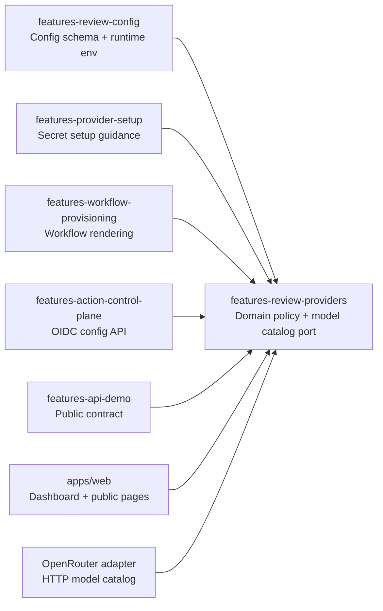
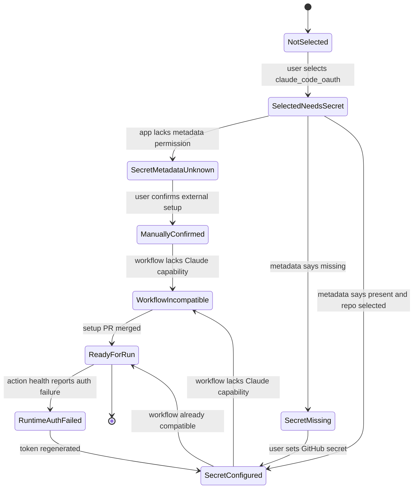
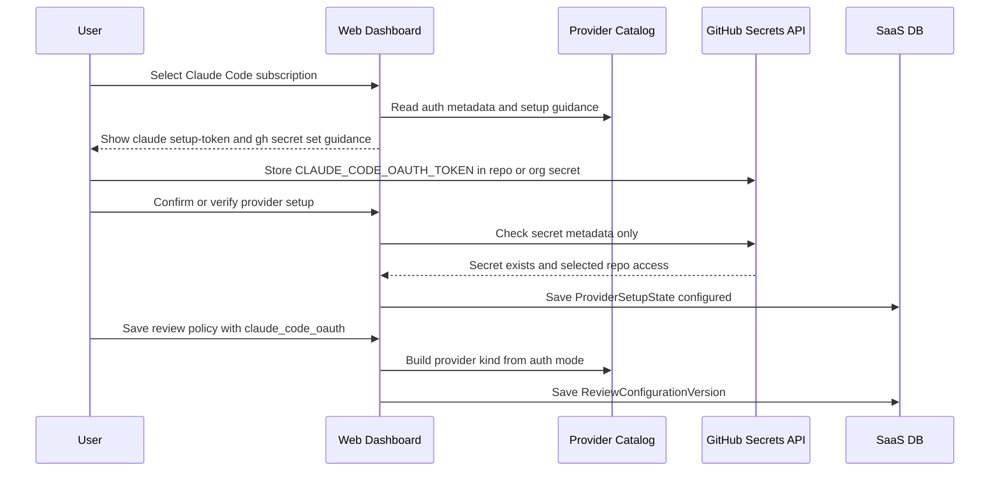
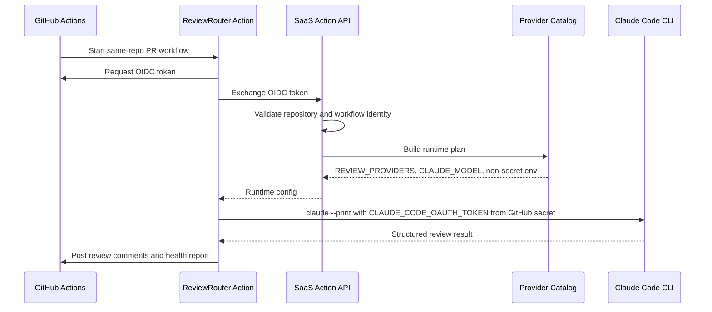
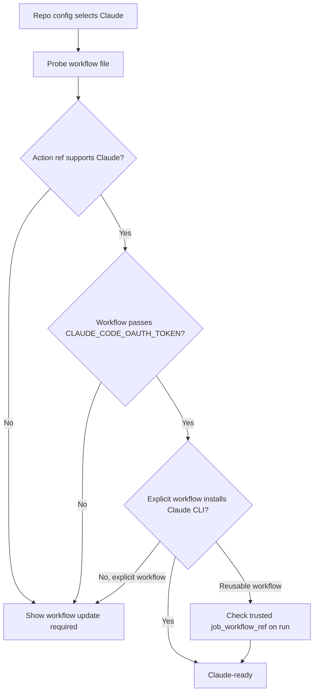

# Provider Catalog and Claude Code OAuth

## Status

Proposed.

Created: 2026-05-12.

This document describes how to add first-class Claude Code subscription OAuth
support to the ReviewRouter SaaS while cleaning up provider architecture around
Clean Architecture, DDD, SOLID, DRY, and port/adapter boundaries.

## Goal

Users should be able to choose Claude Code subscription OAuth in the SaaS
dashboard, store the generated Claude token directly in GitHub Actions secrets,
save repository or workspace review policy, provision a workflow, and have the
ReviewRouter Action run Claude Code inside the customer's GitHub Actions runner.

The SaaS must still not receive, store, log, or proxy provider credentials,
repository source code, PR diffs, prompts, or model responses by default.

## Non-Goals

- Do not move review execution into the SaaS.
- Do not store `CLAUDE_CODE_OAUTH_TOKEN` in the SaaS database or environment.
- Do not convert Claude Code subscription OAuth into `ANTHROPIC_API_KEY`.
- Do not add a hosted Anthropic API-key provider in this change unless it is
  designed separately.
- Do not rewrite the whole feature architecture. Keep the refactor bounded to
  provider metadata and provider runtime planning.

## Current Architecture Assessment

The SaaS already mostly follows the accepted feature-first DDD architecture:

```text
packages/features/<feature>/src/domain
packages/features/<feature>/src/application
packages/features/<feature>/src/application/ports
packages/features/<feature>/src/infrastructure
packages/features/<feature>/src/interface
```

Existing strong points:

- Prisma adapters live under `infrastructure/prisma`.
- GitHub adapters live under `infrastructure/github`.
- Use cases depend on application ports.
- `domain` and `application` are mostly free of Next, React, Prisma, Octokit,
  Fastify, and tRPC imports.
- `pnpm architecture:check` enforces the main forbidden import boundaries.

Existing provider weakness:

- Provider knowledge is duplicated across review config, provider setup,
  workflow provisioning, action control plane, dashboard UI, model catalog,
  public docs, and API demo.
- `authMode -> providerKind -> secretName -> runtime env -> workflow snippet`
  is not a single domain policy.
- Adding Claude by editing every switch locally would work once, but would make
  the next provider riskier.

Current provider-related locations:

```text
packages/features/review-config/src/domain/review-configuration.ts
packages/features/review-config/src/application/use-cases/map-config-to-runtime-env.ts
packages/features/provider-setup/src/domain/provider-secret-setup.ts
packages/features/workflow-provisioning/src/domain/workflow-template.ts
packages/features/action-control-plane/src/domain/action-control-plane.ts
packages/features/action-control-plane/src/infrastructure/prisma/prisma-action-control-plane-repository.ts
packages/features/api-demo/src/domain/api-demo.ts
apps/web/src/server/openrouter-model-catalog.ts
apps/web/app/dashboard/actions.ts
apps/web/app/dashboard/repository-policy-editor.tsx
apps/web/app/dashboard/provider-secret-setup-chooser.tsx
apps/web/app/dashboard/provider-secret-setup-dialog.tsx
apps/web/app/page.tsx
apps/web/app/getting-started/page.tsx
apps/web/app/security/page.tsx
apps/web/app/privacy/page.tsx
apps/web/app/disconnect/page.tsx
```

## Verified Facts and Sources

Local code facts:

- The ReviewRouter Action already has Claude provider support in
  `/Users/belief/dev/projects/review-router-action`.
- The Action reads `CLAUDE_CODE_OAUTH_TOKEN`.
- The Action maps `CLAUDE_MODEL=sonnet` to `claude/sonnet` when explicit
  `REVIEW_PROVIDERS` is absent.
- The Action provider rejects empty Claude tokens, shell commands accidentally
  stored as the token, whitespace-padded command text, and values that do not
  match the expected `sk-ant-oat01-...` token shape.
- The Action runs `claude --print` without `--bare`, isolates
  `CLAUDE_CONFIG_DIR` for OAuth-token CI execution, disables slash commands,
  disables tools, requests JSON output, and cleans temporary prompt files.

Official Claude Code docs:

- Claude Code supports `claude setup-token` for CI subscription OAuth.
- The generated token should be stored in `CLAUDE_CODE_OAUTH_TOKEN`.
- Claude's docs describe this as a one-year OAuth token for CI pipelines,
  scripts, and other environments where browser login is unavailable.
- The token authenticates through a Claude subscription and requires Pro, Max,
  Team, or Enterprise. The free Claude.ai plan is not enough for Claude Code.
- The token is scoped to inference only and cannot establish Remote Control
  sessions.
- Claude docs define authentication precedence. Cloud-provider credentials,
  `ANTHROPIC_AUTH_TOKEN`, `ANTHROPIC_API_KEY`, and `apiKeyHelper` all take
  precedence over `CLAUDE_CODE_OAUTH_TOKEN`. A stale or disabled API-key org can
  break a subscription-auth run unless the workflow avoids passing higher
  precedence Claude credentials.
- Claude docs warn that `CLAUDE_CODE_OAUTH_TOKEN` works only with `claude`, not
  with `claude --bare`.
- Claude docs document native latest, native stable, native exact-version, and
  npm installation paths for Claude Code.
- Claude docs document binary integrity verification and package-manager install
  options. Linux standalone binaries are not individually code-signed, so exact
  version or package-manager verification needs an explicit release policy.

Official GitHub Actions docs:

- Reusable workflows must be in `.github/workflows` and use
  `on.workflow_call`.
- Caller workflows pass secrets explicitly through `jobs.<job_id>.secrets` or
  by `secrets: inherit`.
- A job that calls a reusable workflow has a limited set of supported job keys.
- OIDC tokens for reusable workflows include `job_workflow_ref`, which
  identifies the called workflow.

Dependency/version research snapshot on 2026-05-13:

- `npm view @anthropic-ai/claude-code` returned:
  - `latest`: `2.1.140`
  - `stable`: `2.1.128`
  - `next`: `2.1.140`
  - Node engine: `>=18.0.0`
  - platform optional dependencies pinned to `2.1.140` for Linux, macOS,
    Windows, glibc and musl.
- The workflow already uses Node 24, so the npm package engine requirement is
  compatible.
- Do not hard-code these exact Claude versions without a release policy. Treat
  this as evidence for install strategy, not as an automatic production pin.

References:

- https://code.claude.com/docs/en/team
- https://code.claude.com/docs/en/setup
- https://code.claude.com/docs/en/github-actions
- https://code.claude.com/docs/en/model-config
- https://code.claude.com/docs/en/legal-and-compliance
- https://docs.github.com/en/actions/how-tos/reuse-automations/reuse-workflows
- https://docs.github.com/en/actions/reference/workflows-and-actions/reusing-workflow-configurations
- https://docs.github.com/en/actions/how-tos/secure-your-work/security-harden-deployments/oidc-with-reusable-workflows
- https://arxiv.org/abs/2605.07135

## Current Code Reality Check

This section records what the current SaaS code already does, so the
implementation can be incremental instead of aspirational.

Already good:

- The repo already uses feature-first packages under `packages/features`.
- `action-control-plane` already has ports, use cases, infrastructure adapters,
  OIDC replay protection, safe health schemas, and tests for `workflow_ref` and
  `job_workflow_ref`.
- `workflow-provisioning` already owns deterministic workflow rendering.
- `provider-setup` already models "SaaS never receives provider secret" guidance
  and emits `gh secret set` commands.
- `review-config` already supports v2 multi-provider config.
- `repo-health` already has safe health states and workflow probing.
- `scripts/check-architecture-boundaries.mjs` already enforces that feature
  domain/application files do not import Prisma, Octokit, Fastify, tRPC, Next,
  or NextAuth.

Not good enough for Claude:

- `reviewProviderConfigurationSchema` currently accepts only `codex` and
  `openrouter`. It does not validate that `authMode` belongs to `kind`.
- `mapConfigToRuntimeEnv` currently computes one `REVIEW_AUTH_MODE` and derives
  Codex env from the first/any Codex provider. That is a compatibility shim, not
  a provider runtime plan.
- `workflow-template.ts` hard-codes Codex install/auth restore and passes only
  `CODEX_AUTH_JSON`, `CODEX_CONFIG_TOML`, `OPENAI_API_KEY`, and
  `OPENROUTER_API_KEY`.
- Reusable workflow callers currently omit `CLAUDE_CODE_OAUTH_TOKEN`.
- Explicit workflow install steps are currently Codex/OpenAI specific.
- Dashboard provider forms and setup dialogs still contain local provider truth
  tables.
- Existing workflow readiness checks mostly prove that an expected action ref is
  present; Claude needs capability readiness too.

Conclusion:

- The base architecture is close enough to extend cleanly.
- The risky part is duplicated provider policy, not missing infrastructure.
- The first implementation PR should remove provider policy duplication for
  existing Codex/OpenRouter before exposing Claude.

## Architectural Decision

Add a provider catalog bounded context and use it as the single source of truth
for provider identity, auth modes, secret names, model options, runtime env
mapping, and workflow runtime requirements.

Recommended implementation:

```text
packages/features/review-providers/
  src/
    domain/
      provider-catalog.ts
      provider-runtime-plan.ts
      provider-secret-metadata.ts
      provider-models.ts
    application/
      ports/
        provider-model-catalog-port.ts
      use-cases/
        list-review-model-options.ts
    infrastructure/
      openrouter/
        openrouter-model-catalog.ts
    tests/
      provider-catalog.test.ts
      provider-runtime-plan.test.ts
      provider-model-catalog.test.ts
    index.ts
```

Why a new feature package:

- Provider metadata is not owned only by `review-config`.
- Provider setup needs secret guidance.
- Workflow provisioning needs runtime tool and secret mapping.
- Action control plane needs response schema and runtime env mapping.
- Dashboard needs model and UI capability metadata.
- API demo and docs need public provider copy.

Keeping it in one existing package would create an awkward dependency direction:

- If placed in `review-config`, `provider-setup` and `workflow-provisioning`
  would depend on review config for secret and workflow policy.
- If placed in `provider-setup`, runtime env mapping would depend on setup UI
  concerns.
- A small `review-providers` domain package keeps provider policy independent.

## Decision Options Considered

### Option 1 - Add Claude Inline Across Existing Files

🎯 8 🛡️ 5 🧠 4 Approximate change size: 650-900 LOC.

This means adding `claude` and `claude_code_oauth` to every existing switch,
union, copy block, and test without a shared provider catalog.

Pros:

- Fastest first implementation.
- Smallest conceptual change.
- Lower chance of broad package dependency churn.

Cons:

- Preserves the current duplication problem.
- Every future provider repeats the same risk.
- Easy to forget one of the critical paths: runtime env, workflow secret
  pass-through, dashboard secret status, API demo, or disconnect docs.
- Violates Open/Closed because adding a provider requires modifying many
  unrelated modules.

Decision: do not use except for an emergency patch.

### Option 2 - New Provider Catalog Bounded Context

🎯 9 🛡️ 9 🧠 7 Approximate change size: 1000-1500 LOC.

This introduces `@reviewrouter/features-review-providers` and moves provider
identity, auth modes, secret metadata, runtime plan, and model catalog policy
there.

Pros:

- Best fit for Clean Architecture and DDD.
- Provider rules get one owner.
- Dashboard, workflow provisioning, action control plane, and setup guidance
  consume the same policy.
- Reduces the chance of inconsistent future provider behavior.

Cons:

- More files than the inline approach.
- Requires careful package dependency direction.
- Needs good tests before touching dashboard UI.

Decision: use this.

### Option 3 - Put Catalog Inside `features-review-config`

🎯 7 🛡️ 7 🧠 5 Approximate change size: 800-1200 LOC.

This keeps provider catalog close to config parsing and runtime env mapping.

Pros:

- Fewer packages.
- Review config already owns provider configuration shape.

Cons:

- Provider setup and workflow provisioning would depend on review config for
  secrets and workflow runtime policy.
- `review-config` would become a grab bag for setup, model catalog, workflow,
  and dashboard concerns.
- Makes future extraction harder.

Decision: avoid.

## Decision Record

These decisions should be treated as the RFC baseline unless a follow-up ADR
changes them.

| Decision                                        | Status      | Rationale                                                                                    | Revisit trigger                                                         |
| ----------------------------------------------- | ----------- | -------------------------------------------------------------------------------------------- | ----------------------------------------------------------------------- |
| New `features-review-providers` bounded context | accepted    | provider policy is shared by config, setup, workflow, action API, dashboard, and public copy | only if package dependency graph becomes worse than current duplication |
| Keep DB `schemaVersion: 2`                      | accepted    | adding `claude` is enum-domain expansion, not JSON shape change                              | provider-specific payloads become large or incompatible                 |
| Generic provider object plus catalog validation | accepted    | lowest safe migration cost for current DB/forms                                              | TypeScript narrowing bugs become common                                 |
| Claude UI default-on with rollback flag         | accepted    | backend/workflow support is implemented and local gates cover user setup paths               | real E2E failure or provider policy change                              |
| Native stable Claude installer for beta         | accepted    | official, simple, lower moving-target risk than latest                                       | install spike proves signed apt or exact npm is better                  |
| Production install pinning unresolved           | open        | exact version, signed apt, and npm exact all have tradeoffs                                  | before hardening public rollout                                         |
| Setup-token revocation route unresolved         | open        | official docs reviewed do not clearly document per-token revocation                          | before final disconnect/security copy                                   |
| Self-hosted runner Claude OAuth support         | conditional | inherited env can change Claude auth precedence                                              | after env sanitation is tested                                          |

Decision hygiene:

- If implementation contradicts an accepted decision, update this document or
  create an ADR before merging.
- Do not hide decision changes inside code review comments.
- For open execution details, ship with conservative fallback and a fast
  rollback switch.

## Target Dependency Graph

Provider rules should flow outward from a pure catalog. UI and infrastructure
render or fetch around that catalog; they do not redefine provider rules.



Forbidden dependencies:

```text
features-review-providers -> @prisma/client
features-review-providers -> @octokit/*
features-review-providers -> next/react
features-review-providers -> fastify
features-review-providers -> apps/*
features-review-providers -> features-workflow-provisioning
```

This keeps Dependency Inversion clean: the catalog defines policy; adapters
fetch or render environment-specific details.

## Layer Responsibility Matrix

| Layer                                        | Owns                                                                                    | Must not own                                           |
| -------------------------------------------- | --------------------------------------------------------------------------------------- | ------------------------------------------------------ |
| `features-review-providers/domain`           | provider enums, metadata, capabilities, runtime ids, deterministic runtime plan         | HTTP fetch, Prisma, GitHub CLI syntax, React rendering |
| `features-review-providers/application`      | model catalog use case, model catalog port                                              | concrete OpenRouter HTTP calls                         |
| `features-review-providers/infrastructure`   | OpenRouter HTTP adapter, caching and response normalization                             | provider auth mode definitions                         |
| `features-review-config/domain`              | persisted review config shape and invariants                                            | GitHub secret names, CLI install details               |
| `features-review-config/application`         | resolve/save config, map config to non-secret runtime env through provider runtime plan | workflow YAML rendering                                |
| `features-provider-setup/domain`             | credential setup guidance commands and warnings                                         | token validation by decrypted value                    |
| `features-workflow-provisioning/domain`      | deterministic workflow file rendering, workflow path constants                          | reading GitHub state                                   |
| `features-workflow-provisioning/application` | setup PR orchestration through ports                                                    | Octokit calls                                          |
| `features-action-control-plane/domain`       | OIDC/session/runtime config API contract, safe health payload schema                    | Prisma coercion, UI copy                               |
| `apps/web/dashboard`                         | forms, rendering, server action input parsing                                           | provider truth tables                                  |
| `apps/api`                                   | Fastify route composition                                                               | provider policy                                        |

This matrix is the guardrail for code review. If an implementation puts a
provider rule into more than one owner, prefer moving the rule back to the
catalog.

## Existing Package Hook Points

The clean implementation should change the existing packages at these specific
seams.

| Existing package/file                                                                    | Current responsibility                           | Claude-safe change                                                                                       |
| ---------------------------------------------------------------------------------------- | ------------------------------------------------ | -------------------------------------------------------------------------------------------------------- |
| `packages/features/review-config/src/domain/review-configuration.ts`                     | Parse persisted v1/v2 config                     | Import catalog schemas, add `claude`, validate `authMode`/`kind` pairs with `superRefine`                |
| `packages/features/review-config/src/application/use-cases/map-config-to-runtime-env.ts` | Map config into action env                       | Delegate to `buildProviderRuntimePlan`; keep old export as compatibility wrapper                         |
| `packages/features/provider-setup/src/domain/provider-secret-setup.ts`                   | Emit setup guidance and `gh secret set` commands | Use catalog secret metadata and add Claude guidance without duplicating secret names                     |
| `packages/features/workflow-provisioning/src/domain/workflow-template.ts`                | Render reusable/explicit workflow YAML           | Use workflow adapter helpers backed by catalog metadata for secret pass-through and CLI requirements     |
| `packages/features/action-control-plane/src/domain/action-control-plane.ts`              | Runtime config and health schemas                | Accept `claude`/`claude_code_oauth`, keep runtime config secret-free, add feature-minimum compatibility  |
| `packages/features/repo-health/src/domain/repository-health.ts`                          | Turn workflow/provider state into UI health      | Add capability mismatch state or metadata so old workflows can say "workflow update required for Claude" |
| `apps/web/app/dashboard/actions.ts`                                                      | Parse dashboard policy forms                     | Derive `kind` from `authMode` server-side through catalog helper                                         |
| `apps/web/app/dashboard/repository-policy-editor.tsx`                                    | Render provider controls                         | Render from catalog capabilities; hide Codex-only controls for Claude                                    |
| `apps/web/app/dashboard/provider-secret-setup-dialog.tsx`                                | Render provider setup instructions               | Use generic guidance sets keyed by provider setup kind                                                   |
| `apps/web/src/server/openrouter-model-catalog.ts`                                        | Static Codex plus OpenRouter dynamic options     | Move static provider model options into catalog; keep OpenRouter HTTP as adapter                         |

Migration rule:

- Keep public function names where possible in the first PR. For example,
  `mapConfigToRuntimeEnv(config)` can remain exported but should internally call
  `buildProviderRuntimePlan(config).runtimeEnv`. This makes tests prove parity
  before every caller is updated.

## Architecture Scorecard

Current architecture before implementation:

| Criterion          | Score | Notes                                                                                                      |
| ------------------ | ----: | ---------------------------------------------------------------------------------------------------------- |
| Clean Architecture |  7/10 | Feature packages and boundary checks exist, but provider policy is duplicated in web/server/workflow files |
| SOLID              |  6/10 | SRP is weak around provider metadata; OCP is weak because adding Claude currently touches many switches    |
| DDD                |  7/10 | Bounded contexts are mostly clear; provider catalog is the missing ubiquitous language owner               |
| DRY                |  5/10 | Secret names, provider kinds, auth modes, model options, and runtime mapping are repeated                  |
| Port/adapter       |  7/10 | Existing ports are good; OpenRouter model catalog should move behind a provider model port                 |

Target after the catalog migration:

| Criterion          | Target | Main proof                                                                                                   |
| ------------------ | -----: | ------------------------------------------------------------------------------------------------------------ |
| Clean Architecture |   9/10 | `architecture:check` passes and provider policy is isolated to `features-review-providers`                   |
| SOLID              |   9/10 | Adding a fourth provider mostly adds catalog metadata plus optional adapters                                 |
| DDD                |   9/10 | `ProviderKind`, `ProviderAuthMode`, `ProviderRuntimePlan`, and `ProviderSetupGuidance` are used consistently |
| DRY                |   9/10 | No local secret/auth/model truth tables in dashboard/workflow/control-plane                                  |
| Port/adapter       |   9/10 | Dynamic model fetching and workflow rendering are adapters around catalog policy                             |

## Port and Adapter Contracts

New or changed ports should stay narrow.

`ProviderModelCatalogPort`:

```ts
export interface ProviderModelCatalogPort {
  listModels(input: {
    readonly providerKind: ProviderKind;
    readonly signal?: AbortSignal;
  }): Promise<readonly ReviewModelOption[]>;
}
```

Rules:

- Static Codex/Claude options can be returned without a port.
- OpenRouter needs the port because it performs network I/O.
- Callers should merge static and dynamic options through a use case, not by
  importing the OpenRouter adapter directly.

`WorkflowCompatibilityPort` is not required as a new port yet. The existing
workflow probe can stay, but its result must become richer if we want dashboard
to say "workflow update required for Claude" rather than only "action ref
present".

## Architecture Fitness Functions

These are automated checks that should keep the implementation from drifting
after Claude support is merged.

Required checks:

```text
architecture:check
  feature domain/application layers do not import Prisma, Octokit, Fastify,
  tRPC, Next, NextAuth, React, or UI packages

provider-catalog exhaustiveness test
  every ProviderKind and ProviderAuthMode has metadata

runtime-plan parity test
  Codex/OpenRouter env output before and after migration stays equivalent

workflow-template capability test
  generated workflow contains every required provider secret and CLI marker

runtime-config safety test
  runtime config JSON contains no secret-like values

dashboard-form authority test
  server derives provider kind from auth mode instead of trusting hidden fields
```

Optional check if the implementation starts to grow:

```text
no-provider-switches-outside-catalog
  scan for authMode/kind switch statements in apps/web and feature packages
  allowlist only catalog tests and adapter bridge code
```

This is not meant to forbid all switch statements. It is meant to catch the
specific old pattern where provider truth tables drift across dashboard,
workflow, setup guidance, and action control plane.

## Anti-Corruption Layer for Existing Code

The provider catalog should not force a big-bang rewrite. Add small bridge
functions where old code expects old shapes.

Recommended bridge functions:

```ts
export function toLegacyRuntimeAuthMode(
  authMode: ProviderAuthMode,
): "codex-oauth" | "openai-api" | "openrouter-api" | "claude-oauth";

export function fromProviderSetupKind(
  setupKind: ProviderSecretKind,
): ProviderAuthMode;

export function toProviderSetupKind(
  authMode: ProviderAuthMode,
): ProviderSecretKind;

export function getProviderUiCapabilities(
  kind: ProviderKind,
): ProviderUiCapabilities;
```

Rules:

- Bridge functions live in `features-review-providers`, not in dashboard.
- Existing callers can migrate one at a time.
- Delete bridge functions only when no caller uses the old shape.
- Tests should prove bridge behavior for Codex/OpenRouter before Claude is
  added.

## Public Export Surface

Keep the provider package export surface intentionally small. Most callers
should import functions, not raw tables.

Allowed exports:

```text
schemas:
  providerKindSchema
  providerAuthModeSchema

types:
  ProviderKind
  ProviderAuthMode
  ProviderCapability
  ProviderRuntimePlan
  ReviewModelOption

catalog queries:
  getProviderCatalogEntry
  getProviderAuthModeMetadata
  getProviderCapabilities
  getProviderSecretNames
  providerKindForAuthMode
  providerAuthModeBelongsToKind

runtime:
  toRuntimeProviderId
  buildProviderRuntimePlan
  assertRuntimeEnvIsNonSecret

models:
  listStaticReviewModelOptions
  listReviewModelOptions

bridges:
  toLegacyRuntimeAuthMode
  toProviderSetupKind
  fromProviderSetupKind
```

Disallowed exports:

```text
mutable catalog object
raw OpenRouter fetch adapter as the main API
dashboard copy strings as domain data
workflow shell snippets from provider domain
GitHub secret setup commands from provider domain
```

Reason:

- The domain package should own provider policy.
- Workflow shell and GitHub CLI commands are adapter concerns.
- Dashboard copy can consume provider labels, but it should own final UI text.
- Exporting raw tables encourages callers to reimplement policy locally.

## Composition Root and Adapter Wiring

Keep dependency construction at application/interface boundaries. Domain packages
should not instantiate HTTP clients, Prisma clients, Octokit, or UI services.

Recommended wiring:

```text
apps/web server action:
  construct listReviewModelOptions use case
  pass OpenRouterModelCatalogAdapter when dynamic models are requested
  render dashboard from returned DTOs

apps/api action-control-plane routes:
  construct getActionRuntimeConfig use case
  pass PrismaActionControlPlaneRepository
  pass StaticActionRuntimeCompatibilityPolicy
  call buildProviderRuntimePlan inside use case/domain boundary

workflow-provisioning use case:
  receive ReviewConfiguration
  call buildProviderRuntimePlan
  render workflow through workflow adapter helpers

provider-setup domain:
  receive provider auth mode
  use catalog metadata
  return setup guidance DTO with GitHub CLI commands
```

Do not wire like this:

```text
provider catalog imports OpenRouter adapter
provider catalog imports dashboard copy
workflow template imports apps/web helpers
dashboard imports workflow renderer to infer provider capabilities
action control plane imports provider setup command builders
```

Composition-root score:

- Explicit use-case wiring: 🎯 9 🛡️ 9 🧠 5 Approx. 80-140 LOC.
- Global singleton catalog plus ad hoc adapter imports: 🎯 6 🛡️ 5 🧠 3
  Approx. 30-60 LOC, but encourages hidden coupling.
- Service locator container: 🎯 5 🛡️ 6 🧠 7 Approx. 150-260 LOC,
  unnecessary for this repo today.

Decision:

- Use explicit wiring at `apps/web`, `apps/api`, and feature use-case
  boundaries.
- Keep the catalog itself as pure data plus pure functions.

## DDD Language

Use these terms consistently:

- `ProviderKind` - runtime family: `codex`, `claude`, `openrouter`.
- `ProviderAuthMode` - how credentials are supplied:
  `codex_subscription_oauth`, `codex_openai_api_key`,
  `claude_code_oauth`, `openrouter_api_key`.
- `ProviderSecretName` - GitHub Actions secret required by an auth mode.
- `ProviderRuntimeId` - action runtime provider id, for example
  `codex/gpt-5.5`, `claude/sonnet`, `openrouter/poolside/laguna-m.1:free`.
- `ProviderCapability` - UI/runtime capability such as reasoning effort,
  fast mode, agentic context, dynamic model catalog, subscription OAuth.
- `ProviderRuntimePlan` - complete non-secret runtime plan generated from a
  review configuration.
- `ProviderSetupGuidance` - commands and warnings for storing credentials
  directly in GitHub Actions secrets.

## Clean Architecture Rules for This Change

The implementation should obey these rules before any UI is changed:

1. Domain code may define provider identity, validation, and deterministic
   mappings only.
2. Application use cases may orchestrate domain policy and ports.
3. Ports belong in `application/ports` when an external capability is needed.
4. Infrastructure adapters implement ports for HTTP, Prisma, GitHub, or other
   external systems.
5. Interface adapters expose HTTP routes, CLI scripts, workflow YAML, or UI
   components.
6. Dashboard components may render provider metadata but must not own provider
   rules.
7. Generated workflows may include provider-specific shell snippets, but those
   snippets should be selected from provider catalog metadata or a workflow
   adapter helper.
8. Unknown provider data must fail closed for runtime execution.

SOLID interpretation:

- SRP: provider secret metadata, runtime env mapping, model catalog, and UI
  rendering each have one owner.
- OCP: adding another provider should add catalog entries and optional adapters,
  not edit every switch in the product.
- LSP: every provider config must be safe to pass through the common
  `ReviewProviderConfiguration` contract without surprising UI/runtime behavior.
- ISP: dashboard should ask for narrow provider capabilities instead of a broad
  provider object with irrelevant fields.
- DIP: workflow provisioning and action control plane depend on provider policy
  abstractions, not provider-specific implementation details.

## Provider Catalog Public API Contract

The catalog should export narrow, boring functions. Avoid making callers inspect
raw catalog objects and reimplement decisions.

Recommended exports:

```ts
export {
  providerKindSchema,
  providerAuthModeSchema,
  reviewProviderCatalog,
  reviewProviderAuthModes,
  reviewProviderKinds,
  providerKindForAuthMode,
  assertProviderAuthModeBelongsToKind,
  getProviderAuthModeMetadata,
  getProviderCatalogEntry,
  getProviderSecretNames,
  getProviderCapabilities,
  providerSupportsCapability,
  toRuntimeProviderId,
  buildProviderRuntimePlan,
  listStaticReviewModelOptions,
  mergeReviewModelOptions,
};

export type {
  ProviderKind,
  ProviderAuthMode,
  ProviderCapability,
  ProviderCatalogEntry,
  ProviderAuthModeMetadata,
  ProviderRuntimePlan,
  ProviderCliTool,
  RuntimeAuthMode,
  ReviewModelOption,
};
```

Design rules:

- Functions should return readonly data.
- Metadata should be defined with `satisfies` so missing auth modes fail at
  compile time.
- Exhaustiveness should be enforced with `assertNever`.
- Export schemas from the catalog, not duplicated local zod enums.
- Keep command strings for credential setup out of the core catalog unless they
  are pure and deterministic. Provider setup may own command rendering while
  using catalog metadata for secret names and labels.

## Domain Model

The provider catalog should be a pure domain module with no Prisma, Octokit,
Next, React, Fastify, or network imports.

Suggested core types:

```ts
export const providerKindSchema = z.enum(["codex", "claude", "openrouter"]);

export const providerAuthModeSchema = z.enum([
  "codex_subscription_oauth",
  "codex_openai_api_key",
  "claude_code_oauth",
  "openrouter_api_key",
]);

export type ProviderKind = z.infer<typeof providerKindSchema>;
export type ProviderAuthMode = z.infer<typeof providerAuthModeSchema>;

export type ProviderCapability =
  | "reasoning_effort"
  | "fast_mode"
  | "agentic_context"
  | "static_model_catalog"
  | "dynamic_model_catalog"
  | "subscription_oauth"
  | "api_key";

export type ProviderCatalogEntry = {
  readonly kind: ProviderKind;
  readonly label: string;
  readonly authModes: readonly ProviderAuthMode[];
  readonly defaultAuthMode: ProviderAuthMode;
  readonly defaultModel: string;
  readonly runtimeProviderPrefix: "codex" | "claude" | "openrouter";
  readonly capabilities: readonly ProviderCapability[];
};

export type ProviderAuthModeMetadata = {
  readonly authMode: ProviderAuthMode;
  readonly providerKind: ProviderKind;
  readonly label: string;
  readonly shortLabel: string;
  readonly description: string;
  readonly secretNames: readonly string[];
  readonly runtimeAuthMode:
    | "codex-oauth"
    | "openai-api"
    | "claude-oauth"
    | "openrouter-api";
  readonly credentialCustody: "github_actions_secret";
  readonly sendsSecretToReviewRouter: false;
};
```

Suggested static entries:

```ts
codex:
  authModes:
    - codex_subscription_oauth
    - codex_openai_api_key
  defaultAuthMode: codex_subscription_oauth
  defaultModel: gpt-5.5
  runtimeProviderPrefix: codex
  capabilities:
    - static_model_catalog
    - subscription_oauth
    - api_key
    - reasoning_effort
    - fast_mode
    - agentic_context

claude:
  authModes:
    - claude_code_oauth
  defaultAuthMode: claude_code_oauth
  defaultModel: sonnet
  runtimeProviderPrefix: claude
  capabilities:
    - static_model_catalog
    - subscription_oauth

openrouter:
  authModes:
    - openrouter_api_key
  defaultAuthMode: openrouter_api_key
  defaultModel: poolside/laguna-m.1:free
  runtimeProviderPrefix: openrouter
  capabilities:
    - dynamic_model_catalog
    - api_key
```

Implementation pattern:

```ts
const providerCatalog = {
  codex: {
    kind: "codex",
    label: "Codex",
    authModes: ["codex_subscription_oauth", "codex_openai_api_key"],
    defaultAuthMode: "codex_subscription_oauth",
    defaultModel: "gpt-5.5",
    runtimeProviderPrefix: "codex",
    capabilities: [
      "static_model_catalog",
      "subscription_oauth",
      "api_key",
      "reasoning_effort",
      "fast_mode",
      "agentic_context",
    ],
  },
  claude: {
    kind: "claude",
    label: "Claude Code",
    authModes: ["claude_code_oauth"],
    defaultAuthMode: "claude_code_oauth",
    defaultModel: "sonnet",
    runtimeProviderPrefix: "claude",
    capabilities: ["static_model_catalog", "subscription_oauth"],
  },
  openrouter: {
    kind: "openrouter",
    label: "OpenRouter",
    authModes: ["openrouter_api_key"],
    defaultAuthMode: "openrouter_api_key",
    defaultModel: "poolside/laguna-m.1:free",
    runtimeProviderPrefix: "openrouter",
    capabilities: ["dynamic_model_catalog", "api_key"],
  },
} as const satisfies Record<ProviderKind, ProviderCatalogEntry>;
```

Do not export the mutable object. Export readonly helpers that can be tested in
isolation. This keeps callers from depending on catalog internals.

Auth metadata:

```text
codex_subscription_oauth:
  providerKind: codex
  secretNames: CODEX_AUTH_JSON
  runtimeAuthMode: codex-oauth

codex_openai_api_key:
  providerKind: codex
  secretNames: OPENAI_API_KEY
  runtimeAuthMode: openai-api

claude_code_oauth:
  providerKind: claude
  secretNames: CLAUDE_CODE_OAUTH_TOKEN
  runtimeAuthMode: claude-oauth

openrouter_api_key:
  providerKind: openrouter
  secretNames: OPENROUTER_API_KEY
  runtimeAuthMode: openrouter-api
```

## Runtime Plan

Do not let workflow provisioning, action control plane, and dashboard each map
providers by hand. Add one pure function:

```ts
export type ProviderRuntimePlan = {
  readonly runtimeEnv: Readonly<Record<string, string>>;
  readonly providerIds: readonly string[];
  readonly synthesisModel: string;
  readonly requiredSecretNames: readonly string[];
  readonly requiredCliTools: readonly ProviderCliTool[];
  readonly primaryRuntimeAuthMode: RuntimeAuthMode;
};

export type ProviderCliTool = "codex" | "claude";

export function buildProviderRuntimePlan(
  config: ReviewConfiguration,
): ProviderRuntimePlan;
```

Runtime plan algorithm:

```text
1. Normalize providers:
   - if config.providers is present, use it
   - otherwise use legacy config.provider

2. Validate every provider:
   - kind is known
   - authMode is known
   - authMode belongs to kind
   - model is non-empty after trim

3. Build provider ids in user-selected order:
   - codex -> codex/<model>
   - claude -> claude/<model>
   - openrouter -> openrouter/<model>

4. Resolve synthesis model:
   - first provider id by default
   - no separate synthesis dropdown in this change

5. Resolve required secrets:
   - union secret names by auth mode
   - keep stable catalog order for deterministic workflow snapshots

6. Resolve required CLI tools:
   - codex provider -> codex
   - claude provider -> claude
   - openrouter provider -> none in the workflow, runtime adapter uses API

7. Build compatibility env:
   - REVIEW_AUTH_MODE from primary provider auth mode
   - CODEX_* only if a Codex provider exists
   - CLAUDE_MODEL only if a Claude provider exists
   - REVIEW_PROVIDERS for all provider ids
```

Runtime env mapping:

```text
Always:
  REVIEWROUTER_CONFIG_SCHEMA_VERSION
  REVIEW_PROVIDERS
  SYNTHESIS_MODEL
  PROVIDER_LIMIT
  PROVIDER_MAX_PARALLEL
  INLINE_MIN_AGREEMENT
  INLINE_MAX_COMMENTS
  TARGET_TOKENS_PER_BATCH
  FAIL_ON_SEVERITY

For first or available Codex provider:
  CODEX_MODEL
  CODEX_REASONING_EFFORT
  CODEX_AGENTIC_CONTEXT
  CODEX_FAST_MODE

For first or available Claude provider:
  CLAUDE_MODEL

For backward compatibility:
  REVIEW_AUTH_MODE = primary provider auth mode, usually the first provider
```

Important: `REVIEW_AUTH_MODE` is a compatibility hint and should not be the only
source for workflow tool installation. Multi-provider configs can require more
than one CLI.

Provider id examples:

```text
codex/gpt-5.5
claude/sonnet
openrouter/poolside/laguna-m.1:free
```

## Testable Domain Invariants

These invariants should become unit tests in `features-review-providers` and
boundary tests in existing packages. They are written as properties rather than
examples so future providers do not break them accidentally.

Provider catalog invariants:

```text
Every ProviderKind has exactly one catalog entry.
Every ProviderAuthMode has exactly one auth metadata entry.
Every auth metadata entry points to an existing ProviderKind.
Every provider defaultAuthMode belongs to that provider.
Every provider defaultModel produces a non-empty ProviderRuntimeId.
Every secret name matches /^[A-Z_][A-Z0-9_]*$/.
Every static model id is non-empty after trim.
No provider capability is inferred from UI code.
```

Runtime plan invariants:

```text
buildProviderRuntimePlan is pure and deterministic.
Input provider order is preserved in REVIEW_PROVIDERS.
requiredSecretNames is stable and deduplicated.
requiredCliTools is stable and deduplicated.
runtimeEnv contains no values that look like provider secrets.
Unknown provider kind fails closed.
Unknown auth mode fails closed.
Mismatched provider kind/auth mode fails closed.
Claude-only config does not emit CODEX_* env values.
Codex-only config does not emit CLAUDE_MODEL.
Mixed Codex + Claude config requires both codex and claude CLI tools.
```

Workflow invariants:

```text
Reusable caller passes every secret supported by the selected action contract.
Explicit workflow never echoes provider secret values.
Explicit workflow installs Claude before a Claude provider can execute.
Reusable workflow trust checks include job_workflow_ref.
Fork PR secret-backed execution remains skipped.
merge_group never attempts provider execution without a PR number.
```

Dashboard invariants:

```text
Server derives provider kind from auth mode, never from hidden client fields.
Feature flag hides Claude provider creation but does not make saved config unparsable.
Secret setup checks metadata only, never decrypted values.
One shared secret notice is shown for duplicate auth modes.
Codex-only controls are not rendered for Claude.
```

## Provider Configuration State Machine

This is the product state machine the dashboard should implement. Avoid storing
ambiguous booleans such as `isClaudeReady`; derive the view from these states.



State ownership:

- `SelectedNeedsSecret`, `SecretMissing`, `SecretConfigured`, and
  `ManuallyConfirmed` belong to provider setup/readiness.
- `WorkflowIncompatible` belongs to workflow readiness.
- `RuntimeAuthFailed` belongs to action health.
- Dashboard should compose these views instead of persisting a single broad
  status.

## Critical Workflow Edge Case

Current explicit generated workflows install Codex CLI before the OIDC runtime
config fetch and use this condition:

```text
env.REVIEW_AUTH_MODE == 'codex-oauth' || env.REVIEW_AUTH_MODE == 'openai-api'
```

This is not enough for Claude.

Failure scenario:

```text
1. Repo installs workflow while workspace default is Codex.
2. Later user changes dashboard config to Claude.
3. Workflow starts.
4. CLI install steps use the old static env before dynamic config is fetched.
5. Claude CLI is not installed.
6. Action fetches dynamic Claude config and then fails to run Claude.
```

Required fix:

- Generated workflows should pass all known provider secrets that the current
  action supports.
- Reusable workflow callers must pass `CLAUDE_CODE_OAUTH_TOKEN`.
- Explicit workflows should install provider CLIs based on secret presence or
  a rendered `REVIEWROUTER_REQUIRED_CLI_TOOLS` static value, not solely on
  `REVIEW_AUTH_MODE`.
- To support dashboard-only provider switches after workflow installation,
  prefer secret-presence install conditions:

```yaml
- name: Install Codex CLI
  if: ${{ secrets.CODEX_AUTH_JSON != '' || secrets.OPENAI_API_KEY != '' }}

- name: Install Claude Code CLI
  if: ${{ secrets.CLAUDE_CODE_OAUTH_TOKEN != '' }}
```

GitHub Actions cannot directly use `secrets.*` in every expression context, so
the robust reusable pattern is:

```yaml
env:
  CODEX_AUTH_JSON_PRESENT: ${{ secrets.CODEX_AUTH_JSON != '' && '1' || '0' }}
  CLAUDE_CODE_OAUTH_TOKEN_PRESENT: ${{ secrets.CLAUDE_CODE_OAUTH_TOKEN != '' && '1' || '0' }}
```

The Action reusable workflow already follows this pattern. The SaaS caller and
explicit workflow templates must catch up.

### Top 3 Workflow Install Strategies

This is one of the highest-risk choices because it decides whether dashboard
provider switches work without reinstalling workflows.

Option 1 - Install by secret-presence booleans.
🎯 9 🛡️ 9 🧠 5 Approx. 90-140 LOC.

- Render `CODEX_AUTH_JSON_PRESENT`, `OPENAI_API_KEY_PRESENT`,
  `OPENROUTER_API_KEY_PRESENT`, and `CLAUDE_CODE_OAUTH_TOKEN_PRESENT`.
- Install Codex when a Codex/OpenAI secret is present.
- Install Claude when `CLAUDE_CODE_OAUTH_TOKEN_PRESENT == '1'`.
- Works when a repository switches from Codex to Claude in dashboard after the
  workflow was installed, as long as the secret exists.
- Downside: installs may happen for unused secrets if the repo has multiple
  provider secrets configured.

Verdict: preferred for beta and probably production. The cost of an extra CLI
install is lower than the cost of a dynamic provider switch failing.

Option 2 - Render static `REVIEWROUTER_REQUIRED_CLI_TOOLS`.
🎯 8 🛡️ 8 🧠 4 Approx. 60-100 LOC.

- Workflow provisioning writes `REVIEWROUTER_REQUIRED_CLI_TOOLS=codex,claude`
  from the provider runtime plan at setup time.
- Install steps read this static list.
- Downside: dashboard provider switches require a setup PR update before the
  workflow knows it needs a new CLI.

Verdict: acceptable for explicit "workflow update required" UX, but weaker for
subscription-provider switching.

Option 3 - Let the Action install provider CLIs after fetching runtime config.
🎯 6 🛡️ 6 🧠 8 Approx. 180-280 LOC.

- The action fetches OIDC runtime config first, then installs missing CLIs.
- It avoids unnecessary installs and follows dynamic config exactly.
- Downside: the action runtime now owns more shell/platform setup logic, test
  surface grows, and failures become harder to separate from provider failures.

Verdict: avoid for the first release. Revisit only if workflow YAML becomes too
large or install time becomes a real issue.

## Reusable Workflow and OIDC Constraints

The reusable workflow path is attractive because it keeps customer repo YAML
small, but it has strict GitHub semantics:

- The caller job uses `jobs.<job_id>.uses`, not a normal step.
- The caller job can only use a limited set of job keys.
- Secrets must be passed explicitly or with `secrets: inherit`.
- Explicit secret mapping is preferred over `secrets: inherit` because it keeps
  the credential surface visible and narrow.
- The called workflow cannot elevate `GITHUB_TOKEN` permissions above the caller
  job's permissions.
- OIDC includes the caller workflow identity and, for reusable workflow jobs,
  `job_workflow_ref` for the called workflow.
- GitHub recommends commit SHA refs as the safest reusable workflow reference
  for stability and security. Release tags are acceptable only with a release
  and rollback policy.
- Environment secrets cannot be passed from the caller through
  `on.workflow_call`; do not design Claude OAuth setup around GitHub
  environment secrets for reusable workflow calls.

Required SaaS validation:

```text
explicit workflow style:
  validate workflow_ref belongs to allowed customer workflow path

reusable workflow style:
  validate workflow_ref belongs to allowed customer caller workflow path
  validate job_workflow_ref equals the trusted ReviewRouter reusable workflow ref
```

Why this matters:

- A customer workflow at an allowed path could call a different reusable
  workflow if we only validate `workflow_ref`.
- Claude support should not weaken OIDC trust conditions.
- When `workflowStyle=reusable`, a missing or unexpected `job_workflow_ref`
  should fail closed.
- If an org uses environment secrets, the generated reusable caller will not
  receive them through `workflow_call`; repository/org Actions secrets remain the
  supported path.

## Package Dependency Direction

Target dependencies:

```text
features-review-config -> features-review-providers
features-provider-setup -> features-review-providers
features-workflow-provisioning -> features-review-providers
features-action-control-plane -> features-review-providers
features-api-demo -> features-review-providers
apps/web -> features-review-providers
```

Avoid:

```text
features-review-providers -> apps/web
features-review-providers -> features-workflow-provisioning
features-review-providers -> @prisma/client
features-review-providers -> @octokit/*
features-review-providers -> next/react
```

New package manifest rule:

```json
{
  "name": "@reviewrouter/features-review-providers",
  "private": true,
  "type": "module",
  "dependencies": {
    "zod": "^4.4.2"
  }
}
```

Do not add Prisma, Octokit, Next, React, or Fastify to the provider package.
OpenRouter fetching can use the platform `fetch` API or a small infrastructure
adapter without bringing framework dependencies into domain/application code.

Architecture check extension:

- `pnpm architecture:check` already scans feature `domain` and `application`
  files for forbidden imports.
- The new provider package is covered automatically if files live under
  `packages/features/review-providers/src/domain` and
  `packages/features/review-providers/src/application`.
- If OpenRouter infrastructure needs an HTTP client later, keep it under
  `src/infrastructure/openrouter` and export it only through the application
  port.

This preserves Dependency Inversion:

- high-level provider policy is pure domain code
- dynamic provider model fetching is behind an application port
- OpenRouter HTTP calls are infrastructure adapters
- dashboard renders provider metadata but does not own provider rules

## Review Config Changes

Update `packages/features/review-config`:

- Import `providerKindSchema` and `providerAuthModeSchema` from
  `features-review-providers`.
- Add `claude` and `claude_code_oauth`.
- Validate that each provider's `kind` matches its `authMode`.
- Keep `reasoningEffort`, `agenticContext`, and `fastMode` for config shape
  compatibility, but interpret those controls only when the provider supports
  them.
- Replace `mapConfigToRuntimeEnv` logic with `buildProviderRuntimePlan`.
- Keep `safeDefaultReviewConfiguration` as Codex unless product wants Claude as
  default later.

Validation invariant:

```text
authMode=claude_code_oauth requires kind=claude
authMode=openrouter_api_key requires kind=openrouter
authMode=codex_subscription_oauth requires kind=codex
authMode=codex_openai_api_key requires kind=codex
```

Do not derive kind with:

```ts
authMode === "openrouter_api_key" ? "openrouter" : "codex";
```

Use:

```ts
providerKindForAuthMode(authMode);
```

Preferred schema shape:

```ts
const reviewProviderConfigurationSchema = z
  .object({
    kind: providerKindSchema,
    authMode: providerAuthModeSchema,
    model: z.string().trim().min(1),
    reasoningEffort: z
      .enum(["low", "medium", "high", "xhigh"])
      .default("medium"),
    agenticContext: z.boolean().default(true),
    fastMode: z.boolean().default(false),
  })
  .superRefine((provider, context) => {
    if (!providerAuthModeBelongsToKind(provider.authMode, provider.kind)) {
      context.addIssue({
        code: "custom",
        path: ["authMode"],
        message: "provider auth mode does not belong to provider kind",
      });
    }
  });
```

Why not a discriminated union:

- A discriminated union is stricter, but the current persisted DB shape and
  dashboard forms already use one generic provider object.
- A generic object plus catalog validation gives compatibility with less churn.
- Provider-specific UI behavior should come from catalog capabilities, not from
  TypeScript narrowing in React components.

### Top 3 Config Schema Strategies

Option 1 - Generic provider object plus catalog `superRefine`.
🎯 9 🛡️ 8 🧠 4 Approx. 80-140 LOC.

- Preserves current persisted shape.
- Works with existing dashboard form structure.
- Centralizes auth/kind validation in catalog helpers.
- Slightly weaker TypeScript narrowing in UI, but UI should be capability-led
  anyway.

Verdict: preferred for this change.

Option 2 - Discriminated union by `kind`.
🎯 7 🛡️ 9 🧠 6 Approx. 180-280 LOC.

- Stronger compile-time narrowing.
- Makes provider-specific fields clearer.
- More churn in forms, Prisma adapters, tests, and old config normalization.

Verdict: good later if provider-specific config grows beyond shared fields.

Option 3 - New `schemaVersion: 3` with provider-specific config payloads.
🎯 5 🛡️ 8 🧠 8 Approx. 350-650 LOC plus migration/testing.

- Cleanest long-term shape if each provider gets many unique settings.
- Not justified for adding one Claude auth mode and one model env.
- Adds migration and rollback complexity.

Verdict: avoid for the first Claude release.

## Action Control Plane Changes

Update:

```text
packages/features/action-control-plane/src/domain/action-control-plane.ts
packages/features/action-control-plane/src/application/use-cases/get-action-runtime-config.ts
packages/features/action-control-plane/src/infrastructure/prisma/prisma-action-control-plane-repository.ts
```

Required changes:

- Response schema allows `kind: claude`.
- Response schema allows `authMode: claude_code_oauth`.
- Prisma read adapters must parse provider kind/auth mode through the catalog.
- Unknown persisted provider/auth values should not silently become Codex.

Recommended unknown behavior:

```text
For runtime config:
  fail closed with invalid_provider_kind or invalid_provider_auth_mode

For dashboard read-only surfaces:
  show safe fallback only if needed for old corrupt rows, but do not execute
```

Compatibility policy:

- Extend `ActionRuntimeCompatibilityPolicyPort` to include requested provider
  kinds/auth modes.
- Block `claude_code_oauth` for action versions older than the Claude-capable
  ReviewRouter Action release or commit.
- Keep current blocked-version behavior.

Suggested port shape:

```ts
export type ActionRuntimeCompatibilityInput = {
  readonly protocolVersion: 1;
  readonly actionVersion?: string;
  readonly providerKinds?: readonly ProviderKind[];
  readonly providerAuthModes?: readonly ProviderAuthMode[];
};
```

Reason:

- A repo with an old workflow/action ref should not receive Claude config that
  the runtime cannot execute.
- The user should see a workflow update required state instead of a runtime
  failure.

Runtime compatibility algorithm:

```text
input:
  repository context from OIDC
  action version/ref from workflow env or health context
  requested ReviewConfiguration
  workflow style and trusted workflow refs

steps:
  1. Parse requested config strictly through review-config.
  2. Build ProviderRuntimePlan.
  3. Validate action/runtime ref supports every provider kind/auth mode.
  4. Validate workflow identity:
     - explicit: workflow_ref is one of allowed repo workflow paths
     - reusable: workflow_ref is allowed caller path and job_workflow_ref is
       trusted ReviewRouter reusable runtime
  5. If any provider is Claude, require Claude-capable action ref.
  6. If any provider is Claude and workflow compatibility metadata says the
     workflow cannot pass Claude secret or install Claude CLI, return a safe
     workflow_incompatible error.
  7. Return runtime config with only non-secret env values.
```

Important distinction:

- Action control plane authorizes "may this run get config?"
- Workflow readiness answers "will this installed workflow be able to execute
  the selected provider?"
- Provider setup answers "does GitHub appear to have the required secret?"

Do not collapse these into one boolean. Collapsing them causes misleading
dashboard states and poor recovery.

## Provider Setup Changes

Update `packages/features/provider-setup`.

Current provider setup supports:

```text
codex_oauth
openai_api_key
openrouter_api_key
```

Add:

```text
claude_code_oauth
```

Provider setup guidance for Claude:

```text
1. User runs:
   claude setup-token

2. User stores only the printed token:
   gh secret set CLAUDE_CODE_OAUTH_TOKEN --repo owner/repo --app actions

3. For organization selected repositories:
   gh secret set CLAUDE_CODE_OAUTH_TOKEN --org owner --repos repo --app actions

4. For organization private/all repositories:
   gh secret set CLAUDE_CODE_OAUTH_TOKEN --org owner --visibility private --app actions
   gh secret set CLAUDE_CODE_OAUTH_TOKEN --org owner --visibility all --app actions
```

Important copy:

- Store only the token printed by `claude setup-token`.
- Do not store the shell command itself.
- Do not copy Claude keychain or config files.
- Do not store `ANTHROPIC_API_KEY` for subscription OAuth.
- Regenerate before the roughly one-year expiration or when CI reports auth
  errors.
- ReviewRouter SaaS never receives the token.

Command safety:

- `gh secret set` with no `--body` prompts for hidden input.
- An optional env-var based command can be shown for users who explicitly want a
  one-liner:

```bash
CLAUDE_CODE_OAUTH_TOKEN='paste-token-here'
printf '%s' "$CLAUDE_CODE_OAUTH_TOKEN" | gh secret set CLAUDE_CODE_OAUTH_TOKEN --repo owner/repo --app actions
unset CLAUDE_CODE_OAUTH_TOKEN
```

Avoid showing a command that encourages shell history leaks as the primary path.

## Workflow Provisioning Changes

Update `packages/features/workflow-provisioning/src/domain/workflow-template.ts`.

Recommended refactor:

- Keep top-level render functions stable.
- Add a pure provider runtime snippet builder that consumes
  `ProviderRuntimePlan` or static secret pass-through metadata.
- Use catalog secret names instead of hard-coded lists.

Reusable workflow caller must include:

```yaml
secrets:
  REVIEW_ROUTER_LEDGER_KEY: ${{ secrets.REVIEW_ROUTER_LEDGER_KEY }}
  CODEX_AUTH_JSON: ${{ secrets.CODEX_AUTH_JSON }}
  CODEX_CONFIG_TOML: ${{ secrets.CODEX_CONFIG_TOML }}
  CLAUDE_CODE_OAUTH_TOKEN: ${{ secrets.CLAUDE_CODE_OAUTH_TOKEN }}
  OPENAI_API_KEY: ${{ secrets.OPENAI_API_KEY }}
  OPENROUTER_API_KEY: ${{ secrets.OPENROUTER_API_KEY }}
```

Explicit workflow must:

- Pass `CLAUDE_CODE_OAUTH_TOKEN` to the action.
- Install Claude Code CLI when the Claude token secret is present.
- Keep fork PR secret-backed execution skipped.
- Keep `persist-credentials: false`.
- Keep `id-token: write` for OIDC runtime config.
- Keep secret values out of logs.

Claude install policy:

Official options currently documented by Anthropic:

```text
native latest:
  curl -fsSL https://claude.ai/install.sh | bash

native stable:
  curl -fsSL https://claude.ai/install.sh | bash -s stable

native exact version:
  curl -fsSL https://claude.ai/install.sh | bash -s 2.1.89

npm:
  npm install -g @anthropic-ai/claude-code

signed Linux package managers:
  apt, dnf, apk repos signed with the Claude Code release signing key
```

Recommended beta default:

```bash
curl -fsSL https://claude.ai/install.sh | bash -s stable
echo "$HOME/.local/bin" >> "$GITHUB_PATH"
```

Recommended production policy:

- Put the install command behind one constant/helper in workflow provisioning.
- Prefer an exact version or signed package-manager install once we decide an
  update cadence.
- If using npm, verify optional platform dependencies are installed in GitHub
  Actions because the npm package relies on platform-specific optional
  dependencies.
- If using native installer, explicitly decide whether auto-updates are allowed
  in CI. Reproducible CI should prefer disabled updates or a pinned floor.
- Add workflow tests that assert the selected channel/version is intentional.
- Record the installed Claude version in CI logs with `claude --version`, but
  do not print secrets.

Top 3 Claude CLI install strategies:

Option 1 - Native stable installer.
🎯 8 🛡️ 7 🧠 4 Approx. 40-70 LOC.

- Uses the officially documented stable channel.
- Fastest to implement and likely best for beta.
- Lower reproducibility than an exact version or signed apt repo.

Option 2 - Signed apt install on `ubuntu-latest`.
🎯 8 🛡️ 9 🧠 7 Approx. 90-140 LOC.

- Uses GitHub-hosted Ubuntu runner's native package manager.
- Lets us verify the published signing-key fingerprint before install.
- More shell code, slower install, Linux-only. Fine for current
  `ubuntu-latest` workflows, less portable if runner OS changes.

Option 3 - npm exact version.
🎯 7 🛡️ 8 🧠 5 Approx. 40-80 LOC.

- Easy to pin and cache.
- Works with existing Node setup.
- Depends on optional platform packages. Must test corporate npm config and
  `--omit=optional` failure modes before making it default.

Decision:

- Beta: native stable installer.
- Public production: choose between signed apt and exact version after the
  validation spike. Do not ship "latest" as an unreviewed moving target.

## Workflow Readiness and Compatibility Detection

Current readiness is too shallow for provider-specific compatibility.

Current behavior:

```text
apps/web/src/server/workflow-setup-readiness.ts
  -> probes .github/workflows/reviewrouter.yml
  -> checks expected action ref presence
  -> returns true/false
```

This is enough for "is ReviewRouter installed", but not enough for "can this
workflow run Claude".

New compatibility requirements:

```text
Workflow supports Claude if:
  reusable caller:
    - uses trusted reusable review workflow ref
    - passes CLAUDE_CODE_OAUTH_TOKEN explicitly
    - action/runtime ref is Claude-capable

  explicit workflow:
    - passes CLAUDE_CODE_OAUTH_TOKEN to the action step
    - installs Claude Code CLI or delegates install to action/runtime
    - preserves fork PR skip
    - action ref is Claude-capable
```

Recommended domain type:

```ts
export type WorkflowProviderCompatibility = {
  readonly providerKind: ProviderKind;
  readonly supported: boolean;
  readonly missingRequirements: readonly WorkflowProviderRequirement[];
};

export type WorkflowProviderRequirement =
  | "action_ref_supports_provider"
  | "secret_pass_through"
  | "cli_install_step"
  | "trusted_reusable_workflow_ref"
  | "fork_pr_secret_skip";
```

Where to implement:

- Keep GitHub file fetching in `features-repo-health/infrastructure`.
- Add deterministic YAML/string compatibility analysis in domain or application
  code that has no GitHub SDK dependency.
- Dashboard can use this result to show "Update workflow for Claude Code"
  before allowing or after saving a Claude policy.

Do not parse the full YAML with fragile regex if the existing project has a
safe YAML parser available. If no parser is already in the SaaS repo, either:

- use conservative substring checks only for generated known templates, or
- add a YAML parser only after checking the latest stable package and supply
  chain impact.

Known current gap:

- `workflowUsesActionRef` checks expected action/reusable ref, but not provider
  secret pass-through.

Recommended readiness view model:

```ts
export type RepositoryProviderReadiness =
  | {
      readonly state: "ready";
      readonly providerKind: ProviderKind;
    }
  | {
      readonly state: "needs_secret";
      readonly providerKind: ProviderKind;
      readonly missingSecretNames: readonly string[];
    }
  | {
      readonly state: "secret_metadata_unavailable";
      readonly providerKind: ProviderKind;
      readonly recovery: "manual_confirm" | "grant_permissions";
    }
  | {
      readonly state: "workflow_update_required";
      readonly providerKind: ProviderKind;
      readonly missingRequirements: readonly WorkflowProviderRequirement[];
    }
  | {
      readonly state: "runtime_failed";
      readonly providerKind: ProviderKind;
      readonly safeErrorCategory: ActionSafeErrorCategory;
    };
```

Composition rules:

```text
1. If config does not select Claude, do not block repository on Claude readiness.
2. If config selects Claude and secret metadata is missing, show needs_secret.
3. If metadata cannot be checked, allow manual confirmation but keep warning.
4. If secret exists but workflow is incompatible, show workflow_update_required.
5. If workflow is compatible but latest action health failed, show runtime_failed.
6. ready requires secret metadata/manual confirmation, compatible workflow, and
   no recent failed health for the selected provider.
```

This prevents a common UI bug: showing "configured" after the user only stored a
secret, even though the workflow cannot pass or run it yet.

## Dashboard Server Actions

Update `apps/web/app/dashboard/actions.ts`.

Replace local unions and switch logic with catalog functions:

```text
readReviewConfigurationForm
  -> providerKindForAuthMode(authMode)

readProviderSetupSelection
  -> parseProviderSetupSelection(providerKind, authMode)

providerSecretNamesForAuthMode
  -> secretNamesForAuthMode(authMode)
```

Edge cases:

- Invalid `providerKind/authMode` pair fails as invalid form value.
- Provider count must remain at least one.
- Non-Codex controls should submit hidden defaults but not be visible.
- Claude setup confirmation should verify GitHub secret metadata existence, not
  token validity.

## Dashboard Policy Editor

Update `apps/web/app/dashboard/repository-policy-editor.tsx`.

Required behavior:

- Provider auth dropdown includes Claude Code subscription.
- Model dropdown shows Claude options for `claude` providers.
- Claude uses `CLAUDE_CODE_OAUTH_TOKEN` status.
- Claude hides Codex-only controls:
  - reasoning effort
  - fast mode
  - agentic context
- If a provider is switched to Claude, choose the first selectable Claude model,
  default `sonnet`.
- Secret notices group by auth mode, so two Claude providers should show one
  shared secret status.

Use catalog helpers:

```text
providerKindForAuthMode
getProviderCapabilities
getProviderSecretMetadata
getDefaultProviderConfigForAuthMode
```

Avoid:

```ts
const kind = authMode === "openrouter_api_key" ? "openrouter" : "codex";
```

## Model Catalog

Move `apps/web/src/server/openrouter-model-catalog.ts` into the new
`features-review-providers` package, split into:

```text
domain/provider-models.ts
application/use-cases/list-review-model-options.ts
application/ports/provider-model-catalog-port.ts
infrastructure/openrouter/openrouter-model-catalog.ts
```

Static model options:

```text
Codex:
  gpt-5.5
  gpt-5.4
  gpt-5.4-mini
  gpt-5.3-codex
  gpt-5.3-codex-spark
  gpt-5.2

Claude:
  sonnet
  opus
  haiku
```

Lower confidence area:

- Exact Claude Code model aliases can change.
- Keep model field editable so a user can type a newer Claude model id.
- Treat `sonnet` as the default because it was validated in the Action E2E
  path and is the safest subscription default.
- Do not hard-block custom Claude model strings unless the CLI has a stable
  documented list endpoint.

OpenRouter remains dynamic with a fallback catalog.

## Public Website and API Demo

Update public copy so it is truthful but not ahead of implementation.

Pages:

```text
apps/web/app/page.tsx
apps/web/app/getting-started/page.tsx
apps/web/app/security/page.tsx
apps/web/app/privacy/page.tsx
apps/web/app/disconnect/page.tsx
apps/web/app/auth/signin/page.tsx
apps/web/app/opengraph-image.tsx
apps/web/app/github-app-install-permission-dialog.tsx
apps/web/src/server/repository-health-view.ts
```

API demo:

```text
packages/features/api-demo/src/domain/api-demo.ts
packages/features/api-demo/src/interface/html.ts
packages/features/api-demo/src/interface/markdown.ts
scripts/check-hosted-api-demo.mjs
```

Required copy:

- Provider credentials can be Codex OAuth, Claude Code OAuth, OpenAI API key,
  or OpenRouter API key.
- SaaS does not receive provider secrets.
- Claude Code subscription OAuth uses `CLAUDE_CODE_OAUTH_TOKEN` generated by
  `claude setup-token`.
- Disconnect instructions delete `CLAUDE_CODE_OAUTH_TOKEN` in addition to
  Codex/OpenAI/OpenRouter secrets.

Hosted readiness:

```text
scripts/check-hosted-readiness.mjs
```

Add forbidden SaaS env:

```text
CLAUDE_CODE_OAUTH_TOKEN
```

`ANTHROPIC_API_KEY` is already forbidden and should remain forbidden for this
feature.

## Database Impact

No Prisma migration is expected for first-class Claude provider support.

Reason:

- `providerKind` is `String`.
- `providerAuthMode` is `String`.
- `ProviderSetupState.authMode` is `String`.
- Existing unique keys already include provider/auth strings.

Required caution:

- The absence of DB enum constraints means application parsing must be strict.
- Do not silently coerce unknown strings to Codex.
- Add tests for corrupt persisted provider values.

## Versioning and Contract Compatibility

There are three contracts that must remain compatible:

1. Database config version.
2. Action control plane response schema.
3. ReviewRouter Action runtime env.

Database:

- Keep `schemaVersion: 2`.
- Adding a new provider kind/auth mode is an enum-domain expansion, not a DB
  shape change.
- Do not create `schemaVersion: 3` unless the JSON/config shape changes.

Action control plane:

- Keep `protocolVersion: 1` if only enum values and runtime env keys are added.
- Add provider-aware compatibility checks so older action refs do not receive
  unsupported enum values.
- If the action response shape changes structurally, then design
  `protocolVersion: 2` separately.

Runtime env:

- `REVIEW_PROVIDERS` is the preferred multi-provider contract.
- `REVIEW_AUTH_MODE`, `CODEX_MODEL`, and `CLAUDE_MODEL` are compatibility envs.
- The SaaS should not rely on `REVIEW_AUTH_MODE` to represent all required
  provider tools.

Compatibility matrix:

| Action capability                                                 | SaaS may return Claude config     | Workflow may expose Claude UI    |
| ----------------------------------------------------------------- | --------------------------------- | -------------------------------- |
| action lacks Claude provider                                      | no                                | no                               |
| action has Claude provider but workflow lacks secret pass-through | no, or warn/update workflow first | only with update-required banner |
| action has Claude and workflow passes secret                      | yes                               | yes                              |
| reusable workflow ref untrusted                                   | no                                | no                               |

Contract rollout matrix:

| Contract            | Current                   | Claude change                         | Backward compatibility rule                           |
| ------------------- | ------------------------- | ------------------------------------- | ----------------------------------------------------- |
| DB review config    | `schemaVersion: 2`        | new enum values only                  | keep v2, strict parse unknown values                  |
| Runtime config API  | `protocolVersion: 1`      | new provider/auth enum and env keys   | keep v1 unless response shape changes                 |
| Workflow static env | Codex/OpenRouter oriented | all supported secrets and CLI markers | old workflows are detected as incompatible for Claude |
| Action runtime      | provider adapters         | Claude provider must be present       | SaaS blocks Claude config for unsupported refs        |
| Dashboard form      | local auth tables         | catalog-backed metadata               | rollback flag can hide creation, not parsing          |

Version owner:

- Provider catalog owns enum expansion and default models.
- Action compatibility policy owns minimum supported action refs.
- Workflow readiness owns generated-template capability markers.
- Product rollback flag owns emergency hiding of new Claude config creation.
- None of these owners may silently coerce Claude to Codex.

## Contract Fixture Strategy

Use fixtures to prevent accidental contract drift across packages and the
external ReviewRouter Action.

Fixtures to add:

```text
fixtures/review-config/codex-v2.json
fixtures/review-config/openrouter-v2.json
fixtures/review-config/claude-v2.json
fixtures/runtime-env/codex.env.json
fixtures/runtime-env/openrouter.env.json
fixtures/runtime-env/claude.env.json
fixtures/workflows/explicit-codex-old.yml
fixtures/workflows/explicit-claude-ready.yml
fixtures/workflows/reusable-codex-old.yml
fixtures/workflows/reusable-claude-ready.yml
fixtures/action-health/claude-auth-invalid.json
fixtures/action-health/claude-cli-missing.json
```

Rules:

- Fixtures must not contain real tokens, private repo names, raw PR code, or raw
  model output.
- Runtime env fixtures contain key/value metadata only, never GitHub secret
  values.
- Workflow fixtures should represent generated ReviewRouter templates, not
  arbitrary user YAML.
- If the external `review-router-action` contract changes, update fixtures and
  this plan in the same PR.

Why fixtures matter:

- They make Codex/OpenRouter parity measurable before Claude is exposed.
- They catch old workflow compatibility gaps without needing GitHub calls.
- They give the Action repo and SaaS repo a shared vocabulary for smoke
  evidence.

## Claude Code OAuth Hard Constraints

These are not preferences. They come from official Claude Code behavior and must
be encoded as tests, copy, and workflow choices.

| Constraint                                                                                            | Architectural consequence                                                          |
| ----------------------------------------------------------------------------------------------------- | ---------------------------------------------------------------------------------- |
| `CLAUDE_CODE_OAUTH_TOKEN` is a long-lived subscription OAuth token for CI/scripts                     | Store only in GitHub Actions secrets; never in SaaS DB/env/logs                    |
| Token requires Claude Pro, Max, Team, or Enterprise                                                   | Product copy must say "Claude Code subscription", not generic Claude API           |
| Free Claude.ai plan does not include Claude Code                                                      | Setup UI must offer an alternative provider path, not pretend this is free         |
| Token is inference-only                                                                               | Do not design Remote Control or interactive session features around this token     |
| `claude --bare` does not read this token                                                              | Action must keep using regular `claude --print` path for OAuth subscription mode   |
| Cloud provider flags, `ANTHROPIC_AUTH_TOKEN`, `ANTHROPIC_API_KEY`, and `apiKeyHelper` take precedence | Workflow must sanitize higher-precedence Claude credentials for subscription OAuth |
| `claude setup-token` prints the token and does not save it                                            | Setup copy should tell users exactly where to store it with `gh secret set`        |
| SaaS cannot read GitHub secret values                                                                 | Token correctness can only be proven by Action runtime/E2E, not dashboard metadata |

Claude auth precedence that matters for CI:

```text
1. Cloud provider credentials:
   CLAUDE_CODE_USE_BEDROCK
   CLAUDE_CODE_USE_VERTEX
   CLAUDE_CODE_USE_FOUNDRY

2. ANTHROPIC_AUTH_TOKEN
3. ANTHROPIC_API_KEY
4. apiKeyHelper
5. CLAUDE_CODE_OAUTH_TOKEN
6. Local subscription OAuth credentials from /login
```

ReviewRouter consequence:

- Generated workflows for `claude_code_oauth` must not pass
  `ANTHROPIC_AUTH_TOKEN`, `ANTHROPIC_API_KEY`, cloud-provider flags, or custom
  Claude settings that configure `apiKeyHelper`.
- The Action should start Claude with an explicit sanitized env allowlist.
- Hosted readiness should reject `ANTHROPIC_AUTH_TOKEN` in addition to
  `ANTHROPIC_API_KEY` and `CLAUDE_CODE_OAUTH_TOKEN`.
- Action health should classify "wrong auth method took precedence" as
  `provider_auth_invalid` with safe remediation copy.

Fail-fast rules:

- If selected provider is Claude and workflow exposes `ANTHROPIC_API_KEY`, mark
  workflow incompatible until the generated template is updated.
- If selected provider is Claude and workflow exposes `ANTHROPIC_AUTH_TOKEN` or
  cloud-provider Claude flags, mark workflow incompatible until the template is
  updated.
- If selected provider is Claude and action ref is below the Claude-capable
  minimum, do not return `claude_code_oauth` runtime config.
- If a health report contains any string that looks like `sk-ant-oat01-`, reject
  it as unsafe.
- If `CLAUDE_CODE_OAUTH_TOKEN` is detected in SaaS hosted env, fail readiness.

## Claude Code OAuth Compliance Boundary

This is not legal advice, but the product and architecture should stay inside
the documented Claude Code use case.

Official docs describe Claude Code OAuth as a credential path for Claude Code
and native Anthropic applications, with `claude setup-token` intended for CI,
scripts, or other non-browser environments.

Allowed ReviewRouter use:

```text
customer generates token locally with claude setup-token
customer stores token directly in GitHub Actions secret
ReviewRouter generated workflow invokes Claude Code CLI in the customer's CI
token is consumed by Claude Code CLI only
SaaS never receives token value
```

Not allowed in this architecture:

```text
SaaS asks user to paste token into ReviewRouter
SaaS proxies Claude requests with the token
SaaS stores token for later use
token is used as a generic Anthropic API key
token is forwarded to OpenRouter or another third-party runtime
token is shared across customers or workspaces
```

Product copy requirements:

- Say "Claude Code subscription OAuth" or "Claude Code subscription", not
  "Anthropic BYOK".
- State that the token must be stored directly in GitHub Actions secrets.
- State that ReviewRouter does not receive or validate the token value.
- State that a real GitHub Actions run is the proof of token validity.
- Do not promise subscription quota behavior, revocation controls, or plan terms
  beyond what official Claude docs currently state.

## Security Invariants

Must hold after implementation:

```text
SaaS database never stores CLAUDE_CODE_OAUTH_TOKEN.
SaaS env readiness rejects CLAUDE_CODE_OAUTH_TOKEN.
SaaS env readiness rejects ANTHROPIC_API_KEY for this feature.
SaaS env readiness rejects ANTHROPIC_AUTH_TOKEN for this feature.
Runtime config response never contains token values or secret-like values.
Dashboard only checks GitHub secret metadata, never secret values.
Generated workflow does not echo provider secrets.
Fork PRs do not run secret-backed review.
Provider CLI subprocess env is sanitized by the Action runtime.
Claude OAuth path does not use --bare.
```

## Agentic Workflow Injection Boundary

Claude provider support does not create a new product category, but it does add
another LLM-backed execution path inside GitHub Actions. Recent security
research on agentic GitHub workflows describes injection risk when untrusted
event context such as PR descriptions, issue bodies, comments, or model-derived
outputs crosses into agent prompts or later workflow scripts.

ReviewRouter-specific rule:

```text
Untrusted GitHub event context may be reviewed by the provider, but provider
output must not become executable workflow script input.
```

Required safeguards:

- Keep provider tools disabled for Claude review execution unless a separate
  capability and threat model are designed.
- Keep slash commands disabled for normal PR review execution.
- Do not feed model output into later shell commands.
- Do not let PR body, issue comment, branch name, commit message, or review
  comment change workflow control flow except through explicit ReviewRouter
  command parsing.
- Command parsing for `/rr` or future commands must use allowlisted commands and
  validated arguments.
- Health reports must reject raw prompt, raw diff, raw model output, and
  token-shaped strings.
- Generated workflows must keep `persist-credentials: false` for checkout.
- Fork PR and bot PR secret-backed restrictions must remain provider-agnostic.

Tests to add or preserve:

```text
issue_comment containing shell metacharacters does not affect workflow command
PR title/body cannot alter provider selection
model output cannot create a later run step
health report containing code/diff is rejected
health report containing token-shaped value is rejected
```

## Data Classification

| Data                            | SaaS DB             | SaaS env               | GitHub secret | Action runtime env  | Dashboard visible |
| ------------------------------- | ------------------- | ---------------------- | ------------- | ------------------- | ----------------- |
| `CLAUDE_CODE_OAUTH_TOKEN` value | never               | never                  | yes           | yes, only in runner | never             |
| Claude secret name              | yes                 | yes                    | yes           | yes                 | yes               |
| Claude selected model           | yes                 | yes, as runtime config | no            | yes                 | yes               |
| Provider auth mode              | yes                 | yes, as runtime config | no            | yes                 | yes               |
| PR diff/code                    | never by default    | never                  | no            | yes, in runner      | no                |
| Prompt/model output             | never by default    | never                  | no            | yes, in runner      | no                |
| Health status                   | yes, safe enum/text | no                     | no            | reported by action  | yes               |

Rules:

- Secret values are customer-controlled GitHub Actions data.
- Runtime config from SaaS may include model and provider names, but not
  credential material.
- Audit metadata may include provider kind/auth mode/model, but not provider
  token values or raw CLI output.

Secret metadata limitation:

- GitHub can confirm the secret exists and whether an org secret is selected for
  a repository.
- GitHub cannot confirm the decrypted token value.
- Token validity is proven only by a real CI run.

## Error Taxonomy and User Recovery

Provider errors should be safe, classified, and actionable. Avoid leaking raw
CLI output into dashboard-visible state.

Recommended safe categories:

```text
provider_secret_missing:
  GitHub secret metadata is absent or unavailable to repo.
  User action: store secret or update org selected repositories.

provider_secret_permission_unknown:
  GitHub App cannot verify metadata due to permissions.
  User action: grant permissions or use manual confirmation.

provider_auth_invalid:
  Action runtime reports auth failure, invalid token shape, expired token, or
  wrong credential type.
  User action: regenerate token or store only the setup-token output.

provider_cli_missing:
  Workflow did not install or expose the required CLI.
  User action: update ReviewRouter workflow.

provider_cli_failed:
  CLI exits non-zero for non-auth reason.
  User action: inspect Actions run, then contact support with safe run id.

provider_rate_limited:
  Provider or subscription quota/rate limit reached.
  User action: retry later or switch provider.

workflow_incompatible:
  Action/workflow ref does not support selected provider.
  User action: create setup PR update.
```

Mapping rules:

- `CLAUDE_CODE_OAUTH_TOKEN` missing in GitHub metadata -> `provider_secret_missing`.
- Claude token exists but Action rejects shape -> `provider_auth_invalid`.
- Claude CLI command not found -> `provider_cli_missing`.
- Old action ref receiving Claude config -> `workflow_incompatible`.
- Unknown provider strings in DB -> fail closed as `invalid_provider_config`,
  not `provider_unhealthy`.

Dashboard copy should include next steps and should never ask the user to paste
the Claude token into ReviewRouter.

## Observability and Audit

Safe telemetry should help diagnose provider readiness without exposing customer
data.

Allowed audit/health fields:

```text
providerKind
providerAuthMode
model
workflowStyle
actionVersion
configVersion
providerSetupState
providerHealth
safeErrorCategory
safeErrorSummary
requiredSecretCount
requiredCliTools
```

Forbidden audit/health fields:

```text
CLAUDE_CODE_OAUTH_TOKEN value
CODEX_AUTH_JSON value
OPENAI_API_KEY value
OPENROUTER_API_KEY value
ANTHROPIC_API_KEY value
ANTHROPIC_AUTH_TOKEN value
raw prompt
raw PR diff
raw model output
raw CLI stderr if it may contain prompt snippets or secrets
```

Implementation detail:

- Log provider auth mode and safe category, not raw command output.
- If a CLI error is useful, classify it in the Action and send only a short
  safe summary.
- Include run URLs or run ids only when they do not leak private repo data
  beyond what the workspace user can already see.

## Operational Readiness and SLOs

Claude provider support should be observable enough to debug without exposing
customer code or credentials.

Suggested beta metrics:

```text
reviewrouter.provider_config.saved_total{providerKind, authMode}
reviewrouter.provider_setup.metadata_check_total{providerKind, outcome}
reviewrouter.workflow_compatibility.checked_total{providerKind, supported}
reviewrouter.action_runtime_config.issued_total{providerKind, actionVersion}
reviewrouter.action_health.reported_total{providerKind, providerHealth, safeErrorCategory}
reviewrouter.provider_runtime.failed_total{providerKind, safeErrorCategory}
```

Suggested beta SLOs:

```text
99% of action runtime config requests for compatible workflows return without
workflow_incompatible errors.

95% of repositories marked Claude-ready produce a health report within 24h of a
same-repo PR workflow run.

0 runtime config or health payloads contain token-shaped values.
```

Alert candidates:

```text
provider_auth_invalid spike for claude_code_oauth
provider_cli_missing spike after workflow template rollout
workflow_incompatible spike after public flag enablement
secret-shaped health payload rejection
OIDC workflow_ref_not_allowed spike
```

Operational runbook:

1. If `provider_cli_missing` spikes, check latest workflow template and Claude
   install command first.
2. If `provider_auth_invalid` spikes, check Claude auth precedence and whether
   workflow/action env sanitation regressed.
3. If `workflow_incompatible` spikes, check action ref rollout and setup PR
   generation.
4. If token-shaped payload rejection fires, treat as security incident until
   proven benign.

## Edge Cases

### No Claude subscription or free Claude account

Expected:

- `claude setup-token` requires a Claude Pro, Max, Team, or Enterprise plan.
- SaaS should say "Claude Code subscription" rather than generic "Anthropic".
- If the user cannot generate a token, they should pick Codex/OpenRouter or a
  future API-key provider, not paste unrelated Anthropic credentials.

### Claude token generated but not selected for repository

Expected:

- For repository secrets, GitHub metadata check should find the secret by name.
- For org selected-repository secrets, GitHub metadata check must verify the
  repo is selected when permissions allow.
- If the org secret exists but is not selected for the repository, setup state
  becomes `stale_or_invalid`.

### Multiple providers share one failing secret

Example:

```text
claude/sonnet + claude/opus
```

Expected:

- Dashboard should show one `CLAUDE_CODE_OAUTH_TOKEN` status notice.
- Action health can report provider auth failure once.
- Recovery copy should avoid implying that each model needs a separate secret.

### Token accidentally stored as command

Problem:

```text
User stores:
pbpaste | gh secret set CLAUDE_CODE_OAUTH_TOKEN --repo owner/repo
```

Expected:

- SaaS metadata check passes because the secret exists.
- Action runtime rejects the value with a clear safe error.
- Health report maps to provider auth invalid or provider unhealthy.
- Dashboard recovery copy tells user to store only the token printed by
  `claude setup-token`.

### Token with newline or spaces

Expected:

- Action trims surrounding whitespace but rejects internal whitespace and shell
  command text.
- Provider setup copy should warn that the token should be a single line.

### Token expiration

Expected:

- SaaS cannot know expiration.
- Dashboard copy says regenerate before roughly one year or when CI reports
  auth errors.
- Health report should guide regeneration.

### `ANTHROPIC_API_KEY` precedence

Expected:

- SaaS does not set it.
- Hosted readiness rejects it.
- Generated workflow does not pass it.
- Public docs warn that Claude Code subscription OAuth should use
  `CLAUDE_CODE_OAUTH_TOKEN`, not `ANTHROPIC_API_KEY`.

### `ANTHROPIC_AUTH_TOKEN` and cloud-provider precedence

Expected:

- SaaS does not set `ANTHROPIC_AUTH_TOKEN`.
- Hosted readiness rejects `ANTHROPIC_AUTH_TOKEN`.
- Generated workflow does not pass `ANTHROPIC_AUTH_TOKEN`,
  `CLAUDE_CODE_USE_BEDROCK`, `CLAUDE_CODE_USE_VERTEX`, or
  `CLAUDE_CODE_USE_FOUNDRY`.
- Action provider starts Claude with a sanitized env allowlist so inherited
  runner variables do not silently change auth mode.

### Dynamic config switch after workflow installation

Expected:

- Reusable caller already passes all known provider secrets.
- Explicit workflow installs CLIs based on secret presence or all supported
  secret-backed tools.
- If an older workflow lacks `CLAUDE_CODE_OAUTH_TOKEN` pass-through, dashboard
  should show workflow update required before enabling Claude.

### Mixed providers

Examples:

```text
codex/gpt-5.5 + claude/sonnet
claude/sonnet + openrouter/poolside/laguna-m.1:free
codex/gpt-5.5 + claude/sonnet + openrouter/...
```

Expected:

- `REVIEW_PROVIDERS` contains all provider ids.
- `SYNTHESIS_MODEL` is first provider id unless product changes that rule.
- `PROVIDER_LIMIT` equals provider count.
- Required secrets are the union of auth mode secret names.
- Required CLI tools are the union of provider runtime tool requirements.
- `REVIEW_AUTH_MODE` remains a compatibility hint for the primary provider, not
  an exhaustive dependency indicator.

### Organization selected repository secret

Expected:

- For org accounts, recommended scope remains selected repository.
- GitHub metadata check validates selected repo access where permission allows.
- If app lacks org secret read permission, allow manual confirmation but show
  warning.

### GitHub secret metadata cache staleness

Expected:

- A user can delete or rotate the GitHub secret outside ReviewRouter after the
  dashboard last checked it.
- Provider setup metadata should have a checked-at timestamp.
- Runtime health should override stale positive metadata after a failed run.
- Dashboard copy should say "last checked" for metadata-derived readiness, not
  "token is valid".
- Do not cache secret metadata so aggressively that a user cannot fix setup and
  retry immediately.

### Locked-down GitHub organizations

Expected:

- Reusable workflow may be blocked by organization Actions policy.
- Explicit workflow remains fallback.
- Docs should mention that orgs can restrict external reusable workflows and
  actions.

### Old ReviewRouter Action ref

Expected:

- Action control plane blocks Claude config for versions before Claude support.
- Setup flow can generate a workflow update PR.
- Error is safe and actionable.

### OpenRouter dynamic catalog failure

Expected:

- Static Codex and Claude model options still render.
- OpenRouter falls back to local fallback catalog.
- No provider setup flow should block just because OpenRouter model fetch fails.

### Public repository fork PR

Expected:

- Workflow skips secret-backed review for fork PRs.
- No Claude secret is passed to untrusted fork code.

### Dependabot or bot-authored PRs

Expected:

- Existing workflow policy already avoids some bot PR secret-backed execution.
- Claude support should preserve that behavior.
- If bot PRs are skipped, health should use `providerHealth=skipped` with safe
  skipped reason rather than `failed`.
- Product copy should not tell users to weaken fork/bot restrictions to make
  Claude run.

### Action logs

Expected:

- Claude token is only present as a GitHub secret and is masked by GitHub.
- Generated workflow must not print token.
- Action runtime error messages must not include token values.

### Disabled optional dependencies in npm install

Expected:

- If using npm install for Claude Code, `--omit=optional`, `--no-optional`, or
  npm config `optional=false` can break native binary installation.
- The default beta workflow should avoid this by using native stable install.
- If npm fallback is added, add a diagnostic command:

```bash
claude --version
```

and a recovery message that points to optional dependency configuration.

### Corporate network blocks curl installer

Expected:

- Explicit workflow fallback should allow users to switch installer strategy
  later.
- Dashboard should not pretend this is a credential problem.
- Error category should be `provider_cli_missing` or `provider_cli_failed`,
  not `provider_auth_invalid`.

### User has both `ANTHROPIC_API_KEY` and `CLAUDE_CODE_OAUTH_TOKEN`

Expected:

- Generated SaaS workflows do not set `ANTHROPIC_API_KEY`.
- Hosted readiness rejects `ANTHROPIC_API_KEY` in SaaS env.
- If customer repo already has `ANTHROPIC_API_KEY`, Action safe env should not
  pass it to Claude Code for subscription OAuth unless explicitly designed.
  Claude docs say API key precedence can override subscription auth.

### Self-hosted runner has inherited Claude credentials

Expected:

- ReviewRouter generated workflows should still behave deterministically on
  self-hosted runners.
- Action's Claude provider should not inherit global `ANTHROPIC_API_KEY`,
  `ANTHROPIC_AUTH_TOKEN`, cloud-provider flags, or `CLAUDE_CONFIG_DIR` unless
  the selected auth mode requires them.
- If inherited env cannot be sanitized safely, mark self-hosted runner support
  for Claude OAuth as "manual validation required" in docs.

### Repository renamed or transferred

Expected:

- GitHub repository id remains the stronger SaaS identity than full name.
- Org selected-repository secret access may break when ownership changes.
- Readiness should re-check secret metadata after repository owner/name change.
- Recovery copy should tell the user to reselect the repository for the org
  secret or set a repository-level secret.

### Concurrent dashboard saves during a workflow run

Expected:

- Action runtime config is resolved at OIDC exchange time.
- Health report includes `configVersion`.
- Dashboard should not overwrite a newer config with a stale form submission.
- If a run reports health for an older `configVersion`, show it as historical
  or stale rather than marking the current config failed.

### Setup PR generated before provider switch

Expected:

- A setup PR generated while Codex was selected may be merged after the user
  switches to Claude.
- Reusable callers and explicit workflows should pass all known supported
  provider secrets to make this safe.
- If the generated PR is older than the Claude-capable template, dashboard
  should show workflow update required after merge.

### Reusable workflow rerun with moving ref

Expected:

- If reusable workflow uses a tag or branch instead of a SHA, GitHub rerun
  behavior can differ between rerunning all jobs and rerunning a failed job.
- Runtime compatibility must use the actual OIDC `job_workflow_ref` seen in the
  current run, not only the configured expected ref.
- Public production should prefer release tags with a rollback policy or commit
  SHAs for high-assurance customers.

### GitHub Actions disabled or workflow permissions restricted

Expected:

- Setup PR can merge even if Actions are disabled or restricted later.
- Readiness should distinguish "workflow file missing" from "workflow cannot be
  used by org policy".
- Reusable workflow blocked by org policy should recommend explicit workflow
  fallback.
- Missing `id-token: write` should be `workflow_incompatible`, not provider auth
  failure.

### API/control-plane outage during provider run

Expected:

- Existing static fallback rules still apply.
- If static fallback was generated before Claude support, it may not contain
  Claude env or CLI requirements.
- Claude provider selection should prefer OIDC runtime config and mark old
  static fallback workflows as update-required.
- Action health should classify config fetch failures separately from Claude
  auth failures.

### Token revocation and cleanup

Expected:

- GitHub secret cleanup is clear and automatable:

```bash
gh secret delete CLAUDE_CODE_OAUTH_TOKEN --repo owner/repo
gh secret delete CLAUDE_CODE_OAUTH_TOKEN --org owner --app actions
```

- Claude setup-token revocation is not clearly documented in the official docs
  reviewed for this plan.
- Do not promise a specific Anthropic revoke URL or CLI command unless it is
  verified.
- For smoke tests, always delete the GitHub secret after the run and record
  whether the token was generated only for that test.
- If Anthropic later documents token revocation, update setup and disconnect
  copy with the official route.

### Claude Code terms and intended use

Expected:

- Use `CLAUDE_CODE_OAUTH_TOKEN` only to run Claude Code CLI in customer-owned
  CI, which is the use case documented by Claude Code auth docs.
- Do not extract the token for direct Anthropic API calls.
- Do not send the token to the ReviewRouter SaaS or any third-party service.
- Do not present it as a generic BYOK Anthropic API token.

## Pre-Implementation Validation Spikes

These spikes should happen before or during the first implementation PRs. They
are small by design and should produce concrete evidence, not broad prototypes.

### Spike 1 - Claude CLI Install on `ubuntu-latest`

🎯 8 🛡️ 8 🧠 4 Approximate change size: 0-60 LOC if captured as a script
or note.

Question:

- Which install path should the generated explicit workflow use for beta?

Commands to test in a disposable GitHub workflow without secrets:

```bash
curl -fsSL https://claude.ai/install.sh | bash -s stable
echo "$HOME/.local/bin" >> "$GITHUB_PATH"
claude --version
```

Optional npm comparison:

```bash
npm install -g @anthropic-ai/claude-code@stable
claude --version
```

Optional signed apt comparison:

```bash
sudo install -d -m 0755 /etc/apt/keyrings
sudo curl -fsSL https://downloads.claude.ai/keys/claude-code.asc \
  -o /etc/apt/keyrings/claude-code.asc
gpg --show-keys /etc/apt/keyrings/claude-code.asc
echo "deb [signed-by=/etc/apt/keyrings/claude-code.asc] https://downloads.claude.ai/claude-code/apt/stable stable main" \
  | sudo tee /etc/apt/sources.list.d/claude-code.list
sudo apt update
sudo apt install claude-code
claude --version
```

Acceptance:

- `claude --version` works on GitHub-hosted Ubuntu.
- The selected install path is recorded in this doc or a follow-up ADR.
- Failure mode is understood if corporate network blocks curl or optional npm
  dependencies are disabled.

### Spike 2 - Workflow Compatibility Detection Fixtures

🎯 9 🛡️ 9 🧠 5 Approximate change size: 120-220 LOC.

Question:

- Can we detect "workflow supports Claude" without a fragile full YAML parser?

Fixtures:

```text
new reusable caller with CLAUDE_CODE_OAUTH_TOKEN
old reusable caller without CLAUDE_CODE_OAUTH_TOKEN
new explicit workflow with Claude install step
old explicit workflow with only Codex install step
malicious reusable caller using expected caller path but wrong called workflow
```

Acceptance:

- New workflows return Claude-compatible.
- Old workflows return update required.
- Wrong reusable `job_workflow_ref` fails closed in OIDC validation tests.

### Spike 3 - Action Version Minimum

🎯 8 🛡️ 9 🧠 4 Approximate change size: 40-120 LOC.

Question:

- What is the minimum action ref that may receive Claude runtime config?

Acceptance:

- A commit SHA or release tag is recorded.
- Compatibility policy can answer:

```text
supportsProvider(actionVersion, "claude") -> true/false
```

- SaaS never returns `claude_code_oauth` runtime config to unsupported refs.

### Spike 4 - Claude Token Failure Classification

🎯 7 🛡️ 8 🧠 6 Approximate change size: Action-side if not already done.

Question:

- Does the Action classify bad Claude token shape, expired/revoked OAuth, and
  CLI missing as distinct safe categories?

Acceptance:

- Shape error maps to `provider_auth_invalid`.
- CLI missing maps to `provider_cli_missing`.
- Expired/revoked OAuth maps to `provider_auth_invalid`.
- No raw token or prompt appears in health report or dashboard-visible state.

### Spike 5 - Model Alias Confirmation

🎯 7 🛡️ 7 🧠 3 Approximate change size: docs/test update only.

Question:

- Which Claude model aliases should the SaaS suggest by default?

Acceptance:

- `sonnet` remains default unless official docs or CLI behavior suggests
  otherwise.
- `opus` and `haiku` are suggestions, not hard validation limits.
- Custom model input remains possible.

### Spike 6 - Token Revocation Route

🎯 5 🛡️ 8 🧠 3 Approximate change size: docs update only.

Question:

- Is there an official route to revoke a specific `claude setup-token`?

Acceptance:

- If official route exists, add it to disconnect/security docs.
- If not, docs say to delete GitHub secrets and regenerate/rotate tokens, but
  avoid promising a revoke URL.

## Implementation Plan

Recommended PR slices:

```text
PR 1:
  Provider catalog package with Codex/OpenRouter parity only.

PR 2:
  Move model catalog and runtime env mapping through catalog.
  No Claude UI yet.

PR 3:
  Add Claude catalog/auth/runtime support and action-control-plane compatibility.

PR 4:
  Workflow provisioning and workflow readiness compatibility.

PR 5:
  Provider setup guidance and dashboard UI.

PR 6:
  Public copy, API demo, hosted readiness.

PR 7:
  Real E2E smoke evidence and any fixes.
```

Reason:

- PR 1 and PR 2 prove DRY refactor without changing product behavior.
- PR 3 and PR 4 make backend/workflow capable before UI exposes Claude.
- PR 5 exposes user-facing controls only after execution path exists.

Slice gates:

| Slice                       | May expose Claude to users? | Must prove                                                                 |
| --------------------------- | --------------------------- | -------------------------------------------------------------------------- |
| PR 1 catalog parity         | no                          | Codex/OpenRouter behavior is byte-for-byte or assertion-equivalent         |
| PR 2 runtime plan migration | no                          | Existing runtime env and model options do not regress                      |
| PR 3 backend Claude support | no                          | Unsupported action refs are blocked and runtime config is secret-free      |
| PR 4 workflow readiness     | no                          | Generated workflows can pass/install Claude and old workflows are detected |
| PR 5 dashboard/setup        | yes with rollback switch    | User can configure Claude without SaaS seeing the token                    |
| PR 6 public copy            | yes with rollback switch    | Copy matches real merged behavior and readiness gates                      |
| PR 7 E2E                    | yes after evidence          | Real PR receives real ReviewRouter comments and cleanup is recorded        |

Stop conditions:

- If PR 1 or PR 2 changes Codex/OpenRouter behavior unexpectedly, stop before
  adding Claude and fix the abstraction.
- If Claude CLI install is flaky on GitHub-hosted Ubuntu, keep UI hidden and
  finish the install spike first.
- If action compatibility cannot reliably block unsupported refs, do not return
  Claude runtime config from SaaS.
- If any test or health payload leaks token-shaped data, block release.

### Phase 0 - Preflight and Guardrails

Approximate size: 0-80 LOC.

Tasks:

1. Confirm the ReviewRouter Action commit or release that includes Claude Code
   OAuth support.
2. Decide the minimum Claude-capable action ref:
   - beta can use `777genius/review-router@main`
   - production should use a release tag or commit SHA
3. Add a small TODO in the plan or implementation PR for Claude CLI install
   version/channel ownership.
4. Inspect dirty worktree before editing dashboard files and preserve unrelated
   changes.
5. Run the current baseline tests that are likely to be affected:

```bash
pnpm --filter @reviewrouter/features-review-config typecheck
pnpm --filter @reviewrouter/features-provider-setup typecheck
pnpm --filter @reviewrouter/features-workflow-provisioning typecheck
pnpm --filter @reviewrouter/features-action-control-plane typecheck
pnpm --filter @reviewrouter/web typecheck
pnpm architecture:check
```

Acceptance:

- Baseline status is known before refactor.
- Minimum action compatibility target is written down.
- No unrelated user changes are reverted.

### Phase 1 - Catalog Foundation

Approximate size: 250-400 LOC.

Tasks:

1. Add `packages/features/review-providers`.
2. Add provider kind/auth mode schemas.
3. Add auth metadata and provider metadata.
4. Add runtime provider id helpers.
5. Add secret metadata helpers.
6. Add provider capability helpers.
7. Add tests for every mapping.
8. Add package to imports where needed.

Acceptance:

- `pnpm --filter @reviewrouter/features-review-providers typecheck`
- Provider catalog tests pass.
- `pnpm architecture:check` still passes.
- No app or infrastructure package imports into `features-review-providers`.

### Phase 2 - Review Config and Runtime Env

Approximate size: 150-250 LOC.

Tasks:

1. Update review config schema to use provider catalog schemas.
2. Add auth/kind pair validation.
3. Replace `mapConfigToRuntimeEnv` internals with runtime plan builder.
4. Add `CLAUDE_MODEL`.
5. Add `claude/<model>` runtime ids.
6. Add mixed provider tests.
7. Add corrupt or invalid config tests.

Acceptance:

- Existing Codex/OpenRouter tests still pass.
- New Claude config parses.
- Invalid `kind/authMode` pairs fail.
- Runtime env for Claude includes:

```text
REVIEW_AUTH_MODE=claude-oauth
REVIEW_PROVIDERS=claude/sonnet
CLAUDE_MODEL=sonnet
SYNTHESIS_MODEL=claude/sonnet
```

### Phase 3 - Action Control Plane

Approximate size: 120-220 LOC.

Tasks:

1. Extend action runtime response schema.
2. Stop unknown provider fallback to Codex.
3. Add Claude runtime config tests.
4. Extend compatibility input with provider info.
5. Add blocked old action version test for Claude.

Acceptance:

- Runtime config response includes Claude providers.
- Runtime config response does not include secret names or secret values.
- Old action ref handling is explicit and tested.

### Phase 4 - Workflow Provisioning

Approximate size: 150-300 LOC.

Tasks:

1. Add `CLAUDE_CODE_OAUTH_TOKEN` to reusable caller secrets.
2. Add `CLAUDE_CODE_OAUTH_TOKEN` to explicit action env.
3. Add Claude CLI install step to explicit workflow.
4. Prefer secret-presence or required-tools install logic over
   `REVIEW_AUTH_MODE` only.
5. Update workflow template tests and snapshots.

Acceptance:

- Reusable caller passes Claude token.
- Explicit workflow can run Claude after dashboard config switch.
- Fork PR skip behavior stays intact.
- Unsafe URL/action ref/static env tests still pass.

### Phase 5 - Provider Setup Guidance

Approximate size: 180-300 LOC.

Tasks:

1. Add `claude_code_oauth` setup kind.
2. Add repo and org secret commands.
3. Add warnings and recovery copy.
4. Add tests for repo, org selected, org private, org all.
5. Ensure guidance says SaaS does not receive token.

Acceptance:

- User can select Claude in setup dialog.
- Secret names resolve to `CLAUDE_CODE_OAUTH_TOKEN`.
- Tests prove org selected repo command is correct.

### Phase 6 - Dashboard UI

Approximate size: 300-550 LOC.

Tasks:

1. Add Claude auth option.
2. Add Claude model options.
3. Hide Codex-only controls for Claude.
4. Use catalog helpers for auth mode metadata.
5. Use catalog helpers in server actions.
6. Add repository policy editor tests.
7. Add provider setup chooser/dialog tests if existing coverage pattern allows.

Acceptance:

- User can choose Claude Code subscription.
- Form posts `providerKind=claude` and `authMode=claude_code_oauth`.
- Secret status checks `CLAUDE_CODE_OAUTH_TOKEN`.
- Existing Codex/OpenRouter flows remain unchanged.

### Phase 7 - Public Copy and API Demo

Approximate size: 150-300 LOC.

Tasks:

1. Update landing copy.
2. Update getting started.
3. Update security/privacy/disconnect pages.
4. Update GitHub App permission dialog secret list.
5. Update API demo providers and OpenAPI schema examples.
6. Update hosted readiness forbidden envs.
7. Update hosted API demo smoke assertions.

Acceptance:

- Public copy matches real product support.
- Disconnect page includes Claude secret deletion.
- Hosted readiness rejects `CLAUDE_CODE_OAUTH_TOKEN`.
- API demo lists Claude and states credentials stay out of SaaS.

### Phase 8 - End-to-End Verification

Approximate size: test run only, unless adding scripts.

Local checks:

```bash
pnpm --filter @reviewrouter/features-review-providers typecheck
pnpm --filter @reviewrouter/features-review-config typecheck
pnpm --filter @reviewrouter/features-provider-setup typecheck
pnpm --filter @reviewrouter/features-workflow-provisioning typecheck
pnpm --filter @reviewrouter/features-action-control-plane typecheck
pnpm --filter @reviewrouter/features-api-demo typecheck
pnpm --filter @reviewrouter/web typecheck
pnpm test
pnpm architecture:check
pnpm build
pnpm runtime:smoke
```

Real GitHub smoke:

```text
1. Reuse existing disposable E2E repository if possible.
2. Store CLAUDE_CODE_OAUTH_TOKEN as a GitHub Actions secret.
3. Create or update SaaS-generated workflow.
4. Save repository policy with Claude Code subscription provider.
5. Open or update a PR.
6. Confirm Actions run installs Claude Code CLI.
7. Confirm ReviewRouter posts summary and inline review comments.
8. Confirm health report reaches SaaS without secrets.
9. Delete the test PR or leave it as recorded evidence.
10. Delete `CLAUDE_CODE_OAUTH_TOKEN` from GitHub secrets.
11. Revoke the Claude setup-token only through an official route if one has
    been verified. Otherwise record that GitHub secret cleanup was completed.
```

Do not create many disposable repositories. Reuse existing smoke repos unless
isolation is required.

## File-Level Change Map

Use this as the implementation checklist. It is intentionally concrete to avoid
missing one provider path.

## Ownership Map

Use this map when splitting implementation PRs or assigning reviewers.

| Area                 | Primary owner in code                                  | Reviewer focus                                                    |
| -------------------- | ------------------------------------------------------ | ----------------------------------------------------------------- |
| Provider catalog     | `packages/features/review-providers`                   | exhaustiveness, no framework imports, secret-free runtime plan    |
| Config parsing       | `packages/features/review-config`                      | backward compatibility, strict auth/kind validation               |
| Runtime config API   | `packages/features/action-control-plane`               | OIDC trust, compatibility gate, secret-free response              |
| Workflow rendering   | `packages/features/workflow-provisioning`              | secret pass-through, CLI install, fork/bot safety                 |
| Setup guidance       | `packages/features/provider-setup`                     | no token custody, correct `gh secret` scopes                      |
| Repository health    | `packages/features/repo-health` and web server helpers | readiness causes are distinct and actionable                      |
| Dashboard UI         | `apps/web/app/dashboard`                               | default-on Claude UI, rollback flag, server-authoritative parsing |
| Public copy/API demo | `apps/web/app/*`, `features-api-demo`                  | truthful claims, disconnect cleanup, no overpromising             |
| E2E evidence         | smoke repo plus action run                             | real comments, safe health, cleanup recorded                      |

Reviewer rule:

- A PR that changes more than two rows in this table should justify why it is
  not being split.
- A PR exposing Claude in UI must include backend/workflow compatibility proof
  and keep an explicit rollback switch.

### New Package

```text
packages/features/review-providers/package.json
packages/features/review-providers/tsconfig.json
packages/features/review-providers/tsconfig.build.json
packages/features/review-providers/src/index.ts
packages/features/review-providers/src/domain/provider-catalog.ts
packages/features/review-providers/src/domain/provider-runtime-plan.ts
packages/features/review-providers/src/domain/provider-models.ts
packages/features/review-providers/src/application/ports/provider-model-catalog-port.ts
packages/features/review-providers/src/application/use-cases/list-review-model-options.ts
packages/features/review-providers/src/infrastructure/openrouter/openrouter-model-catalog.ts
packages/features/review-providers/src/tests/provider-catalog.test.ts
packages/features/review-providers/src/tests/provider-runtime-plan.test.ts
packages/features/review-providers/src/tests/provider-model-catalog.test.ts
```

### Review Config

```text
packages/features/review-config/package.json
packages/features/review-config/src/domain/review-configuration.ts
packages/features/review-config/src/application/use-cases/map-config-to-runtime-env.ts
packages/features/review-config/src/infrastructure/prisma/prisma-review-configuration-repository.ts
packages/features/review-config/src/tests/review-configuration.test.ts
```

Bug traps:

- Do not silently coerce unknown provider rows to Codex.
- Do not let `claude_code_oauth` parse with `kind=codex`.
- Do not emit `CODEX_MODEL` from a Claude-only config by falling back to
  `config.provider`.

### Action Control Plane

```text
packages/features/action-control-plane/package.json
packages/features/action-control-plane/src/domain/action-control-plane.ts
packages/features/action-control-plane/src/application/ports/action-runtime-compatibility-policy-port.ts
packages/features/action-control-plane/src/application/use-cases/get-action-runtime-config.ts
packages/features/action-control-plane/src/infrastructure/config/static-action-runtime-compatibility-policy.ts
packages/features/action-control-plane/src/infrastructure/prisma/prisma-action-control-plane-repository.ts
packages/features/action-control-plane/src/tests/action-control-plane.test.ts
```

Bug traps:

- Runtime config response must not include `CLAUDE_CODE_OAUTH_TOKEN`.
- Compatibility should block unsupported action refs before returning Claude
  runtime env.
- Health report safe error text must not contain provider secret values.

### Workflow Provisioning

```text
packages/features/workflow-provisioning/package.json
packages/features/workflow-provisioning/src/domain/workflow-template.ts
packages/features/workflow-provisioning/src/tests/workflow-template.test.ts
packages/features/workflow-provisioning/src/tests/provision-reviewrouter-workflow.test.ts
```

Bug traps:

- Reusable workflow caller must pass `CLAUDE_CODE_OAUTH_TOKEN` explicitly.
- Explicit workflow must support dashboard provider switches after install.
- Keep fork PR skip and merge queue skip behavior unchanged.
- Do not put provider secrets into `static_runtime_env_json`.

### Provider Setup

```text
packages/features/provider-setup/package.json
packages/features/provider-setup/src/domain/provider-secret-setup.ts
packages/features/provider-setup/src/tests/provider-secret-setup.test.ts
```

Bug traps:

- `gh secret set` command should store only the token, not the command.
- Organization selected repo command must use GitHub CLI flags correctly.
- Guidance must state that ReviewRouter SaaS never receives the token.

### Dashboard

```text
apps/web/src/server/openrouter-model-catalog.ts
apps/web/app/dashboard/actions.ts
apps/web/app/dashboard/page.tsx
apps/web/app/dashboard/repository-policy-editor.tsx
apps/web/app/dashboard/repository-policy-editor.test.tsx
apps/web/app/dashboard/provider-secret-setup-chooser.tsx
apps/web/app/dashboard/provider-secret-setup-dialog.tsx
apps/web/app/github-app-install-permission-dialog.tsx
apps/web/src/server/repository-health-view.ts
```

Bug traps:

- Do not overwrite unrelated local edits in dashboard files.
- Auth mode dropdown should not submit `providerKind=codex` for Claude.
- Claude should not show Codex-only controls.
- Secret status should be shared by `claude_code_oauth` auth mode.

### Public Contract and Docs

```text
packages/features/api-demo/src/domain/api-demo.ts
packages/features/api-demo/src/interface/html.ts
packages/features/api-demo/src/interface/markdown.ts
packages/features/api-demo/src/tests/get-api-demo.test.ts
apps/api/src/app.test.ts
apps/web/app/page.tsx
apps/web/app/getting-started/page.tsx
apps/web/app/security/page.tsx
apps/web/app/privacy/page.tsx
apps/web/app/disconnect/page.tsx
apps/web/app/auth/signin/page.tsx
apps/web/app/opengraph-image.tsx
scripts/check-hosted-readiness.mjs
scripts/check-hosted-api-demo.mjs
```

Bug traps:

- Do not claim Claude support publicly until runtime and workflow support are
  merged.
- Hosted readiness must reject `CLAUDE_CODE_OAUTH_TOKEN` in SaaS env.
- Disconnect instructions must include repo and org deletion examples.

## Test Matrix

### Unit

Provider catalog:

- every auth mode maps to correct provider kind
- every auth mode maps to correct secret names
- every provider maps to correct runtime prefix
- every provider has a default model
- invalid auth mode fails
- invalid kind/auth pair fails
- `reviewProviderCatalog` has exactly one metadata entry per provider kind
- every auth mode has exactly one metadata entry
- every auth mode's provider kind exists in the catalog
- required secret names are stable and deterministic
- runtime provider ids reject empty or whitespace-only models
- runtime plan never emits credential values
- no test fixture contains real-looking provider token values

Review config:

- Claude config parses
- Claude invalid kind/auth pair fails
- multi-provider Codex + Claude runtime env
- multi-provider Claude + OpenRouter runtime env
- `providerMaxParallel` clamps to provider count
- defaults remain backward-compatible

Provider setup:

- Claude repo command
- Claude org selected command
- Claude org private command
- Claude org all command
- warnings include no SaaS custody
- warnings include store only printed setup token

Workflow:

- reusable caller passes `CLAUDE_CODE_OAUTH_TOKEN`
- explicit workflow passes `CLAUDE_CODE_OAUTH_TOKEN`
- explicit workflow installs Claude CLI
- explicit workflow install condition is not solely `REVIEW_AUTH_MODE`
- fork PR skip still exists
- merge queue required workflow does not run secret-backed review
- unsafe action ref/api URL/env key still fails
- static runtime env cannot contain `CLAUDE_CODE_OAUTH_TOKEN`
- native stable install command is intentional
- `claude --version` is present after install if install diagnostics are added

Action control plane:

- config response includes Claude provider
- config response includes `CLAUDE_MODEL`
- config response excludes token-like values
- unknown persisted provider fails closed
- old unsupported action version blocks Claude
- reusable `job_workflow_ref` mismatch fails closed when applicable

Dashboard:

- auth dropdown includes Claude Code subscription
- selecting Claude posts `providerKind=claude`
- secret check form uses `CLAUDE_CODE_OAUTH_TOKEN`
- Claude hides Codex controls
- OpenRouter and Codex tests still pass
- switching from OpenRouter to Claude chooses a Claude model
- switching from Codex to Claude preserves blocking and limit settings
- duplicate Claude providers show one shared secret notice

API demo:

- providers include Claude
- control plane does not store Claude token
- OpenAPI schema remains valid
- hosted API demo smoke checks Claude copy

### Integration

Prisma review config repository:

- save and load Claude config
- save and load multi-provider config with Claude
- repository override with Claude wins over workspace default
- clearing repository override falls back to workspace default

Provider setup state:

- confirm Claude setup state for repo target
- confirm duplicate auth mode idempotency by unique key

### Real E2E

Minimum final proof:

- Real same-repo PR.
- Real `CLAUDE_CODE_OAUTH_TOKEN` in GitHub Actions secret.
- Real workflow run.
- Real review comment posted.
- Real health report received.
- Token revoked after test if generated for smoke.

## Rollout Plan

1. Land provider catalog with Codex/OpenRouter parity.
2. Move runtime env and model options through catalog with no user-visible
   changes.
3. Add Claude backend/control-plane/workflow support behind no UI exposure.
4. Add workflow compatibility/readiness detection.
5. Expose Claude in dashboard setup and policy editor.
6. Update public docs/API demo only after the execution path exists.
7. Run local gates.
8. Run real GitHub smoke using an existing disposable repo where possible.
9. Revoke test token if generated only for smoke.
10. Cut or pin action version that includes Claude support.
11. Enable public copy only after E2E proof is recorded.

Rollback flag recommendation:

```text
REVIEW_ROUTER_ENABLE_CLAUDE_CODE_PROVIDER=0
```

Claude provider UI is enabled by default. Use the flag only as an emergency
opt-out for UI exposure. Domain parsing still supports Claude while the flag is
off so saved configs can render and be recovered safely.

Rollback plan:

- Set `REVIEW_ROUTER_ENABLE_CLAUDE_CODE_PROVIDER=0` to hide new Claude setup UI.
- Keep catalog parsing so existing saved Claude configs can be shown safely.
- Block runtime Claude config through compatibility policy if needed.
- Do not delete saved config rows automatically.
- Tell affected beta users to switch provider auth mode back to Codex or
  OpenRouter while the issue is fixed.

## Idempotency and Race Conditions

Provider support touches dashboard saves, setup PRs, workflow runs, and health
reports. Treat these as eventually consistent flows.

Rules:

- Saving a review config creates a new config version.
- Action runtime config uses the latest authorized config at OIDC exchange time.
- Action health report includes the config version it executed.
- Dashboard should not mark the latest config failed from an older health report
  without showing that the report is stale.
- Setup PR creation must be idempotent by repository and setup branch.
- Merging an old setup PR after a provider switch should trigger workflow
  compatibility re-evaluation.
- Secret metadata checks should be retryable and should not overwrite a newer
  manual confirmation with an older failed probe.
- If two tabs save provider config concurrently, last-write-wins is acceptable
  only if the UI refreshes the new config version and does not silently merge
  stale provider arrays.

Suggested implementation guard:

```text
When saving config:
  read current configVersion
  validate submitted version if available
  write new config version atomically
  invalidate repository health/readiness view

When recording health:
  accept report only for known repository/run
  store configVersion from report
  mark current readiness failed only if report configVersion equals latest
```

Top 3 concurrency policies:

Option 1 - Last-write-wins plus configVersion visibility.
🎯 8 🛡️ 7 🧠 3 Approx. 40-90 LOC.

- Simple and likely enough for beta.
- Requires clear "last saved" UI state.
- Can still surprise users with multiple open tabs.

Option 2 - Optimistic concurrency on configVersion.
🎯 8 🛡️ 9 🧠 6 Approx. 120-220 LOC.

- Rejects stale form submissions.
- Better for teams editing shared repository policy.
- More UI recovery work.

Option 3 - Merge provider-array edits.
🎯 5 🛡️ 6 🧠 8 Approx. 250-450 LOC.

- Complex because provider order affects synthesis model.
- Hard to explain when conflicts happen.

Decision:

- Use option 1 for initial Claude release unless existing config editing already
  has optimistic concurrency.
- Add option 2 later if support sees stale-save conflicts.

## Backward Compatibility

Existing repositories:

- Continue to use Codex default.
- Existing Codex/OpenRouter configs parse unchanged.
- Existing workflows continue to work.
- Dashboard should show workflow update required if a repo's workflow cannot
  pass Claude secrets or install Claude CLI.

Existing data:

- No DB migration.
- Old config rows remain valid.
- Unknown bad strings should fail closed for runtime execution.

Existing action versions:

- Must not receive Claude runtime config if unsupported.
- Compatibility policy should block unsupported versions with a safe actionable
  error.

## Strangler Migration Strategy

Do not move everything at once if it increases risk. Use a two-step strangler
approach:

1. Introduce `features-review-providers` and make existing Codex/OpenRouter
   behavior go through it without changing user-visible behavior.
2. Add Claude through the catalog once parity tests prove Codex/OpenRouter did
   not regress.

Concrete sequence:

```text
Step A:
  catalog contains codex and openrouter only
  review-config uses catalog schemas
  dashboard still looks the same
  tests prove identical runtime env and workflow output

Step B:
  add claude catalog entries
  add workflow secret pass-through
  add action control plane support
  only then expose Claude in dashboard

Step C:
  update public copy
  run real E2E
```

This reduces blast radius. If Step A changes behavior, fix architecture before
adding Claude.

## Low-Confidence Areas and Derisking

### Claude CLI install pinning

Confidence: medium-high after official docs review.

Concern:

- Official docs support native latest, native stable, native exact version, and
  npm global install.
- Native latest auto-updates and is not reproducible enough for public
  production.
- npm install relies on platform-specific optional dependencies, which can fail
  if optional dependencies are disabled by npm config or corporate mirrors.

Derisk:

- For beta, use native stable channel.
- For public production, use an exact version or an explicitly approved channel.
- Put install command in one workflow helper.
- Add tests around selected channel/version.
- Print `claude --version` after install.
- Keep npm install documented as fallback, not default, until optional
  dependency behavior is tested in GitHub-hosted runners.
- Keep explicit workflow fallback easy to inspect.

### Claude model aliases

Confidence: medium.

Concern:

- `sonnet`, `opus`, `haiku` aliases are convenient and currently supported by
  the Action tests, but exact Claude Code model alias behavior can change.

Derisk:

- Default to `sonnet`.
- Keep model field editable.
- Do not reject custom Claude model values in SaaS.
- Update static suggestions only after checking official Claude docs or CLI
  help.

### Dynamic provider switch without workflow PR

Confidence: medium-high after design change.

Concern:

- Old explicit workflows use static `REVIEW_AUTH_MODE` to decide CLI install.

Derisk:

- Generated workflows pass all known provider secrets.
- Explicit workflow install steps use secret-presence booleans.
- Dashboard detects outdated workflows and prompts setup PR update.
- Add workflow template test for Claude after a Codex static fallback.

### Action version compatibility

Confidence: medium.

Concern:

- Current compatibility policy only blocks known-bad versions, not feature
  minimums.

Derisk:

- Add provider-aware compatibility checks.
- Add tests that `claude_code_oauth` is denied for old action refs.
- Use release tag or commit SHA known to contain Claude provider.

### GitHub organization secret metadata

Confidence: medium.

Concern:

- Org secret selected-repo checks require specific GitHub App permissions and
  org plan behavior.

Derisk:

- Keep manual confirmation fallback.
- Show precise warning when metadata check permission is unavailable.
- Add mocked Octokit tests for selected repo unavailable and permission denied.

### Workflow compatibility detection

Confidence: medium.

Concern:

- Existing readiness checks only verify that the expected action/reusable ref is
  present.
- Claude requires additional workflow capabilities: secret pass-through and CLI
  install.
- Full YAML parsing could add dependency and supply-chain surface.

Derisk:

- For generated ReviewRouter workflows, use conservative substring checks for
  exact known markers first.
- Add tests for reusable and explicit generated workflows.
- Add tests for old workflows missing Claude markers.
- Consider a YAML parser only if substring checks become too brittle; if adding
  one, check latest stable version first.

### Feature flag and partial rollout

Confidence: high.

Concern:

- Public copy can create false expectations if real E2E is not finished.
- A provider policy change may require hiding new Claude setup quickly.

Derisk:

- Keep Claude UI default-on after backend/workflow/local gates pass.
- Keep `REVIEW_ROUTER_ENABLE_CLAUDE_CODE_PROVIDER=0` as an emergency opt-out.
- Keep parser/runtime tests independent of flag.
- Treat real smoke as release evidence, not as a domain parsing prerequisite.

## Open Questions Before Implementation

These are not blockers for writing the catalog, but they should be answered
before public rollout.

| Question                                                               | Current confidence | Owner                 | Decision needed by           |
| ---------------------------------------------------------------------- | -----------------: | --------------------- | ---------------------------- |
| Exact minimum ReviewRouter Action ref that supports Claude             |               7/10 | action/runtime        | before PR 3 merges           |
| Claude CLI install path for production                                 |               7/10 | workflow provisioning | before public flag           |
| Official setup-token revocation route                                  |               5/10 | docs/security         | before final disconnect copy |
| Whether to support Claude on self-hosted runners initially             |               6/10 | workflow/runtime      | before public docs           |
| Whether org secret metadata checks need new GitHub App permissions     |               7/10 | GitHub integration    | before setup UI              |
| Whether static fallback should support Claude or force workflow update |               7/10 | action/control-plane  | before PR 4                  |

Default answers if time is constrained:

- Use Claude-capable action commit SHA for beta and a release tag for public.
- Use native stable installer for beta.
- Document GitHub secret deletion, not Claude token revocation, until official
  revocation route is verified.
- Mark self-hosted runner Claude OAuth as supported only after env sanitation is
  tested.
- Keep manual confirmation fallback for org secret metadata.
- Treat old static fallback as workflow-update-required for Claude.

## Release Risk Register

| Risk                                                          | Probability | Impact | Mitigation                                                   | Release blocker?         |
| ------------------------------------------------------------- | ----------: | -----: | ------------------------------------------------------------ | ------------------------ |
| Old workflow receives Claude config and cannot run it         |        6/10 |   8/10 | provider-aware compatibility and workflow readiness          | yes                      |
| Claude token value leaks through health/logs                  |        3/10 |  10/10 | health sanitizer, secret-shaped reject tests, no raw stderr  | yes                      |
| `ANTHROPIC_API_KEY` or `ANTHROPIC_AUTH_TOKEN` overrides OAuth |        5/10 |   7/10 | sanitized env allowlist and workflow incompatibility markers | yes                      |
| CLI install flakes on GitHub-hosted Ubuntu                    |        4/10 |   7/10 | install spike, stable/exact/signed apt fallback              | beta blocker if frequent |
| Dashboard says ready when only secret metadata exists         |        6/10 |   6/10 | separate readiness state machine                             | yes                      |
| OpenRouter/Codex regress during catalog migration             |        4/10 |   8/10 | parity tests before Claude is added                          | yes                      |
| Org secret selected-repo metadata cannot be read              |        5/10 |   5/10 | manual confirmation fallback and precise copy                | no                       |
| Setup-token revocation route remains unclear                  |        7/10 |   4/10 | document GitHub secret deletion and avoid revoke promises    | no for beta              |
| Self-hosted runner env pollution                              |        5/10 |   7/10 | env sanitation or docs mark manual validation required       | public docs blocker      |

Top release blockers:

1. Runtime config to unsupported action refs.
2. Any token-shaped value in SaaS logs, health, audit, or runtime config.
3. Workflow templates that pass higher-precedence Claude credentials for
   subscription OAuth.
4. Lack of a real PR smoke showing actual review comments.

## Implementation Blueprints

These blueprints are intentionally close to code. They are not meant to be
copied blindly, but they define the shape that keeps the implementation DRY and
testable.

### Catalog Metadata Blueprint

```ts
export const providerKinds = ["codex", "claude", "openrouter"] as const;
export const providerAuthModes = [
  "codex_subscription_oauth",
  "codex_openai_api_key",
  "claude_code_oauth",
  "openrouter_api_key",
] as const;

export const providerKindSchema = z.enum(providerKinds);
export const providerAuthModeSchema = z.enum(providerAuthModes);

export type ProviderKind = (typeof providerKinds)[number];
export type ProviderAuthMode = (typeof providerAuthModes)[number];

const authModeMetadata = {
  codex_subscription_oauth: {
    providerKind: "codex",
    runtimeAuthMode: "codex-oauth",
    secretNames: ["CODEX_AUTH_JSON"],
    label: "Codex subscription",
  },
  codex_openai_api_key: {
    providerKind: "codex",
    runtimeAuthMode: "openai-api",
    secretNames: ["OPENAI_API_KEY"],
    label: "Codex API key",
  },
  claude_code_oauth: {
    providerKind: "claude",
    runtimeAuthMode: "claude-oauth",
    secretNames: ["CLAUDE_CODE_OAUTH_TOKEN"],
    label: "Claude Code subscription",
  },
  openrouter_api_key: {
    providerKind: "openrouter",
    runtimeAuthMode: "openrouter-api",
    secretNames: ["OPENROUTER_API_KEY"],
    label: "OpenRouter API key",
  },
} as const satisfies Record<ProviderAuthMode, ProviderAuthModeMetadata>;
```

Compile-time invariant:

```ts
type MissingAuthMode = Exclude<ProviderAuthMode, keyof typeof authModeMetadata>;
type ExtraAuthMode = Exclude<keyof typeof authModeMetadata, ProviderAuthMode>;
```

Both types should resolve to `never`. If they do not, the catalog is incomplete
or contains stale metadata.

Runtime helper shape:

```ts
export function getProviderAuthModeMetadata(
  authMode: ProviderAuthMode,
): ProviderAuthModeMetadata {
  return authModeMetadata[authMode];
}

export function providerKindForAuthMode(
  authMode: ProviderAuthMode,
): ProviderKind {
  return getProviderAuthModeMetadata(authMode).providerKind;
}

export function providerAuthModeBelongsToKind(
  authMode: ProviderAuthMode,
  kind: ProviderKind,
): boolean {
  return providerKindForAuthMode(authMode) === kind;
}
```

### Runtime Plan Blueprint

```ts
export function buildProviderRuntimePlan(input: {
  readonly schemaVersion: number;
  readonly providers: readonly ReviewProviderConfiguration[];
  readonly execution: ReviewExecutionConfiguration;
  readonly blockingPolicy: ReviewBlockingPolicy;
  readonly limits: ReviewLimits;
}): ProviderRuntimePlan {
  const providers = input.providers.map(validateProvider);
  const providerIds = providers.map(toRuntimeProviderId);
  const requiredSecretNames = uniqueStable(
    providers.flatMap(
      (provider) => getProviderAuthModeMetadata(provider.authMode).secretNames,
    ),
  );
  const requiredCliTools = uniqueStable(
    providers.flatMap((provider) => cliToolsForProvider(provider.kind)),
  );
  const primary = providers[0]!;
  const primaryAuth = getProviderAuthModeMetadata(primary.authMode);
  const runtimeEnv: Record<string, string> = {
    REVIEWROUTER_CONFIG_SCHEMA_VERSION: String(input.schemaVersion),
    REVIEW_AUTH_MODE: primaryAuth.runtimeAuthMode,
    REVIEW_PROVIDERS: providerIds.join(","),
    SYNTHESIS_MODEL: providerIds[0]!,
    PROVIDER_LIMIT: String(providers.length),
    PROVIDER_MAX_PARALLEL: String(
      Math.min(input.execution.providerMaxParallel, providers.length),
    ),
    INLINE_MIN_AGREEMENT: String(input.execution.inlineMinAgreement),
    INLINE_MAX_COMMENTS: String(input.limits.inlineMaxComments),
    TARGET_TOKENS_PER_BATCH: String(input.limits.targetTokensPerBatch),
    FAIL_ON_SEVERITY: input.blockingPolicy.failOnSeverity,
  };

  const codexProvider = providers.find((provider) => provider.kind === "codex");
  if (codexProvider) {
    runtimeEnv.CODEX_MODEL = codexProvider.model;
    runtimeEnv.CODEX_REASONING_EFFORT = codexProvider.reasoningEffort;
    runtimeEnv.CODEX_AGENTIC_CONTEXT = String(codexProvider.agenticContext);
    runtimeEnv.CODEX_FAST_MODE = String(codexProvider.fastMode);
  }

  const claudeProvider = providers.find(
    (provider) => provider.kind === "claude",
  );
  if (claudeProvider) {
    runtimeEnv.CLAUDE_MODEL = claudeProvider.model;
  }

  assertRuntimeEnvIsNonSecret(runtimeEnv);

  return {
    runtimeEnv,
    providerIds,
    synthesisModel: providerIds[0]!,
    requiredSecretNames,
    requiredCliTools,
    primaryRuntimeAuthMode: primaryAuth.runtimeAuthMode,
  };
}
```

Important design choice:

- `requiredSecretNames` and `requiredCliTools` are not currently required in the
  action config response, but computing them in the plan makes workflow
  provisioning and readiness checks deterministic.
- `assertRuntimeEnvIsNonSecret` should allow known safe keys and reject values
  that look like token material.

### Workflow Provider Snippet Blueprint

```ts
type WorkflowProviderRuntimeSnippet = {
  readonly secretEnvLines: readonly string[];
  readonly installSteps: readonly string[];
  readonly diagnosticSteps: readonly string[];
};

function buildWorkflowProviderRuntimeSnippet(input: {
  readonly workflowStyle: "explicit" | "reusable";
  readonly supportedProviders: readonly ProviderKind[];
}): WorkflowProviderRuntimeSnippet {
  return {
    secretEnvLines: input.supportedProviders.flatMap(secretEnvLinesForProvider),
    installSteps:
      input.workflowStyle === "explicit"
        ? input.supportedProviders.flatMap(installStepsForProvider)
        : [],
    diagnosticSteps:
      input.workflowStyle === "explicit"
        ? input.supportedProviders.flatMap(diagnosticStepsForProvider)
        : [],
  };
}
```

This should remain a workflow adapter helper. It should not live in
`features-review-providers/domain` because shell/YAML details are workflow
adapter concerns.

### Dashboard Parsing Blueprint

```ts
function readReviewConfigurationForm(formData: FormData): ReviewConfiguration {
  const providerCount = readFormNumber(formData, "providerCount");
  const providers = Array.from({ length: providerCount }, (_, index) => {
    const authMode = providerAuthModeSchema.parse(
      readFormString(formData, `providerAuthMode.${index}`),
    );
    const kind = providerKindForAuthMode(authMode);

    return {
      kind,
      authMode,
      model: readFormString(formData, `providerModel.${index}`),
      reasoningEffort: readReasoningEffort(formData, index),
      agenticContext: readFormBoolean(
        formData,
        `providerAgenticContext.${index}`,
      ),
      fastMode: readFormBoolean(formData, `providerFastMode.${index}`),
    };
  });

  return parseReviewConfiguration({
    schemaVersion: 2,
    providers,
    provider: providers[0],
    execution: readExecutionForm(formData, providers.length),
    blockingPolicy: readBlockingPolicyForm(formData),
    limits: readLimitsForm(formData),
  });
}
```

Rules:

- Do not trust hidden `providerKind` fields from the client for saved review
  config.
- Derive provider kind from auth mode server-side.
- Use hidden fields only where they describe setup confirmation target and still
  validate pair consistency.

## End-to-End Flow Diagrams

### Dashboard Enables Claude



### Action Fetches Claude Runtime Config



### Workflow Update Required



## Existing Code Traps To Remove

These are known places where provider rules are currently duplicated or too
Codex-centric. They should be removed or redirected to catalog helpers during
implementation.

```text
apps/web/app/dashboard/actions.ts
  readReviewConfigurationForm derives kind as openrouter else codex.
  Replace with providerKindForAuthMode.

apps/web/app/dashboard/actions.ts
  providerSecretNamesForAuthMode duplicates secret mapping.
  Replace with getProviderSecretNames.

apps/web/app/dashboard/provider-secret-setup-chooser.tsx
  ProviderChoice union excludes Claude.
  Replace local auth-mode truth table with catalog-backed choices.

apps/web/app/dashboard/provider-secret-setup-dialog.tsx
  ProviderSecretGuidanceSet has fixed Codex/OpenRouter fields.
  Either add Claude explicitly or use a Record keyed by provider setup kind.

apps/web/app/dashboard/repository-policy-editor.tsx
  secretMetadataByAuthMode duplicates provider metadata.
  Replace with catalog metadata.

apps/web/app/dashboard/repository-policy-editor.tsx
  changeProviderAuth maps non-OpenRouter to Codex.
  Replace with providerKindForAuthMode.

apps/web/src/server/openrouter-model-catalog.ts
  Mixes Codex static models with OpenRouter dynamic adapter.
  Move static options to provider catalog and OpenRouter fetch to infrastructure adapter.

packages/features/action-control-plane/src/infrastructure/prisma/prisma-action-control-plane-repository.ts
  Unknown provider/auth values fall back to Codex.
  Replace with strict catalog parsing for runtime execution.

packages/features/workflow-provisioning/src/domain/workflow-template.ts
  Hard-coded secret pass-through omits Claude.
  Replace with catalog-backed secret list where possible.

apps/web/src/server/workflow-setup-readiness.ts
  Checks action ref presence only.
  Extend readiness to provider compatibility or add a separate compatibility check.
```

## Threat Model for Claude Code OAuth

| Threat                                                       | Impact                              | Mitigation                                                                                   |
| ------------------------------------------------------------ | ----------------------------------- | -------------------------------------------------------------------------------------------- |
| User pastes token into SaaS support/chat                     | SaaS could receive secret           | UI/docs repeatedly say store only in GitHub secret; support runbook says never request token |
| Token stored as shell command text                           | CI auth fails confusingly           | Action token shape validation, dashboard recovery copy, tests                                |
| Old workflow lacks Claude secret pass-through                | Claude config fails at runtime      | workflow compatibility detection and update-required banner                                  |
| Fork PR tries to access secret                               | secret exposure                     | fork PR skip remains required and tested                                                     |
| `ANTHROPIC_API_KEY` overrides subscription token             | wrong auth path, possible failure   | generated workflow does not pass it; SaaS readiness rejects it; docs warn                    |
| CLI install supply-chain drift                               | unexpected runtime behavior         | stable/exact version policy, one install helper, `claude --version` logging                  |
| Raw CLI stderr leaks prompt/code                             | privacy leak in health/dashboard    | classify errors in action, send safe summaries only                                          |
| Unknown provider DB string executes as Codex                 | wrong provider execution            | strict catalog parsing and fail-closed runtime config                                        |
| Reusable workflow caller points to malicious called workflow | OIDC config issued to wrong runtime | validate `job_workflow_ref` for reusable style                                               |

## PR Review Checklist

Use this checklist before merging implementation PRs.

Architecture:

- New provider rules live in `features-review-providers`.
- Domain/application layers do not import Prisma, Octokit, Next, React, Fastify,
  or tRPC.
- Dashboard code consumes catalog helpers instead of local truth tables.
- Workflow provisioning uses shared secret/runtime metadata where practical.
- Unknown provider data fails closed for runtime execution.

Security:

- No SaaS env var or DB path stores `CLAUDE_CODE_OAUTH_TOKEN`.
- Runtime config response contains no secret values.
- Generated workflows do not echo secrets.
- Fork PR skip is still present.
- `ANTHROPIC_API_KEY` is not passed for Claude subscription OAuth.
- `ANTHROPIC_AUTH_TOKEN` and Claude cloud-provider flags are not passed for
  Claude subscription OAuth.
- Claude subprocess env is allowlisted or otherwise proven not to inherit
  higher-precedence credentials.
- Health/audit fields are safe categories and metadata only.

Workflow:

- Reusable caller passes `CLAUDE_CODE_OAUTH_TOKEN`.
- Explicit workflow installs Claude Code CLI or delegates install safely.
- CLI install strategy is tested and intentional.
- Workflow compatibility detects old workflows missing Claude support.
- OIDC reusable validation includes `job_workflow_ref`.

Dashboard:

- Claude option is visible by default and can be hidden with the rollback flag.
- Saving Claude config posts `authMode=claude_code_oauth`.
- Server derives kind from auth mode.
- Codex-only controls are hidden for Claude.
- Secret notice checks `CLAUDE_CODE_OAUTH_TOKEN`.

Testing:

- Catalog mapping tests are exhaustive.
- Review config tests cover invalid kind/auth pairs.
- Workflow tests cover reusable and explicit Claude paths.
- Action control plane tests cover old action ref blocking.
- Dashboard tests cover switching between Codex, Claude, and OpenRouter.
- Real E2E evidence is recorded before removing the rollback switch.

## Verification Gates

Every implementation slice should say which of these gates it ran. Do not wait
for the final PR to discover architecture drift.

Local deterministic gates:

```bash
pnpm architecture:check
pnpm typecheck
pnpm test
pnpm lint
pnpm format:check
```

Focused unit gates expected during the Claude implementation:

```bash
pnpm vitest run packages/features/review-config/src/tests/review-configuration.test.ts
pnpm vitest run packages/features/provider-setup/src/tests/provider-secret-setup.test.ts
pnpm vitest run packages/features/workflow-provisioning/src/tests/workflow-template.test.ts
pnpm vitest run packages/features/action-control-plane/src/tests/action-control-plane.test.ts
pnpm vitest run packages/features/repo-health/src/tests/repository-health.test.ts
pnpm vitest run apps/web/app/dashboard/repository-policy-editor.test.tsx
pnpm vitest run apps/web/app/dashboard/provider-secret-setup-chooser.test.tsx
```

New tests that should be added:

```text
packages/features/review-providers/src/tests/provider-catalog.test.ts
  exhaustive auth mode metadata
  auth mode belongs to provider kind
  secret names are unique/stable
  static model options include Claude defaults

packages/features/review-providers/src/tests/provider-runtime-plan.test.ts
  Codex parity with current runtime env
  OpenRouter parity with current runtime env
  Claude env includes CLAUDE_MODEL and no Codex env
  mixed Codex + Claude requires both CLIs and both secrets
  unknown/corrupt persisted provider fails closed

packages/features/workflow-provisioning/src/tests/workflow-template.test.ts
  reusable caller passes CLAUDE_CODE_OAUTH_TOKEN
  explicit workflow installs Claude when Claude secret is present
  explicit workflow does not pass ANTHROPIC_API_KEY for Claude OAuth
  explicit workflow does not pass ANTHROPIC_AUTH_TOKEN or Claude cloud flags
  old generated workflow fixture is detected as Claude-incompatible

packages/features/action-control-plane/src/tests/action-control-plane.test.ts
  old action refs cannot receive claude_code_oauth runtime config
  reusable workflow config requires trusted job_workflow_ref
  runtime config response never includes required secret values
  health report rejects sk-ant-oat01-shaped strings
  stale configVersion health does not mark current config failed

apps/web/src/server/workflow-setup-readiness.test.ts
  current Codex workflow remains current for Codex
  same workflow is update-required for Claude if markers are missing
  reusable workflow marker check accepts trusted ReviewRouter runtime ref only

apps/web/app/dashboard/repository-policy-editor.test.tsx
  Claude option appears by default and can be hidden by rollback flag
  Claude hides reasoning/fast/agentic controls
  switching auth mode derives provider kind server-side
```

Real E2E gate:

```text
1. Reuse the existing disposable smoke repository where possible.
2. Set CLAUDE_CODE_OAUTH_TOKEN as a GitHub Actions secret, not in SaaS env.
3. Install/update ReviewRouter workflow from SaaS.
4. Open a real PR with a small reviewable defect.
5. Wait for GitHub Actions completion.
6. Verify ReviewRouter/Claude left a real review comment.
7. Verify action health report is safe and does not include token/code/diff.
8. Delete CLAUDE_CODE_OAUTH_TOKEN from repo/org secrets.
9. Record run URL, PR URL, action version, workflow ref, and cleanup command in
   the implementation PR.
```

Cleanup commands:

```bash
gh secret delete CLAUDE_CODE_OAUTH_TOKEN --repo owner/repo
gh secret delete CLAUDE_CODE_OAUTH_TOKEN --org owner --app actions
```

Use the org command only for org-level secrets. If the secret was scoped to
selected repositories, confirm the selected repo mapping is removed or the whole
secret is deleted.

## Definition of Done by Bounded Context

`features-review-providers` is done when:

- Catalog covers Codex, Claude, and OpenRouter.
- Runtime plan is deterministic and secret-free.
- Static Codex/Claude models and dynamic OpenRouter models come through one use
  case.
- Exhaustiveness tests fail when a provider/auth mode is added without metadata.

`features-review-config` is done when:

- Current Codex/OpenRouter configs parse unchanged.
- Claude config parses only with `kind=claude` and
  `authMode=claude_code_oauth`.
- `mapConfigToRuntimeEnv` delegates to runtime plan.
- Corrupt provider values fail closed for runtime execution.

`features-provider-setup` is done when:

- Claude repo and org secret guidance exists.
- Setup commands never send token values to SaaS.
- Manual confirmation fallback exists for metadata permission gaps.
- Recovery copy distinguishes missing secret, wrong secret value, and workflow
  incompatibility.

`features-workflow-provisioning` is done when:

- Reusable caller passes `CLAUDE_CODE_OAUTH_TOKEN`.
- Explicit workflow installs or exposes Claude CLI deterministically.
- Higher-precedence Claude credentials are not passed for subscription OAuth.
- Fork/bot/merge-group safety behavior remains unchanged.

`features-action-control-plane` is done when:

- Claude runtime config is returned only to compatible action/workflow refs.
- Runtime config contains no secret values.
- OIDC reusable validation checks `job_workflow_ref`.
- Health reports reject token-shaped strings and raw code/diff.

`features-repo-health` and dashboard readiness are done when:

- Claude secret readiness, workflow compatibility, and runtime health are shown
  as separate causes.
- Old workflows produce update-required, not generic provider failure.
- Stale health reports do not mark the latest config failed.

`apps/web` is done when:

- Claude provider is visible by default and can be hidden with the rollback flag.
- Server derives provider kind from auth mode.
- Codex-only controls are hidden for Claude.
- Public pages and API demo describe Claude support truthfully and avoid
  claiming SaaS custody of Claude tokens.

## Release Evidence Packet

Before enabling public Claude copy, record one evidence packet in the
implementation PR or release notes.

Required evidence:

```text
SaaS commit SHA:
Action commit SHA or release tag:
Workflow style tested:
Workflow ref from OIDC:
job_workflow_ref from OIDC, if reusable:
Disposable or reused smoke repo:
PR URL:
GitHub Actions run URL:
Provider config:
Claude CLI install strategy:
Review comment URL:
Health report safeErrorCategory:
GitHub secret cleanup command:
Token revocation route, if officially verified:
```

Acceptance:

- The PR has at least one real ReviewRouter comment produced by Claude.
- The action run shows Claude CLI installed and invoked without printing token
  values.
- The SaaS health report is safe and tied to the tested config version.
- The GitHub secret cleanup command has been run or explicitly deferred with a
  reason.
- No generated token value appears in terminal logs, PR text, issue comments,
  docs, or screenshots.

## Anti-Patterns to Avoid

- Do not add `claude` with one-off switch statements in every UI and feature
  package.
- Do not keep `authMode === "openrouter_api_key" ? "openrouter" : "codex"`.
- Do not use `REVIEW_AUTH_MODE` as the only source for CLI install decisions.
- Do not copy Claude local config/keychain files into CI.
- Do not suggest `ANTHROPIC_API_KEY` for Claude subscription OAuth.
- Do not store Claude token in SaaS env, DB, logs, audit metadata, action health
  report, or runtime config.
- Do not let unknown provider strings execute as Codex.
- Do not make public website claims before workflow, dashboard, and action
  control plane support are actually merged and tested.

## Acceptance Criteria

Functional:

- Dashboard has Claude Code subscription as a provider auth option.
- User can store `CLAUDE_CODE_OAUTH_TOKEN` from setup guidance.
- User can save a repository policy with Claude.
- Generated reusable caller passes the Claude secret.
- Generated explicit workflow can install Claude CLI.
- OIDC runtime config returns Claude runtime env.
- Action runs Claude Code and posts review comments in a real repository.

Security:

- SaaS never receives Claude token.
- Hosted readiness rejects Claude token in SaaS env.
- Runtime config contains no secret values.
- Fork PR secret-backed execution remains skipped.
- Unknown provider values fail closed.

Architecture:

- Provider rules live in `features-review-providers`.
- Dashboard and server actions consume catalog helpers.
- Workflow provisioning consumes catalog helpers.
- Review config consumes catalog schemas and runtime plan.
- No forbidden framework/SDK imports enter domain/application layers.

Testing:

- Unit tests cover all catalog mappings.
- Workflow template tests cover Claude.
- Dashboard tests cover Claude selection and secret check.
- API demo tests cover Claude provider copy.
- Real E2E smoke verifies comments and health.

## Suggested Implementation Order

Preferred order:

1. Provider catalog package.
2. Review config schema and runtime plan.
3. Action control plane schema and compatibility.
4. Workflow provisioning.
5. Provider setup guidance.
6. Dashboard policy editor and setup dialog.
7. Public copy and API demo.
8. Local gates.
9. Real GitHub E2E.
10. Token revocation and recorded smoke evidence.

This order avoids showing Claude in the UI before the backend and generated
workflow can actually run it.
