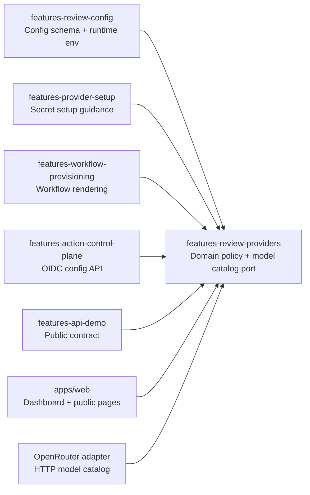

# Provider Catalog and Claude Code OAuth

## Status

Proposed.

Created: 2026-05-12.

This document describes how to add first-class Claude Code subscription OAuth
support to the ReviewRouter SaaS while cleaning up provider architecture around
Clean Architecture, DDD, SOLID, DRY, and port/adapter boundaries.

## Goal

Users should be able to choose Claude Code subscription OAuth in the SaaS
dashboard, store the generated Claude token directly in GitHub Actions secrets,
save repository or workspace review policy, provision a workflow, and have the
ReviewRouter Action run Claude Code inside the customer's GitHub Actions runner.

The SaaS must still not receive, store, log, or proxy provider credentials,
repository source code, PR diffs, prompts, or model responses by default.

## Non-Goals

- Do not move review execution into the SaaS.
- Do not store `CLAUDE_CODE_OAUTH_TOKEN` in the SaaS database or environment.
- Do not convert Claude Code subscription OAuth into `ANTHROPIC_API_KEY`.
- Do not add a hosted Anthropic API-key provider in this change unless it is
  designed separately.
- Do not rewrite the whole feature architecture. Keep the refactor bounded to
  provider metadata and provider runtime planning.

## Current Architecture Assessment

The SaaS already mostly follows the accepted feature-first DDD architecture:

```text
packages/features/<feature>/src/domain
packages/features/<feature>/src/application
packages/features/<feature>/src/application/ports
packages/features/<feature>/src/infrastructure
packages/features/<feature>/src/interface
```

Existing strong points:

- Prisma adapters live under `infrastructure/prisma`.
- GitHub adapters live under `infrastructure/github`.
- Use cases depend on application ports.
- `domain` and `application` are mostly free of Next, React, Prisma, Octokit,
  Fastify, and tRPC imports.
- `pnpm architecture:check` enforces the main forbidden import boundaries.

Existing provider weakness:

- Provider knowledge is duplicated across review config, provider setup,
  workflow provisioning, action control plane, dashboard UI, model catalog,
  public docs, and API demo.
- `authMode -> providerKind -> secretName -> runtime env -> workflow snippet`
  is not a single domain policy.
- Adding Claude by editing every switch locally would work once, but would make
  the next provider riskier.

Current provider-related locations:

```text
packages/features/review-config/src/domain/review-configuration.ts
packages/features/review-config/src/application/use-cases/map-config-to-runtime-env.ts
packages/features/provider-setup/src/domain/provider-secret-setup.ts
packages/features/workflow-provisioning/src/domain/workflow-template.ts
packages/features/action-control-plane/src/domain/action-control-plane.ts
packages/features/action-control-plane/src/infrastructure/prisma/prisma-action-control-plane-repository.ts
packages/features/api-demo/src/domain/api-demo.ts
apps/web/src/server/openrouter-model-catalog.ts
apps/web/app/dashboard/actions.ts
apps/web/app/dashboard/repository-policy-editor.tsx
apps/web/app/dashboard/provider-secret-setup-chooser.tsx
apps/web/app/dashboard/provider-secret-setup-dialog.tsx
apps/web/app/page.tsx
apps/web/app/getting-started/page.tsx
apps/web/app/security/page.tsx
apps/web/app/privacy/page.tsx
apps/web/app/disconnect/page.tsx
```

## Verified Facts and Sources

Local code facts:

- The ReviewRouter Action already has Claude provider support in
  `/Users/belief/dev/projects/review-router-action`.
- The Action reads `CLAUDE_CODE_OAUTH_TOKEN`.
- The Action maps `CLAUDE_MODEL=sonnet` to `claude/sonnet` when explicit
  `REVIEW_PROVIDERS` is absent.
- The Action provider rejects empty Claude tokens, shell commands accidentally
  stored as the token, whitespace-padded command text, and values that do not
  match the expected `sk-ant-oat01-...` token shape.
- The Action runs `claude --print` without `--bare`, isolates
  `CLAUDE_CONFIG_DIR` for OAuth-token CI execution, disables slash commands,
  disables tools, requests JSON output, and cleans temporary prompt files.

Official Claude Code docs:

- Claude Code supports `claude setup-token` for CI subscription OAuth.
- The generated token should be stored in `CLAUDE_CODE_OAUTH_TOKEN`.
- Claude's docs describe this as an OAuth token with roughly one-year
  expiration.
- Claude docs warn that `ANTHROPIC_API_KEY` has precedence over
  `CLAUDE_CODE_OAUTH_TOKEN`.
- Claude docs warn that `CLAUDE_CODE_OAUTH_TOKEN` works only with `claude`, not
  with `claude --bare`.

References:

- https://code.claude.com/docs/en/team
- https://code.claude.com/docs/en/setup
- https://code.claude.com/docs/en/model-config

## Architectural Decision

Add a provider catalog bounded context and use it as the single source of truth
for provider identity, auth modes, secret names, model options, runtime env
mapping, and workflow runtime requirements.

Recommended implementation:

```text
packages/features/review-providers/
  src/
    domain/
      provider-catalog.ts
      provider-runtime-plan.ts
      provider-secret-metadata.ts
      provider-models.ts
    application/
      ports/
        provider-model-catalog-port.ts
      use-cases/
        list-review-model-options.ts
    infrastructure/
      openrouter/
        openrouter-model-catalog.ts
    tests/
      provider-catalog.test.ts
      provider-runtime-plan.test.ts
      provider-model-catalog.test.ts
    index.ts
```

Why a new feature package:

- Provider metadata is not owned only by `review-config`.
- Provider setup needs secret guidance.
- Workflow provisioning needs runtime tool and secret mapping.
- Action control plane needs response schema and runtime env mapping.
- Dashboard needs model and UI capability metadata.
- API demo and docs need public provider copy.

Keeping it in one existing package would create an awkward dependency direction:

- If placed in `review-config`, `provider-setup` and `workflow-provisioning`
  would depend on review config for secret and workflow policy.
- If placed in `provider-setup`, runtime env mapping would depend on setup UI
  concerns.
- A small `review-providers` domain package keeps provider policy independent.

## Decision Options Considered

### Option 1 - Add Claude Inline Across Existing Files

🎯 8   🛡️ 5   🧠 4   Approximate change size: 650-900 LOC.

This means adding `claude` and `claude_code_oauth` to every existing switch,
union, copy block, and test without a shared provider catalog.

Pros:

- Fastest first implementation.
- Smallest conceptual change.
- Lower chance of broad package dependency churn.

Cons:

- Preserves the current duplication problem.
- Every future provider repeats the same risk.
- Easy to forget one of the critical paths: runtime env, workflow secret
  pass-through, dashboard secret status, API demo, or disconnect docs.
- Violates Open/Closed because adding a provider requires modifying many
  unrelated modules.

Decision: do not use except for an emergency patch.

### Option 2 - New Provider Catalog Bounded Context

🎯 9   🛡️ 9   🧠 7   Approximate change size: 1000-1500 LOC.

This introduces `@reviewrouter/features-review-providers` and moves provider
identity, auth modes, secret metadata, runtime plan, and model catalog policy
there.

Pros:

- Best fit for Clean Architecture and DDD.
- Provider rules get one owner.
- Dashboard, workflow provisioning, action control plane, and setup guidance
  consume the same policy.
- Reduces the chance of inconsistent future provider behavior.

Cons:

- More files than the inline approach.
- Requires careful package dependency direction.
- Needs good tests before touching dashboard UI.

Decision: use this.

### Option 3 - Put Catalog Inside `features-review-config`

🎯 7   🛡️ 7   🧠 5   Approximate change size: 800-1200 LOC.

This keeps provider catalog close to config parsing and runtime env mapping.

Pros:

- Fewer packages.
- Review config already owns provider configuration shape.

Cons:

- Provider setup and workflow provisioning would depend on review config for
  secrets and workflow runtime policy.
- `review-config` would become a grab bag for setup, model catalog, workflow,
  and dashboard concerns.
- Makes future extraction harder.

Decision: avoid.

## Target Dependency Graph

Provider rules should flow outward from a pure catalog. UI and infrastructure
render or fetch around that catalog; they do not redefine provider rules.



Forbidden dependencies:

```text
features-review-providers -> @prisma/client
features-review-providers -> @octokit/*
features-review-providers -> next/react
features-review-providers -> fastify
features-review-providers -> apps/*
features-review-providers -> features-workflow-provisioning
```

This keeps Dependency Inversion clean: the catalog defines policy; adapters
fetch or render environment-specific details.

## DDD Language

Use these terms consistently:

- `ProviderKind` - runtime family: `codex`, `claude`, `openrouter`.
- `ProviderAuthMode` - how credentials are supplied:
  `codex_subscription_oauth`, `codex_openai_api_key`,
  `claude_code_oauth`, `openrouter_api_key`.
- `ProviderSecretName` - GitHub Actions secret required by an auth mode.
- `ProviderRuntimeId` - action runtime provider id, for example
  `codex/gpt-5.5`, `claude/sonnet`, `openrouter/poolside/laguna-m.1:free`.
- `ProviderCapability` - UI/runtime capability such as reasoning effort,
  fast mode, agentic context, dynamic model catalog, subscription OAuth.
- `ProviderRuntimePlan` - complete non-secret runtime plan generated from a
  review configuration.
- `ProviderSetupGuidance` - commands and warnings for storing credentials
  directly in GitHub Actions secrets.

## Clean Architecture Rules for This Change

The implementation should obey these rules before any UI is changed:

1. Domain code may define provider identity, validation, and deterministic
   mappings only.
2. Application use cases may orchestrate domain policy and ports.
3. Ports belong in `application/ports` when an external capability is needed.
4. Infrastructure adapters implement ports for HTTP, Prisma, GitHub, or other
   external systems.
5. Interface adapters expose HTTP routes, CLI scripts, workflow YAML, or UI
   components.
6. Dashboard components may render provider metadata but must not own provider
   rules.
7. Generated workflows may include provider-specific shell snippets, but those
   snippets should be selected from provider catalog metadata or a workflow
   adapter helper.
8. Unknown provider data must fail closed for runtime execution.

SOLID interpretation:

- SRP: provider secret metadata, runtime env mapping, model catalog, and UI
  rendering each have one owner.
- OCP: adding another provider should add catalog entries and optional adapters,
  not edit every switch in the product.
- LSP: every provider config must be safe to pass through the common
  `ReviewProviderConfiguration` contract without surprising UI/runtime behavior.
- ISP: dashboard should ask for narrow provider capabilities instead of a broad
  provider object with irrelevant fields.
- DIP: workflow provisioning and action control plane depend on provider policy
  abstractions, not provider-specific implementation details.

## Provider Catalog Public API Contract

The catalog should export narrow, boring functions. Avoid making callers inspect
raw catalog objects and reimplement decisions.

Recommended exports:

```ts
export {
  providerKindSchema,
  providerAuthModeSchema,
  reviewProviderCatalog,
  reviewProviderAuthModes,
  reviewProviderKinds,
  providerKindForAuthMode,
  assertProviderAuthModeBelongsToKind,
  getProviderAuthModeMetadata,
  getProviderCatalogEntry,
  getProviderSecretNames,
  getProviderCapabilities,
  providerSupportsCapability,
  toRuntimeProviderId,
  buildProviderRuntimePlan,
  listStaticReviewModelOptions,
  mergeReviewModelOptions,
};

export type {
  ProviderKind,
  ProviderAuthMode,
  ProviderCapability,
  ProviderCatalogEntry,
  ProviderAuthModeMetadata,
  ProviderRuntimePlan,
  ProviderCliTool,
  RuntimeAuthMode,
  ReviewModelOption,
};
```

Design rules:

- Functions should return readonly data.
- Metadata should be defined with `satisfies` so missing auth modes fail at
  compile time.
- Exhaustiveness should be enforced with `assertNever`.
- Export schemas from the catalog, not duplicated local zod enums.
- Keep command strings for credential setup out of the core catalog unless they
  are pure and deterministic. Provider setup may own command rendering while
  using catalog metadata for secret names and labels.

## Domain Model

The provider catalog should be a pure domain module with no Prisma, Octokit,
Next, React, Fastify, or network imports.

Suggested core types:

```ts
export const providerKindSchema = z.enum([
  "codex",
  "claude",
  "openrouter",
]);

export const providerAuthModeSchema = z.enum([
  "codex_subscription_oauth",
  "codex_openai_api_key",
  "claude_code_oauth",
  "openrouter_api_key",
]);

export type ProviderKind = z.infer<typeof providerKindSchema>;
export type ProviderAuthMode = z.infer<typeof providerAuthModeSchema>;

export type ProviderCapability =
  | "reasoning_effort"
  | "fast_mode"
  | "agentic_context"
  | "static_model_catalog"
  | "dynamic_model_catalog"
  | "subscription_oauth"
  | "api_key";

export type ProviderCatalogEntry = {
  readonly kind: ProviderKind;
  readonly label: string;
  readonly authModes: readonly ProviderAuthMode[];
  readonly defaultAuthMode: ProviderAuthMode;
  readonly defaultModel: string;
  readonly runtimeProviderPrefix: "codex" | "claude" | "openrouter";
  readonly capabilities: readonly ProviderCapability[];
};

export type ProviderAuthModeMetadata = {
  readonly authMode: ProviderAuthMode;
  readonly providerKind: ProviderKind;
  readonly label: string;
  readonly shortLabel: string;
  readonly description: string;
  readonly secretNames: readonly string[];
  readonly runtimeAuthMode: "codex-oauth" | "openai-api" | "claude-oauth" | "openrouter-api";
  readonly credentialCustody: "github_actions_secret";
  readonly sendsSecretToReviewRouter: false;
};
```

Suggested static entries:

```ts
codex:
  authModes:
    - codex_subscription_oauth
    - codex_openai_api_key
  defaultAuthMode: codex_subscription_oauth
  defaultModel: gpt-5.5
  runtimeProviderPrefix: codex
  capabilities:
    - static_model_catalog
    - subscription_oauth
    - api_key
    - reasoning_effort
    - fast_mode
    - agentic_context

claude:
  authModes:
    - claude_code_oauth
  defaultAuthMode: claude_code_oauth
  defaultModel: sonnet
  runtimeProviderPrefix: claude
  capabilities:
    - static_model_catalog
    - subscription_oauth

openrouter:
  authModes:
    - openrouter_api_key
  defaultAuthMode: openrouter_api_key
  defaultModel: poolside/laguna-m.1:free
  runtimeProviderPrefix: openrouter
  capabilities:
    - dynamic_model_catalog
    - api_key
```

Implementation pattern:

```ts
const providerCatalog = {
  codex: {
    kind: "codex",
    label: "Codex",
    authModes: ["codex_subscription_oauth", "codex_openai_api_key"],
    defaultAuthMode: "codex_subscription_oauth",
    defaultModel: "gpt-5.5",
    runtimeProviderPrefix: "codex",
    capabilities: [
      "static_model_catalog",
      "subscription_oauth",
      "api_key",
      "reasoning_effort",
      "fast_mode",
      "agentic_context",
    ],
  },
  claude: {
    kind: "claude",
    label: "Claude Code",
    authModes: ["claude_code_oauth"],
    defaultAuthMode: "claude_code_oauth",
    defaultModel: "sonnet",
    runtimeProviderPrefix: "claude",
    capabilities: ["static_model_catalog", "subscription_oauth"],
  },
  openrouter: {
    kind: "openrouter",
    label: "OpenRouter",
    authModes: ["openrouter_api_key"],
    defaultAuthMode: "openrouter_api_key",
    defaultModel: "poolside/laguna-m.1:free",
    runtimeProviderPrefix: "openrouter",
    capabilities: ["dynamic_model_catalog", "api_key"],
  },
} as const satisfies Record<ProviderKind, ProviderCatalogEntry>;
```

Do not export the mutable object. Export readonly helpers that can be tested in
isolation. This keeps callers from depending on catalog internals.

Auth metadata:

```text
codex_subscription_oauth:
  providerKind: codex
  secretNames: CODEX_AUTH_JSON
  runtimeAuthMode: codex-oauth

codex_openai_api_key:
  providerKind: codex
  secretNames: OPENAI_API_KEY
  runtimeAuthMode: openai-api

claude_code_oauth:
  providerKind: claude
  secretNames: CLAUDE_CODE_OAUTH_TOKEN
  runtimeAuthMode: claude-oauth

openrouter_api_key:
  providerKind: openrouter
  secretNames: OPENROUTER_API_KEY
  runtimeAuthMode: openrouter-api
```

## Runtime Plan

Do not let workflow provisioning, action control plane, and dashboard each map
providers by hand. Add one pure function:

```ts
export type ProviderRuntimePlan = {
  readonly runtimeEnv: Readonly<Record<string, string>>;
  readonly providerIds: readonly string[];
  readonly synthesisModel: string;
  readonly requiredSecretNames: readonly string[];
  readonly requiredCliTools: readonly ProviderCliTool[];
  readonly primaryRuntimeAuthMode: RuntimeAuthMode;
};

export type ProviderCliTool = "codex" | "claude";

export function buildProviderRuntimePlan(
  config: ReviewConfiguration,
): ProviderRuntimePlan;
```

Runtime plan algorithm:

```text
1. Normalize providers:
   - if config.providers is present, use it
   - otherwise use legacy config.provider

2. Validate every provider:
   - kind is known
   - authMode is known
   - authMode belongs to kind
   - model is non-empty after trim

3. Build provider ids in user-selected order:
   - codex -> codex/<model>
   - claude -> claude/<model>
   - openrouter -> openrouter/<model>

4. Resolve synthesis model:
   - first provider id by default
   - no separate synthesis dropdown in this change

5. Resolve required secrets:
   - union secret names by auth mode
   - keep stable catalog order for deterministic workflow snapshots

6. Resolve required CLI tools:
   - codex provider -> codex
   - claude provider -> claude
   - openrouter provider -> none in the workflow, runtime adapter uses API

7. Build compatibility env:
   - REVIEW_AUTH_MODE from primary provider auth mode
   - CODEX_* only if a Codex provider exists
   - CLAUDE_MODEL only if a Claude provider exists
   - REVIEW_PROVIDERS for all provider ids
```

Runtime env mapping:

```text
Always:
  REVIEWROUTER_CONFIG_SCHEMA_VERSION
  REVIEW_PROVIDERS
  SYNTHESIS_MODEL
  PROVIDER_LIMIT
  PROVIDER_MAX_PARALLEL
  INLINE_MIN_AGREEMENT
  INLINE_MAX_COMMENTS
  TARGET_TOKENS_PER_BATCH
  FAIL_ON_SEVERITY

For first or available Codex provider:
  CODEX_MODEL
  CODEX_REASONING_EFFORT
  CODEX_AGENTIC_CONTEXT
  CODEX_FAST_MODE

For first or available Claude provider:
  CLAUDE_MODEL

For backward compatibility:
  REVIEW_AUTH_MODE = primary provider auth mode, usually the first provider
```

Important: `REVIEW_AUTH_MODE` is a compatibility hint and should not be the only
source for workflow tool installation. Multi-provider configs can require more
than one CLI.

Provider id examples:

```text
codex/gpt-5.5
claude/sonnet
openrouter/poolside/laguna-m.1:free
```

## Critical Workflow Edge Case

Current explicit generated workflows install Codex CLI before the OIDC runtime
config fetch and use this condition:

```text
env.REVIEW_AUTH_MODE == 'codex-oauth' || env.REVIEW_AUTH_MODE == 'openai-api'
```

This is not enough for Claude.

Failure scenario:

```text
1. Repo installs workflow while workspace default is Codex.
2. Later user changes dashboard config to Claude.
3. Workflow starts.
4. CLI install steps use the old static env before dynamic config is fetched.
5. Claude CLI is not installed.
6. Action fetches dynamic Claude config and then fails to run Claude.
```

Required fix:

- Generated workflows should pass all known provider secrets that the current
  action supports.
- Reusable workflow callers must pass `CLAUDE_CODE_OAUTH_TOKEN`.
- Explicit workflows should install provider CLIs based on secret presence or
  a rendered `REVIEWROUTER_REQUIRED_CLI_TOOLS` static value, not solely on
  `REVIEW_AUTH_MODE`.
- To support dashboard-only provider switches after workflow installation,
  prefer secret-presence install conditions:

```yaml
- name: Install Codex CLI
  if: ${{ secrets.CODEX_AUTH_JSON != '' || secrets.OPENAI_API_KEY != '' }}

- name: Install Claude Code CLI
  if: ${{ secrets.CLAUDE_CODE_OAUTH_TOKEN != '' }}
```

GitHub Actions cannot directly use `secrets.*` in every expression context, so
the robust reusable pattern is:

```yaml
env:
  CODEX_AUTH_JSON_PRESENT: ${{ secrets.CODEX_AUTH_JSON != '' && '1' || '0' }}
  CLAUDE_CODE_OAUTH_TOKEN_PRESENT: ${{ secrets.CLAUDE_CODE_OAUTH_TOKEN != '' && '1' || '0' }}
```

The Action reusable workflow already follows this pattern. The SaaS caller and
explicit workflow templates must catch up.

## Package Dependency Direction

Target dependencies:

```text
features-review-config -> features-review-providers
features-provider-setup -> features-review-providers
features-workflow-provisioning -> features-review-providers
features-action-control-plane -> features-review-providers
features-api-demo -> features-review-providers
apps/web -> features-review-providers
```

Avoid:

```text
features-review-providers -> apps/web
features-review-providers -> features-workflow-provisioning
features-review-providers -> @prisma/client
features-review-providers -> @octokit/*
features-review-providers -> next/react
```

This preserves Dependency Inversion:

- high-level provider policy is pure domain code
- dynamic provider model fetching is behind an application port
- OpenRouter HTTP calls are infrastructure adapters
- dashboard renders provider metadata but does not own provider rules

## Review Config Changes

Update `packages/features/review-config`:

- Import `providerKindSchema` and `providerAuthModeSchema` from
  `features-review-providers`.
- Add `claude` and `claude_code_oauth`.
- Validate that each provider's `kind` matches its `authMode`.
- Keep `reasoningEffort`, `agenticContext`, and `fastMode` for config shape
  compatibility, but interpret those controls only when the provider supports
  them.
- Replace `mapConfigToRuntimeEnv` logic with `buildProviderRuntimePlan`.
- Keep `safeDefaultReviewConfiguration` as Codex unless product wants Claude as
  default later.

Validation invariant:

```text
authMode=claude_code_oauth requires kind=claude
authMode=openrouter_api_key requires kind=openrouter
authMode=codex_subscription_oauth requires kind=codex
authMode=codex_openai_api_key requires kind=codex
```

Do not derive kind with:

```ts
authMode === "openrouter_api_key" ? "openrouter" : "codex"
```

Use:

```ts
providerKindForAuthMode(authMode)
```

## Action Control Plane Changes

Update:

```text
packages/features/action-control-plane/src/domain/action-control-plane.ts
packages/features/action-control-plane/src/application/use-cases/get-action-runtime-config.ts
packages/features/action-control-plane/src/infrastructure/prisma/prisma-action-control-plane-repository.ts
```

Required changes:

- Response schema allows `kind: claude`.
- Response schema allows `authMode: claude_code_oauth`.
- Prisma read adapters must parse provider kind/auth mode through the catalog.
- Unknown persisted provider/auth values should not silently become Codex.

Recommended unknown behavior:

```text
For runtime config:
  fail closed with invalid_provider_kind or invalid_provider_auth_mode

For dashboard read-only surfaces:
  show safe fallback only if needed for old corrupt rows, but do not execute
```

Compatibility policy:

- Extend `ActionRuntimeCompatibilityPolicyPort` to include requested provider
  kinds/auth modes.
- Block `claude_code_oauth` for action versions older than the Claude-capable
  ReviewRouter Action release or commit.
- Keep current blocked-version behavior.

Suggested port shape:

```ts
export type ActionRuntimeCompatibilityInput = {
  readonly protocolVersion: 1;
  readonly actionVersion?: string;
  readonly providerKinds?: readonly ProviderKind[];
  readonly providerAuthModes?: readonly ProviderAuthMode[];
};
```

Reason:

- A repo with an old workflow/action ref should not receive Claude config that
  the runtime cannot execute.
- The user should see a workflow update required state instead of a runtime
  failure.

## Provider Setup Changes

Update `packages/features/provider-setup`.

Current provider setup supports:

```text
codex_oauth
openai_api_key
openrouter_api_key
```

Add:

```text
claude_code_oauth
```

Provider setup guidance for Claude:

```text
1. User runs:
   claude setup-token

2. User stores only the printed token:
   gh secret set CLAUDE_CODE_OAUTH_TOKEN --repo owner/repo --app actions

3. For organization selected repositories:
   gh secret set CLAUDE_CODE_OAUTH_TOKEN --org owner --repos repo --app actions

4. For organization private/all repositories:
   gh secret set CLAUDE_CODE_OAUTH_TOKEN --org owner --visibility private --app actions
   gh secret set CLAUDE_CODE_OAUTH_TOKEN --org owner --visibility all --app actions
```

Important copy:

- Store only the token printed by `claude setup-token`.
- Do not store the shell command itself.
- Do not copy Claude keychain or config files.
- Do not store `ANTHROPIC_API_KEY` for subscription OAuth.
- Regenerate before the roughly one-year expiration or when CI reports auth
  errors.
- ReviewRouter SaaS never receives the token.

Command safety:

- `gh secret set` with no `--body` prompts for hidden input.
- An optional env-var based command can be shown for users who explicitly want a
  one-liner:

```bash
CLAUDE_CODE_OAUTH_TOKEN='paste-token-here'
printf '%s' "$CLAUDE_CODE_OAUTH_TOKEN" | gh secret set CLAUDE_CODE_OAUTH_TOKEN --repo owner/repo --app actions
unset CLAUDE_CODE_OAUTH_TOKEN
```

Avoid showing a command that encourages shell history leaks as the primary path.

## Workflow Provisioning Changes

Update `packages/features/workflow-provisioning/src/domain/workflow-template.ts`.

Recommended refactor:

- Keep top-level render functions stable.
- Add a pure provider runtime snippet builder that consumes
  `ProviderRuntimePlan` or static secret pass-through metadata.
- Use catalog secret names instead of hard-coded lists.

Reusable workflow caller must include:

```yaml
secrets:
  REVIEW_ROUTER_LEDGER_KEY: ${{ secrets.REVIEW_ROUTER_LEDGER_KEY }}
  CODEX_AUTH_JSON: ${{ secrets.CODEX_AUTH_JSON }}
  CODEX_CONFIG_TOML: ${{ secrets.CODEX_CONFIG_TOML }}
  CLAUDE_CODE_OAUTH_TOKEN: ${{ secrets.CLAUDE_CODE_OAUTH_TOKEN }}
  OPENAI_API_KEY: ${{ secrets.OPENAI_API_KEY }}
  OPENROUTER_API_KEY: ${{ secrets.OPENROUTER_API_KEY }}
```

Explicit workflow must:

- Pass `CLAUDE_CODE_OAUTH_TOKEN` to the action.
- Install Claude Code CLI when the Claude token secret is present.
- Keep fork PR secret-backed execution skipped.
- Keep `persist-credentials: false`.
- Keep `id-token: write` for OIDC runtime config.
- Keep secret values out of logs.

Claude install policy:

Official options currently documented by Anthropic:

```text
native latest:
  curl -fsSL https://claude.ai/install.sh | bash

native stable:
  curl -fsSL https://claude.ai/install.sh | bash -s stable

native exact version:
  curl -fsSL https://claude.ai/install.sh | bash -s 2.1.89

npm:
  npm install -g @anthropic-ai/claude-code
```

Recommended beta default:

```bash
curl -fsSL https://claude.ai/install.sh | bash -s stable
echo "$HOME/.local/bin" >> "$GITHUB_PATH"
```

Recommended production policy:

- Put the install command behind one constant/helper in workflow provisioning.
- Prefer an exact version once we decide an update cadence.
- If using npm, verify optional platform dependencies are installed in GitHub
  Actions because the npm package relies on platform-specific optional
  dependencies.
- Add workflow tests that assert the selected channel/version is intentional.
- Record the installed Claude version in CI logs with `claude --version`, but
  do not print secrets.

Decision score:

- Native stable channel: 🎯 8   🛡️ 7   🧠 4, best beta tradeoff.
- Native exact version: 🎯 7   🛡️ 9   🧠 6, best public production tradeoff
  after version lifecycle is owned.
- npm global install: 🎯 7   🛡️ 7   🧠 5, useful fallback if curl installer is
  blocked, but optional dependencies add a failure mode.

## Dashboard Server Actions

Update `apps/web/app/dashboard/actions.ts`.

Replace local unions and switch logic with catalog functions:

```text
readReviewConfigurationForm
  -> providerKindForAuthMode(authMode)

readProviderSetupSelection
  -> parseProviderSetupSelection(providerKind, authMode)

providerSecretNamesForAuthMode
  -> secretNamesForAuthMode(authMode)
```

Edge cases:

- Invalid `providerKind/authMode` pair fails as invalid form value.
- Provider count must remain at least one.
- Non-Codex controls should submit hidden defaults but not be visible.
- Claude setup confirmation should verify GitHub secret metadata existence, not
  token validity.

## Dashboard Policy Editor

Update `apps/web/app/dashboard/repository-policy-editor.tsx`.

Required behavior:

- Provider auth dropdown includes Claude Code subscription.
- Model dropdown shows Claude options for `claude` providers.
- Claude uses `CLAUDE_CODE_OAUTH_TOKEN` status.
- Claude hides Codex-only controls:
  - reasoning effort
  - fast mode
  - agentic context
- If a provider is switched to Claude, choose the first selectable Claude model,
  default `sonnet`.
- Secret notices group by auth mode, so two Claude providers should show one
  shared secret status.

Use catalog helpers:

```text
providerKindForAuthMode
getProviderCapabilities
getProviderSecretMetadata
getDefaultProviderConfigForAuthMode
```

Avoid:

```ts
const kind = authMode === "openrouter_api_key" ? "openrouter" : "codex";
```

## Model Catalog

Move `apps/web/src/server/openrouter-model-catalog.ts` into the new
`features-review-providers` package, split into:

```text
domain/provider-models.ts
application/use-cases/list-review-model-options.ts
application/ports/provider-model-catalog-port.ts
infrastructure/openrouter/openrouter-model-catalog.ts
```

Static model options:

```text
Codex:
  gpt-5.5
  gpt-5.4
  gpt-5.4-mini
  gpt-5.3-codex
  gpt-5.3-codex-spark
  gpt-5.2

Claude:
  sonnet
  opus
  haiku
```

Lower confidence area:

- Exact Claude Code model aliases can change.
- Keep model field editable so a user can type a newer Claude model id.
- Treat `sonnet` as the default because it was validated in the Action E2E
  path and is the safest subscription default.
- Do not hard-block custom Claude model strings unless the CLI has a stable
  documented list endpoint.

OpenRouter remains dynamic with a fallback catalog.

## Public Website and API Demo

Update public copy so it is truthful but not ahead of implementation.

Pages:

```text
apps/web/app/page.tsx
apps/web/app/getting-started/page.tsx
apps/web/app/security/page.tsx
apps/web/app/privacy/page.tsx
apps/web/app/disconnect/page.tsx
apps/web/app/auth/signin/page.tsx
apps/web/app/opengraph-image.tsx
apps/web/app/github-app-install-permission-dialog.tsx
apps/web/src/server/repository-health-view.ts
```

API demo:

```text
packages/features/api-demo/src/domain/api-demo.ts
packages/features/api-demo/src/interface/html.ts
packages/features/api-demo/src/interface/markdown.ts
scripts/check-hosted-api-demo.mjs
```

Required copy:

- Provider credentials can be Codex OAuth, Claude Code OAuth, OpenAI API key,
  or OpenRouter API key.
- SaaS does not receive provider secrets.
- Claude Code subscription OAuth uses `CLAUDE_CODE_OAUTH_TOKEN` generated by
  `claude setup-token`.
- Disconnect instructions delete `CLAUDE_CODE_OAUTH_TOKEN` in addition to
  Codex/OpenAI/OpenRouter secrets.

Hosted readiness:

```text
scripts/check-hosted-readiness.mjs
```

Add forbidden SaaS env:

```text
CLAUDE_CODE_OAUTH_TOKEN
```

`ANTHROPIC_API_KEY` is already forbidden and should remain forbidden for this
feature.

## Database Impact

No Prisma migration is expected for first-class Claude provider support.

Reason:

- `providerKind` is `String`.
- `providerAuthMode` is `String`.
- `ProviderSetupState.authMode` is `String`.
- Existing unique keys already include provider/auth strings.

Required caution:

- The absence of DB enum constraints means application parsing must be strict.
- Do not silently coerce unknown strings to Codex.
- Add tests for corrupt persisted provider values.

## Security Invariants

Must hold after implementation:

```text
SaaS database never stores CLAUDE_CODE_OAUTH_TOKEN.
SaaS env readiness rejects CLAUDE_CODE_OAUTH_TOKEN.
SaaS env readiness rejects ANTHROPIC_API_KEY for this feature.
Runtime config response never contains token values or secret-like values.
Dashboard only checks GitHub secret metadata, never secret values.
Generated workflow does not echo provider secrets.
Fork PRs do not run secret-backed review.
Provider CLI subprocess env is sanitized by the Action runtime.
Claude OAuth path does not use --bare.
```

Secret metadata limitation:

- GitHub can confirm the secret exists and whether an org secret is selected for
  a repository.
- GitHub cannot confirm the decrypted token value.
- Token validity is proven only by a real CI run.

## Error Taxonomy and User Recovery

Provider errors should be safe, classified, and actionable. Avoid leaking raw
CLI output into dashboard-visible state.

Recommended safe categories:

```text
provider_secret_missing:
  GitHub secret metadata is absent or unavailable to repo.
  User action: store secret or update org selected repositories.

provider_secret_permission_unknown:
  GitHub App cannot verify metadata due to permissions.
  User action: grant permissions or use manual confirmation.

provider_auth_invalid:
  Action runtime reports auth failure, invalid token shape, expired token, or
  wrong credential type.
  User action: regenerate token or store only the setup-token output.

provider_cli_missing:
  Workflow did not install or expose the required CLI.
  User action: update ReviewRouter workflow.

provider_cli_failed:
  CLI exits non-zero for non-auth reason.
  User action: inspect Actions run, then contact support with safe run id.

provider_rate_limited:
  Provider or subscription quota/rate limit reached.
  User action: retry later or switch provider.

workflow_incompatible:
  Action/workflow ref does not support selected provider.
  User action: create setup PR update.
```

Mapping rules:

- `CLAUDE_CODE_OAUTH_TOKEN` missing in GitHub metadata -> `provider_secret_missing`.
- Claude token exists but Action rejects shape -> `provider_auth_invalid`.
- Claude CLI command not found -> `provider_cli_missing`.
- Old action ref receiving Claude config -> `workflow_incompatible`.
- Unknown provider strings in DB -> fail closed as `invalid_provider_config`,
  not `provider_unhealthy`.

Dashboard copy should include next steps and should never ask the user to paste
the Claude token into ReviewRouter.

## Edge Cases

### Token accidentally stored as command

Problem:

```text
User stores:
pbpaste | gh secret set CLAUDE_CODE_OAUTH_TOKEN --repo owner/repo
```

Expected:

- SaaS metadata check passes because the secret exists.
- Action runtime rejects the value with a clear safe error.
- Health report maps to provider auth invalid or provider unhealthy.
- Dashboard recovery copy tells user to store only the token printed by
  `claude setup-token`.

### Token with newline or spaces

Expected:

- Action trims surrounding whitespace but rejects internal whitespace and shell
  command text.
- Provider setup copy should warn that the token should be a single line.

### Token expiration

Expected:

- SaaS cannot know expiration.
- Dashboard copy says regenerate before roughly one year or when CI reports
  auth errors.
- Health report should guide regeneration.

### `ANTHROPIC_API_KEY` precedence

Expected:

- SaaS does not set it.
- Hosted readiness rejects it.
- Generated workflow does not pass it.
- Public docs warn that Claude Code subscription OAuth should use
  `CLAUDE_CODE_OAUTH_TOKEN`, not `ANTHROPIC_API_KEY`.

### Dynamic config switch after workflow installation

Expected:

- Reusable caller already passes all known provider secrets.
- Explicit workflow installs CLIs based on secret presence or all supported
  secret-backed tools.
- If an older workflow lacks `CLAUDE_CODE_OAUTH_TOKEN` pass-through, dashboard
  should show workflow update required before enabling Claude.

### Mixed providers

Examples:

```text
codex/gpt-5.5 + claude/sonnet
claude/sonnet + openrouter/poolside/laguna-m.1:free
codex/gpt-5.5 + claude/sonnet + openrouter/...
```

Expected:

- `REVIEW_PROVIDERS` contains all provider ids.
- `SYNTHESIS_MODEL` is first provider id unless product changes that rule.
- `PROVIDER_LIMIT` equals provider count.
- Required secrets are the union of auth mode secret names.
- Required CLI tools are the union of provider runtime tool requirements.
- `REVIEW_AUTH_MODE` remains a compatibility hint for the primary provider, not
  an exhaustive dependency indicator.

### Organization selected repository secret

Expected:

- For org accounts, recommended scope remains selected repository.
- GitHub metadata check validates selected repo access where permission allows.
- If app lacks org secret read permission, allow manual confirmation but show
  warning.

### Locked-down GitHub organizations

Expected:

- Reusable workflow may be blocked by organization Actions policy.
- Explicit workflow remains fallback.
- Docs should mention that orgs can restrict external reusable workflows and
  actions.

### Old ReviewRouter Action ref

Expected:

- Action control plane blocks Claude config for versions before Claude support.
- Setup flow can generate a workflow update PR.
- Error is safe and actionable.

### OpenRouter dynamic catalog failure

Expected:

- Static Codex and Claude model options still render.
- OpenRouter falls back to local fallback catalog.
- No provider setup flow should block just because OpenRouter model fetch fails.

### Public repository fork PR

Expected:

- Workflow skips secret-backed review for fork PRs.
- No Claude secret is passed to untrusted fork code.

### Action logs

Expected:

- Claude token is only present as a GitHub secret and is masked by GitHub.
- Generated workflow must not print token.
- Action runtime error messages must not include token values.

## Implementation Plan

### Phase 0 - Preflight and Guardrails

Approximate size: 0-80 LOC.

Tasks:

1. Confirm the ReviewRouter Action commit or release that includes Claude Code
   OAuth support.
2. Decide the minimum Claude-capable action ref:
   - beta can use `777genius/review-router@main`
   - production should use a release tag or commit SHA
3. Add a small TODO in the plan or implementation PR for Claude CLI install
   version/channel ownership.
4. Inspect dirty worktree before editing dashboard files and preserve unrelated
   changes.
5. Run the current baseline tests that are likely to be affected:

```bash
pnpm --filter @reviewrouter/features-review-config typecheck
pnpm --filter @reviewrouter/features-provider-setup typecheck
pnpm --filter @reviewrouter/features-workflow-provisioning typecheck
pnpm --filter @reviewrouter/features-action-control-plane typecheck
pnpm --filter @reviewrouter/web typecheck
pnpm architecture:check
```

Acceptance:

- Baseline status is known before refactor.
- Minimum action compatibility target is written down.
- No unrelated user changes are reverted.

### Phase 1 - Catalog Foundation

Approximate size: 250-400 LOC.

Tasks:

1. Add `packages/features/review-providers`.
2. Add provider kind/auth mode schemas.
3. Add auth metadata and provider metadata.
4. Add runtime provider id helpers.
5. Add secret metadata helpers.
6. Add provider capability helpers.
7. Add tests for every mapping.
8. Add package to imports where needed.

Acceptance:

- `pnpm --filter @reviewrouter/features-review-providers typecheck`
- Provider catalog tests pass.
- `pnpm architecture:check` still passes.
- No app or infrastructure package imports into `features-review-providers`.

### Phase 2 - Review Config and Runtime Env

Approximate size: 150-250 LOC.

Tasks:

1. Update review config schema to use provider catalog schemas.
2. Add auth/kind pair validation.
3. Replace `mapConfigToRuntimeEnv` internals with runtime plan builder.
4. Add `CLAUDE_MODEL`.
5. Add `claude/<model>` runtime ids.
6. Add mixed provider tests.
7. Add corrupt or invalid config tests.

Acceptance:

- Existing Codex/OpenRouter tests still pass.
- New Claude config parses.
- Invalid `kind/authMode` pairs fail.
- Runtime env for Claude includes:

```text
REVIEW_AUTH_MODE=claude-oauth
REVIEW_PROVIDERS=claude/sonnet
CLAUDE_MODEL=sonnet
SYNTHESIS_MODEL=claude/sonnet
```

### Phase 3 - Action Control Plane

Approximate size: 120-220 LOC.

Tasks:

1. Extend action runtime response schema.
2. Stop unknown provider fallback to Codex.
3. Add Claude runtime config tests.
4. Extend compatibility input with provider info.
5. Add blocked old action version test for Claude.

Acceptance:

- Runtime config response includes Claude providers.
- Runtime config response does not include secret names or secret values.
- Old action ref handling is explicit and tested.

### Phase 4 - Workflow Provisioning

Approximate size: 150-300 LOC.

Tasks:

1. Add `CLAUDE_CODE_OAUTH_TOKEN` to reusable caller secrets.
2. Add `CLAUDE_CODE_OAUTH_TOKEN` to explicit action env.
3. Add Claude CLI install step to explicit workflow.
4. Prefer secret-presence or required-tools install logic over
   `REVIEW_AUTH_MODE` only.
5. Update workflow template tests and snapshots.

Acceptance:

- Reusable caller passes Claude token.
- Explicit workflow can run Claude after dashboard config switch.
- Fork PR skip behavior stays intact.
- Unsafe URL/action ref/static env tests still pass.

### Phase 5 - Provider Setup Guidance

Approximate size: 180-300 LOC.

Tasks:

1. Add `claude_code_oauth` setup kind.
2. Add repo and org secret commands.
3. Add warnings and recovery copy.
4. Add tests for repo, org selected, org private, org all.
5. Ensure guidance says SaaS does not receive token.

Acceptance:

- User can select Claude in setup dialog.
- Secret names resolve to `CLAUDE_CODE_OAUTH_TOKEN`.
- Tests prove org selected repo command is correct.

### Phase 6 - Dashboard UI

Approximate size: 300-550 LOC.

Tasks:

1. Add Claude auth option.
2. Add Claude model options.
3. Hide Codex-only controls for Claude.
4. Use catalog helpers for auth mode metadata.
5. Use catalog helpers in server actions.
6. Add repository policy editor tests.
7. Add provider setup chooser/dialog tests if existing coverage pattern allows.

Acceptance:

- User can choose Claude Code subscription.
- Form posts `providerKind=claude` and `authMode=claude_code_oauth`.
- Secret status checks `CLAUDE_CODE_OAUTH_TOKEN`.
- Existing Codex/OpenRouter flows remain unchanged.

### Phase 7 - Public Copy and API Demo

Approximate size: 150-300 LOC.

Tasks:

1. Update landing copy.
2. Update getting started.
3. Update security/privacy/disconnect pages.
4. Update GitHub App permission dialog secret list.
5. Update API demo providers and OpenAPI schema examples.
6. Update hosted readiness forbidden envs.
7. Update hosted API demo smoke assertions.

Acceptance:

- Public copy matches real product support.
- Disconnect page includes Claude secret deletion.
- Hosted readiness rejects `CLAUDE_CODE_OAUTH_TOKEN`.
- API demo lists Claude and states credentials stay out of SaaS.

### Phase 8 - End-to-End Verification

Approximate size: test run only, unless adding scripts.

Local checks:

```bash
pnpm --filter @reviewrouter/features-review-providers typecheck
pnpm --filter @reviewrouter/features-review-config typecheck
pnpm --filter @reviewrouter/features-provider-setup typecheck
pnpm --filter @reviewrouter/features-workflow-provisioning typecheck
pnpm --filter @reviewrouter/features-action-control-plane typecheck
pnpm --filter @reviewrouter/features-api-demo typecheck
pnpm --filter @reviewrouter/web typecheck
pnpm test
pnpm architecture:check
pnpm build
pnpm runtime:smoke
```

Real GitHub smoke:

```text
1. Reuse existing disposable E2E repository if possible.
2. Store CLAUDE_CODE_OAUTH_TOKEN as a GitHub Actions secret.
3. Create or update SaaS-generated workflow.
4. Save repository policy with Claude Code subscription provider.
5. Open or update a PR.
6. Confirm Actions run installs Claude Code CLI.
7. Confirm ReviewRouter posts summary and inline review comments.
8. Confirm health report reaches SaaS without secrets.
9. Delete the test PR or leave it as recorded evidence.
10. Revoke the Claude setup-token after the smoke if it was generated only for testing.
```

Do not create many disposable repositories. Reuse existing smoke repos unless
isolation is required.

## Test Matrix

### Unit

Provider catalog:

- every auth mode maps to correct provider kind
- every auth mode maps to correct secret names
- every provider maps to correct runtime prefix
- every provider has a default model
- invalid auth mode fails
- invalid kind/auth pair fails

Review config:

- Claude config parses
- Claude invalid kind/auth pair fails
- multi-provider Codex + Claude runtime env
- multi-provider Claude + OpenRouter runtime env
- `providerMaxParallel` clamps to provider count
- defaults remain backward-compatible

Provider setup:

- Claude repo command
- Claude org selected command
- Claude org private command
- Claude org all command
- warnings include no SaaS custody
- warnings include store only printed setup token

Workflow:

- reusable caller passes `CLAUDE_CODE_OAUTH_TOKEN`
- explicit workflow passes `CLAUDE_CODE_OAUTH_TOKEN`
- explicit workflow installs Claude CLI
- fork PR skip still exists
- merge queue required workflow does not run secret-backed review
- unsafe action ref/api URL/env key still fails

Action control plane:

- config response includes Claude provider
- config response includes `CLAUDE_MODEL`
- config response excludes token-like values
- unknown persisted provider fails closed
- old unsupported action version blocks Claude

Dashboard:

- auth dropdown includes Claude Code subscription
- selecting Claude posts `providerKind=claude`
- secret check form uses `CLAUDE_CODE_OAUTH_TOKEN`
- Claude hides Codex controls
- OpenRouter and Codex tests still pass

API demo:

- providers include Claude
- control plane does not store Claude token
- OpenAPI schema remains valid
- hosted API demo smoke checks Claude copy

### Integration

Prisma review config repository:

- save and load Claude config
- save and load multi-provider config with Claude
- repository override with Claude wins over workspace default
- clearing repository override falls back to workspace default

Provider setup state:

- confirm Claude setup state for repo target
- confirm duplicate auth mode idempotency by unique key

### Real E2E

Minimum final proof:

- Real same-repo PR.
- Real `CLAUDE_CODE_OAUTH_TOKEN` in GitHub Actions secret.
- Real workflow run.
- Real review comment posted.
- Real health report received.
- Token revoked after test if generated for smoke.

## Rollout Plan

1. Land provider catalog and unit tests.
2. Land Claude in review config/runtime env.
3. Land workflow provisioning update before dashboard UI exposes Claude.
4. Land dashboard setup and policy editor.
5. Land docs and API demo.
6. Run local gates.
7. Run real GitHub smoke using a disposable repo.
8. Revoke test token.
9. Cut or pin action version that includes Claude support.
10. Enable public copy only after the E2E proof is recorded.

## Backward Compatibility

Existing repositories:

- Continue to use Codex default.
- Existing Codex/OpenRouter configs parse unchanged.
- Existing workflows continue to work.
- Dashboard should show workflow update required if a repo's workflow cannot
  pass Claude secrets or install Claude CLI.

Existing data:

- No DB migration.
- Old config rows remain valid.
- Unknown bad strings should fail closed for runtime execution.

Existing action versions:

- Must not receive Claude runtime config if unsupported.
- Compatibility policy should block unsupported versions with a safe actionable
  error.

## Low-Confidence Areas and Derisking

### Claude CLI install pinning

Confidence: medium.

Concern:

- Official install command uses `curl -fsSL https://claude.ai/install.sh | bash`.
- This is less pinned than package-manager installs.

Derisk:

- Put install command in one workflow helper.
- Add a comment and test around the command.
- Before public production, decide if a pinned install path exists.
- Keep explicit workflow fallback easy to inspect.

### Claude model aliases

Confidence: medium.

Concern:

- `sonnet`, `opus`, `haiku` aliases are convenient and currently supported by
  the Action tests, but exact Claude Code model alias behavior can change.

Derisk:

- Default to `sonnet`.
- Keep model field editable.
- Do not reject custom Claude model values in SaaS.
- Update static suggestions only after checking official Claude docs or CLI
  help.

### Dynamic provider switch without workflow PR

Confidence: medium-high after design change.

Concern:

- Old explicit workflows use static `REVIEW_AUTH_MODE` to decide CLI install.

Derisk:

- Generated workflows pass all known provider secrets.
- Explicit workflow install steps use secret-presence booleans.
- Dashboard detects outdated workflows and prompts setup PR update.
- Add workflow template test for Claude after a Codex static fallback.

### Action version compatibility

Confidence: medium.

Concern:

- Current compatibility policy only blocks known-bad versions, not feature
  minimums.

Derisk:

- Add provider-aware compatibility checks.
- Add tests that `claude_code_oauth` is denied for old action refs.
- Use release tag or commit SHA known to contain Claude provider.

### GitHub organization secret metadata

Confidence: medium.

Concern:

- Org secret selected-repo checks require specific GitHub App permissions and
  org plan behavior.

Derisk:

- Keep manual confirmation fallback.
- Show precise warning when metadata check permission is unavailable.
- Add mocked Octokit tests for selected repo unavailable and permission denied.

## Anti-Patterns to Avoid

- Do not add `claude` with one-off switch statements in every UI and feature
  package.
- Do not keep `authMode === "openrouter_api_key" ? "openrouter" : "codex"`.
- Do not use `REVIEW_AUTH_MODE` as the only source for CLI install decisions.
- Do not copy Claude local config/keychain files into CI.
- Do not suggest `ANTHROPIC_API_KEY` for Claude subscription OAuth.
- Do not store Claude token in SaaS env, DB, logs, audit metadata, action health
  report, or runtime config.
- Do not let unknown provider strings execute as Codex.
- Do not make public website claims before workflow, dashboard, and action
  control plane support are actually merged and tested.

## Acceptance Criteria

Functional:

- Dashboard has Claude Code subscription as a provider auth option.
- User can store `CLAUDE_CODE_OAUTH_TOKEN` from setup guidance.
- User can save a repository policy with Claude.
- Generated reusable caller passes the Claude secret.
- Generated explicit workflow can install Claude CLI.
- OIDC runtime config returns Claude runtime env.
- Action runs Claude Code and posts review comments in a real repository.

Security:

- SaaS never receives Claude token.
- Hosted readiness rejects Claude token in SaaS env.
- Runtime config contains no secret values.
- Fork PR secret-backed execution remains skipped.
- Unknown provider values fail closed.

Architecture:

- Provider rules live in `features-review-providers`.
- Dashboard and server actions consume catalog helpers.
- Workflow provisioning consumes catalog helpers.
- Review config consumes catalog schemas and runtime plan.
- No forbidden framework/SDK imports enter domain/application layers.

Testing:

- Unit tests cover all catalog mappings.
- Workflow template tests cover Claude.
- Dashboard tests cover Claude selection and secret check.
- API demo tests cover Claude provider copy.
- Real E2E smoke verifies comments and health.

## Suggested Implementation Order

Preferred order:

1. Provider catalog package.
2. Review config schema and runtime plan.
3. Action control plane schema and compatibility.
4. Workflow provisioning.
5. Provider setup guidance.
6. Dashboard policy editor and setup dialog.
7. Public copy and API demo.
8. Local gates.
9. Real GitHub E2E.
10. Token revocation and recorded smoke evidence.

This order avoids showing Claude in the UI before the backend and generated
workflow can actually run it.
