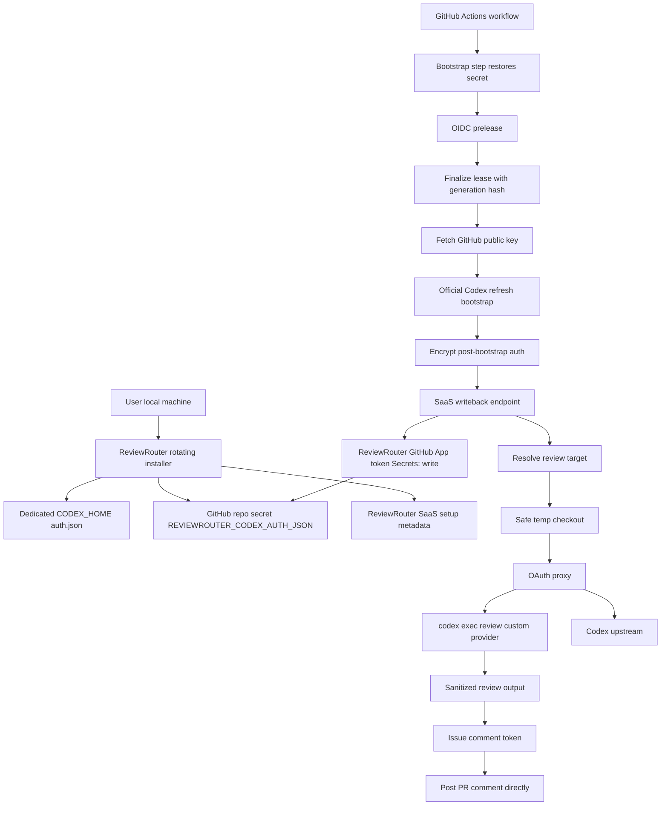

# Codex OAuth GitHub-Hosted Auto-Refresh - Private Beta Plan

This is the focused beta plan for Codex ChatGPT OAuth auto-refresh on
GitHub-hosted runners.

The larger reference plan remains:
[`42-codex-oauth-github-hosted-refresh-plan.md`](./42-codex-oauth-github-hosted-refresh-plan.md).
That document is the security backlog and enterprise hardening map. This file
has two layers:

- **First Private Beta** - the smallest useful customer beta that proves
  GitHub-hosted Codex OAuth refresh/writeback without a self-hosted runner.
- **Hardened Beta Reference** - the safer follow-up backlog for required checks,
  merge queue, exhaustive scanners, and broader edge-case coverage.

## Summary

Goal:

- user runs one local setup command once
- GitHub-hosted workflow restores `REVIEWROUTER_CODEX_AUTH_JSON`
- ReviewRouter action obtains an OIDC prelease before its code calls
  `core.getInput("auth-json")` or parses auth
- ReviewRouter action lets the official Codex CLI refresh auth in a short-lived
  isolated bootstrap, then deletes the temp auth file
- ReviewRouter action immediately encrypts and writes back the post-bootstrap
  auth snapshot before actual PR review starts
- ReviewRouter action checks out PR code only after writeback is confirmed,
  into a fresh temp workspace with no persisted credentials
- ReviewRouter proxy runs the actual PR review without giving the review Codex
  runtime the raw `auth.json`
- ReviewRouter SaaS writes that encrypted value back to the repository secret
  through the ReviewRouter GitHub App before review continues
- first private beta is advisory-only; hardened beta can add a stable no-secret
  `reviewrouter-codex-policy` job for customers who want branch protection
- next workflow run uses the refreshed secret

First private beta target:

```text
🎯 8.7 / 10   🛡️ 8.2 / 10   🧠 6.7 / 10
Approx changes: 9000-18000 LOC
```

Hardened beta reference:

```text
🎯 9.5 / 10   🛡️ 9.5 / 10   🧠 8.5 / 10
Approx changes: 14000-32800 LOC
```

The `32800 LOC` number is a ceiling for the hardened reference, not the first
implementation target. First private beta should be advisory-only and should not
ship required-check support, merge queue support, full dashboard repair flows,
full module-load sentinel E2E, reusable workflows, or broad runner compatibility
matrices. Those stay in this document so implementation has a clear hardening
path, but they are not the first cut.

This is not the 45k-100k enterprise plan. Even hardened beta intentionally skips
procfs compatibility matrices, reusable workflow support, full token issuer
ledger, cache-poisoning harness, support-console workflows, and incident drills.
The irreducible complexity comes from the zero-plaintext-SaaS boundary, OIDC
lease enforcement, and durable writeback ordering. Without those, this would be
a 4000-9000 LOC feature but with materially worse security.

## External Facts

Sources to re-check before implementation:

- OpenAI Codex CI/CD auth:
  https://developers.openai.com/codex/auth/ci-cd-auth
- OpenAI Codex auth:
  https://developers.openai.com/codex/auth
- OpenAI Codex configuration reference:
  https://developers.openai.com/codex/config-reference
- OpenAI Codex advanced configuration:
  https://developers.openai.com/codex/config-advanced
- OpenAI Codex permission profiles:
  https://developers.openai.com/codex/permissions
- GitHub Actions secrets REST API:
  https://docs.github.com/en/rest/actions/secrets
- GitHub Actions secrets reference:
  https://docs.github.com/en/actions/reference/security/secrets
- GitHub Apps installation tokens REST API:
  https://docs.github.com/en/rest/apps/apps
- GitHub Actions OIDC:
  https://docs.github.com/en/actions/reference/security/oidc
- GitHub `GITHUB_TOKEN`:
  https://docs.github.com/en/actions/concepts/security/github_token
- GitHub Actions secure use:
  https://docs.github.com/en/actions/reference/security/secure-use
- GitHub Pull Requests REST API:
  https://docs.github.com/en/rest/pulls/pulls
- GitHub Actions workflow runs REST API:
  https://docs.github.com/en/rest/actions/workflow-runs
- GitHub Actions workflow syntax:
  https://docs.github.com/en/actions/reference/workflows-and-actions/workflow-syntax
- GitHub Actions contexts:
  https://docs.github.com/en/actions/reference/workflows-and-actions/contexts
- GitHub Actions secrets in workflows:
  https://docs.github.com/en/actions/how-tos/write-workflows/choose-what-workflows-do/use-secrets
- GitHub Actions workflow commands:
  https://docs.github.com/en/actions/reference/workflows-and-actions/workflow-commands
- GitHub REST API versions:
  https://docs.github.com/en/rest/about-the-rest-api/api-versions
- GitHub-hosted runners reference:
  https://docs.github.com/en/actions/reference/runners/github-hosted-runners
- GitHub required status checks troubleshooting:
  https://docs.github.com/en/pull-requests/collaborating-with-pull-requests/collaborating-on-repositories-with-code-quality-features/troubleshooting-required-status-checks
- GitHub status checks:
  https://docs.github.com/en/pull-requests/collaborating-with-pull-requests/collaborating-on-repositories-with-code-quality-features/about-status-checks
- GitHub merge queue:
  https://docs.github.com/repositories/configuring-branches-and-merges-in-your-repository/configuring-pull-request-merges/using-a-merge-queue
- GitHub Actions Toolkit core source:
  https://github.com/actions/toolkit/blob/main/packages/core/src/core.ts
- OpenAI Codex GitHub Action:
  https://developers.openai.com/codex/github-action

Facts used by this beta plan:

- OpenAI's documented CI/CD account-auth pattern is restore `auth.json`, run
  Codex, then persist the updated `auth.json`.
- OpenAI's documented advanced CI/CD guidance says a given `auth.json` copy
  should be used by only one machine or serialized job stream. The beta
  single-writer lease is the product implementation of that rule for
  GitHub-hosted ephemeral runners.
- OpenAI's docs currently describe Codex treating a session as stale after
  roughly 8 days in the open-source client, but beta must not hardcode that as
  a product SLA; it should run the official refresh bootstrap and persist the
  resulting file.
- OpenAI explicitly says not to call a refresh API directly; a normal Codex run
  can refresh the session.
- OpenAI's Codex GitHub Action installs the Codex CLI and then runs
  `codex exec`, but the beta rotating OAuth workflow has a stricter secret
  boundary than the stock API-key action. Do not reuse the stock action as a
  black box for secret materialization.
- File-backed Codex auth is password-like material and must not be committed,
  pasted, logged, or stored in public artifacts.
- Codex CLI supports device-code login through `codex login --device-auth` when
  device-code login is enabled for the ChatGPT account/workspace. Beta setup
  can use it for a terminal-first flow but must provide a normal browser-login
  fallback.
- Codex CLI can store credentials in `auth.json` under `CODEX_HOME` when
  `cli_auth_credentials_store = "file"` is configured. Dedicated setup mode
  relies on this instead of trying to extract credentials from the user's OS
  keyring.
- Codex custom model providers are configured with `model_provider` and
  `[model_providers.<id>]` including `base_url` and `wire_api`.
- Codex ignores provider/auth routing keys such as `model_provider`,
  `model_providers`, `openai_base_url`, and `chatgpt_base_url` from
  project-local `.codex/config.toml`; routing must come from the temp
  user-level `CODEX_HOME/config.toml` that ReviewRouter controls.
- Codex can mark a project path as `untrusted`; untrusted projects skip
  project-scoped `.codex/` config, hooks, and rules.
- Codex supports permission profiles for local command execution. The beta
  review runtime should use a read-only profile with an explicit network
  allowlist instead of broad workspace or danger-full-access settings.
- Codex permission profiles do not compose with the older `sandbox_mode` /
  `sandbox_workspace_write` settings. A single review config must use one
  system, and beta should prefer permission profiles if the spike proves they
  work reliably on GitHub-hosted Ubuntu runners.
- Codex network permission profiles control sandboxed command traffic. The
  ReviewRouter loopback proxy is Codex model transport, not something review
  shell tools should call. Beta should keep command-tool network disabled unless
  the spike proves the exact Codex CLI version requires a loopback allowlist for
  custom provider transport.
- Codex supports `approval_policy = "never"` for non-interactive runs and
  `shell_environment_policy` controls for subprocess environment inheritance.
- Ephemeral runners need a secure round-trip because the runner filesystem is
  lost after each job.
- GitHub `PUT /repos/{owner}/{repo}/actions/secrets/{secret_name}` requires
  repository `Secrets: write`.
- GitHub Actions secrets are limited to 48 KB. Beta should enforce a smaller
  compact-auth byte budget before refresh and before writeback instead of
  discovering the limit after Codex may have rotated auth.
- GitHub installation tokens should be requested with explicit
  `repository_ids` and explicit `permissions`; omitted scope can produce a
  broader token than intended.
- GitHub repository public keys are fetched from
  `GET /repos/{owner}/{repo}/actions/secrets/public-key`; private repositories
  need a token with repository `Secrets: read`.
- GitHub repository secret updates require `encrypted_value` encrypted with the
  repository public key plus the matching `key_id`; GitHub does not accept
  plaintext secret values through the REST secret update endpoint.
- GitHub returns `201` when a repository secret is created and `204` when an
  existing repository secret is updated. Beta writeback must treat both as
  successful GitHub-side writes and rely on DB intent confirmation for its own
  state transition.
- GitHub REST API version `2026-03-10` is listed as supported in GitHub Docs on
  2026-05-25, and older REST API versions stay supported for a limited overlap
  window. Beta should centralize the REST API version header, test it against
  disposable repos, and re-check it before implementation/release.
- GitHub's Actions Secrets REST API returns secret metadata without revealing
  the encrypted or plaintext value. Beta writeback confirmation therefore
  cannot be a plaintext read-after-write comparison; it must use GitHub `PUT`
  status, durable DB state, and next-run validation.
- `GITHUB_TOKEN` is job-scoped and repository-limited, but beta should not rely
  on it for Actions secret public-key access because the documented secret API
  uses explicit repository `Secrets` permissions. Use a ReviewRouter App helper
  token with `Secrets: read` instead.
- GitHub OIDC JWTs include claims such as `repository`, `repository_id`,
  `repository_owner_id`, `repository_visibility`, `actor`, `actor_id`, `ref`,
  `ref_type`, `run_id`, `run_attempt`, `event_name`, `workflow_ref`,
  `workflow_sha`, `jti`, `exp`, `nbf`, `iat`, `runner_environment`, and
  reusable-workflow claims. The SaaS lease endpoint must verify these claims,
  not trust workflow-provided JSON fields.
- GitHub OIDC JWTs can be requested by custom actions through `getIDToken()` or
  runner env variables `ACTIONS_ID_TOKEN_REQUEST_URL` and
  `ACTIONS_ID_TOKEN_REQUEST_TOKEN` when the job has `id-token: write`. Beta
  action code must not pass these env vars to refresh, checkout, proxy, or Codex
  child processes.
- GitHub OIDC `sub` can be customized by repository/organization templates.
  Beta should record it for audit but rely on stable explicit claims such as
  `repository_id`, `repository_owner_id`, `workflow_ref`, `workflow_sha`,
  `run_id`, and `run_attempt` for policy decisions.
- GitHub `id-token: write` only allows the job to request an OIDC JWT. It does
  not grant repository read/write access by itself.
- GitHub contexts can include sensitive data such as `github.token`, and GitHub
  warns that some contexts may contain attacker-controlled input. Beta action
  code must never send or log the whole `github.context` object.
- GitHub `needs` context exposes outputs from dependency jobs, and missing
  context properties evaluate to empty strings. Final policy checks must treat
  absent or malformed ReviewRouter outputs as explicit states, not as success.
- GitHub does not pass repository/organization secrets to fork-triggered
  workflows except `GITHUB_TOKEN`; secrets are also not automatically passed to
  reusable workflows and are unavailable for Dependabot-triggered workflows.
- GitHub workflow `permissions` modifies the `GITHUB_TOKEN`; job-level
  permissions apply to all actions and shell commands in that job.
- GitHub workflow `concurrency.cancel-in-progress` can cancel a running job.
  Beta must not enable cancellation for the secret-backed job because
  cancellation between bootstrap refresh and writeback creates
  `unknown_auth_state`.
- GitHub `workflow_dispatch` can define user inputs and exposes them through
  `inputs` and `github.event.inputs`. Beta treats manual inputs as untrusted and
  does not use them for checkout target selection.
- GitHub workflow runs REST API exposes workflow-run metadata such as event,
  path, branch, and head SHA. Beta uses this API to resolve `workflow_dispatch`
  targets server-side instead of trusting runner-provided refs.
- GitHub recommends pinning actions to a full-length commit SHA for
  security-sensitive workflows; beta generated workflows should not use mutable
  action tags in the secret-backed job.
- GitHub's `ubuntu-latest` runner label is a moving "latest stable" label, not
  a stable OS contract. Beta should generate an explicit x64 Linux runner label
  such as `ubuntu-24.04` and block `ubuntu-latest`, `ubuntu-slim`, Windows,
  macOS, self-hosted, container jobs, and larger/custom runner labels until
  separately tested.
- GitHub-hosted private repository Linux runners have bounded CPU, RAM, and
  disk. Beta startup preflight must check runner OS/image metadata, free disk,
  and the pinned Codex CLI contract before auth material is parsed.
- GitHub warns that structured secrets such as JSON can be harder to redact
  reliably. Beta accepts this only because Codex account auth is file-backed
  JSON; mitigation is compact storage, registering the full JSON and individual
  token fields as masks, and release-blocking log/artifact scans.
- GitHub Actions treats specially formatted stdout/stderr lines such as
  `::warning::`, `::error::`, `::add-mask::`, and `::stop-commands::` as
  workflow commands. Beta must not stream untrusted child process output
  directly to the runner log.
- GitHub Actions also uses environment files such as `GITHUB_ENV`,
  `GITHUB_OUTPUT`, `GITHUB_PATH`, and `GITHUB_STEP_SUMMARY` for cross-step side
  effects. Untrusted review, checkout, proxy, or Codex child processes must not
  receive those file paths in their environment.
- GitHub Actions Toolkit `core.getInput()` trims leading/trailing whitespace
  unless `trimWhitespace: false` is passed. Beta auth input handling must use
  an explicit byte-preserving helper so generation hashing and parser errors are
  deterministic.
- GitHub Actions Toolkit `core.setSecret()` masks future log output only. Beta
  action code must register masks immediately after the single allowed auth
  input read and before any user-visible logging or child process execution.
- GitHub workflow expressions can pass secrets to actions through `with:` or
  `env:`. Rotating beta allows exactly one expression reference to
  `secrets.REVIEWROUTER_CODEX_AUTH_JSON`: the `auth-json` input of the pinned
  ReviewRouter rotating action step.
- GitHub docs say missing secret references evaluate to an empty string. Beta
  should treat empty `auth-json` as `needs_reconnect`, not as a workflow schema
  success.
- GitHub docs say secrets cannot be directly referenced in `if:` conditionals.
  Beta should not work around that by mirroring the auth secret into `env` for
  conditional checks; it should classify missing auth in the audited action.
- GitHub docs say repository and organization secrets are read when a workflow
  run is queued, while environment secrets are read when a job referencing the
  environment starts. This is why post-bootstrap GitHub secret writeback is only
  next-run durability; the current run must use the local post-bootstrap auth
  snapshot.
- GitHub recommends least-privilege `GITHUB_TOKEN` permissions. The beta
  workflow should grant only `id-token: write`; repository reads should use
  ReviewRouter App installation tokens issued after OIDC checks, not the
  workflow `GITHUB_TOKEN`.
- GitHub treats `success`, `skipped`, and `neutral` as successful required
  check conclusions, but a workflow skipped by path filters, branch filters, or
  commit-message skip directives can leave required checks pending. Beta
  generated workflows must avoid path/branch filters and use a stable final
  policy job when customers want a required check.
- GitHub merge queue requires workflows that provide required checks to include
  the `merge_group` event; otherwise the required status check may not be
  reported for queued merge groups.
- GitHub Pull Request REST endpoints expose the PR head/base metadata needed to
  resolve the exact review commit. Beta must let SaaS resolve and authorize the
  review target from GitHub, not trust an action-provided ref.
- GitHub App installation tokens can be narrowed with explicit
  `repository_ids` and explicit `permissions`; beta treats omitted permissions
  as a release blocker for all writeback, checkout, and comment tokens.
- GitHub App installation token responses include `expires_at`; runner tokens
  must be checked near use, not cached through long review windows.

## Current Code Reality

Relevant current repo state:

- `packages/features/provider-setup/src/domain/provider-secret-setup.ts`
  builds static `CODEX_AUTH_JSON` setup guidance.
- Existing Codex subscription mode is `codex_subscription_oauth` and uses
  `CODEX_AUTH_JSON`.
- Current guidance may offer org-level static secrets. Rotating beta must be
  repository-scoped only.
- `scripts/seed-codex-auth.sh` currently defaults to the user's normal
  `${CODEX_HOME:-$HOME/.codex}` and supports org-scope static seeding. Rotating
  beta should either create a new script or a clearly separated mode; do not
  make the existing static path silently start using
  `REVIEWROUTER_CODEX_AUTH_JSON`.
- `apps/web/app/dashboard/dashboard-copy.ts` has generic dashboard notices, but
  no Codex rotating recovery states yet. Add explicit copy instead of relying on
  generic "provider setup confirmed" messages for uncertain auth state.
- `packages/features/workflow-provisioning/src/domain/workflow-template.ts`
  currently renders the legacy workflow with `actions/checkout`, broad
  `GITHUB_TOKEN` permissions, runtime CLI install steps, and static
  `CODEX_AUTH_JSON` handling. Rotating beta needs a separate workflow template;
  do not retrofit it into the existing static template by conditionals.
- `apps/api/src/github/octokit-github-app-comment-token-issuer.ts` already has
  the right pattern for explicit `repository_ids` and explicit `permissions`.
- `apps/web/src/server/dashboard-mutations.ts` still exposes a generic
  `createGitHubAppInstallationOctokit(...)`; beta writeback must not use this
  generic helper for `Secrets: write`.
- `@octokit/app` and `@octokit/rest` are already installed.

## Implementation Map

Keep exact filenames flexible during implementation, but the ownership should
look like this:

| Area                            | Likely location                                                                                                      | Notes                                                                           |
| ------------------------------- | -------------------------------------------------------------------------------------------------------------------- | ------------------------------------------------------------------------------- |
| provider mode and secret naming | `packages/features/review-providers` and `packages/features/provider-setup`                                          | Add rotating mode beside static Codex mode. Do not mutate static mode behavior. |
| installer script                | `scripts/seed-codex-auth.sh` or new `scripts/seed-codex-rotating-auth.sh`                                            | Reuse validation helpers, but force repo scope and new secret name.             |
| workflow template               | `packages/features/workflow-provisioning`                                                                            | Generate dedicated action step and schema marker.                               |
| workflow scanner                | same workflow package                                                                                                | Reject unsafe events, raw secret usage, reusable workflows, and old schema.     |
| OIDC lease domain               | new package area under `packages/features/action-control-plane` or dedicated `packages/features/codex-oauth-refresh` | Keep domain independent of Fastify/Next.                                        |
| OIDC lease HTTP route           | `apps/api/src`                                                                                                       | Verify JWT and issue lease before any auth parse.                               |
| proxy/action package            | likely new package under `packages/features/codex-oauth-runtime` plus published action wrapper                       | Runtime code must be testable without GitHub Actions.                           |
| GitHub App token issuers        | `apps/api/src/github`                                                                                                | Mirror `OctokitGitHubAppCommentTokenIssuer`, but split read and write issuers.  |
| writeback route                 | `apps/api/src`                                                                                                       | Accept encrypted payload only.                                                  |
| review target resolver          | `apps/api/src/github` or domain port                                                                                 | Resolve exact PR/workflow_dispatch checkout target from GitHub API.             |
| comment token issuer            | existing `apps/api/src/github/octokit-github-app-comment-token-issuer.ts` pattern                                    | Reuse direct-to-runner posting token flow after auth memory is cleared.         |
| dashboard copy/states           | `apps/web/app/dashboard`                                                                                             | Keep first beta UI simple.                                                      |

Implementation boundaries:

- `createGitHubAppInstallationOctokit(...)` can remain for dashboard read flows,
  but must not be reused for `Secrets: write`.
- Add narrow ports such as `GitHubSecretReadTokenIssuerPort` and
  `GitHubSecretWriteTokenIssuerPort` rather than passing Octokit everywhere.
- Put the proxy router, env pruning, official refresh bootstrap, and auth
  failure classification behind testable boundaries before wiring child
  processes.
- Keep installer metadata calls separate from secret writes. The installer
  writes secret to GitHub directly with `gh`; SaaS receives only safe metadata.

## Scope

### First Private Beta Cut Line

First private beta is intentionally advisory-only. It proves the core
no-self-hosted-runner loop with selected private repositories and avoids the
branch-protection/merge-queue surface until the refresh/writeback loop is stable.

Must ship:

1. New rotating auth mode distinct from legacy static mode.
2. Repository-scoped secret `REVIEWROUTER_CODEX_AUTH_JSON`.
3. Local setup command with repo-bound setup manifest, installer SHA256
   verification, no raw `curl | bash`, explicit local dependency preflight, and
   exact-byte generation HMAC over the bytes written to GitHub.
4. GitHub App permission upgrade for `Secrets: read`, `Secrets: write`,
   `Contents: read`, `Pull requests: read`, `Pull requests: write`, and
   `Issues: write`. `Actions: read` is needed only if manual
   `workflow_dispatch` is enabled later.
5. Advisory generated workflow for private same-repository pull requests only:
   no required-check mode, no merge queue, no `workflow_dispatch`, no
   reusable workflows, no job matrix/container/services, no `actions/checkout`,
   no customer local actions, and no runtime package installs.
6. OIDC prelease before auth input read, OIDC replay/freshness checks, workflow
   source fetch at OIDC `workflow_sha`, full-SHA action pinning, and workflow
   source binding for provider id/action SHA/schema version.
7. Single-writer lease and stale-generation check using exact restored secret
   bytes.
8. Official Codex refresh bootstrap from temp `HOME`/`CODEX_HOME` and empty cwd;
   no direct refresh API.
9. Runner-side GitHub public-key fetch with `Secrets: read`, encrypted
   writeback through SaaS/GitHub App `Secrets: write`, durable pending intent
   before GitHub `PUT`, and generation confirmation before PR review.
10. Current review uses the post-bootstrap compact auth snapshot, not a re-read
    of the GitHub secret in the same run.
11. Safe checkout after writeback with `Contents: read` token, no persisted
    credentials, no submodules, no LFS smudge, no hooks, and no global Git
    config inheritance.
12. Minimal local proxy and static-analysis-only Codex review with temp
    user-level `CODEX_HOME`, project marked untrusted, `approval_policy =
"never"`, no project-local `.codex/` hooks/config/rules, and command-tool
    network disabled or proven harmless by spike.
13. Direct runner-side PR comment posting after auth material is cleared, using
    a short-lived comment token.
14. Minimal dashboard states: setup pending, active, permission required,
    workflow update required, quota limited, reconnect required, stale run,
    skipped retryable, policy blocked, unknown auth state.
15. Core tests: unit coverage for auth parsing/hash/writeback contracts,
    workflow-source binding, exact-byte generation hash, safe env pruning, and
    one disposable private-repo E2E proving setup -> refresh/writeback -> next
    run success with log/artifact redaction checks.

Explicitly not in first private beta:

- branch-protection required-check support
- `reviewrouter-codex-policy` as a customer-required check
- merge queue support beyond dashboard copy that says unsupported/advisory-only
- manual `workflow_dispatch`
- full workflow drift auto-repair
- full dashboard repair PR UX
- exhaustive generated-bundle module-load sentinel matrix
- broad runner/image compatibility matrix
- reusable workflows
- maintenance refresh schedules
- account fingerprint warning if it delays core setup
- key-rotation retry polish; first beta may map GitHub key rotation writeback
  failure to `unknown_auth_state`

If first private beta exceeds about `18000 LOC`, cut required-check scaffolding,
merge-queue scaffolding, dashboard polish, account fingerprint warning, and
workflow auto-repair before weakening zero-plaintext-SaaS, OIDC prelease,
official refresh bootstrap, encrypted writeback, or exact-byte generation hash.

### Hardened Beta Reference Must Have

1. New rotating auth mode distinct from legacy static mode.
2. Repository-scoped secret `REVIEWROUTER_CODEX_AUTH_JSON`.
3. Local installer/setup command that writes the initial secret directly to
   GitHub with `gh`.
4. Generated workflow that restores the secret in exactly one dedicated
   ReviewRouter action step.
   - the only allowed secret expression is exactly
     `${{ secrets.REVIEWROUTER_CODEX_AUTH_JSON }}` at
     `jobs.codex-review.steps[run_codex].with.auth-json`
   - no workflow/job/step `env`, `if`, `name`, `run-name`, `concurrency`,
     policy action input, raw `run:`, or other `with:` value may reference
     `secrets`, `toJSON(secrets)`, or the rotating secret name
   - no expression wrapper such as `format(...)`, string concatenation, JSON
     serialization, default fallback, or conditional expression may transform
     the auth secret before the action receives it
5. OIDC-bound prelease before action code reads the auth input, then finalized
   lease before auth bytes are parsed by the proxy.
6. SaaS workflow source check at OIDC `workflow_sha` before prelease succeeds.
7. Single-writer lease per provider instance.
8. Official refresh bootstrap:
   - after OIDC prelease, action reads the secret input
   - action finalizes lease with the exact restored secret bytes generation
     hash, before parse/stringify normalization can change byte representation
   - action validates restored auth JSON and byte budget before bootstrap can
     refresh
   - action uses the release-pinned Codex CLI binary from the ReviewRouter
     action package, never `@openai/codex@latest`
   - action verifies the Codex CLI version and binary/package integrity before
     the auth input is read
   - action writes compact auth JSON to a temp `CODEX_HOME`
   - action runs a benign `codex exec` from an empty temp cwd
   - action reads the refreshed auth JSON back into memory
   - action deletes the temp file before actual PR review
   - action encrypts and persists the post-bootstrap auth before PR review
   - current PR review uses the in-memory post-bootstrap auth snapshot
   - GitHub secret writeback is treated as next-run durability, not as a
     value to re-read inside the same workflow run
   - no direct OpenAI refresh API call in beta
9. Review action TCB controls:
   - no `post` entrypoint that can run after secrets were handled
   - no dynamic dependency install at runtime
   - no runtime `npm install -g @openai/codex`, `npx`, `pnpm dlx`,
     `corepack`, or package manager lifecycle script execution in the
     secret-backed job
   - no dependency or executable download after OIDC prelease starts
   - no top-level import side effects that read `INPUT_AUTH-JSON`,
     `INPUT_AUTH_JSON`, or broad `process.env`
   - no logging, notice, warning, debug dump, or exception wrapping between
     `core.getInput("auth-json")` and mask registration
   - no full `github.context` or raw event payload sent to SaaS or logs
   - no untrusted child process uses inherited stdout/stderr; output is
     bounded, captured, redacted, and printed only through the safe log emitter
   - no untrusted child process receives `GITHUB_ENV`, `GITHUB_OUTPUT`,
     `GITHUB_PATH`, `GITHUB_STEP_SUMMARY`, or `GITHUB_STATE`
   - no child process receives `ACTIONS_ID_TOKEN_REQUEST_URL` or
     `ACTIONS_ID_TOKEN_REQUEST_TOKEN`
   - action deletes OIDC request env vars immediately after obtaining the
     prelease JWT
   - runner startup preflight verifies explicit runner label policy,
     `ImageOS`/`ImageVersion`, free disk budget, Node runtime version, and the
     pinned Codex CLI contract using safe scalar logs only
   - bundled action source reviewed and pinned by full SHA
10. Safe checkout boundary:
    - no `actions/checkout` step before secret handling
    - ReviewRouter SaaS resolves the exact review target and commit from GitHub
      API
    - ReviewRouter action checks out code only after writeback confirmation
    - checkout uses a short-lived `contents: read` token minted by SaaS
    - workflow `GITHUB_TOKEN` does not need `contents` or `pull-requests`
      permissions for beta
    - no submodules, no LFS smudge, no hooks, no persisted credentials
11. Review result posting boundary:
    - action posts directly to GitHub using a short-lived comment token
    - SaaS does not need PR diff, prompt text, or model output for posting
    - comment token is issued only after auth memory is cleared and proxy is
      closed
12. Minimal proxy that:

- reads auth via stdin
- validates managed ChatGPT auth shape
- holds auth in memory
- exposes only nonce-prefixed data-plane Responses route
- blocks unknown paths and oversized bodies
- fails closed on upstream auth failure instead of calling refresh directly

13. Read-only Codex review runtime:
    - temp user-level `CODEX_HOME/config.toml` marks the checked-out project as
      untrusted
    - no project-local `.codex/` config, hooks, skills, MCP, or rules from the
      PR checkout are loaded in beta
    - `approval_policy = "never"` for non-interactive execution
    - permission profile allows read-only workspace access and denies writes
      from shell tools
    - command-tool network is disabled in the recommended beta profile
    - shell env inheritance is allowlist-only and contains no GitHub,
      ReviewRouter, OpenAI, Codex auth, proxy nonce, or helper token values
    - review prompt is static analysis only; running tests/builds or modifying
      files is deferred to stable V1
14. Runner-side encryption using GitHub repository public key.
15. Short-lived runner helper token with `Secrets: read` only, used only to
    fetch the GitHub repository public key directly from GitHub.
16. SaaS writeback endpoint that accepts only encrypted GitHub secret payload.
17. Durable writeback intent created before GitHub `PUT`, then confirmed after
    GitHub succeeds.
18. GitHub App `Secrets: write` permission for writeback.
19. GitHub App permissions for post-bootstrap work:
    - `Secrets: read` for direct runner-side GitHub public-key fetch
    - `Contents: read` for workflow source verification and the checkout token
    - `Actions: read` for workflow-run metadata used by `workflow_dispatch`
      target resolution
    - `Pull requests: read` for PR target resolution
    - `Pull requests: write` and `Issues: write` for direct runner-side comment
      posting
20. Cancellation/concurrency boundary:
    - generated workflow must not use `concurrency.cancel-in-progress: true`
    - if concurrency is added later, it must queue rather than cancel the
      secret-backed job
    - DB lease remains the source of truth for writer serialization
21. Safe state classification:
    - `active`
    - `skipped_retryable`
    - `permission_required`
    - `policy_blocked`
    - `needs_reconnect`
    - `unknown_auth_state`
    - `stale_queued_secret`
    - `writeback_authority_paused`
    - `workflow_schema_mismatch`
22. Dashboard copy for those states.
23. Disposable private repository E2E.

Beta auth size limit:

- hard beta limit: compact auth JSON must be at most 32 KiB
- installer validates before initial `gh secret set`
- action validates restored auth before official refresh bootstrap
- action validates refreshed compact auth before encryption/writeback
- do not use GitHub's large-secret GPG workaround in beta because it would put
  encrypted auth material in the customer repository checkout

### Should Have In Beta If Cheap

- simple account/session warning in local installer
- maintenance refresh disabled by default
- exact pinned action/proxy version
- basic workflow drift detection by schema marker
- simple release compatibility flag
- basic same-provider lease conflict handling
- basic log/artifact scan in E2E to prove auth fields did not leak

### Explicitly Deferred To Stable V1

- versioned account-auth CI consent ledger
- full dashboard repair PR UX
- reusable workflow support
- interaction/conflict/memory paths
- procfs/FD compatibility matrix
- debug-log canary download and scan
- full GitHub App token issuer ledger
- SDK cache-poisoning harness
- account-session multi-repo isolation proof
- enterprise release attestation
- support/admin recovery console
- encrypted retry queue for writeback payloads

## Beta Architecture



The runner sees plaintext `auth.json` only in the trusted bootstrap/proxy path.
ReviewRouter SaaS never receives plaintext auth. Codex child process should not
receive `auth.json`, refresh token, helper token, writeback token, or raw
GitHub secret material.

Precise beta boundary:

- the trusted refresh bootstrap may create a temp `auth.json` file for the
  official Codex CLI
- the actual PR review process must never receive that file or env value
- the temp file is deleted before review starts
- no repository content is used as input to the refresh bootstrap
- repository checkout happens only after post-bootstrap writeback is confirmed
- actual PR review runs from a temp workspace separate from bootstrap temp dirs
- ReviewRouter SaaS authorizes the exact review target before checkout
- PR comments are posted by the runner with a scoped comment token; SaaS does
  not need model output

Trusted computing base for beta:

- GitHub runner secret injection is trusted
- the pinned ReviewRouter action bundle is trusted
- official Codex CLI is trusted for the refresh bootstrap
- ReviewRouter SaaS lease/writeback code is trusted
- customer repository code, PR metadata, workflow edits, and generated review
  prompts are untrusted

Important limitation:

GitHub passes action inputs to JavaScript actions through process environment.
That means the `auth-json` value is technically present when the pinned
ReviewRouter action process starts. The beta guarantee is therefore not "no
action process can see auth before prelease"; the real guarantee is "the pinned
ReviewRouter action bundle must not read, parse, log, spawn, or persist auth
until OIDC prelease and workflow source checks pass." This must be enforced by
code structure, bundled-source review, and tests.

GitHub's metadata syntax documentation says JavaScript action inputs are exposed
as `INPUT_<VARIABLE_NAME>` environment variables. For `auth-json`, the primary
runner spelling is `INPUT_AUTH-JSON`; tests must also cover `INPUT_AUTH_JSON`
as a future-normalized spelling. Because this env exists before any JavaScript
module executes, the action bundle must have an explicit module-load contract:

- `action.yml` must define only `runs.main`; `runs.pre`, `runs.pre-if`,
  `runs.post`, and `runs.post-if` are release-blocking for rotating auth
- before prelease succeeds, the entrypoint may import only the audited
  bootstrap allowlist and pinned `@actions/core` / `@actions/github` modules
- no module loaded before auth input read may call `core.getInput("auth-json")`,
  inspect `process.env.INPUT_*`, stringify `process.env`, register telemetry,
  install source-map/error reporters, spawn a process, open files, or make
  network requests except the audited OIDC/prelease path
- until `readAndMaskAuthInput` registers masks, logs may contain only fixed
  ReviewRouter status text and safe scalar run ids; no raw exception objects,
  causes, env snapshots, debug dumps, or dependency stack wrappers
- the release scanner must analyze the generated bundle, not only TypeScript
  source, because the generated JavaScript is what GitHub executes
- if the bootstrap dependency tree changes, the action SHA allowlist is not
  updated until the module-load sentinel tests and disposable E2E pass

## Critical Beta Invariants

These are the non-negotiable contracts. If any of them becomes hard to enforce,
cut scope instead of weakening them.

1. SaaS never receives plaintext `auth.json`, `access_token`, `refresh_token`,
   or `id_token`.
2. The workflow never receives a GitHub token with `Secrets: write`.
3. The runner may receive a short-lived `Secrets: read` helper token only after
   OIDC lease validation, only for the exact repository, and only to fetch the
   repository public key.
4. The runner may receive a short-lived `Contents: read` checkout token only
   after post-bootstrap writeback is confirmed, only for the exact repository,
   and only for safe checkout.
5. The runner may receive a short-lived PR comment token only after proxy closes
   and auth material is cleared, only for posting the sanitized review result.
   5a. Every helper token issuance must re-read current GitHub App installation,
   repository selection, repository id, and permission capability state from
   SaaS storage/GitHub using immutable ids. If the installation was removed,
   the repository was unselected, or a required permission was downgraded after
   prelease, do not issue a new token.
6. Runner encryption must use the public key fetched directly from GitHub.
   SaaS-provided public key material alone is not trusted for encryption.
7. Checkout and comment tokens must not be persisted to `.git/config`, workflow
   outputs, logs, job summaries, artifacts, or process arguments produced by our
   own runner wrapper.
8. The action must treat `github.context`, `GITHUB_EVENT_PATH`, PR title/body,
   branch names, labels, workflow inputs, and action inputs as untrusted. Only a
   typed allowlist of scalar run metadata may be sent to SaaS as client hints.
9. Generated workflows must not cancel a secret-backed job after it starts.
   Mid-run cancellation is handled as an unsafe state because Codex may already
   have rotated tokens.
10. A provider instance has at most one active writer. This must be enforced by
    DB state, not only by in-memory locks.
11. A writeback intent is recorded before GitHub `PUT`. If GitHub and DB state
    disagree later, beta maps to `unknown_auth_state` instead of guessing.
12. `pull_request_target`, public repositories, fork PRs, Dependabot-triggered
    PRs, and reusable workflow callers are blocked before the rotating auth is
    parsed or used.
13. The actual PR review Codex process runs with a pruned environment. It must
    not inherit `REVIEWROUTER_CODEX_AUTH_JSON`, helper tokens, writeback IDs,
    OIDC request variables, GitHub tokens, or an auth file.
14. Actual PR review Codex must use a ReviewRouter-owned temp
    `CODEX_HOME/config.toml` with `model_provider = "reviewrouter_proxy"` and
    the nonce local `base_url`; it must not rely on inherited `OPENAI_*` env or
    project-local `.codex/config.toml` for provider routing.
15. A separate trusted refresh bootstrap may run Codex with a temp `CODEX_HOME`,
    but only after lease acquire, from an empty temp cwd, with a benign prompt,
    before PR review starts, and with the auth file deleted afterward.
16. PR checkout is untrusted input and must happen after post-bootstrap
    writeback, in a temp workspace, with no hooks/submodules/LFS smudge/persisted
    credentials.
17. Local proxy access is a bounded bearer capability. It must be short-lived,
    nonce-protected, request-budgeted, and closed when the Codex child exits.
18. Beta does not call an undocumented OpenAI refresh endpoint directly. It uses
    Codex CLI's documented "normal run can refresh" behavior.
19. Refresh after a failed writeback is not retried from the old secret. The
    only beta recovery is reconnect/reseed.
20. Static `CODEX_AUTH_JSON` mode remains unchanged and is never silently
    migrated.

## Decision Options

1. GitHub-hosted proxy with encrypted writeback - recommended

   ```text
   🎯 8.9 / 10   🛡️ 8.3 / 10   🧠 7.6 / 10
   Approx changes: 14000-32800 LOC
   ```

   Best UX. No VPS. Does require `Secrets: write` on the ReviewRouter GitHub
   App, a stable final no-secret policy job for required-check mode, and
   careful unknown-state handling.

2. GitHub-hosted restore/run/persist without proxy

   ```text
   🎯 7 / 10   🛡️ 5.5 / 10   🧠 5 / 10
   Approx changes: 4000-9000 LOC
   ```

   Faster, but Codex runtime directly receives `auth.json`. Prompt injection
   blast radius is larger. Not recommended as product beta unless proxy spike
   fails.

3. Self-hosted runner with persistent `CODEX_HOME`

   ```text
   🎯 8 / 10   🛡️ 8.5 / 10   🧠 4 / 10
   Approx changes: 1500-4000 LOC plus user runner setup
   ```

   Closest to OpenAI docs and simplest technically, but worse UX. Keep as
   advanced fallback.

## New Domain Concepts

Names are illustrative. Fit them to existing package boundaries during
implementation.

```ts
export type CodexRotatingProviderState =
  | "active"
  | "setup_pending"
  | "skipped_retryable"
  | "permission_required"
  | "policy_blocked"
  | "stale_queued_secret"
  | "workflow_schema_mismatch"
  | "writeback_authority_paused"
  | "quota_limited"
  | "needs_reconnect"
  | "unknown_auth_state"
  | "suspended";

export type CodexRotatingPermissionIssue =
  | "missing_actions_read"
  | "missing_contents_read"
  | "missing_issues_write"
  | "missing_pull_requests_read"
  | "missing_pull_requests_write"
  | "missing_secrets_read"
  | "missing_secrets_write";

export type CodexRotatingProviderInstance = {
  readonly id: string;
  readonly workspaceId: string;
  readonly repositoryId: string;
  readonly githubRepositoryId: string;
  readonly githubRepositoryOwnerId: string;
  readonly githubInstallationId: string;
  readonly installationPermissionEpoch: number;
  readonly repositorySelectionEpoch: number;
  readonly authMode: "codex_chatgpt_oauth_rotating";
  readonly secretName: "REVIEWROUTER_CODEX_AUTH_JSON";
  readonly state: CodexRotatingProviderState;
  readonly permissionIssue?: CodexRotatingPermissionIssue;
  readonly latestGeneration: number;
  readonly latestGenerationHash: string;
  readonly generationHashSalt: string;
  readonly accountFingerprintSalt: string;
  readonly accountFingerprintHash?: string;
  readonly activeLeaseId?: string;
  readonly activeLeaseExpiresAt?: Date;
  readonly workflowSchemaVersion: number;
  readonly minimumProxyVersion: string;
  readonly expectedWorkflowPath: string;
  readonly allowedWorkflowDispatchBranches: readonly string[];
  readonly writebackAuthorityEnabled: boolean;
  readonly lastPermissionCheckAt?: Date;
  readonly lastRepositorySelectionCheckAt?: Date;
  readonly createdAt: Date;
  readonly updatedAt: Date;
};
```

Lease:

```ts
export type CodexOAuthPrelease = {
  readonly id: string;
  readonly providerInstanceId: string;
  readonly githubRunId: string;
  readonly githubRunAttempt: number;
  readonly oidcJti: string;
  readonly oidcSubject: string;
  readonly workflowRef: string;
  readonly workflowSha: string;
  readonly workflowPath: string;
  readonly actionSha: string;
  readonly generationHashSalt: string;
  readonly installationPermissionEpoch: number;
  readonly repositorySelectionEpoch: number;
  readonly status: "authorized" | "finalized" | "expired" | "cancelled";
  readonly expiresAt: Date;
};

export type CodexOAuthLease = {
  readonly id: string;
  readonly providerInstanceId: string;
  readonly githubRunId: string;
  readonly githubRunAttempt: number;
  readonly restoredGeneration: number;
  readonly restoredGenerationHash: string;
  readonly installationPermissionEpoch: number;
  readonly repositorySelectionEpoch: number;
  readonly writebackPreflightKeyId?: string;
  readonly status:
    | "active"
    | "writeback_pending"
    | "completed"
    | "expired"
    | "cancelled"
    | "abandoned";
  readonly expiresAt: Date;
};

export type CodexOAuthReviewSession = {
  readonly id: string;
  readonly providerInstanceId: string;
  readonly confirmedGeneration: number;
  readonly githubRunId: string;
  readonly githubRunAttempt: number;
  readonly status: "active" | "completed" | "failed";
  readonly createdAt: Date;
};
```

Writeback intent:

```ts
export type CodexOAuthWritebackIntent = {
  readonly id: string;
  readonly providerInstanceId: string;
  readonly leaseId: string;
  readonly nextGeneration: number;
  readonly encryptedPayloadDigestHmac: string;
  readonly githubKeyId: string;
  readonly status:
    | "pending"
    | "github_put_succeeded"
    | "generation_confirmed"
    | "github_put_failed"
    | "db_commit_unknown";
  readonly idempotencyKey: string;
  readonly previousGeneration: number;
  readonly githubStatusCode?: number;
  readonly createdAt: Date;
  readonly updatedAt: Date;
};
```

## Minimal Prisma Shape

Illustrative only. Names should follow the existing Prisma style.

```prisma
model CodexOAuthProviderInstance {
  id                   String   @id @default(cuid())
  workspaceId          String
  repositoryId         String
  githubRepositoryId   String
  githubRepositoryOwnerId String
  githubInstallationId String
  secretName           String
  state                String
  permissionIssue      String?
  latestGeneration     Int      @default(0)
  latestGenerationHash String?
  generationHashSalt   String
  accountFingerprintSalt String
  accountFingerprintHash String?
  activeLeaseId        String?
  activeLeaseExpiresAt DateTime?
  workflowSchemaVersion Int     @default(1)
  minimumProxyVersion  String?
  expectedWorkflowPath String
  allowedWorkflowDispatchBranches Json
  writebackAuthorityEnabled Boolean @default(false)
  lastPermissionCheckAt DateTime?
  createdAt            DateTime @default(now())
  updatedAt            DateTime @updatedAt

  leases               CodexOAuthLease[]
  preleases            CodexOAuthPrelease[]
  reviewSessions       CodexOAuthReviewSession[]
  writebacks           CodexOAuthWritebackIntent[]

  @@unique([workspaceId, repositoryId, secretName])
  @@unique([activeLeaseId])
}

model CodexOAuthPrelease {
  id                 String   @id @default(cuid())
  providerInstanceId String
  githubRunId        String
  githubRunAttempt   Int
  oidcJti            String
  oidcSubject        String
  workflowRef        String
  workflowSha        String
  workflowPath       String
  actionSha          String
  generationHashSalt String
  status             String
  expiresAt          DateTime
  createdAt          DateTime @default(now())

  provider           CodexOAuthProviderInstance @relation(fields: [providerInstanceId], references: [id])

  @@unique([providerInstanceId, githubRunId, githubRunAttempt])
  @@unique([providerInstanceId, oidcJti])
}

model CodexOAuthLease {
  id                    String   @id @default(cuid())
  providerInstanceId    String
  githubRunId           String
  githubRunAttempt      Int
  restoredGeneration    Int
  restoredGenerationHash String
  writebackPreflightKeyId String?
  status                String
  expiresAt             DateTime
  createdAt             DateTime @default(now())

  provider              CodexOAuthProviderInstance @relation(fields: [providerInstanceId], references: [id])

  @@unique([providerInstanceId, githubRunId, githubRunAttempt])
}

model CodexOAuthWritebackIntent {
  id                 String   @id @default(cuid())
  providerInstanceId String
  leaseId            String
  nextGeneration     Int
  previousGeneration Int
  encryptedPayloadDigestHmac String
  githubKeyId        String
  idempotencyKey     String
  status             String
  githubStatusCode   Int?
  createdAt          DateTime @default(now())
  updatedAt          DateTime @updatedAt

  provider           CodexOAuthProviderInstance @relation(fields: [providerInstanceId], references: [id])

  @@unique([providerInstanceId, nextGeneration])
  @@unique([providerInstanceId, idempotencyKey])
}

model CodexOAuthReviewSession {
  id                  String   @id @default(cuid())
  providerInstanceId  String
  confirmedGeneration Int
  githubRunId         String
  githubRunAttempt    Int
  status              String
  createdAt           DateTime @default(now())
  updatedAt           DateTime @updatedAt

  provider            CodexOAuthProviderInstance @relation(fields: [providerInstanceId], references: [id])

  @@unique([providerInstanceId, githubRunId, githubRunAttempt, confirmedGeneration])
}
```

Beta simplification:

- no account-session group table yet
- no encrypted retry queue yet
- no full token issuance ledger yet

Important DB note:

Prisma schema alone is not enough for the single-writer guarantee. Add a raw
SQL migration for Postgres or enforce the same constraint through a transactional
compare-and-set update on the provider row.

Illustrative raw index:

```sql
CREATE UNIQUE INDEX codex_oauth_one_active_lease_per_provider
  ON "CodexOAuthLease" ("providerInstanceId")
  WHERE "status" IN ('active', 'writeback_pending');
```

Illustrative lease acquire CAS:

```ts
export async function acquireLease(input: {
  prisma: PrismaClient;
  providerInstanceId: string;
  restoredGeneration: number;
  restoredGenerationHash: string;
  githubRunId: string;
  githubRunAttempt: number;
  expiresAt: Date;
}) {
  return input.prisma.$transaction(async (tx) => {
    const provider = await tx.codexOAuthProviderInstance.findUnique({
      where: { id: input.providerInstanceId },
      select: {
        id: true,
        state: true,
        latestGeneration: true,
        latestGenerationHash: true,
        activeLeaseId: true,
        activeLeaseExpiresAt: true,
        writebackAuthorityEnabled: true,
      },
    });

    if (!provider)
      return { status: "skipped", reason: "provider_suspended" } as const;
    if (!provider.writebackAuthorityEnabled) {
      return { status: "skipped", reason: "permission_required" } as const;
    }
    if (
      provider.latestGeneration !== input.restoredGeneration ||
      provider.latestGenerationHash !== input.restoredGenerationHash
    ) {
      return { status: "skipped", reason: "stale_generation" } as const;
    }
    if (
      provider.activeLeaseId &&
      provider.activeLeaseExpiresAt &&
      provider.activeLeaseExpiresAt > new Date()
    ) {
      return { status: "skipped", reason: "lease_conflict" } as const;
    }

    const lease = await tx.codexOAuthLease.create({
      data: {
        providerInstanceId: input.providerInstanceId,
        githubRunId: input.githubRunId,
        githubRunAttempt: input.githubRunAttempt,
        restoredGeneration: input.restoredGeneration,
        restoredGenerationHash: input.restoredGenerationHash,
        status: "active",
        expiresAt: input.expiresAt,
      },
    });

    const updated = await tx.codexOAuthProviderInstance.updateMany({
      where: {
        id: input.providerInstanceId,
        OR: [
          { activeLeaseId: null },
          { activeLeaseExpiresAt: { lt: new Date() } },
        ],
      },
      data: {
        activeLeaseId: lease.id,
        activeLeaseExpiresAt: input.expiresAt,
      },
    });

    if (updated.count !== 1) {
      throw new Error("lease_conflict_after_create");
    }

    return { status: "acquired", leaseId: lease.id } as const;
  });
}
```

Release rule:

- if the raw partial index is not available in the target DB, keep the CAS and
  add a concurrency integration test that runs two acquire requests in parallel
  against the real beta DB adapter

## Phase 0 - Spike

Purpose:

Prove the core loop before adding dashboard polish.

Acceptance:

- disposable private repository
- initial setup writes `REVIEWROUTER_CODEX_AUTH_JSON`
- workflow restores secret, completes bootstrap/writeback, then starts proxy
- action obtains OIDC token with `id-token: write`
- SaaS verifies OIDC claims before proxy parses auth
- SaaS issues only `Secrets: read` helper token to runner
- action runs official Codex refresh bootstrap in an empty temp cwd
- runner fetches GitHub public key directly from GitHub
- proxy runs review with the post-bootstrap auth snapshot
- runner encrypts updated auth with GitHub public key
- SaaS creates pending writeback intent before GitHub secret write
- SaaS writes encrypted value through GitHub App `Secrets: write`
- next run succeeds from refreshed secret
- no plaintext auth appears in workflow logs

Approx:

```text
🎯 9 / 10   🛡️ 5.5 / 10   🧠 5.5 / 10
Approx changes: 2000-5000 LOC
```

Spike kill criteria:

- if compact `auth.json` cannot be refreshed by `codex exec` from temp
  `CODEX_HOME`, stop and do not ship rotating beta
- if Codex review cannot use the local proxy/custom provider without receiving
  raw ChatGPT auth, stop and fall back to static mode or self-hosted runner
- if the action cannot obtain OIDC before reading/parsing auth input in a
  controlled way, stop and redesign bootstrap
- if SaaS cannot fetch and verify workflow source at `workflow_sha`, do not
  accept mutable tags or self-reported action metadata
- if E2E log/artifact scan finds any token field, stop and fix redaction before
  expanding beta

Top spike unknowns:

1. Official refresh bootstrap with compact auth JSON
   `🎯 8   🛡️ 8   🧠 4`, approx `300-800 LOC`.
2. Codex custom provider review through local proxy
   `🎯 7   🛡️ 7   🧠 6`, approx `700-1800 LOC`.
3. Workflow source verification at OIDC `workflow_sha`
   `🎯 8   🛡️ 8.5   🧠 5`, approx `400-1000 LOC`.

## Phase 1 - Provider Mode And Setup

Add a new auth mode instead of mutating `codex_subscription_oauth`:

```ts
export const codexRotatingAuthMode = "codex_chatgpt_oauth_rotating" as const;

export function secretNameForAuthMode(authMode: string): string {
  if (authMode === "codex_chatgpt_oauth_rotating") {
    return "REVIEWROUTER_CODEX_AUTH_JSON";
  }
  if (authMode === "codex_subscription_oauth") {
    return "CODEX_AUTH_JSON";
  }
  throw new Error(`unsupported_auth_mode:${authMode}`);
}
```

Installer behavior:

```bash
set -euo pipefail

installer="$(mktemp)"
installer_url="https://reviewrouter.site/install/codex-rotating/v0.1.0/reviewrouter-codex-installer.sh"
installer_version="v0.1.0"
installer_sha256="<installer-sha256>"
trap 'rm -f "$installer"' EXIT

calc_sha256_file() {
  if command -v shasum >/dev/null 2>&1; then
    shasum -a 256 "$1" | awk '{print $1}'
  elif command -v sha256sum >/dev/null 2>&1; then
    sha256sum "$1" | awk '{print $1}'
  else
    echo "Missing shasum or sha256sum for installer verification." >&2
    return 127
  fi
}

curl --proto '=https' --tlsv1.2 -fsSLo "$installer" "$installer_url"
actual_sha256="$(calc_sha256_file "$installer")"
if [ "$actual_sha256" != "$installer_sha256" ]; then
  echo "ReviewRouter installer checksum mismatch. Copy a fresh setup command." >&2
  exit 10
fi

REVIEW_ROUTER_INSTALLER_URL="$installer_url" \
REVIEW_ROUTER_INSTALLER_VERSION="$installer_version" \
REVIEW_ROUTER_INSTALLER_SHA256="$installer_sha256" \
bash "$installer" \
  --repo 777genius/agent-teams-ai \
  --provider-instance prv_xxx \
  --setup-nonce stp_xxx \
  --confirm-write
```

The generated command passes the installer URL, version, and hash as
environment variables. The installer re-checks those values against the setup
manifest before auth discovery.

Avoid raw `curl | bash` for rotating beta. The installer reads local Codex auth,
so the setup command must download a release-pinned script, verify its SHA256,
and only then execute it. This does not make a compromised ReviewRouter release
safe, but it prevents CDN/cache drift, stale dashboard commands, and accidental
mutation of the installer after the user copied the command.

Installer delivery options:

1. Release-pinned script with SHA256 verification before `bash` - recommended
   `🎯 8.8   🛡️ 8.2   🧠 4.5`, approx `350-900 LOC`.
   Dashboard emits a one-liner that downloads an immutable versioned installer,
   verifies the expected SHA256, then runs it with the setup nonce. The script
   also checks its own version/hash against the setup manifest before auth
   discovery.
2. Raw `curl | bash` from `/install/codex-rotating`
   `🎯 7.5   🛡️ 5.4   🧠 2.0`, approx `100-250 LOC`.
   Easiest UX, but not acceptable as the default for rotating beta because the
   script can change between dashboard render and user execution while still
   reading local auth.
3. Signed installer release with cosign/minisign verification
   `🎯 8.0   🛡️ 8.9   🧠 7.0`, approx `900-2200 LOC`.
   Stronger long-term supply-chain story, but beta UX is worse because users
   need an extra verifier binary or a bundled verification path.

Recommended first private beta choice: option 1. Add option 3 only after
rotating auth graduates beyond selected private workspaces.

Setup UX options:

1. Dedicated ReviewRouter `CODEX_HOME` with device-code login - recommended
   `🎯 8.6   🛡️ 8.5   🧠 5.0`, approx `500-1200 LOC`.
   The installer creates `~/.reviewrouter/codex/<repository-id>`, writes
   `config.toml` with `cli_auth_credentials_store = "file"`, runs
   `codex login --device-auth`, and stores only that dedicated `auth.json` into
   `REVIEWROUTER_CODEX_AUTH_JSON`. This avoids mutating the user's normal
   `~/.codex` session and keeps reconnect/reseed instructions deterministic.
2. Explicit import from an existing Codex auth file
   `🎯 8.0   🛡️ 7.4   🧠 4.0`, approx `350-900 LOC`.
   The installer accepts `REVIEW_ROUTER_CODEX_AUTH_FILE=/path/to/auth.json` or
   an interactive sanitized chooser. This is convenient for users who already
   have a working local Codex session, but it must never silently pick among
   multiple account files.
3. Use the user's default `~/.codex` as the long-lived ReviewRouter session
   `🎯 6.3   🛡️ 5.7   🧠 3.0`, approx `150-400 LOC`.
   This is not recommended for beta because `codex logout`, IDE login changes,
   keyring vs file storage, or normal user experimentation can break the
   ReviewRouter session unexpectedly.

Recommended first private beta choice: option 1, with option 2 available only
through an explicit flag or interactive prompt.

Installer rules:

- create dedicated `CODEX_HOME`, for example
  `~/.reviewrouter/codex/<github-repository-id>`
- create per-provider random `generationHashSalt` and
  `accountFingerprintSalt` in SaaS before the first local setup command is shown
- verify installer version and SHA256 match the manifest before auth discovery
- set `cli_auth_credentials_store = "file"`
- run `codex login --device-auth` when possible, fallback to browser login
- if using dedicated setup mode, do not read, write, or delete the user's
  default `~/.codex/auth.json` or OS keyring entry
- if using import mode, require an explicit auth file path or an interactive
  sanitized choice; non-interactive import with multiple candidates is blocked
- validate `auth.json` shape
- require `tokens.refresh_token`
- reject compact auth JSON larger than 32 KiB in beta
- compute generation hash locally
- compute a non-reversible account fingerprint hash locally
- verify `gh` is logged in to an account that can write repository secrets
- verify the `gh` account can read repository metadata and appears to have
  collaborator-level access before asking the user to complete Codex login; the
  final permission check is still the `gh secret set` result
- verify the GitHub repo id matches the SaaS provider instance metadata
- verify the setup command is fresh, repo-bound, provider-bound, and not reused
  after setup has already completed for another repository id
- parse setup manifests with an explicit dependency contract: prefer `node`
  when available, fallback to `jq`, and fail before auth discovery if neither
  JSON parser exists
- run a smoke `codex exec`
- write repo secret with `gh secret set REVIEWROUTER_CODEX_AUTH_JSON`
- send only safe setup metadata to SaaS
- delete the downloaded installer temp file on exit; keep no copy beside the
  dedicated `CODEX_HOME`
- support SHA256 verification on macOS and Linux by accepting either `shasum`
  or `sha256sum`; fail before `bash` if neither exists
- never install local dependencies from the setup command or installer. Missing
  `gh`, `codex`, checksum tool, or JSON parser must produce a copyable repair
  message and exit before Codex auth files are inspected.

Illustrative auth shape validation:

```ts
import { z } from "zod";

const codexAuthJsonSchema = z
  .object({
    auth_mode: z.literal("chatgpt"),
    last_refresh: z.string().optional(),
    tokens: z
      .object({
        access_token: z.string().min(1),
        refresh_token: z.string().min(1),
        id_token: z.string().optional(),
      })
      .passthrough(),
  })
  .passthrough();

export function parseCodexAuthJson(raw: string) {
  const parsed: unknown = JSON.parse(raw);
  return codexAuthJsonSchema.parse(parsed);
}
```

Do not make the schema more restrictive than needed. Codex may add optional
fields, and beta must preserve unknown fields. The stored secret should be
compact one-line JSON after the spike proves compact JSON refresh works. Avoid
depending on original formatting or key order.

Illustrative local file resolver:

```ts
import { existsSync, readdirSync, readFileSync, statSync } from "node:fs";
import path from "node:path";

type CodexAuthCandidate = {
  readonly path: string;
  readonly mtimeMs: number;
  readonly byteSize: number;
  readonly accountFingerprintHash?: string;
};

export function listCodexAuthCandidates(input: {
  readonly codexHome: string;
  readonly accountFingerprintSalt: string;
}): CodexAuthCandidate[] {
  const codexHome = input.codexHome;
  const legacy = path.join(codexHome, "auth.json");
  const accountsDir = path.join(codexHome, "accounts");

  const candidates = [
    ...(existsSync(legacy) ? [legacy] : []),
    ...(existsSync(accountsDir)
      ? readdirSync(accountsDir)
          .filter((name) => name.endsWith(".auth.json"))
          .map((name) => path.join(accountsDir, name))
      : []),
  ];

  return candidates
    .filter((file) => statSync(file).size > 0)
    .map((file) => {
      const raw = readFileSync(file, "utf8");
      parseCodexAuthJson(raw);
      const stat = statSync(file);
      return {
        path: file,
        mtimeMs: stat.mtimeMs,
        byteSize: stat.size,
        accountFingerprintHash: maybeAccountFingerprintHash(
          raw,
          input.accountFingerprintSalt,
        ),
      };
    })
    .sort((a, b) => b.mtimeMs - a.mtimeMs);
}

export function selectCodexAuthFile(input: {
  readonly candidates: readonly CodexAuthCandidate[];
  readonly explicitPath?: string;
  readonly interactive: boolean;
}): string {
  if (input.candidates.length === 0) {
    throw new Error("codex_auth_file_not_found");
  }

  if (input.explicitPath) {
    const selected = input.candidates.find(
      (candidate) => candidate.path === input.explicitPath,
    );
    if (!selected) {
      throw new Error("codex_auth_explicit_file_invalid");
    }
    return selected.path;
  }

  if (input.candidates.length === 1) {
    return input.candidates[0]!.path;
  }

  if (!input.interactive) {
    throw new Error("codex_auth_file_ambiguous");
  }

  return promptUserWithSanitizedCandidates(input.candidates);
}
```

If multiple valid auth files exist, the installer should not silently pick the
newest file in non-interactive mode. It should either require
`REVIEW_ROUTER_CODEX_AUTH_FILE` or show sanitized candidates with mtime and
account fingerprint warning, then ask the user to choose.

The interactive candidate list may show only:

- path basename or shortened path, never adjacent token excerpts
- modification time
- byte-size bucket
- non-reversible account fingerprint prefix
- whether the file has a `refresh_token`

Installer must reject symlinked auth files, world/group-writable auth files,
directories with unsafe permissions, and auth files outside the selected
`CODEX_HOME` unless the user explicitly passed `REVIEW_ROUTER_CODEX_AUTH_FILE`.

Illustrative safe metadata:

```ts
import { createHmac } from "node:crypto";

export function createStoredAuthGenerationHash(input: {
  authJsonBytes: string;
  salt: string;
}): string {
  return createHmac("sha256", input.salt)
    .update(input.authJsonBytes, "utf8")
    .digest("hex");
}

export function createEncryptedPayloadDigestHmac(input: {
  encryptedValue: string;
  serverSecret: string;
}): string {
  return createHmac("sha256", input.serverSecret)
    .update(input.encryptedValue, "utf8")
    .digest("hex");
}

export function maybeAccountFingerprintHash(
  rawAuthJson: string,
  serverProvidedSalt: string,
): string | undefined {
  try {
    return accountFingerprintHash({ rawAuthJson, serverProvidedSalt });
  } catch {
    return undefined;
  }
}

export function accountFingerprintHash(input: {
  rawAuthJson: string;
  serverProvidedSalt: string;
}): string {
  const parsed = parseCodexAuthJson(input.rawAuthJson);
  const idToken = parsed.tokens.id_token ?? "";
  const stableMaterial = idToken.split(".")[1] ?? parsed.auth_mode;
  return createHmac("sha256", input.serverProvidedSalt)
    .update(stableMaterial, "utf8")
    .digest("hex");
}
```

Do not use bare `sha256(auth.json)` as the generation hash in production. Use a
per-provider random salt supplied by SaaS during prelease, so SaaS cannot
accidentally correlate the same Codex auth installed across multiple
repositories by comparing hashes.

The generation hash input is not "whatever JSON parser happens to produce".
It is the exact UTF-8 byte string that is stored, or about to be stored, in
GitHub secret `REVIEWROUTER_CODEX_AUTH_JSON`.

Rules:

- local setup computes the setup generation HMAC over the exact compact file
  bytes it pipes into `gh secret set`
- action finalize computes the restored generation HMAC over the exact
  `auth-json` input bytes returned by `core.getInput(..., trimWhitespace:
false)`, before any parse/stringify normalization
- restored auth is still parsed and size-checked before refresh, but parsing
  must not change the bytes used for stale-generation comparison
- post-bootstrap writeback compacts the refreshed auth once, then uses that
  same compact byte string for generation HMAC, encryption, GitHub secret
  writeback, and the current review proxy
- never compute generation over a separately reserialized object while writing a
  different byte string to GitHub. Node `JSON.stringify` and `jq -c` are allowed
  to produce the stored bytes, but the hash must follow the bytes, not the tool.

Do not accept or persist a client-supplied ciphertext hash for idempotency. If
the server needs a retry comparison key, compute an internal HMAC of the
encrypted payload server-side and keep it out of telemetry/logs.

The account fingerprint is only a warning signal. Do not block beta users only
because the fingerprint changes; show "possible different ChatGPT account" and
require explicit reseed if refresh fails.

Setup command manifest:

The dashboard should not emit a generic installer command that can be copied
between repositories indefinitely. It should mint a short-lived setup manifest
that the installer validates before writing any GitHub secret.

Manifest fields:

```ts
type CodexRotatingSetupManifest = {
  readonly schemaVersion: 1;
  readonly providerInstanceId: string;
  readonly repositoryId: string;
  readonly repositoryFullName: string;
  readonly installationId: string;
  readonly expectedSecretName: "REVIEWROUTER_CODEX_AUTH_JSON";
  readonly setupNonce: string;
  readonly expiresAt: string;
  readonly installerVersion: string;
  readonly installerSha256: string;
  readonly installerDownloadUrl: string;
  readonly generationHashSaltId: string;
  readonly generationHashSalt: string;
  readonly accountFingerprintSaltId: string;
  readonly accountFingerprintSalt: string;
  readonly requiredPermissionEpoch: number;
  readonly repositorySelectionEpoch: number;
};
```

Manifest rules:

- manifest is fetched over TLS from ReviewRouter by setup nonce; do not put
  auth material, account fingerprint, or generation hash in the manifest
- manifest pins the installer version, SHA256, and download URL expected for the
  current setup command. If any value differs from CLI flags or the computed
  script hash, installer exits before auth discovery.
- installer checks `repositoryId` through `gh repo view`, not by trusting
  `owner/repo` text
- `generationHashSalt` and `accountFingerprintSalt` are non-secret random
  per-provider salts. They are safe to send to the installer, but must be
  separate values so generation hashes and account warning fingerprints cannot
  be correlated by accident.
- salt ids are included so setup confirmation can prove which salt version was
  used without echoing raw salts back in confirmation payloads
- installer checks GitHub App installation/permission state through SaaS before
  `gh secret set`, so users do not finish setup for a repo that review jobs
  cannot later write back
- setup nonce is single-use after successful setup confirmation, but rerunnable
  before any secret write succeeds
- expired or provider-mismatched setup manifests fail before Codex auth file
  discovery
- setup confirmation sent to SaaS contains only provider id, repository id,
  secret name, generation hash HMAC, account fingerprint HMAC, auth byte-size
  bucket, and installer version
- setup confirmation must include the salt ids or salt versions used for both
  HMACs; SaaS rejects confirmation if the manifest salts do not match the
  provider's current salts

Illustrative installer preflight:

```bash
set -euo pipefail

require_command() {
  name="$1"
  if ! command -v "$name" >/dev/null 2>&1; then
    echo "Missing required command: $name" >&2
    return 127
  fi
}

require_command curl
require_command gh
require_command codex

if ! command -v shasum >/dev/null 2>&1 && \
   ! command -v sha256sum >/dev/null 2>&1; then
  echo "Missing shasum or sha256sum for installer self-check." >&2
  exit 127
fi

if ! command -v node >/dev/null 2>&1 && \
   ! command -v jq >/dev/null 2>&1; then
  echo "Missing node or jq for ReviewRouter JSON parsing." >&2
  exit 127
fi

manifest_json="$(curl -fsS "$REVIEW_ROUTER_API/codex/setup-manifest/$SETUP_NONCE")"

json_get_string() {
  key="$1"

  if command -v node >/dev/null 2>&1; then
    MANIFEST_JSON="$manifest_json" node -e '
      const key = process.argv[1];
      let parsed;
      try {
        parsed = JSON.parse(process.env.MANIFEST_JSON || "{}");
      } catch {
        console.error("Invalid ReviewRouter setup manifest JSON.");
        process.exit(2);
      }
      const value = parsed[key];
      if (typeof value !== "string" || value.length === 0) {
        console.error(`ReviewRouter setup manifest missing required string: ${key}`);
        process.exit(2);
      }
      process.stdout.write(value);
    ' "$key"
    return
  fi

  if command -v jq >/dev/null 2>&1; then
    value="$(
      printf '%s' "$manifest_json" |
        jq -er --arg key "$key" '.[$key] | select(type == "string" and length > 0)' 2>/dev/null
    )" || {
      echo "ReviewRouter setup manifest missing required string: $key" >&2
      return 2
    }
    printf '%s' "$value"
    return
  fi

  echo "Missing node or jq for ReviewRouter setup manifest parsing." >&2
  return 127
}

compact_json_file() {
  file="$1"

  if command -v node >/dev/null 2>&1; then
    node -e '
      const fs = require("fs");
      const file = process.argv[1];
      try {
        process.stdout.write(JSON.stringify(JSON.parse(fs.readFileSync(file, "utf8"))));
      } catch {
        console.error("Invalid Codex auth JSON.");
        process.exit(2);
      }
    ' "$file"
    return
  fi

  if command -v jq >/dev/null 2>&1; then
    jq -c . "$file" 2>/dev/null || {
      echo "Invalid Codex auth JSON." >&2
      return 2
    }
    return
  fi

  echo "Missing node or jq for Codex auth JSON validation." >&2
  return 127
}

expected_secret="$(json_get_string expectedSecretName)"
server_repo_id="$(json_get_string repositoryId)"
server_installer_version="$(json_get_string installerVersion)"
server_installer_sha256="$(json_get_string installerSha256)"
server_installer_url="$(json_get_string installerDownloadUrl)"
generation_hash_salt_id="$(json_get_string generationHashSaltId)"
generation_hash_salt="$(json_get_string generationHashSalt)"
account_fingerprint_salt_id="$(json_get_string accountFingerprintSaltId)"
account_fingerprint_salt="$(json_get_string accountFingerprintSalt)"

if [ "$expected_secret" != "REVIEWROUTER_CODEX_AUTH_JSON" ]; then
  echo "Unexpected ReviewRouter Codex secret name. Refusing setup." >&2
  exit 11
fi

calc_sha256_file() {
  if command -v shasum >/dev/null 2>&1; then
    shasum -a 256 "$1" | awk '{print $1}'
  elif command -v sha256sum >/dev/null 2>&1; then
    sha256sum "$1" | awk '{print $1}'
  else
    echo "Missing shasum or sha256sum for installer self-check." >&2
    return 127
  fi
}

actual_installer_sha256="$(calc_sha256_file "$0")"

if [ "${REVIEW_ROUTER_INSTALLER_URL:-}" != "$server_installer_url" ] || \
   [ "${REVIEW_ROUTER_INSTALLER_VERSION:-}" != "$server_installer_version" ] || \
   [ "${REVIEW_ROUTER_INSTALLER_SHA256:-}" != "$server_installer_sha256" ] || \
   [ "$actual_installer_sha256" != "$server_installer_sha256" ]; then
  echo "ReviewRouter installer version/hash mismatch. Copy a fresh setup command." >&2
  exit 16
fi

if [ -z "$generation_hash_salt_id" ] || \
   [ -z "$generation_hash_salt" ] || \
   [ -z "$account_fingerprint_salt_id" ] || \
   [ -z "$account_fingerprint_salt" ]; then
  echo "ReviewRouter setup manifest is missing required hash salts." >&2
  exit 15
fi

repo_id="$(gh repo view "$REVIEW_ROUTER_REPO" --json id --jq '.id')"
visibility="$(gh repo view "$REVIEW_ROUTER_REPO" --json visibility --jq '.visibility')"
can_admin="$(gh repo view "$REVIEW_ROUTER_REPO" --json viewerPermission --jq '.viewerPermission')"

if [ "$visibility" != "PRIVATE" ]; then
  echo "ReviewRouter rotating Codex auth is private-repository only in beta." >&2
  exit 12
fi

case "$can_admin" in
  ADMIN|MAINTAIN|WRITE) ;;
  *)
    echo "GitHub account does not appear to have collaborator write access." >&2
    exit 14
    ;;
esac

if [ "$repo_id" != "$server_repo_id" ]; then
  echo "Repository mismatch. Refusing to write Codex auth to the wrong repo." >&2
  exit 13
fi

gh auth status >/dev/null
compact_auth_file="$(mktemp)"
trap 'rm -f "$compact_auth_file"' EXIT
compact_json_file "$CODEX_AUTH_FILE" > "$compact_auth_file"
gh secret set "$expected_secret" \
  --repo "$REVIEW_ROUTER_REPO" \
  < "$compact_auth_file"
```

Installer must never:

- print the auth file path together with token excerpts
- echo raw JSON for debugging
- send auth JSON to SaaS
- offer org-level rotating auth in beta
- overwrite legacy `CODEX_AUTH_JSON` unless user explicitly chooses static mode

Beta setup warnings:

- repo-scoped only
- no org-wide rotating secret
- private repositories only
- old static `CODEX_AUTH_JSON` remains manual refresh

## Phase 2 - Workflow

Generated workflow should have one secret-backed review job. For beta, PR
comments stay in that pinned action process: after proxy shutdown and auth
cleanup, the action asks SaaS for a short-lived comment token and posts the
sanitized result directly to GitHub. Do not route review output through SaaS.

Recommended hardened workflow shape:

First private beta should generate the advisory subset of this workflow:
`pull_request` only, no `merge_group`, no `workflow_dispatch`, no
`reviewrouter-codex-policy` required-check job, and dashboard copy must label
Codex OAuth reviews as advisory-only. The full shape below is the hardened
reference for when required-check support is enabled.

```yaml
name: ReviewRouter Codex Review

on:
  pull_request:
    types: [opened, synchronize, reopened]
  # Add this trigger only to avoid a missing required-check report for merge
  # queue repositories. Hardened required-check mode does not pass required
  # merge_group checks unless a later verified-review-proof feature is enabled.
  merge_group:
    types: [checks_requested]
  workflow_dispatch: {}

permissions: {}

# Do not add cancel-in-progress here. A cancellation after Codex refresh but
# before writeback confirmation can leave the stored auth generation unknown.

jobs:
  codex-review:
    runs-on: ubuntu-24.04
    timeout-minutes: 45
    outputs:
      reviewrouter_state: ${{ steps.run_codex.outputs.reviewrouter_state }}
      reviewrouter_skipped_reason: ${{ steps.run_codex.outputs.reviewrouter_skipped_reason }}
    if: >-
      ${{
        github.event.repository.private == true &&
        (
          github.event_name == 'workflow_dispatch' ||
          (
            github.event_name == 'pull_request' &&
            github.event.pull_request.head.repo.full_name == github.repository &&
            github.event.pull_request.user.type != 'Bot'
          )
        )
      }}
    permissions:
      id-token: write
    steps:
      - id: run_codex
        name: Run Codex through ReviewRouter proxy
        uses: reviewrouter/codex-oauth-action@<full-commit-sha> # v0.1.0
        with:
          provider-instance-id: prv_xxx
          auth-json: ${{ secrets.REVIEWROUTER_CODEX_AUTH_JSON }}
          workflow-schema-version: "1"

  reviewrouter-codex-policy:
    name: reviewrouter-codex-policy
    runs-on: ubuntu-24.04
    needs: [codex-review]
    if: ${{ always() }}
    permissions: {}
    steps:
      - name: Resolve ReviewRouter policy
        uses: reviewrouter/codex-policy-action@<full-commit-sha> # v0.1.0
        with:
          mode: required # advisory|required|strict
          event-name: ${{ github.event_name }}
          repository-private: ${{ github.event.repository.private }}
          pull-request-same-repository: ${{ github.event_name != 'pull_request' || github.event.pull_request.head.repo.full_name == github.repository }}
          pull-request-actor-type: ${{ github.event_name == 'pull_request' && github.event.pull_request.user.type || '' }}
          review-job-result: ${{ needs.codex-review.result }}
          review-state: ${{ needs.codex-review.outputs.reviewrouter_state }}
          skipped-reason: ${{ needs.codex-review.outputs.reviewrouter_skipped_reason }}
          merge-group-policy: fail-closed-until-verified-review
          workflow-schema-version: "1"
```

Why a dedicated action:

- GitHub materializes secrets at the step boundary anyway, but a Node action can
  mask the value immediately, avoid shell expansion footguns, acquire OIDC
  before proxy parse, and spawn the proxy with a pruned environment.
- GitHub action inputs are environment-backed internally. The realistic beta
  guarantee is: ReviewRouter action code starts OIDC prelease before calling
  `core.getInput("auth-json")`, deletes input env after reading, and never
  passes that env to children.
- For beta, pin the ReviewRouter action to a full commit SHA. Mutable tags are
  not acceptable in the secret-backed job.
- Do not run `actions/checkout` before the ReviewRouter action. Checkout is
  untrusted repository material and must happen inside the pinned action only
  after post-bootstrap writeback is confirmed.
- The action should be a bundled JavaScript action with no runtime package
  installation and no `post` entrypoint. A `post` hook is too easy to forget in
  secret lifecycle reasoning.
- Use an explicit x64 Linux runner label such as `ubuntu-24.04`, not
  `ubuntu-latest`. The workflow source scanner should reject `ubuntu-latest`,
  `ubuntu-slim`, Windows, macOS, self-hosted labels, job containers, and larger
  runner labels until each is covered by a separate Codex CLI contract E2E.
- Composite shell actions are acceptable for spike only. They are easier to
  accidentally break with `set -x`, outputs, artifacts, or inherited env.
- Do not add `concurrency.cancel-in-progress: true` to the secret-backed job.
  A later `synchronize` event should not kill a job that may already have
  refreshed auth but not yet confirmed writeback.
- Do not try to observe the updated GitHub secret inside the same workflow run.
  After bootstrap, the current review must use the local post-bootstrap auth
  snapshot already in action memory. The repository secret update is the
  durability handoff for future runs.
- Do not ask customers to require the `codex-review` job directly in branch
  protection. It is an implementation job that handles secrets and can be
  intentionally skipped before auth parse for unsupported events. The stable
  branch-protection contract is `reviewrouter-codex-policy`.
- `workflow_dispatch` is allowed only without inputs in beta. Manual review
  targets are resolved from GitHub workflow-run metadata by SaaS, not from
  `inputs`, `github.event.inputs`, or action-provided refs.
- Keep the secret-backed job graph deterministic: no `needs`, no matrix, no
  job container, no services, no reusable `jobs.<job_id>.uses`, and no
  workflow/job/step `env` except a fixed schema marker if needed.
- Treat workflow expressions as a security boundary. The scanner should not
  just grep for the secret name; it should parse the workflow YAML and enforce
  a path allowlist:
  `jobs.codex-review.steps[run_codex].with.auth-json` must be exactly
  `${{ secrets.REVIEWROUTER_CODEX_AUTH_JSON }}`, and every other scalar in the
  generated workflow must be free of `secrets`, `toJSON(secrets)`,
  `REVIEWROUTER_CODEX_AUTH_JSON`, and `CODEX_AUTH_JSON`.
- Do not use `${{ secrets.REVIEWROUTER_CODEX_AUTH_JSON != '' }}` or any
  secret-derived expression in job/step `if:`. Missing or inaccessible secrets
  should flow as an empty action input and be classified by the audited action
  path as `needs_reconnect`.

Required-check strategy:

GitHub required checks create two beta-specific traps:

- `success`, `skipped`, and `neutral` conclusions can satisfy required checks,
  so a skipped internal job can accidentally look mergeable.
- A workflow skipped by path filters, branch filters, or commit-message skip
  directives can leave a required check pending.
- Merge queue requires the same required check to report on `merge_group`, but
  GitHub runs that event on the merge group SHA, not the PR head SHA. Beta must
  not report a passing required check for `merge_group` solely because a PR-head
  review exists or because `codex-review` was skipped.

Top 3 implementation options:

1. Advisory-only workflow, no branch-protection support in beta
   `🎯 8.2   🛡️ 7.4   🧠 3.5`, approx `250-700 LOC`.
   This keeps setup simple and avoids over-promising, but customers cannot make
   ReviewRouter a required check without custom wiring.
2. Stable final policy job with no secrets
   `🎯 8.8   🛡️ 8.6   🧠 5.5`, approx `700-1600 LOC`.
   This is the recommended hardened beta reference path. `codex-review`
   performs secret refresh, writeback, checkout, review, and comment posting. A
   second
   `reviewrouter-codex-policy` job runs with `if: always()`, no secrets,
   `permissions: {}`, no checkout, no OIDC, no model output, and maps safe
   scalar outputs from `codex-review` into a deterministic pass/fail result.
   Customers who want branch protection require only this final job.
3. Require the secret-backed `codex-review` job directly
   `🎯 5.5   🛡️ 5.0   🧠 2.5`, approx `100-300 LOC`.
   This is not recommended. It couples branch protection to auth lifecycle,
   skipped-event behavior, internal job names, and any future refresh/review
   split.

Recommended first private beta choice: option 1.

Recommended hardened beta reference choice: option 2, but only when the
dashboard can clearly expose required-check setup and the workflow scanner can
fail closed on path filters, branch filters, missing `merge_group`, and
outputless policy states.

Final policy job contract:

- job name is stable: `reviewrouter-codex-policy`
- action is pinned to a full commit SHA
- `if: ${{ always() }}` is mandatory when the job depends on `codex-review`
- no secrets, no OIDC permission, no checkout, no artifacts, no caches, no
  repository scripts, and no PR diff
- inputs from `codex-review` are safe enum/scalar outputs only:
  `reviewrouter_state`, `reviewrouter_skipped_reason`, and the GitHub-provided
  `needs.codex-review.result`
- optional event-derived policy inputs are also scalar only:
  `repository-private`, `pull-request-same-repository`, and
  `pull-request-actor-type`. Do not pass PR title, body, branch name, ref,
  labels, file paths, or the raw GitHub event payload to the policy action.
- the secret-backed action writes ReviewRouter outputs only from trusted action
  code after sanitizing to the enum schema below. Untrusted child stdout/stderr,
  model text, PR content, checkout files, or subprocess env must never write
  `reviewrouter_state` or `reviewrouter_skipped_reason`.
- if `needs.codex-review.outputs.reviewrouter_state` is empty because the
  review job was skipped by GitHub job `if`, the policy action may derive a
  safe skipped state from event-derived scalar inputs and
  `needs.codex-review.result`.
- if `needs.codex-review.outputs.reviewrouter_state` is empty and
  `needs.codex-review.result` is `failure`, the policy action must map to
  `security_invariant_failed`. An outputless failure could have happened after
  auth materialization, so beta must not call it
  `review_failed_without_auth_risk`.
- if `needs.codex-review.outputs.reviewrouter_state` is empty and
  `needs.codex-review.result` is `cancelled`, the policy action must map to
  `unknown_auth_state`.
- if the state is present but not in the allowed enum, the final policy action
  treats it as `workflow_schema_mismatch`.
- never pass raw review body, prompt, diff, branch names, auth hashes,
  ciphertext metadata, nonce paths, or model output into the policy job
- beta should not implement a custom Checks API result just to emit `neutral`;
  the policy job should use process exit `0` or `1` so it needs no extra GitHub
  write permission
- even with `permissions: {}`, the policy action must not read or log
  `github.token`, `GITHUB_TOKEN`, `GITHUB_EVENT_PATH`, or the raw `github`
  context. It does not call GitHub APIs in beta.

Allowed final policy states:

```ts
import { z } from "zod";

const finalPolicyStateSchema = z.enum([
  "review_completed",
  "review_failed_without_auth_risk",
  "skipped_public_repo",
  "skipped_fork_or_bot",
  "merge_group_report_pr_head_review_only",
  "stale_queued_secret",
  "quota_limited",
  "needs_reconnect",
  "permission_required",
  "workflow_schema_mismatch",
  "unknown_auth_state",
  "security_invariant_failed",
]);

const finalPolicySkippedReasonSchema = z
  .enum([
    "public_repo",
    "fork_or_bot",
    "merge_group",
    "stale_queued_secret",
    "lease_conflict",
    "permission_required",
    "workflow_schema_mismatch",
    "writeback_authority_paused",
    "needs_reconnect",
    "unknown_auth_state",
  ])
  .optional();
```

Illustrative policy mapping:

| State                                    | Advisory                        | Required | Strict |
| ---------------------------------------- | ------------------------------- | -------- | ------ |
| `review_completed`                       | pass                            | pass     | pass   |
| `review_failed_without_auth_risk`        | pass with annotation            | fail     | fail   |
| `skipped_public_repo`                    | pass with annotation            | fail     | fail   |
| `skipped_fork_or_bot`                    | pass with annotation            | fail     | fail   |
| `merge_group_report_pr_head_review_only` | pass with limitation annotation | fail     | fail   |
| `stale_queued_secret`                    | pass with annotation            | fail     | fail   |
| `quota_limited`                          | pass with annotation            | fail     | fail   |
| `needs_reconnect`                        | pass with annotation            | fail     | fail   |
| `permission_required`                    | pass with annotation            | fail     | fail   |
| `workflow_schema_mismatch`               | fail                            | fail     | fail   |
| `unknown_auth_state`                     | fail                            | fail     | fail   |
| `security_invariant_failed`              | fail                            | fail     | fail   |

Illustrative policy action core:

```ts
type PolicyMode = "advisory" | "required" | "strict";
type PolicyDecision = {
  readonly exitCode: 0 | 1;
  readonly annotation: string;
};

export function resolveCodexPolicy(input: {
  readonly mode: PolicyMode;
  readonly eventName: string;
  readonly repositoryPrivate: boolean;
  readonly pullRequestSameRepository: boolean;
  readonly pullRequestActorType: string;
  readonly reviewJobResult: "success" | "failure" | "cancelled" | "skipped";
  readonly reviewState?: string;
  readonly skippedReason?: string;
}): PolicyDecision {
  const parsedState = parseFinalPolicyState(input.reviewState);
  const state =
    input.eventName === "merge_group"
      ? "merge_group_report_pr_head_review_only"
      : (parsedState ??
        deriveSkippedReviewState({
          repositoryPrivate: input.repositoryPrivate,
          pullRequestSameRepository: input.pullRequestSameRepository,
          pullRequestActorType: input.pullRequestActorType,
          reviewJobResult: input.reviewJobResult,
        }));

  if (
    state === "workflow_schema_mismatch" ||
    state === "unknown_auth_state" ||
    state === "security_invariant_failed"
  ) {
    return { exitCode: 1, annotation: state };
  }

  if (state === "review_completed") {
    return { exitCode: 0, annotation: state };
  }

  if (input.mode === "advisory") {
    return { exitCode: 0, annotation: state };
  }

  return { exitCode: 1, annotation: state };
}

function parseFinalPolicyState(value: string | undefined) {
  if (!value) return undefined;
  const parsed = finalPolicyStateSchema.safeParse(value);
  return parsed.success ? parsed.data : "workflow_schema_mismatch";
}

function deriveSkippedReviewState(input: {
  readonly repositoryPrivate: boolean;
  readonly pullRequestSameRepository: boolean;
  readonly pullRequestActorType: string;
  readonly reviewJobResult: "success" | "failure" | "cancelled" | "skipped";
}) {
  if (!input.repositoryPrivate) return "skipped_public_repo";
  if (
    !input.pullRequestSameRepository ||
    input.pullRequestActorType === "Bot"
  ) {
    return "skipped_fork_or_bot";
  }
  if (input.reviewJobResult === "cancelled") return "unknown_auth_state";
  if (input.reviewJobResult === "failure") return "security_invariant_failed";
  if (input.reviewJobResult === "success") return "workflow_schema_mismatch";
  return "workflow_schema_mismatch";
}
```

Hardened branch-protection guidance:

- First private beta dashboard copy must say branch protection integration is
  not enabled yet; the workflow is advisory-only.
- When hardened required-check mode is enabled, dashboard copy must tell admins
  to require `reviewrouter-codex-policy`, not `codex-review`.
- If dashboard/workflow scanner can detect branch protection requiring
  `codex-review`, show a repair state and do not call the setup complete.
- Generated hardened required-check workflows must not include `paths`, `paths-ignore`,
  branch-filtered pull request triggers, or commit-message skip guidance.
- If a repository uses merge queue, generated workflow may include
  `merge_group: { types: [checks_requested] }` so GitHub receives a deterministic
  policy result instead of a permanently missing required check.
- In hardened beta reference, merge queue support is advisory-only unless a later
  verified-review-proof feature is implemented. The final policy may annotate
  that PR-head review is not a synthetic merge-group diff review, but required
  and strict modes must fail closed rather than pass stale or absent review
  evidence.

Action bundle rules:

- bundle dependencies at release time
- bundle or package the exact Codex CLI version during ReviewRouter action
  release, with package version, resolved tarball URL, integrity, help output
  hash, and supported config/flag manifest recorded in the release metadata
- commit the generated bundle or publish immutable release artifact according
  to existing repo release policy
- generated `action.yml` must not contain `runs.pre`, `runs.pre-if`,
  `runs.post`, or `runs.post-if`; a second entrypoint can run with auth-related
  state at a surprising time and is blocked for beta
- no dynamic `npm install`, `pnpm dlx`, `curl | bash`, or remote code loading in
  the secret-backed job
- the action entrypoint must call an internal `resolveCodexBinary()` that
  returns only the bundled/pinned binary path; falling back to `PATH=codex`,
  `npx codex`, or a globally installed CLI is release-blocking
- action/proxy identity values reported to SaaS must come from release-time
  constants embedded in the generated bundle, not `process.env`. Runner env is
  an input surface, even when the generated workflow tries to keep it empty.
- no top-level module code may read `process.env.INPUT_AUTH_JSON`,
  `process.env["INPUT_AUTH-JSON"]`, `process.env.INPUT_AUTH_JSON_FILE`, or
  print/stringify `process.env`
- no top-level module code may call `core.getInput`, `core.debug`,
  `core.info`, `core.notice`, `core.warning`, `core.error`, `console.*`,
  `spawn`, filesystem APIs, HTTP clients, telemetry SDKs, dotenv/config
  loaders, or source-map/error-reporting installers before the OIDC/prelease
  gate
- entrypoint imports should be limited to an audited bootstrap allowlist and
  pinned `@actions/core` / `@actions/github`; any additional import must be
  justified in the release checklist and covered by module-load sentinel tests
- generated bundle scanner must inspect the built JavaScript for top-level
  `process.env`, `INPUT_`, logging, spawn, filesystem, and network patterns,
  not only the TypeScript source files
- if a dependency update changes the bundled action, regenerate the action SHA
  allowlist and rerun disposable E2E before rollout
- do not rely on customer workspace files, local actions, `.env`, package
  manager config, or repository scripts before writeback is confirmed

Codex CLI source options:

1. Release-pinned Codex CLI inside the ReviewRouter action package
   `🎯 8.8   🛡️ 8.7   🧠 6.5`, approx `650-1400 LOC`.
   Build the action with an exact `@openai/codex` version, record npm integrity
   and `codex --version`/`codex exec --help` snapshots, then run only that
   resolved binary path in GitHub Actions. This is the recommended beta path.
2. Runtime install before auth materialization
   `🎯 7.0   🛡️ 6.0   🧠 4.0`, approx `350-800 LOC`.
   Install an exact Codex CLI version with integrity checks before OIDC
   prelease and before `auth-json` is read. This avoids bundling complexity but
   adds network, registry, lifecycle-script, and availability risk to every run.
3. Delegate to `openai/codex-action`
   `🎯 5.5   🛡️ 4.5   🧠 5.0`, approx `500-1200 LOC`.
   Good for normal API-key workflows, but not for this rotating OAuth boundary:
   the stock action expects ordinary checkout/prompt flow and does not own our
   prelease, encrypted writeback, no-checkout-before-auth, or zero-plaintext
   SaaS contracts.

Illustrative binary resolver:

```ts
import { access } from "node:fs/promises";
import path from "node:path";

type CodexCliReleaseManifest = {
  readonly version: string;
  readonly relativeBinaryPath: string;
  readonly npmIntegrity: string;
  readonly helpSnapshotSha256: string;
};

export async function resolvePinnedCodexBinary(input: {
  readonly actionRoot: string;
  readonly manifest: CodexCliReleaseManifest;
}) {
  const binaryPath = path.resolve(
    input.actionRoot,
    input.manifest.relativeBinaryPath,
  );
  if (!binaryPath.startsWith(path.resolve(input.actionRoot) + path.sep)) {
    throw new Error("codex_binary_outside_action_bundle");
  }
  await access(binaryPath);
  return binaryPath;
}
```

Release note:

- as of 2026-05-25, `npm view @openai/codex version` returns `0.133.0`; do not
  treat that as an automatic upgrade. Beta must pin one version, run the Codex
  CLI contract matrix, then update the ReviewRouter action SHA allowlist.

Illustrative action entrypoint:

```ts
// This file is part of the rotating-auth TCB. The generated JavaScript bundle
// must pass the module-load scanner before its SHA is allowlisted.
import * as core from "@actions/core";
import * as github from "@actions/github";

export async function runCodexOAuthAction() {
  const providerInstanceId = core.getInput("provider-instance-id", {
    required: true,
  });
  const safeRunContext = extractSafeGitHubRunContext(github.context);

  const idToken = await core.getIDToken("api://reviewrouter/codex-oauth");
  deleteOidcRequestEnv();
  const prelease = await startLeaseFromSaaS({
    idToken,
    providerInstanceId,
    clientHints: safeRunContext.clientHints,
  });

  if (prelease.status !== "authorized") {
    const reason = preleaseSkipReasonSchema.parse(prelease.reason);
    core.notice(`ReviewRouter skipped Codex OAuth run: ${reason}`);
    return;
  }

  const authJson = readAndMaskAuthInput("auth-json");
  deleteSecretInputEnv("auth-json");

  validateStoredCodexAuthJson(authJson);
  const restoredGenerationHash = createStoredAuthGenerationHash({
    authJsonBytes: authJson,
    salt: prelease.generationHashSalt,
  });
  const compactAuthJson = compactCodexAuthJson(authJson);

  const lease = await finalizeLeaseFromSaaS({
    preleaseId: prelease.preleaseId,
    restoredGenerationHash,
  });

  if (lease.status !== "acquired") {
    const reason = leaseSkipReasonSchema.parse(lease.reason);
    core.notice(`ReviewRouter skipped Codex OAuth run: ${reason}`);
    return;
  }

  const publicKey = await fetchRepositorySecretPublicKey({
    owner: lease.repositoryOwner,
    repo: lease.repositoryName,
    token: lease.publicKeyReadToken,
  });

  await assertWritebackReadyFromSaaS({
    leaseId: lease.leaseId,
    githubKeyId: publicKey.keyId,
  });

  const refreshedCompactAuthJson = await runOfficialCodexRefreshBootstrap({
    authJson: compactAuthJson,
  });
  registerAuthMasks(refreshedCompactAuthJson);
  const refreshedGenerationHash = createStoredAuthGenerationHash({
    authJsonBytes: refreshedCompactAuthJson,
    salt: prelease.generationHashSalt,
  });

  const writeback = await encryptAndPersistPostBootstrapAuth({
    leaseId: lease.leaseId,
    previousGeneration: lease.currentGeneration,
    authJson: refreshedCompactAuthJson,
    authGenerationHash: refreshedGenerationHash,
    githubPublicKey: publicKey,
  });

  if (writeback.status !== "confirmed") {
    throw new UnknownAuthStateError("post_bootstrap_writeback_unconfirmed");
  }

  const reviewWorkspace = await checkoutReviewWorkspace({
    target: writeback.reviewTarget,
    checkoutReadToken: writeback.checkoutReadToken,
  });

  const reviewResult = await runProxy({
    authJson: refreshedCompactAuthJson,
    reviewSessionId: writeback.reviewSessionId,
    confirmedGeneration: writeback.confirmedGeneration,
    reviewWorkspace: reviewWorkspace.path,
  });

  await clearAuthMaterialFromMemory();
  const sanitizedReviewResult = sanitizeReviewResultForGitHub(reviewResult);

  const commentToken = await issueCommentTokenAfterAuthClear({
    reviewSessionId: writeback.reviewSessionId,
    actionState: getActionSecretLifecycleState(),
  });
  await postReviewResultToGitHub({
    reviewSessionId: writeback.reviewSessionId,
    token: commentToken.token,
    body: sanitizedReviewResult.body,
  });
}
```

Secret input handling:

```ts
import * as core from "@actions/core";

export function readAndMaskAuthInput(inputName: string): string {
  const rawAuthJson = core.getInput(inputName, {
    required: true,
    trimWhitespace: false,
  });
  registerAuthMasks(rawAuthJson);
  if (rawAuthJson.length === 0) {
    throw new NeedsReconnectError("codex_auth_json_empty");
  }
  return rawAuthJson;
}

export function registerAuthMasks(rawAuthJson: string) {
  core.setSecret(rawAuthJson);
  try {
    const parsed = parseCodexAuthJson(rawAuthJson);
    core.setSecret(parsed.tokens.access_token);
    core.setSecret(parsed.tokens.refresh_token);
    if (parsed.tokens.id_token) core.setSecret(parsed.tokens.id_token);
  } catch {
    // If parsing fails, keep the full raw mask and let validation map to needs_reconnect.
  }
}

export function compactCodexAuthJson(rawAuthJson: string): string {
  const parsed = parseCodexAuthJson(rawAuthJson);
  return assertCompactAuthJsonWithinBetaLimit(JSON.stringify(parsed));
}

export function validateStoredCodexAuthJson(rawAuthJson: string) {
  parseCodexAuthJson(rawAuthJson);
  assertStoredAuthJsonWithinBetaLimit(rawAuthJson);
}

export function assertStoredAuthJsonWithinBetaLimit(rawAuthJson: string) {
  const bytes = Buffer.byteLength(rawAuthJson, "utf8");
  if (bytes > 32 * 1024) {
    throw new PolicyBlockedError("codex_auth_json_exceeds_beta_size_limit");
  }
}

export function assertCompactAuthJsonWithinBetaLimit(compactAuthJson: string) {
  const bytes = Buffer.byteLength(compactAuthJson, "utf8");
  if (bytes > 32 * 1024) {
    throw new PolicyBlockedError("codex_auth_json_exceeds_beta_size_limit");
  }
  return compactAuthJson;
}

export function deleteSecretInputEnv(inputName: string) {
  const normalized = inputName.replaceAll(" ", "_").toUpperCase();
  delete process.env[`INPUT_${normalized}`];
  delete process.env[`INPUT_${normalized.replaceAll("-", "_")}`];
}

export function deleteOidcRequestEnv() {
  delete process.env.ACTIONS_ID_TOKEN_REQUEST_URL;
  delete process.env.ACTIONS_ID_TOKEN_REQUEST_TOKEN;
}
```

Safe GitHub context extraction:

```ts
const REVIEWROUTER_ACTION_RELEASE = {
  actionSha: "__REVIEWROUTER_ACTION_FULL_SHA__",
  proxyVersion: "__REVIEWROUTER_PROXY_VERSION__",
  workflowSchemaVersion: "1",
} as const;

export type SafeGitHubRunContext = {
  readonly clientHints: {
    readonly repository: string;
    readonly repositoryId?: string;
    readonly runId: string;
    readonly runAttempt: number;
    readonly workflowRef: string;
    readonly workflowSha: string;
    readonly ref?: string;
    readonly refType?: string;
    readonly eventName: string;
    readonly actor?: string;
    readonly actorId?: string;
    readonly actionSha: string;
    readonly proxyVersion: string;
  };
};

export function extractSafeGitHubRunContext(
  context: typeof github.context,
): SafeGitHubRunContext {
  return {
    clientHints: {
      repository: context.repo.owner + "/" + context.repo.repo,
      runId: String(context.runId),
      runAttempt: Number(process.env.GITHUB_RUN_ATTEMPT ?? 1),
      workflowRef: String(process.env.GITHUB_WORKFLOW_REF ?? ""),
      workflowSha: String(process.env.GITHUB_WORKFLOW_SHA ?? ""),
      eventName: context.eventName,
      actionSha: REVIEWROUTER_ACTION_RELEASE.actionSha,
      proxyVersion: REVIEWROUTER_ACTION_RELEASE.proxyVersion,
    },
  };
}
```

`actionSha`, `proxyVersion`, and `workflowSchemaVersion` are still client hints.
SaaS must verify the authoritative values by reading workflow source at OIDC
`workflow_sha`. Do not trust an action-provided value to prove which action
reference, provider id, policy action, or schema version the workflow used.

Compatibility rule:

- beta stores compact one-line JSON in `REVIEWROUTER_CODEX_AUTH_JSON`
- unknown JSON fields are preserved by `.passthrough()`
- formatting and key order are not treated as canonical
- before beta, spike must prove compacted auth JSON works with Codex refresh

This makes GitHub masking and hashing less fragile than multiline secrets.

Known masking risk:

- `auth.json` is structured secret material, which GitHub warns is harder to
  redact reliably than individual secret values
- we still store it because Codex account auth is file-backed JSON
- action must call `core.setSecret` for the full compact JSON and each token
  field before any command can print
- before masks are registered, action logs are restricted to fixed strings plus
  schema-validated enum reasons from SaaS; raw `Error`, `cause`, stack, env, or
  request/response objects are never passed to `core.*` logging functions
- `readAndMaskAuthInput` is the only allowed auth input reader; lint/tests must
  reject direct `core.getInput("auth-json")` outside that helper
- `readAndMaskAuthInput` must pass `trimWhitespace: false`; default trimming
  by `@actions/core` is not acceptable for secret material that feeds auth
  validation and generation hashes
- `deleteSecretInputEnv` must remove both GitHub Toolkit's actual
  `INPUT_AUTH-JSON` spelling and any normalized `INPUT_AUTH_JSON` spelling used
  by tests or future runner behavior
- transformed values such as refreshed compact JSON and helper tokens must also
  be registered as masks before use
- beta release is blocked unless workflow logs, summaries, and artifacts are
  scanned after successful and failing E2E runs

Trusted output writer:

The ReviewRouter action may write only a tiny allowlisted status contract to
`GITHUB_OUTPUT`. That writer is action-owned and runs after untrusted child
output has been captured and sanitized. No subprocess receives the
`GITHUB_OUTPUT` path.

The action entrypoint must wrap the lifecycle in a top-level classifier that
best-effort writes `reviewrouter_state` for every expected terminal state before
exiting. This is only a usability/reliability layer; the final policy job must
still treat missing outputs from a failed job as `security_invariant_failed`.
Do not let raw exceptions flow into `core.setFailed` before classification and
redaction.

```ts
import * as core from "@actions/core";

type ReviewRouterActionOutput = {
  readonly reviewrouterState: string;
  readonly reviewrouterSkippedReason?: string;
};

export function writeReviewRouterActionOutputs(
  output: ReviewRouterActionOutput,
) {
  const state = finalPolicyStateSchema.parse(output.reviewrouterState);
  const skippedReason = finalPolicySkippedReasonSchema.parse(
    output.reviewrouterSkippedReason,
  );

  core.setOutput("reviewrouter_state", state);
  if (skippedReason) {
    core.setOutput("reviewrouter_skipped_reason", skippedReason);
  }
}

export async function runActionWithClassifiedOutputs() {
  try {
    await runCodexOAuthAction();
  } catch (error) {
    const state = classifyActionFailureWithoutSecrets(error);
    writeReviewRouterActionOutputs({
      reviewrouterState: state.reviewrouterState,
      reviewrouterSkippedReason: state.reviewrouterSkippedReason,
    });
    core.setFailed(state.safeMessage);
  }
}
```

Illustrative child env pruning:

```ts
import { randomBytes } from "node:crypto";

const forbiddenEnvName = /TOKEN|SECRET|AUTH|PASSWORD|CREDENTIAL|KEY/i;
const forbiddenGitHubCommandFileEnv = new Set([
  "GITHUB_ENV",
  "GITHUB_OUTPUT",
  "GITHUB_PATH",
  "GITHUB_STEP_SUMMARY",
  "GITHUB_STATE",
]);
const forbiddenActionControlEnv = new Set([
  "ACTIONS_ID_TOKEN_REQUEST_URL",
  "ACTIONS_ID_TOKEN_REQUEST_TOKEN",
]);

export function buildProxyEnv(source: NodeJS.ProcessEnv): NodeJS.ProcessEnv {
  const allowed = new Set([
    "CI",
    "GITHUB_ACTIONS",
    "GITHUB_REPOSITORY",
    "GITHUB_RUN_ID",
    "GITHUB_RUN_ATTEMPT",
    "GITHUB_SHA",
    "GITHUB_REF",
    "RUNNER_TEMP",
    "RUNNER_TOOL_CACHE",
    "PATH",
    "HOME",
  ]);

  return Object.fromEntries(
    Object.entries(source).filter(([name]) => {
      if (!allowed.has(name)) return false;
      if (forbiddenGitHubCommandFileEnv.has(name)) return false;
      if (forbiddenActionControlEnv.has(name)) return false;
      return !forbiddenEnvName.test(name);
    }),
  );
}

export function assertNoForbiddenChildEnv(env: NodeJS.ProcessEnv) {
  for (const name of [
    ...forbiddenGitHubCommandFileEnv,
    ...forbiddenActionControlEnv,
  ]) {
    if (env[name]) {
      throw new PolicyBlockedError(`forbidden_child_env_${name}`);
    }
  }
}

const workflowCommandPattern = /^::[A-Za-z0-9_-]+(?:\s+[^:]*)?::/;

export function sanitizeGitHubLogLine(line: string): string | null {
  const trimmed = line.trimStart();
  if (workflowCommandPattern.test(trimmed)) {
    return "[reviewrouter] child output contained a GitHub workflow command";
  }
  return redactTokenLikeText(line);
}

export async function withGitHubWorkflowCommandsStopped<T>(
  fn: () => Promise<T>,
): Promise<T> {
  const marker = `rr-${randomBytes(16).toString("hex")}`;
  process.stdout.write(`::stop-commands::${marker}\n`);
  try {
    return await fn();
  } finally {
    process.stdout.write(`::${marker}::\n`);
  }
}

async function emitSanitizedChildOutput(output: CapturedProcessOutput) {
  await withGitHubWorkflowCommandsStopped(async () => {
    for (const line of output.lines) {
      const safeLine = sanitizeGitHubLogLine(line);
      if (safeLine !== null) process.stdout.write(`${safeLine}\n`);
    }
  });
}

async function runProxy(input: {
  authJson: string;
  reviewSessionId: string;
  confirmedGeneration: number;
  reviewWorkspace: string;
}) {
  const childEnv = buildProxyEnv(process.env);
  assertNoForbiddenChildEnv(childEnv);

  const child = spawn(
    "reviewrouter-codex-oauth-proxy",
    [
      "run",
      "--auth-stdin",
      "--review-session-id",
      input.reviewSessionId,
      "--confirmed-generation",
      String(input.confirmedGeneration),
      "--cwd",
      input.reviewWorkspace,
    ],
    {
      stdio: ["pipe", "pipe", "pipe"],
      env: childEnv,
    },
  );

  child.stdin.end(input.authJson, "utf8");
  const output = await waitForExitAndCapture(child, {
    maxBytes: 256 * 1024,
    redact: [input.authJson],
  });
  await emitSanitizedChildOutput(output);
}
```

Workflow command safety contract:

- untrusted subprocess stdout/stderr is never inherited in the action wrapper
- all child output is captured with byte limits before anything is printed
- full auth JSON, token-like values, helper tokens, and nonce URLs are redacted
  before log emission
- lines that look like GitHub workflow commands are replaced, not printed as-is
- if any child output is printed, it is wrapped with GitHub `stop-commands`
  using a random per-run marker
- `GITHUB_ENV`, `GITHUB_OUTPUT`, `GITHUB_PATH`, `GITHUB_STEP_SUMMARY`, and
  `GITHUB_STATE` are removed from child environments even when the parent
  action process has them
- `ACTIONS_ID_TOKEN_REQUEST_URL` and `ACTIONS_ID_TOKEN_REQUEST_TOKEN` are
  removed before any child process starts
- no untrusted child can write job env, step outputs, action path, job summary,
  or action state through GitHub command files

Official refresh bootstrap:

```ts
import { mkdtemp, mkdir, readFile, rm, writeFile } from "node:fs/promises";
import os from "node:os";
import path from "node:path";
import { spawn } from "node:child_process";

export async function runOfficialCodexRefreshBootstrap(input: {
  authJson: string;
  codexBinaryPath: string;
}) {
  const root = await mkdtemp(path.join(os.tmpdir(), "rr-codex-refresh-"));
  const codexHome = path.join(root, "codex-home");
  const home = path.join(root, "home");
  const cwd = path.join(root, "empty-cwd");
  const authPath = path.join(codexHome, "auth.json");
  const configPath = path.join(codexHome, "config.toml");

  await mkdir(codexHome, { mode: 0o700, recursive: true });
  await mkdir(home, { mode: 0o700, recursive: true });
  await mkdir(cwd, { mode: 0o700, recursive: true });
  await writeFile(authPath, input.authJson, { mode: 0o600 });
  await writeFile(configPath, 'cli_auth_credentials_store = "file"\n', {
    mode: 0o600,
  });

  try {
    await runProcess(
      input.codexBinaryPath,
      ["exec", "--json", "Reply with exactly OK."],
      {
        cwd,
        env: {
          PATH: process.env.PATH,
          HOME: home,
          CI: "true",
          CODEX_HOME: codexHome,
        },
        timeoutMs: 120_000,
      },
    );
    const refreshed = await readFile(authPath, "utf8");
    return compactCodexAuthJson(refreshed);
  } finally {
    await rm(root, { recursive: true, force: true });
  }
}
```

Bootstrap rules:

- resolve and verify the pinned Codex CLI binary before reading `auth-json`
- run only the resolved action-bundled Codex binary path; do not use `PATH`
  lookup for `codex`
- run from an empty temp cwd, not the repository checkout
- use temp `HOME` and temp `CODEX_HOME`; do not inherit the runner user's home
- pass only a benign prompt, never PR diff or repo instructions
- do not pass GitHub tokens, helper tokens, or ReviewRouter writeback ids
- capture stdout/stderr, scan/redact, and only print safe status
- delete temp `CODEX_HOME` before the actual PR review starts
- if bootstrap returns permanent auth failure, map to `needs_reconnect`
- if bootstrap times out or fails before refresh is known to have happened, map
  to `skipped_retryable`
- if bootstrap may have refreshed but temp auth cannot be read or encrypted,
  map to `unknown_auth_state`
- never run bootstrap until public-key fetch and SaaS writeback preflight have
  both succeeded
- after bootstrap returns an auth snapshot, encrypt and write it back before
  actual PR review starts
- if writeback is not confirmed, do not start actual PR review

The action consumes the read-only helper token for GitHub public key fetch before
refresh bootstrap. It persists the post-bootstrap auth snapshot before actual PR
review. The proxy does not receive GitHub helper tokens or public-key metadata.
Codex child processes launched by the proxy must use another, even smaller env
and must not inherit helper tokens or public-key fetch credentials.

Safe checkout after writeback:

```ts
import { mkdtemp, rm } from "node:fs/promises";
import os from "node:os";
import path from "node:path";
import * as core from "@actions/core";

export async function checkoutReviewWorkspace(input: {
  target: ReviewTarget;
  checkoutReadToken: string;
}) {
  core.setSecret(input.checkoutReadToken);
  const workspace = await mkdtemp(
    path.join(os.tmpdir(), "rr-review-worktree-"),
  );
  const repoUrl = `https://github.com/${input.target.owner}/${input.target.repo}.git`;
  const extraHeader = `AUTHORIZATION: bearer ${input.checkoutReadToken}`;
  const gitEnv = {
    PATH: process.env.PATH,
    HOME: workspace,
    GIT_CONFIG_GLOBAL: "/dev/null",
    GIT_CONFIG_SYSTEM: "/dev/null",
    GIT_CONFIG_NOSYSTEM: "1",
    GIT_PROTOCOL_FROM_USER: "0",
    GIT_TERMINAL_PROMPT: "0",
    GIT_LFS_SKIP_SMUDGE: "1",
  };
  const fetchEnv = {
    ...gitEnv,
    GIT_CONFIG_COUNT: "6",
    GIT_CONFIG_KEY_0: "core.hooksPath",
    GIT_CONFIG_VALUE_0: "/dev/null",
    GIT_CONFIG_KEY_1: "http.https://github.com/.extraheader",
    GIT_CONFIG_VALUE_1: extraHeader,
    GIT_CONFIG_KEY_2: "protocol.file.allow",
    GIT_CONFIG_VALUE_2: "never",
    GIT_CONFIG_KEY_3: "protocol.ext.allow",
    GIT_CONFIG_VALUE_3: "never",
    GIT_CONFIG_KEY_4: "submodule.recurse",
    GIT_CONFIG_VALUE_4: "false",
    GIT_CONFIG_KEY_5: "fetch.fsckObjects",
    GIT_CONFIG_VALUE_5: "true",
  };

  try {
    await runProcess("git", ["init", "."], { cwd: workspace, env: gitEnv });
    await runProcess("git", ["remote", "add", "origin", repoUrl], {
      cwd: workspace,
      env: gitEnv,
    });
    await runProcess(
      "git",
      [
        "fetch",
        "--no-tags",
        "--no-recurse-submodules",
        "--depth=1",
        "origin",
        input.target.sha,
      ],
      {
        cwd: workspace,
        env: fetchEnv,
        redact: [input.checkoutReadToken, extraHeader],
      },
    );
    await runProcess("git", ["checkout", "--detach", "FETCH_HEAD"], {
      cwd: workspace,
      env: gitEnv,
    });
    return {
      path: workspace,
      cleanup: () => rm(workspace, { recursive: true, force: true }),
    };
  } finally {
    fetchEnv.GIT_CONFIG_VALUE_1 = "";
  }
}
```

Checkout rules:

- run only after post-bootstrap writeback confirmation
- use ReviewRouter App `contents: read` token scoped to one repository
- do not use `actions/checkout` in the secret-backed workflow
- fetch exact server-approved ref or SHA, not an arbitrary ref from action input
- for beta pull requests, require same-repository PR head; fork PRs remain
  blocked before secret restore
- use no submodules, no LFS smudge, no hooks, no credential helper, no persisted
  credentials in `.git/config`
- ignore global/system Git config, user protocol helpers, and inherited
  `GIT_*` configuration from the runner
- disallow `file://` and `ext::` transports, URL rewrites, recursive
  submodules, and repository hooks in beta checkout
- pass the checkout token through a redacted fetch-only env config, not through
  command-line arguments or persisted Git config
- do not run package manager install, build scripts, test scripts, or repository
  lifecycle hooks before/during secret handling
- remove checkout token from memory/env before starting Codex review
- delete the temp checkout at the end of the action

Process runner contract:

```ts
type RunProcessOptions = {
  readonly cwd: string;
  readonly env: Record<string, string | undefined>;
  readonly redact?: readonly string[];
  readonly maxOutputBytes?: number;
};

async function runProcess(
  command: string,
  args: readonly string[],
  options: RunProcessOptions,
) {
  assertNoForbiddenChildEnv(options.env);

  const redactions = new Set(options.redact ?? []);
  const safeArgs = args.map((arg) =>
    [...redactions].reduce(
      (value, secret) => value.replaceAll(secret, "***"),
      arg,
    ),
  );
  const safeEnv = Object.fromEntries(
    Object.entries(options.env).map(([key, value]) => [
      key,
      value && [...redactions].some((secret) => value.includes(secret))
        ? "***"
        : value,
    ]),
  );

  return spawnAndCapture(command, args, {
    cwd: options.cwd,
    env: options.env,
    stdio: ["ignore", "pipe", "pipe"],
    maxOutputBytes: options.maxOutputBytes ?? 256 * 1024,
    debug: { command, args: safeArgs, env: safeEnv },
    redact: [...redactions],
    sanitizeLine: sanitizeGitHubLogLine,
  });
}
```

Process runner rules:

- `spawn`, `execFile`, and package-runner wrappers are centralized through this
  helper for secret-backed action code
- `stdio: "inherit"` and `["pipe", "inherit", "inherit"]` are release blockers
  for review, checkout, proxy, and official refresh subprocesses
- captured stdout/stderr is never attached to thrown errors until it has passed
  token redaction and workflow-command sanitization
- debug metadata is safe scalar metadata only; it must not include full env,
  full command output, auth JSON, ciphertext, GitHub tokens, or nonce URLs
- child envs must be built from allowlists, not from `process.env` spreading

Spike-only shell fallback:

```yaml
- name: Run Codex through ReviewRouter proxy
  if: ${{ env.REVIEWROUTER_SPIKE_SHELL_BOOTSTRAP == '1' }}
  shell: bash
  env:
    REVIEWROUTER_CODEX_AUTH_JSON: ${{ secrets.REVIEWROUTER_CODEX_AUTH_JSON }}
  run: |
    set +x
    printf "::add-mask::%s\n" "$REVIEWROUTER_CODEX_AUTH_JSON"
    printf '%s' "$REVIEWROUTER_CODEX_AUTH_JSON" \
      | env -u REVIEWROUTER_CODEX_AUTH_JSON reviewrouter-codex-oauth-proxy run --auth-stdin
    unset REVIEWROUTER_CODEX_AUTH_JSON
```

The shell fallback is not acceptable for private beta release unless the action
wrapper is blocked by a real GitHub Actions limitation discovered during spike.

Beta workflow scanner must reject:

- `pull_request_target`
- public repository
- missing `id-token: write`
- top-level or job-level `GITHUB_TOKEN` permissions beyond `id-token: write`
- `concurrency.cancel-in-progress: true` on the workflow or secret-backed job
- `needs`, `strategy`, `matrix`, `container`, `services`, or reusable
  `jobs.<job_id>.uses` on the secret-backed job
- `environment` on the secret-backed job
- workflow/job/secret-step `env` except the fixed schema marker, especially
  `NODE_OPTIONS`, `NODE_PATH`, `ACTIONS_STEP_DEBUG`, `ACTIONS_RUNNER_DEBUG`,
  `ACTIONS_ID_TOKEN_*`, `OPENAI_*`, `CODEX_*`, or `GITHUB_*`
- `timeout-minutes` lower than the beta minimum or missing on the secret-backed
  job
- `workflow_dispatch` inputs
- missing schema marker
- `CODEX_AUTH_JSON` used for rotating mode
- any `secrets` context reference except the exact literal
  `${{ secrets.REVIEWROUTER_CODEX_AUTH_JSON }}` at
  `jobs.codex-review.steps[run_codex].with.auth-json`
- transformed auth secret expressions, including `format(...)`,
  `toJSON(secrets)`, string concatenation, defaults, ternaries, or equality
  checks
- `secrets.REVIEWROUTER_CODEX_AUTH_JSON`, `REVIEWROUTER_CODEX_AUTH_JSON`, or
  `CODEX_AUTH_JSON` used in raw `run:`, workflow/job/step `env`, policy action
  inputs, job names, `run-name`, `concurrency`, or `if:`
- reusable workflow caller or callee for rotating mode
- action references that are tags instead of full commit SHAs once private beta
  begins
- `actions/upload-artifact`, cache save actions, or arbitrary writes to
  `$GITHUB_STEP_SUMMARY`, `$GITHUB_ENV`, `$GITHUB_OUTPUT`, `$GITHUB_PATH`, or
  `$GITHUB_STATE` in the secret-backed job
- raw `run:` steps that emit GitHub workflow commands, except the explicit
  spike-only fallback and audited ReviewRouter-owned setup commands
- `actions/checkout` or any local action from the customer repository in the
  secret-backed job
- full `${{ toJson(github) }}`, `github.event`, PR title/body, branch names, or
  workflow inputs used in raw `run:` commands in the secret-backed job

Workflow schema marker:

```yaml
with:
  workflow-schema-version: "1"
```

Scanner acceptance:

```ts
export function assertRotatingWorkflowSafe(workflow: ParsedWorkflow) {
  assertNoEvent(workflow, "pull_request_target");
  assertNoEvent(workflow, "workflow_run");
  assertWorkflowPermissionsEmpty(workflow);
  assertJobPermission(workflow, "codex-review", "id-token", "write");
  assertJobHasNoOtherPermissions(workflow, "codex-review", ["id-token"]);
  assertJobPermissionAbsentOrNone(workflow, "codex-review", "contents");
  assertJobPermissionAbsentOrNone(workflow, "codex-review", "pull-requests");
  assertJobPermissionAbsentOrNone(workflow, "codex-review", "issues");
  assertNoCancelInProgress(workflow, "codex-review");
  assertNoJobGraphInputs(workflow, "codex-review");
  assertNoJobContainerOrServices(workflow, "codex-review");
  assertNoJobEnvironment(workflow, "codex-review");
  assertNoDangerousEnv(workflow, "codex-review");
  assertJobTimeoutAtLeast(workflow, "codex-review", 45);
  assertWorkflowDispatchHasNoInputs(workflow);
  assertOnlyAllowedRotatingSecretExpression(workflow, {
    path: ["jobs", "codex-review", "steps", "run_codex", "with", "auth-json"],
    expression: "${{ secrets.REVIEWROUTER_CODEX_AUTH_JSON }}",
  });
  assertNoRawRunReference(workflow, "${{ toJson(github) }}");
  assertNoRawRunReference(workflow, "${{ github.event");
  assertNoRawRunReference(workflow, "${{ inputs.");
  assertNoRawRunReference(
    workflow,
    "${{ secrets.REVIEWROUTER_CODEX_AUTH_JSON }}",
  );
  assertNoRawRunReferenceOutsideReviewedSpikeFallback(workflow, "$GITHUB_ENV");
  assertNoRawRunReferenceOutsideReviewedSpikeFallback(
    workflow,
    "$GITHUB_OUTPUT",
  );
  assertNoRawRunReferenceOutsideReviewedSpikeFallback(workflow, "$GITHUB_PATH");
  assertNoRawRunReferenceOutsideReviewedSpikeFallback(
    workflow,
    "$GITHUB_STEP_SUMMARY",
  );
  assertNoRawRunReferenceOutsideReviewedSpikeFallback(workflow, "::add-mask::");
  assertNoRawRunReferenceOutsideReviewedSpikeFallback(workflow, "::set-output");
  assertNoRawRunReferenceOutsideReviewedSpikeFallback(workflow, "::error");
  assertNoRawRunReferenceOutsideReviewedSpikeFallback(workflow, "::warning");
  assertUsesPinnedAction(
    workflow,
    "reviewrouter/codex-oauth-action",
    "<full-commit-sha>",
  );
  assertNoUsesAction(workflow, "actions/checkout");
}
```

Illustrative expression-boundary helper:

```ts
type WorkflowScalar = {
  readonly path: readonly string[];
  readonly value: string;
};

export function assertOnlyAllowedRotatingSecretExpression(
  workflow: ParsedWorkflow,
  allowed: { path: readonly string[]; expression: string },
) {
  for (const scalar of walkWorkflowScalars(workflow)) {
    const containsSecretContext =
      /\bsecrets\s*\./.test(scalar.value) ||
      /\btojson\s*\(\s*secrets\s*\)/i.test(scalar.value) ||
      /REVIEWROUTER_CODEX_AUTH_JSON|CODEX_AUTH_JSON/.test(scalar.value);

    if (!containsSecretContext) continue;

    const isAllowedPath = samePath(scalar.path, allowed.path);
    const isAllowedValue = scalar.value.trim() === allowed.expression;
    if (!isAllowedPath || !isAllowedValue) {
      throw new WorkflowSchemaMismatchError(
        "rotating_secret_expression_escape",
      );
    }
  }
}
```

The expression-boundary check must run on the parsed YAML scalar tree, not raw
text. Raw grep is useful as a smoke check, but it misses multiline expressions,
quoted scalars, anchors, and formatting differences.

Supply-chain release rule:

- dashboard may display `v0.1.0`, but generated workflow pins the full commit
  SHA and leaves the tag only in a comment
- SaaS lease validates the reported action commit SHA against an allowlist
- if the action SHA is blocked after release, lease returns
  `workflow_schema_mismatch`
- release notes must include the action SHA, proxy package version, and minimum
  SaaS API version
- no third-party action in the secret-backed job for beta
- ReviewRouter action metadata must not define a `post` or `post-if` entrypoint
- no artifact upload, dependency cache save, or raw job summary write from the
  secret-backed job unless the content passes the redaction scanner

## Phase 3 - OIDC Lease

Before action code reads the auth input, it asks SaaS for an OIDC prelease.
After prelease succeeds, it reads the auth input, computes a compact generation
hash, and finalizes the lease. The proxy only receives auth after finalized
lease.

Prelease request:

```ts
export type StartCodexOAuthPreleaseRequest = {
  readonly oidcJwt: string;
  readonly providerInstanceId: string;
  readonly clientHints: {
    readonly repository: string;
    readonly runId: string;
    readonly runAttempt: number;
    readonly workflowRef: string;
    readonly workflowSha: string;
    readonly eventName: string;
    readonly actionSha: string;
    readonly proxyVersion: string;
  };
};
```

Prelease response:

```ts
export type StartCodexOAuthPreleaseResponse =
  | {
      readonly status: "authorized";
      readonly preleaseId: string;
      readonly expiresAt: string;
      readonly expectedGeneration: number;
      readonly generationHashSalt: string;
    }
  | {
      readonly status: "skipped";
      readonly reason:
        | "policy_blocked"
        | "permission_required"
        | "workflow_schema_mismatch"
        | "provider_suspended";
    };
```

Finalize request and response:

```ts
export type FinalizeCodexOAuthLeaseRequest = {
  readonly preleaseId: string;
  readonly restoredGenerationHash: string;
};

export type FinalizeCodexOAuthLeaseResponse =
  | {
      readonly status: "acquired";
      readonly leaseId: string;
      readonly expiresAt: string;
      readonly currentGeneration: number;
      readonly publicKeyReadToken: string;
      readonly repositoryOwner: string;
      readonly repositoryName: string;
    }
  | {
      readonly status: "skipped";
      readonly reason:
        | "lease_conflict"
        | "stale_generation"
        | "policy_blocked"
        | "permission_required"
        | "workflow_schema_mismatch"
        | "provider_suspended";
    };
```

Lease rules:

- prelease does OIDC and policy validation without auth input
- prelease snapshots `installationPermissionEpoch` and
  `repositorySelectionEpoch`; all later token issuance must compare those
  epochs or re-read current state before issuing a helper token
- OIDC JWT is one-time-use for beta prelease; store `jti` and reject replay of
  the same `providerInstanceId + jti`
- reject OIDC JWTs with missing `jti`, missing `exp`, missing `nbf`, excessive
  clock skew, or lifetime above the beta maximum
- reject prelease reuse after it is finalized, expired, or cancelled
- `run_id + run_attempt + jti` must all belong to the same prelease record that
  is finalized later
- finalized lease compares generation hash and creates the single writer lease
- finalized lease fails before refresh if provider installation, selected
  repository membership, repository id, or required permission epoch changed
  since prelease
- one active lease per provider instance
- writer lease TTL must cover only public-key preflight, official refresh
  bootstrap, encryption, and post-bootstrap writeback
- review session TTL is separate from writer lease TTL; a long review must not
  keep the writer lease open
- if restored generation does not match latest generation, return
  `stale_queued_secret`
- no refresh starts without lease
- no refresh starts if `Secrets: read`, `Secrets: write`, `Contents: read`, PR
  read, or comment-token capability drift is detected during preflight
- if prelease/finalize fails before auth is parsed, state is safe/retryable
- client hints are never authoritative
- OIDC `aud` must be `api://reviewrouter/codex-oauth`
- OIDC `iss` must be `https://token.actions.githubusercontent.com`
- OIDC `sub` is recorded for audit only; do not rely on it for authorization
  because GitHub supports customized subject claim templates
- OIDC `jti` must be unique per provider instance
- OIDC `repository_id` must equal provider instance `githubRepositoryId`
- OIDC `repository_visibility` must be `private`
- OIDC `repository` must equal the provider `owner/repo`
- OIDC `repository_owner_id` must match the installation owner expected by the
  provider instance
- OIDC `actor`/`actor_id` are recorded for audit, but beta blocks Dependabot
  actors before auth restore because repository secrets are not available for
  Dependabot-triggered workflows
- OIDC `runner_environment` must be present and equal `github-hosted`
- OIDC `event_name` must be in the beta allowlist
- OIDC `run_id` and `run_attempt` become the lease owner identity
- OIDC `workflow_ref` must parse to the same repository and exact
  `expectedWorkflowPath`; workflow path comparisons must normalize `.yml` /
  `.yaml` only if the workflow generator supports both
- OIDC `workflow_sha` must be a full 40-character commit SHA and must be used
  for workflow source fetch; never fetch workflow source from branch head
- OIDC `environment` claim must be absent in beta because the generated
  secret-backed job does not use GitHub Environments
- OIDC reusable-workflow claims `job_workflow_ref` or `job_workflow_sha` must be
  absent in beta
- if OIDC `event_name` is `workflow_dispatch`, OIDC `ref_type` must be
  `branch` and OIDC `ref` must match the server-side allowed branch policy
  before auth input is read

Illustrative OIDC verifier:

```ts
import { createRemoteJWKSet, jwtVerify } from "jose";
import { z } from "zod";

const githubOidcClaimsSchema = z.object({
  aud: z.union([z.string(), z.array(z.string())]),
  iss: z.literal("https://token.actions.githubusercontent.com"),
  sub: z.string(),
  jti: z.string().min(1),
  exp: z.number().int(),
  nbf: z.number().int(),
  iat: z.number().int(),
  repository: z.string(),
  repository_id: z.string(),
  repository_owner_id: z.string(),
  repository_visibility: z.literal("private"),
  actor: z.string().optional(),
  actor_id: z.string().optional(),
  ref: z.string(),
  ref_type: z.string().optional(),
  run_id: z.string(),
  run_attempt: z.string(),
  workflow_ref: z.string(),
  workflow_sha: z.string(),
  event_name: z.string(),
  runner_environment: z.literal("github-hosted"),
  environment: z.string().optional(),
  job_workflow_ref: z.string().optional(),
  job_workflow_sha: z.string().optional(),
});

const githubJwks = createRemoteJWKSet(
  new URL("https://token.actions.githubusercontent.com/.well-known/jwks"),
);

export async function verifyGitHubOidcForCodexOAuth(oidcJwt: string) {
  const verified = await jwtVerify(oidcJwt, githubJwks, {
    issuer: "https://token.actions.githubusercontent.com",
    audience: "api://reviewrouter/codex-oauth",
    clockTolerance: "30s",
  });
  const claims = githubOidcClaimsSchema.parse(verified.payload);
  assertGitHubOidcFreshness(claims, { now: new Date() });
  return claims;
}

export function assertGitHubOidcFreshness(
  claims: GitHubOidcClaims,
  input: { now: Date },
) {
  const nowSeconds = Math.floor(input.now.getTime() / 1000);
  if (claims.exp - claims.iat > 600) {
    throw new PolicyBlockedError("oidc_lifetime_too_long");
  }
  if (claims.nbf > nowSeconds + 30 || claims.exp < nowSeconds - 30) {
    throw new PolicyBlockedError("oidc_not_currently_valid");
  }
  if (claims.iat > nowSeconds + 30) {
    throw new PolicyBlockedError("oidc_issued_in_future");
  }
}
```

Illustrative policy check:

```ts
const allowedEvents = new Set(["pull_request", "workflow_dispatch"]);
const deniedEvents = new Set(["pull_request_target", "workflow_run"]);

export function classifyOidcPolicy(input: {
  claims: GitHubOidcClaims;
  provider: CodexRotatingProviderInstance;
}) {
  if (input.claims.repository_id !== input.provider.githubRepositoryId) {
    return "policy_blocked" as const;
  }
  if (
    input.claims.repository_owner_id !== input.provider.githubRepositoryOwnerId
  ) {
    return "policy_blocked" as const;
  }
  if (
    input.claims.repository !== `${input.provider.owner}/${input.provider.repo}`
  ) {
    return "policy_blocked" as const;
  }
  if (input.claims.repository_visibility !== "private") {
    return "policy_blocked" as const;
  }
  if (input.claims.environment) {
    return "workflow_schema_mismatch" as const;
  }
  if (input.claims.job_workflow_ref || input.claims.job_workflow_sha) {
    return "workflow_schema_mismatch" as const;
  }
  if (
    input.claims.actor === "dependabot[bot]" ||
    input.claims.actor === "dependabot-preview[bot]"
  ) {
    return "policy_blocked" as const;
  }
  if (deniedEvents.has(input.claims.event_name)) {
    return "policy_blocked" as const;
  }
  if (!allowedEvents.has(input.claims.event_name)) {
    return "policy_blocked" as const;
  }
  if (input.claims.event_name === "workflow_dispatch") {
    if (input.claims.ref_type !== "branch") {
      return "policy_blocked" as const;
    }
    const branchName = input.claims.ref.replace(/^refs\/heads\//, "");
    if (!input.provider.allowedWorkflowDispatchBranches.includes(branchName)) {
      return "policy_blocked" as const;
    }
  }
  if (!input.provider.writebackAuthorityEnabled) {
    return "permission_required" as const;
  }
  const workflowRef = parseGitHubWorkflowRef(input.claims.workflow_ref);
  if (
    workflowRef.repository !== input.claims.repository ||
    workflowRef.path !== input.provider.expectedWorkflowPath
  ) {
    return "workflow_schema_mismatch" as const;
  }
  if (!/^[a-f0-9]{40}$/i.test(input.claims.workflow_sha)) {
    return "workflow_schema_mismatch" as const;
  }
  return "allowed" as const;
}

export function parseGitHubWorkflowRef(workflowRef: string) {
  const marker = "/.github/workflows/";
  const markerIndex = workflowRef.indexOf(marker);
  const atIndex = workflowRef.lastIndexOf("@");
  if (markerIndex <= 0 || atIndex <= markerIndex) {
    throw new WorkflowSchemaMismatchError("workflow_ref_invalid");
  }
  return {
    repository: workflowRef.slice(0, markerIndex),
    path: workflowRef.slice(markerIndex + 1, atIndex),
    ref: workflowRef.slice(atIndex + 1),
  };
}
```

Lease endpoint ordering:

1. Start prelease: verify OIDC JWT.
2. Start prelease: load provider instance by `providerInstanceId`.
3. Start prelease: compare OIDC repo id and provider repo id.
4. Start prelease: re-read installation/repository selection state by immutable
   GitHub ids and check beta policy gates, permission epochs, and action/proxy
   version gates.
5. Start prelease: reject replayed `jti` for this provider before storing
   prelease.
6. Start prelease: parse OIDC `workflow_ref`, require expected workflow path,
   and fetch workflow YAML at exact OIDC `workflow_sha`.
7. Start prelease: verify the secret-backed job uses the allowed pinned
   ReviewRouter action SHA, exact `provider-instance-id`, exact
   `workflow-schema-version`, exact policy action SHA/mode contract, and has no
   GitHub Environment.
8. Start prelease: persist short-lived `preleaseId` with `run_id`,
   `run_attempt`, `jti`, `sub`, `actor`, `actor_id`, workflow identity, action
   version, provider `generationHashSalt` reference, and current
   permission/selection epochs for audit. Do not persist raw event payloads or
   the raw OIDC JWT.
9. Action reads auth input and computes restored generation hash over the exact
   `auth-json` bytes it received from GitHub.
10. Finalize lease: compare restored generation hash.
11. Finalize lease: require the prelease to be unexpired and not already
    finalized/cancelled.
12. Finalize lease: re-check provider state, installation state, repository
    selection, required permission epochs, action/proxy version gates, and
    kill switches.
13. Finalize lease: acquire DB lease with CAS.
14. Finalize lease: issue a repository-scoped `Secrets: read` helper token.
15. Return lease id, helper token, and canonical repo owner/name to the action.
16. Action fetches GitHub repository public key directly.
17. Action calls SaaS writeback preflight with `leaseId` and `githubKeyId`.
18. Writeback preflight re-checks installation, repository selection, and
    required permission epochs before allowing refresh.
19. Only after writeback preflight passes, action runs official Codex refresh
    bootstrap.

Do not parse auth JSON in SaaS. The only auth-derived value SaaS sees is the
per-provider-salted `restoredGenerationHash`; bare hashes of auth JSON are not
accepted.

Ordering rule:

Fetch the GitHub public key and run SaaS writeback preflight before official
Codex refresh bootstrap. If the system cannot encrypt or write back, skip before
Codex has a chance to rotate the session.

Writeback preflight contract:

```ts
export type CodexOAuthWritebackPreflightRequest = {
  readonly leaseId: string;
  readonly githubKeyId: string;
};

export type CodexOAuthWritebackPreflightResponse =
  | { readonly status: "ready" }
  | {
      readonly status: "skipped";
      readonly reason:
        | "permission_required"
        | "writeback_authority_paused"
        | "provider_suspended"
        | "lease_not_active";
    };
```

Preflight rules:

- verify lease is active and owned by the same run
- verify prelease/lease permission and repository-selection epochs still match
  the current provider instance
- re-read the installation/repository state by immutable GitHub ids before
  minting a write token
- verify global and provider writeback kill switches are open
- verify ReviewRouter App can mint a repository-scoped `Secrets: write` token
  for this repository
- do not send the write token to the runner
- store `githubKeyId` on the lease or preflight record for later comparison
- if preflight fails, skip before official Codex refresh bootstrap

Post-bootstrap writeback rule:

The writeback in beta is not delayed until after PR review. The official
bootstrap is the only step allowed to mutate Codex auth, so the refreshed
snapshot must be encrypted and persisted immediately after bootstrap. Actual PR
review starts only after SaaS confirms GitHub secret writeback and generation
confirmation.

Post-bootstrap writeback response:

```ts
export type ReviewTarget = {
  readonly kind: "pull_request" | "workflow_dispatch";
  readonly repositoryId: string;
  readonly owner: string;
  readonly repo: string;
  readonly ref: string;
  readonly sha: string;
  readonly pullRequestNumber?: number;
  readonly headRepositoryId?: string;
  readonly baseSha?: string;
};

export type PersistPostBootstrapAuthResponse =
  | {
      readonly status: "confirmed";
      readonly confirmedGeneration: number;
      readonly reviewSessionId: string;
      readonly reviewTarget: ReviewTarget;
      readonly checkoutReadToken: string;
    }
  | {
      readonly status: "failed";
      readonly reason:
        | "permission_required"
        | "github_put_failed"
        | "db_confirm_failed"
        | "stale_generation";
    };
```

The `checkoutReadToken` is a repository-scoped ReviewRouter App installation
token with `contents: read` only. It is returned only after generation
confirmation and review session creation.

Review target resolution:

- for `pull_request`, SaaS loads PR metadata from GitHub using the App token and
  verifies:
  - head repository id equals provider repository id for beta
  - workflow-run metadata event is `pull_request`
  - workflow-run metadata has exactly one PR number for beta
  - current PR head SHA still equals the workflow-run head SHA
  - PR is open or synchronize/reopened event is still relevant
  - repository visibility remains private
- for `workflow_dispatch`, SaaS verifies the requested SHA belongs to the
  provider repository and is reachable from the allowed branch/ref policy
- for `workflow_dispatch`, SaaS must load the workflow run by OIDC `run_id`
  through GitHub Actions REST using an App token with `Actions: read`. Do not
  trust workflow inputs, `github.event.inputs`, or action-provided refs for the
  checkout target.
- beta `workflow_dispatch` target policy is intentionally narrow:
  - workflow file path equals the generated ReviewRouter workflow path
  - event is exactly `workflow_dispatch`
  - head repository id equals provider repository id
  - head branch is default branch or an explicit server-side allowed branch
  - workflow run head SHA is a full commit SHA and belongs to the provider repo
- action-provided safe context fields are hints only; checkout uses the
  `ReviewTarget` returned by SaaS, never a raw ref from `github.context`
- if the PR head moved after workflow start, map to `stale_queued_secret` or
  `skipped_retryable` and ask for rerun

Illustrative resolver:

```ts
export async function resolveReviewTarget(input: {
  readonly github: GitHubPullRequestReader & GitHubWorkflowRunReader;
  readonly provider: CodexRotatingProviderInstance;
  readonly claims: GitHubOidcClaims;
}): Promise<ReviewTarget> {
  const run = await input.github.getWorkflowRun({
    owner: input.provider.owner,
    repo: input.provider.repo,
    runId: input.claims.run_id,
  });

  if (input.claims.event_name === "pull_request") {
    if (run.event !== "pull_request") {
      throw new PolicyBlockedError("pull_request_workflow_run_event_mismatch");
    }
    if (run.pull_requests.length !== 1) {
      throw new PolicyBlockedError("pull_request_run_pr_count_mismatch");
    }

    const prNumber = run.pull_requests[0].number;
    const pr = await input.github.getPullRequest({
      owner: input.provider.owner,
      repo: input.provider.repo,
      pullNumber: prNumber,
    });

    if (String(pr.head.repo.id) !== input.provider.githubRepositoryId) {
      throw new PolicyBlockedError("pull_request_head_repo_mismatch");
    }
    if (pr.head.sha !== run.head_sha) {
      throw new StaleQueuedSecretError("pull_request_head_sha_changed");
    }

    return {
      kind: "pull_request",
      repositoryId: input.provider.githubRepositoryId,
      owner: input.provider.owner,
      repo: input.provider.repo,
      ref: pr.head.sha,
      sha: pr.head.sha,
      pullRequestNumber: prNumber,
      headRepositoryId: String(pr.head.repo.id),
      baseSha: pr.base.sha,
    };
  }

  return resolveWorkflowDispatchTarget({ ...input, run });
}

export async function resolveWorkflowDispatchTarget(input: {
  readonly provider: CodexRotatingProviderInstance;
  readonly claims: GitHubOidcClaims;
  readonly run: GitHubWorkflowRun;
}): Promise<ReviewTarget> {
  if (input.run.event !== "workflow_dispatch") {
    throw new PolicyBlockedError("workflow_dispatch_event_mismatch");
  }
  if (String(input.run.repository.id) !== input.provider.githubRepositoryId) {
    throw new PolicyBlockedError("workflow_dispatch_repository_mismatch");
  }
  if (input.run.path !== input.provider.expectedWorkflowPath) {
    throw new WorkflowSchemaMismatchError("workflow_dispatch_path_mismatch");
  }
  if (
    !input.provider.allowedWorkflowDispatchBranches.includes(
      input.run.head_branch,
    )
  ) {
    throw new PolicyBlockedError("workflow_dispatch_branch_blocked");
  }

  return {
    kind: "workflow_dispatch",
    repositoryId: input.provider.githubRepositoryId,
    owner: input.provider.owner,
    repo: input.provider.repo,
    ref: input.run.head_sha,
    sha: input.run.head_sha,
  };
}
```

Writer lease lifecycle:

- active writer lease covers preflight, official refresh bootstrap, encryption,
  and GitHub secret writeback
- after generation confirmation, the writer lease becomes `completed`
- actual PR review runs under a non-writer review session tied to the confirmed
  generation
- review session cannot write GitHub secrets or advance generation
- if actual PR review hits auth failure, it reports state and stops; it does not
  reopen the writer lease

Workflow source check:

```ts
export async function assertWorkflowSourceAllowed(input: {
  workflowRef: string;
  workflowSha: string;
  expectedProviderInstanceId: string;
  expectedActionSha: string;
  expectedPolicyActionSha: string;
  expectedWorkflowSchemaVersion: "1";
  expectedPolicyMode: "advisory" | "required" | "strict";
  workflowLoader: WorkflowLoader;
}) {
  const workflow = await input.workflowLoader.loadAtSha({
    workflowRef: input.workflowRef,
    workflowSha: input.workflowSha,
  });

  assertRotatingWorkflowSafe(workflow);
  assertUsesPinnedAction(
    workflow,
    "reviewrouter/codex-oauth-action",
    input.expectedActionSha,
  );
  assertActionInputEquals(workflow, {
    jobId: "codex-review",
    stepId: "run_codex",
    name: "provider-instance-id",
    value: input.expectedProviderInstanceId,
  });
  assertActionInputEquals(workflow, {
    jobId: "codex-review",
    stepId: "run_codex",
    name: "workflow-schema-version",
    value: input.expectedWorkflowSchemaVersion,
  });
  assertUsesPinnedAction(
    workflow,
    "reviewrouter/codex-policy-action",
    input.expectedPolicyActionSha,
  );
  assertActionInputEquals(workflow, {
    jobId: "reviewrouter-codex-policy",
    stepName: "Resolve ReviewRouter policy",
    name: "mode",
    value: input.expectedPolicyMode,
  });
}
```

If workflow source fetch fails before auth input is read, return
`workflow_schema_mismatch` rather than continuing on self-reported action
metadata.

The action request's `providerInstanceId`, `actionSha`, `proxyVersion`, and
schema version are routing hints only. The workflow source check is the
authoritative binding between repository id, provider instance id, action SHA,
policy action SHA, and policy mode. A copied workflow that points at another
provider instance in the same repository must fail before auth input is read.

Workflow source loader rules:

- use ReviewRouter GitHub App installation token scoped to the same repository
  with `contents: read`
- do not use a `Secrets: write` token for workflow source reads
- fetch by exact `workflow_sha`; do not fetch from branch head
- reject if `workflow_ref` repository/name does not match the OIDC
  `repository_id`
- reject if the workflow uses local actions from the customer repo in the
  secret-backed job

Review comment posting boundary:

The action should post review output directly to GitHub after the proxy is
closed and auth material is cleared. SaaS should issue a short-lived comment
token using the existing explicit `repository_ids` + explicit `permissions`
pattern.

Comment posting rules:

- do not use workflow `GITHUB_TOKEN`
- do not send raw PR diff, prompt text, model output, or review body to SaaS
  for posting
- action requests comment token with `reviewSessionId` after proxy closes
- SaaS verifies the review session belongs to the same run, the writer lease is
  closed, and the pinned action has advanced the session to
  `auth_material_cleared`
- SaaS re-reads current provider, installation, repository selection, PR target,
  and comment-permission state before minting the comment token; a session that
  was valid at review start must not post after repository unselection or
  permission downgrade
- SaaS cannot inspect runner memory; memory cleanup is enforced by action
  ordering tests and by only issuing the comment token after the lifecycle
  transition
- issued token has only the existing comment permissions needed for posting
- action scans review output for token-like text before posting
- if scan fails, do not post; mark `unknown_auth_state` only if auth may have
  been affected, otherwise mark review failed safely
- action wraps every posted review in a deterministic hidden marker generated
  outside model output, for example
  `<!-- reviewrouter:codex-oauth:v1 pr=123 head=abc123 mode=comment -->`
- before creating a new comment, action lists existing PR comments visible to
  the App token and updates the existing marker for the same PR/head; a rerun of
  the same head must not create duplicate comments
- when the PR head changes, action may create a new ReviewRouter comment and
  leave older comments untouched; beta does not need comment-thread archival
- sanitizer must strip any ReviewRouter marker-like HTML comment from model
  output before the action wraps the final body, so model text cannot spoof the
  idempotency marker
- truncation must be UTF-8 byte-safe; do not use JavaScript character count as
  a hard GitHub body-size guard in production code
- if comment listing/update fails transiently, retry once; if the marker cannot
  be searched safely, do not create a duplicate comment just to be convenient
- comment posting failure must not trigger auth refresh retry; classify it as
  `review_failed_without_auth_risk` after writeback is already confirmed

Illustrative comment token response:

```ts
export type ReviewCommentTokenResponse = {
  readonly token: string;
  readonly expiresAt: string;
  readonly repository: string;
  readonly pullRequestNumber: number;
  readonly permissions: {
    readonly contents: "read";
    readonly pullRequests: "write";
    readonly issues: "write";
  };
};
```

Illustrative comment-post guard:

```ts
type ReviewResult = {
  readonly body: string;
  readonly tokenLikeFindingCount: number;
  readonly rawModelBytes: number;
};

export function sanitizeReviewResultForGitHub(result: ReviewResult): {
  readonly body: string;
} {
  if (result.tokenLikeFindingCount > 0) {
    throw new SafePostingBlockedError("review_output_contains_token_like_text");
  }

  const withoutSpoofedMarker = result.body.replace(
    /<!--\s*reviewrouter:codex-oauth:[\s\S]*?-->/gi,
    "",
  );

  const maxCommentBytes = 60_000;
  if (Buffer.byteLength(withoutSpoofedMarker, "utf8") > maxCommentBytes) {
    return {
      body:
        withoutSpoofedMarker.slice(0, maxCommentBytes - 2000) +
        "\n\n[ReviewRouter truncated the review because it exceeded the beta comment size limit.]",
    };
  }

  return { body: withoutSpoofedMarker };
}

export async function issueCommentTokenAfterAuthClear(input: {
  readonly reviewSessionId: string;
  readonly actionState: ActionSecretLifecycleState;
}) {
  if (
    input.actionState.proxyClosed !== true ||
    input.actionState.authMaterialCleared !== true
  ) {
    throw new PolicyBlockedError("comment_token_requested_before_auth_clear");
  }

  return issueReviewCommentTokenFromSaaS({
    reviewSessionId: input.reviewSessionId,
  });
}
```

## Phase 4 - Proxy

Beta proxy responsibilities:

- read auth from stdin
- parse and validate auth JSON
- start local custom provider listener on `127.0.0.1`
- require nonce path prefix
- expose only `POST /v1/responses`
- deny `/refresh`, `/writeback`, `/health`, `/admin`, `/models`, `/files`
- enforce body size limits
- inject upstream ChatGPT/Codex auth headers
- do not call refresh API directly
- if upstream auth fails during review, fail closed and classify safely
- output safe result metadata

Proxy non-responsibilities in beta:

- no dashboard repair flow
- no long-lived local daemon
- no plaintext auth file on disk
- no reusable workflow support
- no generic OpenAI proxy for arbitrary endpoints
- no direct GitHub secret write from the runner

Local proxy abuse boundary:

The local proxy URL/nonce is available to the Codex review process because Codex
must call it as an OpenAI-compatible endpoint. Treat that URL as a short-lived
bearer capability. It is not as sensitive as `auth.json`, but it can spend the
user's Codex session while the review is running.

Beta mitigations:

- bind to `127.0.0.1` only
- generate a high-entropy nonce per review session
- accept only the Responses route needed by Codex
- enforce request count, token, byte, and wall-clock budgets per review session
- reject new requests after Codex child exits or review session is completed
- allow only one Codex child process per review session
- never expose proxy nonce in dashboard, comments, summaries, or logs
- Codex command tools run with a read-only permission profile and no command
  network access in the recommended beta profile

Spike decision:

If the proxy cannot reliably bound request volume/lifetime, or if Codex cannot
enforce the read-only review profile on GitHub-hosted Ubuntu runners, do not
ship the GitHub-hosted proxy beta. If the exact CLI unexpectedly requires
command-tool loopback network for custom provider transport, use the explicit
loopback fallback below only after a listener-inventory E2E passes. Otherwise
fall back to static auth or self-hosted persistent runner.

Review runtime network options:

1. Command-tool network disabled - recommended
   🎯 9.2 / 10 🛡️ 9.6 / 10 🧠 4.0 / 10
   Approx changes: 150-350 LOC
   Codex main process still talks to the local provider proxy, but sandboxed
   shell/tool traffic has no network. This is the beta default if the spike
   confirms provider transport is separate from command-tool network policy.

2. Loopback-only fallback with listener inventory
   🎯 7.4 / 10 🛡️ 8.1 / 10 🧠 5.6 / 10
   Approx changes: 300-700 LOC
   Allow `127.0.0.1` only, snapshot local listeners before/after proxy start,
   require exactly the ReviewRouter proxy as the new reachable listener, and
   fail if workflow services or unexpected loopback servers exist. Use only if
   option 1 fails for a real Codex CLI reason.

3. Broad command network
   🎯 3.0 / 10 🛡️ 2.0 / 10 🧠 2.0 / 10
   Approx changes: 50-150 LOC
   Do not ship. It lets malicious repository instructions turn the review into
   an outbound network primitive.

Illustrative proxy router:

```ts
function routeProxyRequest(input: {
  readonly method: string;
  readonly path: string;
  readonly nonce: string;
  readonly bodyBytes: number;
}): "responses" | "deny" {
  const expectedPrefix = `/${input.nonce}/v1/responses`;
  if (input.method !== "POST") return "deny";
  if (input.bodyBytes > 2_000_000) return "deny";
  if (input.path !== expectedPrefix) return "deny";
  return "responses";
}
```

Illustrative listener boot:

```ts
import http from "node:http";
import { randomBytes } from "node:crypto";

export async function startCodexLocalProvider(handler: ProxyHandler) {
  const nonce = randomBytes(24).toString("base64url");
  const server = http.createServer((req, res) => {
    void handler.handle({ nonce, req, res });
  });

  await new Promise<void>((resolve) => {
    server.listen(0, "127.0.0.1", resolve);
  });

  const address = server.address();
  if (!address || typeof address === "string") {
    server.close();
    throw new Error("proxy_listener_invalid_address");
  }

  return {
    nonce,
    baseUrl: `http://127.0.0.1:${address.port}/${nonce}/v1`,
    close: () => new Promise<void>((resolve) => server.close(() => resolve())),
  };
}
```

Illustrative Codex launch boundary:

```ts
import { mkdir, writeFile } from "node:fs/promises";
import path from "node:path";

export async function writeReviewCodexConfig(input: {
  reviewCodexHome: string;
  reviewWorkspace: string;
  localProviderBaseUrl: string;
  model: string;
}) {
  await mkdir(input.reviewCodexHome, { recursive: true, mode: 0o700 });
  const config = `
model = ${JSON.stringify(input.model)}
model_provider = "reviewrouter_proxy"
approval_policy = "never"
default_permissions = "reviewrouter_readonly_proxy"
allow_login_shell = false
web_search = "disabled"
hide_agent_reasoning = true
feedback.enabled = false

[projects.${JSON.stringify(input.reviewWorkspace)}]
trust_level = "untrusted"

[history]
persistence = "none"

[otel]
exporter = "none"
metrics_exporter = "none"
trace_exporter = "none"
log_user_prompt = false

[features]
hooks = false
multi_agent = false
shell_snapshot = false
skill_mcp_dependency_install = false
web_search = false

[tools]
web_search = false

[shell_environment_policy]
inherit = "none"
include_only = ["PATH", "HOME", "CI", "CODEX_HOME"]

[permissions.reviewrouter_readonly_proxy.filesystem]
":minimal" = "read"
glob_scan_max_depth = 3

[permissions.reviewrouter_readonly_proxy.filesystem.":workspace_roots"]
"." = "read"
"**/*.env" = "deny"
"**/*.pem" = "deny"
"**/*.key" = "deny"
"**/.npmrc" = "deny"
"**/.pypirc" = "deny"
"**/.netrc" = "deny"

[permissions.reviewrouter_readonly_proxy.network]
enabled = false
allow_upstream_proxy = false
allow_local_binding = false
dangerously_allow_all_unix_sockets = false
dangerously_allow_non_loopback_proxy = false
enable_socks5 = false
enable_socks5_udp = false

[model_providers.reviewrouter_proxy]
name = "ReviewRouter local OAuth proxy"
base_url = ${JSON.stringify(input.localProviderBaseUrl)}
wire_api = "responses"
`;

  await writeFile(path.join(input.reviewCodexHome, "config.toml"), config, {
    mode: 0o600,
  });
}

export function buildCodexChildEnv(input: {
  inherited: NodeJS.ProcessEnv;
  reviewHome: string;
  reviewCodexHome: string;
}) {
  return {
    PATH: input.inherited.PATH,
    HOME: input.reviewHome,
    CI: "true",
    CODEX_HOME: input.reviewCodexHome,
  };
}
```

Review runtime permission rules:

- beta review is static/read-only. It can inspect the checked-out repository and
  produce a PR comment, but it must not modify files, run package manager
  installs, start services, or execute test/build scripts.
- use Codex permission profiles for review runtime if supported by the exact CLI
  version on GitHub-hosted Ubuntu; do not mix permission profiles with legacy
  `sandbox_mode` / `sandbox_workspace_write` keys in the same review config.
- `approval_policy = "never"` is required. Any command that would require
  escalation is denied instead of prompting or silently broadening access.
- project path is marked `untrusted`, so repository `.codex/config.toml`,
  hooks, MCP, skills, local rules, and project-scoped overrides from the PR are
  not loaded in beta.
- shell env inheritance is `none` plus a tiny allowlist. The proxy nonce stays
  in user-level config, not env.
- web search, hooks, multi-agent, telemetry exporters, and prompt logging are
  disabled in the beta review config.
- command-tool network is disabled in the recommended beta profile. Do not allow
  `localhost`, `127.0.0.1`, private CIDRs, wildcard domains, Unix sockets,
  `allow_local_binding`, or upstream proxy inheritance unless the explicit
  loopback fallback is enabled after spike.
- if Codex reports that the profile cannot be enforced, fail before review and
  classify as `workflow_schema_mismatch` or `policy_blocked`; do not continue
  unsandboxed.
- this permission profile is defense-in-depth for shell/tool execution. The
  proxy canary is still required because model transport must also prove it
  reaches only the nonce local proxy.

Review `CODEX_HOME` rule:

- refresh bootstrap `CODEX_HOME` and review `CODEX_HOME` are different temp
  directories
- review `HOME` is also a temp directory, not the runner user's inherited
  `HOME`
- review `CODEX_HOME` is created empty with mode `0700`
- review `CODEX_HOME/config.toml` is written by ReviewRouter and contains only
  the local proxy custom provider, model choice, and non-secret Codex settings
- before spawning actual PR review, assert review `CODEX_HOME` has no
  `auth.json` and no `accounts/*.auth.json`
- project-local `.codex/config.toml`, hooks, MCP, skills, and rules from the
  customer repository must not be trusted; beta uses the temp user-level config
  only
- remove review `CODEX_HOME` after the job
- spike must prove the exact Codex CLI version sends all model calls to the
  nonce proxy base URL and does not make direct model requests to OpenAI during
  review

Before spawning Codex, assert the env does not contain:

```ts
export function assertNoProviderSecretsInEnv(env: NodeJS.ProcessEnv) {
  const forbidden = Object.keys(env).filter((name) =>
    /CODEX_AUTH|REFRESH|ACCESS_TOKEN|ID_TOKEN|GITHUB_TOKEN|SECRET|OIDC/i.test(
      name,
    ),
  );
  if (forbidden.length > 0) {
    throw new Error(`codex_child_env_contains_secret:${forbidden.join(",")}`);
  }
}
```

Illustrative upstream auth failure handling:

```ts
export function classifyReviewAuthFailure(error: unknown) {
  if (isPermanentAuthError(error)) {
    return new NeedsReconnectError("post_bootstrap_auth_rejected");
  }
  if (isNetworkErrorBeforeRequest(error)) {
    return new RetryableSkipError("upstream_request_not_sent");
  }
  return new UnknownAuthStateError("upstream_auth_state_uncertain");
}
```

Important beta rule:

If the official refresh bootstrap did not produce a usable auth snapshot, do not
start PR review. If auth fails during review despite bootstrap, do not call a
direct refresh endpoint from the proxy. Stop and map the failure.

Safe proxy logs:

```ts
export function safeProxyEvent(input: {
  leaseId: string;
  phase: string;
  status: string;
  reason?: string;
}) {
  return {
    leaseId: input.leaseId,
    phase: input.phase,
    status: input.status,
    reason: input.reason,
  };
}
```

Never log:

- request/response bodies to upstream
- authorization headers
- `auth.json`
- refresh payloads
- local nonce URL
- helper token

## Phase 5 - Public Key And Encryption

Runner/proxy should fetch GitHub repository public key and encrypt locally.
SaaS must not provide arbitrary public key material as the only source of
truth.

REST API versioning:

- define one release-pinned constant, for example
  `GITHUB_REST_API_VERSION = "2026-03-10"`
- do not hardcode the REST API version in individual token, public-key,
  checkout, workflow-run, PR, or secret writeback adapters
- release gate must verify the pinned version against GitHub's current REST API
  version docs and disposable repo E2E
- if GitHub publishes a newer API version during implementation, explicitly
  decide whether to upgrade before beta or keep the pinned version with an
  upgrade issue; do not silently drift

Because GitHub-hosted `GITHUB_TOKEN` does not provide a general repository
Secrets permission for managing Actions secrets, beta uses a short-lived
ReviewRouter GitHub App installation token with `Secrets: read` only. This
token is issued after OIDC lease validation, scoped to one repository id, used
only by the pinned action to fetch GitHub's public key, and removed before Codex
starts.

Do not issue `Secrets: write` to the runner. Only SaaS can mint and use the
write token, and SaaS only receives encrypted payloads.

Checkout token:

After post-bootstrap writeback is confirmed, SaaS may issue a separate
repository-scoped installation token with `contents: read` only. That token is
used for safe checkout and must not be available during refresh bootstrap.

Token expiry rules:

- every GitHub App token response must be parsed with `expires_at`
- action must check token expiry immediately before public-key fetch, checkout,
  and comment posting
- if a token has less than 2 minutes of remaining lifetime before use, request a
  fresh token from SaaS instead of trying the operation
- do not mint checkout or comment tokens until immediately before use
- do not keep any GitHub App token alive across official refresh bootstrap or
  across the actual Codex review window

```ts
export function assertTokenFreshForUse(input: {
  readonly expiresAt: string;
  readonly now: Date;
  readonly minRemainingMs: number;
}) {
  const expiresAt = new Date(input.expiresAt);
  if (!Number.isFinite(expiresAt.getTime())) {
    throw new Error("github_token_invalid_expiry");
  }
  if (expiresAt.getTime() - input.now.getTime() < input.minRemainingMs) {
    throw new RetryableSkipError("github_token_too_close_to_expiry");
  }
}
```

Illustrative checkout-token issue:

```ts
export async function issueCheckoutReadToken(input: {
  readonly app: App;
  readonly installationId: number;
  readonly repositoryId: number;
}) {
  const response = await input.app.octokit.request(
    "POST /app/installations/{installation_id}/access_tokens",
    {
      installation_id: input.installationId,
      repository_ids: [input.repositoryId],
      permissions: {
        contents: "read",
      },
    },
  );

  const permissions = response.data.permissions ?? {};
  if (permissions.contents !== "read") {
    throw new Error("checkout_read_token_permissions_mismatch");
  }

  return {
    token: response.data.token,
    expiresAt: response.data.expires_at,
  };
}
```

Illustrative read-token issue:

```ts
import { App } from "@octokit/app";

export async function issueActionsReadToken(input: {
  readonly app: App;
  readonly installationId: number;
  readonly repositoryId: number;
}) {
  const response = await input.app.octokit.request(
    "POST /app/installations/{installation_id}/access_tokens",
    {
      installation_id: input.installationId,
      repository_ids: [input.repositoryId],
      permissions: {
        actions: "read",
      },
    },
  );

  const permissions = response.data.permissions ?? {};
  if (permissions.actions !== "read") {
    throw new Error("actions_read_token_permissions_mismatch");
  }

  return {
    token: response.data.token,
    expiresAt: response.data.expires_at,
  };
}

export async function issueSecretReadToken(input: {
  readonly app: App;
  readonly installationId: number;
  readonly repositoryId: number;
}) {
  const response = await input.app.octokit.request(
    "POST /app/installations/{installation_id}/access_tokens",
    {
      installation_id: input.installationId,
      repository_ids: [input.repositoryId],
      permissions: {
        secrets: "read",
      },
    },
  );

  const permissions = response.data.permissions ?? {};
  if (permissions.secrets !== "read") {
    throw new Error("secret_read_token_permissions_mismatch");
  }

  return {
    token: response.data.token,
    expiresAt: response.data.expires_at,
  };
}
```

Illustrative runner public-key fetch:

```ts
export async function fetchRepositorySecretPublicKey(input: {
  readonly owner: string;
  readonly repo: string;
  readonly token: string;
}) {
  const response = await fetch(
    `https://api.github.com/repos/${input.owner}/${input.repo}/actions/secrets/public-key`,
    {
      headers: {
        Accept: "application/vnd.github+json",
        Authorization: `Bearer ${input.token}`,
        "X-GitHub-Api-Version": GITHUB_REST_API_VERSION,
      },
    },
  );

  if (response.status === 403) {
    throw new PermissionRequiredError("secret_public_key_permission_required");
  }
  if (response.status === 404) {
    throw new PolicyBlockedError("secret_public_key_repository_not_found");
  }
  if (!response.ok) {
    throw new RetryableSkipError(
      `secret_public_key_fetch_failed:${response.status}`,
    );
  }

  const body = (await response.json()) as { key?: unknown; key_id?: unknown };
  if (typeof body.key !== "string" || typeof body.key_id !== "string") {
    throw new Error("secret_public_key_invalid_response");
  }
  return { publicKeyBase64: body.key, keyId: body.key_id };
}
```

Illustrative encryption shape:

```ts
export type EncryptedGitHubSecretPayload = {
  readonly repositoryId: string;
  readonly secretName: "REVIEWROUTER_CODEX_AUTH_JSON";
  readonly keyId: string;
  readonly encryptedValue: string;
  readonly authGenerationHash: string;
  readonly leaseId: string;
  readonly idempotencyKey: string;
  readonly previousGeneration: number;
};
```

Illustrative encryption code:

```ts
// Illustrative only. Select and pin the libsodium package during implementation.
import sodium from "libsodium-wrappers";

export async function encryptForGitHubSecret(input: {
  readonly publicKeyBase64: string;
  readonly plaintext: string;
}): Promise<string> {
  await sodium.ready;
  const publicKey = sodium.from_base64(
    input.publicKeyBase64,
    sodium.base64_variants.ORIGINAL,
  );
  const message = sodium.from_string(input.plaintext);
  const encrypted = sodium.crypto_box_seal(message, publicKey);
  return sodium.to_base64(encrypted, sodium.base64_variants.ORIGINAL);
}
```

GitHub key rotation handling:

```ts
export async function encryptWithFreshGitHubKey(input: {
  readonly authJson: string;
  readonly authGenerationHash: string;
  readonly fetchKey: () => Promise<{ publicKeyBase64: string; keyId: string }>;
}) {
  const key = await input.fetchKey();
  const encryptedValue = await encryptForGitHubSecret({
    publicKeyBase64: key.publicKeyBase64,
    plaintext: input.authJson,
  });
  return {
    keyId: key.keyId,
    encryptedValue,
    authGenerationHash: input.authGenerationHash,
  };
}
```

Writeback envelope contract:

- the runner sends encrypted payload plus binding metadata only:
  `leaseId`, `providerInstanceId`, `repositoryId`, `secretName`, `keyId`,
  `previousGeneration`, `authGenerationHash`, and `idempotencyKey`
- the runner does not send a ciphertext hash; SaaS computes its own internal
  HMAC digest of `encryptedValue` for idempotency after schema validation
- the internal encrypted-payload digest is stored only in the writeback intent
  row and is never emitted in telemetry, logs, PR comments, dashboard copy, or
  support-facing traces
- `authGenerationHash` is the per-provider salted HMAC of the exact refreshed
  compact auth JSON bytes that are encrypted and written to GitHub
- `idempotencyKey` is random per lease/writeback attempt and is scoped by
  `providerInstanceId`; it must not be derived from auth JSON or ciphertext
- request body size is bounded before parsing and before storing the pending
  intent

If GitHub returns `422` on writeback because `key_id` is no longer valid, the
runner may fetch the public key again and retry encryption once if the lease is
still active and refresh has already succeeded. If the retry also fails, mark
`unknown_auth_state`.

Dependency note:

- do not add libsodium blindly
- before implementation, check the current stable version and package health
- add a tiny fixture test against GitHub's documented public-key encryption
  shape

## Phase 6 - GitHub App Writeback

ReviewRouter SaaS writes only encrypted values to GitHub.

Token issue must be explicit, similar to the existing comment-token issuer
pattern, but with `secrets: write` and one repository id.

Permission preflight:

- GitHub App manifest must include repository `Secrets: write` before a provider
  can enter rotating beta
- dashboard should detect missing permission and show `permission_required`
- installer should check SaaS provider state before writing initial secret, so
  users do not complete setup for a workflow that cannot write back
- SaaS must never fall back to a broad generic installation token helper for
  `Secrets: write`
- GitHub App installation webhook handlers must bump `installationPermissionEpoch`
  when repository permissions change and `repositorySelectionEpoch` when the
  repository is selected/unselected, transferred, archived, renamed, or the
  installation is suspended/removed
- active preleases/leases are not trusted across an epoch change; later
  finalize, writeback preflight, writeback, checkout token, and comment token
  issuance must stop with a safe state

Illustrative token issue:

```ts
import { App } from "@octokit/app";

export async function issueSecretWriteToken(input: {
  readonly app: App;
  readonly installationId: number;
  readonly repositoryId: number;
}) {
  const response = await input.app.octokit.request(
    "POST /app/installations/{installation_id}/access_tokens",
    {
      installation_id: input.installationId,
      repository_ids: [input.repositoryId],
      permissions: {
        secrets: "write",
      },
    },
  );

  const permissions = response.data.permissions ?? {};
  if (permissions.secrets !== "write") {
    throw new Error("secret_write_token_permissions_mismatch");
  }

  if (
    response.data.repositories &&
    !response.data.repositories.some((repo) => repo.id === input.repositoryId)
  ) {
    throw new Error("secret_write_token_repository_scope_mismatch");
  }

  return response.data.token;
}
```

Illustrative secret update:

```ts
export async function putRepositorySecret(input: {
  readonly octokit: { request: Function };
  readonly owner: string;
  readonly repo: string;
  readonly secretName: string;
  readonly encryptedValue: string;
  readonly keyId: string;
}) {
  const response = await input.octokit.request(
    "PUT /repos/{owner}/{repo}/actions/secrets/{secret_name}",
    {
      owner: input.owner,
      repo: input.repo,
      secret_name: input.secretName,
      encrypted_value: input.encryptedValue,
      key_id: input.keyId,
      headers: {
        "X-GitHub-Api-Version": GITHUB_REST_API_VERSION,
      },
    },
  );

  if (response.status !== 201 && response.status !== 204) {
    throw new Error(`github_secret_put_unexpected_status:${response.status}`);
  }
}
```

Beta writeback rules:

- never accept plaintext auth on SaaS writeback endpoint
- never attempt to read plaintext or encrypted secret value back from GitHub
  after `PUT`; GitHub exposes metadata only
- reject if `encryptedValue` is missing
- reject if `encryptedValue` is not base64, is above the beta byte budget, or is
  suspiciously close to raw JSON/plaintext
- reject if `secretName !== REVIEWROUTER_CODEX_AUTH_JSON`
- reject if lease is not active
- reject if repository id does not match provider instance
- reject if generation is stale
- reject if provider installation state, repository selection, permission
  epoch, or repository id mapping changed since writeback preflight
- reject if `keyId` does not match the key id recorded by writeback preflight
- compute `encryptedPayloadDigestHmac` server-side for idempotency; do not trust
  a digest supplied by the runner
- create pending writeback intent before GitHub `PUT`
- treat GitHub `201 Created` and `204 No Content` as accepted writes; any other
  success-looking adapter response is a bug until covered by an explicit test
- `PUT` must use only the provider's current owner/repo resolved from GitHub API
  or stored repository id mapping, never owner/repo supplied by the runner
- after GitHub `PUT` succeeds, confirm generation in DB in a transaction
- confirmation means "GitHub accepted the encrypted update and DB advanced the
  generation"; the next workflow run is the only end-to-end validation that the
  stored secret is usable
- release active lease only after generation confirmation or terminal failure
- if GitHub `PUT` succeeded but DB confirm failed, mark `unknown_auth_state`
  for beta and require reconnect or manual support inspection

Illustrative writeback request schema:

```ts
import { z } from "zod";

const encryptedWritebackRequestSchema = z.object({
  providerInstanceId: z.string().min(1),
  leaseId: z.string().min(1),
  repositoryId: z.string().min(1),
  secretName: z.literal("REVIEWROUTER_CODEX_AUTH_JSON"),
  keyId: z.string().min(1),
  encryptedValue: z
    .string()
    .min(64)
    .max(80_000)
    .regex(/^[A-Za-z0-9+/=]+$/),
  authGenerationHash: z.string().regex(/^[a-f0-9]{64}$/),
  previousGeneration: z.number().int().nonnegative(),
  idempotencyKey: z.string().min(16).max(128),
});

export function rejectPlaintextWritebackFields(body: unknown) {
  rejectPlaintextFieldNames(body);
  return encryptedWritebackRequestSchema.parse(body);
}

function rejectPlaintextFieldNames(value: unknown): void {
  if (!value || typeof value !== "object") return;
  for (const [key, child] of Object.entries(value)) {
    if (
      /refresh_token|access_token|id_token|auth_json|authorization/i.test(key)
    ) {
      throw new Error("writeback_payload_contains_plaintext_like_field");
    }
    rejectPlaintextFieldNames(child);
  }
}
```

Illustrative durable writeback flow:

```ts
export async function persistEncryptedCodexAuth(input: {
  prisma: PrismaClient;
  github: GitHubSecretWriter;
  request: EncryptedWritebackRequest;
  serverSecret: string;
}) {
  const pending = await input.prisma.$transaction(async (tx) => {
    const lease = await tx.codexOAuthLease.findUnique({
      where: { id: input.request.leaseId },
      include: { provider: true },
    });

    if (!lease || lease.status !== "active") {
      throw new Error("writeback_without_active_lease");
    }
    if (lease.provider.latestGeneration !== input.request.previousGeneration) {
      throw new Error("writeback_generation_precondition_failed");
    }
    if (lease.provider.repositoryId !== input.request.repositoryId) {
      throw new Error("writeback_repository_mismatch");
    }
    if (
      lease.installationPermissionEpoch !==
        lease.provider.installationPermissionEpoch ||
      lease.repositorySelectionEpoch !== lease.provider.repositorySelectionEpoch
    ) {
      throw new Error("writeback_capability_epoch_mismatch");
    }
    if (lease.writebackPreflightKeyId !== input.request.keyId) {
      throw new Error("writeback_key_id_mismatch");
    }

    const encryptedPayloadDigestHmac = createEncryptedPayloadDigestHmac({
      encryptedValue: input.request.encryptedValue,
      serverSecret: input.serverSecret,
    });

    const existing = await tx.codexOAuthWritebackIntent.findUnique({
      where: {
        providerInstanceId_idempotencyKey: {
          providerInstanceId: lease.providerInstanceId,
          idempotencyKey: input.request.idempotencyKey,
        },
      },
    });

    if (existing) {
      if (existing.encryptedPayloadDigestHmac !== encryptedPayloadDigestHmac) {
        throw new Error("writeback_idempotency_conflict");
      }
      return existing;
    }

    await tx.codexOAuthLease.update({
      where: { id: lease.id },
      data: { status: "writeback_pending" },
    });

    return tx.codexOAuthWritebackIntent.create({
      data: {
        providerInstanceId: lease.providerInstanceId,
        leaseId: lease.id,
        previousGeneration: input.request.previousGeneration,
        nextGeneration: input.request.previousGeneration + 1,
        encryptedPayloadDigestHmac,
        githubKeyId: input.request.keyId,
        idempotencyKey: input.request.idempotencyKey,
        status: "pending",
      },
    });
  });

  if (pending.status === "generation_confirmed") {
    return { status: "confirmed", idempotent: true } as const;
  }
  if (pending.status === "db_commit_unknown") {
    throw new UnknownAuthStateError("previous_writeback_state_unknown");
  }

  try {
    await input.github.putRepositorySecret({
      secretName: input.request.secretName,
      encryptedValue: input.request.encryptedValue,
      keyId: input.request.keyId,
    });
  } catch (error) {
    await markWritebackFailed(input.prisma, pending.id, error);
    throw classifyGitHubSecretWriteFailure(error);
  }

  try {
    await confirmGenerationAfterGitHubPut(input.prisma, {
      intentId: pending.id,
      providerInstanceId: input.request.providerInstanceId,
      leaseId: input.request.leaseId,
      nextGeneration: input.request.previousGeneration + 1,
      latestGenerationHash: input.request.authGenerationHash,
    });
  } catch (error) {
    await markUnknownAuthState(input.prisma, {
      providerInstanceId: input.request.providerInstanceId,
      leaseId: input.request.leaseId,
      reason: "github_put_succeeded_db_confirm_failed",
    });
    throw new UnknownAuthStateError("github_put_succeeded_db_confirm_failed");
  }
}
```

Illustrative generation confirmation:

```ts
export async function confirmGenerationAfterGitHubPut(
  prisma: PrismaClient,
  input: {
    intentId: string;
    providerInstanceId: string;
    leaseId: string;
    nextGeneration: number;
    latestGenerationHash: string;
  },
) {
  await prisma.$transaction(async (tx) => {
    const updated = await tx.codexOAuthProviderInstance.updateMany({
      where: {
        id: input.providerInstanceId,
        activeLeaseId: input.leaseId,
        latestGeneration: input.nextGeneration - 1,
      },
      data: {
        latestGeneration: input.nextGeneration,
        latestGenerationHash: input.latestGenerationHash,
        activeLeaseId: null,
        activeLeaseExpiresAt: null,
        state: "active",
      },
    });

    if (updated.count !== 1) {
      throw new Error("generation_confirm_precondition_failed");
    }

    await tx.codexOAuthLease.update({
      where: { id: input.leaseId },
      data: { status: "completed" },
    });

    await tx.codexOAuthWritebackIntent.update({
      where: { id: input.intentId },
      data: { status: "generation_confirmed" },
    });
  });
}
```

Writeback idempotency:

- same `providerInstanceId + idempotencyKey` with the same server-computed
  encrypted-payload HMAC digest returns the existing terminal result
- same idempotency key with a different encrypted-payload HMAC digest is rejected as
  `writeback_idempotency_conflict`
- repeated request after `generation_confirmed` returns success without another
  GitHub `PUT`
- repeated request after `unknown_auth_state` returns `needs_reconnect`
- raw ciphertext, encrypted-payload HMAC digest, and auth-generation hash are
  not logged or exported as metrics

## Phase 7 - Dashboard And User Copy

Beta dashboard can be simple. It does not need full repair automation.

Required visible states:

```text
Auto-refresh active
Setup incomplete
Setup command expired
Auth file selection required
Local dependency missing
Permission update required
Temporarily skipped
Stale workflow run skipped
Workflow update required
Writeback temporarily disabled
Codex quota limited
Codex reconnect required
Auth state uncertain
Policy blocked
```

Copy examples:

Permission update required:
ReviewRouter needs an additional GitHub App repository permission before Codex
OAuth auto-refresh can run. Approve the GitHub App permission update shown in
the dashboard, then rerun setup.

Permission copy must be specific:

```text
missing_actions_read: ReviewRouter needs Actions: read to resolve manual
workflow_dispatch runs from GitHub workflow-run metadata.
missing_contents_read: ReviewRouter needs Contents: read to verify workflow
source and safely fetch the approved review commit.
missing_issues_write: ReviewRouter needs Issues: write to create or update the
review comment.
missing_pull_requests_read: ReviewRouter needs Pull requests: read to resolve
the exact PR head commit safely.
missing_pull_requests_write: ReviewRouter needs Pull requests: write for PR
review comment metadata and status updates.
missing_secrets_read: ReviewRouter needs Secrets: read to fetch GitHub's public
key from the runner.
missing_secrets_write: ReviewRouter needs Secrets: write to persist refreshed
Codex auth after bootstrap.
```

Setup command expired:
Open the ReviewRouter dashboard and copy a fresh Codex setup command. The setup
command is tied to one repository and expires so it cannot be reused in the
wrong repo later.

Auth file selection required:
ReviewRouter found more than one local Codex auth file. Rerun setup in
interactive mode or pass `REVIEW_ROUTER_CODEX_AUTH_FILE=/absolute/path/auth.json`.
The installer will show only sanitized metadata, never token contents.

Local dependency missing:
The setup command needs GitHub CLI, Codex CLI, a SHA256 checksum tool, and one
JSON parser (`node` or `jq`) on this machine. Install the missing tool shown in
the terminal output, then copy a fresh setup command from the dashboard.

Auth state uncertain:
Codex may have refreshed the session, but GitHub secret writeback was not
confirmed. Rerun local setup to avoid repeated failed reviews.

Stale run skipped:
This workflow was queued with an older Codex auth generation. Rerun the workflow
so GitHub loads the latest secret.

Workflow update required:
This repository is using an older ReviewRouter Codex OAuth workflow. Update the
workflow from the dashboard, then rerun the review.

Writeback temporarily disabled:
ReviewRouter paused Codex auth writeback for this workspace. Reviews will skip
until writeback is re-enabled or you switch to static auth mode.

Codex quota limited:
Codex auth refreshed and the session is still usable, but the review could not
complete because Codex reported a temporary usage, billing, rate-limit, or quota
limit. Wait for the quota window to reset or switch this repository to a
different provider. Do not rerun local setup unless the next run reports
`needs_reconnect`.

Do not show:

- raw account ids
- token fields
- auth JSON
- ciphertext body
- proxy nonce URL

## Beta State Machine

Keep persisted provider states deliberately small. Track the more detailed
per-run lifecycle separately so dashboard state does not become a debugging log.

Persisted provider states:

```text
setup_pending
active
skipped_retryable
permission_required
policy_blocked
stale_queued_secret
workflow_schema_mismatch
writeback_authority_paused
quota_limited
needs_reconnect
unknown_auth_state
suspended
```

Internal run lifecycle:

```text
prelease_authorizing
-> prelease_authorized
-> auth_input_restored
-> lease_acquired
-> public_key_ready
-> writeback_preflight_ready
-> refresh_bootstrap_running
-> post_bootstrap_writeback_pending
-> post_bootstrap_writeback_confirmed
-> review_target_resolved
-> safe_checkout_ready
-> review_session_active
-> auth_material_cleared
-> comment_token_issued
-> review_comment_posted
-> completed
```

Failure states:

```text
skipped_retryable
permission_required
policy_blocked
stale_queued_secret
workflow_schema_mismatch
writeback_authority_paused
quota_limited
needs_reconnect
unknown_auth_state
suspended
```

State mapping:

| Failure                                                             | State                        | Recovery                    |
| ------------------------------------------------------------------- | ---------------------------- | --------------------------- |
| SaaS unavailable before refresh                                     | `skipped_retryable`          | retry later                 |
| lease conflict                                                      | `skipped_retryable`          | retry or wait               |
| restored old generation                                             | `stale_queued_secret`        | rerun workflow              |
| GitHub App lacks required repo permission                           | `permission_required`        | approve permission          |
| workflow schema too old                                             | `workflow_schema_mismatch`   | update workflow             |
| global writeback kill switch                                        | `writeback_authority_paused` | wait or use static mode     |
| Codex usage, billing, rate-limit, or quota limit after auth refresh | `quota_limited`              | wait or switch provider     |
| workflow is public/fork/pull_request_target                         | `policy_blocked`             | use safe event/private repo |
| auth JSON malformed or no refresh token                             | `needs_reconnect`            | rerun setup                 |
| bootstrap or review permanent 401                                   | `needs_reconnect`            | rerun setup                 |
| bootstrap refresh succeeded but post-bootstrap writeback failed     | `unknown_auth_state`         | rerun setup                 |
| job cancelled after bootstrap may have started                      | `unknown_auth_state`         | rerun setup                 |
| GitHub PUT maybe succeeded but DB unknown                           | `unknown_auth_state`         | rerun setup for beta        |

## Edge Case Matrix

| Case                                                                                                                        | Detection point                               | Beta behavior                                                                                            |
| --------------------------------------------------------------------------------------------------------------------------- | --------------------------------------------- | -------------------------------------------------------------------------------------------------------- | ------------------------ |
| Secret missing or empty                                                                                                     | action input                                  | `needs_reconnect`, no proxy start                                                                        |
| Secret is legacy `CODEX_AUTH_JSON` shape but missing refresh token                                                          | action/proxy parse                            | `needs_reconnect`                                                                                        |
| Compact auth JSON exceeds 32 KiB beta limit                                                                                 | installer/action parse                        | `policy_blocked`, do not refresh                                                                         |
| Secret belongs to different ChatGPT account                                                                                 | installer/proxy fingerprint warning           | warn first, block only after refresh failure                                                             |
| Multiple local Codex auth files exist                                                                                       | installer resolver                            | require explicit file selection or interactive sanitized choice                                          |
| Non-interactive import mode has multiple valid auth candidates                                                              | installer resolver                            | `codex_auth_file_ambiguous`, no secret write                                                             |
| Auth file is symlinked or group/world writable                                                                              | installer resolver                            | refuse unless explicit unsafe override is added after beta                                               |
| Dedicated setup would mutate user's default `~/.codex` or keyring                                                           | installer contract test                       | fail test, block release                                                                                 |
| Installer command uses raw `curl                                                                                            | bash` in rotating mode                        | dashboard/setup generator test                                                                           | fail test, block release |
| Downloaded installer SHA256 mismatches dashboard command                                                                    | shell preflight                               | fail before `bash` executes                                                                              |
| Local machine lacks `gh`, `codex`, or `curl`                                                                                | installer dependency preflight                | fail before manifest fetch, auth discovery, or `gh secret set`                                           |
| Local machine lacks both `shasum` and `sha256sum`                                                                           | shell preflight                               | fail before installer executes                                                                           |
| Local machine lacks both `node` and `jq`                                                                                    | installer dependency preflight                | fail before manifest parse, auth discovery, or `gh secret set`                                           |
| Setup manifest field is missing, empty, or non-string                                                                       | installer JSON parser                         | fail before auth discovery and before `gh secret set`                                                    |
| Codex auth JSON cannot be compacted by the available parser                                                                 | installer JSON parser                         | fail before `gh secret set`; do not send plaintext to SaaS                                               |
| Installer attempts `brew`, `apt`, `npm`, `pnpm`, or `curl` dependency install                                               | static installer test                         | fail test, block release                                                                                 |
| Installer download URL in manifest differs from copied command                                                              | installer manifest check                      | fail before auth discovery                                                                               |
| Installer version/hash mismatches setup manifest                                                                            | installer manifest check                      | fail before auth discovery and before `gh secret set`                                                    |
| Installer script changes after dashboard command is copied                                                                  | SHA256 preflight                              | copied command fails closed; user copies fresh command                                                   |
| Setup manifest expired, reused, provider-mismatched, or repo-mismatched                                                     | installer manifest check                      | fail before auth discovery and before `gh secret set`                                                    |
| Setup manifest salts missing or not current                                                                                 | installer/setup confirmation                  | fail before hash confirmation; never fall back to bare hash                                              |
| Setup command copied to another repository                                                                                  | installer repo-id preflight                   | refuse write by repository id mismatch                                                                   |
| Local setup targets wrong repo                                                                                              | installer repo-id preflight                   | refuse write                                                                                             |
| Repository renamed or transferred after setup                                                                               | repo-id check and OIDC claims                 | use repository id as canonical; require dashboard repair if owner/repo mismatch                          |
| Repository unselected from GitHub App after prelease                                                                        | epoch re-check before token issue             | stop before next helper token; if refresh may have happened, `unknown_auth_state`                        |
| GitHub App permission downgraded after writeback preflight                                                                  | writeback/token issuer epoch check            | `permission_required` before refresh if possible, else `unknown_auth_state`                              |
| Installation removed or suspended after review starts                                                                       | comment token issuer                          | do not post; mark provider `suspended`                                                                   |
| Repo is public                                                                                                              | installer, workflow `if`, OIDC claims         | `policy_blocked` before auth parse                                                                       |
| Fork PR                                                                                                                     | workflow `if` and action event check          | skip before auth parse                                                                                   |
| Dependabot or bot PR                                                                                                        | workflow `if`, OIDC actor, action event check | `policy_blocked` before auth parse                                                                       |
| `pull_request_target` added manually                                                                                        | scanner and OIDC policy                       | `policy_blocked`                                                                                         |
| Reusable workflow caller                                                                                                    | scanner                                       | `workflow_schema_mismatch` in beta                                                                       |
| OIDC reusable workflow claims present                                                                                       | OIDC policy                                   | `workflow_schema_mismatch`                                                                               |
| OIDC `runner_environment` missing or not `github-hosted`                                                                    | OIDC verifier                                 | `policy_blocked` before auth parse                                                                       |
| OIDC `jti` replayed for same provider                                                                                       | prelease replay guard                         | `policy_blocked` before auth parse                                                                       |
| OIDC `exp`/`nbf`/`iat` invalid or lifetime too long                                                                         | OIDC verifier                                 | `policy_blocked` before auth parse                                                                       |
| OIDC `sub` customized by organization template                                                                              | OIDC policy                                   | record for audit only; authorize by explicit claims                                                      |
| OIDC `workflow_ref` path differs from expected workflow                                                                     | prelease workflow parser                      | `workflow_schema_mismatch` before auth parse                                                             |
| OIDC `workflow_sha` is not full commit SHA                                                                                  | prelease workflow parser                      | `workflow_schema_mismatch` before auth parse                                                             |
| OIDC `environment` claim present                                                                                            | OIDC policy/workflow scanner                  | `workflow_schema_mismatch`                                                                               |
| Workflow source has different `provider-instance-id` than provider loaded for prelease                                      | workflow source check                         | `workflow_schema_mismatch` before auth input read                                                        |
| Workflow source pins a different policy action SHA or policy mode than provider config                                      | workflow source check                         | `workflow_schema_mismatch` before auth input read                                                        |
| Action reports action/proxy version through env instead of bundle constants                                                 | bundle scanner/module-load sentinel           | fail release; do not trust runner env for release identity                                               |
| Finalize tries to reuse finalized/expired/cancelled prelease                                                                | finalize precondition                         | `skipped_retryable`, no refresh                                                                          |
| Action metadata defines `runs.pre`, `runs.pre-if`, `runs.post`, or `runs.post-if`                                           | action metadata scanner                       | fail release; rotating action has one `main` entrypoint only                                             |
| Generated bundle module-load code reads `INPUT_AUTH-JSON`, `INPUT_AUTH_JSON`, or all `process.env`                          | bundle scanner/module-load sentinel           | fail release before action SHA allowlist                                                                 |
| Generated bundle logs raw error/env before auth masks are registered                                                        | pre-auth log contract test                    | fail release; only fixed strings and schema enum reasons allowed                                         |
| Dependency update adds top-level telemetry, dotenv/config loader, source-map/error reporter, spawn, fs, or HTTP side effect | bundle scanner/module-load sentinel           | fail release and do not update action SHA allowlist                                                      |
| Child env contains `ACTIONS_ID_TOKEN_REQUEST_URL` or `ACTIONS_ID_TOKEN_REQUEST_TOKEN`                                       | env assertion                                 | fail before subprocess starts                                                                            |
| Auth input read with default `core.getInput` trimming                                                                       | static test/action contract                   | fail release; use `trimWhitespace: false` helper                                                         |
| `INPUT_AUTH-JSON` or `INPUT_AUTH_JSON` remains after auth read                                                              | action env assertion                          | fail before subprocess starts                                                                            |
| Workflow references `secrets` outside the allowed `auth-json` input path                                                    | parsed workflow expression scanner            | `workflow_schema_mismatch`, no beta rollout                                                              |
| Auth secret expression is transformed with `format`, concat, default, conditional, equality check, or `toJSON(secrets)`     | parsed workflow expression scanner            | `workflow_schema_mismatch`; action must receive exact secret bytes                                       |
| Missing repository secret evaluates to empty action input                                                                   | action auth reader                            | `needs_reconnect`, no proxy start, no writeback                                                          |
| Workflow mirrors auth secret into job/step `env` for `if:` checks                                                           | workflow scanner                              | `workflow_schema_mismatch`; do not use secret-derived env gates                                          |
| Raw `github.context` or event payload logged/sent to SaaS                                                                   | action API contract test                      | fail test, block release                                                                                 |
| Untrusted PR title/body/ref used in shell                                                                                   | workflow scanner                              | `workflow_schema_mismatch`                                                                               |
| `workflow_dispatch` defines inputs                                                                                          | workflow scanner                              | `workflow_schema_mismatch`                                                                               |
| `workflow_dispatch` OIDC ref outside branch allowlist                                                                       | OIDC policy                                   | `policy_blocked` before auth parse                                                                       |
| `workflow_dispatch` target from action input                                                                                | action API contract test                      | fail test, block release                                                                                 |
| `workflow_dispatch` run metadata cannot be fetched                                                                          | review target resolver                        | `skipped_retryable` before checkout                                                                      |
| `workflow_dispatch` branch outside server allowlist                                                                         | review target resolver                        | `policy_blocked`                                                                                         |
| Customer configures branch protection to require `codex-review` instead of `reviewrouter-codex-policy`                      | setup checker/dashboard                       | `workflow_schema_mismatch` guidance; do not mark setup healthy                                           |
| Required-check mode enabled but final policy job missing                                                                    | workflow scanner                              | `workflow_schema_mismatch`                                                                               |
| Final policy job does not use `if: always()`                                                                                | workflow scanner                              | `workflow_schema_mismatch`; required check may be bypassed/pending                                       |
| Final policy job has secrets, OIDC permission, checkout, artifacts, cache, or repo script steps                             | workflow scanner                              | `workflow_schema_mismatch`                                                                               |
| Final policy job receives review body, diff, prompt, auth hash, ciphertext metadata, or nonce path                          | action API/static test                        | fail test, block release                                                                                 |
| Final policy job receives unknown `reviewrouter_state`                                                                      | policy action schema                          | treat as `workflow_schema_mismatch`, fail required/strict                                                |
| Secret-backed job skipped and outputs are empty                                                                             | policy action derivation                      | derive from safe event scalar inputs and `needs.codex-review.result`                                     |
| Secret-backed job fails and outputs are empty                                                                               | final policy action                           | `security_invariant_failed`; do not infer auth-safe review failure                                       |
| Secret-backed job succeeds and outputs are empty                                                                            | final policy action                           | `workflow_schema_mismatch`                                                                               |
| Policy action reads `GITHUB_EVENT_PATH`, `github.token`, or raw `github` context                                            | static/action contract test                   | fail test, block release                                                                                 |
| Required-check workflow uses `paths`, `paths-ignore`, or branch filters                                                     | workflow scanner                              | `workflow_schema_mismatch`; GitHub may leave required check pending                                      |
| Commit message skips workflow run                                                                                           | GitHub platform limitation/dashboard docs     | warn that required check can remain pending; user must rerun without skip directive                      |
| Repository uses merge queue but required-check workflow lacks `merge_group`                                                 | workflow scanner/dashboard                    | `workflow_schema_mismatch`; GitHub may never receive required check                                      |
| `merge_group` event reaches secret-backed review job                                                                        | workflow `if`/action event guard              | skip before auth parse; final policy reports configured merge-group limitation                           |
| `merge_group` final policy would pass required/strict without verified review proof                                         | policy mapper test                            | fail test, block release                                                                                 |
| Customer expects exact merge-group diff review in beta                                                                      | dashboard/setup copy                          | block required/strict mode; recommend advisory or post-beta feature                                      |
| GitHub App lacks `Actions: read`                                                                                            | preflight/review target resolver              | `permission_required`                                                                                    |
| GitHub App lacks `Pull requests: read`                                                                                      | PR target resolver                            | `permission_required`                                                                                    |
| GitHub App lacks comment permissions                                                                                        | comment token issuer                          | `permission_required`                                                                                    |
| Action pinned by tag instead of SHA                                                                                         | workflow source check                         | `workflow_schema_mismatch`                                                                               |
| Workflow source cannot be fetched at OIDC SHA                                                                               | prelease                                      | `workflow_schema_mismatch`                                                                               |
| `concurrency.cancel-in-progress` cancels job after refresh                                                                  | workflow scanner/run lifecycle                | block release; if observed, `unknown_auth_state`                                                         |
| Secret-backed job depends on untrusted prior job outputs                                                                    | workflow scanner                              | `workflow_schema_mismatch`                                                                               |
| Secret-backed job uses matrix, container, or services                                                                       | workflow scanner                              | `workflow_schema_mismatch`                                                                               |
| Secret-backed job env injects `NODE_OPTIONS`/provider env                                                                   | workflow scanner                              | `workflow_schema_mismatch`                                                                               |
| Secret-backed job timeout missing or too low                                                                                | workflow scanner                              | `workflow_schema_mismatch`                                                                               |
| Secret-backed job uses `ubuntu-latest`, `ubuntu-slim`, Windows, macOS, self-hosted, or larger/custom runner label           | workflow scanner                              | `workflow_schema_mismatch`                                                                               |
| Runner image metadata or free disk budget differs from supported contract                                                   | startup preflight                             | `policy_blocked` before auth parse                                                                       |
| Codex CLI binary missing, globally resolved, wrong version, or help snapshot changed                                        | startup preflight                             | `policy_blocked` before auth parse                                                                       |
| Runtime package manager install is attempted in secret-backed job                                                           | workflow/action scanner                       | fail release before auth parse                                                                           |
| Two runs start with same generation                                                                                         | lease CAS                                     | one acquired, one `skipped_retryable`                                                                    |
| Old queued run starts after newer writeback                                                                                 | generation hash compare                       | `stale_queued_secret`                                                                                    |
| Local setup uses `jq` and action uses Node canonicalization                                                                 | exact-byte generation hash contract           | first run finalizes because both compare the bytes actually written to the secret                        |
| Generation hash is computed over reserialized JSON while different bytes are written to GitHub                              | unit/static test                              | fail test, block release                                                                                 |
| Official refresh bootstrap 401                                                                                              | bootstrap                                     | `needs_reconnect`                                                                                        |
| Public key fetch/preflight fails before bootstrap                                                                           | action preflight                              | safe skip, no refresh attempted                                                                          |
| Official refresh bootstrap timeout before refresh                                                                           | bootstrap                                     | `skipped_retryable`                                                                                      |
| Official refresh bootstrap maybe refreshed but auth unreadable                                                              | bootstrap                                     | `unknown_auth_state`                                                                                     |
| Codex CLI reports quota/rate-limit/billing exhaustion after writeback confirmation                                          | review runner classifier                      | `quota_limited`, no reconnect prompt                                                                     |
| Post-bootstrap writeback unconfirmed                                                                                        | action/writeback                              | `unknown_auth_state`, no PR review                                                                       |
| Current run tries to re-read GitHub secret after writeback                                                                  | action invariant/static test                  | fail release; use local post-bootstrap auth snapshot                                                     |
| GitHub secret context still has old value in current run                                                                    | action design                                 | harmless; current review uses local snapshot, next run validates persisted secret                        |
| Checkout attempted before writeback confirmation                                                                            | action invariant                              | fail action, block release                                                                               |
| Checkout token appears in Codex env                                                                                         | env assertion                                 | fail before review                                                                                       |
| Checkout token appears in process args, logs, summary, or artifact                                                          | redaction/log scan                            | fail test, block release                                                                                 |
| Checkout token persists in `.git/config`                                                                                    | checkout post-check                           | fail action, block release                                                                               |
| Checkout inherits global/system Git config or URL rewrite rules                                                             | checkout env/post-check                       | fail action, block release                                                                               |
| Checkout uses `file://`, `ext::`, submodule, LFS smudge, or hooks                                                           | checkout config/post-check                    | fail action, block release                                                                               |
| Review Codex inherits runner `HOME`                                                                                         | env/config assertion                          | fail before review                                                                                       |
| Review Codex reads project-local provider config                                                                            | config isolation test                         | fail test, block release                                                                                 |
| Review Codex trusts PR `.codex/` hooks, MCP, skills, or rules                                                               | untrusted project config test                 | fail test, block release                                                                                 |
| Review Codex can write workspace files during beta                                                                          | permission profile E2E                        | fail test, block release                                                                                 |
| Review Codex command tool reaches any network in recommended beta profile                                                   | permission profile E2E/proxy canary           | fail test, block release                                                                                 |
| Review Codex permission profile cannot be enforced on GitHub-hosted runner                                                  | spike and startup preflight                   | `policy_blocked`, no beta rollout                                                                        |
| Review Codex tries to run tests/builds/package installs                                                                     | static review policy                          | deny command or return limited static review                                                             |
| Repository symlink points outside workspace                                                                                 | filesystem containment E2E                    | outside path denied; fail if CODEX_HOME or temp secrets are readable                                     |
| Review Codex sends model traffic outside local proxy                                                                        | proxy canary / deny harness                   | fail spike, do not ship beta                                                                             |
| Bare SHA generation hash used for auth JSON                                                                                 | unit/static test                              | fail test, block release                                                                                 |
| GitHub App token close to expiry before use                                                                                 | token freshness check                         | request fresh token or skip retryably                                                                    |
| Capability epoch changed before checkout token issue                                                                        | token issuer                                  | `policy_blocked` or `permission_required`, no checkout                                                   |
| Capability epoch changed before comment token issue                                                                         | token issuer                                  | no comment post; safe review failure                                                                     |
| Generated workflow grants `GITHUB_TOKEN` `contents` or `pull-requests`                                                      | workflow scanner                              | `workflow_schema_mismatch`                                                                               |
| PR code tries to run local actions/scripts before writeback                                                                 | workflow/action scanner                       | block release                                                                                            |
| PR head SHA changed after workflow start                                                                                    | review target resolver                        | `stale_queued_secret`, rerun                                                                             |
| SaaS cannot resolve review target                                                                                           | review target resolver                        | `skipped_retryable` or `policy_blocked`                                                                  |
| Comment output contains token-like text                                                                                     | post scanner                                  | do not post, fail review safely                                                                          |
| Comment output contains ReviewRouter hidden marker text                                                                     | sanitizer                                     | strip marker-like HTML comments before wrapping final comment                                            |
| Rerun on same PR head                                                                                                       | comment idempotency                           | update existing marker comment, do not create duplicate                                                  |
| New PR head after synchronize                                                                                               | comment idempotency                           | create/update comment for new head, leave older comment untouched in beta                                |
| Comment marker search fails                                                                                                 | comment post gateway                          | retry once; if still unknown, do not create duplicate comment                                            |
| Comment token requested while auth material still live                                                                      | action invariant                              | fail action, block release                                                                               |
| Comment token issuance succeeds but GitHub comment post fails                                                               | comment post gateway                          | retry once if transient, then safe review failure                                                        |
| Sanitized review output is too large for GitHub comment                                                                     | post scanner                                  | truncate with explicit marker or fail safely                                                             |
| Action attempts to send raw diff/prompt/model output/review body to SaaS                                                    | action API contract test                      | fail test, block release                                                                                 |
| Proxy attempts direct refresh API                                                                                           | tests/code review                             | block release                                                                                            |
| Child stdout/stderr emits `::add-mask::`, `::set-output`, `::error`, `::warning`, `::group::`, or `::stop-commands::`       | process runner sanitizer                      | command is replaced or printed only while GitHub commands are stopped; fail test if runner interprets it |
| Child env contains `GITHUB_ENV`, `GITHUB_OUTPUT`, `GITHUB_PATH`, `GITHUB_STEP_SUMMARY`, or `GITHUB_STATE`                   | env assertion                                 | fail before subprocess starts                                                                            |
| Review/proxy/checkout/bootstrap subprocess uses inherited stdio                                                             | static test/process runner contract           | fail test, block release                                                                                 |
| Child writes GitHub command files through inherited env                                                                     | env assertion and E2E side-effect probe       | fail test, block release                                                                                 |
| Action output writer tries to write raw child/model output to `GITHUB_OUTPUT`                                               | action output schema                          | reject before output write                                                                               |
| Local proxy request budget exceeded                                                                                         | proxy budget                                  | close session and fail review safely                                                                     |
| Codex child exits but proxy receives later request                                                                          | proxy lifecycle                               | reject request                                                                                           |
| Writer lease expires before writeback                                                                                       | action/writeback preflight                    | stop before review, classify by whether bootstrap may have refreshed                                     |
| Review session expires during long review                                                                                   | proxy heartbeat                               | stop review, no writeback attempt                                                                        |
| Runner cancelled before refresh                                                                                             | no writeback                                  | lease expires, next run can acquire                                                                      |
| Runner cancelled after refresh before writeback                                                                             | missing confirmation                          | `unknown_auth_state` after lease timeout                                                                 |
| SaaS unavailable before refresh                                                                                             | lease or preflight failure                    | `skipped_retryable`                                                                                      |
| SaaS unavailable after refresh                                                                                              | writeback failure                             | `unknown_auth_state`                                                                                     |
| GitHub public key fetch 403                                                                                                 | proxy                                         | `permission_required`                                                                                    |
| GitHub public key key_id rotates                                                                                            | GitHub PUT 422                                | refetch key and retry once                                                                               |
| Runner sends client-supplied ciphertext hash                                                                                | writeback schema                              | reject request; server computes encrypted-payload HMAC digest                                            |
| Runner reuses idempotency key with different encrypted payload                                                              | writeback idempotency                         | `writeback_idempotency_conflict`, no GitHub `PUT`                                                        |
| Runner sends malformed/non-base64 encrypted payload                                                                         | writeback schema                              | reject before pending intent, no GitHub `PUT`                                                            |
| Runner sends owner/repo in writeback request                                                                                | writeback schema/API contract                 | reject; SaaS resolves owner/repo from provider repository id                                             |
| Encrypted payload digest appears in logs/metrics/dashboard                                                                  | observability scanner                         | fail test, block release                                                                                 |
| GitHub secret PUT 403                                                                                                       | SaaS writeback                                | `permission_required`                                                                                    |
| GitHub secret PUT 404                                                                                                       | SaaS writeback                                | `policy_blocked` or `suspended` after repo check                                                         |
| GitHub secret PUT returns `201`                                                                                             | SaaS writeback                                | created secret accepted, then DB generation confirm                                                      |
| GitHub secret PUT returns `204`                                                                                             | SaaS writeback                                | updated secret accepted, then DB generation confirm                                                      |
| GitHub secret PUT adapter returns unexpected 2xx status                                                                     | SaaS writeback                                | fail release test; do not infer success silently                                                         |
| GitHub secret PUT rate limited                                                                                              | SaaS writeback                                | retry if before refresh, `unknown_auth_state` if after refresh                                           |
| GitHub App installation removed                                                                                             | permission preflight/writeback                | `suspended`                                                                                              |
| DB confirm fails after GitHub PUT                                                                                           | writeback confirm                             | `unknown_auth_state`                                                                                     |
| Duplicate writeback HTTP retry                                                                                              | idempotency key                               | return existing terminal result                                                                          |
| Proxy logs contain token-like text                                                                                          | log redactor test                             | fail test, block release                                                                                 |
| Artifact/cache/summary attempts in secret-backed job                                                                        | workflow scanner                              | `workflow_schema_mismatch`                                                                               |
| Codex child env contains secret name                                                                                        | env assertion                                 | fail run before Codex starts                                                                             |
| Action/proxy version blocked                                                                                                | SaaS lease                                    | `workflow_schema_mismatch` or `policy_blocked`                                                           |
| User switches back to static mode                                                                                           | dashboard/provider config                     | do not delete rotating secret automatically                                                              |

## Test Plan

Unit tests:

- auth JSON schema accepts managed ChatGPT auth
- auth JSON schema rejects API-key auth
- auth JSON parser preserves unknown optional fields in raw writeback path
- compact auth JSON size guard rejects values above 32 KiB before refresh
- auth generation hash uses per-provider HMAC salt and does not equal bare
  `sha256(auth.json)`
- setup generation hash is computed over the exact bytes written through
  `gh secret set`, not over a separately reserialized JSON object
- action restored-generation hash is computed over exact `auth-json` input
  bytes before `JSON.parse` / `JSON.stringify` normalization
- post-bootstrap generation hash, encryption plaintext, writeback secret value,
  and review proxy auth all use the same `refreshedCompactAuthJson` byte string
- node-only and jq-only setup fixtures both produce a first workflow run whose
  restored generation hash matches provider state
- secret name resolver separates static and rotating modes
- installer repo-id preflight refuses mismatched repo
- dashboard setup command generator emits a versioned installer URL plus SHA256
  preflight, not raw `curl | bash`, for rotating mode
- dashboard setup command generator emits one self-consistent tuple:
  installer URL, installer version, installer SHA256, and setup nonce
- installer self-check rejects version/hash mismatch against the setup manifest
  before auth discovery
- installer self-check rejects installer URL mismatch and verifies the running
  script file hash through `shasum` or `sha256sum`
- installer dependency preflight accepts node-only hosts and jq-only hosts for
  manifest parsing and auth JSON compaction
- installer dependency preflight fails before auth discovery when both `node`
  and `jq` are unavailable
- installer dependency preflight fails before manifest fetch/auth discovery when
  `curl`, `gh`, or `codex` is unavailable
- installer manifest parser rejects missing, empty, null, array, object, or
  numeric values for required string fields before auth discovery
- installer static test rejects dependency installation paths such as `brew`,
  `apt`, `npm`, `pnpm`, package-manager bootstrap scripts, or unaudited
  secondary `curl` downloads
- setup manifest validator rejects expired, reused, provider-mismatched,
  repo-mismatched, and unexpected-secret-name manifests before auth discovery
- setup manifest validator rejects missing or stale `generationHashSalt` /
  `accountFingerprintSalt` and never falls back to bare auth hashes
- setup confirmation schema accepts only safe metadata and rejects auth,
  token-like fields, raw account ids, and exact auth byte counts
- setup confirmation rejects generation/account HMACs computed with salts that
  do not match the current provider manifest
- dedicated setup mode writes only under `~/.reviewrouter/codex/<repo-id>` and
  never mutates the user's default `~/.codex` or OS credential store
- installer resolver requires explicit choice when multiple valid auth files
  exist in non-interactive mode
- installer resolver rejects symlinked auth files, group/world-writable auth
  files, and unsafe parent directory permissions
- installer resolver accepts explicit import path only after shape validation,
  file-size check, and sanitized metadata generation
- account fingerprint hashes are stable and non-reversible
- OIDC verifier rejects wrong issuer
- OIDC verifier rejects wrong audience
- OIDC verifier rejects missing `jti`, missing `exp`, missing `nbf`, future
  `iat`, expired token, and beta lifetime above 10 minutes
- OIDC prelease rejects replayed `jti` for the same provider
- OIDC policy rejects public repositories
- OIDC policy rejects self-hosted runner in beta
- OIDC verifier rejects missing `runner_environment`
- OIDC policy records `sub` but does not authorize by `sub`
- OIDC policy rejects `environment` claim in beta
- OIDC policy rejects `workflow_ref` that points at the wrong repository or
  wrong workflow path
- OIDC policy rejects non-40-character `workflow_sha`
- OIDC policy rejects `pull_request_target`
- OIDC policy rejects reusable workflow claims in beta
- OIDC policy rejects `workflow_dispatch` refs outside server branch allowlist
- OIDC policy rejects Dependabot actors in beta
- OIDC policy rejects repository name mismatch even if repository id hint matches
- prelease does not require restored generation hash
- prelease expires without creating active lease if action never reads auth
- finalize lease rejects already finalized, expired, cancelled, or mismatched
  prelease records
- finalize lease rejects stale restored generation hash
- workflow source checker rejects mutable action tags
- workflow source checker rejects wrong ReviewRouter action SHA
- workflow source checker rejects wrong `provider-instance-id`,
  `workflow-schema-version`, policy action SHA, or policy mode before auth input
  is read
- action release identity is embedded as generated bundle constants and scanner
  rejects `process.env.REVIEWROUTER_ACTION_SHA` /
  `process.env.REVIEWROUTER_PROXY_VERSION` identity claims
- workflow scanner rejects artifact/cache/summary writes in secret-backed job
- workflow scanner rejects any `actions/checkout` in the secret-backed job
- workflow scanner rejects secret-backed jobs whose `GITHUB_TOKEN` grants
  `contents`, `pull-requests`, `issues`, or broad `write-all`
- workflow scanner rejects `concurrency.cancel-in-progress: true`
- workflow scanner rejects secret-backed job `needs`, matrix/strategy,
  container, services, reusable job `uses`, GitHub Environment, and dangerous
  env injection
- workflow scanner requires beta minimum `timeout-minutes`
- workflow scanner requires explicit `runs-on: ubuntu-24.04` for beta and
  rejects `ubuntu-latest`, `ubuntu-slim`, Windows, macOS, self-hosted, and
  larger/custom labels
- workflow scanner requires `reviewrouter-codex-policy` when required or strict
  mode is enabled
- workflow scanner rejects final policy jobs without `if: always()`
- workflow scanner rejects final policy jobs with secrets, `id-token: write`,
  checkout, artifacts, cache, repository scripts, or non-scalar unsafe inputs
- workflow scanner rejects final policy jobs that pass PR title/body, branch
  names, labels, file paths, raw event JSON, `github.token`, or `GITHUB_TOKEN`
  to the policy action
- workflow scanner rejects path filters, branch filters, and generated
  commit-skip guidance in required-check mode
- workflow scanner requires `merge_group: { types: [checks_requested] }` when a
  merge-queue repository needs the policy job to report a deterministic result
- workflow expression scanner allows exactly one rotating auth secret reference,
  at `jobs.codex-review.steps[run_codex].with.auth-json`, and rejects every
  other `secrets`, `toJSON(secrets)`, `REVIEWROUTER_CODEX_AUTH_JSON`, or
  `CODEX_AUTH_JSON` scalar in the parsed YAML tree
- workflow expression scanner rejects transformed auth secret expressions such
  as `format`, concatenation, conditionals, equality checks, default fallback,
  multiline wrapping, aliases/anchors, and JSON serialization
- auth input reader maps empty `auth-json` to `needs_reconnect`, covering the
  GitHub behavior where missing secret expressions evaluate to an empty string
- policy mapper exits `0` or `1` deterministically for every advisory,
  required, and strict state without creating a custom Checks API result
- policy mapper fails required/strict mode for `needs_reconnect`,
  `permission_required`, `quota_limited`, `workflow_schema_mismatch`,
  `unknown_auth_state`, and `security_invariant_failed`
- policy mapper passes `merge_group_report_pr_head_review_only` only in
  advisory mode and fails required/strict mode until a verified-review-proof
  feature exists
- policy mapper treats unknown non-empty review states as
  `workflow_schema_mismatch`
- policy mapper derives `skipped_public_repo` and `skipped_fork_or_bot` from
  safe scalar event inputs when `codex-review` was skipped and outputs are empty
- policy mapper maps outputless `codex-review` failure to
  `security_invariant_failed`, never `review_failed_without_auth_risk`
- policy mapper maps outputless `codex-review` success to
  `workflow_schema_mismatch`
- policy mapper maps outputless `codex-review` cancellation to
  `unknown_auth_state`
- workflow scanner rejects `workflow_dispatch` inputs
- workflow scanner rejects raw `github.context`, `github.event`, PR title/body,
  branch names, and workflow inputs in shell `run:` blocks
- workflow source loader uses exact `workflow_sha` with `contents: read`
- review target resolver rejects moved PR head SHA
- review target resolver blocks fork heads for beta
- review target resolver resolves `workflow_dispatch` only from GitHub workflow
  run metadata and rejects action-provided refs
- review target resolver rejects `workflow_dispatch` branch outside server
  allowlist
- review target resolver maps missing `Actions: read` to
  `missing_actions_read`
- review target resolver maps missing `Pull requests: read` to
  `missing_pull_requests_read`
- comment token issuer maps missing `Pull requests: write` to
  `missing_pull_requests_write` and missing `Issues: write` to
  `missing_issues_write`
- helper token issuers reject stale `installationPermissionEpoch` and
  `repositorySelectionEpoch` before minting `Secrets: read`, `Secrets: write`,
  `Contents: read`, or comment tokens
- installation/repository webhook handlers bump the correct epoch and cancel or
  age out active preleases/leases safely
- startup preflight rejects unsupported runner image metadata, low disk budget,
  missing Node runtime, and mismatched pinned Codex CLI manifest before
  `auth-json` is read
- startup preflight rejects Codex CLI resolution from global `PATH`, `npx`, or
  package-manager runtime install
- action metadata scanner rejects `runs.pre`, `runs.pre-if`, `runs.post`, and
  `runs.post-if` for the rotating action
- generated bundle scanner rejects module-load reads of `INPUT_AUTH-JSON`,
  `INPUT_AUTH_JSON`, broad `process.env`, direct `core.getInput("auth-json")`,
  logging, spawn, filesystem, telemetry, dotenv/config loaders, source-map or
  error-reporting installers, and HTTP clients before the OIDC/prelease gate
- module-load sentinel imports the built action bundle with
  `INPUT_AUTH-JSON=reviewrouter-module-load-sentinel`, forces prelease denial,
  and proves the sentinel is not read, masked, logged, written, sent over HTTP,
  or passed to any child process
- pre-auth failure logger prints only fixed ReviewRouter strings and
  schema-validated enum reasons; raw `Error`, `cause`, stack, env, request, and
  response objects are rejected before auth masks are registered
- writeback preflight rejects missing GitHub key id before bootstrap
- writeback preflight rejects permission/selection epoch drift before bootstrap
- action reads the auth input exactly once, then uses the post-bootstrap auth
  snapshot for the current review and never re-reads
  `secrets.REVIEWROUTER_CODEX_AUTH_JSON` after writeback
- action auth reader passes `trimWhitespace: false`, registers masks before any
  logging, and deletes both `INPUT_AUTH-JSON` and `INPUT_AUTH_JSON`
- safe checkout runs only after post-bootstrap writeback confirmation
- safe checkout uses no submodules, no LFS smudge, no hooks, and no persisted
  credentials
- safe checkout passes token through redacted env config, never process args
- safe checkout asserts `.git/config` contains no token, extraheader, credential
  helper, or persisted GitHub credential
- safe checkout ignores global/system Git config and runner-inherited `GIT_*`
  variables
- safe checkout rejects URL rewrite rules, protocol helpers, submodule recursion,
  LFS smudge, and hook execution
- lease acquire rejects stale generation
- lease acquire rejects concurrent owner
- lease acquire releases expired owner safely
- lease acquire CAS allows only one active lease under parallel calls
- provider active lease release requires matching lease id
- writer lease closes before read-only review session starts
- review session cannot advance generation or write secrets
- comment token is issued only after proxy closes and auth material is cleared
- comment output scanner blocks token-like text before posting
- comment sanitizer strips ReviewRouter marker-like HTML comments from model
  output before adding the action-owned idempotency marker
- comment idempotency updates an existing marker comment for the same PR/head
  on rerun and creates a new marker only for a new PR head
- comment post gateway fails safely instead of creating a duplicate when marker
  search/update cannot be completed
- comment posting contract rejects sending raw diff, prompt text, model output,
  or review body to SaaS
- comment posting maps transient GitHub failures separately from auth failures
- proxy router rejects nonce-less paths
- proxy router rejects `/health`, `/admin`, `/models`, `/files`
- proxy child env builder strips token/secret/auth names
- review Codex env builder uses temp `HOME`, temp `CODEX_HOME`, and no
  inherited `OPENAI_*` env
- review Codex config writer creates temp user-level `CODEX_HOME/config.toml`
  with `model_provider = "reviewrouter_proxy"`
- review Codex config writer sets `approval_policy = "never"`, `web_search =
"disabled"`, `history.persistence = "none"`, and `features.hooks = false`
- review Codex config writer disables telemetry exporters, raw prompt logging,
  web-search tools, multi-agent, shell snapshot, and skill dependency install
- review Codex config writer sets project trust to `untrusted` for the exact
  checkout path
- review Codex config writer uses a read-only permission profile and does not
  mix it with legacy `sandbox_mode` / `sandbox_workspace_write` keys
- review Codex permission profile denies workspace writes, common committed
  secret files, all command-tool network, Unix socket access, upstream proxy
  inheritance, and local binding
- review Codex config isolation ignores project-local provider routing from the
  repository checkout
- review Codex config isolation ignores repository `.codex/` hooks, MCP, skills,
  rules, and project-scoped config in beta
- review Codex command attempts to write a marker file fail under the beta
  profile
- review Codex command attempts to reach loopback or external network fail under
  the recommended beta profile
- review Codex symlink fixture cannot read temp `CODEX_HOME`, auth bootstrap
  temp directories, or GitHub command files outside the workspace
- process runner redacts tokens from command args, env dumps, stdout, stderr,
  errors, and debug logs
- process runner rejects inherited stdio for review, proxy, checkout, and
  official refresh subprocesses
- process runner captures stdout/stderr with byte limits before printing
- log sanitizer neutralizes GitHub workflow command lines such as
  `::add-mask::`, `::set-output`, `::error`, `::warning`, `::group::`, and
  `::stop-commands::`
- GitHub workflow-command stop wrapper uses a random per-run marker and never
  includes auth JSON, helper tokens, or nonce URLs in the marker
- child env builders strip `GITHUB_ENV`, `GITHUB_OUTPUT`, `GITHUB_PATH`,
  `GITHUB_STEP_SUMMARY`, and `GITHUB_STATE`
- child env builders strip `ACTIONS_ID_TOKEN_REQUEST_URL` and
  `ACTIONS_ID_TOKEN_REQUEST_TOKEN`
- child env builders reject envs built by spreading unfiltered `process.env`
- proxy local listener binds only `127.0.0.1`
- proxy enforces request count, byte, token, and wall-clock budgets
- proxy rejects requests after Codex child exit
- official refresh bootstrap runs from empty cwd
- official refresh bootstrap uses temp `HOME` and temp `CODEX_HOME`
- official refresh bootstrap deletes temp `CODEX_HOME`
- official refresh bootstrap maps permanent 401 to `needs_reconnect`
- official refresh bootstrap maps timeout-before-refresh to `skipped_retryable`
- actual PR review is not started until post-bootstrap writeback is confirmed
- proxy has no direct refresh endpoint/client path
- review auth failure maps safely without direct refresh retry
- review quota/rate-limit/billing classifier maps known post-writeback Codex
  quota failures to `quota_limited`, not `needs_reconnect` or
  `unknown_auth_state`
- secret read token issuer requests exact `repository_ids` and `secrets: read`
- token issuer requests exact `repository_ids` and `permissions`
- actions read token issuer requests exact `repository_ids` and `actions: read`
- token freshness guard rejects malformed or near-expired `expires_at`
- token issuer rejects missing/wrong `secrets: write`
- public-key fetch maps 403 to `permission_required`
- GitHub REST adapters use one pinned `GITHUB_REST_API_VERSION` constant and no
  adapter hardcodes a stale API version string
- every `permission_required` path records a specific
  `CodexRotatingPermissionIssue`
- action ordering test proves public-key fetch and writeback preflight happen
  before official refresh bootstrap
- action ordering test proves checkout happens after post-bootstrap writeback
- action ordering test proves comment token request happens after auth clear
- action contract test proves auth input is read only through
  `readAndMaskAuthInput`
- action contract test proves `readAndMaskAuthInput` uses
  `trimWhitespace: false` and removes both possible action input env names
- action contract test proves only safe scalar client hints are sent to SaaS,
  not `github.context` or raw event payload
- action output writer accepts only `finalPolicyStateSchema` and
  `finalPolicySkippedReasonSchema`; it rejects arbitrary child output, model
  text, PR content, and token-like strings before calling `core.setOutput`
- action top-level failure classifier writes schema-valid outputs for expected
  terminal errors and never passes raw exceptions, causes, stacks, env, HTTP
  responses, auth JSON, or token-like values to `core.setFailed`
- policy action contract test proves it does not read `GITHUB_EVENT_PATH`,
  `github.token`, `GITHUB_TOKEN`, or the raw `github` context
- encryption result uses GitHub `key_id` from direct GitHub response
- encrypted writeback schema rejects client-supplied ciphertext hashes,
  plaintext-like fields, malformed base64, unexpected owner/repo fields, and
  oversized payloads
- encrypted writeback idempotency uses a server-computed HMAC digest of
  `encryptedValue`, not a client-supplied hash
- writeback endpoint rejects plaintext-looking fields
- writeback creates pending intent before GitHub `PUT`
- writeback treats GitHub `201` and `204` as accepted secret writes and rejects
  unexpected adapter statuses
- writeback confirmation increments generation only with matching active lease
- writeback rejects stale provider permission/selection epochs before GitHub
  `PUT`
- writeback idempotency returns existing terminal state for same key
- writeback idempotency rejects same key with different encrypted-payload HMAC
  digest
- observability event builder rejects auth hashes, ciphertext hashes, account
  fingerprints, nonce URLs, prompt text, model output, and raw event payloads
- observability event builder also rejects encrypted-payload HMAC digests
- rollout gate refuses to enable rotating review unless migration, GitHub App
  permissions, action allowlist, and internal disposable E2E are green

Integration tests:

- setup command creates repo-scoped rotating secret metadata
- setup command computes initial generation HMAC over the same compact file
  bytes it writes to `gh secret set`
- setup command refuses compact auth JSON above the beta size limit before
  writing GitHub secret
- setup command downloads a versioned installer, verifies SHA256 before `bash`,
  and fails closed when the downloaded bytes differ from the dashboard command
- setup command whose installer version/hash no longer matches the setup
  manifest fails before auth discovery
- setup command whose installer URL differs from the setup manifest fails before
  auth discovery
- setup command fails before installer execution when neither `shasum` nor
  `sha256sum` is available
- setup command fails before auth discovery when neither `node` nor `jq` is
  available for JSON parsing
- setup command fails before manifest fetch when `curl`, `gh`, or `codex` is
  missing, with repair copy and without probing Codex auth paths
- setup command succeeds in node-only and jq-only host fixtures, including
  manifest parsing and compact auth JSON generation
- setup command rejects malformed manifest JSON and non-string required fields
  before auth discovery
- setup command using a stale/copied manifest fails before auth discovery and
  before any GitHub secret write
- setup command refuses manifests missing current `generationHashSalt` and
  `accountFingerprintSalt`; successful confirmation proves both HMACs used the
  manifest salts
- setup command in dedicated mode completes device-auth into
  `~/.reviewrouter/codex/<repo-id>` without changing the user's default Codex
  login cache
- setup command in explicit import mode refuses ambiguous candidates and prints
  only sanitized candidate metadata
- generated workflow references rotating secret only in bootstrap step
- generated workflow expression scanner proves the only `secrets` reference is
  the exact literal auth input expression for the pinned rotating action step
- generated workflow scanner rejects auth secret mirroring through `env`,
  secret-derived `if:` gates, policy inputs, `run-name`, `concurrency`, job
  names, raw `run:`, transformed expressions, anchors, and multiline scalar
  tricks
- generated workflow uses dedicated action, not raw shell, for beta release
- generated workflow has top-level `permissions: {}` and secret-backed job
  grants only `id-token: write`
- generated workflow sets beta minimum `timeout-minutes` and has no `needs`,
  matrix, container, services, GitHub Environment, or custom env on the
  secret-backed job
- generated workflow has no `workflow_dispatch` inputs
- generated workflow pins ReviewRouter action by full SHA and does not include
  `actions/checkout`
- workflow source verification rejects generated workflows whose
  `provider-instance-id`, `workflow-schema-version`, policy action SHA, or
  policy mode differs from the provider's server-side configuration
- generated rotating action metadata has only one `runs.main` entrypoint and no
  `runs.pre`, `runs.pre-if`, `runs.post`, or `runs.post-if`
- generated workflow includes stable `reviewrouter-codex-policy` job in
  required/strict mode, pins the policy action by full SHA, uses
  `if: always()`, and keeps that job at `permissions: {}`
- generated final policy job receives only `needs.codex-review.result`,
  `reviewrouter_state`, `reviewrouter_skipped_reason`, `event-name`, safe
  event-derived scalar inputs, and static mode/schema inputs
- generated final policy job does not pass raw event payload, title/body,
  branch/ref names, labels, file paths, `github.token`, or `GITHUB_TOKEN`
- final policy job maps outputless `codex-review` failure to
  `security_invariant_failed`, outputless success to `workflow_schema_mismatch`,
  and outputless cancellation to `unknown_auth_state`
- generated workflow includes `merge_group: { types: [checks_requested] }` only
  when the policy job must report a deterministic merge-queue result; in beta
  that result is advisory-pass or required/strict fail-closed unless verified
  review proof is implemented
- generated workflow never tells customers to put `codex-review` in branch
  protection; setup copy names `reviewrouter-codex-policy`
- workflow scanner detects branch-protection config that requires
  `codex-review` and returns a repair state
- generated workflow has no raw command-file writes to `GITHUB_ENV`,
  `GITHUB_OUTPUT`, `GITHUB_PATH`, `GITHUB_STEP_SUMMARY`, or `GITHUB_STATE`
  outside audited ReviewRouter-owned setup paths
- generated workflow has no raw workflow-command output in customer-controlled
  `run:` blocks
- generated rotating workflow uses explicit `runs-on: ubuntu-24.04`, not
  `ubuntu-latest` or other unproven runner labels
- action startup preflight logs only safe scalar runner/Codex CLI contract
  metadata and blocks before auth read on unsupported image, low disk, or
  Codex CLI manifest mismatch
- action module-load sentinel E2E forces prelease denial while
  `INPUT_AUTH-JSON` contains a unique sentinel and proves no logs, artifacts,
  HTTP calls, child envs, masks, outputs, summaries, or temp files contain it
- old static `CODEX_AUTH_JSON` workflow still works as manual mode
- public repo blocks before secret restore
- fork PR blocks before secret restore
- Dependabot or bot PR blocks before secret restore
- OIDC claim mismatch blocks lease
- replayed OIDC `jti` blocks prelease before auth input read
- customized OIDC `sub` does not affect authorization when explicit stable
  claims match
- OIDC `environment` claim blocks beta workflow before auth input read
- OIDC request env vars are deleted after `getIDToken` and never reach refresh,
  checkout, proxy, or Codex child processes
- workflow source at OIDC `workflow_sha` is fetched and verified before auth
  input read
- helper `Secrets: read` token can fetch public key and cannot write secret
- disposable repo adapters pass with the pinned GitHub REST API version header
  used by public-key fetch, secret writeback, workflow-run read, and PR read
- checkout `Contents: read` token can fetch exact target and cannot write
- simulated GitHub App permission downgrade or repository unselection after
  prelease prevents the next helper token issuance before refresh whenever
  possible
- safe checkout fixture with hostile Git global config, URL rewrites, protocol
  helpers, submodules, LFS filters, and hooks cannot affect checkout
- Actions `read` token can fetch workflow-run metadata and cannot write
- comment token can post review comment and cannot write secrets
- comment posting rerun on the same head updates the existing ReviewRouter
  marker comment instead of creating a duplicate
- comment posting after `synchronize` creates or updates the marker for the new
  head and does not mutate unrelated human comments
- comment posting failure after writeback maps to
  `review_failed_without_auth_risk`, not `unknown_auth_state`
- simulated repository unselection after review start prevents comment token
  issuance and no review body is posted
- local proxy canary proves Codex review traffic hits the nonce proxy and not a
  direct OpenAI endpoint
- Codex permission profile can be enforced on the exact GitHub-hosted runner
  image used for beta
- if loopback-only fallback is enabled, listener inventory proves no unexpected
  loopback service is reachable before review starts
- malicious repo `.codex/config.toml`, hooks, MCP config, skills, rules, and
  `AGENTS.md` cannot broaden provider routing, tool permissions, env
  inheritance, or network access
- malicious repo prompt tries to run package install, test/build scripts, write
  files, and curl external hosts; beta blocks those command paths and returns a
  limited static review instead of broadening permissions
- GitHub 403 on secret write maps to `missing_secrets_write`
- writeback endpoint rejects requests containing owner/repo, client ciphertext
  hash, plaintext-like fields, or malformed encrypted payload before GitHub is
  called
- duplicate writeback retries with identical idempotency key and encrypted
  payload return the existing terminal result
- duplicate writeback retries with identical idempotency key and different
  encrypted payload are rejected without GitHub `PUT`
- GitHub 403 on public-key fetch, workflow-run read, PR read, checkout fetch, or
  comment post maps to the correct `CodexRotatingPermissionIssue`
- GitHub 404 on repository maps to `policy_blocked` or `suspended`
- GitHub 422 key rotation path refetches key once
- mocked Codex quota/rate-limit/billing failure after writeback maps to
  `quota_limited` and does not request local reseed
- DB confirm failure after mocked GitHub success maps to `unknown_auth_state`
- workflow scanner rejects reusable workflows for rotating beta
- workflow scanner rejects secret in arbitrary `run:` block
- staging kill switches block setup, review, writeback, and action SHA before
  auth input is read
- malicious child fixture emits GitHub workflow commands and the action log
  contains only sanitized inert output
- malicious child fixture attempts to mutate env/output/path/summary through
  command files and cannot because those env vars are absent
- malicious child/model fixture tries to set `reviewrouter_state` through text
  output and cannot affect final policy outputs

E2E tests:

- disposable private repo full refresh/writeback/next-run success
- local setup E2E proves one command can complete dedicated device-auth setup,
  create only `REVIEWROUTER_CODEX_AUTH_JSON`, and leave legacy
  `CODEX_AUTH_JSON` plus the user's default Codex auth untouched
- local setup E2E proves a tampered installer download fails at SHA256 preflight
  before `bash` and before any Codex auth file is read
- local setup E2E proves the same setup command works on macOS-style `shasum`
  and Linux-style `sha256sum` hosts
- local setup E2E proves the setup command does not require external `jq` when
  `node` is available, and does not require `node` when `jq` is available
- local setup E2E proves a machine missing both JSON parsers receives a repair
  message before any Codex auth file path is resolved or printed
- disposable private repo runs on the exact beta runner label and records safe
  runner image/Codex CLI manifest metadata for release evidence
- compact auth JSON refresh bootstrap succeeds and writes updated auth
- oversized restored or refreshed auth JSON fails before writeback with no PR
  review
- post-bootstrap encrypted writeback completes before actual PR review starts
- current review uses the post-bootstrap auth snapshot even when the same
  workflow run still exposes the old secret value through mocked inputs/env
- permission downgrade or repository unselection between prelease, finalize,
  writeback preflight, writeback, checkout token, and comment token issuance
  stops at the earliest safe boundary
- safe checkout starts only after post-bootstrap writeback and leaves no token
  in `.git/config`
- actual PR review starts with isolated `HOME` and temp `CODEX_HOME/config.toml`
  pointing at the local proxy
- actual PR review runs as read-only static review with `approval_policy =
"never"` and a Codex permission profile enforced by the GitHub-hosted runner
- actual PR review cannot write workspace files, execute package manager
  installs, start services, or run test/build scripts in beta
- actual PR review cannot use repository `.codex/` hooks, MCP, skills, rules, or
  config to change provider routing or permissions
- actual PR review command tools cannot reach loopback, external hosts, or
  local/private network services in the recommended beta profile
- symlinks in the checked-out repository cannot read temp `CODEX_HOME`, GitHub
  command files, bootstrap auth temp directories, or action helper-token state
- safe checkout logs and thrown errors do not contain the checkout token or
  `http.extraheader`
- SaaS resolves exact PR head SHA from GitHub and rejects a moved head before
  checkout starts
- SaaS resolves `workflow_dispatch` target from workflow-run metadata, not from
  runner inputs
- concurrent two-run lease conflict
- stale queued secret skip
- refresh succeeds then writeback mocked failure -> `unknown_auth_state`
- missing GitHub App `Secrets: write` -> `permission_required` with
  `missing_secrets_write`
- GitHub App has `Secrets: read` but not `Secrets: write` -> lease can fetch
  public key but writeback state becomes `permission_required` with
  `missing_secrets_write`
- action/proxy logs do not contain `refresh_token`, `access_token`, `id_token`,
  `REVIEWROUTER_CODEX_AUTH_JSON`, or encrypted payload body
- action/proxy logs prove child output that contains GitHub workflow commands
  stays inert and does not create annotations, masks, step outputs, env changes,
  path changes, job summaries, or action state
- malicious Git checkout fixtures prove global/system Git config, URL rewrites,
  protocol helpers, submodules, LFS smudge filters, and hooks are inert
- writeback logs, metrics, summaries, artifacts, dashboard copy, and support
  traces do not contain encrypted payload body, encrypted-payload HMAC digest,
  auth-generation hash, or auth/account fingerprints
- artifacts and summaries do not contain token-like fields
- runner posts PR comment directly with short-lived comment token and SaaS does
  not receive raw review body
- required-check disposable repo proves branch protection requires only
  `reviewrouter-codex-policy`, not `codex-review`
- required-check disposable repo proves a review failure blocks in required
  mode but not advisory mode
- merge-queue disposable repo proves `merge_group` reports
  `reviewrouter-codex-policy`, does not restore auth in the secret-backed job,
  and fails required/strict mode without verified review proof
- disposable repo with skipped secret-backed job proves final policy derives the
  expected safe skipped state from scalar inputs and never treats empty outputs
  as successful review completion
- rerunning the same workflow attempt or a later attempt for the same PR head
  updates one ReviewRouter marker comment instead of posting duplicates
- rerun after successful writeback uses a different generation hash
- local static `CODEX_AUTH_JSON` provider still runs unchanged in a control repo
- canary confirms each kill switch stops at the documented phase without
  plaintext auth reaching SaaS

Suggested fake adapters:

```ts
export class FakeGitHubSecretStore {
  public writes: Array<{
    secretName: string;
    encryptedValue: string;
    keyId: string;
  }> = [];

  public publicKey = {
    keyId: "key-1",
    publicKeyBase64: "fixture-public-key",
  };

  async getPublicKey() {
    return this.publicKey;
  }

  async putSecret(input: {
    secretName: string;
    encryptedValue: string;
    keyId: string;
  }) {
    this.writes.push(input);
  }
}
```

Parallel lease test sketch:

```ts
it("allows only one active lease for the same provider", async () => {
  const attempts = await Promise.allSettled([
    acquireLease(validInput({ runId: "1" })),
    acquireLease(validInput({ runId: "2" })),
  ]);

  const acquired = attempts.filter(
    (attempt) =>
      attempt.status === "fulfilled" && attempt.value.status === "acquired",
  );
  expect(acquired).toHaveLength(1);
});
```

Security grep:

```bash
rg -n "REVIEWROUTER_CODEX_AUTH_JSON|CODEX_AUTH_JSON|refresh_token|access_token|id_token|encrypted_value" \
  apps packages scripts .github ai-docs
```

Local verification commands:

```bash
pnpm test
pnpm typecheck
pnpm architecture:check
pnpm github-app:manifest:smoke
pnpm github-app:check
```

## Rollout

Private beta gating:

- internal feature flag only
- private repositories only
- selected workspaces only
- full-SHA pinned action and exact proxy version
- no org-level rotating secrets
- no reusable workflows
- no scheduled maintenance refresh
- no raw `curl | bash` rotating installer
- no interaction/conflict/memory usage

Deployment order:

1. Ship database migration with all new tables/columns nullable or unused by
   default.
2. Deploy SaaS code with rotating setup and review flags off.
3. Update GitHub App manifest and complete permission upgrade UX.
4. Publish bundled action and proxy package, record exact full SHA/version in
   SaaS allowlist, but keep provider creation disabled.
5. Run disposable private-repo smoke with feature flag scoped to an internal
   workspace.
6. Enable rotating setup for selected beta workspaces.
7. Enable rotating review only after at least one setup/writeback dry run passes
   in that workspace.

First private beta release health gates:

- migration applied and rollback-safe before action SHA is allowlisted
- rotating installer release artifact is immutable, versioned, SHA256 recorded
  in setup commands/manifests, and tamper E2E fails before auth discovery
- GitHub App manifest check confirms `Secrets: read`, `Secrets: write`,
  `Contents: read`, `Pull requests: read`, `Pull requests: write`, and
  `Issues: write`
- action bundle SHA is pinned in generated workflow and allowed by SaaS
- parsed workflow expression scanner proves the rotating secret appears exactly
  once and only as the literal `auth-json` input of the pinned rotating action
- generated workflow is advisory-only and does not include required-check setup,
  `reviewrouter-codex-policy`, `merge_group`, `workflow_dispatch`, reusable
  workflows, or scheduled refresh
- action/proxy log scan E2E shows no auth/token/ciphertext fields
- workflow-command injection E2E proves child output cannot mutate job env,
  step outputs, path, summaries, masks, annotations, or action state
- Codex read-only permission-profile E2E proves the beta runner blocks workspace
  writes, all command-tool network, local/private services, repo `.codex/`
  hooks/config, and out-of-workspace symlink reads
- disposable repo proves refresh/writeback/next-run success
- dashboard shows exact `CodexRotatingPermissionIssue` for each missing
  permission fixture
- kill switches are tested in staging before first beta workspace is enabled

Hardened beta reference release health gates before enabling extra modes:

- GitHub App manifest check adds `Actions: read` only when `workflow_dispatch`
  support is enabled
- generated required-check workflow has stable no-secret
  `reviewrouter-codex-policy` job with `if: always()` and branch-protection
  setup copy points only to that job
- merge-queue repositories have a `merge_group: { types: [checks_requested] }`
  trigger only to avoid missing required-check reports; dashboard copy says
  merge queue is advisory-only unless verified review proof is shipped
- full generated-bundle module-load sentinel matrix passes on every supported
  runner/image/Node combination before broad compatibility is advertised

Observability without secrets:

- count attempts by phase, state, permission issue, action SHA, proxy version,
  provider id, repository id, run id, and run attempt
- record durations for prelease, finalize, preflight, bootstrap, encryption,
  writeback, checkout, review, and comment posting
- record byte sizes only as bounded buckets, never raw auth size or ciphertext
- never log auth hashes, ciphertext hashes, encrypted-payload HMAC digests,
  auth-generation hashes, account fingerprints, nonce URLs, PR prompt text,
  model output, or raw GitHub event payloads
- alert on any `unknown_auth_state`, repeated `needs_reconnect`, permission
  drift, action/proxy version block, or log redaction hit

Kill switches:

```text
disable rotating setup globally
disable rotating review globally
disable writeback globally
disable provider instance
block action/proxy version
block GitHub App writeback when permission drift detected
```

Rollback:

- turning off rotating review stops new auth reads and new refresh bootstrap
  attempts immediately
- turning off writeback stops before bootstrap whenever possible; if bootstrap
  may already have run, classify as `unknown_auth_state`
- do not delete `REVIEWROUTER_CODEX_AUTH_JSON`
- stop restoring the rotating secret
- keep legacy `CODEX_AUTH_JSON` static mode unchanged
- if `unknown_auth_state`, ask user to rerun local setup
- removing a bad action SHA from the SaaS allowlist must block future runs
  before auth input is read

## Work Breakdown

Approx first private beta work:

```text
provider mode + setup guidance: 700-1400 LOC
installer manifest + SHA256 pinning + exact-byte initial hash: 1000-2200 LOC
advisory workflow generation + minimal scanner/source binding: 900-1900 LOC
OIDC prelease/finalize + lease CAS + stale generation: 1200-2600 LOC
official refresh bootstrap + minimal proxy/review runtime: 1800-3600 LOC
GitHub public-key fetch + encrypted writeback + App token issuers: 1400-2800 LOC
safe checkout + direct PR comment posting: 900-1800 LOC
minimal dashboard state copy: 300-700 LOC
focused unit/integration tests: 1200-2600 LOC
single disposable private-repo E2E + log/artifact scan: 1000-2200 LOC
docs/runbook: 200-400 LOC
target total: 9400-22400 LOC
pragmatic cut target: 9000-18000 LOC
```

The `22400 LOC` first-beta upper sum is not a target. It is the raw sum if each
bucket lands at its high estimate. The release target stays `9000-18000 LOC`;
if the implementation trends above that, cut optional UX and policy scaffolding
instead of broadening the first release.

Approx hardened beta reference work:

```text
provider mode + setup guidance: 900-1800 LOC
installer rotating mode + setup manifest/auth-file resolver + installer pinning + local dependency parser contract: 2200-5000 LOC
workflow action + generation + scanner + safe checkout: 2500-5600 LOC
final policy check + branch protection/merge queue/output semantics: 1000-2200 LOC
OIDC prelease/finalize + replay/freshness + workflow source binding + CAS/index: 2600-5400 LOC
Codex CLI release pinning + runner/image startup preflight: 700-1600 LOC
capability epochs + byte-preserving action input lifecycle: 800-1700 LOC
official refresh bootstrap + proxy budgets + minimal implementation: 3300-7200 LOC
GitHub public-key fetch + encryption: 800-1800 LOC
GitHub App read/write token issuers + writeback: 1400-3000 LOC
dashboard state copy: 850-1600 LOC
unit/integration/e2e tests: 6500-14600 LOC
docs/runbook: 400-900 LOC
reference total if implemented as one batch: 24100-53900 LOC
```

Pragmatic target:

- first spike: 3000-7000 LOC
- first private beta: 9000-18000 LOC
- hardened beta reference: 14000-32800 LOC
- setup manifest and deterministic auth-file selection add about 500-1000 LOC
  inside setup, dashboard copy, and tests; this is beta UX hardening, not a
  server-side secret-storage feature
- installer pinning and SHA256 preflight add about 300-600 LOC inside setup
  command generation, installer self-check, and tamper E2E
- local dependency and JSON parser hardening adds about 200-500 LOC inside the
  installer, setup copy, and dependency/test fixtures
- salt consistency and quota-state classification add about 300-600 LOC inside
  setup confirmation, run-state mapping, dashboard copy, and tests
- stable final policy check adds about 1000-2200 LOC inside workflow
  generation, scanner, dashboard copy, policy action, and tests
- merge-queue fail-closed beta policy adds about 100-200 LOC inside policy
  mapping, scanner fixtures, dashboard copy, and disposable E2E
- final policy output schema hardening adds about 200-400 LOC inside the action
  output writer, policy action, scanner, and tests
- workflow-command safety adds about 300-600 LOC inside existing action/test
  buckets, not a new subsystem
- read-only Codex permission-profile hardening adds about 600-1500 LOC inside
  review runtime and test buckets
- writeback envelope/idempotency hardening adds about 300-1000 LOC inside
  encryption/writeback/test buckets
- OIDC replay/freshness/env hardening adds about 400-1100 LOC inside
  prelease/action/test buckets
- workflow-source provider/action/policy binding adds about 100-200 LOC inside
  prelease source check, bundle constants, and fixtures
- Codex CLI/runner supply-chain hardening adds about 700-1600 LOC inside
  action release, scanner, and E2E buckets
- capability epoch and byte-preserving input handling adds about 800-1700 LOC
  inside token issuers, webhook handlers, action lifecycle, and tests
- action module-load and generated-bundle scanner hardening adds about
  300-800 LOC inside action release, scanner, and sentinel tests
- parsed workflow expression-boundary hardening adds about 200-600 LOC inside
  workflow generation, scanner, and fixtures
- outputless failure policy hardening adds about 100-300 LOC inside policy
  action, action failure classifier, and fixtures
- exact-byte generation hash hardening adds about 100-300 LOC inside setup,
  action lifecycle, writeback, and cross-parser fixtures
- if first private beta trends above `18000 LOC`, cut optional policy/dashboard
  hardening before adding more scanners or E2E
- if hardened beta reference is implemented in one large batch, expect the
  `24100-53900 LOC` raw sum; do not treat that as the first beta target
- if required-check support is deferred even from hardened beta, that later
  scope can return to the `11800-27600 LOC` range, but dashboard must label
  Codex OAuth reviews as advisory-only

First private beta cut order if it exceeds 18000 LOC:

1. Cut required-check policy job generation and branch-protection setup copy.
2. Cut merge queue trigger/copy beyond "unsupported in beta".
3. Cut workflow drift auto-repair. Keep only scanner warnings.
4. Cut account fingerprint warning. Keep refresh-token validation.
5. Cut full module-load sentinel E2E. Keep static bundle/source checks for auth
   env reads.
6. Cut key-rotation retry. Map `422` to `unknown_auth_state`.

Hardened beta reference cut order if it exceeds 32800 LOC:

1. Keep OIDC prelease/finalize, workflow source check, official refresh
   bootstrap, post-writeback safe checkout, lease CAS, proxy env pruning,
   proxy budgets, encrypted writeback, capability epoch checks, byte-preserving
   auth input handling, idempotency, installer SHA256 preflight, and final
   policy job when required-check mode is enabled. These are core safety.
2. Cut dashboard polish to plain state text and recovery buttons.
3. Cut workflow drift auto-repair. Keep scanner warnings only.
4. Cut account fingerprint warning. Keep refresh-token validation.
5. Cut key-rotation retry. Map `422` to `unknown_auth_state` instead.

Do not cut:

- zero-plaintext-SaaS boundary
- no runner `Secrets: write`
- durable pending intent before GitHub `PUT`
- one active writer per provider
- fork/public/`pull_request_target` blocking
- OIDC replay/freshness checks and OIDC request env stripping
- workflow source check at OIDC `workflow_sha`
- explicit beta runner label and pinned Codex CLI binary contract
- generated action metadata with one `runs.main` entrypoint and no pre/post
  entrypoints
- generated-bundle module-load scanner and sentinel tests for auth input env
- byte-preserving single auth input reader with immediate masking and env
  deletion
- manifest-provided per-provider salts for setup generation/account HMACs
- release-pinned installer SHA256 verification before local auth discovery
- installation permission and repository selection epoch checks before every
  helper token issuance
- official Codex refresh bootstrap instead of direct refresh API
- no checkout before post-bootstrap writeback
- hardened safe checkout with no global Git config, hooks, submodules, LFS
  smudge, URL rewrites, or custom protocol helpers
- read-only Codex review runtime with untrusted project config and
  `approval_policy = "never"`
- proxy request/lifetime budgets
- stable no-secret final policy job if customers can enable required-check mode

## Acceptance Criteria

### First Private Beta Acceptance Criteria

First private beta can ship only when:

- feature is enabled only for selected private workspaces and private
  repositories
- generated workflow is advisory-only for private same-repo PRs
- dashboard and generated workflow do not expose required-check mode,
  branch-protection instructions, `merge_group`, `workflow_dispatch`, reusable
  workflows, scheduled refresh, or maintenance refresh
- GitHub App permission profile includes repository `Secrets: write`
- GitHub App token issuer can mint repository-scoped `Secrets: read` token for
  public-key fetch
- GitHub App permission profile includes repository `Contents: read` for
  workflow source verification
- GitHub App permission profile includes repository `Pull requests: read` for
  PR target resolution
- GitHub App can mint the existing scoped comment token for direct runner-side
  PR comment posting
- local setup writes `REVIEWROUTER_CODEX_AUTH_JSON` to exact repository secret
- local setup command verifies the versioned installer SHA256 before executing
  it, and the installer self-checks version/hash against the setup manifest
  before reading Codex auth files
- local setup has explicit dependency preflight for `gh`, `codex`, checksum
  tooling, and one JSON parser (`node` or `jq`) before auth discovery
- default setup creates a dedicated ReviewRouter `CODEX_HOME`, uses
  `cli_auth_credentials_store = "file"`, and does not mutate the user's normal
  Codex login cache or OS credential store
- import setup requires an explicit auth file path or interactive sanitized
  choice when multiple valid Codex auth files exist
- setup manifest is short-lived, repo-bound, provider-bound, nonce-bound, and
  refuses copied, expired, reused, provider-mismatched, or repo-mismatched
  commands before auth discovery
- setup, restore, and writeback compute generation HMACs over the exact auth
  bytes written to or read from GitHub secrets
- SaaS never receives plaintext auth, raw review body, raw diff, prompt text,
  or model output. SaaS may receive the encrypted GitHub-secret payload needed
  for writeback, but tests prove ciphertext bodies, auth hashes, account
  fingerprints, and encrypted-payload HMAC digests are never logged, exported,
  persisted outside the writeback intent, or shown in artifacts.
- secret-backed workflow has `permissions: {}` at workflow level, grants only
  `id-token: write` in the review job, pins ReviewRouter action to full commit
  SHA, and does not run `actions/checkout`
- parsed workflow expression scanner proves the rotating secret appears exactly
  once, as the literal `auth-json` input expression for the pinned action step
- workflow source check binds the run to the server-side provider config before
  auth input is read
- rotating action metadata has no `runs.pre`, `runs.pre-if`, `runs.post`, or
  `runs.post-if`
- action reads and masks auth only after OIDC prelease and workflow-source
  checks pass, then deletes action input env vars before child processes
- official Codex refresh bootstrap succeeds from temp `CODEX_HOME`, temp
  `HOME`, empty cwd, and pinned bundled Codex CLI
- actual PR review uses the post-bootstrap auth snapshot already held by the
  action, never a re-read of the GitHub secret from the same workflow run
- post-bootstrap writeback records durable pending intent, writes encrypted
  value with GitHub's repository public key, confirms accepted status, and
  updates generation before checkout
- safe checkout happens only after writeback confirmation and ignores
  global/system Git config, URL rewrites, custom protocol helpers, submodules,
  LFS smudge, and hooks
- first beta review runtime is static-analysis-only: no workspace writes,
  package installs, test/build scripts, services, repo `.codex/` hooks/config,
  web search, history persistence, telemetry exporters, or command-tool network
- runner posts sanitized PR comment directly with a short-lived comment token
  issued only after auth material is cleared and proxy is closed
- one provider has at most one active lease; stale queued secrets skip without
  refresh
- writeback failure after refresh maps to `unknown_auth_state`; quota, billing,
  or rate-limit failures after successful writeback do not ask for reconnect
- dashboard exposes minimal recovery states for missing permissions,
  needs-reconnect, stale secret, writeback failure, unsupported event, and
  unknown auth state
- focused unit/integration tests cover setup validation, workflow scanner,
  OIDC prelease, lease CAS, exact-byte generation hash, public-key encryption,
  writeback idempotency, safe checkout, log redaction, and direct comment
  posting
- single disposable private-repo E2E proves setup -> refresh -> encrypted
  writeback -> next-run restore -> advisory PR comment, with log/artifact scan
  showing no forbidden auth/token/ciphertext fields
- legacy static `CODEX_AUTH_JSON` provider still runs unchanged in a control
  repository
- kill switches stop before auth materialization at their documented phase

### Hardened Beta Reference Acceptance Criteria

Hardened beta reference can ship only when:

- GitHub App permission profile includes repository `Secrets: write`
- GitHub App permission profile includes repository `Contents: read` for
  workflow source verification
- GitHub App permission profile includes repository `Actions: read` for
  workflow-run metadata when `workflow_dispatch` is enabled
- GitHub App permission profile includes repository `Pull requests: read` for
  PR target resolution
- GitHub App can mint the existing scoped comment token for direct runner-side
  PR comment posting
- GitHub App token issuer can also mint repository-scoped `Secrets: read` token
  for public-key fetch
- rollout gate has verified migration, GitHub App permission profile, action
  allowlist, internal disposable E2E, and kill switches before any external beta
  workspace is enabled
- local setup writes `REVIEWROUTER_CODEX_AUTH_JSON` to exact repository secret
- local setup command verifies the versioned installer SHA256 before executing
  it, and the installer self-checks version/hash against the setup manifest
  before reading Codex auth files
- local setup command and installer self-check compare installer URL, version,
  and SHA256 as one tuple and work on macOS/Linux checksum toolchains
- local setup has an explicit local dependency contract for `gh`, `codex`, a
  checksum tool, and one JSON parser (`node` or `jq`), with repair messages
  before auth discovery when requirements are missing
- local setup parses the setup manifest and compacts auth JSON without making
  `jq` mandatory; node-only and jq-only hosts both work in tests
- local setup uses a short-lived repo-bound setup manifest and refuses copied,
  expired, reused, provider-mismatched, or repo-mismatched setup commands before
  auth discovery
- local setup receives current per-provider `generationHashSalt` and
  `accountFingerprintSalt` through the manifest and never computes bare hashes
- local setup, action finalize, and post-bootstrap writeback all compute
  generation HMACs over the exact bytes written to, restored from, or about to
  be written to GitHub secrets; no path hashes one JSON serialization while
  persisting another
- default setup creates a dedicated ReviewRouter `CODEX_HOME` and does not
  mutate the user's normal Codex login cache or OS credential store
- import setup requires an explicit auth file path or interactive sanitized
  choice when multiple valid Codex auth files exist
- SaaS never receives plaintext auth in tests
- SaaS writeback receives only encrypted payload plus binding metadata and
  computes any retry digest server-side as an internal HMAC
- SaaS writeback never accepts owner/repo, plaintext auth fields, or
  client-supplied ciphertext hashes from the runner
- secret-backed workflow has `permissions: {}` at workflow level, grants only
  `id-token: write` in the review job, pins ReviewRouter action to full commit
  SHA, and does not run `actions/checkout`
- parsed workflow expression scanner proves the rotating secret appears exactly
  once, as the literal `auth-json` input expression for the pinned action step;
  no other YAML scalar references `secrets`, `toJSON(secrets)`, the rotating
  secret name, or legacy `CODEX_AUTH_JSON`
- workflow source check binds the run to the server-side provider config:
  exact `provider-instance-id`, workflow schema version, rotating action SHA,
  policy action SHA, and policy mode all match before auth input is read
- workflow generation and scanner reject secret-derived `env`, `if:`, policy
  inputs, `run-name`, `concurrency`, job names, raw `run:`, defaults,
  conditionals, concatenation, JSON serialization, anchors, and multiline
  transformations around the auth secret
- rotating action metadata has no `runs.pre`, `runs.pre-if`, `runs.post`, or
  `runs.post-if`; only the audited `runs.main` bundle executes in the
  secret-backed job
- generated action bundle passes module-load scanning and sentinel tests proving
  `INPUT_AUTH-JSON` / `INPUT_AUTH_JSON` are not read, logged, masked, spawned,
  persisted, sent over HTTP, or exposed to telemetry before OIDC prelease and
  workflow-source checks pass
- required-check mode exposes stable `reviewrouter-codex-policy` job and setup
  copy tells customers to require only that job in branch protection
- final policy job has `if: always()`, no secrets, no OIDC permission, no
  checkout, no artifacts/cache, no repository scripts, and no unsafe inputs
- final policy job consumes only schema-validated ReviewRouter outputs and safe
  event-derived scalars; unknown states fail as `workflow_schema_mismatch`
- final policy job treats outputless `codex-review` failures as
  `security_invariant_failed`, outputless successes as `workflow_schema_mismatch`,
  and outputless cancellations as `unknown_auth_state`
- final policy job maps every beta state to deterministic exit `0` or `1`
  without needing a custom Checks API write permission
- generated required-check workflow has no `paths`, `paths-ignore`, or
  branch-filtered PR triggers
- generated required-check workflow includes `merge_group:
{ types: [checks_requested] }` only to report a deterministic policy result
  for merge queue; required/strict mode fails closed unless verified review
  proof is implemented
- secret-backed workflow has beta minimum `timeout-minutes` and no `needs`,
  matrix/strategy, job container, services, reusable job `uses`, or dangerous
  env injection
- secret-backed workflow uses the explicit beta runner label `ubuntu-24.04`;
  `ubuntu-latest`, `ubuntu-slim`, Windows, macOS, self-hosted, and larger/custom
  runner labels are blocked until separate E2E coverage exists
- secret-backed workflow has no `workflow_dispatch` inputs in beta
- OIDC policy blocks `workflow_dispatch` from unapproved refs before auth input
  is read
- OIDC policy rejects replayed `jti`, invalid JWT freshness, GitHub Environment
  claims, wrong workflow path, non-commit `workflow_sha`, and prelease reuse
  before auth input is read
- action removes `ACTIONS_ID_TOKEN_REQUEST_URL` and
  `ACTIONS_ID_TOKEN_REQUEST_TOKEN` before any child process can start
- secret-backed workflow does not use `concurrency.cancel-in-progress: true`
- action never sends or logs full `github.context`, raw event payloads, PR
  title/body, branch names, workflow inputs, or the `github.token` context
- pre-auth action logging is restricted to fixed ReviewRouter strings and
  schema-validated enum reasons; raw exceptions, causes, stacks, env snapshots,
  HTTP responses, and dependency debug output are blocked before masks exist
- action auth input is read only through the audited helper using
  `trimWhitespace: false`, masks are registered before logging, and action
  input env vars are deleted before child processes
- SaaS verifies workflow source at OIDC `workflow_sha` before auth input read
- SaaS helper token issuers re-check installation, repository selection,
  permission epochs, repository id mapping, and provider state before every
  `Secrets: read`, `Secrets: write`, `Contents: read`, and comment token
  issuance
- SaaS resolves the exact GitHub review target and rejects a moved PR head SHA
  before checkout starts
- SaaS resolves `workflow_dispatch` targets only from GitHub workflow-run
  metadata and server-side branch policy
- official Codex refresh bootstrap succeeds from temp `CODEX_HOME` and empty cwd
- official Codex refresh bootstrap uses the pinned action-bundled Codex CLI
  binary whose version, package integrity, help snapshot, and config contract
  passed the release gate
- official Codex refresh bootstrap and actual PR review both use isolated temp
  `HOME`; neither inherits the runner user's home directory
- restored and refreshed compact auth JSON stay within the 32 KiB beta limit
  before any GitHub secret writeback attempt
- actual PR review uses the post-bootstrap auth snapshot already held by the
  action, never a re-read of the GitHub secret from the same workflow run
- safe checkout happens only after post-bootstrap writeback confirmation
- safe checkout ignores global/system Git config, URL rewrites, custom protocol
  helpers, submodule recursion, LFS smudge, and hooks
- actual PR review writes temp user-level `CODEX_HOME/config.toml` with a
  custom `reviewrouter_proxy` provider and proves model traffic reaches only the
  nonce local proxy
- actual PR review uses `approval_policy = "never"`, untrusted project config,
  disabled hooks/web search/history persistence/telemetry exporters, read-only
  filesystem profile, no shell env inheritance beyond the allowlist, and
  no command-tool network in the recommended beta profile
- if the loopback-only fallback is used, it is guarded by listener inventory and
  an E2E proving command tools cannot reach anything except the ReviewRouter
  proxy listener
- actual PR review cannot write workspace files, run package installs, run
  test/build scripts, start services, load repository `.codex/` hooks/config, or
  read out-of-workspace temp secret paths through symlinks
- checkout token is absent from `.git/config`, command arguments, logs,
  summaries, and artifacts
- proxy never exposes refresh/writeback/admin endpoints over local HTTP
- Codex child env is tested to exclude auth JSON and GitHub helper tokens
- Codex child env is tested to exclude GitHub command-file env vars
- Codex child env is tested to exclude OIDC request env vars
- untrusted child stdout/stderr cannot execute GitHub workflow commands or
  mutate env, outputs, path, summaries, masks, annotations, or action state
- untrusted child/model output cannot set or spoof `reviewrouter_state` or
  `reviewrouter_skipped_reason`
- comment token is issued only after auth material is cleared and proxy is
  closed
- comment token issuance re-checks repository selection, PR target validity,
  installation state, and comment permissions immediately before minting
- runner posts sanitized PR comment directly; SaaS does not receive raw diff,
  prompt text, model output, or review body
- runner comment posting is idempotent for reruns on the same PR head and model
  output cannot spoof the hidden ReviewRouter marker
- one provider has at most one active lease
- auth generation hash is per-provider salted HMAC, not bare SHA of `auth.json`
- writeback intent is durable before GitHub `PUT`
- repeated writeback requests are idempotent
- GitHub secret writeback treats only documented accepted statuses as success
  and confirms generation only after the DB transaction records the accepted
  write
- repeated writeback idempotency is based on server-computed encrypted-payload
  HMAC digest and that digest is never logged/exported
- refresh/writeback/next-run E2E passes in disposable private repository
- writeback failure after refresh maps to `unknown_auth_state`
- post-writeback Codex quota/rate-limit/billing failures map to
  `quota_limited` and never ask the user to reseed auth
- stale queued secret skips without refresh
- public/fork events skip before secret restore
- Dependabot/bot PR events skip before secret restore
- OIDC claim mismatch skips before proxy auth parse
- OIDC reusable-workflow claims skip before proxy auth parse
- workflow scanner rejects rotating auth in reusable workflows
- legacy static `CODEX_AUTH_JSON` still works unchanged
- dashboard has clear recovery copy for all beta states
- observability emits phase/state/permission metrics without auth hashes,
  ciphertext hashes, encrypted-payload HMAC digests, nonce URLs, prompt text,
  model output, or raw events

## Explicit Non-Acceptance

These are release blockers for any enabled rotating-auth scope. For first
private beta, hardened-only capabilities may remain unimplemented only if they
are fully disabled in dashboard copy, workflow generation, and server-side
policy.

Do not ship an enabled scope if:

- workflow receives a token that can write GitHub secrets
- ReviewRouter SaaS receives plaintext `auth.json`
- actual PR review Codex process receives `auth.json` in env or file
- setup command can be copied to another repository or reused after expiry to
  write `REVIEWROUTER_CODEX_AUTH_JSON`
- rotating setup uses raw `curl | bash` or otherwise executes a downloaded
  installer before SHA256 verification
- copied setup command URL/version/hash tuple can diverge from the setup
  manifest without failing before auth discovery
- setup command or installer tries to install missing local dependencies, or
  silently assumes `jq`/`node` without preflight and repair copy
- installer reads any Codex auth file before verifying setup manifest,
  installer version, and installer hash
- default setup mutates the user's normal `~/.codex` auth cache or OS
  credential store
- non-interactive setup silently chooses among multiple Codex auth files
- setup computes generation/account hashes without manifest-provided current
  per-provider salts
- setup/action/writeback computes a generation hash over bytes different from
  the exact auth JSON bytes written to GitHub secret storage
- beta stores compact auth JSON above the 32 KiB beta size limit or uses the
  GitHub large-secret repository-file workaround
- actual PR review inherits the runner user's `HOME`, uses inherited
  `OPENAI_*` env for provider routing, or trusts project-local
  `.codex/config.toml` for `model_provider`
- actual PR review can send model traffic directly to OpenAI instead of through
  the nonce local proxy
- beta proxy calls a direct OpenAI refresh endpoint
- Codex child process receives GitHub `Secrets: read` helper token
- runner encryption can use a public key supplied only by SaaS
- writeback can run without a pending DB intent
- writeback trusts owner/repo, ciphertext hash, or plaintext-like fields
  supplied by the runner
- writeback logs encrypted payload body, encrypted-payload HMAC digest,
  auth-generation hash, auth/account fingerprint, or ciphertext hash
- auth generation hash is a bare unsalted hash of `auth.json`
- Codex quota/rate-limit/billing failures after successful writeback are shown
  as reconnect/reseed problems
- secret-backed workflow uses mutable action tags instead of full SHAs
- secret-backed workflow runs `actions/checkout` or a customer local action
  before ReviewRouter writeback is confirmed
- workflow source allows a copied or edited workflow to use another
  `provider-instance-id`, policy action SHA, policy mode, or schema version than
  the provider's server-side configuration
- action/proxy release identity is read from runner-controlled env instead of
  generated bundle constants and workflow source verification
- rotating action metadata defines `runs.pre`, `runs.pre-if`, `runs.post`, or
  `runs.post-if`
- generated workflow references `secrets`, `toJSON(secrets)`,
  `REVIEWROUTER_CODEX_AUTH_JSON`, or `CODEX_AUTH_JSON` anywhere except the
  exact literal `auth-json` input of the pinned rotating action step
- generated workflow transforms the auth secret with `format`, concatenation,
  defaults, conditionals, equality checks, JSON serialization, anchors, or
  multiline scalar tricks before the action receives it
- generated workflow mirrors the auth secret into `env` so `if:` or shell code
  can branch on it
- generated action bundle reads, logs, masks, persists, spawns, sends over
  HTTP, or exports `INPUT_AUTH-JSON` / `INPUT_AUTH_JSON` during module-load or
  before OIDC prelease and workflow-source checks pass
- dependency update adds top-level telemetry, dotenv/config loading,
  source-map/error reporting, broad `process.env` inspection, logging, spawn,
  filesystem, or HTTP side effects before the auth reader is allowed to run
- secret-backed workflow grants workflow `GITHUB_TOKEN` `contents`,
  `pull-requests`, `issues`, or broad write permissions
- customers can enable required-check mode without a stable no-secret
  `reviewrouter-codex-policy` job
- setup copy or dashboard instructs customers to require `codex-review` in
  branch protection
- final policy job can access auth material, OIDC request env, checkout tokens,
  raw review body, prompt, diff, model output, nonce paths, auth hashes, or
  ciphertext metadata
- final policy job reads raw `GITHUB_EVENT_PATH`, `github.token`, `GITHUB_TOKEN`,
  or the full `github` context
- final policy maps an outputless `codex-review` failure to
  `review_failed_without_auth_risk` or any passing/advisory-safe state
- untrusted child/model output can write `reviewrouter_state` or
  `reviewrouter_skipped_reason`
- required-check workflow can stay pending because generated workflow uses path
  filters, branch filters, or lacks `merge_group` in a merge-queue repository
- `merge_group` policy passes required/strict mode without verified review proof
  for the exact merge-group/synthetic merge target
- secret-backed workflow can be cancelled with `cancel-in-progress: true` after
  auth refresh may have started
- secret-backed workflow takes untrusted data through `needs`, matrix,
  container/service configuration, reusable job `uses`, workflow/job/step env,
  or missing/too-low timeout
- secret-backed workflow accepts `workflow_dispatch` inputs for checkout target
  selection
- secret-backed workflow uses a GitHub Environment in beta
- OIDC replay, stale JWT, wrong workflow path, customized `sub` misuse, or
  non-commit `workflow_sha` can pass prelease
- `ACTIONS_ID_TOKEN_REQUEST_URL` or `ACTIONS_ID_TOKEN_REQUEST_TOKEN` reaches any
  refresh, checkout, proxy, or Codex subprocess
- SaaS continues when workflow source cannot be verified at OIDC `workflow_sha`
- SaaS resolves `workflow_dispatch` checkout target from action input,
  `github.event.inputs`, or any runner-provided ref
- action sends or logs full `github.context`, raw event payloads, PR title/body,
  branch names, workflow inputs, or `github.token`
- action logs raw exceptions, causes, stacks, env snapshots, HTTP responses, or
  dependency debug output before auth masks are registered
- action reads auth through default `core.getInput` trimming, reads auth more
  than once, or leaves `INPUT_AUTH-JSON`/`INPUT_AUTH_JSON` available to child
  processes
- action trusts an action-provided ref/SHA instead of the SaaS-resolved GitHub
  review target
- SaaS mints helper tokens after GitHub App installation removal, repository
  unselection, permission downgrade, or repository id mapping drift without
  re-checking capability epochs
- checkout token is persisted to `.git/config`, printed in logs, included in
  command-line args, exposed in job summaries, or passed to Codex
- checkout can use runner global/system Git config, URL rewrites, custom
  protocol helpers, submodule recursion, LFS smudge, or hooks
- actual PR review runs without the read-only Codex permission profile, or the
  profile cannot be enforced on the GitHub-hosted runner
- actual PR review trusts repository `.codex/` hooks/config/MCP/skills/rules,
  can write workspace files, can run package installs/test/build scripts, or
  can reach any command-tool network destination in the recommended beta profile
- loopback-only fallback is enabled without listener inventory and a dedicated
  E2E proving no unexpected loopback target is reachable
- untrusted subprocess stdout/stderr is inherited by the action or printed
  without capture, redaction, and workflow-command protection
- untrusted subprocess receives `GITHUB_ENV`, `GITHUB_OUTPUT`, `GITHUB_PATH`,
  `GITHUB_STEP_SUMMARY`, or `GITHUB_STATE`
- comment token can be issued before proxy closes and auth material is cleared
- raw diff, prompt text, model output, or review body is sent to SaaS for
  posting
- repeated runs on the same PR head create duplicate ReviewRouter comments
- model output can forge or preserve the hidden ReviewRouter idempotency marker
- `pull_request_target` can restore the rotating secret
- public repositories can use rotating OAuth
- writeback can happen without active lease
- old static mode is silently migrated
- a failed writeback after refresh retries from the old secret automatically
- generic GitHub App installation helper can mint `Secrets: write` without
  explicit repository id and explicit permissions
- external beta workspace is enabled before migration, permission upgrade,
  action allowlist, disposable E2E, and kill-switch checks pass
- telemetry logs auth hashes, ciphertext hashes, encrypted-payload HMAC digests,
  auth-generation hashes, account fingerprints, nonce URLs, prompt text, model
  output, or raw GitHub event payloads
