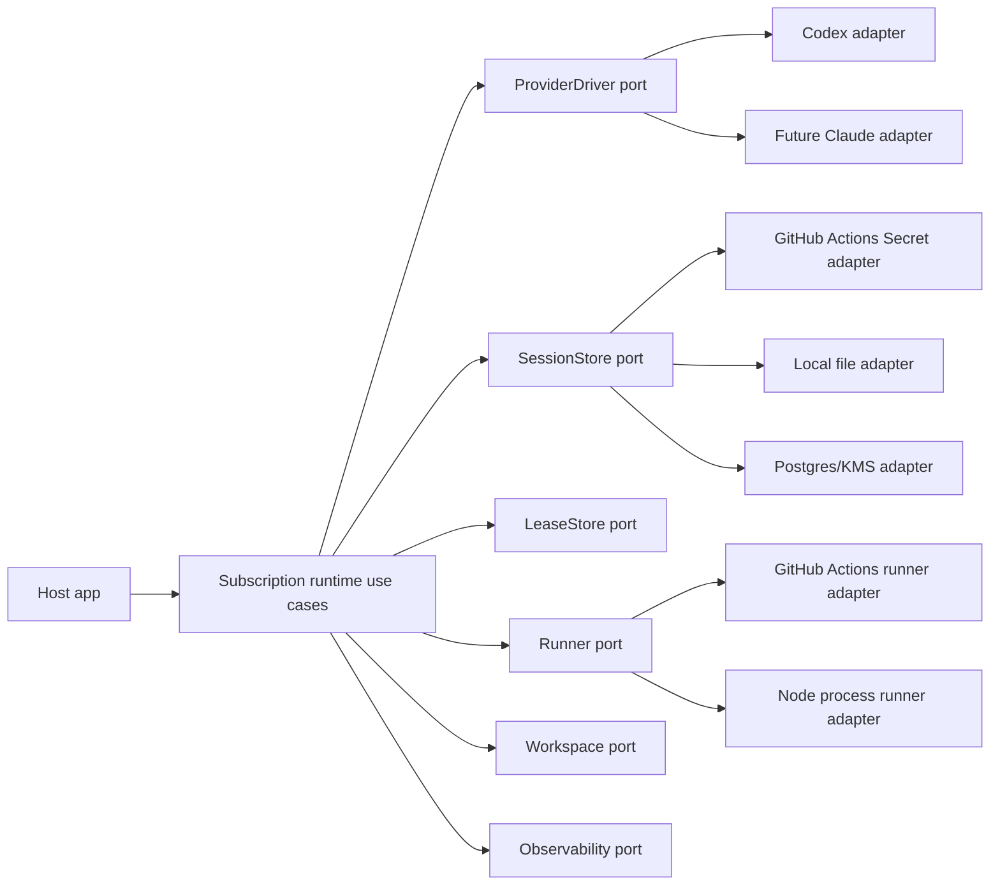
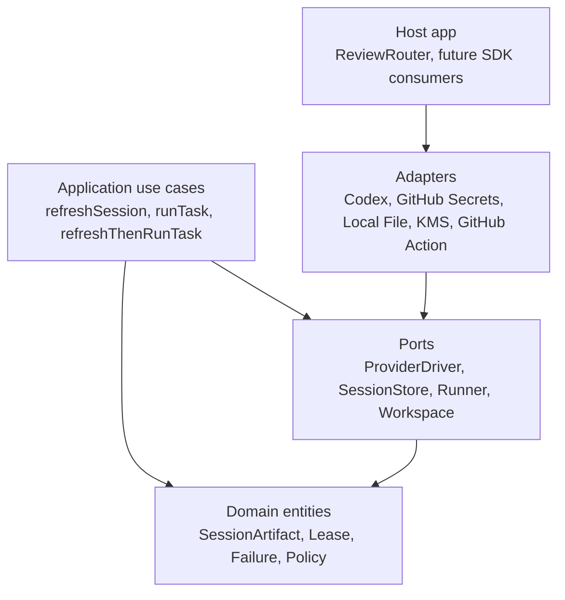
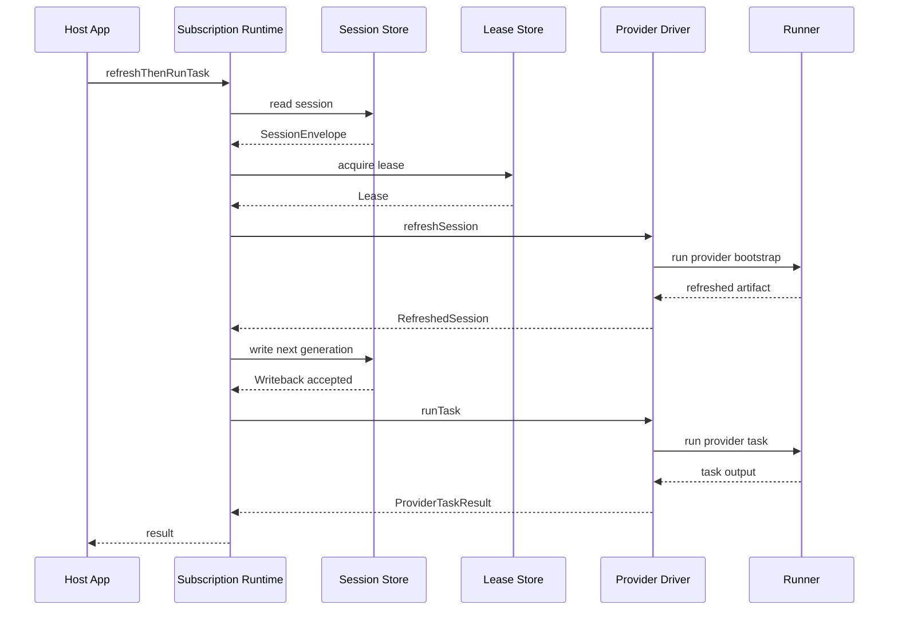
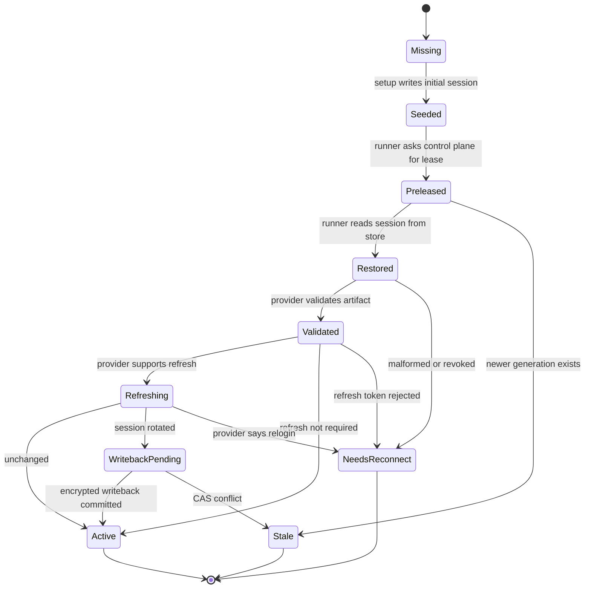
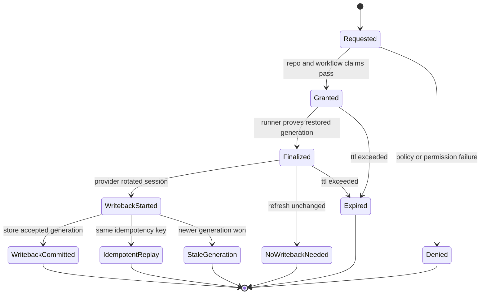
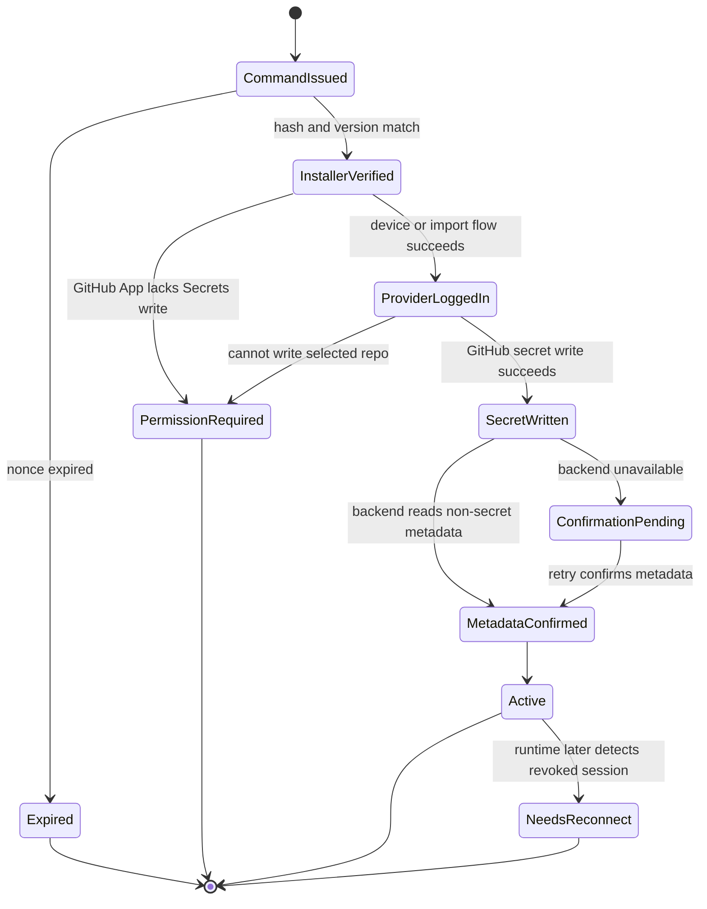
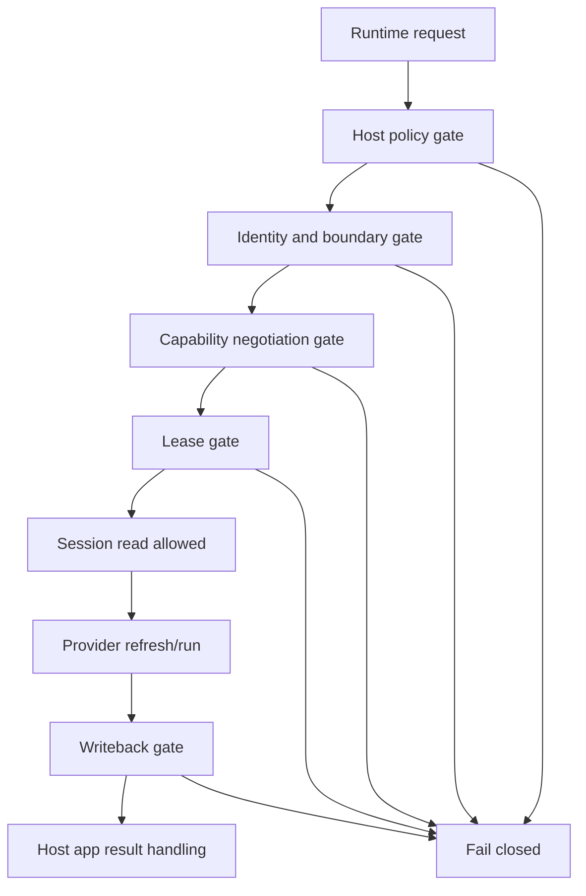

# Subscription Runtime Extraction Plan

Plan for extracting the current Codex OAuth rotating mechanism into a reusable,
provider-agnostic `@subscription-runtime/*` library family.

The goal is not to create "free API usage". The goal is to provide a clean,
safe runtime for **user-owned subscription/session credentials** where each
application chooses its own storage, execution environment, and trust model.

Current reference plans:

- [`42-codex-oauth-github-hosted-refresh-plan.md`](./42-codex-oauth-github-hosted-refresh-plan.md)
- [`43-codex-oauth-github-hosted-beta-plan.md`](./43-codex-oauth-github-hosted-beta-plan.md)

## External Facts To Re-Check Before Implementation

These facts are provider/platform contracts, not project-owned code. Re-check
official docs before implementing a release that depends on them:

- GitHub Actions OIDC claims and token lifetime:
  https://docs.github.com/en/actions/reference/security/oidc
- GitHub Actions Secrets REST API and public-key encryption:
  https://docs.github.com/en/rest/actions/secrets
- GitHub App installation token permissions:
  https://docs.github.com/en/rest/apps/apps
- GitHub App permission update behavior:
  https://docs.github.com/en/apps/using-github-apps/approving-updated-permissions-for-a-github-app
- GitHub workflow permissions and `GITHUB_TOKEN` behavior:
  https://docs.github.com/en/actions/reference/workflows-and-actions/workflow-syntax
- OpenAI Codex auth, CI auth, and configuration behavior:
  https://developers.openai.com/codex/auth
- OpenAI Codex CLI behavior and action/runtime recommendations:
  https://developers.openai.com/codex/

Do not assume provider session formats are stable. Provider adapters must own
format validation and failure classification.

## Summary

We can extract the Codex refresh/writeback system into a reusable library, but
only if the library is designed around **ports/adapters** and **session
artifact lifecycle**, not around Codex-specific `auth.json`.

Recommended path:

```text
🎯 8.7 / 10   🛡️ 8.5 / 10   🧠 7.5 / 10
Approx changes: 5000-10000 LOC for reusable v1 extraction
```

The v1 should support:

- generic `SessionArtifact` abstraction
- pluggable `SessionStorePort`
- pluggable `LeaseStorePort`
- pluggable `ProviderDriver`
- pluggable `RunnerPort`
- pluggable `WorkspacePort`
- mandatory redaction and structured failure classification
- Codex CLI provider adapter as first production adapter
- GitHub Actions Secret store adapter as first no-custody store
- optional local encrypted file store for development
- optional Postgres/KMS store as a later custody adapter, not default

The first extraction must preserve the existing ReviewRouter production
behavior:

- ReviewRouter SaaS does not receive plaintext Codex `auth.json`
- GitHub-hosted runner refreshes the session
- refreshed session is written back as encrypted GitHub Secret payload
- workflow receives only minimal permissions
- runner never receives a GitHub token with `Secrets: write`
- old Codex rotating flow keeps working during migration

## Non-Goals

These are intentionally out of scope for v1:

- building a generic AI agent framework
- hiding provider terms or bypassing provider restrictions
- promising that every subscription provider supports CI automation
- making backend-custody the default path
- creating a browser automation login system inside CI
- storing user sessions in ReviewRouter SaaS by default
- replacing ReviewRouter's review-thread lifecycle
- supporting every runner/OS/container matrix in the first release
- supporting reusable GitHub workflows before direct workflow source binding is
  stable

The library should make safe usage easy and risky usage explicit. If a host app
wants backend-custody, it should have to opt in through a custody-labeled
adapter, not accidentally get it through the default runtime.

## Design Principles

1. **Session artifacts are mutable state.**
   Treat provider sessions like a database row with generation, owner, storage
   policy, and writeback semantics. Do not treat them like static secrets.

2. **Provider refresh and storage are separate reasons to change.**
   Codex may change `auth.json`; GitHub may change Secrets API; Postgres/KMS may
   change audit policy. These must not be one class.

3. **No-custody is a first-class mode, not a special case.**
   Core must support flows where the orchestrating backend never sees plaintext
   session bytes.

4. **Every adapter declares capabilities.**
   A provider that cannot refresh, a store that cannot CAS, or a runner that
   cannot sandbox must say so in metadata before runtime starts.

5. **Setup and runtime are different workflows.**
   Device auth, browser login, secret seeding, and user consent belong to setup
   drivers. CI/runtime jobs must be non-interactive.

6. **Fail closed on boundary mismatch.**
   Wrong repo, wrong workflow SHA, missing storage capability, stale generation,
   unexpected artifact format, or unclear custody mode must stop the run.

7. **Host app owns policy; library owns mechanics.**
   ReviewRouter decides whether a PR is allowed, what model to use, and how to
   post comments. Subscription Runtime decides how to restore, refresh, run, and
   persist provider sessions safely.

## Terminology And Responsibility Boundaries

The runtime must use precise language. Otherwise Codex works in v1, but the
first Claude/Gemini/local-agent adapter will force a rewrite.

| Term      | Meaning                                                                       | Owns                                                                       | Must not own                                  |
| --------- | ----------------------------------------------------------------------------- | -------------------------------------------------------------------------- | --------------------------------------------- |
| Provider  | External subscription/auth system, for example Codex, Claude Code, Gemini CLI | session format, refresh semantics, provider failure classification         | storage, host app policy, PR review lifecycle |
| Agent     | Executable capability that performs a task using a provider session           | prompt/task execution, output parsing, model/tool limits                   | durable session storage, GitHub permissions   |
| Session   | Durable auth artifact needed to restore a provider                            | bytes, format version, generation hash, custody metadata                   | business policy                               |
| Store     | Persistence adapter for session envelopes                                     | read/write/CAS/delete, custody mode, metadata                              | provider refresh logic                        |
| Lease     | Coordination record around one refresh/writeback attempt                      | concurrency, idempotency, stale generation protection                      | provider-specific auth                        |
| Runner    | Process/container/remote executor                                             | env isolation, timeout, stdout/stderr sinks, abort                         | storage and provider policy                   |
| Workspace | Filesystem/repo context visible to the provider task                          | checkout/temp dir/container path                                           | provider session ownership                    |
| Host app  | Product embedding the library, for example ReviewRouter                       | user policy, repo policy, UI, GitHub App permission model, review comments | provider internals                            |

Key rule: **agent execution and provider session management are separate
capabilities**. A simple v1 adapter can implement both, but the core API should
not require that forever.

```ts
export interface ProviderSessionDriver {
  readonly providerId: string;
  readonly capabilities: ProviderCapabilities;

  validateSession(
    input: ValidateSessionInput,
  ): Promise<SessionValidationResult>;
  refreshSession(input: RefreshSessionInput): Promise<RefreshedSession>;
  classifySessionFailure(error: unknown): ProviderFailure;
}

export interface NoSessionDriver {
  readonly providerId: string;
  readonly sessionRequirement: { readonly kind: "none" };
}

export interface AgentDriver {
  readonly agentId: string;
  readonly providerId: string;
  readonly capabilities: AgentCapabilities;

  runTask(input: AgentRunInput): Promise<ProviderTaskResult>;
  classifyRunFailure(error: unknown): ProviderFailure;
}

export type SubscriptionProviderDriver = ProviderSessionDriver & AgentDriver;
```

`SubscriptionProviderDriver` is a convenience export, not the main internal
contract. Core should compose `ProviderSessionDriver | NoSessionDriver` and
`AgentDriver` separately, so non-rotating Claude tokens, API keys, and no-session
local agents do not inherit Codex refresh/writeback assumptions.

Why this matters:

- Codex CLI can stay a combined `SubscriptionProviderDriver` in v1.
- Claude may start as `AgentDriver` with a long-lived token and no refresh.
- A future provider may share one session driver across multiple agents.
- A host app can run "validate/refresh only" without exposing task execution.
- Tests can certify session behavior separately from output quality.

SOLID check:

- SRP: session driver changes when auth changes; agent driver changes when task
  execution changes.
- OCP: adding `ClaudeCodeAgentDriver` should not modify core use cases.
- ISP: a store-only consumer does not need a task runner interface.
- DIP: ReviewRouter depends on ports, not Codex-specific implementation.

## Current Understanding

Current Codex rotating implementation is spread across:

- `packages/features/codex-oauth-rotating`
- `packages/features/action-control-plane`
- `apps/api/src/github/octokit-codex-rotating-github-secret-gateway.ts`
- `packages/features/workflow-provisioning`
- `packages/features/provider-setup`
- `apps/web/src/server/codex-rotating-*`
- `scripts/seed-codex-rotating-auth.sh`

Measured current size of the core pieces:

```text
Core refresh/action/control-plane/GitHub gateway: ~4943 LOC
Setup/workflow/installer/provisioning around it: ~3716 LOC
Current focused tests around the flow: ~5186 LOC
```

This is already large enough that a direct "copy into a package" extraction
would create a hard-to-use framework. The extraction must split stable domain
contracts from ReviewRouter-specific adapters.

Initial extraction map:

| Current area                                                 | Future home                                          | Notes                                                              |
| ------------------------------------------------------------ | ---------------------------------------------------- | ------------------------------------------------------------------ |
| `codex-oauth-rotating/src/domain` validation/hash helpers    | `core` + `provider-codex`                            | Split generic generation/hash from Codex auth JSON                 |
| `codex-oauth-rotating/src/action` process/env/runner helpers | `runner-github-action` + `provider-codex`            | Keep ReviewRouter review bridge outside provider                   |
| action-control-plane Codex lease use cases                   | `core` use-case contracts + ReviewRouter adapter     | Generic lease state in core, API paths in adapter                  |
| Octokit GitHub secret gateway                                | `store-github-actions-secret` + ReviewRouter adapter | Generic GitHub encrypted secret write, app-token policy in adapter |
| workflow provisioning Codex YAML                             | ReviewRouter adapter                                 | Host app owns workflow shape                                       |
| setup manifest/seed script                                   | setup adapter + ReviewRouter web                     | Setup is separate from runtime                                     |
| dashboard provider setup copy                                | ReviewRouter web                                     | Never move UI copy into core                                       |

### Existing Refresh Logic Is The Baseline, Not Throwaway Code

The current Codex refresh/writeback logic is not wasted. It is the working
baseline that the extraction must preserve.

Current production code already uses the subscription-runtime shape:

- `packages/subscription-runtime/core/src/application/runtime.ts`
  - reads session envelope
  - acquires lease
  - validates session
  - calls provider `refreshSession`
  - compares generation hash
  - writes back refreshed artifact with idempotency
  - runs task with the refreshed artifact
- `packages/subscription-runtime/provider-codex/src/codex-cli-session-driver.ts`
  - materializes `auth.json` into isolated `CODEX_HOME`
  - runs Codex bootstrap
  - reads refreshed `auth.json`
  - classifies reconnect/quota/permission states
  - cleans temp auth directories
- `packages/features/codex-oauth-rotating/src/action/github-action.ts`
  - wires the runtime into the GitHub Action
  - confirms writeback before using the refreshed session for review
  - keeps ReviewRouter no-custody secret writeback through the backend/GitHub App

For Codex OAuth on GitHub-hosted Actions, the refresh/writeback layer is not
optional. The job receives the current GitHub Secret value at job start. If Codex
refreshes `auth.json`, the updated artifact must be written back durably for
future runs; otherwise the next run can start from stale credentials and fail or
silently skip useful work.

The plan is therefore:

```text
Do:
  preserve current refresh/writeback semantics
  extract stable ports around them
  add provider-neutral capability planning
  keep current Codex E2E as regression baseline

Do not:
  delete the existing refresh path
  replace it with a speculative generic OAuth helper
  make Codex run without durable writeback
  force Claude/API-key/no-session providers through Codex refresh behavior
```

Decision options:

| Option                                                                                    | Score                             | Approx changes                         | Decision   |
| ----------------------------------------------------------------------------------------- | --------------------------------- | -------------------------------------- | ---------- |
| **Keep existing refresh/writeback as baseline and wrap it behind provider-neutral ports** | 🎯 9.5 / 10, 🛡️ 9 / 10, 🧠 6 / 10 | 500-1500 LOC over current package work | **choose** |
| **Rewrite refresh/writeback from scratch in a new generic runtime**                       | 🎯 4 / 10, 🛡️ 4 / 10, 🧠 8 / 10   | 2000-5000 LOC plus new E2E risk        | reject     |
| **Make Codex refresh optional and rely on old secret until it fails**                     | 🎯 2 / 10, 🛡️ 2 / 10, 🧠 3 / 10   | 100-400 LOC                            | reject     |

Future optimization is allowed, but only after parity:

- `always-refresh-before-run` remains the safest Codex production default.
- Later backend-custody workers may use `lazy-refresh` with freshness window plus
  guarded refresh on 401.
- Lazy refresh still needs writeback when the provider returns a new artifact.
- Claude/API-key providers can skip writeback only when their adapter declares
  `sessionRotationMode: "never-rotates"` and contract tests prove it.

### Current Extracted Package Baseline And Migration Path

The repository already contains the first extraction of the runtime package
family. Treat this code as the baseline implementation, not as a prototype to
throw away.

Current package ownership:

| Package / area                                              | Keep or change                                                     | Why                                                                                                                                                                                                         |
| ----------------------------------------------------------- | ------------------------------------------------------------------ | ----------------------------------------------------------------------------------------------------------------------------------------------------------------------------------------------------------- |
| `packages/subscription-runtime/core`                        | **Keep and harden**                                                | This is already the right home for leases, session envelopes, generation hashes, writeback coordination, redaction, and provider-neutral orchestration.                                                     |
| `packages/subscription-runtime/provider-codex`              | **Keep current refresh path, add new execution engines beside it** | `CodexCliSessionDriver.refreshSession` is the production refresh/writeback baseline. Future SDK/JSON/app-server task engines must reuse this session path unless they prove an equivalent refresh contract. |
| `packages/subscription-runtime/runner-github-action`        | **Keep as GitHub Actions process boundary**                        | This isolates child process execution and env policy for GitHub-hosted jobs. Add stricter environment policy here or in provider adapters; do not spread `spawn` calls back into feature code.              |
| `packages/subscription-runtime/store-github-actions-secret` | **Keep as no-custody store adapter**                               | This remains the ReviewRouter SaaS-safe writeback path. It may prepare encrypted payloads and metadata, but must never send plaintext credentials to the backend.                                           |
| `packages/subscription-runtime/store-local-file`            | **Keep for local/dev/backend-custody adapters**                    | Useful for local certification and future backend worker deployments. It is not the default for ReviewRouter SaaS no-custody CI.                                                                            |
| `packages/features/codex-oauth-rotating` action code        | **Keep as host-app compatibility wrapper**                         | ReviewRouter still owns OIDC checks, workflow inputs, PR review formatting, inline comments, fail gates, and SaaS control-plane calls. Do not move these product concerns into the generic package.         |

Concrete migration sequence from the current code:

1. Freeze current behavior with golden tests before moving more logic.
   The baseline is the live production Codex rotating path, including inline
   review comments, summary format, stale generation handling, duplicate final
   error behavior, and no-plaintext backend boundary.
2. Add provider capability planning inside `core` without changing the Codex
   production path. The plan compiler chooses `no-session`, `static-session`, or
   `rotating-session` before any session bytes are read.
3. Move remaining Codex-specific env pruning behind a provider-owned
   `ProviderEnvironmentPolicy`. The current Codex denylist stays as the initial
   policy because it prevents API-key env vars from overriding subscription
   credentials.
4. Add fake provider contract tests for:
   - no-session local agent
   - static non-rotating provider
   - rotating provider with writeback
   - refresh failure followed by reconnect-required
   - writeback stale generation
5. Add the fast worker execution path as a new adapter, not a replacement for
   refresh:
   - `CodexCliSessionDriver` keeps refreshing `auth.json`
   - `CodexJsonAgentDriver` or SDK/JSON worker engines consume the refreshed
     session
   - task execution optimization is allowed only after refresh/writeback parity
     is locked
6. Keep the current ReviewRouter action wrapper as the integration point. It can
   switch task engines through a flag, but it must keep the same workflow YAML,
   secret names, comments, inline findings, and fail-gate semantics.
7. Only after live parity should APIs be renamed or cleaned up. For example,
   `CodexCli*` can become `CodexRefresh*` plus `CodexJsonTask*` only when all
   adapters and feature imports have compatibility exports.

Do not delete these yet:

- `CodexCliSessionDriver.refreshSession`
- lease and writeback stores used by the current action
- `refreshThenRunTask` / `refreshSession` orchestration in `core`
- `packages/features/codex-oauth-rotating` compatibility wrapper
- current local and live E2E fixtures
- redaction canaries around auth JSON, access tokens, refresh tokens, and ID
  tokens

Deletion is allowed only when all of this is true:

- AgentTeams production canary passes with inline comments in the old format.
- Disposable public and private GitHub-hosted E2E pass on the new package path.
- stale generation, concurrent run, reconnect-required, quota, backend outage,
  and writeback idempotency tests pass.
- no-plaintext backend canary proves `refresh_token`, `access_token`, and
  `id_token` do not appear in API requests, logs, thrown errors, or comments.
- rollback flag has been tested in a real workflow run.
- at least two production review runs succeed after rollout.

Decision options for existing package code:

| Option                                                                               | Score                           | Approx changes | Decision                                                                               |
| ------------------------------------------------------------------------------------ | ------------------------------- | -------------- | -------------------------------------------------------------------------------------- |
| **Strangler migration around the current package code**                              | 🎯 9 / 10, 🛡️ 9 / 10, 🧠 6 / 10 | 800-2200 LOC   | **choose**                                                                             |
| **Big-bang rewrite of the package into a cleaner generic runtime**                   | 🎯 4 / 10, 🛡️ 4 / 10, 🧠 9 / 10 | 3000-7000 LOC  | reject until current path has parity gaps that cannot be patched                       |
| **Freeze current package as Codex-only and build a second provider-neutral package** | 🎯 6 / 10, 🛡️ 6 / 10, 🧠 7 / 10 | 1800-4500 LOC  | keep as fallback only if provider-neutral changes start destabilizing production Codex |

The chosen path is the strangler migration: the current runtime stays in
production, new abstractions grow around it, and risky execution optimizations
are added behind explicit adapters and flags.

## Decision Options

### Option 1 - No-Custody Subscription Runtime

```text
🎯 9 / 10   🛡️ 8.5 / 10   🧠 7.5 / 10
Approx changes: 5000-10000 LOC
```

The library orchestrates provider session refresh and execution, but storage is
chosen by the host app. The default production adapter remains no-custody:
GitHub Actions reads an existing secret, refreshes on runner, and writes back
only through a storage adapter that never exposes plaintext to the SaaS.

Pros:

- keeps ReviewRouter's current security model
- future providers can be added with new drivers
- storage remains flexible
- easiest path from current code
- SaaS users can still avoid API billing when provider subscriptions allow it

Cons:

- more abstractions than a Codex-only runtime
- provider-specific driver behavior still requires careful testing
- some adapters require host-specific security documentation

Recommendation: **choose this**.

### Option 2 - Backend-Custody Subscription Runtime

```text
🎯 7 / 10   🛡️ 4.5 / 10   🧠 9 / 10
Approx changes: 8000-18000 LOC
```

The backend stores user sessions and runs provider CLIs on backend workers.

Pros:

- simple customer UX
- no GitHub `Secrets: write`
- can run outside GitHub Actions

Cons:

- backend sees/holds user provider sessions
- requires KMS, process isolation, audit, revoke/relogin UX, incident response
- far higher blast radius
- harder to explain trust model

Do not make this the default. It can be an optional adapter later.

### Option 3 - Customer-Side Daemon Runtime

```text
🎯 7.5 / 10   🛡️ 8 / 10   🧠 8 / 10
Approx changes: 6000-14000 LOC
```

The customer runs a local/VPS daemon that keeps sessions on their own machine.
The SaaS sends jobs; the daemon performs refresh and provider execution.

Pros:

- no SaaS custody
- works outside GitHub Actions
- long-lived local sessions possible

Cons:

- worse UX
- customers need always-on infrastructure
- hard to support across networks, NAT, firewalls, OSes

Good later product path, not the first extraction.

## Architecture Goal

The library should implement this boundary:



Core rules:

- Domain has no GitHub, Prisma, Octokit, Next.js, or ReviewRouter imports.
- Application layer depends only on ports.
- Adapters depend inward on core contracts.
- Provider drivers do not own persistence.
- Session stores do not know provider-specific refresh logic.
- Runner adapters do not parse provider auth formats.
- Redaction is mandatory at the core boundary.

Clean Architecture layering:



Runtime sequence for rotating providers:



For no-custody stores, the `S->>R` and `R->>S` arrows may be split between
runner-side read and backend-side encrypted writeback. Core should model the
logical contract; adapters implement the physical split.

## Package Layout

Recommended package family:

```text
packages/subscription-runtime/
  core/
    src/domain/
    src/application/
    src/ports/
    src/testing/

  provider-codex/
    src/codex-cli-provider-driver.ts
    src/codex-auth-json-codec.ts
    src/codex-failure-classifier.ts

  store-github-actions-secret/
    src/github-actions-secret-store.ts
    src/github-secret-encryption.ts
    src/github-actions-oidc-binding.ts

  store-local-file/
    src/local-encrypted-file-session-store.ts
    src/file-lock-lease-store.ts

  store-postgres-kms/
    src/kms-postgres-session-store.ts
    src/postgres-lease-store.ts

  runner-node-process/
    src/node-process-runner.ts
    src/process-sandbox.ts

  runner-github-action/
    src/github-action-runtime.ts
    src/github-action-env-guard.ts
    src/github-action-log-redactor.ts

  reviewrouter-adapter/
    src/reviewrouter-control-plane-client.ts
    src/reviewrouter-github-store-adapter.ts
```

First implementation can keep packages internal to the monorepo. Publishable
package names can come later:

```text
@subscription-runtime/core
@subscription-runtime/provider-codex
@subscription-runtime/store-github-actions-secret
@subscription-runtime/runner-github-action
```

### Composition Root And Runtime Kernel

The runtime core should not discover adapters by importing every package. The
host app is the composition root: it chooses adapters, validates manifests,
compiles policy, and passes a fully wired runtime into the use case.

```ts
export type SubscriptionRuntimeDeps = {
  readonly policy: RuntimePolicy;
  readonly sessionDriver?: ProviderSessionDriver;
  readonly agentDriver: AgentDriver;
  readonly sessionStore?: SessionStorePort;
  readonly leaseStore?: LeaseStorePort;
  readonly runner: RunnerPort;
  readonly workspace: WorkspacePort;
  readonly redactor: RedactorPort;
  readonly observability: ObservabilityPort;
  readonly clock: ClockPort;
  readonly idGenerator: IdGeneratorPort;
};

export type SubscriptionRuntime = {
  readonly capabilities: RuntimeCapabilitySnapshot;
  refreshSession(
    input: RefreshSessionUseCaseInput,
  ): Promise<RefreshSessionResult>;
  runTask(input: RunTaskUseCaseInput): Promise<ProviderTaskResult>;
  refreshThenRunTask(
    input: RefreshThenRunUseCaseInput,
  ): Promise<RefreshThenRunResult>;
  healthCheck(
    input: RuntimeHealthCheckInput,
  ): Promise<RuntimeHealthCheckResult>;
};

export function createSubscriptionRuntime(
  deps: SubscriptionRuntimeDeps,
): SubscriptionRuntime {
  const compiledPolicy = compileRuntimePolicy({
    requested: deps.policy,
    provider: deps.sessionDriver.capabilities,
    agent: deps.agentDriver.capabilities,
    store: deps.sessionStore.capabilities,
    runner: deps.runner.capabilities,
  });

  const kernel = new RuntimeKernel({
    ...deps,
    policy: compiledPolicy,
  });

  return {
    capabilities: kernel.capabilitySnapshot(),
    refreshSession: (input) => kernel.refreshSession(input),
    runTask: (input) => kernel.runTask(input),
    refreshThenRunTask: (input) => kernel.refreshThenRunTask(input),
    healthCheck: (input) => kernel.healthCheck(input),
  };
}
```

`RuntimeKernel` is application-layer orchestration, not a framework service
locator. It may call ports, enforce invariants, emit events, and coordinate
state transitions. It must not:

- import adapter packages
- parse GitHub OIDC tokens directly
- read process env directly
- know ReviewRouter DB schemas
- know provider-specific auth field names except through redaction patterns
- post PR comments

The kernel constructor should validate all dependencies once and fail before
any session bytes are read.

```ts
class RuntimeKernel {
  constructor(private readonly deps: RuntimeKernelDeps) {
    assertAdapterCompatibility(deps);
    assertPolicyCanRun(deps.policy);
    assertRedactorInstalled(deps.redactor);
  }

  async refreshThenRunTask(
    input: RefreshThenRunUseCaseInput,
  ): Promise<RefreshThenRunResult> {
    const refresh = await this.refreshSession(input);

    if (refresh.state === "needs_reconnect") {
      return {
        status: "blocked",
        reason: "provider_reconnect_required",
        safeMessage: refresh.safeMessage,
      };
    }

    return {
      status: "completed",
      refresh,
      task: await this.runTask({
        ...input,
        sessionGeneration: refresh.nextGeneration,
      }),
    };
  }
}
```

This keeps Clean Architecture practical: the host app composes, the core
orchestrates, adapters perform I/O, and domain objects remain portable.

## Adapter Manifest

Every provider, store, runner, and setup adapter should export a manifest. The
host app can inspect manifests before composing a runtime. This keeps future
Claude/Gemini/local adapters open for extension without editing core.

```ts
export type RuntimeAdapterManifest = {
  readonly adapterId: string;
  readonly adapterKind:
    | "provider-session"
    | "agent"
    | "combined-provider"
    | "store"
    | "lease-store"
    | "runner"
    | "workspace"
    | "setup"
    | "observability";
  readonly packageName: string;
  readonly packageVersion: string;
  readonly protocolVersion: 1;
  readonly capabilities: unknown;
  readonly custody?: "no-plaintext-backend" | "backend-custody" | "local-only";
  readonly experimental: boolean;
  readonly minimumCoreVersion: string;
};
```

Codex provider manifest:

```ts
export const codexProviderManifest = {
  adapterId: "provider.codex-cli",
  adapterKind: "combined-provider",
  packageName: "@subscription-runtime/provider-codex",
  packageVersion: "0.1.0",
  protocolVersion: 1,
  capabilities: {
    session: codexCapabilities,
    agent: codexAgentCapabilities,
  },
  experimental: false,
  minimumCoreVersion: "0.1.0",
} satisfies RuntimeAdapterManifest;
```

GitHub no-custody store manifest:

```ts
export const githubActionsSecretStoreManifest = {
  adapterId: "store.github-actions-secret",
  adapterKind: "store",
  packageName: "@subscription-runtime/store-github-actions-secret",
  packageVersion: "0.1.0",
  protocolVersion: 1,
  capabilities: githubActionsSecretStoreCapabilities,
  custody: "no-plaintext-backend",
  experimental: false,
  minimumCoreVersion: "0.1.0",
} satisfies RuntimeAdapterManifest;
```

Manifest validation:

```ts
export function assertCompatibleAdapters(input: {
  readonly coreVersion: string;
  readonly provider: RuntimeAdapterManifest;
  readonly agent: RuntimeAdapterManifest;
  readonly store: RuntimeAdapterManifest;
  readonly runner: RuntimeAdapterManifest;
  readonly policy: RuntimePolicy;
}): void {
  assertProtocolVersion(input.provider.protocolVersion);
  assertProtocolVersion(input.agent.protocolVersion);
  assertProtocolVersion(input.store.protocolVersion);
  assertProtocolVersion(input.runner.protocolVersion);
  assertMinimumCoreVersion(input.provider, input.coreVersion);
  assertMinimumCoreVersion(input.agent, input.coreVersion);
  assertMinimumCoreVersion(input.store, input.coreVersion);
  assertMinimumCoreVersion(input.runner, input.coreVersion);
  assertRuntimeCapabilities({
    provider: providerCapabilitiesOf(input.provider),
    agent: agentCapabilitiesOf(input.agent),
    store: input.store.capabilities as SessionStoreCapabilities,
    policy: input.policy,
  });
}
```

`providerCapabilitiesOf` and `agentCapabilitiesOf` are small schema helpers.
They allow a combined Codex adapter to publish one manifest while future
providers publish separate session and agent manifests.

Do not rely on TypeScript alone for runtime safety. Public packages and host app
configuration can drift; manifests must be checked at startup.

### Adapter Registry And Capability Negotiation

The runtime should not hardcode `if (provider === "codex")` or `if (store ===
"github")`. It should resolve adapters through a registry, then compile policy
against declared capabilities.

```ts
export type RuntimeAdapter =
  | ProviderSessionAdapterFactory
  | AgentAdapterFactory
  | SessionStoreAdapterFactory
  | LeaseStoreAdapterFactory
  | RunnerAdapterFactory
  | WorkspaceAdapterFactory
  | SetupAdapterFactory
  | ObservabilityAdapterFactory;

export interface AdapterRegistry {
  register(adapter: RuntimeAdapter): void;
  getManifest(adapterId: string): RuntimeAdapterManifest | null;
  createProviderSessionDriver(
    adapterId: string,
    options: unknown,
  ): ProviderSessionDriver;
  createAgentDriver(adapterId: string, options: unknown): AgentDriver;
  createSessionStore(adapterId: string, options: unknown): SessionStorePort;
  createRunner(adapterId: string, options: unknown): RunnerPort;
  createObservability(adapterId: string, options: unknown): ObservabilityPort;
}

export function createAdapterRegistry(
  adapters: readonly RuntimeAdapter[],
): AdapterRegistry {
  const byId = new Map<string, RuntimeAdapter>();

  for (const adapter of adapters) {
    if (byId.has(adapter.manifest.adapterId)) {
      throw new RuntimeConfigurationError(
        `Duplicate adapter id: ${adapter.manifest.adapterId}`,
      );
    }

    byId.set(adapter.manifest.adapterId, adapter);
  }

  return new DefaultAdapterRegistry(byId);
}
```

Capability negotiation should produce one explicit result.

```ts
export type RuntimeExecutionPlan =
  | {
      readonly kind: "no-session";
      readonly readSession: false;
      readonly acquireLease: false;
      readonly refresh: "never";
      readonly writeback: "never";
      readonly sessionForAgent: "absent";
    }
  | {
      readonly kind: "static-session";
      readonly readSession: true;
      readonly acquireLease: boolean;
      readonly refresh: "never" | "validate-only";
      readonly writeback: "never";
      readonly sessionForAgent: "stored";
    }
  | {
      readonly kind: "rotating-session";
      readonly readSession: true;
      readonly acquireLease: true;
      readonly refresh: "before-run" | "lazy";
      readonly writeback: "before-task" | "after-successful-refresh";
      readonly sessionForAgent: "refreshed";
    };

export type CapabilityDecision =
  | {
      readonly status: "accepted";
      readonly compiledPolicy: CompiledRuntimePolicy;
      readonly executionPlan: RuntimeExecutionPlan;
      readonly warnings: readonly RuntimeWarning[];
    }
  | {
      readonly status: "rejected";
      readonly code:
        | "provider_store_incompatible"
        | "runner_provider_incompatible"
        | "custody_mode_forbidden"
        | "interactive_runtime_forbidden"
        | "task_mode_unsupported"
        | "history_mode_unsupported"
        | "session_store_required"
        | "missing_required_capability";
      readonly safeMessage: string;
      readonly details: Record<string, string>;
    };

export function negotiateCapabilities(input: {
  readonly requested: RuntimePolicy;
  readonly provider: ProviderCapabilityProfile;
  readonly agent: AgentCapabilityProfile;
  readonly store?: SessionStoreCapabilities;
  readonly runner: RunnerCapabilities;
}): CapabilityDecision {
  if (!input.agent.taskModes.includes(input.requested.taskMode)) {
    return {
      status: "rejected",
      code: "task_mode_unsupported",
      safeMessage: "Selected agent does not support the requested task mode.",
      details: { agentId: input.agent.agentId },
    };
  }

  if (
    input.requested.requestedHistoryMode !== "unsupported" &&
    input.agent.historyMode !== input.requested.requestedHistoryMode
  ) {
    return {
      status: "rejected",
      code: "history_mode_unsupported",
      safeMessage:
        "Selected agent does not support the requested history mode.",
      details: { agentId: input.agent.agentId },
    };
  }

  if (input.provider.sessionRequirement.kind === "none") {
    return {
      status: "accepted",
      compiledPolicy: compileRuntimePolicy(input),
      executionPlan: {
        kind: "no-session",
        readSession: false,
        acquireLease: false,
        refresh: "never",
        writeback: "never",
        sessionForAgent: "absent",
      },
      warnings: [],
    };
  }

  if (!input.store) {
    return {
      status: "rejected",
      code: "session_store_required",
      safeMessage: "Selected provider requires a session store.",
      details: { providerId: input.provider.providerId },
    };
  }

  if (input.requested.custodyMode === "no-plaintext-backend") {
    if (input.store.custody !== "no-plaintext-backend") {
      return {
        status: "rejected",
        code: "custody_mode_forbidden",
        safeMessage: "Selected store is not compatible with no-custody mode.",
        details: { storeId: input.store.storeId },
      };
    }
  }

  if (
    input.provider.sessionRotationMode !== "never-rotates" &&
    !input.store.supportsWriteback
  ) {
    return {
      status: "rejected",
      code: "provider_store_incompatible",
      safeMessage: "Provider can rotate sessions, but store cannot write back.",
      details: { providerId: input.provider.providerId },
    };
  }

  if (
    input.agent.requiresWritableWorkspace &&
    input.runner.readOnlyFilesystem
  ) {
    return {
      status: "rejected",
      code: "runner_provider_incompatible",
      safeMessage:
        "Agent requires writable workspace, but runner is read-only.",
      details: { agentId: input.agent.agentId },
    };
  }

  const executionPlan =
    input.provider.sessionRotationMode === "never-rotates"
      ? ({
          kind: "static-session",
          readSession: true,
          acquireLease: input.requested.forceExclusiveProviderLease,
          refresh:
            input.provider.refreshMode === "validate-only"
              ? "validate-only"
              : "never",
          writeback: "never",
          sessionForAgent: "stored",
        } satisfies RuntimeExecutionPlan)
      : ({
          kind: "rotating-session",
          readSession: true,
          acquireLease: true,
          refresh:
            input.provider.refreshMode === "lazy-refresh"
              ? "lazy"
              : "before-run",
          writeback: "before-task",
          sessionForAgent: "refreshed",
        } satisfies RuntimeExecutionPlan);

  return {
    status: "accepted",
    compiledPolicy: compileRuntimePolicy(input),
    executionPlan,
    warnings: [],
  };
}
```

Runtime orchestration must execute this compiled `RuntimeExecutionPlan`; it
should not re-derive behavior from `providerId` or old boolean flags later in the
call stack. This is the practical guard that keeps Codex writeback from leaking
into Claude/API-key/local-agent paths.

Registry rules:

- adapter ids are stable and unique
- manifest validation happens before adapter construction
- adapter options are parsed by adapter-owned schemas
- core accepts ports, not registry instances, during use-case execution
- host app can disable adapters by policy without changing package code
- experimental adapters cannot be selected unless host app opts in

## Dependency Rules

Use strict dependency direction. If these rules are violated, the extraction has
failed even if tests pass.

```text
core
  <- provider-codex
  <- store-github-actions-secret
  <- store-local-file
  <- store-postgres-kms
  <- runner-node-process
  <- runner-github-action
  <- reviewrouter-adapter
  <- apps/*
```

Forbidden imports:

- `core` must not import GitHub, Prisma, Octokit, Next.js, ReviewRouter UI, or
  provider packages.
- provider adapters must not import store adapters.
- store adapters must not import provider adapters.
- runner adapters must not import ReviewRouter application code.
- ReviewRouter adapter can import runtime packages, but runtime packages cannot
  import ReviewRouter adapter.

Package-level enforcement:

```json
{
  "name": "@subscription-runtime/provider-codex",
  "dependencies": {
    "@subscription-runtime/core": "workspace:*"
  },
  "devDependencies": {
    "vitest": "..."
  }
}
```

Add an architecture test:

```ts
import { describe, expect, it } from "vitest";
import { assertNoForbiddenImports } from "../testing/import-rules";

describe("subscription-runtime import boundaries", () => {
  it("keeps core independent from adapters", async () => {
    await expect(
      assertNoForbiddenImports({
        packageRoot: "packages/subscription-runtime/core",
        forbiddenPatterns: [
          "@octokit/",
          "@prisma/",
          "next/",
          "@reviewrouter/",
          "@subscription-runtime/provider-",
          "@subscription-runtime/store-",
          "@subscription-runtime/runner-",
        ],
      }),
    ).resolves.toBeUndefined();
  });
});
```

## Bounded Contexts

### Runtime Core

Owns:

- session artifact lifecycle
- leases and idempotency contracts
- provider task orchestration
- failure taxonomy
- redaction contracts

Does not own:

- GitHub installation lookup
- repository authorization
- dashboard state
- PR comment formatting
- provider-specific auth parsing

### Provider Adapter Context

Owns:

- provider session validation
- provider refresh mechanics
- provider CLI/API invocation
- provider failure classification
- provider-specific redaction patterns

Does not own:

- where session is stored
- whether a PR is allowed
- how results are posted
- SaaS permission UX

### Storage Adapter Context

Owns:

- session persistence
- generation/CAS behavior
- storage-specific encryption
- storage-specific permission mapping
- storage health checks

Does not own:

- provider auth semantics
- provider process execution
- review result parsing

### Host App Context

Owns:

- tenant/workspace/repository policy
- UI and setup flows
- billing/entitlements
- provider selection
- PR review behavior
- rollout and kill switches

## Domain Model

### Session Artifact

Do not model everything as a token. Model the durable thing that a provider
needs to restore a session.

```ts
export type SessionArtifactKind =
  | "json-file"
  | "env-token"
  | "directory"
  | "opaque-bytes";

export type SessionArtifact = {
  readonly kind: SessionArtifactKind;
  readonly providerId: string;
  readonly formatVersion: string;
  readonly bytes: Uint8Array;
  readonly contentType: string;
  readonly createdAt?: Date;
  readonly updatedAt?: Date;
};

export type SessionRequirement =
  | {
      readonly kind: "required";
      readonly artifactKinds: readonly SessionArtifactKind[];
    }
  | {
      readonly kind: "optional";
      readonly artifactKinds: readonly SessionArtifactKind[];
    }
  | {
      readonly kind: "none";
    };
```

Use `SessionRequirement` for no-session agents instead of inventing fake empty
secrets. A local model or internal deterministic agent should not need a
`SessionStorePort` just to satisfy a Codex-shaped API.

Codex v1 maps to:

```ts
const codexSession: SessionArtifact = {
  kind: "json-file",
  providerId: "codex",
  formatVersion: "codex-auth-json-v1",
  bytes: new TextEncoder().encode(authJson),
  contentType: "application/json",
};
```

Claude future examples might map to:

- `env-token` if it is one durable OAuth token
- `json-file` if a CLI persists a JSON auth state
- `directory` if a provider needs a config directory

### Session Envelope

The envelope adds metadata, generation, and storage safety state.

```ts
export type SessionEnvelope = {
  readonly providerInstanceId: string;
  readonly providerId: string;
  readonly artifact: SessionArtifact;
  readonly generation: number;
  readonly generationHash: string;
  readonly storageVersion: string;
  readonly custody: "no-plaintext-backend" | "backend-custody" | "local-only";
  readonly metadata: Record<string, string>;
};
```

### Refreshed Session

Provider refresh must return a new envelope candidate, not write storage
directly.

```ts
export type RefreshedSession = {
  readonly artifact: SessionArtifact;
  readonly providerState:
    | "unchanged"
    | "refreshed"
    | "needs-reconnect"
    | "quota-limited"
    | "permission-required";
  readonly warnings: readonly RuntimeWarning[];
};
```

### Session Ownership

The runtime must know who owns the session and where it is allowed to move.

```ts
export type SessionOwner = {
  readonly tenantId: string;
  readonly workspaceId?: string;
  readonly repositoryId?: string;
  readonly accountHint?: string;
};

export type SessionBoundary = {
  readonly owner: SessionOwner;
  readonly providerInstanceId: string;
  readonly allowedRunners: readonly string[];
  readonly allowedStores: readonly string[];
  readonly allowedProviderIds: readonly string[];
};
```

Rules:

- session owner is not optional for production stores
- repository-scoped sessions cannot be used by another repository
- workspace-scoped sessions require host app policy before repository use
- account hints are labels only, not authorization
- provider instance id is opaque to core, but must be stable

### Runtime State Machines

State machines should be explicit in code and tests. Hidden boolean flags like
`isSetupComplete`, `didRefresh`, or `secretWritten` are too easy to combine
incorrectly under retries.

Session lifecycle:



Lease lifecycle:



Setup lifecycle:



Implementation rule: store these states as enums with allowed transitions, not
as ad hoc strings scattered across the API, action, and dashboard.

```ts
export type SessionRuntimeState =
  | "missing"
  | "seeded"
  | "preleased"
  | "restored"
  | "validated"
  | "refreshing"
  | "writeback_pending"
  | "active"
  | "needs_reconnect"
  | "stale";

export function assertSessionTransition(
  from: SessionRuntimeState,
  to: SessionRuntimeState,
): void {
  const allowed: Record<SessionRuntimeState, readonly SessionRuntimeState[]> = {
    missing: ["seeded"],
    seeded: ["preleased"],
    preleased: ["restored", "stale"],
    restored: ["validated", "needs_reconnect"],
    validated: ["refreshing", "active", "needs_reconnect"],
    refreshing: ["writeback_pending", "active", "needs_reconnect"],
    writeback_pending: ["active", "stale"],
    active: [],
    needs_reconnect: [],
    stale: [],
  };

  if (!allowed[from].includes(to)) {
    throw new RuntimeInvariantError(
      `Invalid session transition: ${from} -> ${to}`,
    );
  }
}
```

### Provider Capability Model

Every provider driver must expose capabilities before the host app chooses it.
This is the key to supporting Codex, Claude, Gemini, and other agents without
hardcoding provider checks in core.

The shape below is the minimal v1 sketch. The later "Provider Capability
Dimensions" section tightens it into explicit refresh/history modes. Use those
explicit modes for policy decisions and keep booleans only as display/readability
helpers.

```ts
export type ProviderCapabilities = {
  readonly providerId: string;
  readonly displayName: string;
  readonly sessionRequirement: SessionRequirement;
  readonly supportsRefresh: boolean;
  readonly refreshMayRotateSession: boolean;
  readonly supportsNonInteractiveRuntime: boolean;
  readonly requiresNetwork: boolean;
  readonly requiresWorkspace: boolean;
  readonly supportsStructuredOutput: boolean;
  readonly supportsReadOnlySandbox: boolean;
  readonly defaultTimeoutMs: number;
  readonly setupModes: readonly ProviderSetupMode[];
};

export type ProviderSetupMode =
  | "manual-secret"
  | "device-auth"
  | "browser-auth"
  | "api-key"
  | "import-local-session";

export type AgentCapabilities = {
  readonly agentId: string;
  readonly providerId: string;
  readonly supportsReviewTasks: boolean;
  readonly supportsStructuredOutput: boolean;
  readonly supportsToolCalling: boolean;
  readonly supportsRepositoryContext: boolean;
  readonly supportsInlineFindings: boolean;
  readonly requiresWritableWorkspace: boolean;
  readonly maxPromptBytes?: number;
  readonly maxRuntimeMs: number;
};
```

Examples:

```ts
export const codexCapabilities: ProviderCapabilities = {
  providerId: "codex",
  displayName: "Codex",
  sessionRequirement: {
    kind: "required",
    artifactKinds: ["json-file"],
  },
  supportsRefresh: true,
  refreshMayRotateSession: true,
  supportsNonInteractiveRuntime: true,
  requiresNetwork: true,
  requiresWorkspace: true,
  supportsStructuredOutput: true,
  supportsReadOnlySandbox: true,
  defaultTimeoutMs: 600_000,
  setupModes: ["device-auth", "import-local-session"],
};

export const claudeCodeCapabilities: ProviderCapabilities = {
  providerId: "claude-code",
  displayName: "Claude Code",
  sessionRequirement: {
    kind: "required",
    artifactKinds: ["env-token", "json-file"],
  },
  supportsRefresh: false,
  refreshMayRotateSession: false,
  supportsNonInteractiveRuntime: true,
  requiresNetwork: true,
  requiresWorkspace: true,
  supportsStructuredOutput: true,
  supportsReadOnlySandbox: true,
  defaultTimeoutMs: 600_000,
  setupModes: ["manual-secret", "import-local-session"],
};
```

Important: these are illustrative. Re-check provider docs and actual CLI
behavior before shipping each adapter.

### Multi-Provider Design Options

The library must support Codex first, but it must not become a Codex library with
a generic name. There are three realistic designs:

| Option                                                       | Score                             | Approx changes                                                 | Decision                                                  |
| ------------------------------------------------------------ | --------------------------------- | -------------------------------------------------------------- | --------------------------------------------------------- |
| **Provider-owned session + agent drivers behind core ports** | 🎯 9 / 10, 🛡️ 9 / 10, 🧠 7 / 10   | 800-1600 LOC in core/contracts, then 800-2500 LOC per provider | **choose**                                                |
| **One generic OAuth driver configured per provider**         | 🎯 5.5 / 10, 🛡️ 5 / 10, 🧠 5 / 10 | 500-1200 LOC initially, more incident cost later               | reject for subscription agents                            |
| **Separate runtime per provider**                            | 🎯 6 / 10, 🛡️ 7 / 10, 🧠 8 / 10   | 1500-4000 LOC per provider                                     | reject unless a provider has incompatible isolation needs |

Why choose provider-owned drivers:

- Codex, Claude, Gemini, API-key providers, and local agents do not share one
  reliable refresh model.
- Core can still be reusable if it owns orchestration, leases, stores, redaction,
  policy checks, workspace handling, and result envelopes.
- Each provider can evolve auth/session behavior independently.
- A provider can expose multiple agents over one session, for example a future
  Claude `one-shot` agent and a Claude `threaded` agent.

Do **not** make "OAuth" the central abstraction. OAuth is one possible setup and
refresh mechanism. The central abstraction is a **session artifact** that can be
validated, optionally refreshed, stored, leased, materialized, and used by an
agent.

### Non-Negotiable Multi-Provider Guardrails

These rules are what keep the package from becoming Codex-only after the first
adapter ships:

1. Core must not import `provider-codex`, `provider-claude`, GitHub App code,
   Prisma models, Next.js routes, or host-app config.
2. Core must not branch on `providerId === "codex"` or
   `providerId === "claude"`. Provider-specific branching belongs in adapter
   factories, adapter manifests, or host-app policy.
3. Writeback is required only when the provider capability profile says the
   session can rotate. Non-rotating Claude/API-key providers must not pay the
   Codex writeback tax.
4. Leases are required only when a store/writeback/rate-limit policy needs
   coordination. No-session and simple API-key providers can skip provider
   refresh leases.
5. Runtime never performs interactive auth. Device auth, browser login, local
   session import, and account consent are setup-driver responsibilities.
6. Task mode and history mode must be validated before session bytes are read.
   A `threaded` task cannot silently run through an `ephemeral` one-shot agent.
7. Redaction profile is provider-owned and mandatory before any provider process
   runs. Unknown token field names are treated as a certification blocker.
8. At least one fake non-Codex provider must run in core tests. This test exists
   to catch accidental Codex assumptions before a real Claude/Gemini adapter is
   implemented.
9. Provider runners must use an explicit environment allowlist/denylist. A
   host-level API key must not silently override a subscription/session artifact.
10. Provider cost/credit semantics are adapter metadata, not core logic. Core can
    report safe usage categories, but product/billing policy belongs to the host
    app.

Concrete anti-pattern to reject in review:

```ts
// Bad: core behavior hardcoded around Codex.
if (providerId === "codex") {
  await writeBackRefreshedAuthJson(...);
}

// Good: core follows provider capability profile.
if (provider.sessionRotationMode !== "never-rotates") {
  await sessionStore.writeBackWithGenerationCheck(...);
}

// Bad: provider process inherits host env and may pick the wrong credential.
spawn(providerBinary, args, { env: process.env });

// Good: provider adapter builds a deliberate credential environment.
spawn(providerBinary, args, {
  env: buildProviderEnv({ baseEnv: process.env, policy, injected }),
});
```

Implementation score after adding these guardrails:

```text
🎯 9 / 10   🛡️ 9 / 10   🧠 7.5 / 10
Approx extra tests/guards: 300-700 LOC
```

### Cross-Perspective Risk Review

Use this as the review lens before starting implementation and before adding a
second provider.

| Perspective          | Main risk                                                                                        | Required plan response                                                                                  |
| -------------------- | ------------------------------------------------------------------------------------------------ | ------------------------------------------------------------------------------------------------------- |
| Security/custody     | Plaintext session leaks into SaaS, logs, job payloads, crash dumps, or debug artifacts           | custody mode is explicit; redaction canary; no-custody store rejects plaintext; temp dirs are cleaned   |
| Provider semantics   | Codex refresh rules get treated as universal OAuth rules                                         | provider-owned session drivers; `RuntimeExecutionPlan`; fake Claude-like provider tests                 |
| Credential selection | Host env silently changes provider auth source                                                   | provider-owned env policy; denied env stripped before spawn; selected source recorded as safe metadata  |
| Runtime/process      | Provider child process hangs, leaks env, leaves orphan children, or outputs malformed JSON       | runner process group cleanup; bounded stdout/stderr; malformed output classification                    |
| Product/UX           | User sees generic reconnect/error copy and cannot understand what action is needed               | failure taxonomy maps to host-owned actionable copy; setup/runtime states are separate                  |
| Operations/release   | Core, adapter, action SHA, and SaaS env drift during rollout                                     | release gates include version matrix, action artifact check, rollback flag, and production canary       |
| Performance/cost     | Worker concurrency worsens account limits or uses a provider-specific credit bucket unexpectedly | provider-account limiter; cost/usage category metadata; provider docs certification                     |
| Developer API        | Host apps have to adopt our queue, storage, or ReviewRouter concepts                             | queue/store/runner are ports; host app chooses adapters; examples include no-session and static-session |
| Legal/terms          | Subscription automation may be allowed for one provider path but not another                     | adapter certification includes terms/compatibility check before shipping                                |
| Support/debugging    | Incidents require reading provider-specific code or secrets                                      | safe diagnostic envelope, provider version, credential source category, runtime plan kind, failure code |

Acceptance gate: every row above must have at least one unit, contract, E2E, or
release checklist item before the package is treated as public-library quality.

### Provider Capability Dimensions

Provider capabilities need to describe behavior, not just features. Otherwise a
future Claude adapter can pass type checks while violating runtime assumptions.

```ts
export type RefreshMode =
  | "none"
  | "validate-only"
  | "lazy-refresh"
  | "always-refresh-before-run"
  | "provider-managed";

export type SessionRotationMode =
  | "never-rotates"
  | "may-rotate"
  | "always-rotates"
  | "unknown";

export type TaskMode =
  | "one-shot"
  | "threaded"
  | "streaming"
  | "tool-using"
  | "review";

export type HistoryMode =
  | "ephemeral"
  | "provider-thread"
  | "host-managed-thread"
  | "unsupported";

export type RedactionProfileId = string;

export type CredentialSourceKind =
  | "session-artifact"
  | "env-token"
  | "api-key"
  | "helper"
  | "os-keychain"
  | "cloud-provider"
  | "none";

export type ProviderEnvironmentPolicy = {
  readonly allowedEnvNames: readonly string[];
  readonly deniedEnvNames: readonly string[];
  readonly requiredAbsentEnvNames: readonly string[];
  readonly credentialSourceOrder: readonly CredentialSourceKind[];
};

export type ProviderCapabilityProfile = {
  readonly providerId: string;
  readonly displayName: string;
  readonly sessionRequirement: SessionRequirement;
  readonly refreshMode: RefreshMode;
  readonly sessionRotationMode: SessionRotationMode;
  readonly supportsNonInteractiveRuntime: boolean;
  readonly requiresNetwork: boolean;
  readonly requiresWorkspace: boolean;
  readonly setupModes: readonly ProviderSetupMode[];
  readonly redactionProfiles: readonly RedactionProfileId[];
  readonly environmentPolicy: ProviderEnvironmentPolicy;
};

export type AgentCapabilityProfile = {
  readonly agentId: string;
  readonly providerId: string;
  readonly taskModes: readonly TaskMode[];
  readonly historyMode: HistoryMode;
  readonly supportsStructuredOutput: boolean;
  readonly supportsNativeJsonEvents: boolean;
  readonly supportsToolCalling: boolean;
  readonly supportsRepositoryContext: boolean;
  readonly supportsInlineFindings: boolean;
  readonly requiresWritableWorkspace: boolean;
  readonly maxPromptBytes?: number;
  readonly maxRuntimeMs: number;
};
```

When implementing, evolve the earlier minimal `ProviderCapabilities` /
`AgentCapabilities` sketch toward this profile. Vague booleans like
`supportsRefresh` are acceptable as display helpers, but policy checks should be
based on explicit modes.

Provider examples:

| Provider shape           | Session artifact                | Refresh mode                                        | Rotation mode                               | Agent modes                  | Main guard                                      |
| ------------------------ | ------------------------------- | --------------------------------------------------- | ------------------------------------------- | ---------------------------- | ----------------------------------------------- |
| Codex OAuth subscription | `auth.json`                     | `always-refresh-before-run` or later `lazy-refresh` | `may-rotate`                                | `one-shot`, `review`         | store must support writeback and generation CAS |
| Claude durable token     | token/env/json                  | `validate-only` or `none`                           | `never-rotates` unless docs prove otherwise | `one-shot`, maybe `threaded` | do not require writeback capability             |
| Browser-backed provider  | encrypted cookie/session bundle | `provider-managed`                                  | `unknown`                                   | `threaded` or `tool-using`   | must use isolated runner and strict redaction   |
| API-key provider         | API key                         | `none`                                              | `never-rotates`                             | provider API task modes      | no refresh lease required                       |
| Local model              | none/local config               | `none`                                              | `never-rotates`                             | local task modes             | no session store required                       |

Capability-to-runtime mapping:

| Capability profile                         | Compiled runtime plan | Reads session? | Acquires provider lease? | Writes back?                             | Agent receives              |
| ------------------------------------------ | --------------------- | -------------- | ------------------------ | ---------------------------------------- | --------------------------- |
| `sessionRequirement: none`                 | `no-session`          | No             | No                       | No                                       | `session: undefined`        |
| `never-rotates` + `refreshMode: none`      | `static-session`      | Yes            | Only if policy forces it | No                                       | stored session              |
| `never-rotates` + `validate-only`          | `static-session`      | Yes            | Only if policy forces it | No                                       | validated stored session    |
| `may-rotate` + `lazy-refresh`              | `rotating-session`    | Yes            | Yes                      | Only after refresh produces new artifact | stored or refreshed session |
| `may-rotate` + `always-refresh-before-run` | `rotating-session`    | Yes            | Yes                      | Before task starts                       | refreshed session           |
| `unknown` rotation                         | `rotating-session`    | Yes            | Yes                      | Before task starts                       | refreshed session           |

Treat this table as a contract test matrix. Adding Claude should add rows to the
matrix, not new provider-id branches in core.

### Credential Precedence And Environment Isolation

Provider CLIs often choose credentials from several sources, and this can defeat
the session model if the runtime passes through the host environment unchanged.
Provider adapters must declare an environment policy and the runner must enforce
it before spawning the provider.

As of 2026-05-30, official Claude Code docs say Claude Code supports several
auth sources and chooses them in a defined precedence order. Relevant examples:
cloud-provider env flags, `ANTHROPIC_AUTH_TOKEN`, `ANTHROPIC_API_KEY`,
`apiKeyHelper`, `CLAUDE_CODE_OAUTH_TOKEN`, then subscription OAuth credentials.
The same docs say `claude setup-token` can generate a one-year OAuth token for
CI/scripts, and note that starting June 15, 2026, Agent SDK and `claude -p`
usage on subscription plans draw from a separate Agent SDK credit. Source:
https://code.claude.com/docs/en/authentication

Implications for this runtime:

- Core must not blindly inherit `process.env` into provider runners.
- Provider adapters own `allowedEnvNames`, `deniedEnvNames`, and
  `requiredAbsentEnvNames`.
- A Claude subscription adapter must explicitly decide whether it uses
  `CLAUDE_CODE_OAUTH_TOKEN`, stored CLI credentials, `apiKeyHelper`, or API keys.
- A Codex subscription adapter should similarly deny API-key variables that would
  silently switch the provider away from subscription auth.
- Credential source selected by the provider should be observed as safe metadata
  when the CLI exposes it, for example `credentialSource: "oauth-token"`, not
  raw credential values.

Illustrative runner guard:

```ts
export function buildProviderEnv(input: {
  readonly baseEnv: NodeJS.ProcessEnv;
  readonly policy: ProviderEnvironmentPolicy;
  readonly injected: Readonly<Record<string, string>>;
}): Readonly<Record<string, string>> {
  const env: Record<string, string> = {};

  for (const name of input.policy.allowedEnvNames) {
    const value = input.baseEnv[name];
    if (value !== undefined) env[name] = value;
  }

  for (const name of input.policy.requiredAbsentEnvNames) {
    if (
      input.baseEnv[name] !== undefined ||
      input.injected[name] !== undefined
    ) {
      throw new RuntimePolicyError("provider_credential_env_conflict");
    }
  }

  for (const name of input.policy.deniedEnvNames) {
    delete env[name];
  }

  return { ...env, ...input.injected };
}
```

Required tests:

- `credential-env:anthropic-api-key-does-not-override-claude-subscription`
- `credential-env:codex-api-key-does-not-override-codex-oauth`
- `credential-env:denied-env-is-not-passed-to-provider-process`
- `credential-env:provider-selected-credential-source-is-safe-metadata`

Required policy checks:

```ts
export function assertProviderPolicy(input: {
  readonly provider: ProviderCapabilityProfile;
  readonly agent: AgentCapabilityProfile;
  readonly store?: SessionStoreCapabilities;
  readonly policy: RuntimePolicy;
}): void {
  if (input.agent.providerId !== input.provider.providerId) {
    throw new RuntimePolicyError("agent_provider_mismatch");
  }

  if (input.policy.requireNonInteractiveRuntime) {
    if (!input.provider.supportsNonInteractiveRuntime) {
      throw new RuntimePolicyError("provider_requires_interactive_runtime");
    }
  }

  if (input.provider.sessionRequirement.kind === "none") {
    if (
      input.provider.sessionRotationMode !== "never-rotates" ||
      input.provider.refreshMode !== "none"
    ) {
      throw new RuntimePolicyError("no_session_provider_cannot_refresh");
    }
    return;
  }

  if (!input.store) {
    throw new RuntimePolicyError("session_provider_requires_session_store");
  }

  if (input.provider.sessionRotationMode !== "never-rotates") {
    if (!input.store.supportsWriteback || !input.store.supportsCompareAndSwap) {
      throw new RuntimePolicyError("rotating_session_requires_cas_writeback");
    }
  }

  if (input.policy.requireNoBackendPlaintext) {
    if (input.store?.plaintextAvailableToBackend) {
      throw new RuntimePolicyError(
        "store_violates_no_backend_plaintext_policy",
      );
    }
  }
}
```

Edge-case rules:

- `sessionRotationMode: "unknown"` must be treated like `may-rotate` until the
  provider adapter has certification evidence. This is less convenient, but it
  prevents losing refreshed credentials or falsely marking a session healthy.
- `sessionRequirement.kind === "none"` must bypass session store and lease
  requirements. Do not create fake empty secrets for no-session agents.
- `historyMode: "provider-thread"` requires a host-visible thread identity and
  explicit cleanup policy. Do not hide provider thread ids inside `auth.json` or
  adapter-private cache state.
- `historyMode: "host-managed-thread"` means the host app owns conversation
  routing and persistence. The adapter may execute a turn, but it must not become
  the source of truth for business history.

### Setup Versus Runtime Matrix

Provider setup and runtime have different reliability and security rules. Keep
them separate even when the same CLI can do both.

| Flow                              | May be interactive?     | May read plaintext session?   | May write durable session?              | Owner                     |
| --------------------------------- | ----------------------- | ----------------------------- | --------------------------------------- | ------------------------- |
| Setup command on user machine     | Yes                     | Yes, local user context       | Yes, through chosen store/setup adapter | setup adapter + host app  |
| GitHub Actions no-custody runtime | No                      | Yes, runner secret env only   | Yes, encrypted writeback only           | runtime + store adapter   |
| Backend-custody worker            | No                      | Yes, explicit custody consent | Yes, KMS/Postgres/local store           | host app + store adapter  |
| Local daemon                      | Maybe during setup only | Yes, local machine            | Yes, local encrypted file               | local setup/store adapter |
| No-session agent                  | No                      | No session exists             | No                                      | agent adapter             |

Runtime rule: if a provider needs user interaction to become healthy again, the
runtime returns `needs_reconnect` with safe metadata. It does not start device
auth, open a browser, wait for stdin, or mutate setup state.

### Storage Capability Model

Stores also need explicit capabilities. A local file store, GitHub Actions
Secret store, and Postgres/KMS store do not provide the same guarantees.

```ts
export type SessionStoreCapabilities = {
  readonly storeId: string;
  readonly custody: "no-plaintext-backend" | "backend-custody" | "local-only";
  readonly supportsRead: boolean;
  readonly supportsWriteback: boolean;
  readonly supportsCompareAndSwap: boolean;
  readonly supportsIdempotency: boolean;
  readonly supportsDelete: boolean;
  readonly supportsAuditLog: boolean;
  readonly supportsMetadataOnlyHealthCheck: boolean;
  readonly plaintextAvailableToBackend: boolean;
  readonly maxArtifactBytes: number;
};
```

Runtime must reject combinations that cannot meet the requested policy:

For providers with `sessionRequirement.kind === "none"`, the runtime should skip
session store checks entirely. Do not require local models or internal agents to
create placeholder secrets.

```ts
export function assertRuntimeCapabilities(input: {
  readonly provider: ProviderCapabilities;
  readonly agent: AgentCapabilities;
  readonly store?: SessionStoreCapabilities;
  readonly policy: RuntimePolicy;
}): void {
  if (input.agent.providerId !== input.provider.providerId) {
    throw new Error("agent_provider_mismatch");
  }

  if (input.provider.sessionRequirement.kind === "none") {
    return;
  }

  if (!input.store) {
    throw new Error("session_provider_requires_session_store");
  }

  if (input.policy.requireNoBackendPlaintext) {
    if (input.store.plaintextAvailableToBackend) {
      throw new Error("store_violates_no_backend_plaintext_policy");
    }
  }

  if (input.provider.refreshMayRotateSession) {
    if (!input.store.supportsWriteback) {
      throw new Error("store_cannot_persist_rotating_provider_session");
    }
    if (!input.store.supportsIdempotency) {
      throw new Error("store_missing_required_idempotency");
    }
  }
}
```

### Failure Taxonomy

Do not throw raw provider errors across package boundaries. Normalize them.

```ts
export type ProviderFailureCode =
  | "needs_reconnect"
  | "quota_limited"
  | "permission_required"
  | "provider_unavailable"
  | "provider_output_invalid"
  | "provider_timeout"
  | "provider_auth_format_changed"
  | "provider_runtime_unsupported"
  | "unknown_provider_failure";

export type RuntimeFailureCode =
  | "session_missing"
  | "session_malformed"
  | "session_store_permission_required"
  | "session_generation_stale"
  | "lease_conflict"
  | "writeback_failed"
  | "writeback_idempotency_conflict"
  | "runner_unsupported"
  | "runner_policy_rejected"
  | "workspace_unavailable"
  | "boundary_mismatch"
  | "backend_unavailable"
  | "unknown_runtime_failure";

export type ProviderFailure = {
  readonly code: ProviderFailureCode;
  readonly retryable: boolean;
  readonly reconnectRequired: boolean;
  readonly safeMessage: string;
  readonly causeCategory?: string;
};
```

Rules:

- `safeMessage` is safe for logs and UI
- raw error can be attached only as redacted internal metadata
- provider adapter owns provider-specific classification
- core owns runtime/storage classification
- host app owns final user-facing copy

## Ports

### Recommended Port Split

Core should expose small ports first, then offer a convenience combined type for
providers like Codex where one CLI owns both session refresh and task execution.

```ts
export interface ProviderSessionDriver {
  readonly providerId: string;
  readonly sessionRequirement: SessionRequirement;
  readonly capabilities: ProviderCapabilities;

  validateSession(input: {
    readonly session: SessionArtifact;
    readonly redactor: RedactorPort;
  }): Promise<SessionValidationResult>;

  refreshSession(input: {
    readonly session: SessionArtifact;
    readonly workspace: WorkspaceHandle;
    readonly runner: RunnerPort;
    readonly redactor: RedactorPort;
    readonly abortSignal: AbortSignal;
  }): Promise<RefreshedSession>;

  classifySessionFailure(error: unknown): ProviderFailure;
}

export interface NoSessionDriver {
  readonly providerId: string;
  readonly sessionRequirement: { readonly kind: "none" };
}

export interface AgentDriver {
  readonly agentId: string;
  readonly providerId: string;
  readonly capabilities: AgentCapabilities;

  runTask(input: {
    readonly session?: SessionArtifact;
    readonly task: ProviderTask;
    readonly workspace: WorkspaceHandle;
    readonly runner: RunnerPort;
    readonly redactor: RedactorPort;
    readonly abortSignal: AbortSignal;
  }): Promise<ProviderTaskResult>;

  classifyRunFailure(error: unknown): ProviderFailure;
}

export type SubscriptionProviderDriver = ProviderSessionDriver & AgentDriver;
```

Use optional `session` only at the `AgentDriver` boundary. Core must validate the
provider's `SessionRequirement` before calling the agent:

- `required` means session must exist and match an allowed artifact kind.
- `optional` means session can be absent, but if present it must validate.
- `none` means session must be absent and no store/lease should be required.

This split lets a future package publish:

- `@subscription-runtime/provider-claude-session`
- `@subscription-runtime/agent-claude-code`
- `@subscription-runtime/agent-codex-json`
- `@subscription-runtime/provider-openai-codex-session`

The first implementation can still export `CodexProviderDriver implements
SubscriptionProviderDriver` as a convenience composition around
`CodexSessionDriver` and `CodexJsonAgentDriver` to keep ReviewRouter integration
simple.

### Provider Driver Port

This is the v1 convenience port for combined provider+agent adapters. It should
be implemented as a composition of the smaller ports above.

Do not make new core use cases depend on this interface directly. It is useful
for Codex v1 ergonomics, but it is the easiest way to accidentally force every
future provider to implement refresh, storage, and task execution as one object.

```ts
export interface SubscriptionProviderDriver {
  readonly providerId: string;
  readonly sessionRequirement: SessionRequirement;
  readonly capabilities: ProviderCapabilities;
  readonly agentCapabilities: AgentCapabilities;

  validateSession(input: {
    readonly session: SessionArtifact;
    readonly redactor: RedactorPort;
  }): Promise<SessionValidationResult>;

  refreshSession(input: {
    readonly session: SessionArtifact;
    readonly workspace: WorkspaceHandle;
    readonly runner: RunnerPort;
    readonly redactor: RedactorPort;
    readonly abortSignal: AbortSignal;
  }): Promise<RefreshedSession>;

  runTask(input: {
    readonly session?: SessionArtifact;
    readonly task: ProviderTask;
    readonly workspace: WorkspaceHandle;
    readonly runner: RunnerPort;
    readonly redactor: RedactorPort;
    readonly abortSignal: AbortSignal;
  }): Promise<ProviderTaskResult>;

  classifyFailure(error: unknown): ProviderFailure;
}
```

SRP boundary:

- driver knows provider auth/runtime behavior
- driver does not know storage
- driver does not know GitHub
- driver does not decide customer policy

### Session Store Port

Storage must be flexible. Each library user chooses the adapter.

```ts
export interface SessionStorePort {
  readonly storeId: string;
  readonly custody: "no-plaintext-backend" | "backend-custody" | "local-only";
  readonly capabilities: SessionStoreCapabilities;

  read(input: {
    readonly providerInstanceId: string;
    readonly expectedProviderId?: string;
    readonly purpose: "refresh" | "run" | "health-check";
  }): Promise<SessionEnvelope | null>;

  prepareWrite?(input: {
    readonly providerInstanceId: string;
    readonly expectedGeneration: number;
    readonly nextArtifact: SessionArtifact;
  }): Promise<PreparedSessionWrite>;

  write(input: {
    readonly providerInstanceId: string;
    readonly expectedGeneration: number;
    readonly nextArtifact: SessionArtifact;
    readonly idempotencyKey: string;
    readonly leaseId: string;
  }): Promise<SessionWriteResult>;

  delete?(input: {
    readonly providerInstanceId: string;
    readonly reason: string;
  }): Promise<void>;
}
```

Important: `SessionStorePort` can be implemented by a no-custody adapter that
never gives plaintext to the backend. In that adapter, `read` may only be
available on the runner, while backend receives only encrypted write intents.

### Lease Store Port

Leases prevent two concurrent runs from overwriting each other.

```ts
export interface LeaseStorePort {
  readonly leaseStoreId: string;
  readonly capabilities: LeaseStoreCapabilities;

  acquire(input: {
    readonly providerInstanceId: string;
    readonly runId: string;
    readonly attempt: number;
    readonly ttlMs: number;
    readonly restoredGenerationHash: string;
  }): Promise<LeaseAcquireResult>;

  finalize(input: {
    readonly leaseId: string;
    readonly restoredGenerationHash: string;
  }): Promise<FinalizedLease>;

  markWritebackStarted(input: {
    readonly leaseId: string;
    readonly keyId?: string;
  }): Promise<void>;

  markWritebackCommitted(input: {
    readonly leaseId: string;
    readonly nextGenerationHash: string;
    readonly idempotencyKey: string;
  }): Promise<WritebackCommitResult>;
}
```

### Runner Port

Runner abstracts process execution and environment isolation.

```ts
export interface RunnerPort {
  readonly runnerId: string;
  readonly capabilities: RunnerCapabilities;

  run(input: {
    readonly command: string;
    readonly args: readonly string[];
    readonly cwd: string;
    readonly env: Record<string, string>;
    readonly stdin?: Uint8Array;
    readonly timeoutMs: number;
    readonly stdout?: OutputSink;
    readonly stderr?: OutputSink;
    readonly abortSignal: AbortSignal;
  }): Promise<ProcessResult>;
}
```

Adapters:

- `NodeProcessRunner`
- `GitHubActionRunner`
- future `ContainerRunner`
- future `RemoteDaemonRunner`

### Workspace Port

```ts
export interface WorkspacePort {
  readonly workspaceId: string;
  readonly capabilities: WorkspaceCapabilities;

  create(input: {
    readonly purpose: "refresh" | "run-task";
    readonly isolation: "temp-dir" | "existing-checkout" | "container";
  }): Promise<WorkspaceHandle>;
}
```

The core should never assume repository checkout details. ReviewRouter can
provide a GitHub checkout adapter.

### Redactor Port

```ts
export interface RedactorPort {
  registerSecret(value: string | Uint8Array, label?: string): void;
  redact(input: string): string;
  assertNoKnownSecret(input: string, context: string): void;
}
```

Redaction is not optional. It is part of the security model.

### Observability, Clock, And Id Ports

Avoid hidden global dependencies in the core. Time, ids, and events are ports so
tests can reproduce lease expiry, idempotency, and retry behavior exactly.

```ts
export interface ObservabilityPort {
  emit(event: RuntimeEvent): void;
  count(metric: RuntimeMetric, value?: number): void;
  timing(metric: RuntimeMetric, durationMs: number): void;
}

export interface ClockPort {
  now(): Date;
  monotonicMs(): number;
}

export interface IdGeneratorPort {
  leaseId(): string;
  idempotencyKey(input: IdempotencyKeyInput): string;
  operationId(prefix: string): string;
}
```

Rules:

- core never calls `Date.now()` directly
- core never calls `crypto.randomUUID()` directly
- adapters may use platform time/ids internally, but core decisions use ports
- observability receives only redacted/safe metadata
- tests use deterministic clock/id implementations

## Application Use Cases

Application use cases should be written against the smaller session/agent
ports. The combined `SubscriptionProviderDriver` is an adapter convenience, not
the only internal shape.

Every high-level use case should start by negotiating capabilities and compiling
a `RuntimeExecutionPlan`. The rest of the use case follows that plan:

```ts
const decision = negotiateCapabilities({
  requested: input.policy,
  provider: input.provider.capabilities,
  agent: input.agent.capabilities,
  store: input.sessionStore?.capabilities,
  runner: input.runner.capabilities,
});

if (decision.status === "rejected") {
  return failedTask(decision.code);
}

switch (decision.executionPlan.kind) {
  case "no-session":
    return input.agent.runTask({ ...taskInput, session: undefined });
  case "static-session":
    return runStaticSessionTask(input, decision.executionPlan);
  case "rotating-session":
    return refreshThenRunRotatingSessionTask(input, decision.executionPlan);
}
```

The examples below show the rotating-session path because Codex is v1, but the
generic runtime must keep all three branches tested.

### Refresh Session

```ts
export async function refreshSubscriptionSession(input: {
  readonly providerInstanceId: string;
  readonly provider: SubscriptionProviderDriver;
  readonly sessionStore: SessionStorePort;
  readonly leaseStore: LeaseStorePort;
  readonly runner: RunnerPort;
  readonly workspace: WorkspacePort;
  readonly redactor: RedactorPort;
  readonly runContext: RunContext;
}): Promise<RefreshSessionResult> {
  const session = await input.sessionStore.read({
    providerInstanceId: input.providerInstanceId,
    expectedProviderId: input.provider.providerId,
    purpose: "refresh",
  });

  if (!session) {
    return { status: "needs-reconnect" };
  }

  const lease = await input.leaseStore.acquire({
    providerInstanceId: input.providerInstanceId,
    runId: input.runContext.runId,
    attempt: input.runContext.attempt,
    ttlMs: 30 * 60 * 1000,
    restoredGenerationHash: session.generationHash,
  });

  if (lease.status === "stale") {
    return { status: "stale-run-skipped" };
  }

  const workspace = await input.workspace.create({
    purpose: "refresh",
    isolation: "temp-dir",
  });

  const refreshed = await input.provider.refreshSession({
    session: session.artifact,
    workspace,
    runner: input.runner,
    redactor: input.redactor,
    abortSignal: input.runContext.abortSignal,
  });

  if (refreshed.providerState !== "refreshed") {
    return { status: refreshed.providerState };
  }

  const write = await input.sessionStore.write({
    providerInstanceId: input.providerInstanceId,
    expectedGeneration: session.generation,
    nextArtifact: refreshed.artifact,
    idempotencyKey: `${lease.leaseId}:${input.runContext.attempt}`,
    leaseId: lease.leaseId,
  });

  return { status: "refreshed", write };
}
```

This example is illustrative. The production code should keep no-custody
writeback adapters separate from backend-custody stores.

### Run Task With Subscription

```ts
export async function runTaskWithSubscription(input: {
  readonly providerInstanceId: string;
  readonly provider: SubscriptionProviderDriver;
  readonly sessionStore: SessionStorePort;
  readonly runner: RunnerPort;
  readonly workspace: WorkspacePort;
  readonly redactor: RedactorPort;
  readonly task: ProviderTask;
  readonly runContext: RunContext;
}): Promise<ProviderTaskResult> {
  const session = await input.sessionStore.read({
    providerInstanceId: input.providerInstanceId,
    expectedProviderId: input.provider.providerId,
    purpose: "run",
  });

  if (!session) {
    return {
      status: "failed",
      failure: { code: "needs_reconnect", retryable: false },
    };
  }

  const workspace = await input.workspace.create({
    purpose: "run-task",
    isolation: "temp-dir",
  });

  return input.provider.runTask({
    session: session.artifact,
    task: input.task,
    workspace,
    runner: input.runner,
    redactor: input.redactor,
    abortSignal: input.runContext.abortSignal,
  });
}
```

### Refresh Then Run

Most production flows should use a single high-level use case that refreshes
first and runs only after writeback is confirmed when the provider can rotate
sessions.

```ts
export async function refreshThenRunTask(input: {
  readonly providerInstanceId: string;
  readonly provider: SubscriptionProviderDriver;
  readonly sessionStore: SessionStorePort;
  readonly leaseStore: LeaseStorePort;
  readonly runner: RunnerPort;
  readonly workspace: WorkspacePort;
  readonly redactor: RedactorPort;
  readonly task: ProviderTask;
  readonly runContext: RunContext;
  readonly policy: RuntimePolicy;
}): Promise<ProviderTaskResult> {
  assertRuntimeCapabilities({
    provider: input.provider.capabilities,
    agent: input.provider.agentCapabilities,
    store: input.sessionStore.capabilities,
    policy: input.policy,
  });

  const refresh = await refreshSubscriptionSession(input);

  if (refresh.status === "needs-reconnect") {
    return failedTask("needs_reconnect");
  }

  if (refresh.status === "stale-run-skipped") {
    return skippedTask("stale_run_skipped");
  }

  if (refresh.status === "refreshed") {
    if (refresh.write.status !== "accepted") {
      return failedTask("writeback_failed");
    }
  }

  return runTaskWithSubscription(input);
}
```

This ordering is intentional. For rotating providers, a review should not start
from a refreshed session unless the refreshed artifact is durable for the next
run.

## Task Model

Core should not know what a "PR review" is. It should know that a provider can
run typed tasks with explicit inputs and output contracts.

```ts
export type ProviderTask =
  | ReviewTask
  | PromptTask
  | StructuredPromptTask
  | HealthCheckTask;

export type ReviewTask = {
  readonly kind: "review";
  readonly prompt: string;
  readonly repositoryContext: RepositoryContext;
  readonly outputFormat: "review-findings-v1";
  readonly maxOutputBytes: number;
};

export type StructuredPromptTask = {
  readonly kind: "structured-prompt";
  readonly prompt: string;
  readonly schemaName: string;
  readonly schemaJson: unknown;
  readonly maxOutputBytes: number;
};

export type ProviderTaskResult =
  | {
      readonly status: "succeeded";
      readonly output: Uint8Array;
      readonly usage?: ProviderUsage;
      readonly warnings: readonly RuntimeWarning[];
    }
  | {
      readonly status: "failed";
      readonly failure: ProviderFailure;
      readonly warnings: readonly RuntimeWarning[];
    }
  | {
      readonly status: "skipped";
      readonly reason: string;
      readonly warnings: readonly RuntimeWarning[];
    };
```

ReviewRouter can map `ReviewTask` output into its own finding model and thread
lifecycle. Another host app can use `StructuredPromptTask` without inheriting
ReviewRouter comments, summaries, or severity rules.

## Setup Flow Architecture

Setup is a separate bounded context because it is interactive and often needs
user consent.

```ts
export interface ProviderSetupDriver {
  readonly providerId: string;
  readonly setupModes: readonly ProviderSetupMode[];

  start(input: SetupStartInput): Promise<SetupChallenge>;
  poll?(input: SetupPollInput): Promise<SetupPollResult>;
  complete(input: SetupCompleteInput): Promise<SessionArtifact>;
}

export type SetupChallenge =
  | {
      readonly kind: "device-code";
      readonly verificationUrl: string;
      readonly userCode: string;
      readonly expiresAt: Date;
    }
  | {
      readonly kind: "local-command";
      readonly command: string;
      readonly expiresAt: Date;
    }
  | {
      readonly kind: "manual-secret";
      readonly secretName: string;
      readonly instructions: readonly string[];
    };
```

Rules:

- setup may ask a user to open a browser or run a command
- runtime must never ask a CI job to open a browser
- setup output is a `SessionArtifact`
- setup writes through a `SessionStorePort`
- setup command freshness and checksum verification belong to setup adapters
- setup confirmation should validate metadata without reading plaintext secrets

## Provider Adapters

### Codex Adapter

Codex v1 responsibilities:

- validate `auth.json`
- write `auth.json` and `config.toml` into temp `CODEX_HOME`
- run refresh/bootstrap in an isolated Codex home
- read refreshed `auth.json`
- compact/validate refreshed `auth.json`
- classify failures:
  - `needs_reconnect`
  - `quota_limited`
  - `permission_required`
  - `unknown_auth_state`
- support review task execution through existing full ReviewRouter runtime

### Codex Execution Engine Decision - Single Production Engine

As of the latest local re-check on 2026-05-30, `@openai/codex-sdk` and
`@openai/codex` latest npm versions are `0.135.0`. The TypeScript SDK README
states that the SDK wraps the `codex` CLI, spawns it, and exchanges JSONL over
stdin/stdout. That means the SDK is not faster because it avoids process spawn;
it is faster and cleaner because it uses the packaged Codex binary, machine
JSON protocol, stdin, structured output, and a Node-native event API.

The production architecture should take the fast pieces from the SDK path
without making the SDK API the main production dependency. Use **one**
production Codex task engine:

```text
Packaged Codex JSON Engine
  pinned @openai/codex package binary
  codex exec --json or --experimental-json
  prompt through stdin
  structured output schema
  controlled CODEX_HOME
  bounded stdout/stderr parsing
```

This is the best fit when top priorities are **speed** and **flexibility**.
It is not a raw "shell out to whatever codex is on PATH" approach. It is a
small, owned process engine around the pinned `@openai/codex` package binary and
Codex's machine-readable JSON protocol.

The architecture should use this shape:

```text
provider-codex
  CodexSessionDriver
    validate auth.json
    refresh/auth bootstrap
    read refreshed auth.json

  CodexJsonAgentDriver
    owns task execution through one production engine

  production engine
    PackagedCodexJsonExecutionEngine

  non-production probes
    CodexSdkProbeEngine            benchmark/reference only
    CodexAppServerProbeEngine      experimental benchmark only
```

Do **not** add SDK-specific or CLI-specific branches to core. Core should keep
depending only on `AgentDriver`. The Codex package owns the choice of execution
engine. Also do **not** support multiple Codex production engines at the same
time unless a real production incident proves it is necessary; that adds
support, testing, and rollout complexity without improving the primary latency
path.

Recommended default:

```text
🎯 9 / 10   🛡️ 8 / 10   🧠 6.5 / 10
Approx changes: 1500-3000 LOC including tests
```

Use `CodexJsonAgentDriver` as the default production task driver for Codex
backend/batch execution. Keep `codex exec --json` as the stable fallback engine.
For backend workloads that can keep local custody, `codex app-server` may be
enabled behind the same `CodexExecutionEngine` port as a bounded slot pool.
SDK stays a benchmark/reference path until it proves a better production
contract.

Why this beats SDK-first for our priorities:

- it already resolves the packaged `@openai/codex` binary instead of a stale
  global `codex`
- it uses the same fast machine path as the SDK: JSON protocol, stdin, and
  structured output
- it gives direct access to new CLI flags without waiting for SDK wrappers
- it lets us pin, verify, and report the exact Codex binary version
- it keeps process lifecycle, timeout, orphan cleanup, and redaction under our
  control
- it avoids supporting two production task engines that behave almost the same
  internally
- it keeps the public runtime API provider-agnostic while keeping Codex-specific
  complexity in `provider-codex`

What we give up by not using SDK as the production engine:

- less out-of-the-box convenience for images, `Thread`, `resumeThread`, and
  `runStreamed`
- we must own robust JSONL parsing and schema-file lifecycle
- we must track CLI protocol changes directly
- we need stronger adapter certification around process errors, timeouts, and
  output parsing

Those tradeoffs are acceptable because our immediate backend use case is
one-shot structured batch computation, not an interactive Codex app. If future
features require rich thread APIs, add a separate SDK-based agent driver then,
behind the same `AgentDriver` interface.

### Provider-Agnostic Boundary For Claude And Future Agents

This plan must not bake Codex into the runtime core. Codex is the first
production adapter because it has the hardest session-refresh problem today, but
the same package family should later support Claude subscription sessions,
Gemini-style user sessions, local agents, or hosted browser agents.

The stable split is:

```text
subscription-runtime-core
  SessionArtifact
  SessionStorePort
  LeaseStorePort
  ProviderSessionDriver
  AgentDriver
  RunnerPort
  RedactorPort
  ObservabilityPort

provider-codex
  CodexSessionDriver
  CodexJsonAgentDriver
  Codex-specific auth.json validation and refresh

provider-claude
  ClaudeSessionDriver
  ClaudeAgentDriver
  Claude-specific session validation and refresh
```

Core must never know whether a provider stores `auth.json`, an OAuth token,
`CLAUDE_CODE_OAUTH_TOKEN`, browser cookies, or a local encrypted file. It only
knows that the provider can validate a `SessionArtifact`, optionally refresh it,
and run a task through an `AgentDriver`.

Adapter manifest example:

```ts
export type ProviderAdapterManifest = {
  readonly providerId: "codex" | "claude" | string;
  readonly sessionRequirement: SessionRequirement;
  readonly refreshMode: RefreshMode;
  readonly sessionRotationMode: SessionRotationMode;
  readonly taskModes: readonly ("one-shot" | "threaded" | "streaming")[];
  readonly custodyModes: readonly CustodyMode[];
  readonly supportsStructuredOutput: boolean;
  readonly requiresExclusiveAccountLease: boolean;
  readonly minimumRuntimeVersion: string;
};
```

Codex v1 should publish:

```ts
export const codexAdapterManifest = {
  providerId: "codex",
  sessionRequirement: {
    kind: "required",
    artifactKinds: ["json-file"],
  },
  refreshMode: "always-refresh-before-run",
  sessionRotationMode: "may-rotate",
  taskModes: ["one-shot"],
  custodyModes: ["no-plaintext-backend", "backend-custody", "local-only"],
  supportsStructuredOutput: true,
  requiresExclusiveAccountLease: true,
  minimumRuntimeVersion: "1.0.0",
} satisfies ProviderAdapterManifest;
```

Claude can then be added without changing core:

```ts
export const claudeAdapterManifest = {
  providerId: "claude",
  sessionRequirement: {
    kind: "required",
    artifactKinds: ["env-token", "json-file"],
  },
  refreshMode: "validate-only",
  sessionRotationMode: "never-rotates",
  taskModes: ["one-shot", "threaded"],
  custodyModes: ["backend-custody", "local-only"],
  supportsStructuredOutput: true,
  requiresExclusiveAccountLease: false,
  minimumRuntimeVersion: "1.0.0",
} satisfies ProviderAdapterManifest;
```

The important rule: provider adapters may share utility packages, but they must
not share hidden assumptions. Codex refresh, Claude refresh, and future provider
refresh belong behind provider-owned ports and contract tests, not behind one
"universal OAuth refresh" implementation that guesses provider behavior.

Observed spike results on a local MacBook with small prompts, `gpt-5.5`, low
reasoning, and two worker slots:

| Engine                  | Main path                                 | Result                     | Decision                                               |
| ----------------------- | ----------------------------------------- | -------------------------- | ------------------------------------------------------ |
| stale global CLI        | `/usr/local/bin/codex@0.125.0` human mode | slow/noisy                 | reject; invalid baseline                               |
| packaged CLI human mode | `@openai/codex@0.134.0`, `-o` output file | ~8-9s single               | reject; human renderer adds overhead                   |
| packaged CLI JSON mode  | `@openai/codex@0.134.0 --json --schema -` | ~6s single                 | stable fallback engine shape                           |
| TypeScript SDK          | SDK spawning packaged Codex JSON protocol | similar path               | keep as benchmark/reference, not production dependency |
| app-server daemon       | `codex app-server --listen stdio://`      | faster short jobs in spike | optional backend fast path behind fallback             |

The exact numbers are workload and account-limit dependent. Treat the table as
directional and keep a benchmark gate in CI for adapter changes.

### Codex Agent Driver Shape

Keep the public `AgentDriver` stable and hide execution-engine details behind a
small internal port:

```ts
export type CodexExecutionEngineKind = "packaged-json" | "app-server-pool";

export interface CodexExecutionEngine {
  readonly kind: CodexExecutionEngineKind;
  readonly capabilities: {
    readonly supportsStructuredOutput: boolean;
    readonly supportsJsonEvents: boolean;
    readonly supportsThreadResume: boolean;
    readonly requiresSchemaFile: boolean;
  };

  run(input: {
    readonly prompt: string;
    readonly session: CodexMaterializedSession;
    readonly workspacePath: string;
    readonly model: string;
    readonly reasoningEffort: "minimal" | "low" | "medium" | "high" | "xhigh";
    readonly outputSchema?: unknown;
    readonly abortSignal: AbortSignal;
  }): Promise<CodexExecutionResult>;
}
```

Then the driver stays simple:

```ts
export class CodexJsonAgentDriver implements AgentDriver {
  readonly agentId = "codex-json";
  readonly providerId = "codex";
  readonly capabilities = codexJsonAgentCapabilities;

  constructor(
    private readonly deps: {
      readonly engine: CodexExecutionEngine;
      readonly sessionMaterializer: CodexSessionMaterializer;
      readonly model: string;
      readonly reasoningEffort: CodexReasoningEffort;
    },
  ) {}

  async runTask(input: AgentRunInput): Promise<ProviderTaskResult> {
    const session = await this.deps.sessionMaterializer.materialize({
      artifact: input.session,
      redactor: input.redactor,
      abortSignal: input.abortSignal,
    });

    try {
      const result = await this.deps.engine.run({
        prompt: input.task.prompt,
        outputSchema: resolveTaskOutputSchema(input.task.outputSchemaName),
        session,
        workspacePath: input.workspace.path,
        model: this.deps.model,
        reasoningEffort: this.deps.reasoningEffort,
        abortSignal: input.abortSignal,
      });

      return {
        status: "completed",
        outputText: result.outputText,
        structuredOutput: result.structuredOutput,
        warnings: result.warnings,
      };
    } catch (error) {
      return {
        status: "failed",
        failure: classifyCodexRuntimeFailure(error),
        warnings: [],
      };
    } finally {
      await session.release();
    }
  }
}
```

Important: `CodexSessionMaterializer` is provider-internal. Core stores
`SessionArtifact`; provider-codex decides whether to materialize it into a
temporary `CODEX_HOME`, a reusable per-worker `CODEX_HOME`, or a container
mount.

```ts
export interface CodexSessionMaterializer {
  materialize(input: {
    readonly artifact: SessionArtifact;
    readonly redactor: RedactorPort;
    readonly abortSignal: AbortSignal;
  }): Promise<CodexMaterializedSession>;
}

export type CodexMaterializedSession = {
  readonly codexHome: string;
  readonly env: Readonly<Record<string, string>>;
  readonly generationHash: string;
  release(): Promise<void>;
};
```

Materializer modes:

| Mode                | Use case                                  | Behavior                                                |
| ------------------- | ----------------------------------------- | ------------------------------------------------------- |
| `ephemeral`         | GitHub Actions no-custody runtime         | temp `CODEX_HOME` per run; delete after task            |
| `worker-cache`      | Node/Nest backend worker with custody     | per worker/account/generation `CODEX_HOME`; reuse cache |
| `container-mounted` | isolated backend/container worker         | materialize into mounted secret volume                  |
| `local-dev`         | developer tools with local encrypted file | stable local path with file lock                        |

This is the main flexibility point. It lets ReviewRouter keep no-custody
GitHub behavior while a future backend app can use warm workers and persistent
sessions for speed.

Current implementation note: `provider-codex` ships
`CodexEphemeralSessionMaterializer` as the default and
`CodexWorkerCacheSessionMaterializer` for backend worker processes. A
`CodexJsonAgentDriver` can be prewarmed with `prewarmSession()` and cleaned up
with `dispose()`. The worker-cache materializer serializes one warmed slot, so
host apps should create one driver/materializer per account/slot and scale by
adding slots instead of running concurrent jobs through the same `CODEX_HOME`.

Update after app-server spike: `provider-codex` also ships
`CodexWorkerCacheSessionPoolMaterializer` and
`CodexAppServerExecutionEngine`. The pool materializer exposes multiple reusable
`CODEX_HOME` slots for one provider account, and the app-server engine keeps one
daemon per materialized slot. The recommended backend shape is one active turn
per slot, with `PackagedCodexJsonExecutionEngine` configured as fallback.

### Worker Pool Boundary

The library core should not depend on Bull, BullMQ, pg-boss, Nest, or any queue.
Queues are host-app infrastructure. The runtime package can provide optional
helpers later, but v1 should expose queue-agnostic primitives:

```ts
export type SubscriptionJobHandler = {
  run(input: {
    readonly providerInstanceId: string;
    readonly task: ProviderTask;
    readonly runContext: RunContext;
  }): Promise<RefreshThenRunResult>;
};

export function createSubscriptionJobHandler(
  runtime: SubscriptionRuntime,
): SubscriptionJobHandler {
  return {
    run: (input) => runtime.refreshThenRunTask(input),
  };
}
```

Nest/Bull integration should live in the host app or a separate optional package:

```ts
@Processor("subscription-runtime")
export class SubscriptionRuntimeProcessor {
  constructor(private readonly handler: SubscriptionJobHandler) {}

  @Process({ name: "run-provider-task", concurrency: 2 })
  async process(job: Job<SubscriptionRuntimeJob>) {
    return this.handler.run({
      providerInstanceId: job.data.providerInstanceId,
      task: job.data.task,
      runContext: {
        runId: job.id.toString(),
        attempt: job.attemptsMade + 1,
        abortSignal: AbortSignal.timeout(job.data.timeoutMs),
      },
    });
  }
}
```

This avoids forcing every consumer to use our queue stack. A Padel/Nest app can
bind the same runtime into its existing Bull setup, while ReviewRouter keeps
GitHub Actions as the runner.

### Speed Architecture

For backend workers, fastest safe mode is:

```text
Bull/Nest worker process
  -> one CodexJsonAgentDriver per provider account or worker slot
  -> prewarmSession() before accepting jobs
  -> worker-cache materializer
  -> PackagedCodexJsonExecutionEngine
  -> provider concurrency limiter
```

Runtime settings:

- pin `@openai/codex` exact version
- never call global `codex` by default
- fail startup if resolved Codex version differs from certified version unless
  canary mode is enabled
- use `outputSchema` for structured jobs
- parse JSON events for progress/observability
- use `AbortSignal` for per-job timeout
- keep provider concurrency lower than worker count
- recycle a worker after N jobs, after memory threshold, or after CLI
  protocol errors

Example composition:

```ts
const codexProvider = combineSessionAndAgent({
  sessionDriver: new CodexSessionDriver({
    refreshEngine: new CodexJsonCliRefreshEngine({
      codexPackageBinary: resolvePackagedCodexBinary(),
    }),
  }),
  agentDriver: new CodexJsonAgentDriver({
    engine: new PackagedCodexJsonExecutionEngine({
      codexPackageBinary: resolvePackagedCodexBinary(),
    }),
    sessionMaterializer: new WorkerCacheCodexSessionMaterializer({
      rootDir: "/var/lib/subscription-runtime/codex",
      maxGenerationsPerAccount: 2,
    }),
    model: "gpt-5.5",
    reasoningEffort: "low",
  }),
});
```

The refresh path can continue using CLI bootstrap even when task execution uses
the same packaged Codex binary. Refresh and task execution are separate reasons
to change.

### Hybrid Shape Without Multiple Production Engines

The recommended design is still a hybrid, but only at the right boundary:

```text
Hybrid we want:
  SDK learnings + packaged Codex binary + JSON protocol + our process control

Hybrid we do not want:
  SDK production path + JSON CLI production path + app-server production path
```

This distinction matters. A good hybrid shares **mechanics** while keeping one
production behavior. A bad hybrid ships several behaviors and asks support,
tests, rollout, observability, and customers to understand which one ran.

The chosen hybrid:

- uses the SDK's proven fast lane concept: packaged Codex binary, JSON events,
  stdin, and structured output
- avoids the SDK's moving Node API as the production contract
- avoids the old CLI human renderer
- avoids global binary drift
- keeps a single process supervisor and a single failure taxonomy
- keeps SDK/app-server as benchmark probes, so we can still learn from them
  without making them production dependencies

Why this is faster-friendly:

- `codex exec --json` can emit the final agent message without human rendering
- stdin avoids argv quoting/length overhead and prompt leakage
- structured schema narrows output and reduces post-processing
- worker-cache materialization avoids rebuilding `CODEX_HOME` for every job in
  backend-custody worker deployments
- a single engine makes p95 regression analysis much clearer

Why this is flexibility-friendly:

- any new CLI flag can be added immediately to the command builder
- provider-specific behavior stays inside `provider-codex`
- queue choice stays in the host app
- storage choice stays behind `SessionStorePort`
- future Claude/Gemini adapters add new `AgentDriver`s without changing core
- if SDK becomes clearly better later, it can be introduced as a new
  `AgentDriver` behind a feature flag after certification, not as hidden
  fallback magic

### Option Tradeoff Matrix

| Option                         | Score                                              | Pros                                                                                                                                                  | Cons                                                                                                                | Decision                 |
| ------------------------------ | -------------------------------------------------- | ----------------------------------------------------------------------------------------------------------------------------------------------------- | ------------------------------------------------------------------------------------------------------------------- | ------------------------ |
| **Packaged Codex JSON Engine** | 🎯 9 / 10, 🛡️ 8 / 10, 🧠 6.5 / 10, 1500-3000 LOC   | fastest controllable path; direct CLI flags; pinned binary; one production implementation; no SDK API dependency; strong process supervision possible | we own JSONL parsing, schema temp files, process lifecycle, and compatibility tests                                 | **choose**               |
| **SDK-first**                  | 🎯 8.5 / 10, 🛡️ 8 / 10, 🧠 6 / 10, 1500-3000 LOC   | convenient Node API; structured output object; image/thread helpers; less custom parsing                                                              | still spawns CLI; SDK can hide flags; SDK API is another moving surface; harder to guarantee exact process behavior | benchmark/reference only |
| **SDK + JSON fallback**        | 🎯 8 / 10, 🛡️ 8 / 10, 🧠 7.5 / 10, 2500-4500 LOC   | maximum escape hatch; easy rollback between wrappers                                                                                                  | two production paths, duplicated tests, confusing incidents, harder rollout/support                                 | reject for now           |
| **App-server daemon**          | 🎯 6.5 / 10, 🛡️ 5.5 / 10, 🧠 8 / 10, 3000-6000 LOC | theoretically persistent daemon; richer bidirectional protocol                                                                                        | experimental; spike did not prove faster p95; startup/tail reliability risk                                         | experimental only        |

The deciding point is operational: SDK-first and packaged JSON use the same
underlying Codex binary and JSON machine path, but packaged JSON gives us fewer
abstraction surprises and one production surface to certify. SDK convenience is
valuable, but not valuable enough to justify making it the primary production
dependency for batch workers.

### Packaged JSON Engine Edge Cases

`PackagedCodexJsonExecutionEngine` must be production-grade, not a quick
`spawn` wrapper:

- resolve the packaged `@openai/codex` binary from the package, never from
  `PATH`, unless explicitly configured
- require `--json`; reject human-output mode in production
- pass prompt through stdin, not argv, to avoid command-line leakage and shell
  length limits
- pass schema through a temp file with `0600` permissions and delete it
- parse JSONL with a line buffer that handles chunk splits
- bound stdout/stderr memory and preserve only redacted tails
- kill process group on timeout to avoid orphan child processes
- classify non-zero exit with redacted stdout/stderr
- treat exit zero without final agent message as `provider_output_invalid`
- use a controlled `CODEX_HOME` with generated `config.toml`; never trust a
  user config in backend workers
- cache key must include provider instance id and generation hash
- invalidate worker cache on stale generation, reconnect, permission failure,
  or explicit session delete
- use account-level provider concurrency limits, not only process-level limits
- treat valid text but invalid schema as `provider_output_invalid`
- ensure tokens never reach logs, job payloads, progress events, or retry
  metadata
- keep SDK and app-server probes outside production dependency graph unless
  explicitly running benchmarks

### Weak Spots And Required Mitigations

These are the places where the design is still risky if implemented casually.
They should be called out in code review and certification.

| Weak spot                                          | Why it matters                                                                               | Required mitigation                                                                                                                  |
| -------------------------------------------------- | -------------------------------------------------------------------------------------------- | ------------------------------------------------------------------------------------------------------------------------------------ |
| Codex JSON event schema drift                      | CLI output can change while exit code stays zero                                             | Keep real JSONL fixtures per certified Codex version; accept extra fields; fail closed when required final output fields are missing |
| `--json` vs `--experimental-json` ambiguity        | A flag rename can silently break execution                                                   | Capability-probe the pinned binary during certification; production command builder uses only the certified flag set                 |
| Global binary drift                                | Local or container `codex` can be older than the package                                     | Resolve from exact `@openai/codex` package path; log only version metadata; fail startup on mismatch                                 |
| Worker cache leaks state                           | A one-shot task can accidentally inherit history or stale auth                               | Cache only `CODEX_HOME` auth/config; never reuse thread ids for one-shot jobs; key by provider instance id plus generation hash      |
| No-custody vs backend-custody confusion            | ReviewRouter must not read plaintext provider secrets on SaaS                                | Materializer mode is selected by runtime policy; `worker-cache` is rejected when `requireNoBackendPlaintext` is true                 |
| Concurrent refresh races                           | Two workers can refresh the same account and overwrite newer secret material                 | Use account lease plus generation precondition; writeback is idempotent; stale generation invalidates local cache                    |
| Refresh during active task                         | A task can run with an artifact that was superseded mid-run                                  | Task uses the artifact returned by its own refresh step; later writeback generation does not mutate the running process              |
| Account rate limits                                | More workers can make latency worse or trigger provider lockouts                             | Add provider-account concurrency limiter, 429/quota classifier, retry budget, and p95/429 metrics                                    |
| Process orphans                                    | Timeouts can leave Codex children running                                                    | Spawn process group where supported; SIGTERM then SIGKILL; test child cleanup                                                        |
| Split stdout chunks                                | JSONL can be split across stream chunks                                                      | Use line-buffer parser with fuzz tests for every byte boundary                                                                       |
| Secret leakage                                     | Auth JSON, tokens, or prompt inputs can hit logs                                             | Redaction canary for stdout, stderr, errors, progress events, job payloads, and retry metadata                                       |
| Structured output mismatch                         | Provider can answer text that does not match schema                                          | Treat as `provider_output_invalid`; do not coerce silently in production                                                             |
| Provider-specific auth differences                 | Claude, Codex, and future agents refresh differently                                         | Keep refresh behind provider-specific `ProviderSessionDriver`; core only orchestrates leases, storage, redaction, and task execution |
| Non-rotating providers forced through Codex flow   | Claude/API-key providers can be made slower and more fragile by unnecessary leases/writeback | Runtime policy branches on `refreshMode` and `sessionRotationMode`, not provider id                                                  |
| No-session providers forced to create fake secrets | Local models or internal agents may not need any durable session                             | Support `sessionRequirement.kind === "none"` or an explicit `NoSessionDriver`                                                        |
| Threaded providers hidden behind one-shot API      | Future conversation/history use cases can leak state or lose context                         | Model `historyMode` and `taskModes`; reject unsupported task/history combinations before session read                                |

Confidence after these mitigations:

```text
🎯 9 / 10   🛡️ 8.5 / 10   🧠 7 / 10
Approx additional hardening: 600-1200 LOC
```

### Engine Selection Policy

Use explicit policy. Production should not silently change engines based on
availability.

```ts
export type CodexEnginePolicy = {
  readonly engine: "packaged-json";
  readonly certifiedCodexVersion: string;
  readonly allowNewerPatchVersion: boolean;
  readonly failOnUncertifiedVersion: boolean;
  readonly allowBenchmarkProbeEngines: boolean;
};
```

Default production policy:

```ts
export const productionCodexEnginePolicy = {
  engine: "packaged-json",
  certifiedCodexVersion: "0.135.0",
  allowNewerPatchVersion: false,
  failOnUncertifiedVersion: true,
  allowBenchmarkProbeEngines: false,
} satisfies CodexEnginePolicy;
```

If the packaged JSON engine cannot start because the pinned binary is missing or
uncertified, fail fast with an operator error. Do not automatically switch to
global `codex`, SDK, or app-server in production; that would make incidents
harder to diagnose and could change security boundaries.

### Benchmark And Certification Gate

Every Codex engine release should run:

```text
capability probe for pinned binary
codex exec --help fixture
json event fixture for certified version
1 job / 1 slot warmup
8 jobs / 2 slots
24 jobs / 4 slots
long output bounded-memory fixture
stale auth
quota/rate-limit classifier fixture
invalid JSON output fixture
zero exit with missing final output fixture
non-zero exit with reconnect classifier fixture
timeout/orphan cleanup fixture
redaction canary for stdout/stderr/errors/progress
worker-cache stale generation invalidation
no-custody policy rejects worker-cache materializer
```

Promote an engine only when:

- success rate is 100% in local deterministic tests
- no secret reaches logs or errors
- p95 latency is not worse than current production baseline by more than 20%
- memory per active worker stays under the configured host limit
- stale generation and reconnect paths fail closed with actionable messages
- production fallback to SDK, app-server, or global `codex` is disabled
- adapter manifest compatibility is verified before session bytes are read

### Revised Implementation Phases

The implementation should be phased so we do not replace working ReviewRouter
runtime behavior in one risky jump.

1. **Certification harness first** - add fixtures, version probing, JSONL parser
   tests, redaction canaries, and process cleanup tests before switching any
   production path.
2. **Packaged engine behind internal port** - implement
   `PackagedCodexJsonExecutionEngine`, `CodexCommandBuilder`, temp schema files,
   stdout/stderr bounds, and failure classification.
3. **Session materializers** - implement `ephemeral` first for GitHub Actions,
   then `worker-cache` for backend-custody workers. Enforce custody policy at
   construction time.
4. **Agent driver integration** - add `CodexJsonAgentDriver` behind the existing
   `AgentDriver` port while keeping current ReviewRouter review formatting and
   inline-comment runtime untouched.
5. **Backend worker prototype** - bind the same runtime into a host queue
   adapter, for example Nest/Bull in `openai-service`, without adding Bull as a
   core dependency.
6. **Canary and promotion** - run benchmark matrix, compare p50/p95, memory, and
   quota behavior, then switch the composition root to the new engine.
7. **Legacy cleanup** - after one release window, remove the old human-output
   Codex task path or keep it as a documented emergency operator-only path, not
   an automatic fallback.

Phase scores:

| Phase                  | Score                               | Approx changes           |
| ---------------------- | ----------------------------------- | ------------------------ |
| Certification harness  | 🎯 9 / 10, 🛡️ 9 / 10, 🧠 5 / 10     | 400-900 LOC              |
| Packaged engine        | 🎯 9 / 10, 🛡️ 8 / 10, 🧠 7 / 10     | 700-1400 LOC             |
| Session materializers  | 🎯 8.5 / 10, 🛡️ 8.5 / 10, 🧠 7 / 10 | 500-1000 LOC             |
| Agent integration      | 🎯 8.5 / 10, 🛡️ 8 / 10, 🧠 6 / 10   | 300-700 LOC              |
| Queue host integration | 🎯 8 / 10, 🛡️ 8 / 10, 🧠 6 / 10     | 250-700 LOC per host app |

### Acceptance Criteria For This Engine

The packaged JSON engine is production-ready only when all of these are true:

- no production path resolves `codex` from `PATH`
- exact `@openai/codex` package version is pinned, certified, and exposed as
  non-secret diagnostics
- `codex exec --json` smoke returns a valid final assistant output for the
  certified version
- malformed JSONL, missing final output, timeout, non-zero exit, quota, and
  reconnect failures map to stable `ProviderFailure` codes
- task output schema is enforced by the adapter, not by downstream business code
- `ephemeral` mode passes ReviewRouter no-custody E2E
- `worker-cache` mode passes backend-custody load tests and stale-generation
  invalidation tests
- `ProviderAdapterManifest` lets Claude or another provider register without
  changing runtime core
- runtime can run two provider adapters in the same process without shared
  mutable provider state
- docs clearly say SDK/app-server are benchmark probes, not production fallback

Preferred extracted shape:

```ts
export class CodexSessionDriver implements ProviderSessionDriver {
  readonly providerId = "codex";
  readonly sessionRequirement = {
    kind: "required",
    artifactKinds: ["json-file"],
  } as const;
  readonly capabilities = codexCapabilities;

  async validateSession(input: ValidateSessionInput) {
    return validateCodexAuthJsonBytes({
      authJsonBytes: decodeUtf8(input.session.bytes),
      redactor: input.redactor,
    });
  }

  async refreshSession(input: RefreshSessionInput) {
    const codexHome = await prepareCodexHome(input);
    await runCodexBootstrap(input.runner, codexHome, input);
    return readRefreshedCodexAuth(codexHome);
  }

  classifySessionFailure(error: unknown) {
    return classifyCodexAuthFailure(error);
  }
}

export class CodexJsonAgentDriver implements AgentDriver {
  readonly agentId = "codex-json";
  readonly providerId = "codex";
  readonly capabilities = codexAgentCapabilities;

  constructor(private readonly engine: PackagedCodexJsonExecutionEngine) {}

  async runTask(input: AgentRunInput): Promise<ProviderTaskResult> {
    const session = await prepareCodexMaterializedSession(input);
    return this.engine.run({
      prompt: input.task.prompt,
      outputSchema: input.task.outputSchema,
      session,
      workspacePath: input.workspace.path,
      model: input.task.model,
      reasoningEffort: input.task.reasoningEffort,
      abortSignal: input.abortSignal,
    });
  }

  classifyRunFailure(error: unknown) {
    return classifyCodexRuntimeFailure(error);
  }
}

export const codexProvider = combineSessionAndAgent({
  sessionDriver: new CodexSessionDriver({ refreshEngine }),
  agentDriver: new CodexJsonAgentDriver(
    new PackagedCodexJsonExecutionEngine({
      codexPackageBinary: resolvePackagedCodexBinary(),
      policy: productionCodexEnginePolicy,
    }),
  ),
});
```

This lets ReviewRouter use a single convenience adapter while tests and future
providers still validate session and agent behavior separately.

### Future Claude Adapter

Do not bake Claude Code assumptions into core. A future Claude adapter might
use a token-like session artifact:

```ts
export class ClaudeCodeSessionDriver implements ProviderSessionDriver {
  readonly providerId = "claude-code";
  readonly sessionRequirement = {
    kind: "required",
    artifactKinds: ["env-token"],
  } as const;
  readonly capabilities = claudeCodeSessionCapabilities;

  async refreshSession(input: RefreshSessionInput): Promise<RefreshedSession> {
    // If Claude token is long-lived, refresh may return "unchanged".
    // If future Claude auth rotates, this driver can implement it without
    // changing core use cases.
    return {
      artifact: input.session,
      providerState: "unchanged",
      warnings: [],
    };
  }
}

export class ClaudeCodeAgentDriver implements AgentDriver {
  readonly agentId = "claude-code-cli";
  readonly providerId = "claude-code";
  readonly capabilities = claudeCodeAgentCapabilities;

  async runTask(input: AgentRunInput): Promise<ProviderTaskResult> {
    return runClaudeCodeAndParseOutput(input);
  }
}
```

### Future Browser/Device Auth Adapters

If a provider requires browser/device auth, the driver must expose a setup flow
through a separate setup port, not through the runtime path.

This prevents runtime jobs from opening browsers, waiting for manual login, or
printing device codes in CI logs. The canonical setup interface is defined in
the **Setup Flow Architecture** section.

## Trust Modes

The same core should support multiple trust models, but the host app must choose
one explicitly.

| Mode                   | Plaintext session visible to backend | Typical store                             | Typical runner           | Default? |
| ---------------------- | -----------------------------------: | ----------------------------------------- | ------------------------ | -------: |
| `no-plaintext-backend` |                                   No | GitHub Actions Secret encrypted writeback | GitHub-hosted Action     |      Yes |
| `local-only`           |                      No SaaS backend | local encrypted file                      | local daemon/process     |       No |
| `backend-custody`      |                                  Yes | Postgres/KMS                              | backend worker/container |       No |
| `split-custody`        |                   Depends on adapter | customer vault + SaaS lease               | remote runner            |    Later |

Policy example:

```ts
export type RuntimePolicy = {
  readonly custodyMode:
    | "no-plaintext-backend"
    | "backend-custody"
    | "local-only";
  readonly requireNoBackendPlaintext: boolean;
  readonly requireWritebackBeforeTask: boolean;
  readonly requireCompareAndSwap: boolean;
  readonly allowInteractiveSetupInRuntime: false;
  readonly taskMode: TaskMode;
  readonly requestedHistoryMode: HistoryMode;
  readonly forceExclusiveProviderLease: boolean;
  readonly allowedProviderIds: readonly string[];
  readonly allowedStoreIds: readonly string[];
  readonly allowedRunnerIds: readonly string[];
  readonly maxTaskOutputBytes?: number;
};
```

ReviewRouter production should use:

```ts
export const reviewRouterCodexPolicy: RuntimePolicy = {
  custodyMode: "no-plaintext-backend",
  requireNoBackendPlaintext: true,
  requireWritebackBeforeTask: true,
  requireCompareAndSwap: true,
  allowInteractiveSetupInRuntime: false,
  allowedProviderIds: ["codex"],
  allowedStoreIds: ["github-actions-secret"],
  allowedRunnerIds: ["github-action"],
};
```

## Policy Engine

The core runtime should not accept arbitrary provider/store/runner combinations.
It should compile a policy before running.

```ts
export type CompiledRuntimePolicy = {
  readonly trustMode: "no-plaintext-backend" | "backend-custody" | "local-only";
  readonly providerId: string;
  readonly agentId: string;
  readonly storeId: string;
  readonly runnerId: string;
  readonly requiresDurableWriteback: boolean;
  readonly requiresLease: boolean;
  readonly requiresCas: boolean;
  readonly allowsInteractiveRuntime: false;
  readonly maxSessionBytes: number;
  readonly maxTaskOutputBytes: number;
  readonly timeoutMs: number;
};

export function compileRuntimePolicy(input: {
  readonly requested: RuntimePolicy;
  readonly provider: ProviderCapabilities;
  readonly agent: AgentCapabilities;
  readonly store: SessionStoreCapabilities;
  readonly runner: RunnerCapabilities;
}): CompiledRuntimePolicy {
  assertRuntimeCapabilities({
    provider: input.provider,
    agent: input.agent,
    store: input.store,
    policy: input.requested,
  });

  if (!input.runner.supportsEnvAllowlist) {
    throw new Error("runner_missing_env_allowlist");
  }

  if (
    (input.provider.requiresWorkspace ||
      input.agent.supportsRepositoryContext) &&
    !input.runner.supportsWorkingDirectory
  ) {
    throw new Error("runner_missing_workspace_support");
  }

  return {
    trustMode: input.store.custody,
    providerId: input.provider.providerId,
    agentId: input.agent.agentId,
    storeId: input.store.storeId,
    runnerId: input.runner.runnerId,
    requiresDurableWriteback: input.provider.refreshMayRotateSession,
    requiresLease: input.provider.refreshMayRotateSession,
    requiresCas: input.store.supportsCompareAndSwap,
    allowsInteractiveRuntime: false,
    maxSessionBytes: input.store.maxArtifactBytes,
    maxTaskOutputBytes: input.requested.maxTaskOutputBytes ?? 1024 * 1024,
    timeoutMs: input.provider.defaultTimeoutMs,
  };
}
```

Runner capabilities:

```ts
export type RunnerCapabilities = {
  readonly runnerId: string;
  readonly supportsEnvAllowlist: boolean;
  readonly supportsWorkingDirectory: boolean;
  readonly supportsTimeout: boolean;
  readonly supportsAbortSignal: boolean;
  readonly supportsOutputRedaction: boolean;
  readonly supportsReadOnlySandbox: boolean;
  readonly readOnlyFilesystem: boolean;
  readonly platform: "github-actions" | "node-process" | "container" | "remote";
};
```

Policy compile errors are configuration errors. They should happen before
reading a session or launching a provider process.

### Policy Evaluation Pipeline

Policy should be evaluated in ordered gates. This prevents accidental secret
reads before a basic repository/workflow check has passed.



Gate responsibilities:

| Gate                   | Owner                | Examples                                                   |     May read session? |
| ---------------------- | -------------------- | ---------------------------------------------------------- | --------------------: |
| Host policy            | host app             | repo enabled, PR allowed, billing active, provider enabled |                    No |
| Identity/boundary      | host + store adapter | OIDC repo id, workflow SHA, actor, installation id         |                    No |
| Capability negotiation | core                 | provider/store/runner compatibility                        |                    No |
| Lease                  | lease store          | stale generation, concurrent run, idempotency              |                    No |
| Session read           | store adapter        | decrypt/inject/load session                                |                   Yes |
| Provider refresh/run   | provider + runner    | CLI invocation, auth refresh, task execution               |                   Yes |
| Writeback              | store + lease        | CAS, encrypted update, generation commit                   | Yes, runner side only |
| Result handling        | host app             | review comments, status, summary, issue copy               |           No new read |

Illustrative gate runner:

```ts
export async function evaluateRuntimeGates(
  input: RuntimeGateInput,
): Promise<RuntimeGateDecision> {
  const host = await input.hostPolicy.evaluate(input.runContext);
  if (host.status === "denied") return host;

  const identity = await input.identityPolicy.evaluate(input.identity);
  if (identity.status === "denied") return identity;

  const capabilities = negotiateCapabilities({
    requested: input.runtimePolicy,
    provider: input.sessionDriver.capabilities,
    agent: input.agentDriver.capabilities,
    store: input.sessionStore.capabilities,
    runner: input.runner.capabilities,
  });
  if (capabilities.status === "rejected") return capabilities;

  const lease = await input.leaseStore.acquire(input.leaseRequest);
  if (lease.status !== "granted") return leaseToGateDecision(lease);

  return {
    status: "accepted",
    lease,
    compiledPolicy: capabilities.compiledPolicy,
  };
}
```

Security invariant: no provider session read happens until host policy, identity
policy, capability negotiation, and lease acquisition have all accepted.

## Provider Compatibility Matrix

This matrix should be maintained as adapters are added. Values are examples and
must be verified per provider before release.

| Provider    | Session artifact          | Refresh likely? | Runtime path      | Main risk                | v1 stance              |
| ----------- | ------------------------- | --------------: | ----------------- | ------------------------ | ---------------------- |
| Codex       | `auth.json` JSON file     |             Yes | packaged JSON CLI | token rotation/writeback | Ship first             |
| Claude Code | token or CLI auth state   |        Maybe/no | CLI               | exact session semantics  | Design for later       |
| Gemini CLI  | CLI auth state or API key |         Unknown | CLI/API           | auth format stability    | Later spike            |
| OpenRouter  | API key                   |              No | API               | billing/user key custody | Existing separate path |
| Local model | none or local config      |              No | process/server    | sandbox/resource use     | Later                  |

Do not add provider-specific branches to core. Add a provider driver, capability
metadata, setup driver if needed, and adapter tests.

### Provider And Agent Composition Scenarios

Future integrations should be described as combinations of session, agent,
store, runner, and setup adapters. This avoids making "Codex shape" the hidden
architecture.

| Scenario                             | Session driver                                      | Agent driver            | Store                       | Runner             | Setup mode                  | Notes                                   |
| ------------------------------------ | --------------------------------------------------- | ----------------------- | --------------------------- | ------------------ | --------------------------- | --------------------------------------- |
| ReviewRouter Codex in GitHub Actions | `CodexSessionDriver`                                | `CodexJsonAgentDriver`  | GitHub Secret no-custody    | GitHub Action      | local command/device/import | first production path                   |
| Claude Code with durable token       | `StaticTokenSessionDriver` or `ClaudeSessionDriver` | `ClaudeCodeAgentDriver` | GitHub Secret or local file | GitHub Action/node | manual secret/import        | may not need refresh                    |
| Local developer daemon               | `CodexSessionDriver`                                | `CodexJsonAgentDriver`  | local encrypted file        | node process       | device/import               | no GitHub dependency                    |
| Backend batch worker with custody    | provider-specific session                           | provider-specific agent | Postgres/KMS                | container          | account consent/import      | opt-in only                             |
| API-key provider                     | `ApiKeySessionDriver`                               | provider API agent      | GitHub Secret/KMS           | node/container     | manual secret               | no refresh, simpler lease               |
| Local model                          | `NoSessionDriver`                                   | `LocalModelAgentDriver` | none/local config           | process/container  | none                        | runtime still useful for task isolation |

Recommended adapter composition APIs:

```ts
export type SessionDriverBinding =
  | {
      readonly kind: "session";
      readonly sessionDriver: ProviderSessionDriver;
    }
  | {
      readonly kind: "none";
      readonly sessionDriver: NoSessionDriver;
    };

export function combineSessionAndAgent(input: {
  readonly sessionDriver: ProviderSessionDriver;
  readonly agentDriver: AgentDriver;
}): SubscriptionProviderDriver {
  if (input.sessionDriver.providerId !== input.agentDriver.providerId) {
    throw new RuntimeConfigurationError(
      "Session driver and agent driver use different provider ids.",
    );
  }

  return new CombinedSubscriptionProviderDriver(input);
}

export function bindNoSessionAgent(input: {
  readonly agentDriver: AgentDriver;
}): SessionDriverBinding {
  if (input.agentDriver.capabilities.historyMode === "provider-thread") {
    throw new RuntimeConfigurationError(
      "No-session agent cannot rely on provider-owned thread state.",
    );
  }

  return {
    kind: "none",
    sessionDriver: {
      providerId: input.agentDriver.providerId,
      sessionRequirement: { kind: "none" },
    },
  };
}
```

This keeps v1 ergonomic while preserving the long-term split.

## Provider Onboarding Checklist

Use this checklist before adding any provider adapter.

1. **Legal/product fit**
   - provider subscription terms allow intended automation path
   - provider has a stable CLI/API entrypoint
   - host app copy clearly says the user owns the subscription/session

2. **Session artifact discovery**
   - artifact kind identified
   - max artifact size known
   - sensitive fields listed for redaction
   - format version strategy defined
   - corruption/missing-field behavior defined

3. **Refresh semantics**
   - refresh may rotate session or is no-op
   - reconnect signals are known
   - quota/permission signals are known
   - non-zero-with-valid-output behavior is understood

4. **Runtime behavior**
   - non-interactive execution is possible
   - read-only/sandbox mode exists or limitation is documented
   - timeout profile is known
   - structured output support is known
   - provider stdout/stderr token leak risk is tested

5. **Setup behavior**
   - manual secret/device auth/browser auth path is documented
   - setup command freshness is enforced where applicable
   - setup result can be verified without exposing plaintext to backend in
     no-custody mode

6. **Adapter tests**
   - provider driver contract tests pass
   - redaction tests pass
   - malformed session tests pass
   - reconnect/quota/permission classification tests pass
   - live smoke test exists or the adapter stays experimental

Provider adapter readiness levels:

| Level          | Meaning                                       | Allowed use       |
| -------------- | --------------------------------------------- | ----------------- |
| `experimental` | local tests only, no live E2E                 | development       |
| `beta`         | live E2E on one trusted repo/workspace        | limited customers |
| `stable`       | contract tests, live E2E, docs, rollback path | production        |

## Storage Adapters

### GitHub Actions Secret Store

This is the current no-custody production model.

Responsibilities:

- runner reads plaintext from GitHub Actions secret
- backend validates OIDC and lease
- runner encrypts refreshed artifact with GitHub public key
- backend writes encrypted value to GitHub Actions Secret
- backend never sees plaintext artifact bytes

Interface split:

```ts
export interface NoCustodySecretReadPort {
  readFromRunnerSecret(input: {
    readonly envName: string;
  }): Promise<SessionEnvelope>;
}

export interface EncryptedSecretWritebackPort {
  writeEncrypted(input: {
    readonly providerInstanceId: string;
    readonly encryptedValue: string;
    readonly keyId: string;
    readonly latestGenerationHash: string;
    readonly leaseId: string;
    readonly idempotencyKey: string;
  }): Promise<WritebackResult>;
}
```

The generic `SessionStorePort` can wrap these two capabilities, but the
implementation should keep them explicit internally so no one accidentally adds
plaintext backend writes.

Example composition:

```ts
const store = new GitHubActionsSecretStore({
  secretName: "REVIEWROUTER_CODEX_AUTH_JSON",
  runnerSecretReader: new GitHubActionInputSecretReader(),
  encryptedWriteback: new ReviewRouterEncryptedWritebackClient({
    apiUrl: "https://api.reviewrouter.site",
  }),
  publicKeyProvider: new GitHubRepositoryPublicKeyProvider(),
});
```

No-custody flow split:

```text
runner:
  read GitHub Actions secret -> plaintext session
  refresh provider session
  encrypt refreshed session using GitHub public key
  send encrypted payload + metadata to backend

backend:
  validate OIDC/lease/repo/workflow
  reject plaintext-looking payload
  write encrypted payload to GitHub Secret
```

### Local Encrypted File Store

Good for local dev and customer-side daemon.

Requirements:

- file permissions `0600`
- atomic writes via temp file + rename
- lock file or OS file lock
- per-provider namespace
- optional passphrase or OS keychain integration
- corruption recovery with backup generation

Example:

```ts
const store = new LocalEncryptedFileSessionStore({
  rootDir: "~/.subscription-runtime/sessions",
  keyProvider: new OsKeychainKeyProvider({
    serviceName: "subscription-runtime",
  }),
  lock: new FileLockLeaseStore(),
});
```

Local file write rules:

```ts
async function atomicWriteSession(input: {
  readonly path: string;
  readonly bytes: Uint8Array;
}): Promise<void> {
  const tempPath = `${input.path}.tmp-${process.pid}`;
  await writeFile(tempPath, input.bytes, { mode: 0o600 });
  await rename(tempPath, input.path);
}
```

### Postgres/KMS Store

Optional backend-custody adapter.

Requirements:

- envelope encryption
- KMS key id per tenant/workspace
- generation/CAS
- audit log for read/write/delete
- emergency revoke
- no plaintext in logs/errors
- worker-only decrypt permission
- short in-memory lifetime

This adapter must be separate from core and clearly labeled custody.

Example:

```ts
const store = new KmsPostgresSessionStore({
  prisma,
  kms: new AwsKmsEnvelopeEncryption({
    keyAlias: "alias/subscription-runtime-prod",
  }),
  auditLog,
  decryptPolicy: {
    allowedCallers: ["worker"],
    maxPlaintextLifetimeMs: 30_000,
  },
});
```

Custody read rules:

- decrypt only inside worker/runtime process
- register plaintext immediately with redactor
- zero buffers where runtime supports it
- never return plaintext from HTTP handlers
- audit every decrypt/write/delete
- require explicit `custodyMode: "backend-custody"`

### Custom Store Adapter Template

Storage must stay flexible. A consuming team should be able to bring its own
store without modifying core or provider adapters.

Minimum adapter skeleton:

```ts
export class MySessionStore implements SessionStorePort {
  readonly storeId = "my-session-store";
  readonly custody = "backend-custody" as const;
  readonly capabilities: SessionStoreCapabilities = {
    storeId: this.storeId,
    custody: this.custody,
    supportsRead: true,
    supportsWriteback: true,
    supportsCompareAndSwap: true,
    supportsIdempotency: true,
    supportsDelete: true,
    supportsAuditLog: true,
    supportsMetadataOnlyHealthCheck: true,
    plaintextAvailableToBackend: true,
    maxArtifactBytes: 256_000,
  };

  async read(input: SessionReadInput): Promise<SessionEnvelope | null> {
    const row = await this.db.find(input.providerInstanceId);
    if (!row) return null;

    assertExpectedProvider(row.providerId, input.expectedProviderId);

    return {
      providerInstanceId: row.providerInstanceId,
      providerId: row.providerId,
      artifact: await this.decryptArtifact(row),
      generation: row.generation,
      generationHash: row.generationHash,
      storageVersion: row.storageVersion,
      custody: this.custody,
      metadata: row.safeMetadata,
    };
  }

  async write(input: SessionWriteInput): Promise<SessionWriteResult> {
    const encrypted = await this.encryptArtifact(input.nextArtifact);

    return this.db.compareAndSwap({
      providerInstanceId: input.providerInstanceId,
      expectedGeneration: input.expectedGeneration,
      encrypted,
      idempotencyKey: input.idempotencyKey,
      leaseId: input.leaseId,
    });
  }
}
```

Adapter author checklist:

- define custody mode honestly
- document who can decrypt plaintext
- implement CAS or declare that CAS is unsupported
- persist idempotency keys
- expose metadata-only health checks where possible
- map permission/rate-limit/corruption errors to stable runtime failures
- add store contract tests before using with real provider sessions

Bad custom store examples:

- stores raw provider JSON in application logs
- silently overwrites generation without checking `expectedGeneration`
- treats idempotency key as optional
- exposes plaintext session through dashboard/API response
- uses one global encryption key without tenant/repo scoping

## Runner Adapters

### GitHub Action Runner

Responsibilities:

- validate `RUNNER_OS`, `RUNNER_ARCH`, runner image
- validate event type
- enforce same-repo PR
- reject fork PR secret-bearing runs
- reject bot/draft when configured
- clear `ACTIONS_ID_TOKEN_REQUEST_TOKEN` after OIDC exchange
- clear auth input env immediately after reading
- create temp dirs for `HOME`, `CODEX_HOME`, workspace
- sanitize child env
- stream logs through redactor

### Node Process Runner

Useful for local CLI/daemon and backend workers.

Requirements:

- timeout
- signal cancellation
- stdout/stderr capture limits
- streaming redaction
- env allowlist
- cwd validation
- no shell by default
- optional sandbox policy

## ReviewRouter Integration

ReviewRouter should become one host app of the runtime, not the only host.

Current ReviewRouter-specific pieces should move to `reviewrouter-adapter`:

- OIDC claim expectations for ReviewRouter action
- ReviewRouter control-plane API paths
- ReviewRouter provider instance id format
- ReviewRouter setup manifest nonce
- ReviewRouter dashboard status copy
- ReviewRouter GitHub App permission readiness
- ReviewRouter full review runtime bridge

Generic pieces should move to subscription runtime:

- session artifact validation framework
- generation hash
- lease/idempotency contracts
- redaction helpers
- provider failure taxonomy
- runner env pruning
- process execution wrapper
- encrypted GitHub Secret writeback primitive

### ReviewRouter No-Custody HTTP Boundary

ReviewRouter SaaS remains a coordination/control plane in no-custody mode. It
must not receive provider plaintext. The boundary should be explicit enough
that another host app can copy the pattern.

Runtime sequence:

1. Action asks backend for `prelease`.
2. Backend validates OIDC claims and repository/provider binding.
3. Action reads GitHub secret locally through normal Actions secret injection.
4. Action validates/refreshes provider session in the runner.
5. Action encrypts the next session value to GitHub's repository public key.
6. Action sends only encrypted payload and metadata to backend.
7. Backend uses GitHub App installation token to write the GitHub secret.
8. Backend confirms lease generation/idempotency.

Illustrative API contracts:

```ts
export type RuntimePreleaseRequest = {
  readonly providerInstanceId: string;
  readonly oidcToken: string;
  readonly workflowPath: string;
  readonly actionRef: string;
  readonly runId: string;
  readonly attempt: number;
};

export type RuntimePreleaseResponse = {
  readonly leaseId: string;
  readonly providerId: string;
  readonly expectedSecretName: string;
  readonly expectedGenerationHash: string;
  readonly repositoryPublicKey: {
    readonly keyId: string;
    readonly key: string;
  };
  readonly policy: RuntimePolicySnapshot;
};

export type EncryptedWritebackRequest = {
  readonly leaseId: string;
  readonly providerInstanceId: string;
  readonly idempotencyKey: string;
  readonly previousGenerationHash: string;
  readonly nextGenerationHash: string;
  readonly encryptedValue: string;
  readonly keyId: string;
  readonly contentType: string;
  readonly formatVersion: string;
  readonly artifactKind: SessionArtifactKind;
};
```

Plaintext rejection should be schema-level and log-level.

```ts
const forbiddenPlaintextKeys = [
  "access_token",
  "refresh_token",
  "id_token",
  "session",
  "authJson",
  "token",
] as const;

export function assertNoPlaintextFields(value: unknown): void {
  const json = JSON.stringify(value);

  for (const key of forbiddenPlaintextKeys) {
    if (json.includes(`"${key}"`)) {
      throw new BoundaryViolationError(
        `Plaintext provider field is forbidden at no-custody boundary: ${key}`,
      );
    }
  }
}

export async function handleEncryptedWriteback(
  request: EncryptedWritebackRequest,
): Promise<WritebackResponse> {
  assertNoPlaintextFields(request);
  assertLooksLikeGitHubSealedBox(request.encryptedValue);

  return writeGitHubSecretThroughInstallationToken(request);
}
```

Required API error codes:

| Code                          | Meaning                                                | Retry behavior             |
| ----------------------------- | ------------------------------------------------------ | -------------------------- |
| `permission_required`         | GitHub App lacks required permission or repo selection | user/admin action required |
| `oidc_claim_mismatch`         | token does not match repo/workflow/action policy       | fail closed                |
| `stale_generation`            | another run wrote a newer session                      | rerun may succeed          |
| `idempotent_replay`           | same request already committed                         | treat as success           |
| `lease_expired`               | run waited too long before writeback                   | rerun                      |
| `backend_unavailable`         | control plane unavailable                              | fail closed, rerun later   |
| `provider_reconnect_required` | provider rejected refresh                              | user must relogin          |

### GitHub Permission Matrix

The library should document permissions, but the host app owns requesting them.
For ReviewRouter production, the App and workflow permissions should be:

| Feature                                | GitHub App permission                         | Workflow permission          | Why                                             | Can avoid?                                 |
| -------------------------------------- | --------------------------------------------- | ---------------------------- | ----------------------------------------------- | ------------------------------------------ |
| Write refreshed session to repo secret | `Secrets: write`                              | none exposed to runner       | backend writes encrypted value to GitHub Secret | No for GitHub Secret store                 |
| Create/update setup PR                 | `Contents: write`, `Workflows: write`         | none                         | add or update workflow files                    | Only with manual copy/paste                |
| Post review and inline comments        | `Pull requests: write`                        | none                         | submit review comments                          | No for ReviewRouter reviews                |
| Post issue/PR status comments          | `Issues: write`                               | none                         | user-facing setup/runtime messages              | Can reduce if all comments disabled        |
| Inspect workflow runs/status           | `Actions: read`                               | none                         | debug readiness and setup state                 | Optional but useful                        |
| Bind installation/repo identity        | `Metadata: read`                              | none                         | minimum GitHub App repo metadata                | No                                         |
| Runtime OIDC claim                     | none                                          | `id-token: write` on one job | prove repo/workflow/run identity to backend     | No for no-custody control plane            |
| Runtime checkout                       | App-scoped checkout token or `Contents: read` | prefer none in workflow      | read repository code                            | Use backend-issued read token if available |

ReviewRouter workflow hardening rule:

```yaml
permissions: {}

jobs:
  reviewrouter:
    permissions:
      id-token: write
```

The runner must never receive a token capable of writing repository secrets.
Secret writeback goes through backend + GitHub App installation token using the
encrypted payload produced by the runner.

If a different host app chooses `actions/checkout` with `GITHUB_TOKEN`, it may
need `contents: read`. That is a host-app policy tradeoff, not a core runtime
requirement. ReviewRouter should keep the generated rotating workflow at
`id-token: write` only and obtain any read/comment capability through its
existing backend-controlled path.

## Migration Plan

### Phase 0 - Inventory And Golden Tests

```text
🎯 9 / 10   🛡️ 9 / 10   🧠 4 / 10
Approx changes: 300-800 LOC
```

Steps:

1. Freeze current Codex rotating E2E behavior as golden tests.
2. Add snapshot/contract tests for:
   - OIDC prelease before auth read
   - no plaintext writeback request
   - generation/idempotency behavior
   - duplicate top-level error suppression
   - workflow same-repo/fork guards
3. Add a short architecture decision record:
   - default no-custody
   - custody adapters optional
   - provider drivers never write storage

Exit criteria:

- current production Codex rotating tests pass
- no behavior changes yet

### Phase 1 - Extract Core Domain Types

```text
🎯 8.5 / 10   🛡️ 8.5 / 10   🧠 6 / 10
Approx changes: 800-1500 LOC
```

Create `packages/subscription-runtime/core`.

Move or recreate:

- `SessionArtifact`
- `SessionEnvelope`
- `ProviderFailure`
- `RuntimeWarning`
- `GenerationHash`
- `Lease`
- `WritebackIntent`
- redaction primitives

Keep adapters untouched.

Exit criteria:

- Codex code can import generic types without behavior changes
- no ReviewRouter imports in core

### Phase 2 - Extract Ports And Use Cases

```text
🎯 8 / 10   🛡️ 8.5 / 10   🧠 7 / 10
Approx changes: 1200-2500 LOC
```

Add core ports:

- `SubscriptionProviderDriver`
- `SessionStorePort`
- `LeaseStorePort`
- `RunnerPort`
- `WorkspacePort`
- `RedactorPort`
- `ObservabilityPort`

Add use cases:

- `refreshSubscriptionSession`
- `runTaskWithSubscription`
- `refreshThenRunTask`
- `classifyRuntimeFailure`

Do not wire ReviewRouter production yet. First test with memory/fake adapters.

Exit criteria:

- use-case contract tests pass with fake provider/store/runner
- concurrency and stale generation tests pass

### Phase 3 - Codex Provider Adapter

```text
🎯 8.5 / 10   🛡️ 8.5 / 10   🧠 7 / 10
Approx changes: 1200-2200 LOC
```

Create `packages/subscription-runtime/provider-codex`.

Move Codex-specific logic:

- auth JSON codec
- Codex runtime failure classifier
- Codex temp `CODEX_HOME` snapshot writer
- Codex CLI command builder
- Codex env pruning
- Codex bootstrap refresh

Do not move ReviewRouter full review runtime here. Provider adapter should know
how to run provider tasks, not ReviewRouter summary/thread lifecycle.

Exit criteria:

- Codex adapter contract tests pass
- current Codex rotating action can still run through compatibility wrapper

### Phase 4 - GitHub Actions Secret Store Adapter

```text
🎯 8 / 10   🛡️ 9 / 10   🧠 8 / 10
Approx changes: 1000-2500 LOC
```

Create `packages/subscription-runtime/store-github-actions-secret`.

Move generic parts:

- GitHub public key read
- libsodium sealed-box encryption
- encrypted writeback request shape
- no-plaintext boundary checks
- generation hash metadata

Keep ReviewRouter-specific endpoint URLs in ReviewRouter adapter.

Exit criteria:

- tests prove plaintext tokens are rejected at API boundary
- tests prove runner cannot receive a `Secrets: write` token
- tests prove encrypted payload uses GitHub key id

### Phase 5 - ReviewRouter Compatibility Layer

```text
🎯 8 / 10   🛡️ 8 / 10   🧠 7.5 / 10
Approx changes: 1000-2200 LOC
```

Create a compatibility wrapper so current action behavior remains unchanged.

```ts
const runtime = createSubscriptionRuntime({
  provider: createCodexProviderDriver({
    engine: "packaged-json",
    codexPackageBinary: resolvePackagedCodexBinary(),
  }),
  sessionStore: new ReviewRouterGitHubActionSecretStore({
    apiUrl,
    providerInstanceId,
  }),
  leaseStore: new ReviewRouterLeaseStoreClient({ apiUrl }),
  runner: new GitHubActionRunner(),
  workspace: new GitHubActionWorkspace(),
  redactor: new GitHubActionRedactor(),
});
```

Exit criteria:

- existing AgentTeams E2E still passes
- action logs still show one final `ReviewRouter found...` error
- workflow still uses immutable action SHA
- `REVIEWROUTER_CODEX_AUTH_JSON` still refreshes

### Phase 6 - Optional Storage Adapters

```text
🎯 7.5 / 10   🛡️ 7 / 10   🧠 8 / 10
Approx changes: 1500-4000 LOC
```

Add only after no-custody extraction is stable.

Adapters:

- `store-local-file`
- `store-postgres-kms`

Do not ship backend-custody as default. It must require explicit config:

```ts
createSubscriptionRuntime({
  custodyMode: "backend-custody",
  sessionStore: new KmsPostgresSessionStore(...),
});
```

Exit criteria:

- security docs clearly mark custody mode
- tests prove KMS decrypt is isolated
- audit events exist for every session read/write/delete

### Phase 7 - Future Provider Drivers

```text
🎯 7 / 10   🛡️ 7.5 / 10   🧠 8 / 10
Approx changes per provider: 800-2500 LOC
```

Add providers one by one:

- Claude Code subscription/OAuth if a durable session can be safely modeled
- Gemini CLI if session artifact lifecycle is clear
- local provider daemon

Each provider must implement:

- validation
- refresh or "unchanged" semantics
- failure classification
- redaction patterns
- health check
- contract tests

## Security Invariants

These invariants should be encoded as tests and runtime assertions.

1. **No plaintext in SaaS no-custody mode.**
   In `no-plaintext-backend`, no backend route, queue message, database row, log,
   error, or metric can contain plaintext session bytes or token fields.

2. **No `Secrets: write` token in runner.**
   GitHub-hosted runtime must never receive a GitHub token capable of writing
   repository secrets. Secret writeback is performed by the backend adapter after
   OIDC, lease, and encrypted payload validation.

3. **No task execution before durable refresh writeback for rotating sessions.**
   If a provider may rotate sessions, the refreshed artifact must be durably
   written or explicitly skipped before the expensive/provider task starts.

4. **No interactive auth in runtime.**
   Runtime jobs cannot open browsers, wait for device codes, or ask for manual
   input. They can only fail with a reconnect/setup-required state.

5. **No cross-boundary session reuse.**
   A session bound to repository A cannot run for repository B, even if the same
   tenant owns both, unless the host app explicitly configured workspace-scoped
   sharing and the store supports it.

6. **No unclassified provider failure crosses the public API.**
   Unknown failures can exist internally, but public responses use stable
   `ProviderFailureCode` or `RuntimeFailureCode`.

7. **No best-effort redaction.**
   Redaction failures are runtime failures in sensitive paths. If a string cannot
   be proven safe, do not print it.

8. **No silent capability downgrade.**
   If a store lacks CAS/idempotency or a runner lacks isolation, the runtime must
   reject policies that require those capabilities.

## Threat Model

| Threat                            | Example                                       | Required mitigation                                           |
| --------------------------------- | --------------------------------------------- | ------------------------------------------------------------- |
| Session exfiltration through logs | provider prints `refresh_token` to stderr     | streaming redactor, log assertions, output caps               |
| Cross-tenant session use          | provider instance from repo A used in repo B  | session boundary, OIDC repo id, host policy                   |
| Stale write overwrite             | older run writes after newer run              | generation hash, CAS, lease, idempotency                      |
| Backend custody creep             | no-custody adapter starts accepting plaintext | schema rejection, adapter manifest custody check              |
| Runner secret escalation          | workflow gets `Secrets: write` token          | backend-only writeback, env allowlist tests                   |
| Malicious PR code                 | fork PR attempts to read secrets              | same-repo guard, no `pull_request_target` for secret run      |
| Provider format change            | CLI changes `auth.json` shape                 | provider validation, format version, reconnect state          |
| Dependency compromise             | adapter package executes unsafe postinstall   | lockfile, package provenance, artifact checks                 |
| Setup command replay              | old nonce writes wrong session                | expiring nonce, setup manifest binding, confirmation metadata |
| Debug artifact leak               | crash dump includes temp auth directory       | temp dir cleanup, no debug archive of secret paths            |

Abuse cases to test:

- pull request from fork tries to trigger secret-bearing workflow
- malicious branch modifies workflow file to use unpinned action
- stale setup command from old dashboard session is run
- provider CLI emits a fake GitHub workflow command containing a token
- backend receives a writeback payload with `refresh_token` field
- local file store is symlinked to an attacker-controlled path
- KMS store decrypt is called from web process instead of worker

## Anti-Patterns

Do not allow these patterns into the extraction:

```ts
// Bad: provider writes storage directly.
await codexDriver.refreshAndSave({ sessionStore });

// Bad: core knows provider-specific files.
if (providerId === "codex") writeFile("auth.json", bytes);

// Bad: backend-custody hidden behind generic defaults.
createSubscriptionRuntime({ provider: codex, sessionStore: postgres });

// Bad: raw Error crosses public API.
throw new Error(stderrFromProvider);

// Bad: setup is executed inside CI runtime.
await providerSetup.start({ mode: "browser-auth" });
```

Preferred patterns:

```ts
// Good: provider returns candidate artifact, store persists it.
const refreshed = await provider.refreshSession(...);
await sessionStore.write({ nextArtifact: refreshed.artifact, ... });

// Good: adapter-specific behavior stays in adapter.
createCodexProviderDriver({ engine: "packaged-json" }).refreshSession(...);

// Good: custody is explicit.
createSubscriptionRuntime({
  custodyMode: "backend-custody",
  sessionStore: new KmsPostgresSessionStore(...),
});

// Good: public failure is classified and safe.
return failedTask({
  code: "needs_reconnect",
  safeMessage: "Provider session needs reconnect.",
});
```

## Data Model Sketch

Core should not prescribe the database, but it should define storage concepts so
adapters can implement them consistently.

```ts
export type SessionRecord = {
  readonly providerInstanceId: string;
  readonly providerId: string;
  readonly owner: SessionOwner;
  readonly storeId: string;
  readonly custody: "no-plaintext-backend" | "backend-custody" | "local-only";
  readonly generation: number;
  readonly generationHash: string;
  readonly artifactMetadata: Record<string, string>;
  readonly createdAt: Date;
  readonly updatedAt: Date;
  readonly revokedAt?: Date;
};

export type LeaseRecord = {
  readonly leaseId: string;
  readonly providerInstanceId: string;
  readonly runId: string;
  readonly attempt: number;
  readonly restoredGenerationHash: string;
  readonly status:
    | "preleased"
    | "finalized"
    | "writeback_pending"
    | "writeback_confirmed"
    | "stale"
    | "failed";
  readonly expiresAt: Date;
};

export type WritebackIntentRecord = {
  readonly leaseId: string;
  readonly idempotencyKey: string;
  readonly expectedGeneration: number;
  readonly nextGenerationHash: string;
  readonly encryptedPayloadRef?: string;
  readonly status:
    | "pending"
    | "accepted"
    | "idempotent_replay"
    | "conflict"
    | "failed";
};
```

For no-custody stores, `SessionRecord` must never contain artifact bytes.

## Edge Cases

### Security And Secret Handling

- plaintext session bytes accidentally included in thrown `Error.message`
- provider CLI prints token to stderr
- provider CLI writes token into workspace
- child process inherits `OPENAI_API_KEY`, `GITHUB_TOKEN`, OIDC token, or other host secrets
- logs contain `auth.json`, `refresh_token`, `access_token`, `id_token`, bearer tokens
- crash dumps or debug output contain session bytes
- generated PR comments contain secret-looking provider output
- API boundary accidentally accepts `refresh_token` or `auth.json`
- test fixtures contain realistic tokens and trigger scanners

Required controls:

- core redactor registers session bytes and known token fields
- adapters use env allowlists
- process output capture is size-limited and redacted
- writeback schemas reject plaintext-looking fields
- no generic `console.log(error)` in runtime path

### Concurrency And Idempotency

- two workflow runs start from same generation
- older run finishes after newer run
- rerun attempt reuses same lease
- GitHub retries a job after partial writeback
- backend processes duplicate writeback request
- writeback accepted but network response lost
- stale queued secret from previous setup command
- run cancelled after provider refresh but before writeback
- run cancelled after writeback but before review

Required controls:

- generation hash before and after refresh
- lease id and idempotency key
- compare-and-swap where store supports it
- stale run skip
- idempotent writeback result
- writeback before review checkout when session refresh is needed

### Provider Auth Semantics

- provider rotates refresh token on every auth check
- provider does not rotate but updates metadata
- provider access token expires during review
- provider refresh token revoked
- provider account password changed
- provider account lacks subscription entitlement
- provider terms or CLI behavior changes
- provider changes session file format
- provider CLI exits non-zero but produced valid task output
- provider CLI exits zero but output is invalid
- provider CLI selects a different credential source because env variables leaked
- provider subscription token expires on a calendar date instead of refresh flow
- provider introduces separate usage credits or billing buckets for automation
- provider stores credentials in OS keychain and cannot export them safely to CI

Required controls:

- provider-specific failure classifier
- artifact format version
- validation before and after refresh
- reconnect state surfaced to host app
- provider adapter contract tests
- provider-owned environment allowlist/denylist
- credential-source diagnostics as safe metadata only
- setup docs distinguish subscription token, API key, cloud auth, and local login

### Storage

- GitHub App lacks `Secrets: write`
- GitHub App selected repository access excludes repo
- GitHub public key fetch succeeds but secret write fails
- GitHub API rate limited
- GitHub org secret vs repo secret mismatch
- local file store lock remains after crash
- local store file is corrupted
- KMS key rotated
- Postgres write succeeds but audit log fails
- Redis/file lease TTL expires during long review

Required controls:

- storage adapter health/readiness
- explicit permission errors
- retry only on safe transient errors
- atomic local writes
- backup previous generation for local/KMS stores
- audit write failure policy for custody stores

### GitHub Actions Runtime

- fork PR tries to access secrets
- bot PR triggers review
- draft PR triggers review
- `pull_request_target` accidentally used with untrusted code
- reusable workflow hides source workflow claims
- action ref is branch/tag instead of full SHA
- workflow file path mismatch
- repo renamed/transferred
- runner image changes
- node version changes
- runner disk too small
- shell config injection through git config
- checkout persists credentials

Required controls:

- same-repo PR guard
- non-bot/non-draft guards
- `permissions: {}` top-level and minimal job permissions
- full-SHA action ref validation
- OIDC claims validation
- `GIT_CONFIG_GLOBAL=/dev/null`, `GIT_CONFIG_SYSTEM=/dev/null`
- `persist-credentials: false` if external checkout is used

### Backend Outage

- backend unavailable before prelease
- backend unavailable after refresh before writeback
- backend writes secret but finalize response times out
- dashboard says setup complete but secret missing
- Render deploy has old env and new action SHA, causing `action_repository_mismatch`

Required controls:

- fail closed
- actionable error codes
- idempotent rerun
- setup status refresh button
- rollout order: action release, SaaS env, deploy, then customer workflow update

### Multi-Tenant Boundaries

- provider instance id points to another repo
- OIDC token repo id does not match provider instance
- repository selection changed between setup and run
- installation moved from user to org
- user loses admin permissions
- App suspended/uninstalled

Required controls:

- provider instance binding to repository id
- OIDC repository id validation
- installation epoch/repository selection epoch
- fail closed on missing active installation

### Future Providers

- provider uses browser login only
- provider requires device code
- provider stores session in multiple files
- provider stores OS-keychain references
- provider forbids CI automation
- provider has long-lived token and no refresh
- provider supports API key only
- provider has several task engines over one session
- provider supports persistent threads that must be routed by conversation id
- provider returns structured output only through prompt discipline, not native
  schema support

Required controls:

- setup driver separated from runtime driver
- artifact kind supports file, directory, token, opaque bytes, and no-session
  providers
- provider capability profiles with refresh mode, rotation mode, task modes, and
  history mode
- terms/compatibility docs per adapter
- adapter can return `unchanged` refresh state
- host app chooses queue/concurrency policy per provider account, not globally
- generic runtime contract test runs with a fake non-Codex provider

### Edge Case Resolution Matrix

Each critical edge case should have an owner and a test. If ownership is unclear,
the case will regress when adapters are extracted.

| Edge case                                        | Detect at                         | Owner                       | Runtime action                         | Required test                  |
| ------------------------------------------------ | --------------------------------- | --------------------------- | -------------------------------------- | ------------------------------ |
| Fork PR attempts secret-bearing run              | identity gate before prelease     | host app                    | fail closed before session read        | action test with fork payload  |
| Bot actor triggers review                        | host policy gate                  | host app                    | skip with safe message                 | policy unit test               |
| Draft PR triggers run                            | host policy gate                  | host app                    | skip before session read               | policy unit test               |
| Wrong workflow SHA/action ref                    | identity gate                     | host + lease store          | fail closed                            | OIDC claim fixture test        |
| GitHub App lacks `Secrets: write`                | setup/writeback                   | store adapter + host app    | return `permission_required`           | GitHub API fake test           |
| Two runs refresh same generation                 | lease/writeback                   | lease store + session store | first wins, stale skips                | concurrency contract test      |
| Writeback succeeds but response lost             | writeback                         | store adapter               | idempotent replay returns success      | idempotency contract test      |
| Provider refresh token revoked                   | provider refresh                  | provider session driver     | return `needs_reconnect`               | provider fixture test          |
| Provider CLI leaks token to stderr               | runner output                     | runner + redactor           | redact and fail canary if leak remains | redaction canary               |
| Provider writes auth into workspace              | workspace scan or adapter cleanup | provider adapter            | fail or cleanup before artifact upload | temp workspace test            |
| Store CAS unsupported                            | capability negotiation            | core                        | reject policy requiring CAS            | policy compile test            |
| Local file lock orphaned                         | lease/read/write                  | local store adapter         | stale lock recovery with owner/ttl     | local store test               |
| KMS key rotated                                  | store read/write                  | KMS store adapter           | decrypt old, write new key version     | KMS adapter test               |
| Backend down before prelease                     | identity/lease gate               | host adapter                | fail closed before session read        | API outage test                |
| Backend down after refresh                       | writeback                         | host/store adapter          | do not publish session, rerun safe     | outage-after-refresh test      |
| Provider output malformed                        | agent parse                       | agent driver                | return structured failure              | malformed output fixture       |
| Provider terms disallow automation               | adapter certification             | host/product owner          | do not ship adapter                    | release checklist              |
| Non-rotating provider requires writeback         | capability negotiation            | core                        | do not require writeback               | Claude-like fake provider test |
| Threaded provider receives one-shot task         | agent capability check            | core + agent driver         | reject before session read             | task-mode mismatch test        |
| Provider has no session                          | capability negotiation            | core                        | skip session store and lease           | local-model fake provider test |
| Two agents share one provider session            | adapter registry                  | core                        | allow only if provider ids match       | multi-agent same-session test  |
| Runtime plan differs from capability matrix      | capability negotiation            | core                        | reject release                         | runtime-plan matrix test       |
| Core branches on concrete provider id            | dependency/static scan            | core                        | reject release                         | provider-id branch scan        |
| Provider env chooses wrong credential            | runner env build                  | provider adapter + runner   | reject or strip env before spawn       | credential precedence test     |
| Provider automation uses different credit bucket | adapter certification             | host/product owner          | surface safe usage category            | provider docs certification    |

Default edge-case policy:

- if a failure happens before session read, no provider bytes should exist in
  process memory
- if a failure happens after session read, all logs/errors/comments must pass
  redaction assertions
- if writeback state is uncertain, retry only with idempotency key
- if generation is stale, never overwrite newer state
- if provider session is revoked, ask user to reconnect instead of retrying
- if adapter capability is unclear, reject at startup

### Edge Case Test Naming

Use stable test names that map back to the matrix:

```ts
describe("subscription runtime edge matrix", () => {
  it("edge:fork-pr-fails-before-session-read", async () => {});
  it("edge:stale-generation-never-overwrites-newer-secret", async () => {});
  it("edge:writeback-response-loss-is-idempotent", async () => {});
  it("edge:provider-reconnect-does-not-delete-old-secret", async () => {});
  it("edge:backend-outage-after-refresh-does-not-log-session", async () => {});
  it("edge:non-rotating-provider-does-not-require-writeback", async () => {});
  it("edge:task-mode-mismatch-fails-before-session-read", async () => {});
  it("edge:no-session-provider-skips-session-store", async () => {});
  it("edge:capability-matrix-compiles-provider-neutral-runtime-plans", async () => {});
  it("edge:core-runtime-has-no-provider-id-branches", async () => {});
  it("edge:provider-env-cannot-override-selected-credential-source", async () => {});
});
```

This looks small, but it matters. When a future Claude adapter is added, the
same matrix becomes the checklist for whether it is production-safe.

## Testing Plan

### Core Unit Tests

- `SessionArtifact` validation
- redaction registration and matching
- failure taxonomy normalization
- lease acquire/finalize/writeback state machine
- stale generation rejection
- idempotent writeback replay
- provider driver fake contract
- session store fake contract
- capability profiles reject invalid combinations
- capability profiles compile into the expected `RuntimeExecutionPlan`
- fake Claude-like non-rotating provider can run without writeback
- fake local/no-session provider can run without session store
- multi-agent same-provider registration does not require core changes
- core source scan rejects provider-id-specific branches in runtime orchestration
- provider env policy strips denied credential variables before process spawn
- provider selected credential source is recorded only as safe metadata

### Adapter Contract Tests

For every provider adapter:

- validates good session
- rejects malformed session
- refresh success
- refresh no-op
- reconnect failure
- quota/permission failure
- redacts provider-specific token patterns
- declares refresh mode and session rotation mode
- rejects unsupported task/history mode before running provider process
- never requires interactive setup during runtime
- declares environment policy and credential source order
- rejects credential environment conflicts before spawning provider process

For every store adapter:

- read missing session
- write new generation
- reject stale generation
- idempotent replay
- delete/revoke if supported
- permission denied mapping
- plaintext rejection if no-custody

Contract test harness:

```ts
export function providerDriverContract(
  name: string,
  factory: () => ProviderDriverTestFixture,
): void {
  describe(`${name} provider driver contract`, () => {
    it("validates a good session without mutating it", async () => {
      const fixture = factory();
      const before = fixture.goodSession.bytes.slice();
      const result = await fixture.driver.validateSession({
        session: fixture.goodSession,
        redactor: fixture.redactor,
      });

      expect(result.status).toBe("valid");
      expect(fixture.goodSession.bytes).toEqual(before);
    });

    it("classifies reconnect failures without leaking raw tokens", async () => {
      const fixture = factory();
      const failure = fixture.driver.classifyFailure(fixture.errors.reconnect);

      expect(failure.code).toBe("needs_reconnect");
      expect(failure.safeMessage).not.toContain("refresh_token");
      expect(failure.safeMessage).not.toContain("access_token");
    });

    it("declares capabilities before runtime starts", () => {
      const fixture = factory();
      expect(fixture.driver.capabilities.providerId).toBeTruthy();
      expect(fixture.driver.capabilities.sessionRequirement.kind).toBeDefined();
    });
  });
}
```

Store contract harness:

```ts
export function sessionStoreContract(
  name: string,
  factory: () => SessionStoreTestFixture,
): void {
  describe(`${name} session store contract`, () => {
    it("rejects stale generation writes", async () => {
      const fixture = factory();
      await fixture.seed({ generation: 2 });

      await expect(
        fixture.store.write({
          providerInstanceId: fixture.providerInstanceId,
          expectedGeneration: 1,
          nextArtifact: fixture.nextArtifact,
          idempotencyKey: "idem-1",
          leaseId: "lease-1",
        }),
      ).resolves.toMatchObject({ status: "stale_generation" });
    });

    it("handles idempotent replay without creating a new generation", async () => {
      const fixture = factory();
      await fixture.seed({ generation: 1 });

      const first = await fixture.write("idem-1");
      const second = await fixture.write("idem-1");

      expect(first.status).toBe("accepted");
      expect(second.status).toBe("idempotent_replay");
      expect(await fixture.currentGeneration()).toBe(2);
    });
  });
}
```

### GitHub Action Tests

- OIDC prelease happens before auth read
- auth input env cleared after read
- fork PR rejected before auth read
- bot/draft PR rejected before auth read
- `Secrets: write` token never appears in runner env
- child process env allowlist
- checkout token is masked and not persisted
- duplicate final error suppression
- public/private/internal repo visibility accepted only through validated claims

### Live E2E Tests

- disposable public repo
- disposable private repo
- setup from dashboard
- setup command writes secret
- first PR review refreshes session and posts inline comments
- second PR review uses refreshed secret
- missing `Secrets: write` surfaces permission required
- stale action ref fails closed
- backend deploy race reproduces and recovers after rerun

### Compatibility Tests

- existing ReviewRouter Codex workflow continues working
- old provider rows can be read
- legacy Codex setup is not selectable
- action artifact build includes runtime package
- action artifact check verifies bundled entrypoint

### Adapter Certification Gates

Each adapter must pass a certification checklist before it can be recommended
outside internal ReviewRouter usage.

Provider session adapter gate:

```text
🎯 9 / 10   🛡️ 9 / 10   🧠 7 / 10
Approx test/support changes per adapter: 500-1200 LOC
```

Required:

- capability manifest is present and schema-valid
- session artifact formats are documented
- malformed artifact tests exist
- refresh success, refresh unchanged, reconnect, quota, network failure tests
- provider-specific redaction canary tests
- terms/automation compatibility note exists
- setup mode is explicit and non-interactive runtime is proven
- live smoke exists or the adapter is marked `experimental`

Agent adapter gate:

```text
🎯 8.5 / 10   🛡️ 8 / 10   🧠 7 / 10
Approx test/support changes per adapter: 600-1500 LOC
```

Required:

- task input and output schema are versioned
- structured output parser has malformed-output tests
- timeout and abort behavior are tested
- stdout/stderr redaction is tested
- workspace read/write expectations are declared
- quality smoke validates at least one realistic repository task
- host app decides final review/comment lifecycle

Store adapter gate:

```text
🎯 9 / 10   🛡️ 9.5 / 10   🧠 8 / 10
Approx test/support changes per adapter: 700-1800 LOC
```

Required:

- custody mode is declared
- stale generation/CAS behavior is tested
- idempotent replay is tested
- delete/revoke semantics are documented
- metadata read does not expose plaintext
- permission failure maps to stable error code
- encryption key rotation behavior is tested or explicitly unsupported

Runner adapter gate:

```text
🎯 8.5 / 10   🛡️ 8.5 / 10   🧠 7.5 / 10
Approx test/support changes per adapter: 500-1200 LOC
```

Required:

- env allowlist is tested
- forbidden env keys are pruned
- timeout/abort kills child process tree
- cwd and workspace boundaries are enforced
- stdout/stderr sinks pass through redactor
- shell injection tests exist
- platform compatibility is documented

### Quality Gate Command

Add one umbrella check for the package family:

```json
{
  "scripts": {
    "subscription-runtime:check": "pnpm -r --filter './packages/subscription-runtime/**' typecheck && pnpm -r --filter './packages/subscription-runtime/**' test && pnpm subscription-runtime:contract && pnpm subscription-runtime:redaction-canary"
  }
}
```

Recommended CI stages:

1. Typecheck packages.
2. Run core unit tests.
3. Run provider/store/runner contract tests.
4. Build ReviewRouter action artifact.
5. Verify bundled artifact contains expected entrypoints.
6. Run local no-custody fake E2E.
7. Run live disposable GitHub E2E before production rollout.

## Observability

Core should emit structured events through `ObservabilityPort`.

Events:

- `session.read.started`
- `session.read.completed`
- `lease.acquire.started`
- `lease.acquire.completed`
- `provider.refresh.started`
- `provider.refresh.completed`
- `session.writeback.started`
- `session.writeback.completed`
- `provider.task.started`
- `provider.task.completed`
- `runtime.failure.classified`

Event rules:

- never include session bytes
- never include raw provider output
- include provider id, adapter id, store id, run id, generation number, duration
- include stable error code, not raw error text

Metrics:

- refresh success rate by provider/store
- reconnect rate
- stale run skip count
- writeback conflict count
- provider runtime duration
- redaction assertion failures

## Operational Runbooks

Production support should not require reading provider-specific code. Every
stable failure code needs a short runbook.

### `provider_reconnect_required`

Symptoms:

- provider adapter returns `needs_reconnect`
- refresh token revoked/expired
- dashboard says provider is unhealthy

Actions:

1. Do not retry in a loop.
2. Mark provider instance as `needs_reconnect`.
3. Show a reconnect command in dashboard.
4. Keep old secret until replacement is confirmed.
5. After setup confirm, run a health-check that validates metadata only.

User copy:

```text
Codex session needs reconnect. Run the new setup command from this repository's
provider settings. ReviewRouter cannot repair a revoked provider session
without your login.
```

### `permission_required`

Symptoms:

- setup command writes local provider session but cannot write GitHub secret
- runtime writeback cannot update secret
- GitHub App installation lacks `Secrets: write` or repo selection

Actions:

1. Detect whether App permission or repo selection is missing.
2. Show GitHub permission upgrade link.
3. Do not ask user to rerun provider login until permission is fixed.
4. After permission upgrade, allow confirm/retry without recreating session.

### `stale_generation`

Symptoms:

- concurrent PR runs refresh the same provider instance
- one run writes generation N+1, older run tries to write N+1 from stale N

Actions:

1. Treat stale writeback as non-secret coordination failure.
2. Do not overwrite newer secret.
3. If task already produced review output, host app decides whether to publish or
   skip based on freshness policy.
4. Next run should read newest generation and continue.

### `action_repository_mismatch`

Symptoms:

- action SHA changed before SaaS env changed
- workflow uses old action ref
- OIDC claims do not match expected action owner/repo/SHA

Actions:

1. Fail closed before reading provider secret.
2. Include expected and observed non-secret refs in error metadata.
3. Roll out in order: action artifact, production env, dashboard command,
   customer workflow update.
4. Keep previous action SHA accepted for one release only if explicitly listed
   in an allowlist.

### `backend_unavailable`

Symptoms:

- prelease endpoint unavailable
- writeback endpoint unavailable
- setup confirm endpoint unavailable

Actions:

1. Fail closed before auth read if prelease fails.
2. If refresh already happened but writeback failed, do not print session bytes.
3. Let rerun re-read old generation and retry refresh.
4. Dashboard should show "retry later" and not mark setup complete from local
   assumptions.

### Provider Format Changed

Symptoms:

- provider CLI updates auth file schema
- validation starts failing on previously valid sessions
- refresh writes new unknown fields

Actions:

1. Adapter returns `unsupported_format` with safe metadata.
2. Runtime does not delete existing session.
3. Add a new artifact codec version.
4. Add migration tests using captured redacted fixtures.
5. Release adapter before requiring users to reconnect.

## Public API Shape

### Configuration DSL

The public API should support direct construction for tests and a typed config
DSL for host apps that want declarative wiring. The DSL is useful for SaaS
products because it can be validated at boot and shown in diagnostics.

Example:

```ts
// subscription-runtime.config.ts
import { defineSubscriptionRuntimeConfig } from "@subscription-runtime/core";
import { codexCliProvider } from "@subscription-runtime/provider-codex";
import { githubActionsSecretStore } from "@subscription-runtime/store-github-actions-secret";
import { githubActionRunner } from "@subscription-runtime/runner-github-action";

export default defineSubscriptionRuntimeConfig({
  custodyMode: "no-plaintext-backend",
  defaultPolicy: {
    failClosed: true,
    requireLease: true,
    requireIdempotentWriteback: true,
    requireRedactionAssertions: true,
    maxSessionBytes: 256_000,
  },
  providers: [
    codexCliProvider({
      adapterId: "codex-cli",
      supportedFormats: ["codex-auth-json-v1"],
    }),
  ],
  stores: [
    githubActionsSecretStore({
      adapterId: "github-actions-secret",
      allowedSecretNames: ["REVIEWROUTER_CODEX_AUTH_JSON"],
      noPlaintextBackend: true,
    }),
  ],
  runners: [
    githubActionRunner({
      adapterId: "github-action",
      allowedCommands: ["codex"],
      envMode: "allowlist",
    }),
  ],
});
```

Runtime config schema should reject vague or unsafe defaults:

```ts
export const runtimeConfigSchema = z
  .object({
    custodyMode: z.enum([
      "no-plaintext-backend",
      "backend-custody",
      "local-only",
    ]),
    defaultPolicy: runtimePolicySchema,
    providers: z.array(adapterManifestSchema).min(1),
    stores: z.array(adapterManifestSchema).min(1),
    runners: z.array(adapterManifestSchema).min(1),
  })
  .superRefine((config, ctx) => {
    if (config.custodyMode === "no-plaintext-backend") {
      for (const store of config.stores) {
        if (store.custody !== "no-plaintext-backend") {
          ctx.addIssue({
            code: z.ZodIssueCode.custom,
            message: `Store ${store.adapterId} is not no-custody compatible`,
          });
        }
      }
    }
  });
```

Config rules:

- config is immutable after runtime creation
- adapters can expose manifests without being instantiated
- host app may override policy per repository/workspace
- secrets and session bytes are never allowed in config
- config validation runs during application startup and in CI
- adapter ids are stable and semver-aware

Recommended v1 exports:

```ts
import {
  createSubscriptionRuntime,
  type SubscriptionProviderDriver,
  type SessionStorePort,
  type LeaseStorePort,
  type RunnerPort,
} from "@subscription-runtime/core";

import { createCodexProviderDriver } from "@subscription-runtime/provider-codex";
import { GitHubActionsSecretStore } from "@subscription-runtime/store-github-actions-secret";
import { GitHubActionRunner } from "@subscription-runtime/runner-github-action";
```

Usage:

```ts
const runtime = createSubscriptionRuntime({
  provider: createCodexProviderDriver({
    model: "gpt-5.5",
    engine: "packaged-json",
    codexPackageBinary: resolvePackagedCodexBinary(),
  }),
  sessionStore: new GitHubActionsSecretStore({
    secretName: "REVIEWROUTER_CODEX_AUTH_JSON",
    writebackClient,
  }),
  leaseStore,
  runner: new GitHubActionRunner(),
  workspace: new TempWorkspace(),
  redactor: new DefaultRedactor(),
});

await runtime.refreshThenRunTask({
  providerInstanceId: "codex-rotating:1163183284",
  task: {
    kind: "review",
    prompt,
    outputSchema: reviewFindingSchema,
  },
  runContext,
});
```

### Consumer Example - No-Custody GitHub Actions

```ts
import { createSubscriptionRuntime } from "@subscription-runtime/core";
import { createCodexProviderDriver } from "@subscription-runtime/provider-codex";
import { GitHubActionsSecretStore } from "@subscription-runtime/store-github-actions-secret";
import { GitHubActionRunner } from "@subscription-runtime/runner-github-action";

export async function runReview(): Promise<void> {
  const runtime = createSubscriptionRuntime({
    policy: reviewRouterCodexPolicy,
    provider: createCodexProviderDriver({
      model: "gpt-5.5",
      engine: "packaged-json",
      codexPackageBinary: resolvePackagedCodexBinary(),
    }),
    sessionStore: new GitHubActionsSecretStore({
      secretName: "REVIEWROUTER_CODEX_AUTH_JSON",
    }),
    leaseStore: new HttpLeaseStore({ apiUrl: process.env.API_URL }),
    runner: new GitHubActionRunner(),
    workspace: new TempWorkspace(),
    redactor: new DefaultRedactor(),
  });

  await runtime.refreshThenRunTask({
    providerInstanceId: process.env.PROVIDER_INSTANCE_ID!,
    task: buildReviewTask(),
    runContext: githubActionRunContext(),
  });
}
```

### Consumer Example - Local Daemon

```ts
const runtime = createSubscriptionRuntime({
  policy: {
    ...defaultLocalPolicy,
    requireNoBackendPlaintext: true,
  },
  provider: createCodexProviderDriver({
    model: "gpt-5.5",
    engine: "packaged-json",
    codexPackageBinary: resolvePackagedCodexBinary(),
  }),
  sessionStore: new LocalEncryptedFileSessionStore({
    rootDir: "~/.my-daemon/provider-sessions",
  }),
  leaseStore: new FileLockLeaseStore(),
  runner: new NodeProcessRunner(),
  workspace: new LocalWorkspace({ rootDir: "~/work" }),
  redactor: new DefaultRedactor(),
});
```

### Consumer Example - Backend Custody

This should be opt-in and security-reviewed.

```ts
const runtime = createSubscriptionRuntime({
  custodyMode: "backend-custody",
  policy: {
    ...defaultBackendCustodyPolicy,
    requireNoBackendPlaintext: false,
  },
  provider: createCodexProviderDriver({
    model: "gpt-5.5",
    engine: "packaged-json",
    codexPackageBinary: resolvePackagedCodexBinary(),
  }),
  sessionStore: new KmsPostgresSessionStore({
    prisma,
    kms,
    auditLog,
  }),
  leaseStore: new PostgresLeaseStore({ prisma }),
  runner: new ContainerRunner({
    image: "subscription-runtime-provider-runner:codex",
    networkPolicy: "provider-egress-only",
  }),
  workspace: new EphemeralContainerWorkspace(),
  redactor: new DefaultRedactor(),
});
```

The backend-custody example should not be used by ReviewRouter's default Codex
product path. It is included so the library architecture remains honest about
the tradeoff.

## DRY Rules

Duplicate code to remove during extraction:

- provider failure classification scattered between action/control-plane
- GitHub secret encryption/writeback shapes
- redaction regexes for `auth.json`
- action env pruning
- setup command checksum handling
- OIDC claim binding logic
- generation hash utilities

Duplicate code to keep separate:

- provider-specific auth validation
- host-app-specific UI copy
- storage-specific permission mapping
- runner-specific env guards

DRY should not merge things that have different reasons to change.

## SOLID Checks

### Single Responsibility

- provider driver refreshes/runs provider only
- session store persists session only
- lease store coordinates concurrency only
- runner executes process only
- ReviewRouter adapter maps ReviewRouter policy only

### Open/Closed

Adding Claude must add a new driver, not modify Codex driver or core use cases.

### Liskov

Any `SessionStorePort` must obey generation and idempotency contracts. If a
store cannot support CAS, it must explicitly report weaker guarantees.

### Interface Segregation

Do not force local file store to implement GitHub OIDC methods. Do not force
GitHub Secret store to implement KMS audit methods.

### Dependency Inversion

Core use cases depend on ports. Adapters depend on core contracts. Host app
composes them.

### SOLID Failure Examples To Avoid

Bad: one class owns provider auth, GitHub writes, review comments, and policy.

```ts
class CodexReviewRunner {
  async run() {
    const auth = JSON.parse(process.env.REVIEWROUTER_CODEX_AUTH_JSON!);
    await refreshCodex(auth);
    await github.actions.createOrUpdateRepoSecret(...);
    await codexReview();
    await github.pulls.createReview(...);
  }
}
```

Why this is wrong:

- SRP violation: provider, storage, runner, and host review lifecycle are mixed
- OCP violation: adding Claude edits this class
- ISP violation: local runtime still depends on GitHub methods
- DIP violation: app depends on concrete GitHub/Codex implementations

Good: use case depends on ports and returns a host-neutral result.

```ts
export class RefreshThenRunUseCase {
  constructor(private readonly deps: RefreshThenRunDeps) {}

  async execute(input: RefreshThenRunInput): Promise<RefreshThenRunResult> {
    const gate = await this.deps.gates.evaluate(input);
    if (gate.status !== "accepted") return gate;

    const session = await this.deps.sessionStore.read({
      providerInstanceId: input.providerInstanceId,
      expectedProviderId: this.deps.sessionDriver.providerId,
      purpose: "refresh",
    });

    if (!session) {
      return { status: "blocked", reason: "provider_reconnect_required" };
    }

    const refresh = await this.deps.refreshSession.execute({
      ...input,
      session,
      lease: gate.lease,
    });

    if (refresh.status !== "ready") return refresh;

    return this.deps.runTask.execute({
      ...input,
      session: refresh.session,
    });
  }
}
```

Host app integration stays outside:

```ts
const result = await runtime.refreshThenRunTask(request);

if (result.status === "completed") {
  await reviewRouterReviewPublisher.publish(result.task.review);
} else {
  await reviewRouterStatusPublisher.publishSafeFailure(result);
}
```

This is the practical version of Clean Architecture: core returns facts, host
app decides UX and product behavior.

## Versioning

Runtime package versioning:

- `core` semver is strict
- provider adapters can release independently
- store adapters can release independently
- provider artifact format versions are explicit

Protocol fields:

```ts
type RuntimeProtocol = {
  readonly protocolVersion: 1;
  readonly providerId: string;
  readonly providerDriverVersion: string;
  readonly sessionFormatVersion: string;
  readonly storageVersion: string;
};
```

Breaking changes:

- changing session envelope fields
- changing lease semantics
- changing writeback idempotency contract
- changing provider task result shape

## Release Strategy

### Internal First

Start with internal packages:

```text
@reviewrouter/subscription-runtime-core
@reviewrouter/subscription-runtime-provider-codex
@reviewrouter/subscription-runtime-store-github-actions-secret
@reviewrouter/subscription-runtime-runner-github-action
```

Only publish public `@subscription-runtime/*` packages after:

- Codex path runs in production through the extracted runtime
- adapter contract tests are stable
- public API has survived at least one provider or store addition
- security docs are written
- package names and ownership are decided

### Version Compatibility

Compatibility matrix:

| Package              | Versioning rule            | Can release independently? |
| -------------------- | -------------------------- | -------------------------: |
| `core`               | strict semver              |                        Yes |
| provider adapters    | compatible with core range |                        Yes |
| store adapters       | compatible with core range |                        Yes |
| runner adapters      | compatible with core range |                        Yes |
| ReviewRouter adapter | app-internal release       |                        Yes |

Recommended package peer dependency:

```json
{
  "peerDependencies": {
    "@subscription-runtime/core": "^0.1.0"
  }
}
```

### Deprecation Policy

- keep old Codex rotating implementation for one full release after extraction
- log a non-secret deprecation event when legacy path is used
- never remove a session format reader until migration tooling exists
- adapter manifests must include `deprecated?: true` and `replacementAdapterId`
  when an adapter is being retired

### Release Gates

A release that changes core or provider-codex must pass:

- unit tests
- adapter contract tests
- fake non-Codex provider contract tests
- fake no-session provider contract tests
- action artifact check
- local no-custody E2E
- live GitHub-hosted E2E on disposable repo
- secret redaction canary
- rollback path test

## Implementation PR Breakdown

Do not land this as one huge extraction. The safer path is a sequence of PRs
where every PR either adds contracts/tests or wires one adapter behind a flag.

### PR 1 - Architecture Tests And Golden Baseline

```text
🎯 9 / 10   🛡️ 9 / 10   🧠 4 / 10
Approx changes: 500-1200 LOC
```

Scope:

- freeze current Codex rotating action behavior
- add no-plaintext boundary tests around current implementation
- add duplicate-final-error regression test
- add golden workflow/action input snapshots
- no production behavior change

### PR 2 - Core Package Skeleton

```text
🎯 8.5 / 10   🛡️ 8.5 / 10   🧠 6 / 10
Approx changes: 1000-2200 LOC
```

Scope:

- add `@reviewrouter/subscription-runtime-core`
- add domain types, failure taxonomy, transition validators
- add fake provider/store/runner
- add fake Claude-like non-rotating provider
- add fake no-session local-agent provider
- add contract test harness
- enforce dependency boundary test

### PR 3 - Codex Session And Agent Adapter

```text
🎯 8 / 10   🛡️ 8.5 / 10   🧠 7 / 10
Approx changes: 1200-2800 LOC
```

Scope:

- extract Codex auth JSON codec
- implement `CodexSessionDriver`
- implement `CodexJsonAgentDriver`
- implement `PackagedCodexJsonExecutionEngine`
- expose combined `CodexProviderDriver` with explicit packaged-engine policy
- prove existing ReviewRouter prompt/output behavior stays outside adapter

### PR 4 - GitHub Actions Secret Store

```text
🎯 8 / 10   🛡️ 9 / 10   🧠 8 / 10
Approx changes: 1000-2500 LOC
```

Scope:

- extract GitHub public key + sealed-box encryption helper
- implement no-custody writeback port
- reject plaintext request fields
- add stale generation and idempotency tests
- keep ReviewRouter API paths as host-app adapter code

### PR 5 - ReviewRouter Compatibility Wiring

```text
🎯 8 / 10   🛡️ 8 / 10   🧠 7.5 / 10
Approx changes: 1200-3000 LOC
```

Scope:

- add strangler wrapper behind `REVIEW_ROUTER_USE_SUBSCRIPTION_RUNTIME_CODEX`
- preserve workflow YAML, secret name, comments, inline findings, and fail gates
- keep rollback path to legacy Codex rotating
- run local action E2E

### PR 6 - Live E2E And Production Rollout

```text
🎯 8 / 10   🛡️ 8.5 / 10   🧠 6.5 / 10
Approx changes: 500-1500 LOC
```

Scope:

- disposable public/private repo E2E
- setup reconnect E2E
- stale generation E2E
- production canary on internal repo
- rollout docs and runbooks

Expected first useful extraction: PRs 1-5, roughly 4.9k-11.7k LOC. Public
library quality with certification gates: PRs 1-6 plus docs and examples,
roughly 5.4k-13.2k LOC.

## Rollout Plan For ReviewRouter

1. Keep current production Codex rotating as baseline.
2. Add `@subscription-runtime/core` with no production wiring.
3. Add fake adapter tests.
4. Move Codex domain helpers behind compatibility exports.
5. Wire action behind feature flag:

```text
REVIEW_ROUTER_USE_SUBSCRIPTION_RUNTIME_CODEX=1
```

6. Run local action E2E.
7. Run disposable GitHub public/private E2E.
8. Enable in staging/prod for one internal repo.
9. Enable for new Codex setup.
10. Remove old direct implementation only after two successful production runs.

Use a strangler-wrapper rather than a big-bang rewrite:

```ts
export async function runCodexRotatingAction(
  input: ActionInput,
): Promise<void> {
  if (input.flags.useSubscriptionRuntimeCodex) {
    return runCodexViaSubscriptionRuntime(input);
  }

  return runLegacyCodexRotatingAction(input);
}
```

Compatibility rules:

- same workflow YAML shape
- same GitHub Secret name
- same action inputs
- same public error codes
- same ReviewRouter summary/comment behavior
- same fail gate semantics
- same setup command output until dashboard copy is intentionally updated

Rollback:

- set `REVIEW_ROUTER_USE_SUBSCRIPTION_RUNTIME_CODEX=0`
- keep old action path available for one release
- do not migrate DB schema destructively in first extraction

Rollback test:

```ts
it("can switch back to legacy Codex rotating path without changing workflow inputs", async () => {
  const env = makeCodexRotatingActionEnv({
    REVIEW_ROUTER_USE_SUBSCRIPTION_RUNTIME_CODEX: "0",
  });

  await expect(runCodexRotatingAction({ env })).resolves.toBeUndefined();
  expect(observedWorkflowInputs()).toEqual(existingWorkflowInputs());
});
```

## Acceptance Criteria

V1 extraction is complete when:

- Codex rotating production behavior is unchanged
- core has no ReviewRouter/GitHub/Prisma/Next imports
- Codex session behavior is implemented as `ProviderSessionDriver`
- Codex execution behavior is implemented as `AgentDriver`
- Codex convenience adapter can still expose `SubscriptionProviderDriver`
- GitHub Secret writeback is implemented as store adapter
- existing AgentTeams E2E passes with subscription runtime path
- no plaintext provider session reaches ReviewRouter SaaS in no-custody mode
- tests prove stale generation and idempotent replay handling
- docs explain custody modes clearly
- future provider can be added by implementing session/agent drivers and tests
- fake Claude-like provider passes contract tests without Codex code paths
- fake no-session provider proves core does not require auth/writeback
- unsupported task/history mode fails before session bytes are read

## Open Questions

1. Package namespace:
   - internal `@reviewrouter/subscription-runtime-*`
   - public `@subscription-runtime/*`
   - scoped public `@reviewrouter/subscription-runtime-*`

2. First public storage adapters:
   - GitHub Actions Secret only
   - GitHub Actions Secret + local encrypted file
   - GitHub Actions Secret + Postgres/KMS

3. First future provider:
   - Claude Code token/session
   - Gemini CLI
   - local daemon bridge

4. Custody stance:
   - no-custody default only
   - custody adapter in same repo but clearly marked
   - custody adapter in separate package/repo

Recommended answers for v1:

- use internal `@reviewrouter/subscription-runtime-*` packages first
- ship GitHub Actions Secret + local encrypted file
- keep Postgres/KMS custody as later adapter
- add only Codex provider in v1
- design provider interfaces for Claude, but do not implement Claude until Codex
  extraction is stable

Provider-specific assumptions to validate before implementing non-Codex adapters:

| Assumption                                                                               | Current confidence | Validation required before code                                                                       |
| ---------------------------------------------------------------------------------------- | ------------------ | ----------------------------------------------------------------------------------------------------- |
| Claude can be represented as a non-rotating or validate-only session                     | 🎯 6 / 10          | Check current Claude Code auth/session docs and run a disposable adapter spike                        |
| Claude threaded mode can share the same `AgentDriver` contract                           | 🎯 6.5 / 10        | Spike one-shot and threaded tasks separately; decide `provider-thread` vs `host-managed-thread`       |
| Claude subscription CI should use `CLAUDE_CODE_OAUTH_TOKEN` instead of local login files | 🎯 8 / 10          | Re-check Claude Code docs, test `claude setup-token`, and verify non-interactive `claude -p` behavior |
| Claude env precedence can accidentally switch subscription jobs to API-key mode          | 🎯 9 / 10          | Add env-conflict tests for `ANTHROPIC_API_KEY`, `ANTHROPIC_AUTH_TOKEN`, and `CLAUDE_CODE_OAUTH_TOKEN` |
| Claude subscription automation has separate credit/billing semantics after June 15, 2026 | 🎯 8 / 10          | Re-check official docs before enabling Claude adapter and surface usage category in host UI/docs      |
| Gemini/local agents can use the same runner/materializer contracts                       | 🎯 6 / 10          | Validate session artifact shape and non-interactive runtime support                                   |
| API-key providers need no refresh/writeback lease                                        | 🎯 9 / 10          | Confirm store-only secret read path and redaction profile                                             |
| No-session local model can skip `SessionStorePort` completely                            | 🎯 8.5 / 10        | Contract test with fake no-session agent before real local adapter                                    |

Do not turn these assumptions into production code until they have a provider
fixture, a redaction profile, and a contract test.

## Final Recommendation

Extracting to `@subscription-runtime` is realistic and useful, but only if v1
is intentionally boring:

- provider-agnostic core
- Codex as first adapter
- separate session driver and agent driver interfaces
- GitHub Actions Secret as first production store
- no-custody default
- ReviewRouter compatibility wrapper
- strong contract tests before adding more providers

Do not start by adding Claude or backend-custody. First prove that Codex can run
through the generic runtime with identical production behavior. Then the next
provider becomes an adapter project, not another architecture rewrite.
