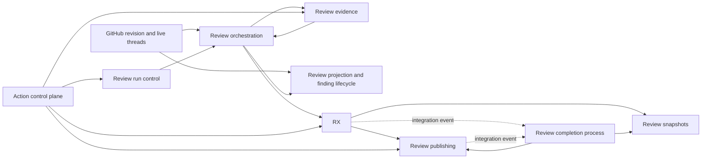
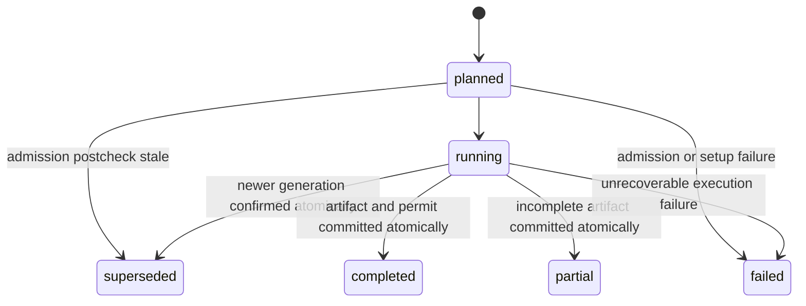
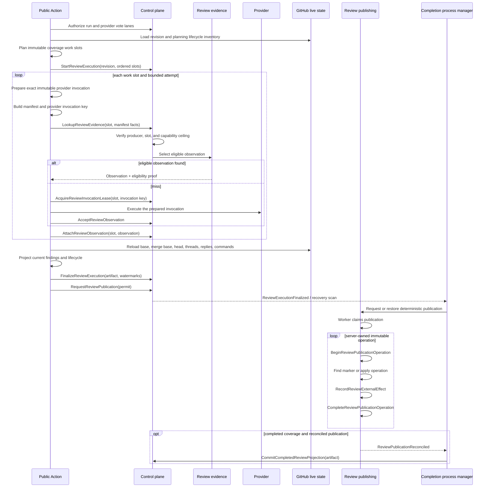

# Revision-aware review evidence plan

## Status

Implementation in progress as of 2026-07-23:

- Phase 0 characterization and exact-revision hardening are implemented in the
  release worktrees.
- Phase 1 bounded contexts, additive persistence, generated protocol, migration
  rehearsal, and disabled-by-default production composition are implemented.
- Phase 2 T0 execution, same-execution recovery, server-owned publication,
  immutable reusable workflows, authenticated operator commands, v1 admission
  drain, durable webhook/manual request ingress, exact-head workflow dispatch,
  provider-lane serialization, and production-shaped E2E are implemented locally.
  The release candidate passes the full Action/SaaS suites, all 35 migrations on a
  fresh PostgreSQL database, the real Prisma concurrency contract, and the
  production-shaped fault-recovery E2E. Cross-repository release registration,
  deployment, and allowlisted verification remain release gates, so production
  behavior is still disabled.
- Phases 3-5 remain deferred. No cross-revision reuse is enabled or implied by
  the T0 implementation.

This document extends, rather than replaces:

- [46-incremental-review-snapshots.md](./46-incremental-review-snapshots.md)
- [47-durable-large-pr-review-execution.md](./47-durable-large-pr-review-execution.md)
- [40-review-thread-lifecycle.md](./40-review-thread-lifecycle.md)

The target design is final enough to avoid a later data-model rewrite, but risky
reuse modes are enabled only after exact-revision correctness and shadow verification.

## Repository baseline

ReviewRouter has two release-coupled repositories with independent Git histories:

- `777genius/review-router-saas` owns the control plane, persistence, hosted OAuth
  wrapper source, and generated `action-dist/` wrapper bundle.
- `777genius/review-router` owns the review runtime source, committed `dist/`
  runtime bundle, and the deployed public Action tree. It receives the generated
  OAuth wrapper artifacts through the existing sync workflow.

The SaaS OAuth wrapper imports `@777genius/subscription-runtime` for provider
session custody and process running, then launches the public Action's
`dist/index.js`. That dependency does not own review planning, evidence reuse,
finding lifecycle, or publication policy. This feature must not move ReviewRouter
orchestration into subscription-runtime merely because the wrapper uses it.

```text
public action.yml
  -> action-dist/index.cjs  generated from SaaS OAuth wrapper
  -> dist/index.js         built from public Action src/
```

The existing SaaS sync copies `action.yml` and `action-dist/`; it does not rebuild
the public review runtime `dist/`. Review-domain changes therefore belong in the
public Action source and require its own rebuilt `dist/index.js` commit. Wrapper
changes belong in SaaS and are synchronized as generated artifacts.

This plan was created from `review-router-saas` `origin/main` at
`bbecfbc45269c29535e18dcf49ef0bde93be375f`. Implementation must start by fetching
both repositories again. No design assumes that either recorded SHA remains the
latest revision.

The normal delivery sequence remains:

```text
SaaS branch and migration
  -> SaaS API/worker/runtime tests
  -> public Action branch and bundle
  -> protocol compatibility tests
  -> merge SaaS and Action PRs in the documented release order
  -> disposable-repository hosted verification
```

Never merge the two histories. Synchronize the public runtime through the existing
artifact workflow described in
[07-environments-and-release-management.md](../operations/07-environments-and-release-management.md).

## Decision

Implement **revision-aware reusable evidence**, not direct cross-head reuse of a
completed review.

The architecture separates:

```text
execution state
provider observations
finding identity
revision-specific finding occurrence
current lifecycle projection
publication permit and mutation operations
```

The rollout has three reuse tiers:

| Tier | Meaning                                                            | Initial state                  |
| ---- | ------------------------------------------------------------------ | ------------------------------ |
| T0   | Exact review-revision/plan resume                                  | Enabled after hardening        |
| T1   | Cross-head reuse of a structurally prompt-only provider invocation | Shadow, then allowlisted       |
| T2   | Cross-head reuse of agentic provider exploration                   | Disabled until Context Gateway |

The central rule is:

```text
An old observation is evidence, not a current finding.
Only a projection built for the current revision may publish or block merging.
```

## Why the current aggregates are insufficient

The existing aggregates solve two narrower problems correctly:

- `ReviewExecutionCheckpoint` resumes accepted batches for one exact
  `(baseSha, headSha, compatibilityKey, planHash)` tuple.
- `ReviewSnapshot` stores one completed cross-head snapshot and supports delta
  review after a fully completed run.

They must remain separate. Neither one should become a generic cross-head model
cache.

The missing concepts are:

1. A checkpoint batch currently contains results from multiple providers. Reuse
   and retries need provider-level granularity.
2. A current batch work key is created before the final prompt and agentic context
   are known. It does not identify the observable provider input.
3. Agentic Codex can inspect arbitrary repository files and search scopes. A
   matching changed-file patch does not prove matching context.
4. Existing lifecycle verdicts belong to one head and one live GitHub thread
   inventory. They must never be reused as current verdicts.
5. A finding's identity, severity, placement, and lifecycle state currently do not
   have independent versioned concepts.
6. A full revision check before a GitHub request is not an atomic compare-and-write with
   GitHub. Publication needs generation fencing, idempotency, and stale cleanup.

## Goals

- Preserve exact-revision crash and timeout recovery.
- Stop obsolete work promptly without interrupting OAuth writeback.
- Reuse only observations whose complete observable inputs are proven compatible.
- Recompute synthesis, consensus, filtering, lifecycle, placement, and merge gate
  for every current revision.
- Prevent stale workers from overwriting or publishing a newer execution.
- Distinguish new, reconfirmed, changed, unresolved, and resolved findings.
- Keep customer-facing coverage honest.
- Keep all reuse fail-closed and independently disableable.
- Preserve provider neutrality for Codex, Claude Code, prompt-only APIs, and future
  providers.
- Keep code, diffs, prompts, credentials, and raw provider responses out of the
  SaaS persistence boundary.

## Non-goals

- Do not treat an LLM response as deterministic compiler output.
- Do not reuse agentic Codex or Claude Code observations across heads in the first
  release.
- Do not share observations across tenants, installations, repositories, or pull
  requests in the first release.
- Do not copy raw old findings into a new PR comment.
- Do not reuse old lifecycle votes or auto-resolve decisions.
- Do not make GitHub comment placement proof of finding validity.
- Do not add unbounded provider retries or retain every stochastic attempt forever.
- Do not use production customer repositories for smoke or agentic E2E tests.
- Do not claim that SaaS can revoke arbitrary user-authored workflows or a
  repository's native `GITHUB_TOKEN`. Mutation fencing covers the managed hosted
  ReviewRouter App lane; unmanaged static workflows must be migrated or remain
  outside v2 guarantees.

## Ubiquitous language

### Review revision

The immutable source revision being reviewed:

```text
workspaceId
repositoryConnectionId
scmRepositoryIdentityId
pullRequestNumber
baseSha
mergeBaseSha when available
headSha
reviewRevisionHash
```

`headSha` identifies publication scope. It does not by itself identify a reusable
provider input.

`reviewRevisionHash` is the canonical SHA-256 identity of workspace/current
repository connection/permanent SCM repository identity/PR,
base SHA, merge-base SHA (or explicit unavailable sentinel), and head SHA. Complete
coverage and blocking publication require a resolved merge base. A change to base
or merge base invalidates the revision even when `headSha` is unchanged.

Managed hosted v2 admission requires a resolved merge base before allocating an
execution generation or provider lease. The unavailable sentinel is retained only
for a typed diagnostic/non-v2 capability result; it cannot authorize durable v2
work, reuse, finalization, or publication. A transiently unavailable merge base
returns `revision_unavailable` with bounded read-only retry rather than spending
provider capacity on an identity that may change.

`ScmReviewRevisionPort` is the sole current-revision fact source. It first loads the
fresh PR/MR base and head SHAs, then resolves the merge base for those exact
immutable SHAs. The GitHub adapter uses the official Compare two commits response's
`merge_base_commit.sha`; the GitLab adapter uses the merge request
`diff_refs.base_sha` and treats asynchronously empty `diff_refs` as unavailable,
never as an empty SHA. The Action's checkout merge base is only a diagnostic hint
until the server independently derives the same tuple. See
[GitHub Compare two commits](https://docs.github.com/en/rest/commits/commits#compare-two-commits)
and [GitLab Merge requests API](https://docs.gitlab.com/api/merge_requests/).

Only the immutable `(SCM provider, repository identity, baseSha, headSha) ->
mergeBaseSha` result may be cached. The mutable current PR/MR base/head pointer is
always reloaded at admission and publication fences. A conflicting merge base for
the same immutable pair is an SCM integrity alert and fails closed.

Review run control owns this canonical preimage. Its domain code emits versioned
canonical UTF-8 bytes and an application digest port computes the hash. Downstream
contexts receive the immutable tuple/hash through anti-corruption DTOs and compare
all revision fields on fresh SCM reads; they do not invent another serializer.
`ResolveCurrentReviewRevision` is the Run Control application query used by
authorization, conditional webhook ingress, and publication-fence adapters; only
its SCM infrastructure adapter implements `ScmReviewRevisionPort`.

### Review execution

One attempt to produce the current review projection for one review revision.
It records its allocated generation, coverage, finalized projection/watermarks,
and publication permit under the `ReviewExecutionStream` aggregate. It does not
own GitHub's live thread state.

### Review task

An atomic semantic task, such as finding discovery or lifecycle revalidation.
Tasks may be transported together only when the resulting provider invocation is
treated as one indivisible input.

### Review work slot

One planned coverage obligation inside an execution: task kind, provider vote lane,
shard, required/optional policy, and bounded retry policy. A slot is scheduling and
coverage identity, not reusable-evidence identity. Each retry attempt prepares an
exact provider invocation and may therefore have a different
`ProviderInvocationKey` while still competing to satisfy the same slot.

### Provider invocation manifest

The canonical, sanitized description of every observable input to one provider
call. It contains hashes and policy identifiers, not source or prompt content.

### Provider invocation attempt

One server-allocated semantic try to satisfy a Review Work Slot with one immutable
prepared invocation. Review Executions owns `attemptId`, ordinal, budget, and lease
term. Several attempts may share a `ProviderInvocationKey` when their observable
input is byte-identical; a changed observable input has a different key. Evidence
only accepts an immutable successful observation against validated attempt facts.

### Review observation

One immutable successful provider response normalized into bounded evidence for
one invocation manifest. Multiple attempts may exist for the same manifest because
LLM output is nondeterministic.

### Finding lineage

The stable identity of one logical defect across revisions. Severity and line
placement are not part of lineage identity.

### Finding occurrence

Evidence that a lineage applies to one exact review revision, with current
severity, evidence, and placement confidence.

### Current review projection

The only review state that may be published or used by the merge gate. It is
rebuilt from current observations, live GitHub lifecycle state, policy, and any
eligible historical evidence.

### Review run authorization

A provider-neutral signed authorization minted after SCM OIDC verification and
protocol negotiation. It binds workspace, repository, PR, run attempt, exact
revision, trust domain, producer release, selected protocol/schema/limits profile,
and mutation epoch. Codex OAuth, Claude OAuth, and API-key credential leases are separate
adapter concerns and never define review scope.

It also carries server-derived provider vote lanes and capability ceilings from the
approved runtime configuration. A lane contains an opaque
`providerVoteIdentityHash`; it exposes no account, token, or credential value.

### Producer release

A server-owned registry entry proving an approved immutable runtime distribution:

```text
producerReleaseId
distributionKind: HostedComposite/PublicReusable
actionCommitSha
runtimeCommitSha
wrapperEntrypointDigest nullable
runtimeEntrypointDigest
schemaDigest
capabilityProfile
protocolLimitsProfileId/operationalSloProfileId
state: registered/revoked
```

Floating refs such as `main` or `v1`, caller-controlled runtime refs, static mode,
and client-reported digests do not prove a producer release and are T1-ineligible.
Provider/repository allowlisting is rollout policy, not producer-release state.

### Review mutation authority

The server-owned per-repository protocol mutation state for the managed hosted
ReviewRouter App lane. It has one monotonic epoch and one strict mode: `v1_open`,
`v1_draining`, `v2_active`, or `paused`. It is the only authority allowed to switch
that lane's mutation protocol; executions and publications merely carry and
validate its epoch.

`repositoryConnectionId` identifies the current tenant connection and may be
deleted or transferred. `scmRepositoryIdentityId` references a server-owned
permanent identity row uniquely keyed by normalized SCM provider, source base URL,
and external repository ID; it stores no owner/name/content. Mutation authority/tombstones key by
`(scmRepositoryIdentityId, laneKind)`, while authorization additionally binds the
current workspace/connection. Disconnect, workspace deletion, or transfer cannot
reset the epoch; reconnect requires an explicit scope rebind and a strictly newer
epoch before new mutation.

Review Run Control owns `ScmRepositoryIdentity`. Its identity aggregate owns only
normalization, permanent external identity, and the current tenant-connection
binding; `ReviewMutationAuthority` separately owns lane mode and epoch. Trusted
installation/provisioning commands may resolve/register and bind the identity.
Unbind first requires the mutation authority paused; rebind does not itself resume
mutation and is followed by the normal fresh-epoch resume command. Neither
Execution nor a tenant repository adapter may create or reset this identity.

## Bounded contexts

### 1. Review orchestration

Location: public Action runtime.

Owns:

- risk ordering and batching;
- final prompt construction;
- provider scheduling and retries;
- supersession response;
- collection of accepted observation references;
- provisional `CoverageCandidate` construction from local outcomes.

It depends on run-control, evidence, execution, lifecycle, and publishing clients.
It does not decide persistence, tenant authorization, reuse eligibility, or
publication eligibility. Authoritative complete/partial coverage is derived by
Review Executions from persisted required work-slot state during finalization.

### 2. Review run control

Location: new `packages/features/review-run-control` bounded context.

Owns trusted run admission:

- permanent `ScmRepositoryIdentity` registration and tenant-connection binding;
- immutable `ProducerRelease` registry and revocation;
- immutable release-bound operational SLO profile registry;
- provider-neutral `ReviewRunAuthorization`;
- protocol/schema negotiation and capability ceiling;
- per-repository `ReviewMutationAuthority`;
- versioned `ReviewSafetyPolicy`/`ReviewSafetyEmergencyControl` and immutable
  operation-specific safety-decision snapshots;
- v1 drain/abort and v2 activate/pause/resume transitions;
- authorization expiry and pruning.

It consumes a verified SCM run identity through a port. It does not verify GitHub
OIDC itself, hold provider credentials, execute reviews, or decide evidence reuse.

### 3. Review executions

Location: new `packages/features/review-executions` bounded context.

Owns durable execution control state:

- PR-scoped execution stream and stale-revision admission;
- compare-and-swap generation and immutable execution history;
- planned provider work;
- semantic `ProviderInvocationAttempt` identity and attempt budget;
- work-slot attempt budgets and invocation lease/fencing terms;
- accepted observation references and coverage;
- atomic finalized projection artifact and publication permit;
- supersession and terminal state;
- retention and pruning.

The existing `packages/features/review-execution-checkpoints` remains the protocol
v1 batch aggregate. It is not renamed or expanded into the v2 model. V1 and v2
routes compose separate use cases while the mutation-authority drain prevents both
from owning SCM mutation at once. V2 starts fresh after migration rather than
pretending a mixed-provider v1 batch can be losslessly converted into observations.

### 4. Review evidence

Location: new `packages/features/review-evidence` bounded context.

Owns:

- invocation manifest identity;
- immutable successful observations referencing execution-owned attempts;
- reuse eligibility policy;
- trust-domain scoping;
- TTL and pruning;
- candidate selection;
- safe metadata and metrics.

It has no GitHub, Codex, Claude, OAuth, workflow, or HTTP dependencies.

### 5. Review snapshots

Location: existing `packages/features/review-snapshots`.

Owns the last completed current projection used for incremental review. It does
not own partial work or invocation artifacts. Snapshot schema v2 owns bounded
`LineageHintDto` and `OccurrenceProvenanceDto` value snapshots inside the snapshot
aggregate. It does not own domain lineage identity, create a separate lineage
ledger, or treat old occurrences as current.

### 6. Review projection and finding lifecycle

Location: a feature slice in the public Action runtime, with GitHub/GitLab
inventory adapters outside its domain.

Owns:

- normalized trusted ReviewRouter thread inventory contract;
- synthesis and provider-vote consensus;
- lineage matching;
- occurrence classification;
- current placement;
- normalization and domain interpretation of SCM-owned human dismissals/replies;
- fresh revalidation quorum;
- current projection construction;
- current merge-gate contribution.

Its application entry point is `BuildCurrentReviewProjection`. Review orchestration
passes selected current observations, prior bounded lineage hints, review policy,
and a freshly loaded normalized lifecycle inventory, then receives one immutable
projection plus lifecycle/command watermarks. Orchestration cannot call lineage,
consensus, placement, or gate services separately and cannot construct a competing
projection. GitHub/GitLab remain authoritative for live thread resolution and
human interaction.

### 7. Review publishing

Location: existing `packages/features/review-publishing`.

Owns:

- deterministic publication plans and markers;
- immutable publication attempts and operations;
- external-effect observations and mutation receipts;
- provider-neutral publication results;
- stale-publication reconciliation policy.

GitHub and GitLab adapters perform mutations. They do not decide whether an
execution is current or eligible to publish. They consume a `PublicationPermit`
issued by Review Execution and revalidate it before each mutation group. This
context is extended instead of introducing a second source of current-generation
truth.

For protocol v2 these adapters run server-side under `apps/worker` and obtain the
GitHub App/GitLab credential internally. The public Action submits a bounded
immutable publication request but never receives a raw comment/check write token.
Legacy v1 token-based publication remains isolated until repository drain.

### 8. Action control plane

Location: existing `packages/features/action-control-plane`.

Owns:

- SCM OIDC verification;
- verified action transport identity and short-lived action sessions;
- server-derived workspace/repository/PR/run identity mapping;
- protocol transport and legacy v1 compatibility;
- request limits;
- HTTP adapters that translate v2 requests into run-control, execution, evidence,
  snapshot, and publication application commands.

It is a driving/anti-corruption boundary and cannot decide run admission, review
quality, reuse eligibility, mutation epoch, or publication eligibility.
Provider credential custody remains in provider/session adapters behind narrow
ports; this context never persists or exposes Codex/Claude credentials.

### Cross-context completion process manager

Finalization, publication, and snapshot advancement form a long-running process,
but not a ninth source of review policy. Add an application-level
`ReviewCompletionProcessManager` in a small `review-processes` package. It owns only
the durable progress of one process keyed by finalized `executionId`:

```text
executionId/processVersion
finalizedArtifactId
publicationAttemptId nullable
snapshotCommitReceiptId nullable
state: awaiting_publication/publication_in_progress/awaiting_snapshot/completed/
  completed_superseded/partial_completed/publication_not_applied/
  publication_stale_compensated/publication_stale_visible/
  blocked_terminal_unknown
lastWakeupKind/lastWakeupAt
nextActionAt/attemptCount/lastSafeReason
createdAt/updatedAt/retainUntil
```

It consumes versioned integration events, reloads canonical Execution,
Publication, and Snapshot facts through their public application query ports, and
invokes their idempotent commands. It owns no finding, coverage, publication, or
snapshot decision and never writes another context's repository. Duplicate or
out-of-order events only wake the same process; its version CAS and downstream
natural identities determine progress. Aggregate versions from different contexts
are never compared or collapsed into one event watermark.

The process manager runs under a dedicated internal service identity. That
identity can request/inspect only the artifact and permit already issued for the
referenced execution and can commit only the qualifying publication result into
Snapshot. It cannot mint permits, change coverage, begin SCM effects directly, or
use an Action authorization as worker authority; owning contexts revalidate every
fence.
`PublicationPermit` is an immutable value embedded in and reloaded through the
finalized artifact; it has no independent process-manager identity or repository.

The public Action may still request publication immediately for latency. The
process manager issues the same deterministic request after a crash or lost event.
A bounded `ReviewCompletionRecoveryFeedPort` finds finalized executions without a
process row, and a separate process query finds due rows without terminal progress,
so outbox dead-letter cannot strand a valid artifact. The recovery feed is an
infrastructure-owned read-only operational projection across context tables. It
returns identities only; the process manager reloads every canonical fact through
the owning context's application port before acting. No domain repository or write
path may use the cross-context projection. `terminal_unknown` blocks snapshot
advancement and remains visible until operator adjudication; partial execution
completes without a reusable snapshot.
Publication no-effect and stale outcomes map to their explicit terminal process
states and never retry forever or advance Snapshot. Effective `succeeded` advances
completed coverage to snapshot and maps partial coverage to `partial_completed`.

## Context map



## Context ownership and anti-corruption boundaries

Each fact has one canonical owner. Other contexts keep references or bounded
handoff copies only where a transactionally complete read model is required.

| Fact                                                        | Canonical owner    | Allowed downstream representation                                                             |
| ----------------------------------------------------------- | ------------------ | --------------------------------------------------------------------------------------------- |
| Immutable producer provenance and capability/limits ceiling | Review run control | Signed `producerReleaseId`, schema digest, capability profile, and protocol-limits profile ID |
| Authorized run identity and selected protocol               | Review run control | Opaque `authorizationId` plus signed immutable authorization claims                           |
| Canonical review revision identity                          | Review run control | Immutable revision tuple and opaque `reviewRevisionHash`                                      |
| Per-repository mutation mode and epoch                      | Review run control | Epoch copied into execution and publication commands for validation                           |
| Rollout and emergency safety intent                         | Review run control | Immutable operation-specific safety decision snapshot/hash                                    |
| Invocation canonicalization and compatibility               | Review evidence    | Opaque `ManifestKey` and `ProviderInvocationKey` plus eligibility result                      |
| Normalized provider-attempt payload                         | Review evidence    | Opaque `ObservationId`; completed snapshot may copy projected occurrence prose                |
| Current execution generation and accepted work              | Review executions  | Observation references, never copied observation payloads                                     |
| Finalized projection for one execution                      | Review executions  | Immutable `FinalizedReviewProjectionArtifact` reference                                       |
| Last completed cross-head projection and lineage hints      | Review snapshot    | One versioned snapshot payload per PR scope                                                   |
| Live thread resolution, replies, dismissals                 | GitHub             | Fresh normalized inventory for the current projection only                                    |
| Current publication eligibility                             | Review executions  | Immutable `PublicationPermit`, valid only while stream generation and watermarks match        |
| Publication operation, marker, and receipt                  | Review publishing  | External object IDs and safe reconciliation status                                            |

Boundary mappers are explicit anti-corruption layers. They may repeat field names
to translate semantics, but domain types are not imported across bounded contexts
merely to remove a few lines of mapping code.

## Domain model

### ProducerRelease

```text
producerReleaseId
distributionKind: HostedComposite/PublicReusable
actionCommitSha/runtimeCommitSha
wrapperEntrypointDigest nullable/runtimeEntrypointDigest
schemaDigest/capabilityProfile/protocolLimitsProfileId/operationalSloProfileId
state: registered/revoked
registeredAt/revokedAt nullable
```

This review-run-control aggregate is created only by trusted release automation
or an audited operator command. Runtime self-reporting is diagnostic input and
cannot create, upgrade, or reactivate a release. Revocation prevents new
authorizations and reuse decisions but preserves existing audit history.

`ReviewProtocolLimitsV2` is an immutable run-control registry value identified by
`protocolLimitsProfileId` and a canonical limits digest. It contains only the
bounded numeric ceilings named in Control-plane protocol. Release registration
rejects values above generated protocol maxima, and a profile ID is never rebound
to different values. `ProducerRelease` references exactly one profile, so every
authorization and retry sees the same admitted aggregate bounds.
`RegisterReviewProtocolLimitsProfile` creates or restores it by ID/digest through
release automation; `RegisterProducerRelease` rejects an absent or mismatched
profile. An unreferenced registered profile is inert and may remain for audit.

`ReviewOperationalSloProfileV2` is another immutable Review Run Control registry
value, identified by `operationalSloProfileId` and canonical digest. It contains
the numeric alert/rollout-stop thresholds listed in Observability, their owners,
and runbook references, but no repository state or review policy. Release
registration requires both profile IDs and never rebinds either ID to different
bytes. `RegisterReviewOperationalSloProfile` is restricted to release automation;
changing an SLO creates a new profile/release association and never mutates an
active authorization.

### ScmRepositoryIdentity

```text
scmRepositoryIdentityId
provider/normalizedSourceBaseUrl/externalRepositoryId
version
currentWorkspaceId/currentRepositoryConnectionId nullable
createdAt/boundAt/unboundAt nullable
```

The tuple is permanent and unique. `ResolveOrRegisterScmRepositoryIdentity`
accepts only trusted SCM installation facts. `BindScmRepositoryIdentity` validates
the current connection's composite scope; `UnbindScmRepositoryIdentity` requires a
paused mutation authority and clears tenant binding without deleting identity or
epoch. Conflicting simultaneous bindings are quarantined for operator resolution,
not merged by repository owner/name heuristics.
Binding commands version-CAS only the identity aggregate while reading/locking the
authority fact; resume version-CASes only mutation authority while reading/locking
the identity binding. The shared Run Control adapter uses one documented lock order
(`ScmRepositoryIdentity` then `ReviewMutationAuthority`) and maps deadlocks to the
normal use-case-owned bounded retry. No command writes both aggregate roots.

### ReviewMutationAuthority

```text
scmRepositoryIdentityId
laneKind: hosted_reviewrouter_app
version
epoch
mode: v1_open/v1_draining/v2_active/paused
drainPolicyVersion/drainStartedAt/v1AdmissionClosedAt/drainNotBefore nullable
managedWorkflowInventoryHash nullable
activationSafetyDecisionHash nullable
initializedAt
activatedAt/pausedAt nullable
```

This review-run-control aggregate is the single authority for whether v1 or v2
may mutate PRs in one repository. `ReviewExecutionStream` is deliberately not the owner of
protocol migration. Authorizations, executions, permits, and publication attempts
carry an epoch as a validated reference. They cannot advance it.

`BeginReviewMutationDrain` closes repository-wide v1 admission by CAS and persists
a server-computed `drainNotBefore`. The interval includes maximum v1 workflow
runtime, action-session and descendant write-token lifetimes, retry allowance, and
clock skew. A later policy increase may extend but never shorten an active drain.
`ActivateReviewMutationEpoch` requires database time past that boundary plus no
tracked active v1 lease/authorization/publication and an enabled live
`MutationEpochV2` safety decision. It persists that decision hash, increments the
never-reused epoch, and switches to `v2_active` atomically. Before activation only,
`AbortReviewMutationDrain` may
return to `v1_open` after proving that no v2 authorization or mutation exists.
`PauseReviewMutation` is a fail-closed `v2_active -> paused` operator action and
immediately blocks new run admission and publication
operations, while idempotent internal completion and reconciliation remain allowed.
`ResumeReviewMutationEpoch` requires reconciliation of unknown external effects and
a fresh enabled `MutationEpochV2` decision, persists its hash, and increments the
epoch before returning to `v2_active`, so pre-pause permits stay invalid. Returning
a migrated repository to `v1_open` is not a rollback path.

Allowed transitions are closed and version-CAS guarded:

| Command                             | From          | To            | Epoch change | Required proof                                                                          |
| ----------------------------------- | ------------- | ------------- | ------------ | --------------------------------------------------------------------------------------- |
| `InitializeReviewMutationAuthority` | absent        | `v1_open`     | initialize 0 | default or uncertain legacy state                                                       |
| `InitializeReviewMutationAuthority` | absent        | `v2_active`   | initialize 1 | v2-only provisioning and no legacy capability ever issued                               |
| `BeginReviewMutationDrain`          | `v1_open`     | `v1_draining` | none         | repository-wide v1 cutoff and `drainNotBefore` persisted                                |
| `AbortReviewMutationDrain`          | `v1_draining` | `v1_open`     | none         | no v2 authorization/effect exists                                                       |
| `ActivateReviewMutationEpoch`       | `v1_draining` | `v2_active`   | increment    | time/activity drain, enabled safety decision, and compatible managed-workflow inventory |
| `PauseReviewMutation`               | `v2_active`   | `paused`      | none         | none; fail closed immediately                                                           |
| `ResumeReviewMutationEpoch`         | `paused`      | `v2_active`   | increment    | unknown effects reconciled, release selected, and safety decision enabled               |

Every other transition is a typed domain rejection. Retried successful commands
are idempotent and never increment the epoch twice.

Absence of a row is `uninitialized`, never an implicit mode. The internal
`InitializeReviewMutationAuthority` command defaults to `v1_open`. It may create
`v2_active` at epoch 1 only when repository provisioning proves v2-only admission
from inception and the legacy-activity port proves that no v1 session or mutation
capability was ever issued. Any uncertainty chooses `v1_open` and the normal drain.

Activation also requires a fresh default-branch workflow inventory proving that
known ReviewRouter workflows no longer use a static write-enabled lane. The
inventory hash is persisted with the transition. SaaS cannot detect or revoke every
arbitrary user workflow, so v2 reconciliation trusts only objects owned by the
configured ReviewRouter App identity and carrying valid managed markers; external
`github-actions` objects are never adopted as v2 receipts.

### ReviewRunAuthorization

```text
authorizationId
scope/sourceRunId/sourceRunAttempt
baseSha/mergeBaseSha/headSha/reviewRevisionHash/trustDomain
producerReleaseId/selectedProtocolVersion/schemaDigest/protocolLimitsProfileId/operationalSloProfileId
mutationEpoch/providerVoteLanes
authorizationSafetyDecisionHash
protocolOfferHash/oidcReplayKeyHash
tokenSigningKeyId
state: active/expired/revoked
expiresAt/maxExpiresAt/createdAt
renewedAt nullable
```

This review-run-control aggregate binds one verified SCM run attempt to an
immutable producer release, one negotiated protocol, one mutation-authority epoch,
and opaque server-derived provider vote lanes. It authorizes review orchestration,
not access to provider credentials. Provider credential leases are separate
capabilities with separate lifetimes and owners.

The authorization is `active` when its transaction commits, and protocol selection
is immutable at that point. There is no cross-context first-command transition that
could split run control from execution state. `expired` and `revoked` are terminal
for Action/provider work. A permit finalized before ordinary expiry may drive only
the bounded internal publication-completion grace recorded in that permit;
explicit revocation blocks every new effect. Idempotent reads and
publication-effect reconciliation use their own bounded authority and remain
possible where required to converge already accepted state.

The signed token is a transport capability, not the aggregate. It contains only
`authorizationId`, scope hash, selected protocol/schema/limits/SLO profiles, producer release, mutation
epoch, authorization-safety decision hash, expiry, audience, and opaque vote-lane
identifiers. Every mutable command
verifies the signature and audience, then reloads the authorization, release, and
mutation authority from persistence. Key rotation must not erase the ability to
reconcile already recorded publication effects.

The issue-time safety hash is audit evidence for authorization, not a universal
kill switch for every continuation command. Each use case resolves its own live
decision kind: closing run admission denies renewal/new leases while an already
authorized attempt may still report under a separately enabled evidence-write
decision.

Authorization is idempotent by server-derived scope, SCM run ID/attempt, and
`protocolOfferHash`. The replay key is stored only as a hash. A retry after a lost
response returns a newly signed token for the same authorization row. Reuse of the
same OIDC replay key with conflicting scope, revision, or protocol offer is rejected;
it can never create a second authorization or select v1 after v2 was issued.

`RenewReviewRunAuthorization` requires a fresh SCM OIDC proof for the same
repository, run ID/attempt, workflow identity, and authorization. It may extend
`expiresAt` but never change scope, revision, protocol, release, vote lanes,
mutation epoch/authorization-safety decision, or exceed server-owned `maxExpiresAt`. Renewal is rejected
when the repository is paused, the release/authorization is revoked, the applicable
authorization-safety decision changed, or OIDC claims drift. Such a change requires
a new SCM run attempt; the old authorization is never rebound to new policy. Large reviews
refresh before lease renewal; no lease may outlive the renewed authorization.

### ReviewSafetyPolicy

```text
policyScope: Global/Workspace/Repository
workspaceId/repositoryConnectionId/scmRepositoryIdentityId nullable according to scope
capability: ReviewSafetyCapability
version
rolloutMode: Disabled/Shadow/Allowlisted/Enabled
providerTaskSelectors: bounded strict ProviderKind/ReviewTask pairs
updatedBy/updatedAt
```

One review-run-control aggregate owns operator intent for one
`(policyScope, capability)`. It does not contain an unbounded capability or
repository collection: global, workspace, and repository/capability rows are
separate aggregates with strict scope constraints and bounded provider/task
selectors. A command mutates exactly one aggregate by version CAS, so changing
run admission does not fence evidence reporting or publication accidentally.

```text
ReviewSafetyEmergencyControl:
  policyScope: Global/Workspace/Repository
  workspaceId/repositoryConnectionId/scmRepositoryIdentityId nullable according to scope
  version/stopped/reason/updatedBy/updatedAt
```

Emergency control is a separate aggregate per scope because it intentionally
applies to every v2 effect-bearing capability under that scope. Updating a repository
emergency control fences only that repository; updating the global control fences
all scopes. The global row is mandatory and missing/unreadable means stopped;
absent workspace/repository rows mean no additional stop. A narrower row cannot
clear an upper stopped state. Emergency control never disables status or
reconciliation of already possible effects.

`ReviewSafetyCapability` is a closed enum containing the named capabilities in the
Feature flags section. Absence at workspace/repository scope inherits. Absence at
global scope is `Disabled`. Resolution chooses the most restrictive applicable
mode (`Disabled`, then `Shadow`, then `Allowlisted`, then `Enabled`); a narrower
scope cannot re-enable an upper-scope disable or convert shadow into effects.
`Allowlisted` becomes effect-enabled only when an explicit, more-specific
workspace/repository rule enrolls the target with `Enabled` and every configured
provider/task selector matches. Missing enrollment denies effects; an absent
selector set means no additional provider/task narrowing for an already enrolled
target. Domain validation rejects `Shadow` for capabilities that have no
side-effect-free shadow behavior.

The application resolver accepts a strict `ReviewSafetyDecisionKind` and its
closed required-capability set. It reads only those applicable policy aggregates
plus emergency controls and produces an immutable `ReviewSafetyPolicySnapshot`
containing contributing IDs/versions, effective modes, and deterministic
`safetyDecisionHash`. The hash fences that decision kind only: disabling new run
admission blocks authorization/lease admission but does not invalidate an already
authorized observation report whose independent `EvidenceWritesV2` decision is
still enabled.

Initial decision kinds and required capabilities are closed:

| `ReviewSafetyDecisionKind`         | Required capability set                            |
| ---------------------------------- | -------------------------------------------------- |
| `RunAuthorization`                 | `RunAuthorizationV2`                               |
| `InvocationLeaseAdmission`         | `RunAuthorizationV2`                               |
| `ObservationAcceptance`            | `EvidenceWritesV2`                                 |
| `AuthorizedExecutionContinuation`  | no capability rule; emergency controls still apply |
| `ExactRevisionCrossExecutionReuse` | `EvidenceReuseV2`                                  |
| `PromptOnlyCrossRevisionReuse`     | `EvidenceReuseV2`, `PromptOnlyReuse`               |
| `ContextGatewayCrossRevisionReuse` | `EvidenceReuseV2`, `ContextGatewayReuse`           |
| `ExecutionFinalizationWithPermit`  | `PublicationOperationsV2`                          |
| `PublicationMutation`              | `PublicationOperationsV2`                          |
| `MutationEpochActivation`          | `MutationEpochV2`                                  |
| `StatusOrReconciliation`           | none; recovery authority is checked instead        |

Adding a decision kind or changing its capability set is a protocol/domain change
with an enum update, ADR review, and contract tests; callers cannot supply an
arbitrary capability list.

Each aggregate's monotonically increasing version is its fence. Effect-bearing use
cases synchronously compare the decision's ordered version vector with current
database rows. Normal cached reads may be at most 15 seconds old. Only deployment
or audited operator identities may update policy. Action tokens are read-only
consumers and cannot weaken a decision. The snapshot is decision evidence, not
another mutable aggregate.

### ReviewExecutionStream

```text
scope
version
activeExecutionId nullable
preparedExecutionId nullable
lastAllocatedGeneration
currentReviewRevision nullable
updatedAt
```

One stream aggregate exists per server-derived PR scope. It owns monotonic
generation allocation, at most one active execution and one lease-ineligible
prepared execution, bounded work slots, active lease terms, and publication
admission. Terminal executions, lease terms, and artifacts become immutable
history records and are not loaded as unbounded aggregate state.

The stream transaction loads only the active/prepared execution headers and the
configured maximum work slots for those at most two generations. Terminal history and observation payloads
are queried through projections and never rehydrated into the aggregate. The
configured slot maximum is enforced before admission, so aggregate size is bounded
independently of retry count and retention duration.

`StartReviewExecution` first verifies the complete requested review revision
against a fresh SCM read. Its application facade then executes a durable admission
saga:

1. It derives `startIdentityHash` from authorization ID, complete review revision,
   canonical ordered work-slot plan, and plan hash. The transaction first restores
   an existing execution by this identity; a conflicting canonical body is an
   idempotency conflict.
2. Otherwise `PrepareReviewExecution` CAS-updates the stream, allocates a monotonic
   generation, inserts the identity and execution in `planned`, and stores it as
   the one prepared slot. It atomically supersedes only an older `planned`
   execution; the active execution keeps running until admission confirmation.
3. The facade immediately reloads the complete SCM revision outside the transaction.
4. `ConfirmReviewExecutionAdmission` CAS-transitions `planned -> running` only when
   the postcheck still matches the authorization, requested revision, stream, and
   mutation epoch. That same command marks the prior active non-terminal execution
   `superseded`, records `supersededByGeneration`, cancels its pending slots,
   revokes active lease terms, promotes the prepared ID to active, and clears the
   prepared slot. A proven stale postcheck supersedes only the prepared execution
   (and any active execution independently proven stale by the same fresh SCM
   fact); a transiently unavailable SCM postcheck leaves both slots unchanged for
   bounded retry.

No provider lease can be acquired for `planned`. A retry after a crash reloads the
same prepared execution and repeats the postcheck; a sweeper fails abandoned
`planned` executions and clears `preparedExecutionId` by CAS after their admission
deadline without killing a still-valid active execution. A delayed workflow for an old
SHA receives `stale_revision` and does not start provider work.
The same authorization/start identity always returns its original generation,
including a terminal result. A genuinely new generation requires a fresh verified
SCM run authorization and start identity; changing only an idempotency key cannot
bypass this rule.

GitHub and PostgreSQL cannot participate in one atomic compare-and-write. If the
head changes between SCM precheck and stream CAS, the postcheck marks the just
created execution superseded before returning runnable work. A still-later change
is handled by the parent head supervisor and publication permit checks. The plan
does not claim to eliminate this external TOCTOU window; it prevents it from
publishing and bounds obsolete compute.

### ReviewExecution

```text
scope
executionId
generation
revision
authorizationId/mutationEpoch
startIdentityHash
admissionSafetyDecisionHash
state
compatibilityKey
planHash
plannedWorkSlots
acceptedObservationIdByWorkSlot
coverage
sourceRunId/sourceRunAttempt
createdAt/updatedAt/admissionDeadlineAt
admissionCheckedAt nullable
executionDeadlineAt/retainUntil
supersededByGeneration nullable
```

States:

```text
planned
running
superseded
completed
partial
failed
```

Allowed transitions are explicit. `superseded`, `completed`, `partial`, and
`failed` are terminal for one execution generation. A later retry starts a new
generation; it cannot move a terminal execution back to `running`.

The durable aggregate belongs to the review-executions bounded context. The
public Action owns an immutable local `ReviewPlan` and orchestrates commands, but
it does not maintain a second authoritative generation state machine. Generation,
epoch, and terminal-state transitions become authoritative only when accepted by
the control plane. An outage fallback may run fresh review logic, but cannot claim
durable resume or reusable evidence.

Each generation is a separate retained row with
`unique(scope, generation)` and immutable `executionId`. Starting a newer
generation marks the prior non-terminal active execution terminal `superseded`
only when admission confirmation promotes the new generation; it never rewrites
older terminal history in the stream's current-state row. A provider process already outside the transaction may finish,
but its late report can only become immutable historical Evidence within the
signed report window. Attachment, coverage, finalization, permit issuance, and
publication for the superseded generation remain forbidden.

### ReviewWorkSlot

```text
workSlotId
taskKind/providerKind/providerVoteIdentityHash/shardKey
required
attemptBudget/retryPolicyVersion
state: pending/leased/satisfied/exhausted/cancelled
activeLeaseId nullable
acceptedObservationRefId nullable
nextAttemptOrdinal
```

`ReviewWorkSlot` is a bounded child entity of the stream's current
`ReviewExecution`. `workSlotId` is stable for the immutable plan, while provider
invocation identity is created only after an adapter prepares the exact attempt. A
changed retry prompt, model option, tool
policy, CLI argument contract, or provider request receives a new manifest and
`ProviderInvocationKey`; it does not masquerade as the original invocation. The
server allocates attempt ordinals and enforces the slot retry budget.



### ProviderInvocationManifest

```text
manifestVersion
scopeHash
taskKindSet
providerKind
providerCapabilityHash
requestedModel
providerPolicyVersion
producerReleaseId
selectedProtocolVersion
providerRequestEnvelopeHash
outputSchemaHash
reviewConfigHash
runtimeCompatibilityKey
filePatchManifestHash
contextManifestHash
memoryBundleHash nullable
codeGraphProjectionHash nullable
lifecycleTargetSetHash nullable
liveLifecycleStateHash nullable
toolPolicyHash
executionProfile
baseTreeHash where required
environmentContractHash
```

The domain canonicalizer produces canonical UTF-8 bytes and the versioned preimage;
an application `Sha256DigestPort` produces
`manifestKey = sha256(canonicalManifestBytes)`. The durable execution key is:

```text
providerInvocationKey = sha256(
  "rr.provider-invocation.v1\0" + manifestKey + "\0" + providerVoteIdentityHash
)
```

Use `workSlotId` for planning and coverage. Use `providerInvocationKey` for evidence
lookup, attempt leases, observation references, and vote uniqueness. Store both
manifest keys with every attempt. Field ordering and null representation are
versioned and tested with golden fixtures.

The domain never imports `node:crypto`, WebCrypto, or a provider SDK. It owns the
preimage format and validates digest value objects; infrastructure owns the SHA-256
implementation. Golden fixtures include canonical bytes, `manifestKey`, and
`providerInvocationKey`, so different adapters cannot silently disagree.

The manifest stores no prompt text, code, diff, credential, token, cookie, or raw
environment value.

The public Action's `ProviderInvocationManifestAssembler` runs only after the exact
ordered provider request, context, task set, and tool policy are frozen. It passes
sanitized value objects to the generated review-evidence canonicalizer; it does not
reimplement hashing rules. A request assembled earlier in planning is not an
invocation manifest. `providerRequestEnvelopeHash` covers
message roles and bytes, system/developer instructions, tool definitions, inference
options, requested model, resolved provider configuration, and API/CLI contract
version after all transformations.

Every provider adapter exposes a two-step application-facing contract:

```text
prepareInvocation(workSlot, attemptPolicy) -> PreparedProviderInvocation
executePreparedInvocation(preparedInvocation, credentialLease) -> ProviderResult
```

This is a new strict `ProviderExecutionContractVersion`, not a wrapper around the
current `Provider.review(prompt, timeout)` API. A producer release registers the
exact provider kinds/contracts it implements. Run authorization and execution
start reject a required provider/task whose adapter contract is absent; they never
pretend that a hidden CLI/API request is canonicalized. Repositories are eligible
for mutation-epoch migration only when every configured required provider has a
registered v2 preparation contract. Optional providers may be omitted only by the
existing authoritative coverage policy, never silently by the adapter.

Initial rollout may enable Codex and Claude Code adapters first while other
providers remain on an unmigrated v1 repository lane. Once a repository is
`v2_active`, an unsupported provider is a typed configuration failure and cannot
trigger v1 mutation fallback. This keeps the architecture provider-neutral without
requiring an unsafe all-provider rewrite in one PR.

One server `attemptId` means one semantic prepared invocation. A transport may
repeat the exact same frozen request bytes/options/tool contract under that attempt
after a connection failure or retryable rate limit, with a bounded
`transportAttemptCount`; it cannot change prompt, model, options, tool policy, CLI
argv, or parsing contract. Any such semantic change returns a typed retry directive
to orchestration, which prepares a new manifest, acquires the next work-slot attempt
term, and receives a new `attemptId`/`ProviderInvocationKey` when its observable
input changed. An adapter cannot hide a prompt-changing retry loop.

Current Codex second-pass/self-correction requests are therefore separate semantic
attempts when their prompt includes prior output. Byte-identical OpenRouter/HTTP
transport retries may stay inside one attempt but expose bounded count and final
safe outcome. An unsuccessful/invalid first result does not become accepted
evidence merely because it informed a later retry; only the separately accepted
successful observation can satisfy the work slot.

`PreparedProviderInvocation` is immutable and contains the exact prompt/messages,
model/options, tool contract, endpoint/CLI semantics, and sanitized manifest facts
for that attempt. The same object whose safe facts are canonicalized is passed to
execution; adapters cannot rebuild or mutate the request afterward. Credentials
are injected only at transport time and never enter the manifest. A retry transform
prepares a new object and, when observable input changes, a new invocation key. A
byte-identical transport retry inside `executePreparedInvocation` retains both
invocation key and attempt ID and only increments `transportAttemptCount`; an
orchestration-level re-execution acquires a new attempt ID even when the invocation
key remains identical.

Canonicalization uses UTF-8, explicit absent/null/empty distinctions, sorted set
fields, duplicate rejection, lowercase digests, and a versioned domain separator.
Ordered fields remain ordered.

The client never supplies a trusted `hermeticity: true` assertion. It reports
versioned execution facts. The control plane clamps maximum eligibility using the
signed `ReviewRunAuthorization`, registered producer release, selected protocol,
and a server-owned provider/task/tool-policy capability matrix. Producer digests
are server-derived; a digest reported by the checked-out runtime is never
attestation. An unknown release, enum, tool policy, or capability profile is
ineligible for T1.

### ReviewObservation

```text
observationId
scope
manifestKey
providerInvocationKey
providerVoteIdentityHash
sourceRevision
sourceExecutionId
sourceWorkSlotId
sourceAuthorizationId
evidenceWriteSafetyDecisionHash
sourceRunId/sourceRunAttempt
providerKind
requestedModel
actualModel
providerRuntimeVersion
producerReleaseId
trustedCapabilityProfile
executionProfile
attemptId
status: success
normalizedFindings
safeUsage
payloadHash
qualityFlags
transportAttemptCount
trustDomain
createdAt/reuseExpiresAt/retainUntil
```

Only successful, schema-valid, fully consumed responses become reusable
observations. Timeout, cancellation, rate limit, partial JSON, missing required
provider, or failed persistence acknowledgement never produces reusable success.

Multiple observations may exist for one provider invocation key. A deterministic
selection policy chooses at most one observation per provider vote identity for
one projection.
Observations from duplicate attempts never count as independent consensus votes.

`providerVoteIdentityHash` is derived from a stable server-owned provider
configuration/account identity where available, not from an access token, refresh
token, session file, or attempt ID. Credential rotation therefore does not create a
new vote. When stable account identity is unavailable, the configured provider
lane is the conservative identity boundary; aliases cannot count as independent
votes unless the server can prove they are distinct.

The lookup key is derived from requested invocation facts available before the
call. `actualModel` exists only on the accepted observation. The selector checks it
against the server-owned compatibility policy; model fallback is a miss unless an
explicit, versioned compatibility rule permits it.

### Finding lineage model

```text
lineageId
scmRepositoryIdentityId
pullRequestNumber
category
normalizedFailureModeHash
symbolAnchor nullable
firstSeenHeadSha
trustedMarker
```

In the initial implementation this is a lifecycle/current-projection domain entity,
not a standalone aggregate, repository, or table. The `CurrentReviewProjector`
assigns lineage using prior snapshot hint DTOs plus trusted markers and the freshly
loaded live-thread inventory. Observation candidates and Snapshot never own or
authoritatively assign lineage.

GitHub remains authoritative for live resolution. Extracting a separate lineage
ledger is a future migration that requires its own ADR and demonstrated query or
retention need; it is not part of this rollout.

Severity, exact path, line number, title wording, and provider count are occurrence
attributes, not lineage identity. A severity change therefore does not create a
second logical defect.

Lineage matching is conservative:

1. Exact trusted marker and compatible failure mode.
2. Exact current anchor mapping.
3. Bounded deterministic similarity only as a candidate.
4. Ambiguity creates a new candidate or manual-attention state, never an automatic
   resolve or merge-gate downgrade.

### FindingOccurrence

```text
lineageId
reviewRevision
state
severity
title/message
evidence
path/range
placementConfidence
observationIds
freshProviderVoteKeys
createdAt
```

States:

```text
new
reconfirmed
changed
carried_unverified
resolved
uncertain
suppressed_by_human
```

Only `new`, `reconfirmed`, and `changed` occurrences built from current eligible
evidence may fail by severity. `carried_unverified` and `uncertain` remain visible
as coverage/lifecycle warnings but do not fail by severity.

### PublicationPermit

```text
scope
executionId
generation
authorizationId
producerReleaseId
reviewedHeadSha
reviewRevisionHash
projectionHash
lifecycleStateHash
commandLedgerWatermark
permitEpoch
publicationSafetyDecisionHash
publicationNotAfter
```

`FinalizeReviewExecution` issues this immutable value only for the stream's current
execution and finalized projection. Advancing the stream generation or changing the revision,
lifecycle hash, command watermark, or projection invalidates it. Review publishing
cannot issue or broaden a permit.

Finalization requires a non-revoked authorization and producer release and occurs
before authorization expiry. The permit's server-owned `publicationNotAfter`
provides only a bounded completion grace for the internal worker; ordinary Action
commands remain expired. Explicit authorization or release revocation immediately
blocks new publication claims/operations even inside that grace. Effect recording
and reconciliation of an already possible SCM mutation remain allowed.

### ReviewPublicationAttempt

```text
publicationAttemptId
permit identity
version
activeClaimId nullable
state: pending/publishing/reconciling/terminal
terminalOutcome nullable: succeeded/superseded_no_effect/failed_no_effect/
  stale_compensated/stale_visible/terminal_unknown
immutable operations
external-effect observations
receipts
retainUntil
```

One attempt belongs to exactly one
`(scope, executionId, generation, projectionHash)`. It is never updated into a new
generation. This aggregate extends the existing `review-publishing` context and
cannot make an SCM mutation atomic, so SCM-specific reconciliation remains
mandatory.

`RequestReviewPublication` creates `pending`; claim moves it to `publishing`.
Revision/policy loss before any possible effect yields `superseded_no_effect`.
Permanent pre-effect adapter/permission failure yields `failed_no_effect`. A stale
effect that is proven removed or neutralized yields `stale_compensated`; an
irreversible but clearly marked stale effect yields `stale_visible`. Only all
required canonical receipts under current fences yield `succeeded`. Exhausted
ambiguity yields `terminal_unknown`, never generic `abandoned`.

## Aggregate boundaries and domain services

Do not create one aggregate containing a complete PR, every invocation, every
finding, and every publication. That aggregate would require long transactions and
would grow without a useful consistency boundary.

Aggregate roots:

- `ScmRepositoryIdentity` owns one permanent external SCM identity and its current
  tenant-connection binding; it never owns review content or mutation mode.
- `ProducerRelease` owns one immutable registered build tuple and its revocation
  state.
- `ReviewMutationAuthority` owns protocol admission and the never-reused mutation
  epoch for one repository.
- `ReviewRunAuthorization` owns the protocol/release/run binding for one verified
  SCM run attempt.
- `ReviewSafetyPolicy` owns one scoped capability rule and its monotonic fence
  version; `ReviewSafetyEmergencyControl` independently owns one scoped emergency
  stop. The resolved decision snapshot/hash is a value object, not a competing
  aggregate root.
- `ReviewExecutionStream` owns admission, current execution/work slots, and active
  lease terms for one PR scope. Terminal execution and lease rows are immutable
  history emitted by this aggregate, not additional roots.
- `ReviewObservation` is immutable after acceptance and references exactly one
  `ProviderInvocationAttempt` owned by Review Executions through a validated
  anti-corruption fact; Evidence does not allocate attempt IDs or budgets.
- `ReviewPublicationAttempt` owns one permit-qualified mutation plan, operation
  attempts, and receipts inside `review-publishing`.
- `ReviewSnapshot` remains the completed projection aggregate described in document
  46; its v2 payload owns bounded lineage/provenance value snapshots only.
- `ReviewCompletionProcess` owns only monotonic cross-context progress for one
  finalized execution; it references canonical result identities and cannot
  reinterpret their policy or payloads.

`ReviewExecution`, `ReviewWorkSlot`, active `ReviewInvocationLease`,
`ReviewExecutionObservationRef`, and `FinalizedReviewProjectionArtifact` are
entities/history records controlled by `ReviewExecutionStream` even when stored in
normalized tables. Policy selectors are bounded child entities of their
`ReviewSafetyPolicy`. Claim terms, operations, operation attempts, external
effects, and receipts are entities inside `ReviewPublicationAttempt`. They do not
receive independent repositories that could bypass aggregate invariants.

Normalized persistence does not require loading all history. Execution commands
load the active generation plus its bounded work slots. Publication commands load
the parent attempt version/permit and only the targeted bounded operation; the
finalized publication plan enforces operation/chunk limits before the attempt is
created. Historical lease terms, retries, and external-effect observations are
append-only query records checked through parent fencing, not unbounded in-memory
collections.

`CurrentReviewProjection` is a derived domain result, not a long-lived aggregate.
It can be reproduced from the current revision, selected observations, live
lifecycle state, review policy, and prior lineage hints.

Domain services:

```text
ReviewReuseEligibilityPolicy
ReviewObservationSelector
FindingLineageMatcher
CurrentReviewProjector
SupersessionDispositionPolicy
PublicationPermitIssuancePolicy
```

`PublicationPermitIssuancePolicy` belongs to Review Executions and decides only
whether the current finalized execution may receive a permit. Review Publishing
cannot call or reimplement it; Publishing validates the issued permit plus its own
operation/reconciliation fences.

Application ports remain narrow:

```text
ScmRunIdentityVerifierPort
ReviewRunScopeResolverPort
ScmRepositoryIdentityQueryPort
ScmRepositoryIdentityCommandPort
ProviderVoteLaneResolverPort
ReviewRunAuthorizationTokenPort
LegacyReviewMutationActivityPort
LegacyReviewMutationAdmissionGatePort
ManagedReviewWorkflowInventoryPort
ProducerReleaseQueryPort
ProducerReleaseCommandPort
ReviewProtocolLimitsProfileQueryPort
ReviewProtocolLimitsProfileCommandPort
ReviewOperationalSloProfileQueryPort
ReviewOperationalSloProfileCommandPort
ReviewRunAuthorizationQueryPort
ReviewRunAuthorizationCommandPort
ReviewMutationAuthorityQueryPort
ReviewMutationAuthorityCommandPort
ReviewSafetyPolicyQueryPort
ReviewSafetyPolicyCommandPort
ReviewSafetyEmergencyControlQueryPort
ReviewSafetyEmergencyControlCommandPort
CurrentReviewSafetyDecisionPort
ReviewExecutionQueryPort
ReviewExecutionCommandPort
ReviewObservationQueryPort
ReviewObservationCommandPort
ReviewExecutionAttemptFactsPort
ReviewEvidenceObservationFactsPort
ReviewEvidencePrunerPort
Sha256DigestPort
ReviewInvocationLeaseHistoryQueryPort
ReviewInvocationLeaseCapabilityTokenPort
ReviewSnapshotQueryPort
ReviewSnapshotCommandPort
ReviewSnapshotPrunerPort
ScmReviewRevisionPort
CurrentReviewRevisionPort
LiveReviewThreadInventoryPort
ProviderInvocationPreparationPort
ProviderExecutionPort
CurrentPublicationPermitPort
CurrentMutationAuthorityPort
ReviewPublicationRunControlDecisionPort
ReviewPublicationAttemptQueryPort
ReviewPublicationAttemptCommandPort
ReviewPublicationClaimCapabilityTokenPort
ReviewPublicationOperationCapabilityTokenPort
ReviewPublicationGatewayPort
ReviewCompletionProcessQueryPort
ReviewCompletionProcessCommandPort
ReviewCompletionRecoveryFeedPort
ReviewCompletionExecutionPort
ReviewCompletionPublicationPort
ReviewCompletionSnapshotPort
ClockPort
```

The names describe capabilities, not mandatory one-class-per-method ceremony. A
Prisma adapter may implement several ports, but a use case receives only the
smallest interface it consumes. Existing v1 repository interfaces remain behind
compatibility adapters until their callers migrate.

V1 endpoint paths and successful DTOs remain compatible, but mutating behavior is
not left ungated. `LegacyReviewMutationAdmissionGatePort` is injected into every
managed v1 OIDC/session admission or renewal that can lead to mutation and every
descendant comment, review, check, or other write-token minting use case. `v1_open` allows and
records the capability plus maximum expiry through
`LegacyReviewMutationActivityPort`; `v1_draining`, `v2_active`, and `paused` reject
new mutating authority. Already issued capabilities remain valid only to their
original bounded expiry, which is included in `drainNotBefore`; the gate cannot
extend or replace them during drain. Read-only status remains available.

The current checkout token is read-only and is not mislabeled as mutation
authority. An already admitted v1 run may obtain its bounded read-only checkout
continuation during drain, but no new v1 run may be admitted and that token cannot
mint or imply a write token. Permission-classification contract tests enumerate
read-only continuation issuers separately from mutation issuers and fail when an
issuer's actual SCM permissions drift. A future write-enabled checkout token must
move into the mutation-gated inventory before release.

This gate covers server-managed v1 lanes. A user-authored static workflow that
uses its native SCM token cannot be fenced by SaaS, so fresh workflow inventory
must block v2 activation while any supported static write-enabled form remains.

`ReviewInvocationLeaseHistoryQueryPort` is read-only and exists only for bounded
late-result/capability validation. Lease acquire, renew, release, expiry, adoption,
and active-slot mutation persist exclusively through operation-specific methods on
`ReviewExecutionCommandPort`; there is no generic transaction port or independent lease command
repository that can bypass stream, work-slot, attempt-budget, or fencing
invariants.

`ReviewSafetyPolicyQueryPort/CommandPort` and emergency-control ports belong to
Review Run Control.
`CurrentReviewSafetyDecisionPort` is a context-local consuming port in Evidence,
Executions, and Publishing; its adapter calls `ResolveReviewSafetyPolicy` and maps
the immutable result into that context's language. Consumers never import the
policy aggregate or repository.
`ReviewPublicationRunControlDecisionPort` is a Publishing-owned consuming port. Its
outer adapter asks Review Run Control whether the permit-bound authorization or
producer release was explicitly revoked and maps only the operation-specific
decision; Publishing never imports run-control repositories or aggregate types.

Evidence owns `ReviewExecutionAttemptFactsPort` for validating a persisted
execution attempt/lease term. Executions owns
`ReviewEvidenceObservationFactsPort` for validating an immutable Evidence
observation before attachment. Their adapters live in `apps/api` and call only the
other context's package-root query API. Neither feature package declares a
dependency on the other's package, composition, Prisma adapter, or domain types;
the anti-corruption mapping is outer-layer code and cannot recursively invoke a
mutating use case.

All cross-context consuming ports follow the same explicit composition matrix:

| Consuming port/context                                                                  | Owning context root query/command API                     | Outer adapter                                                      |
| --------------------------------------------------------------------------------------- | --------------------------------------------------------- | ------------------------------------------------------------------ |
| Evidence `ReviewExecutionAttemptFactsPort`                                              | Executions attempt/lease facts query                      | `apps/api`                                                         |
| Executions `ReviewEvidenceObservationFactsPort`                                         | Evidence observation facts query                          | `apps/api`                                                         |
| Evidence/Executions/Publishing `CurrentReviewSafetyDecisionPort`                        | Run Control `ResolveReviewSafetyPolicy`                   | `apps/api` for request commands; `apps/worker` for worker commands |
| Executions/Publishing `CurrentReviewRevisionPort`                                       | Run Control `ResolveCurrentReviewRevision`                | `apps/api` and `apps/worker` compositions                          |
| Publishing `CurrentPublicationPermitPort`                                               | Executions current artifact/permit query                  | `apps/api` and `apps/worker` compositions                          |
| Publishing `CurrentMutationAuthorityPort` and `ReviewPublicationRunControlDecisionPort` | Run Control current authority/revocation decision queries | `apps/api` and `apps/worker` compositions                          |
| Processes `ReviewCompletionExecutionPort`                                               | Executions finalized artifact/status APIs                 | `apps/worker`                                                      |
| Processes `ReviewCompletionPublicationPort`                                             | Publishing request/effective-outcome APIs                 | `apps/worker`                                                      |
| Processes `ReviewCompletionSnapshotPort`                                                | Snapshot commit-receipt API                               | `apps/worker`                                                      |

Each adapter maps owner DTOs into the consumer's local value objects and exposes no
repository or aggregate. Architecture CI forbids every corresponding direct
feature-package dependency in both directions, not only the Evidence/Executions
pair. `apps/api` and `apps/worker` are composition roots, so adding an adapter there
does not grant one context access to another context's infrastructure.

Application use cases are explicit and owned by one context:

```text
public-action review-projection:
  BuildCurrentReviewProjection

review-run-control:
  ResolveOrRegisterScmRepositoryIdentity
  BindScmRepositoryIdentity
  UnbindScmRepositoryIdentity
  ResolveCurrentReviewRevision
  InitializeReviewMutationAuthority
  RegisterReviewProtocolLimitsProfile
  RegisterReviewOperationalSloProfile
  RegisterProducerRelease
  RevokeProducerRelease
  AuthorizeReviewRun
  RenewReviewRunAuthorization
  ExpireOrRevokeReviewRunAuthorization
  BeginReviewMutationDrain
  AbortReviewMutationDrain
  ActivateReviewMutationEpoch
  PauseReviewMutation
  ResumeReviewMutationEpoch
  ResolveReviewSafetyPolicy
  UpdateReviewSafetyPolicy
  SetReviewSafetyEmergencyStop

review-evidence:
  LookupReviewEvidence
  AcceptReviewObservation
  PruneReviewEvidence

review-executions:
  RestoreReviewExecution
  StartReviewExecution
  PrepareReviewExecution
  ConfirmReviewExecutionAdmission
  AcquireReviewInvocationLease
  RenewReviewInvocationLease
  ReleaseReviewInvocationLease
  AdoptAcceptedObservation
  SupersedeReviewExecution
  AttachReviewObservation
  FinalizeReviewExecution
  ExpireAbandonedReviewAdmissions
  ExpireReviewInvocationLeases

review-snapshots:
  RestoreCompletedReviewProjection
  CommitCompletedReviewProjection

review-publishing:
  RequestReviewPublication
  ClaimReviewPublication
  RenewReviewPublicationClaim
  BeginReviewPublicationOperation
  RecordReviewExternalEffect
  CompleteReviewPublicationOperation
  ReconcileStaleReviewPublication
  TerminalizeUnknownReviewPublication
  AdjudicateReviewPublicationOutcome
  ScanDueReviewPublicationOperations
  PruneReviewPublicationHistory

review-processes:
  AdvanceReviewCompletionProcess
  RecoverMissingReviewCompletionProcesses
  ScanDueReviewCompletionProcesses
```

Atomic command ownership is explicit:

| Use case                                 | Atomic state change                                                                                | External work outside transaction                                                                |
| ---------------------------------------- | -------------------------------------------------------------------------------------------------- | ------------------------------------------------------------------------------------------------ |
| `ResolveOrRegisterScmRepositoryIdentity` | immutable identity insert/restore by trusted external tuple                                        | trusted installation facts loaded before command                                                 |
| `Bind/UnbindScmRepositoryIdentity`       | identity binding CAS; authority is locked/read but not mutated                                     | installation authority verified before command; pause/resume is a separate authority command     |
| `AuthorizeReviewRun`                     | authorization plus selected release/protocol/epoch binding                                         | SCM OIDC verification, scope resolution, and vote-lane resolution before persistence transaction |
| `UpdateReviewSafetyPolicy`               | one scoped policy version/fence CAS                                                                | none; caller identity is verified before the transaction                                         |
| `SetReviewSafetyEmergencyStop`           | one scoped emergency-control version/fence CAS                                                     | none; caller identity is verified before the transaction                                         |
| `PrepareReviewExecution`                 | stream CAS, planned generation insert, older prepared-slot replacement; active execution unchanged | SCM revision precheck before and postcheck after                                                 |
| `ConfirmReviewExecutionAdmission`        | planned promotion plus prior-active supersession/lease revocation, or prepared-only stale CAS      | none; consumes fresh postcheck facts                                                             |
| `AcceptReviewObservation`                | immutable observation insert idempotent by authorized attempt/payload hash                         | provider invocation and immutable lease/control facts loaded before command                      |
| `AttachReviewObservation`                | observation-reference insert plus execution coverage CAS                                           | immutable observation and live control facts loaded before command                               |
| `FinalizeReviewExecution`                | artifact, completed/partial state, permit, outbox                                                  | none                                                                                             |
| `ClaimReviewPublication`                 | new fenced claim term                                                                              | fresh SCM state is loaded before the command                                                     |
| `BeginReviewPublicationOperation`        | immutable operation attempt and capability ID                                                      | SCM mutation after commit                                                                        |
| `RecordReviewExternalEffect`             | append-only effect observation                                                                     | none; the SCM response already happened                                                          |
| `CompleteReviewPublicationOperation`     | current-claim receipt and operation transition                                                     | marker reconciliation happens before command                                                     |
| `CommitCompletedReviewProjection`        | snapshot monotonic CAS plus immutable commit receipt                                               | canonical artifact and effective publication outcome loaded before command                       |

Application transactions never span provider, SCM, HTTP, or queue calls. Every
post-call command is idempotent and validates the authoritative aggregate version
or fencing token again.

They also never mutate two bounded-context aggregates atomically. Observation
acceptance validates a signed persisted attempt term, database time, and current
control facts, but writes only immutable Evidence state. A concurrent revocation
may leave inert historical evidence; attachment/reuse reloads live
authorization/release/policy state and cannot convert it into coverage when those
facts are no longer valid. Attachment writes only the Execution stream; a
restricting foreign key or equivalent insert check turns an observation-pruning
race into a typed miss. This is safer than pretending a cross-context unit of work
exists.

New v2 persistence does not expose a generic transaction callback or global
`UnitOfWork`. Each context's `*CommandPort` has closed operation-specific atomic
methods such as `prepareExecution`, `attachObservation`, `finalizeExecution`,
`acceptObservation`, and `completePublicationOperation`. The application use case
loads facts, invokes the aggregate/domain service, and passes an immutable
transition containing expected versions, natural command identity, child-row
changes, and source-owned integration event. The adapter applies that transition
in one Prisma transaction or returns a typed restored/conflict result.

Those ports expose no `PrismaClient`, `Prisma.TransactionClient`, transaction-bound
repository, callback, another context's command port, or outbox claim/retry API.
Consequently application code cannot capture a network adapter inside a database
callback or return a transaction-scoped port. For example,
`ReviewExecutionCommandPort.finalizeExecution` atomically compares the stream and
execution versions, stores artifact/permit, changes terminal state, inserts the
command receipt, and appends `ReviewExecutionFinalized` version 1; it cannot write
Evidence or Publication state.

Command IDs, aggregate IDs, hashes, and immutable application timestamps are
prepared before the atomic method; expiry predicates use database time inside it.
The adapter maps `40001`/`40P01` to a typed concurrency failure and never retries
by itself. A concrete use case may recompute and resubmit its transition with
bounded attempts, fresh aggregate reload, and the exact same command identity.
Commit ambiguity is never treated as a serialization retry: the use case first
reloads the natural command/result identity and returns it when present.

There is no global idempotency registry. Each command uses its aggregate's natural
identity when one exists: authorization replay hash, execution generation and plan
hash, lease acquire request hash, observation payload hash, artifact hash, publication
attempt/operation/request ID, or snapshot generation. A context-local command receipt
is introduced only for a command with no natural durable receipt. It stores the
operation kind, hashed key, canonical request hash, result identity, and retention
deadline; the same key with another request hash is a conflict. HTTP middleware never
claims success independently of the owning context's receipt.

The appended outbox row is an infrastructure delivery record for a source-owned
integration event, not a second business aggregate mutation. The Prisma adapter
uses one database transaction for source rows and the existing outbox table. Event
types and payload DTOs are closed/versioned in the source context, then mapped to
the legacy generic outbox envelope at the infrastructure boundary. Payloads contain
only IDs, hashes, versions, counts, and safe reason enums. Deterministic
idempotency keys use `eventType + aggregateId + aggregateVersion`; a conflicting
payload for the same key is a hard invariant violation.

The Prisma implementation must preserve the existing globally unique outbox
`idempotencyKey`: insert with conflict-do-nothing, then load and compare the
immutable type/version/scope/aggregate/payload hash. It returns the existing row
only when every field matches and never uses an upsert that overwrites payload or
resets delivery state. Aggregate IDs are opaque, so the event type and versioned
key prefix are mandatory before hashing.
One private platform-level `PrismaIntegrationEventAppender` implements this SQL
mechanic for all v2 command adapters; it exposes no review policy and is not a
domain/application port. The existing Memory outbox behavior is not reused as
proof because it currently treats every unique conflict as equivalent success.

The existing shared outbox claim path is not yet safe proof for multi-replica v2:
claim ownership is not fenced, so an old worker could acknowledge a row after
stale recovery assigned it to a replacement. Before any v2 writer is enabled, the
platform outbox adds infrastructure-only claim fields `claimId`, `claimVersion`,
`claimOwnerHash`, and `claimUntil`. Every successful claim or takeover allocates a
database-generated, never-reused `claimVersion` and a new `claimId`.
`markProcessed`, retry scheduling, and dead-lettering update only when
`(eventId, claimId, claimVersion, status = processing)` still matches. Stale
recovery CAS-checks the expired claim before replacing it; a paused old worker
receives typed `stale_claim` and cannot mutate delivery state.

Handlers remain business-idempotent because fencing the delivery row cannot undo
an already committed context command. A bounded heartbeat may extend `claimUntil`
only for the same term; each handler also has a strict maximum duration below the
claim window or explicitly heartbeats. These fields and operations stay in shared
outbox repository/worker infrastructure and never become review domain concepts or
cross-context ports. The in-memory outbox adapter must model the same takeover
race, rather than serializing tests so the defect is invisible.

Fencing activation is staged because an N-1 worker can otherwise issue its old
unfenced acknowledgement after takeover:

1. Expand nullable claim columns and deploy a fenced-capable worker in legacy
   compatibility mode with takeover disabled.
2. Record fleet readiness, stop/drain every unfenced delivery worker, and wait past
   the maximum old handler duration. API event producers may remain online.
3. Under an advisory-locked migration, normalize all legacy `processing` rows:
   preserve already terminal rows, reset only proven abandoned rows to pending,
   and verify no `processing` row lacks a claim term.
4. Install/enable a database transition guard. A processing-to-terminal/retry
   update requires transaction-local claim ID/version matching the row; the new
   repository sets those values, while an old direct update is rejected even if an
   old binary is accidentally restarted.
5. Enable fenced takeover and make claim fields required for new processing rows.

After step 4, rollback to an unfenced delivery binary is forbidden; it may run API
event production only if its append path passed compatibility tests. Operational
rollback selects the last fenced-capable worker or pauses delivery and relies on
canonical recovery scans. This cutover and every legacy-row disposition are
audited; additive columns alone are not claimed as compatibility.

Consumer registration is exhaustive over strict `ReviewIntegrationEventType` and
event version. Unknown type/version or invalid safe payload is quarantined as a
typed poison delivery and alerts the source owner; it never falls through to a
default handler or advances a process. Schema upcasters are explicit,
fixture-tested, and may only map old integration DTOs into the current consumer
input, never rewrite source aggregate history.

Outbox `dead_letter` is delivery state, never proof that the business operation
failed or that no SCM effect exists. A publication request remains recoverable from
its canonical attempt/operation rows. An audited operator/maintenance command may
move the existing dead-letter row back to the repository's supported retry state;
it never inserts a second row with the same key. A processed or unavailable event
is recovered by scanning canonical state and reconciling directly, not by mutating
its historical delivery outcome. Worker handlers reload current aggregate state, are
idempotent, and do not trust the event payload as current authority.

Outbox delivery is only a low-latency wake-up path. Correctness cannot depend on an
event remaining claimable. `apps/worker` also runs bounded maintenance coordinators
that invoke context-owned use cases to expire admission/lease terms, scan due
publication operations, reconcile possible SCM effects, recover supported
dead-letter rows when explicitly requested, and prune retained history. Scheduling,
jitter, batching, and distributed
claiming live in worker composition; due-state policy and transitions remain in the
owning application/domain layer. Every scan uses a stable cursor plus database time,
claims a bounded set with skip-locked or equivalent semantics, and is safe with
multiple worker replicas after the fenced-claim prerequisite is deployed. A
dead-lettered event and a process crash therefore increase
latency but cannot strand canonical state.

Provider and SCM adapters implement facts and effects. They do not choose reuse,
lineage, lifecycle quorum, supersession, or merge-gate policy.

Aggregate transitions may raise context-internal domain events. The owning
application service maps only the externally relevant facts into bounded,
versioned integration events and appends those DTOs to the existing transactional
outbox in the same transaction. Initial integration-event types are:

```text
ReviewExecutionSuperseded
ReviewMutationEpochActivated
ReviewRunAuthorized
ReviewSafetyPolicyChanged
ReviewSafetyEmergencyStopChanged
ReviewObservationAccepted
ReviewExecutionFinalized
ReviewPublicationAttemptClaimed
ReviewPublicationExternalEffectRecorded
ReviewPublicationReconciled
ReviewEvidenceExpired
```

Domain event classes never enter the outbox and remain internal to their context.
Explicit mappers prevent an aggregate refactor from silently changing another
context's contract.

Provider execution itself never runs inside a database transaction.

## End-to-end application flow and consistency

The workflow is a recoverable saga of short idempotent operations, not a
distributed transaction:



Transaction and recovery rules:

1. Observation acceptance is immutable and idempotent by authorized attempt
   identity and payload hash.
2. Attachment is a separate CAS guarded by current execution generation. A fresh
   attempt additionally requires its work slot, attempt ID, current lease ID, and
   fencing token; a restored observation is re-evaluated server-side against the
   prepared manifest, slot constraints, and current reuse policy. A crash after
   acceptance creates a bounded orphan that lookup can reattach or TTL can prune.
3. Finalization requires every required work slot to be satisfied or an
   explicit incomplete-coverage outcome. The Action submits only a bounded
   `CoverageCandidate`; the stream derives authoritative coverage from persisted
   slots and retry policy. It never waits inside a transaction.
4. Finalization atomically persists the bounded immutable finalized projection
   artifact, lifecycle/command watermarks, `completed` or `partial` execution
   state, permit, and outbox event. A crash cannot leave a completed/partial
   execution without resumable output. `failed` and `superseded` remain terminal
   without fabricating an artifact.
5. Completed coverage requests publication from the finalized artifact. Snapshot
   advances only after every required publication operation reaches a reconciled
   successful terminal outcome. Partial coverage skips snapshot and publishes only
   a conservative coverage report: no `All Clear`, auto-resolve, or gate weakening.
6. Publication claim is obtained only after current permit, `v2_active` mutation
   authority at the same epoch, full review revision, lifecycle hash, and command watermark checks.
   Each external mutation is reconciled by marker before retry.
7. Publication or snapshot failure does not corrupt finalized execution. Publishing
   reconciles from operations; snapshot commit retries from the artifact only after
   publication success. If live watermarks changed, the artifact is not reinterpreted; a
   new execution generation may reuse eligible provider observations and reproject.
8. Domain events are written to the transactional outbox with their owning state
   change. Provider and SCM calls are driven after commit.
9. Immediate Action commands and asynchronous completion processing use the same
   deterministic downstream identities. Whichever arrives first creates or
   restores canonical state; the other observes it. Recovery scans source facts,
   not only outbox delivery state, and never advances a snapshot from an
   unreconciled or `terminal_unknown` publication.

## Clean Architecture and SOLID dependency rule

The dependency direction is enforced, not only documented:

```text
domain -> shared primitives only
application -> own domain + own application ports
infrastructure -> application ports + Prisma/provider/SCM SDKs
interface -> application use cases + versioned wire schemas
composition root -> concrete adapters and configuration
```

- **SRP:** evidence identity, execution recovery/permit issuance, completed
  projection, lifecycle, and publication operations change for different reasons
  and stay separate.
- **OCP:** provider/task behavior is selected through strict capability profiles
  and policy implementations. Domain services do not branch on
  `provider === "codex"`.
- **LSP:** in-memory, Prisma, and HTTP-backed adapters pass the same contract suite,
  including conflict, expiry, and idempotency semantics.
- **ISP:** query, command, pruning, execution, inventory, and publication effects
  are narrow ports; no new mega-repository is introduced.
- **DIP:** use cases depend on ports and a clock, never Prisma, Octokit, Fastify,
  OAuth storage, or process globals.

Provider, task, execution mode, observation state, and denial reason use strict
enums with an explicit `Unknown`/validation path. Unknown values fail closed for
reuse and publication. The architecture-boundary checker must additionally enforce
layer direction and reject cross-feature imports of another context's
`infrastructure` or `interface` modules.

New domain/application discriminators are actual TypeScript `enum` declarations,
not open string unions or schema-inferred strings. Generated/Zod wire validators
remain in interface/contract code; an exhaustive anti-corruption mapper converts a
validated DTO enum into the context enum and maps an unknown legacy value only to
an explicit `Unknown` case or typed validation error. No `as DomainEnum` cast may
bypass that mapper.

Each feature exports a deliberate package-root application API. Cross-context deep
imports are forbidden; composition roots wire ports to adapters, and integration
events or Published Language DTOs cross process/context boundaries. Shared
primitives contain identity, time, result, and hashing mechanics only, never review
policy.

New v2 packages use an explicit export map. Protocol-facing contexts expose all
four paths; internal process packages omit `./contract-source`:

```text
"."                 src/index.ts                  -> dist/index.js
"./composition"     src/composition/index.ts      -> dist/composition/index.js
"./testing"         src/testing/index.ts          -> dist/testing/index.js
"./contract-source" src/contract-source/index.ts  -> dist/contract-source/index.js
```

Every subpath mirrors the repository's existing `types`/`production`/`default`
conditions. Root exports contain domain-safe identifiers plus application
commands/queries. Composition is importable only by apps/workers, testing only by
tests, and contract-source only by the protocol generator. `src/testing/` is a
compiled facade over in-memory adapters/fixtures; it must not live under
`src/tests/`, which current `tsconfig.build.json` excludes.

Existing `review-publishing` and `review-snapshots` keep their current `.` export
unchanged for v1 compatibility. New code is isolated behind `./v2`,
`./v2/composition`, `./v2/testing`, and `./v2/contract-source`, mapped to matching
`src/v2/**/index.ts` and `dist/v2/**/index.js` facades. V2 symbols are not
re-exported from the legacy root, and legacy infrastructure exports are not copied
into `./v2`. The architecture ratchet applies strictly to `src/v2/**`.

Existing `action-control-plane` also keeps its v1 root unchanged and adds `./v2`
for context-grouped dependency-injected HTTP anti-corruption registrars plus
`./v2/contract-source` for the compiled transport-envelope descriptor. Concrete
adapters/use cases are supplied by `apps/api`; `./v2` exports no repository,
credential adapter, composition singleton, or protocol-wide dependency bag. Each
route group accepts only pre-bound command/query handler functions for one context;
it cannot receive Prisma repositories or all v2 use cases at once.

Internal `domain/`, `application/`, `infrastructure/`, and `interface/` paths are
not public subpaths. The contract-source export contains declarative schema data
and canonicalizer generation input only, never use cases or adapters. This prevents
a consumer from bypassing a use case by importing a Prisma repository directly.

The current repository is not yet globally compliant with that rule: existing v1
packages have flat root exports, and some existing domain files import validation
libraries or other feature packages. Phase 1 extends the architecture checker as a
ratchet:

1. Enforce the full rule immediately for `review-run-control`, `review-evidence`,
   `review-executions`, `review-processes`, and all new v2 modules.
2. Record existing unrelated violations in an explicit reviewed baseline; CI fails
   if the baseline grows.
3. Keep v1 exports working during migration. Removing unrelated legacy violations
   requires a separate refactor and is not hidden inside this feature.

DRY applies to knowledge, not to all structural similarity:

- one canonical manifest serializer and one published wire schema, wire-enum
  registry, and golden fixture set per protocol version;
- one reuse policy and one publication eligibility policy;
- explicit boundary mappers instead of a shared mutable `ReviewModel` package;
- observation payload has one owner; execution references it and snapshot stores
  only the completed projection handoff needed for independent restore.

Domain enums may remain context-specific when their meanings differ. DRY forbids
duplicated protocol knowledge, not explicit anti-corruption mapping between domain
languages.

JOSE/key-ring mechanics are shared once in a provider-neutral
`packages/platform/signed-capabilities` package: envelope signing, audience, key ID,
expiry, and verification only. Each bounded context owns its claims schema and
implements its own token port through a thin adapter. The platform package cannot
import review domain types or decide authorization, fencing, or expiry policy.

## Core invariants

1. Only the execution referenced by the current stream generation may hold a valid
   `PublicationPermit`; a numerically higher delayed old-head run cannot receive
   runnable provider work or a permit after admission postcheck.
2. A publication claim is valid only for its exact review revision hash, projection
   hash, lifecycle hash, command watermark, and permit epoch, while mutation
   authority is `v2_active` at that same epoch and the live publication-safety
   decision still matches.
3. Every inline review is created with `commit_id = reviewedHeadSha`, while the
   permit independently proves base/merge-base/head identity.
4. Summary metadata includes review revision hash, base/merge-base/head SHAs,
   execution generation, and projection hash.
5. Synthesis, consensus, filtering, lifecycle, placement, and gating always run
   for the current revision.
6. Lifecycle verdicts are never reusable across heads.
7. Human replies, `/rr skip`, and current thread resolution are loaded even when
   provider observations are restored for the same SHA.
8. One provider identity contributes at most one vote per task in one projection.
9. A required provider failure remains incomplete coverage and is retried when
   policy permits.
10. Only the closed `PromptOnlyEnvelopeV1` profile is T1-capable in protocol v2.
    Codex/Claude CLI remain `AgenticUnboundedV1` without a future trusted Context
    Gateway profile.
11. Unknown compatibility is a cache miss, never a best-effort hit.
12. No historical observation directly mutates GitHub.
13. A partial execution cannot advance `ReviewSnapshot`.
14. An incomplete GitHub inventory cannot claim complete coverage.
15. Evidence scope is server-derived and cannot be rebound by the Action client.
16. Client-declared execution mode can only reduce eligibility; it cannot raise the
    server-derived trust ceiling.
17. A `ReviewExecution` records references to accepted observations under its
    stream aggregate, never a second copy of their payload.
18. An observation attaches only through a current fresh lease fencing token or a
    server-revalidated reuse decision bound to the current execution and manifest,
    or the exact same-execution adoption command described below.
19. Every terminal completed/partial execution has one immutable finalized
    projection artifact; only completed artifacts with reconciled successful
    publication may advance snapshot.
20. A selected v2 run never falls back to v1 mutation after an ambiguous failure.
21. `ReviewMutationAuthority` is the only aggregate that advances a repository lane's
    mutation epoch; no Action, execution, permit, or publication retry can do so.
22. A revoked producer release or run authorization cannot admit new work or new
    publication operations, while already observed external effects remain
    reconcilable.
23. A repository authority epoch and `producerReleaseId` are never reused, even
    after repository disconnect/reconnect or release revocation.

## Reuse eligibility

```ts
export enum ReuseEligibility {
  ExactRevision = "exact_revision",
  PromptOnlyCrossRevision = "prompt_only_cross_revision",
  CandidateOnly = "candidate_only",
  DeniedExecutionProfile = "denied_execution_profile",
  DeniedIncompatible = "denied_incompatible",
}
```

### T0: exact revision

Allowed when all of these match:

```text
scope
baseSha
mergeBaseSha
headSha
reviewRevisionHash
planHash
providerInvocationKey
provider identity and policy
EvidenceReuseV2 decision when source execution differs
```

An already attached observation restores only inside its source execution and is
validated through that persisted reference, payload hash, current stream
generation, and authorization/release fences. A later execution on the exact same
review revision may reuse the immutable observation only through normal lookup,
TTL, current-policy, and target-generation attachment checks; source and target
generation are intentionally different. Live lifecycle and publication state
always reload and recompute.

### T1: prompt-only cross revision

Protocol v2 uses a closed execution-profile set. T1 is allowed only for
`PromptOnlyEnvelopeV1`, where filesystem, shell, tools, and network were
structurally unavailable to the provider process. Codex CLI and Claude Code CLI
remain `AgenticUnboundedV1` even if one attempt reports zero tool calls.
Both `EvidenceReuseV2` and `PromptOnlyReuse` must resolve effect-enabled for the
target scope/provider/task; `Shadow` records `would_hit` but cannot attach.

Every new T1-capable profile requires a new strict enum value, server policy
version, ADR, and adversarial contract suite. There is no open-ended "otherwise
proven hermetic" branch.

Within an eligible profile, all of these must match:

- canonical manifest versions match;
- the complete provider request envelope hash matches;
- every supplied file, patch, memory, graph, instruction, and config digest
  matches;
- provider, requested model, actual model policy, runtime, and output schema are
  compatible;
- no lifecycle task is bundled into the invocation;
- trust domain and server-derived scope match;
- `reuseExpiresAt` is valid for new attachment;
- current policy explicitly enables this provider/task class.

The request manifest identifies the requested model. After lookup, the selector
also validates the stored observation's actual model and trusted capability
profile. Exact compatibility is the default; missing data is a miss.

The observation is still projected and placed against the current head. Reuse is
not permission to reuse a prior summary, consensus, or line mapping.

### T2: agentic cross revision

Denied initially for Codex and Claude Code when they can use raw shell or inspect
the checkout directly.

T2 requires a Context Gateway that:

- disables unrestricted provider shell tools;
- exposes bounded `read`, `search`, `diff`, and repository metadata ports;
- records blob digests for every read;
- records search-scope digests, including files that did not match;
- handles new files as negative-dependency invalidation;
- pins or hashes package cache and dependency source reads;
- rejects untracked files and dirty checkout state;
- models symlinks, submodules, generated files, and Git history explicitly;
- disables network, clock, random, and secret-dependent inputs or includes a safe
  contract version that invalidates reuse;
- emits a complete signed context manifest.

Until all requirements are demonstrated, agentic observations are historical
candidates only and cannot satisfy current coverage.

## Provider and task granularity

The durable unit becomes:

```text
one provider identity x one atomic invocation manifest
```

It is not:

- the whole multi-provider batch;
- an individual finding extracted from a multi-file prompt;
- a file whose result was produced in a prompt with other files;
- a lifecycle verdict separated from the prompt that produced it.

If multiple files or tasks share one prompt, the invocation is indivisible. A new
revision that changes any manifest input invalidates the whole invocation.

The planner may later improve hit rate with stable content-defined shards, but
partition stability is an optimization. Exact manifest compatibility is the
correctness boundary.

### Lifecycle task separation

Lifecycle revalidation and finding discovery are distinct semantic tasks even when
the current runtime transports them in one provider prompt.

The scheduler follows these rules:

1. When discovery is already running fresh, current lifecycle targets may remain in
   the same prompt to avoid another provider process. The entire invocation remains
   atomic and its lifecycle-bearing result is not T1 eligible.
2. When a discovery observation is reused but current unresolved threads require
   revalidation, run a bounded lifecycle-only invocation for the current head.
3. When there are no lifecycle targets, do not launch a lifecycle invocation.
4. Same-head reuse of a lifecycle-bearing invocation is allowed only when the exact
   head, live lifecycle-state hash, target set, prompt, and provider policy match.
5. Cross-head lifecycle verdict reuse is always denied.

This intentionally amends the v1 rule in document 40 that forbids all extra
lifecycle provider processes. The exception is narrow: a lifecycle-only call is
allowed only when discovery execution was safely avoided and current lifecycle
truth would otherwise be missing. Correctness takes priority over pretending a
historical verdict is current.

`liveLifecycleStateHash` covers normalized trusted thread IDs, current resolution,
latest human reply/command identities, and target markers. The manifest assembler
computes it after the live inventory is loaded. Missing or partial inventory makes
the lifecycle invocation non-reusable, including on the exact review revision.

## Lifecycle and projection rules

For every execution, including exact-revision replay:

1. Load current trusted unresolved ReviewRouter threads.
2. Load current human replies and signed command-ledger state.
3. Match historical lineage only as candidate context.
4. Obtain current-revision lifecycle revalidation for unresolved targets: fresh by
   default, or exact-revision reuse only when the full live lifecycle-state hash
   and invocation manifest still match.
5. Rebuild current occurrences and severity.
6. Recompute dedupe against current trusted unresolved threads.
7. Recompute consensus and merge gate.
8. Resolve only after current strict quorum and a fresh full-revision guard.

User-visible wording is fixed:

```text
New on <sha>
Reconfirmed on <sha>
Severity changed: Major -> Critical on <sha>
Carried from <sha> - not revalidated
Resolved on <sha> after revalidation
```

`Carried from` must never be counted as `new`, `current`, or blocking.

If exact line placement cannot be proven after rename or hunk movement, degrade to
file-level presentation with provenance or keep the finding in summary/manual
attention. Never publish a confidently wrong line.

## Supersession and concurrency

### Revision change

When a new head is confirmed:

1. The old execution loses publication eligibility immediately.
2. The scheduler stops admitting new old-generation invocations.
3. Active invocation disposition is policy-driven:
   - `PromptOnlyEnvelopeV1` invocation: allow bounded completion and persistence;
   - agentic invocation: cancel promptly because it cannot satisfy
     new-head coverage;
   - auth refresh/writeback critical section: finish writeback before cancellation.
4. Accepted observations remain immutable.
5. The next execution builds a new plan and asks reuse policy for every invocation.
6. The current projection is synthesized only after current coverage is known.

The existing parent head supervisor remains the hard safety boundary. Cooperative
runtime shutdown adds a safe point but must retain SIGTERM/SIGKILL fallback for old
or unresponsive runtimes.

### Commit storms

- Keep one running and one latest pending review intent per PR revision stream.
- Coalesce intermediate heads that never began provider work.
- Use a configurable quiet period, initially 45 seconds for draft PRs and 15
  seconds for ready PRs, bounded by an explicit maximum delay.
- Manual review commands bypass debounce but still use generation fencing.
- A newer pending request must not silently evict the only pending request for a
  different PR that shares an OAuth provider instance.

This is a mandatory Phase 0 decision, not a rollout-time observation. Inventory
every officially generated and supported workflow and record its effective GitHub
concurrency key:

| Workflow admission shape                                                                             | Required design                                                                                                                                                                                                                                                          |
| ---------------------------------------------------------------------------------------------------- | ------------------------------------------------------------------------------------------------------------------------------------------------------------------------------------------------------------------------------------------------------------------------ |
| no GitHub concurrency or concurrency scoped by permanent repository identity plus PR number          | workflow delivery may start `PrepareReviewExecution` directly; the execution stream owns coalescing after durable admission                                                                                                                                              |
| provider/global/repository-wide concurrency that can cancel or replace a pending run from another PR | first migrate generated workflows to PR-scoped admission and serialize providers behind control-plane leases; if that is impossible, v2 activation is blocked until Review Executions receives a durable `ReviewRequested` intent through an independent pre-run ingress |
| customer-authored unsupported workflow whose key cannot be proven                                    | fail closed for managed v2 activation; retain v1/static behavior without claiming durable fairness                                                                                                                                                                       |

An Action cannot create that intent if GitHub cancels the workflow before runner
allocation. The conditional durable path therefore begins at a verified
ReviewRouter GitHub App webhook (`pull_request` synchronization/readiness plus
trusted manual-command events), or an equivalently lossless PR-scoped admission
workflow placed before provider-wide concurrency. The webhook obtains the fresh
revision through Review Run Control's `ResolveCurrentReviewRevision` query and
persists an intent without a run
authorization; dispatch later starts a PR-scoped workflow, whose OIDC run
authorization is bound to the claimed intent before execution admission.

The smallest context-owned intent aggregate contains `requestId`, complete
scope/revision, trusted trigger kind and delivery identity, optional bound source
run/attempt and authorization, state
`pending_dispatch/dispatching/reconciling_dispatch/awaiting_authorization/dispatched/terminal/superseded`,
version, `notBefore`, claim fencing, bounded reconciliation timestamps, a typed
terminal reason, and retention. Trigger delivery identity plus canonical request
hash is the idempotency key. A partial unique index permits at most one pending
intent per PR stream; the atomic replacement command supersedes only an older
pending head in that stream. It does not use
`unique(scope, reviewRevisionHash)`: a trusted manual command or lifecycle change
may intentionally request another review of the same SHA.

Provider serialization remains a lease concern after dispatch, never a GitHub
workflow concurrency concern. A bounded due scanner dispatches claimed intents by
CAS, and a stale claimant cannot acknowledge a replacement. Do not create this
aggregate when the audit proves all supported workflows PR-scoped; do not weaken
OAuth secret serialization to solve queue fairness. The conditional E2E must
cancel a workflow before runner allocation and still observe one later dispatch,
plus prove a same-SHA manual rerun gets a distinct trigger identity.

Telemetry cannot prove that a request lost before durable admission existed.
`review_queue_intent_lost_or_delayed_total` is therefore valid only for persisted
intent/execution identities; Phase 0 workflow-inventory evidence is the gate for
the pre-admission gap.

The implemented T0 path makes the signed webhook fact event the first durable
side effect after payload validation. Repository/workspace projections are
resolved by the worker, where missing projections are retryable rather than a
webhook-time loss. A dead-lettered idempotency identity is never reported as a
successful restore. Before the only dispatch POST, the worker durably enters
`reconciling_dispatch`. Dispatch uses GitHub API version `2026-03-10`, whose
workflow-dispatch response always includes run details, and
records the returned run/attempt under a fenced claim, and passes the intended
head SHA as an explicit workflow input. A timeout, transport failure, or ambiguous
5xx response never causes another POST for the same intent: recovery searches the
bounded workflow-run window until it finds the exact deterministic run or reaches
the persisted resolution deadline. Only a definite no-effect response may create
a new bounded dispatch attempt. `awaiting_authorization` has an independent
persisted deadline so runner queue delay is tolerated without creating an
unbounded PR-lane blocker. The reusable workflow validates and checks out that
exact SHA; OIDC admission independently resolves the current PR revision and must
match the persisted intent before provider work starts.

Migration `000034_review_request_dispatch_reconciliation` is one explicit
transaction with an exclusive intent-table lock. Its release gate applies all
migrations to a fresh disposable database and separately seeds a legacy
`dispatching` row before applying `000034`; the expected preflight failure must
leave the prior enum, indexes, columns, types, and data unchanged.

T0 ingress activation is fail-closed unless the worker, exact workflow dispatch,
and fenced outbox takeover are already ready. The required activation order is
documented in
[07-environments-and-release-management.md](../operations/07-environments-and-release-management.md);
the additive provider-lane/request-dispatch preflight is documented in
[04-migrations-backups-recovery.md](../operations/04-migrations-backups-recovery.md).

### Work leases and duplicate workers

Every active invocation lease carries:

```text
providerInvocationKey
workSlotId
leaseId
purpose: provider_execution/observation_adoption
authorizationId/producerReleaseId
reviewRevisionHash/mutationEpoch/leaseSafetyDecisionHash
attemptId nullable/sourceObservationId nullable
attemptOrdinal
acquireRequestIdHash
ownerIdHash
leaseCapabilityId
capabilitySigningKeyId
fencingToken
leaseExpiresAt
resultReportUntil
executionGeneration
```

The signed capability binds every listed identity/fence plus audience,
`ownershipExpiresAt = leaseExpiresAt`, and `exp = resultReportUntil`.
Ownership commands compare the earlier deadline; observation acceptance may use
the later one only under its separate rules.
Acquire/renew reload the authorization, producer release, stream, mutation
authority, and live lease-admission safety decision; a capability is never proof
that those owners are still active. Observation acceptance independently resolves
`EvidenceWritesV2`, so closing new lease admission does not discard an already
authorized bounded result-report window.

- A renewed lease retains `leaseId` and fencing token.
- Every new ownership term after release, expiry, owner change, supersession, or
  force revoke gets a new `leaseId` and database-generated never-reused fencing
  token.
- Acquire also creates a server-owned `attemptId` under the execution retry budget.
  The Action cannot mint attempts by choosing new IDs; renew keeps the same attempt.
- Acquire is idempotent by execution, provider invocation, and a hashed client
  request ID. A lost response returns the same lease/attempt term to the same owner;
  it never silently revokes itself and allocates another provider call.
- The returned lease capability is signed and bound to lease ID, attempt ID, owner,
  fencing token, both deadlines, and the report-window expiry. Persistence stores the non-secret capability ID, not
  the signed token. A retry may reissue equivalent signed claims for the same term;
  verification keys remain available through `resultReportUntil + maximumClockSkew`,
  even when rotation occurs after ownership expiry.
- A late owner may persist a separate immutable attempt only when authorized, but
  cannot attach it as the current execution result.
- Fresh acceptance/attachment requires active state, database-clock non-expiry,
  provider invocation key, generation, owner ID hash, lease capability ID, lease ID, and fencing
  token.
- Lease expiry is capped by the source run-authorization expiry. Acquire, renew,
  observation acceptance, and fresh attachment all reject an expired or revoked
  authorization and a revoked producer release.
- Ownership expiry and result-report expiry are separate. A response reported after
  `leaseExpiresAt` but before `resultReportUntil` may become immutable historical
  evidence, but cannot satisfy the source slot. After `resultReportUntil`, even
  historical acceptance is rejected.
- Reused attachment has no new source lease term; the server reloads the
  observation and re-runs scope, invocation, TTL, producer, actual-model, and
  eligibility checks
  against the current prepared invocation and work slot before the attachment CAS. Its target
  execution must differ from `sourceExecutionId`; same-execution attachment always
  uses the fresh lease-fenced path.
- No database transaction remains open during a provider or GitHub request.

Crash recovery has one explicit same-execution exception that does not use reuse:
`AdoptAcceptedObservation` may attach an already accepted source observation after
its original lease expired. It first loads the immutable observation and live
authorization/release/policy facts. One Review Executions transaction then verifies
the exact source execution, work slot, provider invocation key, payload hash,
current generation/revision, unsatisfied slot, server-loaded control-fact identities,
and absence of a replacement provider result. It revokes any old term, creates a
new `observation_adoption` lease/fencing term, inserts the observation ref, and
completes that term atomically. A concurrent control-plane revocation can leave
only inert attached evidence because finalization and publication reload those
owners. Adoption does not call the provider or consume a provider-attempt ordinal.
Any mismatch is a normal retry miss and runs fresh.

## Publication semantics

Publication uses three defenses:

1. Current `PublicationPermit` validation between ReviewRouter workers.
2. Fresh mutation-authority epoch, full SCM review revision, and
   lifecycle/command-watermark verification immediately before each mutation group.
3. GitHub `commit_id` binding for inline reviews and head-qualified hidden metadata
   for summary comments.

The v2 publication worker is the only holder of the SCM write credential. Action
session, run-authorization, checkout, and provider credential capabilities cannot
be exchanged for a GitHub/GitLab write token. `RequestReviewPublication` only
creates or restores the immutable attempt and outbox request; worker-side claim and
operation use cases perform every external mutation.

Because GitHub does not provide an atomic "write only if PR revision is X"
operation, a residual race remains between the last revision read and an
issue-comment write.
The safe behavior is:

- inline review is attached to the reviewed old commit and becomes outdated;
- stale summary includes its reviewed SHA and generation;
- a post-write revision check marks/deletes stale summary when permitted;
- a newer execution never edits its projection with an older generation;
- the check run is attached to the reviewed SHA, so it cannot block the new head.

Exactly-once external publication is not claimed. The actual guarantee is:

```text
at-least-once mutation attempts
+ deterministic marker reconciliation
+ exactly one canonical receipt per operation
+ duplicate removal/marking only where the SCM effect kind permits it
```

Effect policy is explicit by strict enum:

| Effect strategy              | Examples                                        | Convergence rule                                                                      |
| ---------------------------- | ----------------------------------------------- | ------------------------------------------------------------------------------------- |
| `MutableSingleton`           | summary comment, managed check                  | update/reuse canonical owned object; delete/mark duplicates when supported            |
| `PendingThenSubmit`          | GitHub pull-request review with inline comments | create marked pending review, reconcile its ID, then submit once                      |
| `AppendOnlyCanonicalReceipt` | externally irreversible submitted review        | retain one canonical receipt; record unavoidable duplicates as stale/manual attention |
| `ReversibleLifecycle`        | thread resolution where tested                  | pre/post watermark plus compensation; otherwise manual action                         |

Submitted GitHub reviews are not assumed deletable. Merge gating and later updates
use the canonical receipt and reviewed revision; the product may visibly mark an
unavoidable duplicate stale but cannot promise one visible review after an
ambiguous external success.

Before any SCM request, persist an immutable operation containing:

```text
publicationOperationId
publicationAttemptId
publicationKind/chunkIndex
effectStrategy
marker
bodyHash/renderPolicyVersion
reviewedHeadSha/commitId
state
```

`ReviewPublicationGatewayPort` is operation-oriented:

```text
findAllByMarker with full pagination
applyOperation
markStaleOrDelete
```

`PendingThenSubmit` expands into two durable operations: create/reconcile the
marked pending review, then submit that exact external review ID. The submit
operation cannot create another review and does not start until the create receipt
is canonical. A timeout after submit is reconciled by fetching that ID/state, never
by posting a replacement review.

The existing broad `publishReview(plan)` port remains only as a v1 compatibility
adapter. V2 reconciliation must search all bot-owned pages, select the canonical
object deterministically, and mark/delete duplicates where permissions allow.

`ClaimReviewPublication` and `BeginReviewPublicationOperation` return signed,
reissuable capabilities bound respectively to the claim term and operation attempt.
Claim creation cannot be atomic with the Execution stream. A generation/policy
change after its precheck may leave a stale inert claim, so a claim capability
alone never authorizes SCM access. `BeginReviewPublicationOperation` reloads the
permit, stream generation, full revision, mutation epoch, live
publication-safety decision, and lifecycle/command watermarks before the worker
may obtain an adapter-held SCM credential. A failed recheck
abandons/reconciles the claim without an external
effect.

The operation begin transaction preallocates one `effectReportId` for the exact SCM
call. Its capability includes operation ID, attempt ID, effect-report ID, claim fencing token,
review revision, mutation epoch, publication-safety decision hash, body hash,
target, and a
bounded `effectReportUntil`. `RecordReviewExternalEffect` is append-only and
accepts that capability even if the claim expires after the SCM request;
otherwise a successful POST followed by timeout would be forgotten. Only the
current claim owner may mark the operation or publication attempt completed. A
reconciler consumes late effects, finds unknown outcomes by marker, and removes or
marks duplicates.

Claim is idempotent by publication attempt, owner, and request ID. Operation begin
is idempotent by operation, claim term, and request ID. Retrying either after a lost
response reissues equivalent signed claims for the same IDs and fencing token; it
does not create a second claim term or operation attempt. Verification keys remain
available through the maximum claim plus late-effect window.
Effect recording is idempotent by `(operationAttemptId, effectReportId)` plus the
canonical report-request hash. A retry after a lost acknowledgement restores the
same effect; another payload conflicts. The same owned external object ID/effect
kind cannot be appended twice for one operation.
After database time passes `effectReportUntil`, direct effect reports are rejected
and the server reconciler determines outcome from the SCM marker inventory.

Beginning a new operation also revalidates `v2_active` mode and the permit epoch.
Pausing after an SCM request cannot erase its possible effect, so effect recording
and reconciliation remain allowed while no further operation may begin.

Immediately before each lifecycle mutation, reload the candidate thread and
command ledger and compare them with the permit watermark. Verify again after the
mutation. A changed reply, `/rr skip`, or resolution makes the operation
`uncertain` and invalidates the permit. If a tested provider-specific compensation
can unresolve safely, attempt it; otherwise auto-resolve stays disabled and the bot
publishes only a manual-action explanation. Summary/check publication follows the
same pre/post watermark rule.

## Persistence model

The model names and ownership below are normative. Physical SQL details may adapt
to Prisma/PostgreSQL constraints, but responsibilities and uniqueness boundaries
must not merge.

### ProducerRelease, ReviewMutationAuthority, safety controls, and ReviewRunAuthorization

```text
ProducerRelease:
  producerReleaseId/distributionKind
  actionCommitSha/runtimeCommitSha
  wrapperEntrypointDigest nullable/runtimeEntrypointDigest
  schemaDigest/capabilityProfile/protocolLimitsProfileId/operationalSloProfileId/state
  registeredAt/revokedAt nullable

ReviewProtocolLimitsV2:
  protocolLimitsProfileId/limitsDigest
  bounded work-slot/attempt/payload/finding/publication/deadline ceilings
  registeredAt

ReviewOperationalSloProfileV2:
  operationalSloProfileId/sloDigest
  bounded delivery/recovery/reconciliation/drain/pruning thresholds
  ownerRefs/runbookRefs/registeredAt

ScmRepositoryIdentity:
  scmRepositoryIdentityId
  provider/normalizedSourceBaseUrl/externalRepositoryId
  version/currentWorkspaceId/currentRepositoryConnectionId nullable
  createdAt/boundAt/unboundAt nullable

ReviewMutationAuthority:
  scmRepositoryIdentityId
  laneKind
  version/epoch/mode
  drainPolicyVersion/drainStartedAt/v1AdmissionClosedAt/drainNotBefore nullable
  managedWorkflowInventoryHash nullable
  activationSafetyDecisionHash nullable
  initializedAt
  activatedAt/pausedAt nullable

ReviewSafetyPolicy:
  policyId/policyScope/capability
  workspaceId/repositoryConnectionId/scmRepositoryIdentityId nullable according to scope
  version/rolloutMode
  updatedBy/updatedAt

ReviewSafetyPolicySelector:
  policyId/providerKind/taskKind

ReviewSafetyEmergencyControl:
  emergencyControlId/policyScope
  workspaceId/repositoryConnectionId/scmRepositoryIdentityId nullable according to scope
  version/stopped/reason
  updatedBy/updatedAt

ReviewRunAuthorization:
  authorizationId
  workspaceId/repositoryConnectionId/scmRepositoryIdentityId/pullRequestNumber
  sourceRunId/sourceRunAttempt/baseSha/mergeBaseSha/headSha/reviewRevisionHash/trustDomain
  producerReleaseId/selectedProtocolVersion/schemaDigest/protocolLimitsProfileId/operationalSloProfileId/mutationEpoch
  authorizationSafetyDecisionHash
  protocolOfferHash/oidcReplayKeyHash
  tokenSigningKeyId
  state/expiresAt/maxExpiresAt/createdAt
  renewedAt nullable
```

Constraints include a unique producer release tuple, immutable unique limits and
operational-SLO profile ID/digests, a unique SCM identity tuple, a unique authorized run attempt, a
unique OIDC replay-key hash, one mutation-authority row per
`(scmRepositoryIdentityId, laneKind)`,
one policy row per valid scope/capability, one emergency-control row per valid
scope, unique bounded selectors, and monotonic mutation epoch/policy/emergency
version changes guarded by CAS. `RepositoryConnection` receives
`scmRepositoryIdentityId` plus a composite unique key
`(id, workspaceId, scmRepositoryIdentityId)`. Every v2 aggregate root that repeats
scope references that composite key; every scoped child either omits duplicate
scope or has a composite FK to its parent identity/scope. Thus a valid workspace
row plus an unrelated repository row cannot satisfy persistence constraints.
Scope check constraints also forbid tenant IDs on global rows. Bounded provider/task
selectors use strict enums and explicit row/count limits rather than arbitrary
configuration blobs. Authorization scope and release data are server-derived.
Repository-scoped policy/emergency rows require the complete workspace,
connection, and permanent SCM identity composite FK; workspace/global rows require
those repository fields null. A disconnected identity cannot inherit a policy by
matching a recycled tenant connection ID.
The additive migration seeds the mandatory global emergency-control row as
`stopped = true`; release automation explicitly clears it only after policy,
schema, and compatibility gates pass. Missing rows/read failures still resolve to
stopped in application code.
Hosted composite and public reusable distributions are registered separately because
`action-dist/index.cjs` and `dist/index.js` have different release paths. A rollback
selects a registered immutable release tuple, never merely `main`, `v1`, or a
client digest. Mutation-authority activation mutates only
`ReviewMutationAuthority`; it does not mutate or duplicate safety policy.
Authorization eligibility is derived from a locked/reloaded `v2_active` authority
row, the matching current `ScmRepositoryIdentity` tenant binding, plus a current
`RunAuthorizationV2` decision. `AuthorizeReviewRun` records the
exact authority epoch and decision version/hash in its own transaction and rejects
either changing before commit, so no authorization can bind a half-advanced epoch
or stale safety decision. V2 replay-key consumption and authorization insert/restore are
also one transaction; there is no separate nonce commit that can strand a valid
retry after the response is lost.

A safety-policy or emergency-control update advances only that aggregate's
version/fence. Resolution is a side-effect-free read that emits a deterministic
decision hash from the exact required-capability and emergency-control versions;
it does not persist a second source of policy truth. Commands retain their
decision-specific hash for audit while effect-bearing boundaries compare the live
decision vector.

### ReviewEvidenceObservation

```text
id
workspaceId
repositoryConnectionId
scmRepositoryIdentityId
pullRequestNumber
manifestKey
providerInvocationKey
providerVoteIdentityHash
manifestVersion
providerKind
requestedModel
actualModel
taskKindSet
producerReleaseId
selectedProtocolVersion
trustedCapabilityProfile
executionProfile
trustDomain
authorizationScopeHash
sourceBaseSha
sourceMergeBaseSha
sourceHeadSha
sourceReviewRevisionHash
sourceExecutionId
sourceWorkSlotId
sourceAuthorizationId
evidenceWriteSafetyDecisionHash
sourceRunId
sourceRunAttempt
attemptId
sourceLeaseId
sourceFencingToken
payloadJson
payloadHash
byteCount
findingCount
qualityFlagsJson
transportAttemptCount
createdAt
reuseExpiresAt
retainUntil
```

Indexes:

```text
(workspaceId, repositoryConnectionId, scmRepositoryIdentityId, pullRequestNumber, trustDomain, providerInvocationKey, reuseExpiresAt)
(reuseExpiresAt, id)
(retainUntil, id)
(sourceExecutionId)
unique(sourceExecutionId, providerVoteIdentityHash, attemptId)
```

Do not enforce one payload per provider invocation key. Nondeterministic attempts
can differ. Projection selection, not a false uniqueness constraint, chooses one
observation.

`reuseExpiresAt` controls admission into a new execution. `retainUntil` controls
the earliest physical deletion time. Both timestamps are immutable after
acceptance. Live execution references protect deletion through restrictive foreign
keys and pruning predicates rather than mutating the observation. Once attached,
exact-revision T0 restore validates the execution reference and payload
hash; it does not reapply `reuseExpiresAt`.

Observation acceptance verifies the signed lease capability, server-owned attempt,
authorization/release state, live `EvidenceWritesV2` decision, schema, and
`resultReportUntil`, then stores immutable evidence plus that decision hash. It does
not declare execution coverage. `AttachReviewObservation` in
Review Executions separately validates the current active lease and work slot in
one transaction. A late accepted response is therefore historical automatically;
it cannot attach to its own source execution through lookup. A different future
execution may use it only if normal T0/T1 policy independently permits it.

### ReviewInvocationLease (Review Executions)

```text
workspaceId
repositoryConnectionId
scmRepositoryIdentityId
pullRequestNumber
providerInvocationKey
workSlotId
leaseId
purpose
authorizationId/producerReleaseId
reviewRevisionHash/mutationEpoch/leaseSafetyDecisionHash
attemptId nullable/sourceObservationId nullable
attemptOrdinal
acquireRequestIdHash
ownerIdHash
leaseCapabilityId
capabilitySigningKeyId
fencingToken
executionGeneration
state: active/released/expired/revoked
acquiredAt
renewedAt
expiresAt
resultReportUntil
retainUntil
```

Indexes and constraints:

```text
unique(leaseId)
unique(attemptId)
unique(leaseCapabilityId)
unique(workspaceId, repositoryConnectionId, scmRepositoryIdentityId, pullRequestNumber, executionGeneration, providerInvocationKey, acquireRequestIdHash)
unique(fencingToken)
partial unique(workspaceId, repositoryConnectionId, scmRepositoryIdentityId, pullRequestNumber, providerInvocationKey) where state = active
partial unique(workspaceId, repositoryConnectionId, scmRepositoryIdentityId, pullRequestNumber, executionGeneration, workSlotId) where state = active
(expiresAt, leaseId)
(workspaceId, executionGeneration)
check purpose fields: provider_execution requires attemptId and no sourceObservationId;
  observation_adoption requires sourceObservationId and no attemptId
```

Each ownership term is a separate retained row. Acquire atomically expires/revokes
the prior term, locks the owning work slot, allocates its next attempt ordinal under
budget, and inserts a new `leaseId` with a database-generated never-reused fencing
token. Renew retains the token. Renew, release, and fresh attach require active
state, owner hash, lease capability ID, lease ID, attempt ID, fencing token,
current generation, and `expiresAt > database_now`. Observation acceptance may
occur after ownership expiry only while `resultReportUntil > database_now`; it
still requires the exact signed capability, attempt, authorization, and release.
The provider call runs outside the transaction. Prisma
schema plus a raw migration define the partial unique index explicitly.

### ReviewExecutionStream and ReviewExecution v2

```text
ReviewExecutionStream:
  workspaceId/repositoryConnectionId/scmRepositoryIdentityId/pullRequestNumber
  version/activeExecutionId/preparedExecutionId/lastAllocatedGeneration
  currentBaseSha/currentMergeBaseSha/currentHeadSha/currentReviewRevisionHash/updatedAt

ReviewExecution:
  executionId/workspaceId/repositoryConnectionId/scmRepositoryIdentityId/pullRequestNumber/generation
  baseSha/mergeBaseSha/headSha/reviewRevisionHash
  compatibilityKey/planHash/startIdentityHash/state/version
  authorizationId/mutationEpoch
  admissionSafetyDecisionHash
  plannedWorkSlots/coverage
  sourceRunId/sourceRunAttempt
  supersededByExecutionId/finalizedArtifactId
  createdAt/updatedAt/admissionDeadlineAt
  admissionCheckedAt nullable
  executionDeadlineAt/retainUntil

ReviewExecutionWorkSlot:
  executionId/workSlotId/taskKind/providerKind/providerVoteIdentityHash/shardKey
  required/attemptBudget/retryPolicyVersion/state/nextAttemptOrdinal
  activeLeaseId nullable
  acceptedObservationRefId nullable
```

Constraints:

```text
unique stream(workspaceId, repositoryConnectionId, scmRepositoryIdentityId, pullRequestNumber)
unique execution(workspaceId, repositoryConnectionId, scmRepositoryIdentityId, pullRequestNumber, generation)
unique execution(executionId)
unique execution(authorizationId, startIdentityHash)
partial unique planned execution per stream
unique work slot(executionId, workSlotId)
unique work slot(executionId, taskKind, providerVoteIdentityHash, shardKey)
(retainUntil, executionId)
```

The stream's current row is never execution history. `PrepareReviewExecution` validates the run
authorization and mutation-authority snapshot, then CAS-updates the stream,
allocates a generation, inserts a `planned` execution, and replaces only an older
prepared execution in one transaction. The active execution is superseded and its
pending slots/leases are cancelled only in the later atomic confirmation that
promotes the prepared execution. A stale requested revision detected by
the facade's precheck does not mutate anything. `ConfirmReviewExecutionAdmission`
persists the postcheck verdict before provider admission.

Lease acquire locks the work-slot row and advances `nextAttemptOrdinal` only when a
new lease term is actually created. Idempotent acquire returns the existing term
without consuming budget. Expiry/release clears `activeLeaseId` only when it still
matches that lease term, preventing an old sweeper from clearing a replacement.
Finalization locks the execution, verifies every required
slot state, and prevents later slot mutation before creating the artifact.

`ReviewExecution` does not copy `ReviewObservation.payloadJson`. Attachments are
bounded `ReviewExecutionObservationRef` rows containing only execution ID,
observation ref ID, work slot ID, provider invocation key, observation ID, provider
vote identity, strict attachment kind, eligibility-policy version,
`reuseSafetyDecisionHash` nullable, optional source lease/fencing token, payload
hash, and accounting metadata. Cross-execution attachment requires the reuse
decision hash; fresh same-execution attachment/adoption forbids it.

```text
attachmentKind:
  FreshLease
  ObservationAdoption
  ExactRevisionReuse
  PromptOnlyCrossRevisionReuse
  ContextGatewayCrossRevisionReuse
```

```text
unique(executionId, workSlotId)
unique(observationRefId)
index(observationId)
```

Fresh attach requires the exact current source lease, attempt, capability, and
fencing token. Reused attach re-runs policy and always requires
`targetExecutionId != sourceExecutionId`; therefore no stale source owner can bypass
fencing through lookup. The observation foreign key restricts deletion while a
live execution reference exists. Attachment atomically inserts the ref, sets the
slot's `acceptedObservationRefId`, and transitions that slot to `satisfied`.

### FinalizedReviewProjectionArtifact

```text
artifactId
executionId/generation/reviewedHeadSha/reviewRevisionHash
coverageState: completed/partial
projectionEnvelopeVersion/projectionEnvelope/projectionHash/byteCount/findingCount
lifecycleStateHash/commandLedgerWatermark
projectionPolicyVersion
publicationPermit
createdAt/retainUntil
```

`FinalizeReviewExecution` validates required work and payload bounds, then in one
transaction stores this immutable artifact, changes execution to `completed` or
`partial`, verifies the stream generation is still current, issues its `PublicationPermit`,
and writes the outbox event. A `completed` or `partial` execution without an
artifact is invalid; `failed` and `superseded` executions do not fabricate one.
Snapshot and publication resume from the artifact, never from reconstructed
process-local output. If live watermarks later differ, the permit is invalid and a
new generation reprojects from eligible observations.

Review Executions treats `projectionEnvelope` as an immutable, schema-versioned
handoff and owns only its hash/bounds, coverage, revision, and watermarks. It does
not interpret findings, choose rendering, or store `renderPolicyVersion`.
Review Publishing maps the envelope through its anti-corruption adapter, selects
the render policy, and creates bounded operations. Review Snapshots separately map
the same completed envelope into their own DTO. These mappers share generated
envelope validation but not a mutable cross-context `ReviewModel`.

Protocol v1 batch rows remain readable until their TTL expires. Do not rewrite
active v1 aggregates in place. V1 routes keep using the legacy package while the
repository is `v1_open` or an already-authorized v1 run drains. V2 commands never
read or convert v1 batch payloads. After activation the first v2 execution starts
fresh; a selected v2 run never uses a v1 fallback.

### ReviewSnapshot v2

Add bounded lineage and occurrence provenance needed for current projection. Do
not persist live GitHub resolution as authoritative state. Old v1 snapshots remain
readable only by the negotiated v1 flow; v2 never upgrades missing provenance by
inference.

Compatibility is fail-closed:

| Reader        | Stored row | Result                                                                                                     |
| ------------- | ---------- | ---------------------------------------------------------------------------------------------------------- |
| negotiated v1 | v1         | existing v1 restore behavior                                                                               |
| v2 restore    | v1         | `legacy_untrusted`; no findings, coverage, lineage hints, placement, lifecycle, gate, or publication input |
| v2 restore    | v2         | normal versioned restore after revision/trust checks                                                       |
| negotiated v1 | v2         | forbidden after repository activation; no down-conversion                                                  |

The v2 compatibility adapter maps only row identity/version for CAS and diagnostics,
not v1 payload semantics. The first successful completed v2 process replaces the
scope's generation-0 legacy row with a generation-1 v2 payload through expected
version CAS. Until then v2 behaves as if no reusable snapshot content exists.

The v2 payload contains bounded `OccurrenceProvenanceDto` values plus a
`LineageHintIndex` of `LineageHintDto` values. The index retains active lineage hints and resolved/absent
tombstones, so a recurring defect inside the configured lineage-retention horizon
does not silently receive a new identity after resolution. Tombstones contain no
live lifecycle verdict and are bounded by count, age, and payload bytes.

The guarantee ends explicitly at that horizon. Eviction is deterministic by
state-priority, last-seen time, then lineage ID; active hints outrank resolved
tombstones. Snapshot stores bounded eviction counts/watermark, projection marks a
missing old hint as `lineage_continuity_unknown` when the watermark applies, and
telemetry emits `lineage_hint_evicted{reason}`. Publication must not call that
occurrence definitely new solely because its prior hint was evicted. Policy/tests
fix the order for age, count, and byte-pressure eviction.

Normal content restore still requires compatible base/diff semantics. On base
movement, a separate `lineage_hints_only` restore may return conservative identity
hints after repository/trust validation; it never restores findings, coverage,
placement, lifecycle, or gate state.

Snapshot commit remains compare-and-swap and happens only for a `completed`
finalized artifact with a reconciled successful `ReviewPublicationReceipt` set for
all required operations. A `partial` artifact skips snapshot. This deliberate
denormalized handoff lets incremental review restore without joining expired
evidence; it is not a second authority for provider attempts or live thread state.

Snapshot v2 also stores `sourceExecutionId`, `sourceExecutionGeneration`, and
`sourceReviewRevisionHash`. Commit requires both expected snapshot version and
monotonic source generation: a higher generation may advance; an equal generation
is idempotent only with the same artifact/projection hash; a lower generation is
never allowed to mutate the snapshot even if it rereads the latest version; its
immutable receipt records supersession. Legacy v1 snapshots map to generation 0
only for CAS and cannot overwrite any v2 snapshot.

Every commit command creates or restores an immutable context-owned result, so a
lost acknowledgement and a delayed lower generation are distinguishable:

```text
ReviewSnapshotCommitReceipt:
  receiptId/sourceExecutionId/sourceExecutionGeneration
  sourceArtifactHash/sourceReviewRevisionHash
  outcome: committed/already_current/superseded_by_higher_generation
  resultingSnapshotVersion/resultingSnapshotGeneration
  createdAt/retainUntil

unique(sourceExecutionId, sourceArtifactHash)
```

The command locks the current snapshot and checks the source generation once. A
lower current generation commits the payload and `committed`; equal generation
with the same artifact hash returns `already_current`; equal generation with a
different hash is an invariant conflict; higher current generation records
`superseded_by_higher_generation` without mutating the snapshot. Receipt insertion
and snapshot CAS are one atomic Snapshot command. A retry first restores the exact
receipt and compares the canonical request hash. The completion process records
`receiptId`, never infers success merely from the current snapshot generation, and
maps `superseded_by_higher_generation` to `completed_superseded`.

### Review publication persistence

Add these records inside the existing `review-publishing` context:

```text
ReviewPublicationAttempt:
  publicationAttemptId
  workspaceId/repositoryConnectionId/scmRepositoryIdentityId/pullRequestNumber
  executionId/generation/reviewedHeadSha/reviewRevisionHash
  authorizationId/producerReleaseId
  projectionHash/permitEpoch/publicationSafetyDecisionHash/publicationNotAfter
  lifecycleStateHash/commandLedgerWatermark
  version/state/terminalOutcome nullable/createdAt/retainUntil

ReviewPublicationClaimTerm:
  claimId/publicationAttemptId/ownerIdHash/acquireRequestIdHash
  claimCapabilityId/capabilitySigningKeyId/fencingToken
  state/acquiredAt/renewedAt/expiresAt/retainUntil

ReviewPublicationOperation:
  publicationOperationId/publicationAttemptId/publicationKind/chunkIndex
  effectStrategy/markerHash/bodyHash/renderPolicyVersion
  targetCommitId/reviewRevisionHash
  state: planned/in_flight/effect_observed/reconciling/completed/terminal_unknown
  reconcileUntil

ReviewPublicationOperationAttempt:
  operationAttemptId/publicationOperationId/claimId/acquireRequestIdHash
  operationCapabilityId/capabilitySigningKeyId/effectReportId
  claimFencingToken/state/startedAt/effectReportUntil/retainUntil

ReviewPublicationExternalEffect:
  effectId/publicationOperationId/operationAttemptId/effectReportId/reportRequestHash
  externalObjectId/effectKind/observedAt

ReviewPublicationReceipt:
  publicationOperationId/canonicalExternalObjectId/status/updatedAt

ReviewPublicationAuditTombstone:
  tombstoneId/publicationOperationId/reviewRevisionHash/markerHash/bodyHash
  knownExternalObjectIds/finalOutcome/finalReason/lastErrorCode
  terminalizedBy/terminalizedAt/retainUntil

ReviewPublicationOutcomeCorrection:
  correctionId/publicationAttemptId/correctionOrdinal
  priorOutcome/correctedOutcome/evidenceHash/safeReason
  correctedBy/correctedAt/retainUntil
```

Constraints:

```text
unique attempt(scope, executionId, generation, projectionHash)
partial unique active claim(publicationAttemptId)
unique claim(fencingToken)
unique claim(claimCapabilityId)
unique claim(publicationAttemptId, acquireRequestIdHash)
unique operation(publicationAttemptId, publicationKind, chunkIndex)
unique operation attempt(operationCapabilityId)
unique operation attempt(publicationOperationId, claimId, acquireRequestIdHash)
unique external effect(operationAttemptId, effectReportId)
partial unique external owned object(publicationOperationId, effectKind, externalObjectId)
  where externalObjectId is not null
unique receipt(publicationOperationId)
unique tombstone(publicationOperationId)
unique outcome correction(publicationAttemptId, correctionOrdinal)
```

Request, claim, and every operation begin resolve `executionId -> authorizationId
-> producerReleaseId` through a narrow publication/run-control decision port and
require neither identity to be explicitly revoked, plus database time before
`publicationNotAfter`. Claim also validates the still-current execution permit,
`v2_active` mutation authority at the same epoch, full review revision hash,
lifecycle hash, and command watermark. Ordinary authorization expiry does not
invalidate the already issued internal completion grace; explicit revocation does.
A new claim term
receives a never-reused fencing token; an old generation's attempt is never
rewritten. External effects are append-only even
when reported late, while operation/attempt completion requires the current claim.
No attempt, operation, or effect is physically deleted until terminal
reconciliation plus retention grace.

`ReviewPublicationAttempt.version` is the aggregate CAS. Claim-term creation,
operation begin, canonical effect/receipt selection, terminalization, and active
claim replacement each compare and increment it in the same transaction as their
targeted child-row change. Append-only late-effect recording may append under its
capability after claim expiry, but completion reloads the current attempt version
and cannot advance from stale child state.

Reconciliation uses bounded exponential backoff until `reconcileUntil`. A proven
canonical effect becomes `completed`. Permanent permission loss, deleted SCM scope,
or an exhausted reconciliation window becomes `terminal_unknown` only through the
policy use case or an audited operator command. That outcome explicitly means
"external effect may exist". It creates a compact tombstone before large bodies,
attempts, and transient errors may be pruned. Later discovery appends an audit
correction; IDs and marker identity are never silently reused.

The attempt stores its original terminal outcome immutably. Later operator or
reconciler adjudication appends `ReviewPublicationOutcomeCorrection`; it does not
erase `terminal_unknown` history. A correction is accepted only with current SCM
inventory evidence and can select `succeeded` only when every required operation
has one canonical proven receipt. Completion processes consume the latest valid
correction as the effective outcome. Snapshot advancement accepts only effective
`succeeded`; every no-effect, stale, failed, or still-unknown outcome terminates or
blocks the process without snapshot mutation.

### Review completion process persistence

`review-processes` persists one small orchestration record per finalized execution:

```text
ReviewCompletionProcess:
  executionId/processVersion
  finalizedArtifactId
  publicationAttemptId nullable/snapshotCommitReceiptId nullable
  state/lastWakeupKind/lastWakeupAt
  nextActionAt/attemptCount/lastSafeReason
  createdAt/updatedAt/retainUntil
```

Constraints:

```text
unique(executionId)
(state, nextActionAt, executionId)
(retainUntil, executionId)
```

The process row stores no projection body, finding, lifecycle inventory, or SCM
credential. `AdvanceReviewCompletionProcess` locks/CAS-updates only this row, calls
other contexts outside its transaction, then records their canonical result IDs in
a new short transaction. A timeout is resolved by querying those IDs before the
next command. Recovery also scans finalized artifacts older than the normal event
delivery SLO that have no process row through the read-only recovery-feed adapter,
using bounded `(createdAt, executionId)` keyset pages. The scanner restarts from the
beginning after each full pass rather than treating that cursor as a permanent
high-watermark; a transaction that commits late behind a prior page is therefore
found on the next pass. Creating a process is idempotent by `executionId`.

### Physical migration and referential integrity

Schema rollout is expand/backfill/validate/contract, never a single blocking
migration or an undocumented manual SQL step. A versioned, idempotent
`review-v2-migrate` deployment job takes a PostgreSQL advisory lock and records
step/checkpoint state in `ReviewV2MigrationLedger`; a second runner exits cleanly
or resumes the same version rather than executing DDL concurrently.

1. Create new v2 tables, enums, nullable references, and non-blocking read paths.
   New empty tables may receive normal indexes in their creation transaction.
2. Add columns to existing snapshot/publishing tables as nullable with no volatile
   default. Backfill in bounded keyset pages with ledger checkpoints, database-time
   progress metrics, and repeat full passes until zero eligible rows remain while
   v1 writers are still active.
3. Add large-table indexes with explicit PostgreSQL online DDL where needed.
   Because `CREATE INDEX CONCURRENTLY` cannot run inside Prisma's normal migration
   transaction, the deployment job runs reviewed raw SQL outside the Prisma
   transaction. It verifies `pg_index.indisvalid`; an interrupted invalid index is
   dropped/rebuilt concurrently before the step is marked complete. Partial unique
   indexes are defined by this reviewed SQL and checked by schema-contract tests;
   the design does not depend on an ORM preview feature.
4. Add check/foreign-key constraints as `NOT VALID` when existing table size makes
   validation blocking. PostgreSQL immediately enforces them for new writes;
   historical validation runs separately and must complete before v2 writers are
   enabled. The deploy job verifies expected schema signatures and ledger version
   before and after every step. Only after the compatibility window may a separate
   contract migration make fields required or remove v1 data.

Permanent SCM identity has an explicit preflight inside that sequence. Backfill
derives `(provider, normalizedSourceBaseUrl, externalRepositoryId)` only from
trusted installation/connection facts, then dual-writes identity and complete
composite scope on every changed connection, repository policy, and emergency row
while v1 remains active. Missing stable external IDs block that scope. If two
active legacy connections resolve to one permanent identity, the job records a
collision quarantine and enables neither binding; it never chooses by owner/name,
last-write-wins, or tenant age. After a clean repeat pass, validate composite FKs,
stop legacy single-ID writes, and only then permit v2 authorization. Tests cover
duplicate legacy bindings, transfer during backfill, interrupted dual-write, and
operator-resolved rebinding with a newer epoch.

Every step is safe to rerun after process death. Rollback disables readers/writers
and preserves the additive schema and ledger; it never marks a partial step
complete or runs destructive down SQL. CI rehearses fresh install, N-1 upgrade,
interrupted backfill, invalid concurrent index recovery, validation failure,
deployment retry, and drift refusal against a production-shaped disposable
database.

The modular monolith permits cross-context `ON DELETE RESTRICT` foreign keys only
for immutable identity/reference retention, never cascading ownership or
cross-context writes. Execution references restrict Evidence deletion; active
completion-process references restrict their finalized artifact and canonical
publication/snapshot result. Application code still communicates only through
ports, and each command transaction writes one context. If contexts later move to
separate databases, these restrictive references must first become explicit
retention leases through the same ports.

`ScmRepositoryIdentity` and `ReviewMutationAuthority` are not cascade children of
Workspace or RepositoryConnection. Disconnect/transfer/deletion first runs an
audited Run Control sequence: pause mutation authority, then CAS-unbind the SCM
identity after rechecking the paused mode. It preserves the maximum epoch; only
then may tenant-owned connection/content rows
be deleted or pseudonymized. Rebinding the permanent identity to any workspace
requires fresh installation authority, normal policy checks, and an incremented
epoch. The retained identity contains only provider/base URL/external ID and audit
epochs, not repository owner/name, findings, prompts, or source.

Deleting an execution/reference can never delete an observation. Ordered pruning
removes terminal process rows before referenced publication/artifact history, then expired
execution references before deleting unreferenced observations whose
`retainUntil < database_now`. Stream current rows, audit tombstones, release
attestations, and mutation epochs are never cascade children. Every destructive
pruner verifies zero live references in the same transaction and uses bounded
keyset batches; a race becomes a skipped row or typed conflict, not data loss.

Rollback before v2 enablement removes no data and only disables readers. Rollback
after writes begin keeps additive schema and stops new v2 capabilities; it does not
run down-migrations that would erase evidence, process state, receipts, or audit
history. Destructive contraction is a later separately approved migration after
v1/v2 retention and rollback windows close.

## Security, privacy, and trust

Evidence identity is scoped at minimum by:

```text
workspace
GitHub installation
permanent SCM repository identity plus current repository connection
pull-request number
trust domain
```

Initial reuse is never cross-PR, cross-repository, or cross-tenant.
`authorizationScopeHash` binds the SCM installation or equivalent credential
authority without persisting a secret. `trustDomain` distinguishes trusted
base-repository execution, restricted fork execution, and future sandbox classes.
Both values are server-derived and included in lookup predicates.

Trust rules:

- Scope comes from signed `ReviewRunAuthorization`, never request body authority or
  a provider credential lease.
- SCM OIDC exchange verifies repository/run identity and selects one protocol. It
  binds an immutable server-registered `ProducerRelease`; OIDC alone and a
  client-supplied digest are not proof of nested Action bytes.
- Hosted T1 requires an immutable action/runtime commit tuple already present in
  the server-owned release registry. Initial v2 authorization also requires a
  registered immutable tuple; floating or caller-controlled refs remain on v1 or
  non-hosted fresh-only execution. No unspecified runtime self-bootstrap may
  promote them.
- `ProviderInvocationManifestAssembler` belongs to the registered producer-release
  runtime and executes after final input construction. The generated canonicalizer
  it invokes comes from the Review Evidence domain. The server validates schema and
  clamps eligibility to its capability matrix; it never trusts a client boolean
  claiming prompt-only execution.
- Fork-originated content cannot write evidence reusable by trusted base-branch
  execution unless the trusted Action computed and accepted it under the same
  sandbox policy.
- Repository content, old comments, model output, and lineage hints are untrusted
  data, not instructions.
- Cache keys and telemetry never contain secrets or raw customer content.
- Persisted normalized finding prose is length-bounded and redacted at runtime and
  server boundaries.
- Raw prompts, diffs, source files, shell output, raw model responses, credentials,
  cookies, and authorization headers are forbidden.
- Redirects remain disabled for credentialed control-plane requests.
- Every payload has HTTP, domain, and persistence byte/count limits.
- Evidence read and write use separate narrow application ports and authorization
  decisions.
- Lease, publication-claim, and operation capabilities are signed, audience-bound,
  short-lived, and never persisted or logged as raw tokens. Persistence keeps only
  their non-secret capability IDs and signing-key IDs. Verification keys remain
  available through the maximum late-effect window. A late effect report cannot
  complete an operation; the current reconciler verifies external object ownership
  and marker through the SCM adapter before choosing a canonical receipt.

Reuse eligibility starts with a seven-day maximum, independently configurable from
physical retention. A policy change may shorten effective reuse by applying
`min(storedReuseExpiresAt, policyCutoff)` without mutating observations.
`retainUntil` is an immutable earliest-delete boundary; restrictive references and
reconciliation grace may retain data longer. Database time is authoritative for
expiry predicates.

Pruning order is explicit and bounded:

1. Expire/revoke old run authorizations and stop new commands. Retain their compact
   canonical identity until every execution, capability, permit, and late-report
   window that references them has ended.
2. CAS abandoned active executions to `failed`, revoke active invocation leases,
   and clear the stream's current execution only if it still references that generation.
3. Reconcile every non-terminal publication operation. After `reconcileUntil`, use
   the policy/operator terminalization path to create `terminal_unknown` tombstones;
   never infer no effect merely because a claim expired.
4. After tombstone/receipt grace, prune large publication bodies, attempts, and
   transient effects while preserving compact canonical receipt/tombstone audit.
5. After its downstream publication/snapshot result and audit grace, compact the
   terminal completion-process row to its IDs, effective outcome, receipt IDs, and
   timestamps. Non-terminal/due rows are never TTL-deleted; a
   `blocked_terminal_unknown` process remains until adjudication creates a durable
   effective outcome.
6. After grace, delete expired execution observation references and execution
   history not referenced by artifacts/publication.
7. Delete evidence only when `retainUntil < database_now` and no restricting
   execution reference remains.
8. Prune completed artifact/snapshot history by its own retention and monotonic
   generation rules.

The retention dependency DAG is explicit: completion-process rows depend on
canonical execution/publication/snapshot identities; external effects depend on operation
attempts; operations depend on publication attempts and finalized artifacts;
execution refs depend on observations; executions depend on run authorizations and
producer releases. Pruners delete dependents before owners, process bounded
database-time batches with resumable cursors/`SKIP LOCKED`, and emit lag/backlog
metrics. Authorization, lease, release, authority, and publication tombstones keep
IDs/fencing epochs from ABA reuse after large payloads are gone.

Those tombstones are concrete owned records, not a retention promise left to an
implementation detail:

- Review Run Control compacts `ReviewRunAuthorization` in place after the last
  dependent window, preserving authorization ID, permanent SCM scope hash,
  mutation epoch, release ID, terminal/revocation reason, and timestamps. It drops
  no identity needed to reject replay.
- Review Executions replaces an eligible full lease term with
  `ReviewInvocationLeaseTombstone` containing lease/capability IDs, authorization
  and release IDs, provider-invocation key hash, fencing token, terminal state,
  expiry/report-window timestamps, and no owner metadata or payload.
- `ReviewMutationAuthority` is the permanent epoch tombstone for the SCM identity;
  it is paused/unbound, never recreated at epoch zero. `ProducerRelease` remains a
  permanent immutable byte-identity record.
- Review Publishing keeps its declared receipt/audit tombstone and Review
  Processes keeps the compact outcome row described above. Snapshot commit
  receipts remain through every process and artifact audit window.

Compaction is an atomic context-owned command with expected version and zero-live-
reference checks. Workspace deletion pseudonymizes tenant bindings and removes
content under the same ordered rules, but cannot erase permanent SCM identity,
epochs, fencing identities, release byte identity, or unresolved external-effect
audit. Retained hashes must be non-reversible, domain-separated, and free of owner,
repository name, prompt, source, finding prose, credential, or raw provider data.

`ReviewMutationAuthority` is not ordinary TTL data. On repository removal it
becomes a tombstone and remains until every possible authorization/token/effect
reference has expired; recreating the same workspace/repository scope must continue
with an epoch greater than the tombstone. `producerReleaseId` is permanent audit
identity and is never reassigned to different bytes.

Closed/merged PR cleanup is a best-effort optimization; ordered retention remains
the correctness backstop.

## Control-plane protocol

Introduce versioned v2 endpoints or equivalent protocol operations:

```text
POST /api/action/v2/review-runs/authorize
POST /api/action/v2/review-runs/renew
POST /api/action/v2/review-executions/restore
POST /api/action/v2/review-executions/start
POST /api/action/v2/review-executions/supersede
POST /api/action/v2/review-executions/observations/attach
POST /api/action/v2/review-executions/finalize
POST /api/action/v2/review-invocation-leases/acquire
POST /api/action/v2/review-invocation-leases/renew
POST /api/action/v2/review-invocation-leases/release
POST /api/action/v2/review-evidence/lookup
POST /api/action/v2/review-evidence/commit
POST /api/action/v2/review-snapshots/restore
POST /api/action/v2/review-publication/request
POST /api/action/v2/review-publication/status
```

Snapshot commit, publication claim/renew, operation begin/effect/complete, and
reconciliation are server-internal completion/worker commands, not Action routes.
If deployed across a process boundary they use the dedicated service identity plus
the artifact/publication capability appropriate to that command, never a
`ReviewRunAuthorization` or raw SCM write token.

Every operation has its own strict generated request/response schema. Shared
envelope fields are `protocolVersion`, `schemaDigest`, `requestId`, and for mutable
commands `idempotencyKey` plus request-body hash. Keys are scoped to caller and
operation and never stored raw. The owning context persists them in a natural
resource identity or context-local command receipt through that result's replay
window. Reuse with another canonical body hash is always a conflict; there is no
transport-owned global idempotency table that can disagree with domain state.

Authorization selects an immutable server-owned `ReviewProtocolLimitsV2` profile
and returns its ID and bounded values: work slots, attempts per slot, observation
bytes/findings, projection bytes/findings, publication operations/chunks/body
bytes, request batch size, and lease/report/reconciliation deadline ceilings. The
generated schema contains hard absolute maxima; each registered producer release
binds one immutable profile that may only narrow them. The Action plans below the selected
profile, while domain and persistence enforce it again transactionally. No client
field can raise a limit. A profile change requires a newly registered
release/profile and applies to new authorizations rather than silently changing an
admitted execution. Phase 0 records production-shaped
measurements and approved numeric defaults in the protocol ADR before schema code
is generated, avoiding duplicated magic numbers in Action, HTTP, and database
layers.

| Operation group               | Caller authority                                            | Idempotency identity                                  | Timeout/retry rule                                         |
| ----------------------------- | ----------------------------------------------------------- | ----------------------------------------------------- | ---------------------------------------------------------- |
| Run authorize                 | fresh SCM OIDC                                              | scope + run ID/attempt + offer hash + replay-key hash | 15s; retry exact request; only typed 426 permits v1        |
| Run renew                     | current authorization + fresh same-run OIDC                 | authorization + renewal request + replay key          | 15s; exact retry; no claim drift                           |
| Execution restore             | run authorization                                           | read only                                             | 5s; retry or conservatively start through idempotent start |
| Execution start               | run authorization                                           | authorization + revision hash + plan hash             | 10s; repeat prepare/postcheck/confirm saga                 |
| Supersede                     | run authorization                                           | execution + expected stream version + target revision | 10s; retry same command                                    |
| Lease acquire                 | run authorization                                           | execution + work slot + acquire request               | 10s; return same lease/capability term                     |
| Lease renew/release           | lease capability                                            | lease + fencing token + request                       | 10s; exact retry only                                      |
| Evidence lookup               | run authorization                                           | read-only slot + invocation key                       | 5s; timeout becomes fresh execution, never a hit           |
| Evidence commit               | run authorization + lease capability                        | server attempt ID + payload hash                      | 10s; exact retry, conflicting payload rejected             |
| Observation attach/adopt      | run authorization; adoption server-internal                 | execution + work slot + observation                   | 10s; one slot/one ref CAS                                  |
| Execution finalize            | run authorization                                           | execution + projection hash                           | 10s; restore immutable artifact on retry                   |
| Snapshot restore              | run authorization                                           | read only                                             | 5s; bounded retry                                          |
| Internal snapshot commit      | completion-process identity + reconciled publication result | artifact + source generation/hash                     | 10s; monotonic CAS retry                                   |
| Publication request/status    | run authorization                                           | permit + projection hash                              | 10s/5s; request restores same attempt, status is read only |
| Internal publication commands | worker identity + claim/operation capability                | claim/operation/request IDs                           | 10s excluding SCM call; ambiguous SCM outcomes reconcile   |

Timeouts are defaults and may be lowered by deployment policy, never made
unbounded. Provider and SCM calls have separate deadlines outside API/database
transactions.

`RegisterReviewProtocolLimitsProfile`, `RegisterProducerRelease`,
`RevokeProducerRelease`, `BeginReviewMutationDrain`,
`AbortReviewMutationDrain`, `ActivateReviewMutationEpoch`, `PauseReviewMutation`, and
`ResumeReviewMutationEpoch`, `UpdateReviewSafetyPolicy`, and
`SetReviewSafetyEmergencyStop` are
deployment/operator commands behind the existing administrative trust boundary.
They are not callable with an Action run token and are not added to the public
Action protocol.

Provider-specific OAuth routes may adapt to these application use cases during the
compatibility window, but the domain and use cases remain provider-neutral.

Evidence lookup returns only bounded normalized observations and eligibility facts.
It does not return raw prompts or source context. Requests carry hashes; server
derives tenant/repository/PR/run scope from `ReviewRunAuthorization`.

Every response uses one generated envelope with `requestId`, database-derived
`serverTime`, selected protocol/schema, and exactly one typed result or error. An
error contains stable `errorCode`, `retryClass: never/same_request/read_only`, and
only scope-safe details. Stack traces, secrets, provider payloads, and raw SCM
responses never cross the boundary.

Every mutable command carries an idempotency key plus the relevant expected stream,
execution, lease, claim, policy, or snapshot version. Transport outcomes are
consistent and exhaustive:

| Status    | Meaning and caller behavior                                                                                                     |
| --------- | ------------------------------------------------------------------------------------------------------------------------------- |
| `200/201` | Read/restored result or first durable creation; both return the canonical resource identity                                     |
| `202`     | Publication/reconciliation accepted but not terminal; poll status with bounded backoff                                          |
| `400`     | Malformed envelope or unsupported field; never retry unchanged                                                                  |
| `401`     | Missing, invalid, expired signature, or wrong capability audience                                                               |
| `403`     | Authenticated identity is not allowed for this scope/operation                                                                  |
| `404`     | Authorized in-scope resource is absent; on v2 authorize this is a deployment-order violation, never downgrade permission        |
| `409`     | Version/idempotency conflict; same key with another body is permanently rejected, while a safe current resource may be restored |
| `410`     | Authorization, lease, claim, release, or retained resource expired/revoked                                                      |
| `412`     | Stale revision, generation, safety-decision hash, lifecycle watermark, or publication permit                                    |
| `413`     | Bounded payload/count/work-slot limit exceeded                                                                                  |
| `422`     | Well-formed command violates a domain invariant and cannot be applied                                                           |
| `426`     | Only v2 authorize may report the deployed negotiation bridge; only this result may select v1                                    |
| `429`     | Capacity/rate limit with bounded `Retry-After`; retry the identical idempotency key and never downgrade                         |
| `5xx`     | Mutable outcome may be ambiguous; retry only the identical request/key or reconcile, while reads may retry normally             |

The API never uses `404`, timeout, connection reset, malformed JSON, or `5xx` as a
feature-detection signal. Unknown status/error enums fail closed. A server may
return less diagnostic detail to an untrusted caller, but it cannot change the
retry class or semantic outcome.

`StartReviewExecution` is idempotent by authorization/run attempt/review revision/plan. It
performs SCM precheck, prepares or restores the same `planned` execution, performs
SCM postcheck, and confirms admission before returning runnable work. Losing the
response at any step does not allocate another generation.
Provider-execution lease commands require a valid signed lease capability plus
`leaseId`, `attemptId`, owner hash, capability ID, and fencing token. The
observation-adoption term is server-internal and completes in one transaction.
Evidence commit is
idempotent by authorized attempt plus payload hash. Attach is idempotent by
execution and work slot, and conflicts if the same slot is attached to a different
observation. Finalize is idempotent by execution and
projection hash. Snapshot commit uses its own expected version. Publication
operations use immutable operation and attempt IDs.

No implementation phase starts until every saga transition has either one listed
wire operation or an explicitly documented server-internal transaction boundary.

### Protocol negotiation and v1 drain

OIDC exchange sends supported protocol versions and schema digests. The server
returns exactly one `selectedVersion`, `schemaDigest`, `producerReleaseId`,
capability set, `protocolLimitsProfileId` plus bounded values,
`operationalSloProfileId`, and mutation epoch
inside signed `ReviewRunAuthorization`. Every
subsequent command is bound to that tuple.

Legacy v1 exchange is allowed only when the v2 authorization request itself returns
an explicit `unsupported_protocol`/HTTP 426 response and no authorization was
issued. Timeout, 5xx, malformed response, or lost acknowledgement is ambiguous and
cannot trigger v1 mutation fallback. Once a v2 authorization is returned, that run
attempt remains v2 even before its first mutable command, or fails closed for
hosted mutation.

A genuinely pre-v2 server returns 404, not 426. Therefore a minimal negotiation
bridge must be deployed before any v2-capable Action release. The bridge recognizes
the v2 authorize route, validates only enough request framing to respond with typed
426, and does not consume the OIDC replay key. New Action treats 404 as unsupported
deployment ordering and fails closed; it never interprets 404 as permission to call
v1. N-1 compatibility in later phases means this bridge release, not an arbitrary
older server.

V1 and v2 share one server-owned repository mutation epoch. Enabling v2
publication requires a quiescence barrier unless SCM writes are moved behind a
server proxy:

1. CAS the repository authority to `v1_draining`, stop new v1 run admission, and
   stop issuing or renewing every descendant v1 mutation token.
2. Persist and wait until `drainNotBefore`, derived from the longest configured v1
   workflow/session/token/retry chain, then verify tracked v1 activity is empty.
3. Verify the current default-branch managed-workflow inventory contains no known
   static write-enabled ReviewRouter lane and persist its hash.
4. Atomically advance the mutation epoch and enable v2 authorization.
5. Reject old hosted Action mutation in that migrated repository with
   `upgrade_required`.

If draining fails before step 4 and no v2 authorization or effect exists,
`AbortReviewMutationDrain` may reopen v1 admission. After step 4 there is no v1
rollback. An operational pause blocks new admission/publication; resumption first
reconciles unknown effects and advances to another v2 epoch.

Once any v2 mutation is accepted, that execution never falls back to v1. Legacy
local publication is allowed only in deployments where hosted publication
authority is disabled for the whole repository; it is forbidden as a fallback while v2
publication is active.

### Producer attestation boundary

The release pipeline computes entrypoint and schema digests from built artifacts
and registers the immutable tuple server-side. The running Action may report its
version for diagnostics, but cannot register or attest itself.

For SaaS-generated hosted workflows, authorization verifies the exact workflow
commit/template and its immutable `uses:` target before selecting a registered
`HostedComposite` release. For a reusable workflow, the verified
`job_workflow_sha` and baked immutable runtime target must match a registered
`PublicReusable` release. A caller-controlled or floating `runtime_ref` is
v2-ineligible.

V2 rollout therefore includes workflow migration, not only server flags:

1. Generated hosted workflows pin the wrapper/runtime target to a full commit SHA.
2. A public reusable workflow may be invoked through a channel such as `v1`, but
   the resolved `job_workflow_sha` must identify registered workflow bytes whose
   nested runtime target is baked as a full SHA.
3. Caller-selectable `runtime_ref` is ignored/rejected for v2 authorization.
4. Existing workflows using floating nested `main`/`v1` stay on v1 until a normal
   workflow-provisioning PR updates them.

Revoking a producer release blocks new authorizations, invocation
leases, evidence attachment/reuse, and publication operations bound to that
release without deleting audit history. Already observed SCM effects remain
reconcilable. Routine rollout removal uses authorization policy rather than
revocation when active runs should be allowed to finish.

### Canonical wire contract

SaaS and the public Action have independent Git histories, so they cannot safely
share a workspace TypeScript import. Each bounded context owns a declarative
interface contract fragment for only its public application commands/results.
Review Evidence additionally owns manifest canonicalization; Review Run Control
owns review-revision canonicalization. `action-control-plane` composes those
fragments with its transport envelope and negotiation schema, then generation
produces one complete Published Language in SaaS
`packages/protocol-review-action-v2`:

```text
JSON Schema or equivalent strict validator
enum and denial-reason registry
joined OperationDescriptor registry generated from:
  context CommandContractDescriptor: operation ID/caller authority/mutability/
    natural idempotency preimage/semantic retry class/result variants
  control-plane TransportBindingDescriptor: operation ID/path/method/framing/
    transport audience/default timeout/status mapping/body limit
canonical serializer and preimage rules
golden request/response fixtures
schema digest
```

The protocol package owns no domain policy. It is the deterministic generated
assembly of context-owned fragments, canonicalizers, and control-plane envelope,
not a handwritten second model. The generator rejects duplicate type/enum names,
undeclared cross-fragment references, and unstable ordering. Serializer, strict
schema, enums, fixtures, and digest are generated together and never edited
independently. Handwritten anti-corruption mappers live outside generated output
and map DTOs into each context's own application commands and value objects.

Each owning context's contract fragment owns the command authority, mutability,
natural idempotency preimage, semantic retry class, and result variants. The
`action-control-plane` owns only transport binding: path, method, framing,
transport audience mapping, default timeout, status mapping, and body limit. The
generator joins exactly one semantic descriptor with exactly one transport binding
by operation ID and emits client constants, server route metadata, and the complete
contract-test matrix. Control plane cannot override a context's authority or
idempotency semantics; target use cases still revalidate domain invariants. CI
rejects an unbound command, a binding without a command, duplicate operation IDs,
an endpoint without a registrar, or handwritten retry/status tables that diverge.

The build graph is deliberately acyclic:

```text
feature domain/application -> shared primitives only
feature contract-source -> own public command/result descriptors + generic schema primitives
compiled contract-source exports -> pure deterministic JavaScript under production condition
root generator script -> compiled contract-source subpaths + compiled control-plane envelope source
generated protocol-review-action-v2 -> generated files only; zero feature dependency
action-control-plane v2 interface -> generated protocol + feature root application APIs
apps/api composition -> action-control-plane + feature composition subpaths
public Action runtime -> exported generated protocol files only
```

The generator's build-time imports do not become dependencies of the generated
package. The sole feature-level runtime import of
`protocol-review-action-v2` is `action-control-plane/src/v2/interface/**`, where
transport DTOs are mapped into application commands; no feature
domain/application/composition code imports it. Conversely, the generated package cannot
import feature code, and contract-source modules cannot import generated output.
CI checks both workspace dependency cycles and emitted JavaScript import graphs.
This prevents a subtle protocol-feature cycle while keeping one source for each
context fragment.

Every contract producer has a dedicated `tsconfig.contract-source.json` and
`build:contract-source` target that compiles only its side-effect-free contract
source plus allowed shared/domain declaration dependencies. It explicitly excludes
interface, infrastructure, composition, tests, and every generated-protocol
consumer. The `.mjs` generator runs only after these isolated targets build and imports
their declared package subpaths under the repository's `production` condition; it
never reaches into TypeScript `src/` files, invokes the package's full build, or relies on a runtime TS loader.
Contract-source modules are side-effect-free and cannot read time, environment,
filesystem, network, or process globals. CI runs generation twice from clean build
outputs and requires byte-identical files and manifests.

Because generated protocol files are committed, clean bootstrap order is explicit:
build the isolated contract-source targets without current interface consumers,
regenerate, build the generated protocol package, then build interface consumers.
During an intentional schema change the same sequence allows the expected generated
diff before any consumer is typechecked against it. The root
generator is tooling, not a workspace package dependency edge; this preserves an
acyclic package graph while avoiding a source/generated bootstrap deadlock.

Make that order executable, not prose-only:

```text
pnpm protocol:bootstrap  # clean and build isolated contract-source producers only
pnpm protocol:generate   # run deterministic local generator into protocol package
pnpm protocol:check      # isolated bootstrap, generate twice, reject diff, then rebuild protocol/consumers
pnpm protocol:export-public --target-branch ... --expected-head ...
```

`scripts/generate-review-action-v2-protocol.mjs` performs local assembly;
`scripts/export-public-review-action-v2-contract.mjs` performs only the
cross-repository handoff. Root CI and release gates run `protocol:check` before the
ordinary Turbo build. `turbo.json` declares generated outputs and consumer build
dependencies, while the root check owns the two-pass bootstrap that Turbo cannot
infer from committed generated input. A normal `pnpm build` alone is not accepted
as protocol freshness proof.

The existing sync path is wrapper-specific and targets public `main`; it is not
silently overloaded for contract delivery. Add a dedicated branch-aware contract
export command that writes only deterministic generated artifacts into the public
Action `src/control-plane/generated/review-action-v2/`. It requires an explicit
target branch and expected target HEAD, refuses direct `main`, and never overwrites
handwritten runtime code. Context fragments are imported only by the generator;
runtime contexts do not import one another's interface modules.

The export emits an immutable handoff manifest:

```text
contractExportVersion
saasSourceCommit
protocolVersion/schemaDigest
canonicalizerDigest/goldenFixtureDigest
generatedFileDigests
expectedPublicActionBaseCommit
```

The public Action PR commits that manifest with generated source and rebuilt
`dist/index.js`, then emits a final release manifest containing its final commit and
bundle digest. SaaS registers only that final tuple. CI in both repositories
validates the same golden fixtures and schema digest. Runtime domain code maps wire
DTOs into its own value objects; SaaS HTTP adapters map DTOs into application
commands. Neither side imports the other bounded context's domain model.

Contract sync targets a public Action feature branch and is committed together
with a rebuilt `dist/index.js`. The automatic wrapper sync must never place changed
generated source directly on public `main` without the matching runtime bundle.

Unknown fields, enum values, versions, schema digest, or producer release cause a
typed incompatibility before authorization, or a fail-closed rejection after
authorization. They
never become permissive cache hits. Contract generation must be deterministic and
committed; no network fetch is required during an Action run.

Mixed-version behavior:

- new Action + N-1 bridge control plane: explicit 426 from v2 authorization may
  select authorized v1 before any v2 authorization exists;
- new Action + pre-bridge control plane: 404 fails closed and alerts release-order
  violation; no v1 fallback;
- old Action + new control plane: v1 behavior only in a repository not yet drained and
  migrated;
- selected v2 unavailable after authorization: no downgrade, no false durability, hosted
  publication fails closed;
- non-hosted local mode uses its exact-revision guard only when the entire hosted v2
  authority path is disabled.

## Failure behavior

| Failure                                                 | Required behavior                                                                                                                  |
| ------------------------------------------------------- | ---------------------------------------------------------------------------------------------------------------------------------- |
| Evidence lookup timeout                                 | Run provider fresh                                                                                                                 |
| Evidence payload malformed                              | Reject candidate, run fresh, metric                                                                                                |
| Evidence commit timeout after provider success          | Do not assume durable; safe retry                                                                                                  |
| Duplicate success attempts differ                       | Store bounded attempts, select one deterministically                                                                               |
| Required provider failed                                | Mark incomplete and retry if budget permits                                                                                        |
| Optional provider failed                                | Do not mark its observation complete                                                                                               |
| Lease expired during provider call                      | Observation may be historical attempt; cannot attach current                                                                       |
| Head/base/merge-base changed during provider call       | Remove publication rights; disposition by trusted execution class                                                                  |
| Review revision changed during publication              | Old-commit inline only; stale summary cleanup; no current gate                                                                     |
| Lifecycle inventory failed                              | No auto-resolve, no All Clear, conservative dedupe fallback                                                                        |
| Human reply arrives mid-run                             | Refresh before lifecycle mutation and publication                                                                                  |
| Snapshot commit failed                                  | Retry from immutable finalized artifact; keep execution/artifact                                                                   |
| Observation over limit                                  | Reject whole observation, never truncate into success                                                                              |
| Control plane outage                                    | Non-hosted fresh review only when hosted v2 mutation authority is wholly disabled; hosted v2 fails closed without false durability |
| Unknown provider/model/runtime                          | Deny reuse                                                                                                                         |
| Client claims prompt-only mode above server ceiling     | Clamp to server ceiling and deny T1                                                                                                |
| Producer release/schema mismatch before authorization   | Explicit incompatibility; authorized v1 only if repository is not migrated                                                         |
| Producer release/schema mismatch after authorization    | Fail closed; no downgrade                                                                                                          |
| Run authorization expires during provider call          | Reject commit/attach; no reusable observation is claimed                                                                           |
| Producer release is revoked during a run                | Stop new work and publication operations; reconcile already observed SCM effects only                                              |
| Authorization nears expiry during a large review        | Renew with fresh same-run OIDC before lease renewal; never broaden claims or exceed max expiry                                     |
| Safety policy changes during a run                      | Scoped fence blocks new leases, attachment/finalization, and publication under stale policy; reconcile possible effects            |
| API returns 429 or ambiguous 5xx                        | Retry the exact idempotent command after bounded backoff; never allocate a new identity or downgrade                               |
| Same-head lifecycle hash is missing/stale               | Run lifecycle fresh or report conservative uncertainty                                                                             |
| Delayed old-head run requests next generation           | Return `stale_revision`; stream unchanged                                                                                          |
| Timeout after successful SCM POST                       | Reconcile full marker inventory before retry                                                                                       |
| External effect arrives after claim takeover            | Append effect; only current claim may complete operation                                                                           |
| V2 acknowledgement is ambiguous                         | Reconcile v2 state; never mutate through v1 fallback                                                                               |
| Known static write-enabled ReviewRouter workflow exists | Refuse `v2_active`; require workflow migration/removal                                                                             |
| Unmanaged `github-actions` comment copies a marker      | Ignore as non-App-owned; never adopt as v2 receipt                                                                                 |

## Edge-case matrix

### Revision and Git topology

| Case                                           | Expected decision                                                                           |
| ---------------------------------------------- | ------------------------------------------------------------------------------------------- |
| New commit changes a reviewed file             | Invalidate affected invocation                                                              |
| New commit changes only a caller/schema/config | Agentic deny; prompt-only manifest decides                                                  |
| New file makes an old `rg` query match         | Agentic deny unless search-scope digest changes                                             |
| File rename with identical blob                | Recompute path instructions and placement; no automatic hit                                 |
| File copy                                      | One lineage may have multiple placement candidates; no automatic resolve                    |
| File delete                                    | Historical lineage retained; current occurrence non-blocking unless equivalent defect moved |
| Revert to prior content                        | Exact manifest may hit T1; lifecycle still fresh                                            |
| Force-push with no ancestry                    | T0 miss; T1 only exact content contract; projection fresh                                   |
| Base branch moves                              | Recompute diff/base manifest; default deny unless exact contract proves match               |
| Merge-base changes                             | Invalidate affected input manifests                                                         |
| Submodule pointer changes                      | Invalidate or deny if submodule content was observable                                      |
| Symlink target changes                         | Invalidate path/context manifest                                                            |
| GitHub 3,000-file cap                          | Partial coverage unless exact local recovery succeeds                                       |
| Patch unavailable/binary file                  | Preserve explicit metadata-only/unknown coverage                                            |

### Provider and prompt behavior

| Case                                          | Expected decision                                                           |
| --------------------------------------------- | --------------------------------------------------------------------------- |
| Prompt template changes                       | Manifest version/hash miss                                                  |
| Config or path instruction changes            | Manifest miss                                                               |
| Memory bundle changes                         | Manifest miss                                                               |
| Code graph changes                            | Manifest miss                                                               |
| Lifecycle target set non-empty                | T1 deny for combined invocation                                             |
| Requested model same, actual fallback differs | Reuse only if explicit compatibility policy allows; default deny            |
| Provider CLI/runtime version changes          | Default deny until compatibility is declared                                |
| Same input yields different valid output      | Separate attempts; one provider vote selected                               |
| Provider returns partial JSON                 | No reusable observation                                                     |
| Provider succeeds after timeout signal        | Late attempt cannot attach without the current lease term and fencing token |
| One of several providers fails                | Successful providers retained individually; failed provider remains pending |
| Retry succeeds                                | Retry observation replaces no data; projection selects eligible success     |
| Provider rate-limited                         | No success cache entry; coverage reports rate limit                         |
| `PromptOnlyEnvelopeV1` has exact manifest hit | T1 candidate in shadow/allowlisted mode                                     |
| Agentic provider only reads changed file      | Still T2 deny without complete context proof                                |
| Codex/Claude CLI reports zero tool calls      | Still `AgenticUnboundedV1`; no T1 upgrade                                   |
| Search command returns no matches             | Negative dependency must be represented before T2                           |
| Dependency/package cache is read              | Hash pinned source or deny T2                                               |

### Lifecycle and user interaction

| Case                                   | Expected decision                                                                  |
| -------------------------------------- | ---------------------------------------------------------------------------------- |
| Same finding, same severity            | `reconfirmed`, same lineage                                                        |
| Same finding, changed severity         | `changed`, same lineage, fresh gate                                                |
| Similar title, different failure mode  | Separate lineage                                                                   |
| Old finding absent from fresh output   | Not resolved without current lifecycle proof                                       |
| Old finding line moved                 | Re-map conservatively; file-level/manual attention if uncertain                    |
| Old thread already resolved            | It cannot suppress a new current finding                                           |
| Maintainer `/rr skip` added during run | Fresh command state suppresses current gate/publication                            |
| Human replies during run               | Manual attention, no auto-resolve                                                  |
| App cannot resolve thread              | Publish `Resolved` status wording with manual-action explanation only after quorum |
| Lifecycle provider omitted target      | `uncertain`, never resolve                                                         |
| One provider says still valid          | Blocks resolve regardless of resolved votes                                        |
| Carried evidence not revalidated       | Summary provenance only, non-blocking                                              |
| GraphQL thread inventory fails         | No auto-resolve and no optimistic dedupe                                           |

### Concurrency, crash, and publication

| Case                                                | Expected decision                                                                                     |
| --------------------------------------------------- | ----------------------------------------------------------------------------------------------------- |
| Two workers start same generation                   | One lease owner; loser restores or exits                                                              |
| Old-head workflow starts after new head             | Admission rejects it before generation allocation                                                     |
| Worker crashes before provider response             | Lease expires; no observation                                                                         |
| Crash after response before evidence commit         | Provider may rerun; no false durable success                                                          |
| Crash after evidence commit before execution attach | Attach with current original lease or run exact same-execution fenced adoption; otherwise rerun fresh |
| Crash after GitHub post before receipt              | Discover bot-owned marker and record/update idempotently                                              |
| Old owner commits after lease reassignment          | Historical-only attempt; source attachment rejected by fencing token                                  |
| New commit while old batch is queued                | Never start old batch                                                                                 |
| New commit during `PromptOnlyEnvelopeV1` call       | Bounded completion allowed, current publication denied                                                |
| New commit during agentic call                      | Cancel promptly after auth-safe boundary                                                              |
| New commit between head read and inline post        | Review binds old `commit_id`, cannot gate current head                                                |
| New commit between head read and summary post       | Mark/clean stale generation; current gate unaffected                                                  |
| Pending workflow for another PR is evicted          | Durable intent must restore dispatch; alert until implemented                                         |
| Publication retry                                   | Reconcile marker to one canonical receipt; remove/mark duplicates only when effect strategy permits   |
| Execution finalized but snapshot fails              | Retain execution artifact and retry snapshot commit                                                   |

### Security and retention

| Case                                                         | Expected decision                                                                                              |
| ------------------------------------------------------------ | -------------------------------------------------------------------------------------------------------------- |
| Fork submits matching content                                | No cross-trust-domain hit                                                                                      |
| Repository transferred between workspaces                    | Server scope prevents old tenant restore                                                                       |
| Installation removed/suspended                               | Evidence access denied; TTL cleanup later                                                                      |
| Malicious prompt includes fake manifest                      | Trusted assembler/canonicalizer path builds manifest outside model input; server clamps capability             |
| Modified Action sends valid-looking hashes                   | Unapproved artifact digest cannot obtain T1 eligibility                                                        |
| Finding prose contains token-like value                      | Redact before persistence and again on server                                                                  |
| Oversized payload                                            | Reject whole payload                                                                                           |
| Expiry races with lookup/commit                              | Predicate repeated atomically; expired candidate is miss                                                       |
| Capability signing key rotates mid-run                       | Retained verification key validates existing bounded capability; new response re-signs the same persisted term |
| Narrower policy tries to enable an upper disabled capability | Resolver remains disabled and records the denying scope/version                                                |
| Policy cache invalidation is lost                            | 15-second bound plus synchronous required-decision vector check blocks stale effects                           |
| Schema rollback                                              | Old rows retained until TTL; no destructive downgrade                                                          |
| Closed PR webhook missed                                     | TTL still deletes evidence                                                                                     |

## Implementation phases

### Phase 0: correctness audit and exact-revision hardening

Goal: remove current correctness ambiguity before adding reuse.

1. Audit the latest SaaS runtime and latest public Action, not an older worktree.
2. Verify OAuth post-writeback publication carries the original review revision
   and reviewed head SHA through summary and inline paths.
3. Verify exact-revision completed snapshot replay reloads live thread inventory,
   human commands, dismissals, and merge-gate inputs.
4. Verify GraphQL inventory failure does not disable the safer REST/current-comment
   fallback or create duplicate comments.
5. Add characterization tests proving how current multi-provider checkpoint rows
   represent partial success; record the unsafe ambiguity as a Phase 2 migration
   requirement rather than changing storage ad hoc.
6. Audit marker lookup pagination, timeout-after-POST behavior, issued v1 write
   token TTL, and feasibility of a per-scope v1 drain.
7. Map `HostedComposite` and `PublicReusable` entrypoints and exact build/sync
   provenance.
8. Inventory managed and static write-enabled workflow variants, their GitHub
   identities, token chains, effective concurrency keys, and whether the
   default-branch scanner can identify every officially supported legacy form.
   Record the commit-storm decision table outcome. If any supported queue can
   evict another PR before durable admission, either approve a generated-workflow
   migration to PR-scoped admission or specify/test the independent-ingress
   `ReviewRequested` aggregate before Phase 1 exits.
9. Prove the workflow-provisioning path can replace floating nested runtime refs
   with registered full-SHA targets without direct pushes to customer repositories.
10. Measure current production-shaped slot, payload, finding, chunk, and deadline
    distributions in safe telemetry; approve `ReviewProtocolLimitsV2` defaults and
    absolute protocol maxima in an ADR without recording customer content.
11. Fix any confirmed current-revision publication/lifecycle defect behind existing
    behavior, then add regression tests before changing protocol or schema.

Existing PR `#40` added stale-head process supervision and snapshot fencing. Treat
that as a foundation, not proof that every publication and lifecycle path is
already fenced.

Exit criteria:

- exact-revision replay cannot bypass current lifecycle or gate state;
- stale review output cannot attach to a newly loaded head;
- the existing partial-provider ambiguity has a failing fixture and explicit v2
  acceptance behavior;
- every officially supported workflow is proven PR-scoped before admission or the
  independently ingested durable pre-provider request intent is part of the
  approved Phase 1 design;
- numeric delivery, process-recovery, reconciliation, and drain SLOs are measured,
  owner-approved, and recorded in the operations ADR rather than invented during
  rollout.

### Phase 1: final domain and additive persistence

1. Add `packages/features/review-run-control` with producer release, run
   authorization, permanent SCM identity/binding, mutation authority, immutable
   protocol/SLO profiles, scoped capability/emergency safety controls,
   operation-specific resolution, narrow ports, and in-memory contract tests.
2. Add `packages/features/review-evidence` with manifest/observation domain,
   eligibility policy, narrow ports, and in-memory contract tests.
3. Add `packages/features/review-executions` with stream, work-slot/lease domain,
   immutable execution history, observation references, finalized artifact,
   permit, and pruning.
   Leave `review-execution-checkpoints` as the unchanged v1 aggregate.
4. Extend `review-publishing` with immutable attempts, claim terms, operations,
   external effects, receipts, and operation-oriented ports.
5. Add `ReviewSnapshot` v2 `LineageHintIndex`, occurrence provenance, immutable
   commit receipts, and
   lineage-hints-only compatibility adapter.
6. Add `review-processes` with the completion process manager, source-state
   recovery query, context adapters, and concurrent-worker contract tests.
7. Add additive persistence and v2 wire schemas while keeping v1 endpoints and
   tables isolated.
8. Fence the shared outbox claim lifecycle and prove paused-old-worker takeover
   before treating multi-replica delivery as safe.
9. Rehearse expand/backfill/validate migration, interrupted resume, and rollback on
   a production-shaped disposable database before enabling any writer.
10. Generate the public-Action contract/manifest serializer artifact and run golden
    fixture/schema-digest checks in both repositories.
11. Add ordered pruning, bounded retention metrics, and architecture checks for
    layer direction and cross-context adapter imports.

All Phase 1 behavior capabilities remain `Disabled`. Migrations and readers deploy before any
runtime writes v2 data.

Exit criteria:

- new v2 domain/application modules have no provider SDK, GitHub SDK, OAuth,
  validation-framework, Prisma, or HTTP dependency;
- migrations deploy independently of runtime enablement;
- new v2 domain packages expose no dependency on v1 checkpoint payload types;
- old v1 rows remain safe until TTL expiry;
- both repositories pass identical protocol golden fixtures;
- shared outbox stale-owner takeover is fenced in Prisma and memory contract tests;
- the idempotent migration job resumes every interrupted step and refuses schema
  drift or an invalid concurrent index;
- no `completed`/`partial` execution can exist without a finalized artifact;
- policy updates fence only decisions that require the changed capability/scope;
  emergency-control updates fence every applicable effect-bearing decision.

### Phase 2: T0 per-provider execution and publication fencing

1. Negotiate and bind `ReviewRunAuthorization` before any v2 command.
2. Refactor each enabled provider to `prepareInvocation`/`executePreparedInvocation`.
   Plan stable work slots, then build each attempt manifest from the final immutable
   request object through `ProviderInvocationManifestAssembler` and the generated
   canonicalizer.
3. Persist one successful provider observation per attempt and attach fresh work
   through generation/lease/fencing CAS; revalidate restored work server-side.
4. In the public Action's sole `review-projection` bounded context, reload normalized
   live lifecycle inventory and build the current projection. Submit its versioned
   envelope, then atomically finalize the artifact and permit server-side. Exercise
   completed and partial branches independently; SaaS must not reimplement
   lineage, consensus, placement, or gate construction.
5. Publish only through the server-side worker using immutable operations,
   late-effect recording, full marker reconciliation, and pre/post
   revision/lifecycle/command checks. Do not issue a v2 SCM write token to Action.
6. Drive publication and completed-snapshot advancement through the durable
   completion process manager; prove Action-first, event-first, recovery-scan, and
   dead-letter paths converge.
7. Add cooperative supersession with current hard-kill fallback.
8. For disposable or explicit allowlisted scopes, deploy the complete registered
   release and pre-position the required `RunAuthorizationV2`, evidence,
   publication, and `MutationEpochV2` decisions. They remain inert because the
   repository authority is not yet `v2_active`.
9. Enter `v1_draining`, deny every new legacy write-authority path, wait through the
   measured drain window, and verify zero live v1 capabilities, compatible worker
   release, SCM credentials, fenced outbox, revision facts, recovery scanners, and
   protocol/schema signatures.
10. Activate the new mutation epoch as the final cutover command. Because all v2
    decisions and infrastructure were verified first, v2 authorization is
    immediately available after commit; there is no intentional interval where v1
    is closed and v2 authorization is disabled.
11. Exercise evidence-write, exact-revision execution, publication, and recovery
    for the cohort. If any post-cutover gate fails, atomically `pause` the authority,
    preserve reporting/reconciliation, and resume only with a new epoch after the
    defect is fixed. Never fall back to v1 after activation.

Exit criteria:

- exact-revision crash resumes only acknowledged provider work;
- failed providers rerun;
- stale generations cannot publish or gate;
- the v2 Action process has no raw SCM comment/check write credential;
- no cross-head observation is counted as coverage;
- delayed old-head admission cannot advance the stream generation;
- a migrated repository cannot mutate through v1;
- activation has no flag-order outage, and a failed cutover pauses rather than
  reopening v1;
- a repository with a known static write-enabled ReviewRouter workflow cannot
  activate the managed v2 lane;
- rollback keeps additive schema and selects a registered prior v2 release or
  stops hosted mutation.

### Phase 3: T1 shadow mode

1. Compute cross-head eligibility only for `PromptOnlyEnvelopeV1`.
2. Record `would_hit` and denial reason, but still run provider fresh.
3. Compare candidate and fresh observations using bounded normalized fingerprints;
   compare final projection only as a diagnostic, not as evidence identity.
4. Exercise force-push, config change, model fallback, rename, and commit-storm
   fixtures in disposable repositories.
5. Require zero false eligibility in adversarial deterministic fixtures and zero
   canonicalization disagreement between built Action and SaaS serializers.
6. Run N/N and N/N-1 built-client/server matrices plus the v1 drain/rollback suite.
7. Collect at least 500 shadow decisions with at least 100 would-hits across at
   least 20 PRs, 5 disposable/explicitly allowlisted repositories, and seven
   consecutive days; manually adjudicate a predefined sample of at least 50
   would-hits.
8. Produce the immutable promotion-gate report defined in Observability, adjudicate
   every safety alert/`terminal_unknown`, and rehearse emergency stop plus release
   rollback before requesting Phase 4.

Shadow mode must not alter comments, checks, coverage, provider selection, or gate.
Live fresh/reused finding divergence is diagnostic telemetry, not a correctness
oracle because provider output is stochastic. Its rollback is an audited policy change;
shadow rows remain ordinary retention-bound observations.

### Phase 4: allowlisted T1 reuse

1. Enable by provider/task/config allowlist.
2. Start with non-blocking repositories or disposable hosted fixtures.
3. Keep an immediate global kill switch and per-repository override.
4. Revalidate current placement and lifecycle before publication.
5. Monitor hit rate, denied reasons, mismatch canaries, latency, and duplicate rate.

Promotion requires all Phase 3 gates, zero manually confirmed false eligibility,
and a successful registered-release rollback drill.

### Phase 5: optional Context Gateway for T2

Create a separate ADR and spike before implementation. Do not silently evolve raw
shell audit into a correctness mechanism. The spike must prove complete read and
negative-search dependency tracking without materially degrading review quality.

Phase 5 is not required to complete T0/T1. It ships as a separate project and never
changes the meaning of previously stored `AgenticUnboundedV1` observations.

## Delivery graph and reviewable PR units

Do not combine schema, runtime behavior, and rollout enablement in one PR.

| PR  | Repository       | Scope                                                                                                                 | Depends on     | Approximate changed lines | Rollback                                                                                    |
| --- | ---------------- | --------------------------------------------------------------------------------------------------------------------- | -------------- | ------------------------: | ------------------------------------------------------------------------------------------- |
| A0  | SaaS             | Minimal canonical v2 negotiation fragment/generator/fixture plus bridge returning typed 426 without nonce consumption | none           |                   300-550 | keep generated fragment and bridge deployed for N-1                                         |
| A1  | SaaS             | P0 control-plane/publication characterization and fixes                                                               | none           |                   250-600 | revert isolated fix                                                                         |
| A2  | Public Action    | P0 runtime/lifecycle characterization and fixes                                                                       | none           |                   250-600 | revert isolated fix                                                                         |
| A3  | SaaS             | Branch-aware contract export and immutable handoff/release manifests                                                  | none           |                   350-650 | wrapper sync unchanged                                                                      |
| A4  | SaaS             | Shared outbox claim fencing, DB transition guard, fleet drain, takeover tests                                         | none           |                   400-700 | pre-activation old workers compatible; post-guard use prior fenced worker or pause delivery |
| B1  | SaaS             | `review-run-control`, signed-capability platform, schema, contracts                                                   | A1/A4          |                 800-1,300 | keep additive schema, no callers                                                            |
| B2  | SaaS             | `review-evidence` domain, ports, schema, canonicalizer, contracts                                                     | B1/A2          |                 800-1,300 | keep additive schema, no callers                                                            |
| B3  | SaaS             | `review-executions` domain, ports, schema, admission saga, contracts                                                  | B2             |                 900-1,500 | keep additive schema, no callers                                                            |
| B4  | SaaS             | Publishing operations, Snapshot v2, immutable snapshot receipts                                                       | B3             |               1,000-1,700 | v2 capabilities disabled, retain schema                                                     |
| B5  | SaaS             | `review-processes`, completion recovery, maintenance scans, migration rehearsal                                       | B3/B4          |                 600-1,000 | disable schedulers, retain state                                                            |
| C   | SaaS             | Published Language, v2 composition/API, generated artifacts                                                           | A0/A3/A4/B1-B5 |               1,000-1,700 | explicit v1 only before repository migration                                                |
| D   | Public Action    | Generated contract, `review-projection` bounded context, T0 runtime, rebuilt `dist/`                                  | C artifacts    |               1,800-2,900 | do not register/allow release                                                               |
| E   | Both             | Pinned workflow templates, wrapper bridge, release registration, N/N-1 tests, disposable v1 drain                     | D commit       |               1,100-1,900 | prior registered v2 release or stop mutation                                                |
| F   | Both             | T1 shadow policy, metrics, adjudication tooling                                                                       | E              |                 600-1,000 | disable shadow                                                                              |
| G   | SaaS config/docs | Allowlisted T1 promotion and runbook                                                                                  | F gates        |                   250-500 | global T1 kill switch                                                                       |

PRs B1-B5 and C are architecture-complete but behavior-disabled. Public Action PR D
cannot be T1-eligible until its exact final commit and entrypoint digests are
registered. If SaaS wrapper sync creates another public Action commit, register
that final tuple, not D's parent. PR E is the first customer-visible v2 change and
only on drained allowlisted scopes. Every PR includes its migration/contract tests
and updates the directly affected architecture document.

If Phase 0 proves a supported workflow can lose another PR before durable
admission and generated workflow migration cannot remove that queue, B3 includes a
separately reviewable webhook-ingress/`ReviewRequested` sub-PR before any execution
caller is enabled. If the proof shows all supported workflows PR-scoped, the signed
audit artifact closes that branch and no speculative queue is built.

A0 must be deployed to every production control-plane instance before D is
published to any moving Action channel. Deployment verification calls the bridge
with a disposable OIDC fixture and proves typed 426 plus no replay-key consumption.
It creates the canonical authorize negotiation envelope, typed error enum/status
mapping, and golden fixture through the same contract-source/generator path later
extended by C. A0 may not handwrite a temporary 426 body that C later redefines;
C adds descriptors/types while preserving A0's fixture as the N-1 contract.

## Concrete code placement

### SaaS repository

```text
packages/features/review-evidence/
  src/domain/
  src/application/ports/
  src/application/use-cases/
  src/contract-source/
  src/composition/index.ts
  src/testing/index.ts
  src/infrastructure/memory/
  src/infrastructure/prisma/
  src/tests/

packages/features/review-run-control/
  src/domain/
  src/application/ports/
  src/application/use-cases/
  src/contract-source/
  src/composition/index.ts
  src/testing/index.ts
  src/infrastructure/memory/
  src/infrastructure/prisma/
  src/tests/

packages/features/review-executions/
  src/domain/
  src/application/ports/
  src/application/use-cases/
  src/contract-source/
  src/composition/index.ts
  src/testing/index.ts
  src/infrastructure/memory/
  src/infrastructure/prisma/
  src/tests/

packages/features/review-execution-checkpoints/
  unchanged protocol-v1 batch aggregate and retention path

packages/features/review-snapshots/
  src/v2/domain/
  src/v2/application/
  src/v2/infrastructure/
  src/v2/composition/index.ts
  src/v2/testing/index.ts
  src/v2/contract-source/index.ts
  legacy root remains unchanged; compatibility mapper is inside v2 infrastructure

packages/features/review-publishing/
  src/v2/domain/
  src/v2/application/
  src/v2/infrastructure/
  src/v2/composition/index.ts
  src/v2/testing/index.ts
  src/v2/contract-source/index.ts
  legacy root remains unchanged

packages/features/review-processes/
  src/application/ports/
  src/application/use-cases/
  src/domain/
  src/composition/index.ts
  src/testing/index.ts
  src/infrastructure/prisma/
  src/infrastructure/context-adapters/
  src/tests/

packages/features/action-control-plane/
  existing OIDC/session endpoint and DTO compatibility retained
  v1 admission/renewal/write-token use cases guarded by legacy mutation gate
  src/v2/interface/index.ts context-grouped HTTP registrar exports
  src/v2/interface/run-control-routes.ts
  src/v2/interface/execution-routes.ts
  src/v2/interface/evidence-routes.ts
  src/v2/interface/snapshot-read-routes.ts
  src/v2/interface/publication-request-routes.ts
  src/v2/contract-source/index.ts transport envelope descriptor
  ./v2 export for registrars and ./v2/contract-source for generator only
  concrete v2 composition remains in apps/api

packages/features/outbox/
  existing domain/application event semantics retained
  infrastructure repository gains fenced claim/takeover CAS
  memory adapter and worker tests model stale-owner takeover

packages/features/codex-oauth-rotating/
  parent supervision and trusted authorization/bootstrap bridge

packages/platform/db/prisma/
  additive schema and migration

scripts/review-v2-migrate.mjs
  advisory-locked expand/backfill/index/validate deployment job and ledger checks

packages/platform/signed-capabilities/
  generic signed-envelope codec and rotating verification key ring only

packages/protocol-review-action-v2/
  fully generated v2 Published Language, canonicalizers, strict DTO schemas,
  enums, digest, and fixtures

scripts/generate-review-action-v2-protocol.mjs
  deterministic local contract assembly

scripts/export-public-review-action-v2-contract.mjs
  branch-aware generated-contract export and immutable handoff manifest

apps/api/
  composition only, including the declared attempt/observation/safety/
  permit/mutation-authority anti-corruption adapters

apps/worker/
  composition and scheduling for process-manager, pruning, expiry, and
  reconciliation use cases plus declared safety/permit/authority/context adapters;
  no review or retry policy
```

### Public Action repository

Expected areas after refreshing `action/main`:

```text
src/review-orchestration/domain/
src/review-orchestration/application/
src/review-projection/domain/
src/review-projection/application/
src/review-projection/infrastructure/github/
src/control-plane/generated/review-action-v2/
src/control-plane/review-action-v2-client.ts
src/core/orchestrator.ts
src/providers/
src/cache/
src/github/
src/codex-oauth/
```

Do not place reuse policy inside Codex or GitHub adapters. Provider adapters report
capabilities and observations. Domain/application policy decides eligibility.
`ProviderInvocationManifestAssembler` belongs in the public Action's
review-orchestration application layer. That slice owns local `ReviewPlan` and
provider scheduling only; it defines no competing durable `ReviewExecution`
aggregate or generation state. The assembler receives already-frozen
prompt/context/tool-policy value objects and invokes the generated canonicalizer.
It must not read process environment or provider globals implicitly. The assembler
is not a second domain owner and contains no independent hashing or compatibility
rules.

Provider adapters must prepare the final immutable invocation before hashing and
execute that same object. Existing adapters that currently accept only a prompt and
construct HTTP/CLI fields internally are migrated before T0; retry-policy prompt or
option changes create a new attempt manifest under the same work slot.

Context-owned contract sources remain in SaaS; only their deterministic,
dependency-free generated Published Language is consumed by public Action runtime
code.
`dist/index.js` is rebuilt and committed in the public Action PR. SaaS
`action-dist/index.cjs` remains the hosted OAuth/session wrapper and must not grow a
second review planner.

## Testing strategy

### Domain unit tests

- exhaustive execution-state transition table;
- exhaustive mutation-authority transition table; epoch increments exactly once
  on successful v2 activation and never on retry;
- missing mutation authority never defaults permissively; direct v2 initialization
  requires both v2-only provisioning and empty legacy activity proof;
- policy precedence is exhaustive and disable-wins; resolved snapshots are
  deterministic for the same global/workspace/repository policy versions;
- allowlisted mode requires explicit narrower-scope enrollment, missing enrollment
  fails closed, and selectors can narrow but never broaden an upper policy;
- repository capability changes alter only matching decision hashes, while a
  global emergency change alters every effect-bearing decision;
- disabling `EvidenceReuseV2` turns cross-execution T0/T1 lookups into misses but
  preserves fenced same-execution restore/adoption;
- missing/unreadable global emergency control fails every new v2 effect closed but
  never blocks status or reconciliation of already possible effects;
- stream rejects delayed old-head admission before generation allocation;
- unresolved merge base cannot authorize managed v2 execution/reuse/publication;
  an empty GitLab `diff_refs` or failed GitHub compare is a typed miss/retry, never
  a sentinel-backed runnable revision;
- `planned` cannot acquire leases, finalize, or publish; only confirmed admission
  can transition it to `running`;
- canonical manifest golden fixtures;
- canonical review-revision hash changes for base or merge-base movement at the
  same head SHA;
- manifest assembler cannot run before prompt/context/tool policy freeze and has no
  alternative canonicalization path;
- request-envelope canonicalization distinguishes order, role, null/absent/empty,
  tools, options, and provider config;
- work-slot identity is stable across attempts while every retry transform that
  changes observable input creates a different invocation key;
- client-declared execution profile cannot exceed server capability ceiling;
- protocol limits profile is immutable, below generated absolute maxima, and
  bounds aggregate size/deadlines identically in planning, domain, and persistence;
- every `ReuseEligibility` decision and denial reason;
- lineage identity excluding severity and placement;
- deterministic lineage-hint eviction by age/count/bytes, explicit retention
  horizon, `lineage_continuity_unknown`, and eviction reason telemetry;
- one-provider-one-vote projection invariant;
- T1 denial for non-empty lifecycle task set;
- TTL, size, redaction, and trust-domain boundaries;
- observation content and retention timestamps are immutable; live references
  affect deletion eligibility without updating the observation;
- deterministic observation selection among duplicate attempts.

### Application tests

- exact-revision restore with fresh lifecycle reload;
- server-derived GitHub/GitLab revision tuple matches the Action diagnostic hint;
  only immutable base/head-to-merge-base facts cache, while current PR/MR pointers
  are fetched at every admission/publication fence;
- crash after prepare and before SCM postcheck restores the same generation and
  cannot expose runnable work;
- concurrent duplicate `startIdentityHash` commands return one generation and one
  canonical receipt; a conflicting canonical start body is rejected;
- authorization binds one registered release/protocol/epoch and rejects a paused,
  revoked, or mismatched authority state;
- every managed v1 mutation-capable admission, renewal, and descendant write-token
  mint consults the legacy mutation gate; permission fixtures prove the current
  checkout token is read-only continuation, and drain blocks new mutation
  authority while pre-cutoff tokens remain bounded by their recorded original expiry;
- lost authorization response returns the same authorization on retry; conflicting
  scope/revision/protocol offer for the same replay key is rejected;
- authorization renewal requires fresh same-run OIDC, preserves every immutable
  claim, respects `maxExpiresAt`, and rejects drift, pause, revocation, or safety
  authorization-decision mismatch;
- exact-revision lifecycle reuse requires exact live lifecycle-state hash;
- provider A success/provider B timeout/provider B retry;
- provider adapters execute the exact immutable prepared object whose safe facts
  were canonicalized; no adapter rebuild path exists after hashing;
- byte-identical transport retry retains one semantic attempt and increments only
  bounded transport count; changed prompt/model/options/tools/argv returns to
  orchestration and receives a new attempt, with Codex second-pass fixtures proving
  the split;
- supersession before scheduling, during call, after commit, and during publish;
- unchanged head SHA with base/merge-base movement invalidates admission,
  finalization, permit, claim, and operation begin;
- lease release/expiry/reassignment produces never-reused fencing tokens;
- lease capability remains verifiable after ownership expiry through
  `resultReportUntil + clockSkew`, including signing-key rotation between the two
  deadlines, while attachment still rejects the expired ownership term;
- stale source observation cannot bypass fencing through same-execution lookup;
- exact same-execution adoption after lease expiry creates a new fenced term and
  rejects changed slot/key/hash/generation or an already replaced result;
- arbitrary or expired `ObservationId` attachment is rejected even when supplied by
  an authenticated current Action;
- finalized artifact and terminal transition are atomic;
- completed vs partial snapshot/publication branches;
- caller `CoverageCandidate` cannot mark execution complete while a persisted
  required slot is unsatisfied;
- completed artifact cannot advance snapshot before all required publication
  operations have reconciled successful receipts;
- delayed lower-generation snapshot commit records one
  `superseded_by_higher_generation` receipt even after rereading the current
  snapshot version; equal generation requires the same artifact hash;
- publication permit invalidation on stream generation or watermark change;
- operation timeout, late effect, takeover, and full-pagination reconciliation;
- pending-review create/ID reconciliation/submit timeout and irreversible submitted
  duplicate handling for every publication effect strategy;
- lost lease/claim/operation-begin responses reissue the same capability term
  without duplicate provider or SCM work;
- fresh-only execution on a lookup-only outage while observation acceptance stays
  healthy; a write-path outage reports incomplete rather than inventing coverage;
- fail-closed hosted publication when permit or effect state is ambiguous;
- each use case compiles/tests against its narrow port without an adapter mega-port;
- every capability/emergency version CAS is its fence; an effect-bearing use case
  rejects a stale required decision while unrelated decisions/repositories continue
  and reconciliation remains available;
- each operation-specific atomic command port commits aggregate state and its typed
  integration event together; a thrown append or state write rolls back both;
- atomic command adapters never auto-retry; a use-case-owned bounded concurrency
  retry recomputes the transition with the same identity and fresh aggregate, while commit
  ambiguity restores the durable result instead of rerunning external work or
  allocating new IDs;
- dead-lettering a review integration event leaves canonical business state
  recoverable; retrying the same retained event row or running reconciliation converges
  without a second publication attempt;
- unknown/unsupported integration-event type or version is quarantined and cannot
  invoke a default handler; every supported upcaster passes golden fixtures;
- Action-first and process-manager-first publication requests converge on one
  attempt; duplicate/out-of-order events and a missing initial process row converge
  without duplicate SCM work or premature snapshot advancement.

### Prisma integration tests

- concurrent CAS writers;
- concurrent mutation drain/activation and authorization issuance cannot produce a
  half-advanced epoch or mixed v1/v2 admission;
- replay-key consumption and authorization creation roll back together;
- concurrent scoped policy updates obey version CAS and cannot create a mixed
  resolved decision vector;
- repository capability updates do not fence unrelated repositories or unrelated
  decision kinds; a global emergency update fences every effect-bearing decision;
- concurrent first-run authority initialization converges to one row; losing
  transactions reload and cannot weaken the persisted mode;
- late old-generation attachment rejection;
- observation insert plus execution-attachment crash boundary;
- execution reference rows contain observation IDs and no duplicated payload;
- lease acquire/renew/reassign fencing and partial-active uniqueness;
- stream/execution insertion and finalized-artifact transaction rollback;
- duplicate start-identity insertion race converges to one execution without
  consuming a second generation;
- finalized artifact/permit/outbox append commit or roll back together, and retry
  restores one deterministic integration-event identity;
- snapshot version plus source-generation monotonic CAS, including N+1 commit
  before N result recording and exact receipt restoration after lost ack;
- prepared-execution confirmation/supersession CAS and admission-deadline sweep;
- publication attempt/claim/operation/effect/receipt uniqueness;
- duplicate external-effect reports with the same report ID/body restore one row;
  a changed body conflicts, and an already-observed external object cannot become a
  second canonical effect;
- publication outcomes cover `superseded_no_effect`, `stale_compensated`,
  `stale_visible`, and immutable correction of `terminal_unknown`;
- capability-ID/request-ID uniqueness and signing-key retention windows;
- `reuseExpiresAt` versus referenced `retainUntil` pruning order;
- permission loss/deleted repository/exhausted reconcile window creates an audited
  `terminal_unknown` tombstone and permits bounded heavy-row pruning without
  claiming the effect is absent;
- expiry predicate race;
- bounded pruning;
- repository/workspace scope isolation, including composite-FK rejection of a
  child whose workspace/repository identity does not match its aggregate root;
- repository disconnect, transfer, delete, and recreate preserve the permanent SCM
  identity and require an epoch greater than every retained authority tombstone;
- fenced outbox takeover with a paused old handler: only the current claim term can
  mark processed/retry/dead-letter, while duplicate business handling remains
  idempotent;
- outbox fencing cutover drains N-1 workers, normalizes legacy processing rows, and
  the database transition guard rejects an unfenced N-1 acknowledgement after
  activation;
- migration from v1 rows with active TTL;
- payload and aggregate limits enforced transactionally;
- process-manager CAS, due-state claiming, and finalized-artifact recovery scan
  converge under concurrent workers;
- a finalized artifact committed behind a completed recovery keyset pass is found
  after scan restart and creates exactly one process;
- online migration rehearsal covers interrupted backfill, invalid concurrent
  index, deferred constraint validation, duplicate SCM-identity binding
  quarantine, dual-write interruption, deploy rollback, and resume.

### Contract tests

- A0 minimal authorize/typed-426 fixture is generated by the same contract source,
  remains byte-compatible when C extends the language, and consumes no replay key;
- Action v1 against new API before drain and explicit rejection after migration;
- Action v2 against N-1 bridge with explicit 426, pre-bridge 404, and ambiguous
  unavailable API; only the bridge case may select v1;
- generated operation-matrix tests cover caller authority, request schema,
  idempotency identity, default timeout, retry class, and every transport status;
- `429`, timeout, connection reset, malformed response, `404`, and `5xx` never
  downgrade protocol or allocate a second mutable identity;
- strict unknown-field rejection;
- server-owned scope ignores spoofed body identity;
- repeated OIDC exchange is idempotent only for the exact same run/revision/offer;
- signed-capability codec rejects wrong audience/key/expiry and verifies old keys
  through the declared authorization/lease/late-effect retention window;
- redirect, HTTPS, request timeout, and body-size behavior;
- exact enum/version compatibility;
- unregistered producer release or entrypoint mismatch clamps T1 to a miss;
- release/authorization limits-profile mismatch or any client attempt to raise a
  selected ceiling is rejected before execution planning;
- `HostedComposite` and `PublicReusable` producer tuples are distinct;
- actual built `action-dist`/`dist` clients against current and N-1 SaaS servers;
- SaaS and public Action golden fixture/schema-digest parity;
- regenerating the complete Published Language produces a clean diff and no
  handwritten serializer/schema/enum duplicate exists;
- `protocol:check` bootstraps from committed output, generates twice, rebuilds all
  consumers, and fails on a stale artifact even when an ordinary Turbo build would
  otherwise pass;
- protocol generation rejects duplicate names, undeclared fragment references, and
  nondeterministic fragment order; generated output has no runtime dependency on
  feature packages;
- contract export refuses public `main`, stale expected HEAD, handwritten-file
  overwrite, and uncommitted/mismatched bundle output;
- handoff and final release manifests bind both repository commits plus every
  generated/bundle digest;
- v1 drain and mutation-epoch rollback matrix;
- a generated inventory test enumerates every managed v1 write-authority use case
  and fails when any route/token issuer lacks the legacy mutation gate;
- operator commands cannot be invoked with an Action run token;
- public Action authorization cannot call internal publication claim/operation
  commands or obtain the server worker's SCM credential;
- completion-process identity can restore/request only an existing finalized
  artifact/permit and qualifying snapshot commit; it cannot mint a permit, change
  execution coverage, or invoke SCM operations directly.

### Architecture tests

- domain imports only shared primitives and its own domain;
- application imports only its own domain and ports;
- domain/application cannot import another context's infrastructure/interface;
- every cross-context consuming port in the composition matrix has its adapter only
  in `apps/api`/`apps/worker`; all corresponding direct feature-package dependency
  edges are forbidden, including Evidence/Executions, Publishing/Run Control,
  Publishing/Executions, and Processes/owner contexts;
- no application transaction mutates aggregate repositories from two bounded
  contexts; cross-context facts enter through explicit consuming ports;
- the only new v2 cross-context persistence query is the read-only completion
  recovery projection behind `ReviewCompletionRecoveryFeedPort`; it returns
  identities, cannot write, and is never used as canonical business truth;
- atomic command ports expose no Prisma type, callback, generic global unit of
  work, transaction-bound repository, or outbox claim/retry API;
- in-memory and Prisma atomic-command implementations pass the same transition,
  conflict-restore, rollback, and commit-ambiguity contract suite;
- cross-context deep imports bypassing package-root APIs are rejected, and shared
  primitives contain no review policy;
- only the protocol generator may import `./contract-source`; domain/application,
  apps, workers, and public Action runtime cannot;
- generated protocol output has no feature-package import; only
  `action-control-plane/src/v2/interface/**` may import generated protocol, no
  feature domain/application/composition path may do so, and the workspace/build
  graph is acyclic;
- the Node generator imports only isolated `build:contract-source`
  production-condition subpaths; those tsconfigs exclude interface/composition and
  generated-protocol consumers, clean double-generation is byte-identical, and no
  contract source performs I/O;
- protocol DTO-to-command mapping exists only in action-control-plane interface
  adapters, not in domain/application or generated code;
- new-package export maps expose only `.`, `./composition`, `./testing`, and, for
  protocol-facing contexts, `./contract-source`, with each restricted to its
  declared consumers;
- legacy publishing/snapshot roots remain byte-for-byte export compatible and do
  not re-export `./v2`; strict v2 subpaths expose no legacy infrastructure;
- action-control-plane v1 root remains compatible; `./v2` exports only the injected
  context route registrars and `./v2/contract-source` only the pure envelope
  descriptor; no registrar accepts a protocol-wide dependency bag or repository;
- the reviewed legacy-boundary baseline cannot grow;
- provider-specific branching is absent from reusable domain policy;
- new domain/application discriminators are closed TypeScript enums; open string
  fallbacks, schema-inferred domain unions, and unchecked DTO-to-domain casts fail
  the architecture test;
- public Action bundle contains the committed contract digest expected by SaaS;
- integration-event handler registration is exhaustive over the strict event-type
  and version registry; no free-form default advances business state.

### Fault-injection tests

Inject process death or transport failure at every boundary:

```text
provider start
execution prepared before admission postcheck
provider success
observation commit request
observation commit acknowledgement
execution observation attachment
finalized artifact transaction
transaction committed before outbox handler claim
completion-process creation before/after event delivery
completion-process downstream command before/after result recording
snapshot commit
publication claim
publication operation begin
SCM mutation before/after response
late external-effect record
operation completion/reconciliation
```

Every replay must be either idempotent or conservatively fresh. No replay may
silently reduce coverage or duplicate a current finding.

### Hosted E2E

Use only explicitly disposable ReviewRouter test repositories.

Required scenarios:

1. Multi-provider, multi-batch exact-revision interruption and resume.
2. New commit during agentic Codex call: cancellation and no stale publication.
3. New commit during prompt-only shadow invocation: would-hit only.
4. Same-head rerun after `/rr skip` and after a human reply.
5. Force-push and base-branch movement.
6. Rename, copy, delete, binary, and unavailable patch.
7. GraphQL lifecycle outage with conservative output.
8. Publication race with a commit between head read and GitHub mutation.
9. Control-plane outage and protocol rollback.
10. Provider-wide queue contention across two PRs to prove no pending request is
    lost.
    When the conditional durable ingress is required, cancel one workflow before
    runner allocation and prove the webhook-backed intent dispatches exactly once;
    then issue a same-SHA manual command and prove it receives a distinct trigger.
11. Delayed old-head workflow after a newer run: stream generation unchanged.
12. V1 quiescence drain, token expiry, mutation-epoch activation, and old-Action
    rejection.
13. Timeout after successful summary/review POST plus full-pagination convergence.
14. Human reply or `/rr skip` between precheck and mutation plus compensation/manual
    fallback.
15. Completed execution advances snapshot only after reconciled publication;
    partial execution publishes conservative coverage and does not advance it.
16. Drain abort before activation, post-activation pause, effect reconciliation,
    and resume with a new epoch.
17. Static write-enabled workflow blocks v2 activation; a marker copied by an
    unmanaged `github-actions` identity is never adopted as an App-owned receipt.

Evidence records only run IDs, revision SHAs, safe hashes, versions, counts,
eligibility reasons, and publication object IDs. Do not retain source, prompts,
credentials, or raw findings prose in the E2E report.

## Observability

Required structured log/trace fields:

```text
workspaceId/repositoryConnectionId/scmRepositoryIdentityId/pullRequestNumber
executionId/generation/reviewRevisionHash/baseSha/mergeBaseSha/headSha
authorizationId/producerReleaseId/distributionKind/selectedProtocol/protocolLimitsProfileId/operationalSloProfileId/mutationMode/mutationEpoch
policy/emergency scope versions/safetyDecisionHash prefix
providerInvocationKey prefix/provider/task/trusted execution class
reuse tier/decision/denial reason
observation source revision and age
leaseId/fencing token/conflict
fresh/reused/candidate invocation counts
new/reconfirmed/changed/carried/uncertain/resolved counts
publication attempt/operation/effect/reconciliation result
completion process state/attempt/last safe reason
coverage complete/partial/unknown
```

IDs, SHAs, hashes, repository/PR scope, lease terms, and invocation-key prefixes
are high-cardinality fields. They are permitted only in access-controlled
structured logs and traces with retention/redaction policy; they are forbidden as
metric labels. Trace propagation follows `requestId -> authorizationId ->
executionId -> workSlotId/providerAttemptId -> publicationAttemptId/operationId`
without logging capability tokens.

Metrics use only bounded strict-enum labels:

```text
review_evidence_lookup_total{decision,reason}
review_evidence_commit_total{status}
review_evidence_age_seconds
review_orphan_observation_total{reason}
review_execution_superseded_total{phase,disposition}
review_execution_admission_rejected_total{reason}
review_execution_planned_oldest_seconds
review_idempotency_conflict_total{operation_kind}
review_protocol_negotiation_total{selected,reason}
review_run_authorization_total{status,reason,distribution_kind}
review_mutation_authority_transition_total{from,to,outcome}
review_mutation_drain_active_v1_total{activity_kind}
review_invocation_fresh_total{provider,task}
review_invocation_reused_total{provider,task}
review_projection_occurrences_total{state,severity}
review_publication_fence_rejected_total{reason}
review_publication_duplicate_prevented_total
review_publication_external_effect_late_total{outcome}
review_publication_reconciliation_total{effect_kind,outcome}
review_publication_reconciliation_backlog{effect_kind,state}
review_publication_reconciliation_oldest_seconds{effect_kind,state}
review_publication_terminal_unknown_total{effect_kind,reason}
review_producer_release_rejected_total{distribution_kind,reason}
review_safety_policy_staleness_seconds{consumer_kind}
review_integration_event_delivery_total{event_type,outcome}
review_integration_event_oldest_seconds{event_type,state}
review_integration_event_claim_takeover_total{outcome}
review_completion_process_recovery_total{reason,outcome}
review_completion_process_oldest_seconds{state}
review_snapshot_commit_total{outcome}
review_pruning_blocked_total{record_kind,reason}
review_queue_intent_lost_or_delayed_total
```

Before Phase 2, Phase 0 measurements produce an immutable
`ReviewOperationalSloProfileV2` referenced by release and runbook. It contains
numeric warning/page/rollout-stop thresholds for integration-event delivery,
outbox claim age, missing/due completion process, each publication effect's
reconciliation age, v1 drain, admission, and pruning backlog. Missing values,
unowned alerts, or a release/profile mismatch block writer enablement. Thresholds
are configuration with versioned evidence, not domain policy constants; changing
them requires an audited profile version and cannot relax an already issued
authorization. The plan deliberately requires measured values rather than
inventing production SLOs from local tests.

The queue-intent metric is emitted only after a durable intent or execution
identity exists. It must never be presented as coverage for workflow runs that a
provider-wide GitHub concurrency group cancelled before server admission.

Never log prompt hashes together with raw prompt content, command output, source,
credentials, or unredacted finding prose.

Three dashboards are required before rollout: protocol/release admission, execution
coverage/reuse, and publication/reconciliation. Each panel links to a runbook and
uses release/protocol/effect-kind filters only; per-repository diagnosis moves to
logs/traces.

Alerts and rollout stop conditions are explicit:

| Signal                                                                                                                    | Action                                                                                        |
| ------------------------------------------------------------------------------------------------------------------------- | --------------------------------------------------------------------------------------------- |
| Any stale revision accepted for publication, mixed mutation epoch, v2 raw SCM write credential, or two canonical receipts | Page immediately, set global emergency stop, preserve reconciliation                          |
| Reconciliation oldest age exceeds its effect-specific `reconcileUntil` or any new `terminal_unknown`                      | Page publication owner; halt rollout expansion and adjudicate every operation                 |
| V1 activity remains after `drainNotBefore`, release/schema mismatch appears, or safety-policy cache exceeds 15s           | Block activation/new authorization and alert control-plane owner                              |
| Planned execution exceeds admission deadline or queue intent is lost                                                      | Alert execution owner; sweeper must converge without provider work                            |
| Review integration event is dead-lettered or exceeds its delivery SLO                                                     | Alert owning context; halt rollout expansion and recover from canonical state                 |
| Outbox stale owner mutates delivery state, claim takeover rate breaches profile, or claim age exceeds its SLO             | Halt v2 writers; preserve canonical commands and repair shared delivery fencing before resume |
| Completion process is due beyond SLO or a finalized artifact has no process/publication                                   | Alert process owner; run bounded recovery and block snapshot-dependent rollout gates          |
| Orphan observation or pruning-blocked backlog breaches its profile                                                        | Pause cohort expansion; inspect reference/fencing defects before changing retention           |
| Partial/unknown coverage rate or provider retry rate breaches the release baseline                                        | Pause rollout cohort; do not weaken required-provider policy                                  |

Phase 3 promotion requires an immutable gate report owned jointly by review-runtime
and control-plane maintainers. The report records exact release tuples, query
versions, cohort, observation window, eligible/denied counts, sampled adjudications,
all alert events, and a tested kill-switch/rollback drill. Default evidence is at
least the Phase 3 duration and sample thresholds; a smaller cohort requires an
explicit signed exception. Promotion requires zero
false-eligible reuse decisions, zero safety-invariant violations, every
`terminal_unknown` adjudicated, and publication reconciliation meeting the
documented effect-kind SLO. Missing telemetry or an incomplete report fails the
gate closed.

## Feature flags and rollback

Safety controls are strict `ReviewSafetyCapability` enum values, not independently
parsed strings or loosely related booleans:

```text
RunAuthorizationV2
EvidenceWritesV2
EvidenceReuseV2
PromptOnlyReuse
ContextGatewayReuse
PublicationOperationsV2
MutationEpochV2
```

Capability semantics are non-overlapping:

| Capability                | Enables                                                              | Disable behavior                                                                                                 |
| ------------------------- | -------------------------------------------------------------------- | ---------------------------------------------------------------------------------------------------------------- |
| `RunAuthorizationV2`      | New/renewed v2 run authorization and new invocation lease admission  | Deny new work; already accepted result reporting, status, and reconciliation remain bounded                      |
| `EvidenceWritesV2`        | Acceptance of immutable observations for already authorized attempts | Emergency stop only; disable after active `resultReportUntil` windows drain or accept honest lost work           |
| `EvidenceReuseV2`         | Cross-execution T0/T1/T2 lookup and attachment                       | All cross-execution lookups become misses; same-execution attached restore/adoption remains fenced and available |
| `PromptOnlyReuse`         | T1 lookup/attachment effects; `Shadow` records decisions only        | T1 becomes miss; T0 behavior is unaffected while its own controls remain enabled                                 |
| `ContextGatewayReuse`     | Future T2 eligibility under a registered gateway contract            | T2 becomes miss; no reinterpretation of stored observations                                                      |
| `PublicationOperationsV2` | New publication requests/claims/operation begin                      | Stop new effects; status and reconciliation remain enabled                                                       |
| `MutationEpochV2`         | Repository drain/activation into managed v2 mutation authority       | Block new activation; never reverse an already activated epoch to v1                                             |

The negotiation bridge and deployed read/status/reconciliation routes are release
capabilities, not policy flags. Disabling a domain capability never removes a
route needed to determine or reconcile an already possible effect.

All capabilities default `Disabled`. Shadow and allowlist behavior are rollout
modes/selectors of the relevant capability, not separate truth sources. The
review-run-control context owns scoped, database-backed
`ReviewSafetyPolicy` and `ReviewSafetyEmergencyControl` aggregates.
`ResolveReviewSafetyPolicy` produces an immutable operation-specific snapshot
consumed through narrow read ports; each context still owns the meaning of its
local decision. The snapshot is evidence of resolution, not a second configuration
source. Precedence is disable-wins:

```text
any applicable emergency stop
  > most restrictive global/workspace/repository capability rule
  > every applicable provider/task selector
  > implicit global Disabled
```

Writers use optimistic versioning and audit every change. API/worker caches receive
invalidation and have a hard maximum staleness of 15 seconds; effect-bearing
boundaries synchronously compare the required capability/emergency version vector
and its decision hash. If the policy store is
unavailable, new v2 authorization, lease acquisition/renewal, reuse, finalization
that would create a permit, and new hosted publication fail closed. Read-only
status and reconciliation of effects that may already exist remain enabled through
their bounded recovery authority.

Mandatory evaluation points:

| Boundary                                         | Live decision                                                                                                                                            |
| ------------------------------------------------ | -------------------------------------------------------------------------------------------------------------------------------------------------------- |
| Run authorization/renewal                        | `RunAuthorizationV2`, release, repository, and provider admission                                                                                        |
| Lease acquire/renew                              | `RunAuthorizationV2`, active authorization/release, and provider/task selectors                                                                          |
| Observation acceptance                           | `EvidenceWritesV2` plus existing attempt/report-window authority                                                                                         |
| Fresh same-execution attachment/restore/adoption | `AuthorizedExecutionContinuation`, active authorization/release, accepted write-decision evidence, exact source identities, and stream fences; not reuse |
| Cross-execution exact-revision lookup/attachment | `EvidenceReuseV2`, exact revision/manifest, and target stream fences                                                                                     |
| Cross-revision lookup/reused attachment          | `EvidenceReuseV2`, `PromptOnlyReuse`, T1 eligibility, and selectors                                                                                      |
| Finalize/permit                                  | attached evidence tiers remain permitted and `PublicationOperationsV2` allows a new permit                                                               |
| Publication claim/operation begin                | publication capability, mutation mode/epoch, live publication-safety decision                                                                            |
| Mutation drain activation                        | `MutationEpochV2`, compatible release, workflow inventory, and completed v1 drain                                                                        |
| Reconciliation/effect record                     | always allowed for already accepted operations                                                                                                           |

`ContextGatewayReuse` cannot be enabled unless the runtime reports a
registered supported Context Gateway contract. Disabling T1 mid-run invalidates
publication of a projection that depends on T1 attachments; a new generation may
run those slots fresh. Disabling publication never suppresses reconciliation of an
SCM effect that may already exist.

Rollback order:

1. Disable T1 reuse globally.
2. If evidence eligibility itself is suspect, disable `EvidenceReuseV2`; retain
   same-execution restore/adoption and run affected slots fresh.
3. Disable new/renewed v2 run authorization and invocation lease admission while
   allowing already authorized result-report windows, attachment/finalization, and
   effect reconciliation to settle under their existing fence.
4. After active lease/result-report windows drain, disable v2 evidence writes if
   the incident concerns observation persistence. Work not durably accepted is
   reported as lost/incomplete, never reconstructed from an Action payload.
5. Disable new publication operations if publication is implicated, while keeping
   status, external-effect recording, and reconciliation enabled.
6. On a migrated repository, select a previously registered compatible v2 release or
   pause hosted mutation. Never fall back to v1 publication.
7. Roll public Action back only to that registered v2-compatible commit tuple.
8. Keep API/schema deployed until all authorization, execution, evidence, and
   publication retention windows drain.
9. Do not drop tables or reinterpret v2 observations as v1 checkpoint batches.

Selecting a release in SaaS affects future authorization; it cannot redirect bytes
already referenced by a customer workflow. Operational rollback is channel-aware:

| Installed reference                    | Executable rollback                                                                                               |
| -------------------------------------- | ----------------------------------------------------------------------------------------------------------------- |
| Moving `main` channel                  | Merge a revert/fix commit, register its final tuple, and stop authorizing the bad tuple                           |
| Controlled `v1` channel                | Move only through the audited release process to a registered workflow commit with a baked full-SHA runtime       |
| Exact SHA or generated pinned workflow | Pause new hosted mutation, reconcile effects, then deliver a workflow-provisioning PR to the prior registered SHA |

Emergency revocation additionally stops active work for the bad release. Routine
rollback removes it from new-authorization policy so already safe active runs may
finish. In-flight bytes are never assumed to change because a server policy changed.

## Documentation updates required with implementation

- Add `review-run-control`, `review-executions`, `review-evidence`, and
  `review-projection`, plus their upstream/downstream relationships and the
  supporting `review-processes` completion process manager (not a review-policy
  bounded context), to `02-ddd-bounded-contexts.md`.
- Extend `06-data-model.md` and `24-database-constraints-and-indexes.md`.
- Add metrics and runbook links to `09-observability-and-operations.md`.
- Version the endpoints in `10-control-plane-protocol.md` and
  `17-api-contracts-and-versioning.md`, including the complete operation/authority/
  idempotency/retry matrix and typed error taxonomy.
- Add retention/privacy classification to `13-data-retention-privacy.md`,
  `22-data-classification.md`, and `23-action-payload-privacy.md`.
- Update outage behavior in `27-control-plane-outage-mode.md`.
- Add typed review integration-event versions, transaction ownership, replay, and
  dead-letter recovery to `28-event-versioning-and-poison-jobs.md`.
- Update runtime ownership in `31-review-agent-runtime-architecture.md`.
- Amend lifecycle rules in `40-review-thread-lifecycle.md`.
- Amend snapshot/checkpoint responsibilities in documents `46` and `47`.
- Extend the existing `review-publishing` ownership documentation; do not document a
  separate publication lease context.
- Document generated wire-contract ownership, release ordering, v1 drain/abort,
  pause, effect reconciliation, and v2 resume in
  `operations/07-environments-and-release-management.md`.
- Document the advisory-locked migration ledger, repeat-pass backfill,
  invalid-index recovery, expand/backfill/validate/contract execution, and
  no-destructive-rollback policy in the database migration runbook.
- Document shared outbox claim fencing, heartbeat limits, stale-owner takeover,
  and typed stale acknowledgement in `28-event-versioning-and-poison-jobs.md` and
  the worker operations runbook.
- Extend `scripts/check-architecture-boundaries.mjs` and its shared test with the
  layer and cross-context rules from this plan.
- Update customer behavior in `product/04-review-product-behavior.md`.
- Add queue/backpressure operations to `operations/05-rate-limits-and-backpressure.md`.
- Document completion-process recovery scans, due-state SLOs, and dead-letter
  independence in the worker operations runbook.
- Add safety-policy ownership, emergency-stop authority, rollout gate report,
  alert ownership, and reconciliation SLOs to the operational runbooks.
- Add threat cases to `risks/01-risk-register.md` and
  `risks/02-security-threat-model.md`.
- Add ADR `028-revision-aware-review-evidence.md` when Phase 1 starts, including
  approved `ReviewProtocolLimitsV2` values/digest, package dependency graph,
  operation-specific atomic-command/outbox rule, process-manager boundary, Phase 0
  queue-admission decision, and approved `ReviewOperationalSloProfileV2`.

## Acceptance criteria

The feature is complete only when all conditions hold:

1. Current `main` P0 audit findings have regression tests and fixes where needed.
2. Exact-head execution resumes provider invocations, not ambiguous multi-provider
   batch success.
3. Every restored execution reloads live lifecycle and human override state.
4. Old observations cannot directly publish, resolve, or block.
5. Agentic cross-head reuse is demonstrably denied without Context Gateway.
6. T1 requires `PromptOnlyEnvelopeV1`, an exact canonical manifest, trusted scope,
   registered immutable producer release, and server-clamped capability profile.
7. Summary, consensus, placement, lifecycle, and gate are current-revision projections.
8. Publication is permit-fenced and revision/watermark-qualified; at-least-once
   effects converge to one canonical receipt, with effect-specific duplicate
   cleanup or stale/manual-attention state.
9. Stale publication races cannot block the new head and are cleaned or visibly
   marked stale.
10. Required provider failure remains visible and retryable.
11. Force-push, base movement, rename/copy/delete, negative search dependency,
    commit storm, and human interaction tests pass.
12. Protocol negotiation, v1 drain, downgrade, and outage paths never create mixed
    mutation authority or false reuse.
13. Database migration and rollback are additive and rehearsed.
14. Hosted E2E uses disposable repositories and records privacy-safe evidence.
15. Public Action and SaaS compatibility gates pass at the exact release commits.
16. V2 executions contain observation references, not duplicated provider payloads.
17. Finding lifecycle/current projection is the sole domain owner of lineage;
    Snapshot stores bounded hint/provenance DTOs and GitHub remains authoritative
    for live resolution.
18. Publication attempts, operations, late effects, and receipts extend
    `review-publishing` and pass crash/takeover/reconciliation tests.
19. Architecture CI enforces layer direction and blocks cross-context adapter
    imports.
20. Delayed old-head runs cannot advance `ReviewExecutionStream`.
21. Every `completed`/`partial` execution has an immutable finalized artifact;
    partial execution never advances snapshot or reports `All Clear`.
22. Built `HostedComposite` and `PublicReusable` clients pass N/N and N/N-1
    contract tests at their registered release commits.
23. `ReviewMutationAuthority` is the single epoch owner; pre-activation abort and
    post-activation pause/resume cannot create mixed mutation authority.
24. Runtime manifest assembly has exactly one generated canonicalization path, and
    built SaaS/Action artifacts agree on its schema digest and golden fixtures.
25. Managed mutation authority is explicitly limited to the hosted ReviewRouter App
    lane; activation rejects every officially supported static write-enabled
    workflow variant found by the inventory adapter.
26. Provider adapters execute the exact prepared invocation that was canonicalized;
    retries with changed observable input receive new invocation keys while keeping
    the same bounded work-slot coverage obligation.
27. Base or merge-base movement invalidates the canonical review revision and all
    publication rights even when the PR head SHA is unchanged.
28. Protocol v2 performs every SCM mutation in the server-side publishing adapter;
    the Action receives no raw comment/check write credential and cannot invoke
    internal publication operations.
29. A crash after observation acceptance can recover through the original active
    lease or an exact same-execution fenced adoption command, without opening a
    general same-execution reuse bypass.
30. Snapshot v2 advances only from a completed artifact after every required
    publication operation has a reconciled successful receipt; every commit has an
    immutable result receipt, including delayed lower-generation supersession.
31. Unknown external effects have a bounded reconciliation/manual-terminalization
    path with compact audit tombstones; no non-terminal payload grows forever and
    no terminal state falsely claims the effect is absent.
32. Every public/internal v2 operation has a generated schema, caller authority,
    idempotency identity, timeout, retry class, and typed transport outcome; only a
    v2-authorize 426 can permit v1 negotiation.
33. Scoped capability/emergency safety controls change only through audited
    run-control commands; operation-specific snapshots are deterministic and
    disable-wins, unrelated capability updates do not fence continuations, and a
    global emergency update fences all effect-bearing decisions.
34. Metrics contain no high-cardinality identity labels, all safety/reconciliation
    alerts have owners and runbooks, and Phase 4 cannot start without the immutable
    Phase 3 gate report and successful rollback drill.
35. Execution-stream aggregate state stays bounded by the configured work-slot
    maximum; terminal history, retry attempts, and observation payloads are never
    rehydrated into one unbounded aggregate.
36. Each bounded context owns only its declarative public contract fragment;
    `action-control-plane` generates one dependency-free Published Language and no
    feature context becomes the semantic owner of another context's operations.
37. Every source-state/integration-event pair commits through an operation-specific
    atomic command port; outbox dead-letter/replay cannot invent business terminal
    state or duplicate a canonical publication attempt.
38. The completion process manager converges Action-first, event-first,
    out-of-order, dead-letter, and recovery-scan paths to one publication result
    and advances snapshot only from that canonical reconciled result.
39. One immutable release-bound `ReviewProtocolLimitsV2` profile controls Action
    planning, domain validation, and persistence limits; no client or duplicated
    constant can raise a selected bound.
40. The workspace and emitted JavaScript dependency graphs are acyclic: feature
    contract sources compile through isolated producer-only build targets before
    generation, generated protocol imports no feature package, and feature
    domain/application imports no protocol package.
41. Migration rehearsal proves resumable backfill, online index/constraint
    validation, permanent-identity collision quarantine, restrictive no-cascade
    retention, and additive rollback without erasing v2 business or audit state.
42. Duplicate concurrent start identities converge to one execution/generation;
    no retry key can allocate hidden replacement work.
43. Shared outbox delivery is claim-fenced: a paused stale worker cannot mark a
    replacement claim processed, retried, or dead-lettered, and the DB transition
    guard rejects an unfenced N-1 worker after cutover.
44. Permanent SCM repository identity and mutation epoch survive disconnect,
    transfer, tenant deletion, and recreation without ABA reset or cross-scope FK
    attachment.
45. Supported workflow concurrency is proven PR-scoped before durable admission,
    or an independently ingested fenced request intent prevents cross-PR pending
    loss even when GitHub cancels before runner allocation.
46. Mutation activation is the final cutover after all v2 decisions and
    infrastructure are ready; failure pauses v2 and never reopens v1.
47. Authorization, lease, release, authority, publication, process, and snapshot
    identities have concrete compact retention records and tested prune ordering.
48. Numeric operational SLOs and alert owners are release-bound before writer
    enablement; missing telemetry fails rollout closed.

## Implementation order summary

```text
Phase 0  verify/fix exact-revision correctness
Phase 1  add final DDD model and additive persistence
Phase 2  per-provider T0 resume and publication fencing
Phase 3  T1 shadow mode
Phase 4  allowlisted prompt-only reuse
Phase 5  optional agentic Context Gateway
```

This order is intentionally conservative. It creates the final abstraction and
persistence boundaries early, so later T1/T2 work is additive, while preventing
unproven optimization from changing customer review correctness.
