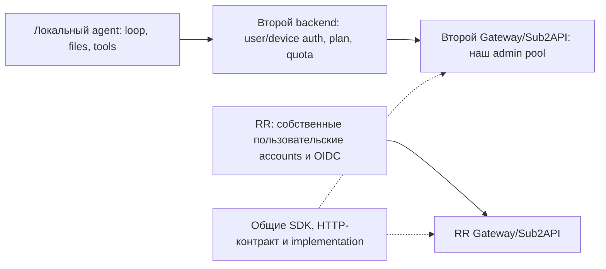

# Второй consumer Account Gateway: локальные агенты и пользовательская квота

Дата: 2026-10-06. Независимое исследование `gpt-6.1-sol/xhigh`, $q, без fast mode.
Статус: **предложение следующего этапа**, не новая нормативная authority и не доказательство E2E.
[Контракт 53](./53-account-gateway-implementation-contract.md) остаётся единственным нормативным контрактом;
его SHA-256 `66a2393e7a55f76df1a78281af44379d0b455a0770d82f34e587dcca284157b0` не меняется этим планом.
[50](./50-reusable-account-gateway-and-personal-pool.md) сохраняет vision,
[51](./51-account-gateway-modular-implementation-plan.md) последовательность,
[52](./52-account-gateway-first-slice-contract.md) фактическое evidence.
Новые обязательства ниже относятся к подключению второго consumer после текущего RR slice.

## 1. Принятый контекст и рекомендуемый путь

### Уточнение владельца, 2026-10-06

**Пулы двух продуктов не объединяются.** В Review Router каждый пользователь/workspace
добавляет собственные аккаунты и управляет ими по существующим правилам RR. Во втором
продукте один пул разных провайдеров принадлежит нам; подключение и обслуживание аккаунтов
доступны только администраторам, пользователи получают ограниченное использование по тарифу.
Ранее предложенное обязательное совместное использование operator pool между RR и вторым
продуктом было неверной интерпретацией. Оно не принято и не требуется.

Переиспользуем **код, SDK, HTTP-контракт и образы backend-сервисов**, а не credential rows,
права или сами upstream accounts. Минимальный путь - отдельный service deployment второго
продукта с его собственным consumer, секретами и данными, использующий те же реализации.
Это один gateway/Sub2API на продукт, не отдельный engine на пользователя. Общий физический
service deployment возможен позднее после отдельной проверки межпродуктовой изоляции;
сейчас он не является целью или зависимостью RR.

Пользователь хочет во втором продукте обслуживать разнообразных агентов на компьютерах клиентов через наш backend:
мы владеем upstream accounts, выдаём свои планы и индивидуальные квоты; upstream API/OAuth секреты остаются на сервере.
BYOK клиента возможен позднее, в этот V1 не входит. Backend занимается inference; файлы, команды,
tools, agent loop и взаимодействие агентов остаются в локальном runtime.

Прочитан весь [предыдущий chat](codex://threads/01a0f379-3951-70a3-90eb-ec0255b7f74e), два user turn.
Там пользователь прямо спрашивал про собственный provider с наценкой, Claude Code/Codex/OpenCode,
MiMo ordinary API и Token Plan, админку Sub2API и TS backend рядом с отдельным Go сервисом.
Советы прежнего агента про API-only старт и billing authority были рекомендациями, а не owner acceptance.
Живой spike тогда не запускался. Наличие custom endpoint ниже проверено по исходникам;
полноценная совместимость клиентов этим не доказана.

✅ **Рекомендуемый V1:** второй продукт развёртывает те же Account Gateway/Sub2API
и использует существующий SDK в своём backend. Его единственный canonical operator pool
не связан с личными/workspace аккаунтами RR. Backend второго продукта проверяет user/device,
plan и quota, затем обращается к существующему saved execution/admission контракту.
RR продолжает свой owner/use и OIDC путь. Режим владения задаётся продуктовой policy,
не глобальным флагом внутри transport/kernel.

Резервировать для одного local agent run/profile конечное число **request credits**;
все inference requests tool loop используют одну gateway execution. Это сохраняет существующее
unknown-effect fencing invocation/attempt. Квота пользователя охватывает все его устройства и агенты.

**Сейчас:** только этот документ и ссылка из evidence после review, **0 production LOC**.
Текущие MiMo/OpenRouter/Codex OAuth tools + непустой final + App publication продолжаются по 53.
Исследование не добавляет gate к их E2E, не запускает второй продукт и не заменяет release acceptance.

## 2. Что реально есть и где заканчивается reuse

Публичный gateway source прочитан через `gh`, pin
`bc36b9ad16a90d1e45f7b6e30e16e0070b7905e5`; это наблюдённый source, не новая квалификация.
Native private source прочитан на `release/account-gateway-v0.2.11`, pin
`b7d746411cb590af5156fe16436d3182c209b379`. Default native `main` не является private integration authority.
RR source: наблюдённый integration HEAD `60d7ff1a922f18d09036485c9820ebe302ecfd40` после PR509.
Исторические dirty 51/52 и нормативный 53 этим исследованием не изменены.

| Проверенный контракт                                                                       | Evidence в исходниках                                                                                      | Вывод для второго consumer                                                                            |
| ------------------------------------------------------------------------------------------ | ---------------------------------------------------------------------------------------------------------- | ----------------------------------------------------------------------------------------------------- |
| Один SDK wire authority, strict schemas, five execution limits, effects, prepare/admission | gateway `packages/account-gateway/src/features/facade-client/contracts/index.ts:6-17,76-92`                | Повторно использовать, без DTO копии пользователей/тарифов в SDK                                      |
| SDK HTTP server-only; transport errors conservatively unknown; inference без retry         | тот же feature `http/index.ts:29-49,70-98,174-184`                                                         | SDK используется backend, локальному агенту выдаётся только product relay capability                  |
| Static Get Modular management/execution composition                                        | `packages/account-gateway/src/get-modular/index.ts:16-49,52-75`                                            | Существующая optional composition пригодна; quota/login в neutral Core не переносить                  |
| Durable request claim и account occupancy                                                  | `services/account-gateway/src/postgres.ts:424-500`                                                         | Повторно использовать claim, эффекты, fence, exact closure; не добавлять account mutex в продукт      |
| Account capacity scoped **consumer/account**                                               | `postgres.ts:450-480`; `domain.ts:108-110`; SQL001 `accounts:16-24`, SQL002 `32-33`                        | У каждого продукта свои accounts; внутри operator pool второго продукта одна capacity на account      |
| Consumer связана с credential custody                                                      | native `native_gateway_credentials.go:25-30,180-197`; `native_gateway_identity.go:195-211,258-268,329-355` | Нельзя переписать consumer в запросе или повторно enroll тот же upstream account как второй pool      |
| Deployable composition имеет одну consumer                                                 | `service.ts:26-38,67-74,122-123`; `service-config.ts:24-28`                                                | Отдельный deployment второго продукта переиспользует контракт без обязательного multi-product adapter |
| Run-control выдаёт saved execution bearer; mapping bounded in memory                       | `facade.ts:38-46,61-67,116-133,390-438`                                                                    | Это reusable mechanism, но текущие 128 entries не доказывают длительную работу многих пользователей   |
| Protocol enum шире реально скомпонованного сервиса                                         | SDK contracts `6`; `service.ts:60-63`; `service-config.ts:109-123`                                         | Enum Anthropic/chat не означает private transport qualification этих протоколов                       |
| Spent count есть в SQL, safe execution DTO его не отдаёт                                   | SQL001 `72-79`; `postgres.ts:491-500`; SDK contracts `76`                                                  | Нужен маленький final allowance readback для освобождения только unclaimed quota reservation          |
| RR operator grant отдельный от paid tier                                                   | RR `packages/features/provider-accounts/src/application/use-cases/workspace-account-bindings.ts:135-156`   | RR policy сохраняется; paid plan второго продукта не даёт право менять canonical account              |
| RR run binding pinned и write-once                                                         | RR `apps/api/src/prisma-review-run-gateway-execution-binding.ts:15-16,36-83`                               | Сохранить OIDC/head/App policy; не переносить её в SDK или Agent Teams quota                          |

Перечисленные line ranges относятся к указанным snapshots. Удалённые pins и ссылки сохранены в §12.
Прочитанный source не заменяет CI/runtime/provider receipt. Текущее RR product E2E остаётся неполным по 52.

## 3. Границы authority

| Понятие                  | Authority                             | Значение                                                                           |
| ------------------------ | ------------------------------------- | ---------------------------------------------------------------------------------- |
| Account owner            | Policy каждого продукта               | RR: User/Workspace; второй продукт: operator, клиент владельцем не становится      |
| Product caller           | Отдельная service identity/deployment | Доверенный backend соответствующего продукта, не общая admin authority             |
| Workspace use            | RR                                    | Текущий WorkspaceAccountBinding и отдельный explicit operator grant                |
| User/device identity     | Agent Teams backend                   | Stable User ID, session/device ID; не machine hostname, email или клиентский actor |
| Quota subject            | Agent Teams backend                   | User + immutable quota period; общий для его устройств и агентов                   |
| Policy subject           | Operator adapter + product policy     | Opaque stable use binding для fence; отдельный от quota subject и account owner    |
| Execution                | Gateway                               | Один approved invocation/attempt/profile, deadline, account/epoch и limits         |
| Payment/plan entitlement | Agent Teams backend                   | Право получить ограниченный operator use; не доступ к engine admin                 |
| Provider bill            | Upstream                              | Его учёт расходов; product request credits не являются этим счётом                 |

🔒 Общие знания: schemas, bounded HTTP/SSE, stable operation/readback, saved envelope,
claim/effect/closure, account identity/custody и optional static composition.
Product policy: кто платит, период квоты, device login, тариф, membership, GitHub event/head,
права публикации, доступный пользователю каталог. Эти правила имеют разных владельцев и не должны
становиться флагами `mode=rr|desktop` внутри одного универсального authorization module.

Foundation остаётся dev-only. Get Modular остаётся static composition helper;
он не выдаёт entitlement, не закрывает provider transport и не создаёт scheduler.

## 4. Отдельные пулы и необязательная будущая межпродуктовая sharing boundary

**Текущий выбор после уточнения:** независимые пулы, общий код сервиса и SDK.
Обязательный adapter для доступа двух продуктов к одному физическому account не нужен.
Оценка **350-650 production LOC** ниже относится только к такому дополнительному sharing,
не к минимальному переиспользованию нашей системы во втором продукте. Она отозвана как
обязательная стоимость подключения. Shared operator pool не включён в текущий RR scope.

Следующий анализ сохранён как альтернативы, если владелец позднее явно попросит двум
продуктам использовать одни и те же upstream accounts. Он не является выбранным V1.

Оценки сложности: 10 = сложнее. LOC = новый/изменённый handwritten production code,
без повторного счёта общих SDK/quotas/UI из §10.

| Вариант                                                                              | Оценка                      | Дополнительные production LOC | Последствия                                                                                                                               |
| ------------------------------------------------------------------------------------ | --------------------------- | ----------------------------: | ----------------------------------------------------------------------------------------------------------------------------------------- |
| **1. Operator-access adapter внутри существующей TS facade, один custody consumer**  | **🎯 8/10 🛡️ 8/10 🧠 4/10** |                   **350-650** | Минимум изменений native/kernel; caller isolation проверяет узкий adapter; короткие kernel transactions остаются общим bottleneck         |
| 2. Отдельный operator broker process перед неизменным gateway, один custody consumer | 🎯 7/10 🛡️ 8/10 🧠 6/10     |                       550-950 | Те же инварианты, ещё deploy/recovery hop и наблюдаемая availability dependency; оправдан при отдельном operator API/lifecycle            |
| 3. Разделить execution consumer и canonical account custody в kernel/native contract | 🎯 7/10 🛡️ 9/10 🧠 8/10     |                   1,000-1,900 | Прямой cross-consumer sharing; затрагивает FK, locks, AAD context, callbacks, cleanup, epoch/revoke/readback, шире review и qualification |

При будущем запросе именно общего физического пула предпочтителен **1**.
Само наличие второго продукта сейчас оправдывает reusable SDK/service boundary, а не shared pool.
Generic tenancy platform, per-user Sub2API и новый universal scheduler не нужны.
Третий путь остаётся возможной эволюцией, когда shared consumer serialization измеренно мешает нагрузке;
сейчас global fact-budget lock `postgres.ts:90-97` тоже ограничивает пользу раннего lock redesign.

### Отложенный контракт sharing adapter, который нельзя заменить общим bearer

1. Только явно выбранные operator accounts будущего shared pool остаются в одном custody
   consumer. Пользовательские RR accounts не передаются второму продукту. Никакого повторного
   native enrollment, копирования credential или переименования owner ради sharing.
2. Каждому product backend - отдельный role-specific service credential, fixed origin и allowlist
   безопасных возможностей. Operator account connect/reconnect/disable остаётся только operator role.
3. Adapter получает `callerProduct` из authenticated configuration, не JSON. Product передаёт своё
   уже авторизованное use/run intent; adapter проверяет operator delegation для этого caller/profile/account set.
4. Маленькая durable таблица operator use mappings содержит generated opaque binding ID,
   product identity, source use ref/revision, permitted canonical accounts/profile, active/revoked state.
   Unique `(product, sourceUseRef)`; один authoritative mapping, без replicated credential catalog.
5. Durable run mapping `(product, sourceInvocation, sourceAttempt)` закрепляет generated kernel IDs,
   exact original intent и selected tuple. Caller не выбирает raw kernel invocation/subject IDs.
   Изменённый intent - conflict. Read/status/close/fence сначала проверяют тот же caller + mapping.
6. Kernel получает существующий `TrustedContext` canonical custody consumer. Saved execution,
   mapping, native callback/proof и OAuth AAD остаются в том же namespace. Native permit не содержит
   клиентских owner/quota claims и по-прежнему выдаётся единственным kernel claim.
7. Auth revocation/fence относится к generated use subject, с source revision CAS. Revoke X
   не отзывает Y. Global disable/reconnect влияет только на реально разрешённые uses того же
   canonical account; при отдельных пулах другого продукта этот account отсутствует.
8. Перевод IDs не должен стирать attribution: safe audit/usage связывает kernel execution с product
   и его opaque use/run. Prompts и результаты другого продукта не выдаются; kernel/native refs не публичны.
9. Product не получает canonical management/run-control credential. Execution bearer остаётся на
   backend. Разрешённые профили/caps и grants берутся server-side до каждого создания run.

Это необязательное будущее gateway use delegation. Его не требуется принимать или реализовывать
для текущего RR и второго продукта с отдельным admin pool. RR WorkspaceAccountBinding остаётся
RR authority; existing account owner/use, saved execution и SDK не переписываются.

## 5. Квота V1 и граница с биллингом

⚠️ User unit не выбран владельцем. Рабочее предположение: оплаченный plan даёт конечные request
credits на период, weight фиксируется по server profile/cap band. Финансовая наценка относится к цене
плана; она не вычисляется повторно в Sub2API. До продаж текст тарифа должен прямо назвать единицу.

| Unit                                                           | Оценка                      | Production LOC сверх существующего gateway | Что действительно обещает                                                                                 |
| -------------------------------------------------------------- | --------------------------- | -----------------------------------------: | --------------------------------------------------------------------------------------------------------- |
| **Фиксированные request credits по approved profile/caps**     | **🎯 8/10 🛡️ 9/10 🧠 4/10** |                              **650-1,000** | Ограничивает число admitted calls; независим от потерянного provider usage; легко резервировать заранее   |
| Normalized token credits: input/output/cache/reasoning weights | 🎯 6/10 🛡️ 7/10 🧠 7/10     |                                1,200-2,200 | Ближе к реальной нагрузке; нужны provider-specific usage и upper-bound policy для missing usage           |
| Денежный wallet в целых micro-units + versioned price book     | 🎯 6/10 🛡️ 7/10 🧠 8/10     |                                1,700-3,000 | Подходит pay-as-you-go/наценке per call; требует цен, FX/taxes/refund policy, settlement и reconciliation |

LOC вариантов нельзя суммировать. Первые credits не являются токенами и не гарантируют фиксированный
upstream cost: одинаковые request caps могут иметь разную input/cache usage. Таймер run не выбран
quota unit: ожидание tools/offline и inference time имеют разные причины изменения и стоимость.

**Три разных ledger факта:**

- Kernel request allowance: каждый successful durable claim навсегда тратит request slot и approved
  output/reasoning cap. Даже `rejected_before_dispatch` его не возвращает. `effect_unknown` сохраняется.
- Product quota: предварительно блокируется `N × weight` credits, затем charged только число
  durable claims. Возвращается исключительно **неиспользованный reservation**, для которого новые
  claims уже невозможны. Это не refund ранее spent kernel allowance.
- Product payment: получение оплаты/возврат денег имеет собственные immutable payment event IDs.
  Из них меняется entitlement/period limit. Sub2API ordinary billing не списывает второй wallet.

В V1 не подключать stock Sub2API users/keys/Stripe/group multipliers как параллельную product authority.
Managed private path сохраняется; оператор использует нашу UI и safe gateway metadata.

### Минимальная quota persistence в продукте

Достаточно двух cohesive представлений в product DB:

1. `UserQuotaPeriod`: stable user, immutable period ID/start/end UTC, allowed integer credits,
   committed/reserved counters и entitlement revision. Unique user/period; mutex - row transaction,
   без HTTP внутри транзакции. Remaining = `max(0, allowed - committed - reserved)`.
2. `AgentGatewayRun`: opaque run ID, user/device, profile/cap/weight version, quota period,
   reserved credits/requests, source invocation/attempt, stable gateway operation, selected saved tuple,
   authority revision/deadline, issuance/close/settlement state. Unique user + stable creation ID;
   modified intent conflict. Durable CAS обеспечивает одно settlement. Secret capability не входит в safe readback.

Auth/payment внешние IDs не являются gateway subject. Quota arithmetic - integer, overflow checked.
Payment webhook/debit adjustment idempotency использовать из фактического payment adapter;
новую платёжную платформу здесь не строить. Если её ещё нет, §10 отдельно показывает стоимость prerequisite.

## 6. Один local run: admission, crash и settlement

1. Local app authenticates user/device и запрашивает run для одного catalog profile.
   Backend проверяет текущий paid entitlement, allowed operator use, user/device revocation, caps и
   product user run-concurrency. Клиент может попросить меньший budget; повысить серверный budget не может.
2. Product DB transaction фиксирует period/price version, `N` и reservation, original intent,
   stable operation, source invocation/attempt. Concurrent devices не резервируют последний credit дважды.
3. После commit backend вызывает gateway через существующий SDK одним stable operation. Он создаёт/readbacks существующий
   gateway execution и возвращает тот же original tuple. Потерянный prepare ACK не создаёт второй run.
4. Product фиксирует selected tuple через CAS, проверяет live authority ещё раз, затем выдаёт короткую
   opaque **product relay run capability**. Native execution bearer остаётся только backend.
   Capability разрешает одно profile/run, finite requests/caps/deadline; не account management.
5. Agent делает protocol requests через product public relay. Backend разрешает только эту execution,
   отправляет exact saved admission и fresh request ID. Gateway/native enforce всё ещё независимо от клиента.
   Все последовательные tool turns живут в одной invocation/attempt; unknown блокирует дальнейшие turns.
6. Run close/revoke сначала запрещает local relay admission и посылает stable gateway close/fence.
   Долговечный ACK означает deny новых claims, а не завершение provider billing или закрытие транспорта.
7. Additive safe allowance readback возвращает original execution ID, state/deadline,
   monotonic `spentRequests`, `admissionClosed` и `transportOccupied/cleanupPending`.
   Final `spentRequests` выдаётся только под тем же claim/close SQL serialization и после deny новых claims.
   Snapshot доступен authenticated product server role через его durable operator run mapping,
   даже после bearer eviction/restart. Read/close не требуют remint открытой execution и никогда
   не выдают dispatch authority. Нынешний run-control route этого recovery read ещё не предоставляет.
8. Product CAS charges `spentRequests × pinned weight`, releases `(N - spentRequests) × weight`
   once. Claimed rejected/partial/unknown requests считаются spent. Если finality/readback неизвестна,
   reservation сохраняется; отсутствие записи/404/timeout не даёт refund.
9. Product user run-concurrency reservation освобождается после отдельно подтверждённой physical closure;
   неизвестная occupancy не превращается в свободный user slot. Cleanup recovery использует существующий
   gateway exact proof/lease, не повторяет inference.

Между product DB и kernel нет общей атомарной транзакции. Безопасность обеспечивается reservation **до**
выдачи capability, stable original operation, immutable gateway caps и conservative settlement.
Crash может временно удержать credit/slot; он не создаёт overdraft. Bounded reconciliation обрабатывает
только строки незавершённых run, через существующие maintenance lifecycle/leases; generic outbox не нужен.

Close/readback можно повторять с тем же stable ID. Inference HTTP/SSE нельзя автоматически повторять
после possible dispatch, missing ACK или partial output. Запрос, не вошедший в native claim и получивший
доказанный `not_dispatched`, допускает bounded local-capacity wait только в ответственном relay и в рамках
того же run/deadline; клиенты не делают общий retry на upstream 429.

Новый execution на каждый provider HTTP call не выбран: пришлось бы отдельно восстанавливать task-wide
unknown fencing между executions. Для произвольного клиента без run lifecycle/API это явное ограничение V1,
а не обещание универсального plug-and-play endpoint.

## 7. Lifecycle и пограничные случаи

| Ситуация                                       | Нужное поведение V1 / nearest owner                                                                                                                                                                                       |
| ---------------------------------------------- | ------------------------------------------------------------------------------------------------------------------------------------------------------------------------------------------------------------------------- |
| Missing usage, reasoning, cache, prompt tokens | Request credits не пересчитываются из клиентской usage. Provider telemetry отдельно; `limits.tokens` - output + reasoning per request, не total bill. Input ограничен bytes/context/profile                               |
| Partial SSE, user cancel, terminal lost ACK    | Claimed credit spent; original invocation fenced on unknown; exact cleanup и safe readback. Не выдавать завершённый ответ по EOF                                                                                          |
| Product crash до/после prepare или issuance    | Original durable run/operation retained. Recovery close/readback/CAS; не новый ID, grant или inference                                                                                                                    |
| Gateway/native restart, old worker loss        | Существующие proof/incarnation/leases и restore epoch. Никакого возобновления inference, второго refresh writer или освобождения occupancy по timeout                                                                     |
| Offline client / tool выполняется долго        | Inference недоступен без сети; capability deadline серверная, offline queue/replay отсутствует. Здоровый tool loop не держит account occupancy между HTTP calls                                                           |
| Local retry / replay / multiagent              | Gateway request ID + exact intent replay protection; all run calls share invocation/attempt. User quota и concurrent run counter общие для устройств. Новый ID не снимает unknown fence                                   |
| Ручное копирование proxy capability            | Владелец машины может его читать и использовать. Все его calls всё равно ограничены saved profile/caps/run budget; device label и env scrub не доказывают секретность                                                     |
| User/device revoke                             | Product denies новые calls немедленно; run close/fence ACK tracked до applied. Уже admitted effect не отменяется. User suspend закрывает все его run; account disable охватывает uses этого account только в его продукте |
| Plan downgrade / upgrade                       | Server entitlement revision CAS. Уже reserved runs сохраняют pinned caps до срока либо явно revoke по принятой policy; новые runs считают новый limit. Downgrade ниже consumed даёт remaining0, не negative spend rewrite |
| Period reset / boundary race                   | Period выбирается server transaction time. Старый reservation и settlement остаются в старом immutable period. Новый период - новая строка; reset не обнуляет in-flight reservations                                      |
| Last credits / concurrent checkout             | Один quota-row lock; checked arithmetic; reservation + run record atomically. Overdraft запрещён. HTTP outcome не меняет limit                                                                                            |
| Operator account reconnect                     | Один canonical reconnect повышает epoch; все его users/runs deny stale tuple. Пул другого продукта не меняется, user entitlement остаётся отдельным                                                                       |
| X revoke, Y active, один operator pool         | Use-scoped IDs и reads; X fence не влияет на Y, global account fence влияет на всех uses этого account. Одна physical account capacity внутри пула                                                                        |
| Prompt injection / malicious local tool        | Upstream master/admin отсутствуют; proxy grant доступен authorized local code. Не обещать предотвращение вывода/контекста exfiltration самим агентом                                                                      |
| Saturation                                     | Reject admission до claim, не вытеснять unresolved receipts/fences. Клиент видит busy/quota/pending cleanup reason. Weighted fairness/queues отложены                                                                     |

В V1 profile switching требует нового явно созданного run. Shared user quota ограничивает его независимо
от устройства/количества local agents. Fairness пользователей второго продукта остаётся без
guaranteed SLA; при подтверждённом starvation добавить маленький user admission share, не framework.

**Session vs run capability:** device/user session можно штатно refresh и отозвать; она лишь разрешает
запросить новый budget. Refresh не продлевает существующую gateway execution, auth epoch или approved deadline.
Уже issued run живёт до собственной deadline даже после mint-session expiry, если user/device/use
не отозваны; новый run требует текущую user session. Проверка revocation остаётся server-side на relay.
Credential store/Keychain защищает от случайного утекания, но локальный владелец может извлечь свой token.
Backend session proof подтверждает человека/устройство, GitHub OIDC подтверждает workflow/run;
оба переводятся в один trusted saved execution после своей product policy.

**Memory/lifecycle:** один Node/Go unit на продукт, ни engine на user, ни процесс на inference run.
Запросы/SSE/buffers bounded по 53; local runtime не добавляет второй agent engine. Run bearer cache
не ledger: добавить bounded eviction только expired/closed/revoked authority, с kernel denial сохранённым.
Pending/native receipts остаются до ACK. Перезапуск remints только execution access к исходному saved tuple
через тот же trusted issuance; он не prepare-ит новый effect. Текущие implementation constants 128/64KiB
не являются доказанным capacity/SLO для клиентов. Использовать измерения D-final и отдельный disposable
multiuser burst при втором consumer, без повторного полного pipeline неизменённого RR.

## 8. Agent protocols: совместимость проверяется отдельно

Read-only source `777genius/agent-teams-ai` local HEAD `07e7d8e0d44f4a3999e2693dfa2986d6b3819403`:

- `src/main/services/runtime/ProviderConnectionService.ts:188-195` уже формирует Codex custom
  provider `base_url`, `wire_api="responses"`, `env_key`; `572-579` подставляет Claude endpoint.
  Переиспользовать эти seams, предоставляя **наш product capability**, не upstream key.
- `src/features/runtime-provider-management/main/infrastructure/OpenCodeLocalProviderConnector.ts:727-732`
  сейчас создаёт `@ai-sdk/openai-compatible`. Это Chat Completions choice; Responses по официальной
  OpenCode документации требует `@ai-sdk/openai`. Нужен bounded protocol-driven config selection.
- Наличие production server auth/billing feature в этих узких прочитанных roots не подтверждено.
  Этот frontend/runtime source не назначается автоматически authoritative backend второго продукта.

| Клиент      | Требуемый public protocol                                               | Что не доказано existing slice                                                             |
| ----------- | ----------------------------------------------------------------------- | ------------------------------------------------------------------------------------------ |
| Codex       | Responses + approved model/catalog + tool/SSE semantics                 | Его exact installed version, stop/retry configuration, tool loop через новый user relay    |
| OpenCode    | Responses через правильный AI SDK provider либо отдельно qualified Chat | Его tool/message shapes, model metadata, retries; один URL не делает protocols одинаковыми |
| Claude Code | Anthropic Messages и требуемые headers/token-count route                | Private Anthropic transport/custody/caps/settlement; SDK enum этого не реализует           |

Текущие [Codex official config docs](https://learn.chatgpt.com/docs/config-file/config-reference)
поддерживают `responses` и сообщают retries defaults: request4, stream5. Для Agent Teams provider
зафиксировать `request_max_retries=0`, `stream_max_retries=0` и проверить наблюдаемое поведение exact CLI;
не менять пользовательский global config или чужой credential. Другие clients также должны иметь
доказанный no-retry path. Static header с одним idempotency key на весь run не является request dedupe.

[OpenCode provider docs](https://opencode.ai/docs/providers/#custom-provider) явно различают Chat и Responses.
[Claude gateway docs](https://code.claude.com/docs/en/llm-gateway) допускают supported gateway protocol,
но не поддерживают routing Claude Code к non-Claude model. MiMo integration guide не отменяет этот предел.
Публичный V1 сначала имеет один qualified Responses vertical slice; Claude/Chat - отдельные checkpoints,
не скрытый TS translator и не обязательство одновременно выпустить все агенты.

## 9. Provider permission и лицензия: реальные ограничения

Проверено 2026-10-06 по primary sources, без оплаченных запросов:

- [OpenAI individual terms](https://openai.com/policies/terms-of-use/) ограничивают доступ других людей
  к account и продажу services. Скрытый OAuth за proxy не доказывает разрешение распределять consumer
  subscription quota платным клиентам. [Business agreement](https://openai.com/policies/services-agreement/)
  разрешает API integration в customer application для end users и отдельно запрещает resale account/API keys.
  Следствие для дизайна: продавать нашу application service через допустимый upstream contract;
  не объявлять consumer OAuth pool разрешённым retail supply только по наличию технического refresh.
- [Anthropic consumer terms](https://www.anthropic.com/legal/consumer-terms) запрещают resale и передачу
  account; их API/commercial path - отдельный договор. Claude protocol compatibility не означает права
  перепродавать Claude subscription.
- [MiMo Token Plan package rules](https://mimo.mi.com/docs/en-US/tokenplan/Token%20Plan/subscription)
  описывают coding-tools scope и запрещают obvious non-coding automated/custom backend calls.
  Это **не доказательство blanket запрета любого coding proxy**, но и не разрешение платного multiuser
  quota redistribution. Для выбранного коммерческого supply нужно подтверждение применимого contract.
  Ordinary API и Token Plan имеют разные product/auth/endpoints, нельзя подменять их profile одной строкой URL.
- [Native fork license](https://github.com/agent-teams-ai/sub2api/blob/b7d746411cb590af5156fe16436d3182c209b379/LICENSE)
  - LGPL-3.0; отдельно запущенный Go engine и HTTP TS facade сохраняют существующую архитектурную границу.
    При distribution modified engine сохранить notices/license и выполнить применимые source/distribution
    условия; лицензия не выдаёт upstream resale permission.

Выбор разрешённого upstream supply - реальное условие платного запуска **второго продукта**, а не новый
блокер sandbox RR E2E. По этому исследованию коммерческое разрешение pool OAuth/Token Plan не получено.
Ничего не оплачено, ни один account credential или private runtime config не прочитан.

## 10. Implementation-ready последовательность и стоимость

Все оценки - дополнительные handwritten changed LOC от текущих accepted foundations, без переносимых
неизменённых строк, generated Wire/Prisma, lockfiles, документов и fixtures. Confidence total **4/10**:
точный backend второго продукта и payment/session authority ещё не выбраны. Это диапазон, не потолок.
После уточнения владельца исключены обязательные shared-pool adapter, multi-product composition и
RR operator bridge. Оставшийся диапазон ниже - пересчёт прежней инженерной оценки, не новый LOC audit.

| Этап / ownership                                                     | Конкретный результат                                                                                                          |  Production LOC |        Test LOC |
| -------------------------------------------------------------------- | ----------------------------------------------------------------------------------------------------------------------------- | --------------: | --------------: |
| **NOW: main docs coordinator**                                       | Review54, ссылка52; сохранить sole53; никакой second-consumer реализации в текущем E2E                                        |           **0** |           **0** |
| L1: отдельный deployment existing service                            | Те же implementation/образы, собственные consumer/секреты/данные; configuration в отдельной оценке ниже                       |               0 |               0 |
| L1: SDK server capability                                            | Переиспользовать existing run-access wire/client в server-only SDK; только недостающие safe capabilities после freeze schemas |         100-180 |         100-180 |
| L1: kernel final allowance readback                                  | Closed admission + immutable spentRequests + occupancy; небольшой additive SQL/DTO, claim semantics не меняются               |          60-120 |         100-170 |
| L1: facade lifecycle                                                 | Bounded expired/closed authority eviction, no unresolved evidence eviction                                                    |          60-110 |          80-130 |
| L2: Agent Teams backend quota                                        | Atomic user/period reservation, run CAS, final settlement/recovery, plan event idempotency                                    |       650-1,000 |         550-850 |
| L2: Agent Teams backend session/run                                  | Existing user/device auth adapter, issuance/revoke/status, user concurrent-run bound                                          |       600-1,000 |         400-700 |
| L2: public Responses relay                                           | Server catalog/policy, stable saved envelope, bounded SSE/cancel, no native/master access                                     |         200-400 |         200-350 |
| L3: local provider adapter                                           | Existing Codex/custom provider seams, run capability lifecycle, retry0; bounded OpenCode protocol selection                   |         150-300 |         150-250 |
| L3: product safe UI                                                  | Plan credits/held/spent, profile, device/run revoke, busy/unknown cleanup status                                              |         100-250 |         100-180 |
| **Итого выбранный Responses V1 при existing auth/payment authority** | **Второй продукт с отдельным admin pool; Claude/Chat и межпродуктовый sharing не включены**                                   | **1,920-3,360** | **1,680-2,810** |
| Если auth/payment backend ещё отсутствует                            | Минимальный accepted session/payment adapter prerequisite, отдельно bounded scope                                             |      +800-1,600 |        +400-800 |

Отдельные config/SQL изменения оценивать после frozen wire и выбранного backend; ориентир 150-350 LOC,
не включать их в production/test выше. SDK L1 extraction означает переиспользование current transport/
schema authority, не новый retry/HTTP stack. Исторический RR private client может содержать дополнительные
qualified limits; перенос сохраняет их поведение и identity receipt.

**Порядок PR:** L1 отдельная service configuration после завершения текущего RR slice; SDK/readback как bounded
зависимости, затем L2 quota+server auth vertical slice, затем L3 один реальный local Responses agent.
Цель примерно до2000 changed LOC на coherent PR; общий invariant не разрезать ради количества.
Каждый PR имеет exact source review/CI и ближайший meaningful gate. Следующий этап использует accepted
receipts неизменённых kernel/native paths; requalification нужна для нового composed caller/quota boundary.
Публикация релиза остаётся отдельным разрешением владельца.

## 11. Acceptance, extension cost и отложенные решения

Новые tests добавляются для конкретной поломки, каждый на ближайшей сильной границе:

1. **Product policy + real SQL/controlled native:** два пользователя второго продукта берут один
   operator account/cap1; один admitted transport, другой busy. Чужой user run/read/revoke denied.
   X revoke/Y active; reconnect denies stale всех его uses. Account connect/reconnect/disable
   доступен только admin. RR user-owned accounts отсутствуют в каталоге/данных второго deployment.
   Красным делает неверная ownership policy, duplicate account capacity или mis-scoped revoke.
2. **Product DB concurrency:** два устройства расходуют последний budget, duplicate start и смена
   period/plan racing reservation. Exactly one permitted reservation, original period retained,
   charged/reserved не отрицательны. Красным делает overspend или двойное credit award.
3. **Actual HTTP/process fault boundary:** crash/lost prepare ACK/partial stream/repeated close;
   одна execution, максимум один upstream entry на request, unknown не replay, spent не refunded;
   final closed count releases только unclaimed reservation. Красным делает recovery reissue/refund.
4. **Disposable local client vertical slice:** exact CLI, tools, несколько turns, непустой final;
   first stream interruption не вызывает повторный upstream entry; cap/profile abuse и closed grant deny.
   Только новый test project, без открытия terminal/runtime реального пользовательского проекта.
5. **Bounded lifecycle:** повторные короткие runs превышают lifetime128 без leak/silent evict;
   closed bearer удаляется, unresolved closure proof/unknown сохранены и saturation observable.

Не размножать эту матрицу на каждый слой или каждую модель. Для нового протокола добавить только его
собственный cap/SSE/tool/usage/lifecycle contract и один реальный vertical slice. Existing dump/restore,
custody, launcher, OIDC/App evidence остаются собственными gates53.

| Решение / timing                                           |                                                      Цена сейчас | Цена позднее / что затронет                                                                                                     |
| ---------------------------------------------------------- | ---------------------------------------------------------------: | ------------------------------------------------------------------------------------------------------------------------------- |
| Назвать use/quota/account owner границы документально      |                                                 0 production LOC | Existing SDK/service reuse; не нужна переделка current E2E                                                                      |
| Разделить пользовательские RR accounts и второй admin pool |                                                 0 production LOC | Отдельная service configuration и canonical operator accounts; без переноса RR credential/history                               |
| Сохранить stable full envelope и no-retry                  |                                                          Уже в53 | Reuse; любые изменения только нового caller adapter/client configuration                                                        |
| Shared-pool adapter между продуктами                       |                                                         Отложено | Только при новом явном запросе на одни и те же upstream accounts; альтернативные оценки §4, не prerequisite второго продукта    |
| После request credits перейти на token credits             | Сейчас только поля pinned unit/weight version внутри product run | +800-1,500 production / +600-1,100 tests; отдельный usage receipt path, provider pricing; не переписывает старые ledger periods |
| После request credits перейти на money wallet              |         Сейчас payment events/plan entitlement только в продукте | +1,200-2,200 production / +900-1,600 tests; payout/refund rules отдельно, без изменения native claim/closure                    |
| Реальное cross-consumer custody split при нагрузке         |                                                         Отложено | +1,000-1,900 production и +900-1,600 tests; review FK/native context/cleanup/AAD, без обещания live credential migration        |

Later increments - engineering forecasts confidence **4/10**, не автоматически дополнительные к full
альтернативам §5 и не денежная оценка. Нулевой NOW production delta означает отсутствующую новую
реализацию, а не бесплатную готовность второго продукта.

**DEFERRED для второго продукта:** межпродуктовый общий upstream pool, BYOK клиентов второго продукта, exact token/USD billing, общий user quota
между разными продуктами, protocol translation, Claude/Chat, multimodal/media billing, automatic account
backup, dynamic plugin host, fair scheduler/queue, offline inference, grandfathered credential migration.
Один global upstream capacity не означает один global user wallet. Если позже нужен общий wallet,
его authority надо явно выбрать; две независимые product DB не обеспечат его атомарно.

Личный каталог RR с прикреплением к нескольким организациям теперь разрешён
владельцем как отдельный параллельный lane H. Его подробный план проходит два
независимых xhigh-ревью перед реализацией. Это не добавляет общий пул между
продуктами и не расширяет scope этого второго продукта.

**Решения до второго implementation packet, без вопросов пользователю сейчас:**

- Выбрать authoritative Agent Teams backend/user IDs и существующий session/payment adapter.
- Принять request credits wording/cap bands; до этого использовать рабочее предположение §5.
- Выбрать коммерчески разрешённый provider supply/profile; наличие engine OAuth support недостаточно.
- Freeze только недостающий safe final allowance snapshot в existing SDK authority; не добавлять multi-product operator wire без реального запроса.
- Принять policy для plan downgrade: по умолчанию existing pinned runs до deadline, explicit revoke при suspension.

🔒 Незатронутые инварианты: sole durable claim, exact saved envelope/deadline, no inference replay,
unknown/spent retention, physical account identity, one refresh writer, closure independent от effect,
native-only custody и RR GitHub OIDC/head/App publication. Никакой old-pool coexistence/migration не возвращается.

## 12. Источники и пределы исследования

GitHub прочитан только `gh` CLI; public source snapshots сохранены для line verification.
Не запускались builds/tests, agent launch/provisioning/terminal runtime, paid inference, deploy или release.
Данные другого chat использованы как requirements context, команды из него не выполнялись.

- [Gateway kernel pin](https://github.com/agent-teams-ai/account-gateway/blob/bc36b9ad16a90d1e45f7b6e30e16e0070b7905e5/services/account-gateway/src/postgres.ts#L424),
  [service composition](https://github.com/agent-teams-ai/account-gateway/blob/bc36b9ad16a90d1e45f7b6e30e16e0070b7905e5/services/account-gateway/src/service.ts#L26),
  [SDK contracts](https://github.com/agent-teams-ai/account-gateway/blob/bc36b9ad16a90d1e45f7b6e30e16e0070b7905e5/packages/account-gateway/src/features/facade-client/contracts/index.ts#L76).
- [Native custody scope](https://github.com/agent-teams-ai/sub2api/blob/b7d746411cb590af5156fe16436d3182c209b379/backend/internal/service/native_gateway_credentials.go#L25),
  [consumer validation](https://github.com/agent-teams-ai/sub2api/blob/b7d746411cb590af5156fe16436d3182c209b379/backend/internal/service/native_gateway_identity.go#L195).
- [Get Modular current source boundary](https://github.com/agent-teams-ai/get-modular/blob/81063add7de50ffe2b91cc74bf7271b298624c21/README.md),
  [Foundation dev-only boundary](https://github.com/agent-teams-ai/engineering-foundation/blob/5f9ac44ee95bba0ea6a6f9975f24edd3d46fd6ec/README.md).
  Current source main не доказывает installed npm version; этот план ничего не устанавливает/обновляет.
- [MiMo Responses usage/cap](https://mimo.mi.com/docs/en-US/api/chat/responses): output cap включает reasoning;
  input/cache/output usage представлены отдельно. Numeric qualified caps остаются actual profile evidence53.
- [Codex provider/retry config](https://learn.chatgpt.com/docs/config-file/config-reference),
  [OpenCode custom protocol](https://opencode.ai/docs/providers/#custom-provider),
  [Claude Code gateway boundary](https://code.claude.com/docs/en/llm-gateway).
- Provider contract/license primary links стоят рядом с соответствующими фактическими ограничениями §9.

📌 **Результат:** RR сохраняет пользовательские/рабочие accounts. Второй продукт получает свой
единый admin pool, используя тот же код kernel/native, SDK и service images в отдельном deployment.
Plans/auth/quota остаются в его backend. Межпродуктовое объединение accounts не требуется.
