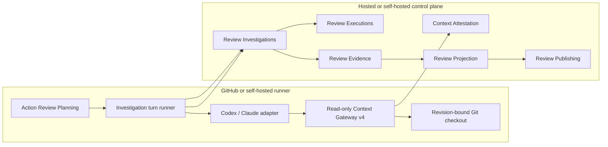
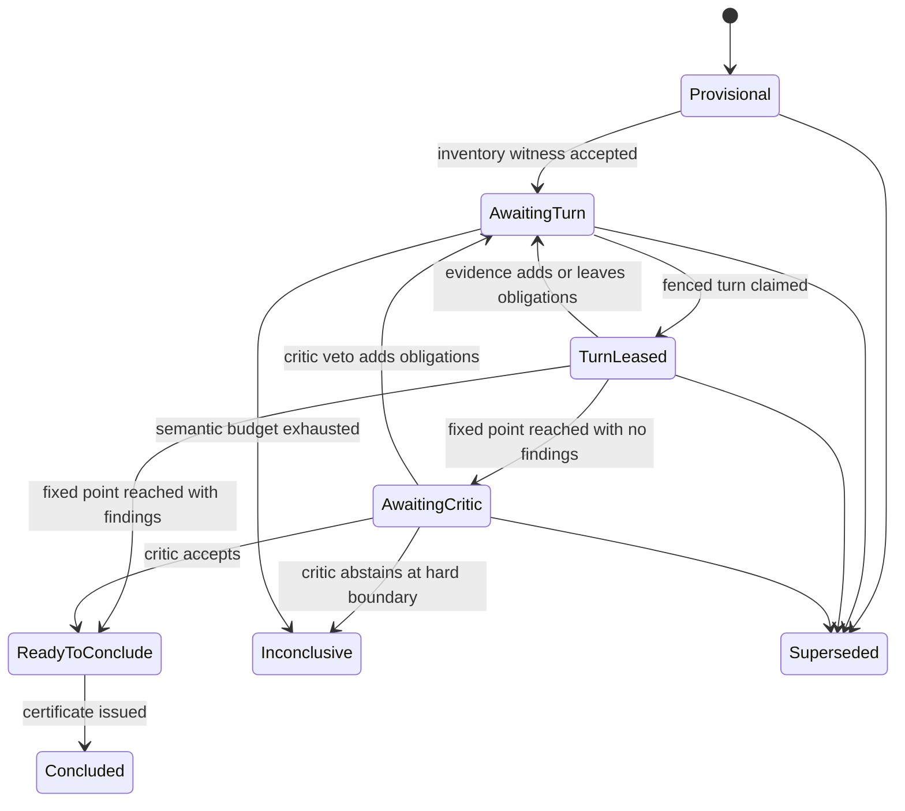

# Provider-neutral review investigation: end-to-end implementation plan

Status: implementation contract active. Local code and disposable quality gates
are tracked separately from live sandbox and production promotion evidence.
Production behavior must not be enabled by merging code alone. Current evidence
and remaining gates are tracked in
`review-investigation-implementation-status.md`.

## 1. Objective

Build a provider-neutral review investigation system that lets Codex, Claude
Code, and future review agents discover repository context through one trusted
protocol while ReviewRouter deterministically accounts for what context was
required, what evidence was inspected, and whether a clean conclusion is
actually justified.

The system must:

1. preserve the existing revision-aware execution, evidence reuse, projection,
   and publication safety model;
2. keep repository access on the runner through a read-only Context Gateway;
3. persist a provider-neutral investigation dossier instead of relying on a
   provider-native chat session;
4. continue an incomplete investigation in a fresh process without losing
   completed work;
5. prevent a model from deleting or satisfying its own coverage obligations;
6. publish `verified_clean` only after deterministic coverage reaches a fixed
   point and a context critic accepts it;
7. publish concrete findings even when unrelated context is exhausted, while
   keeping overall coverage explicitly inconclusive;
8. remain backward compatible with legacy Action and protocol v2 clients;
9. support hosted and self-hosted control planes with the same domain package;
10. never persist repository contents, credentials, cookies, raw auth payloads,
    unrestricted command output, or plaintext search queries.

The guarantee is relative to a versioned `CoverageContract`. ReviewRouter does
not claim that arbitrary hidden runtime behavior can be inferred from static
repository evidence. Unavailable external, dynamic, binary, or generated
context results in `inconclusive`, never a false clean conclusion.

## 2. Evidence already established

Executable spikes in the public Action worktree established the following:

- Codex and Claude Code can use the same strict MCP Context Gateway.
- A Codex-produced dossier can be continued by a new Claude process without a
  shared provider session.
- The same gateway supports cross-language discovery across TypeScript, Python,
  and Go.
- Obligation identity, deduplication, fixed-point expansion, revision binding,
  and clean-result guards can be deterministic.
- Canonical Git inventory can preserve rename, delete, symlink, gitlink, binary,
  LFS pointer, and generated-file facts.
- A single `hadFailure` flag is too coarse: a provider may make a recoverable
  rejected call and later complete valid reads. Failure events need typed policy.

The spike report and harness live under
`spikes/provider-neutral-review-investigation/` in the public Action repository.

## 3. Scope

### 3.1 Required scope

- New strict DDD package `@reviewrouter/features-review-investigations` in the
  SaaS/control-plane monorepo.
- Additive persistence and protocol changes.
- Context Gateway policy v4 with typed outcomes, complete pagination, canonical
  inventory witness, and authenticated operation receipts.
- Provider-neutral `ReviewAgentPort` in the public Action.
- Gateway-attested Codex and Claude Code adapters.
- Durable multi-turn dossier and deterministic obligation ledger.
- Context critic for clean conclusions.
- Investigation certificate accepted by Review Evidence through an
  anti-corruption port.
- Exact-revision resume and process-restart recovery.
- Cross-revision receipt replay before cross-revision reuse.
- Record-only, shadow, allowlist, and kill-switch rollout.
- Operational telemetry, diagnostics, retention, and pruning.
- Local disposable E2E fixtures and production-shaped shadow validation.

### 3.2 Explicitly deferred

- Cross-provider continuation contributing multiple logical quorum votes.
- Autonomous provider/account selection inside Review Investigation.
- Network or web research by review agents.
- Arbitrary shell access by a reusable or clean-capable execution profile.
- Hydrating LFS content or recursively cloning submodules by default.
- Language-specific indexers as a correctness dependency.
- Offline standalone Action mode without any v2 control plane.
- Replacing the existing review projection or GitHub publication contexts.

Codex and Claude use the shared protocol in the first production cohort, but a
single investigation lane stays on its configured provider/model family.
Cross-provider handoff remains a demonstrated protocol capability and is enabled
later only after composite producer provenance is part of Review Evidence.

## 4. Architectural decision

### 4.1 Ownership map

| Bounded context        | Owns                                                                                                | Must not own                                              |
| ---------------------- | --------------------------------------------------------------------------------------------------- | --------------------------------------------------------- |
| Action Review Planning | Git extraction, stable review units, patch coverage, risk priority, content-defined batching        | Provider sessions, dossier state, clean authority         |
| Review Investigations  | Coverage contract, obligations, dossier, turns, fixed point, critic gate, investigation certificate | Git/MCP/CLI/Prisma/SCM details, provider capacity         |
| Review Executions      | Revision streams, work slots, attempts, leases, fencing, supersession                               | Coverage rules, context semantics, account scheduling     |
| Context Attestation    | Gateway sessions, authenticated operation manifests, replay material, target replay proofs          | Review conclusion, obligation policy, provider scheduling |
| Review Evidence        | Immutable accepted observations and reuse eligibility                                               | Git replay, dossier mutation, provider execution          |
| Review Projection      | Consensus, current-revision placement, lifecycle reconciliation, coverage projection                | Provider invocation or context discovery                  |
| Review Publishing      | Publication plans, permits, external effects, receipts, compensation                                | Context discovery, model output parsing                   |
| Provider Capacity      | Account selection, quota parking, reset eligibility, fairness                                       | Review obligations and conclusion policy                  |

Strict contexts communicate through consuming ports, Published Language, and
composition adapters. Domain/application code must not import another feature
package, Prisma, Octokit, Fastify, generated transport DTOs, or Node adapters.

### 4.2 Deployment topology



Repository contents remain on the runner. The control plane receives canonical
metadata, hashes, typed obligations, encrypted private replay material,
findings, usage, and attestation references.

### 4.3 Source layout

SaaS/control plane:

```text
packages/features/review-investigations/
  src/domain/
    coverage-contract.ts
    investigation-obligation.ts
    investigation-dossier.ts
    investigation-turn.ts
    investigation-certificate.ts
    investigation-conclusion.ts
    investigation-policy.ts
  src/application/ports/
    investigation-store-port.ts
    execution-authority-port.ts
    context-attestation-verification-port.ts
    investigation-private-material-port.ts
    investigation-certificate-verification-port.ts
    clock-port.ts
    digest-port.ts
  src/application/use-cases/
    open-review-investigation.ts
    restore-review-investigation.ts
    plan-next-investigation-turn.ts
    commit-investigation-turn.ts
    abort-investigation-turn.ts
    conclude-review-investigation.ts
    replay-review-investigation.ts
    prune-review-investigations.ts
  src/infrastructure/memory/
  src/infrastructure/prisma/
  src/composition/
  src/testing/
  src/tests/
```

Public Action:

```text
src/review-investigation/
  application/
    review-agent-port.ts
    investigation-control-plane-port.ts
    run-investigation-work-slot.ts
    run-investigation-turn.ts
  domain/
    runtime-profile.ts
    turn-observation.ts
  infrastructure/
    codex-review-agent-adapter.ts
    claude-review-agent-adapter.ts
    review-action-v2-investigation-adapter.ts
    investigation-diagnostics.ts
src/context-gateway/
  ... existing gateway with policy v4 additions
```

The Action domain contains runtime-neutral execution value objects only. It does
not duplicate the server's obligation transition rules or clean authority.

### 4.4 Clean Architecture, SOLID, and DRY constraints

- **SRP:** obligation policy, turn orchestration, provider execution, gateway
  access, persistence, projection, and publication each have separate owners.
- **OCP:** another provider is added through a runtime-profile adapter and the
  shared contract suite; obligation/domain transitions do not change.
- **LSP:** every `ReviewAgentPort` implementation must satisfy the same semantic
  contract tests, including cancellation, confinement, output, and usage rules.
- **ISP:** split store, digest, clock, authority, attestation, cipher, and agent
  ports; do not create one control-plane or provider god-interface.
- **DIP:** domain/application depend only on their own value objects and ports.
  Composition roots inject Prisma, protocol, CLI, MCP, crypto, and SCM adapters.
- **DRY:** canonicalization, identity preimages, transition decisions, closure
  policy, and certificate verification each have one authoritative
  implementation. Generated protocol code may mirror Published Language but
  must not reimplement domain decisions.

Shared helper packages are allowed only for genuinely context-neutral
primitives. Do not move Investigation domain types into `shared` to bypass
context boundaries.

## 5. Domain model

### 5.1 Aggregate root

`ReviewInvestigation` is scoped to:

- repository, pull request, and trust domain;
- exact base, merge-base, head, and review revision hash;
- execution ID and work-slot ID;
- stable review unit key / shard key;
- provider vote lane and configured provider strategy;
- coverage contract, expansion rules, critic policy, gateway policy, and
  producer release versions.

The aggregate owns:

- optimistic `version`;
- `dossierDigest`;
- ordered obligations;
- accepted turn references;
- tentative findings;
- semantic and operational budgets;
- expansion depth and fixed-point generation;
- critic cycles and decision;
- terminal conclusion and certificate reference;
- retention and supersession metadata.

### 5.2 States

```ts
enum ReviewInvestigationState {
  Provisional = "provisional",
  AwaitingTurn = "awaiting_turn",
  TurnLeased = "turn_leased",
  AwaitingCritic = "awaiting_critic",
  ReadyToConclude = "ready_to_conclude",
  Concluded = "concluded",
  Inconclusive = "inconclusive",
  Superseded = "superseded",
  Expired = "expired",
}
```

Allowed transitions are explicit pure functions. There is no generic setter and
no `string` fallback state.



### 5.3 Obligation identity and monotonicity

`ObligationId` is the SHA-256 digest of canonical Published Language:

```text
coverageContractVersion
stableReviewUnitKey
obligationKind
canonicalSubject
canonicalRequirement
```

It excludes revision, execution, lease, turn, provider process, timestamps, and
scheduling order. The dossier instance is revision-bound; receipts are also
revision-bound. Stable identity allows a new revision to replay an old receipt
without pretending the old state is current.

Within one investigation revision:

- obligations are append-only;
- `open -> satisfied` is allowed only through trusted deterministic closure;
- `open -> unresolvable` requires a typed policy reason;
- a satisfied obligation never reopens inside the same aggregate;
- a target revision creates a new aggregate or target projection;
- models may propose obligations but cannot remove, satisfy, or mark them
  unresolvable;
- duplicate additions are idempotent;
- ordering never changes dossier identity.

### 5.4 Obligation kinds

Start with explicit enums rather than free-form provider instructions:

```ts
enum InvestigationObligationKind {
  InventoryWitness = "inventory_witness",
  ChangedContent = "changed_content",
  BaseContent = "base_content",
  RelatedManifest = "related_manifest",
  DirectReferenceSearch = "direct_reference_search",
  DirectCaller = "direct_caller",
  DirectCallee = "direct_callee",
  TestEvidence = "test_evidence",
  SchemaContract = "schema_contract",
  ConfigurationContract = "configuration_contract",
  MigrationContract = "migration_contract",
  GeneratedSource = "generated_source",
  DependencyContract = "dependency_contract",
  SideEffectParity = "side_effect_parity",
  ExternalContract = "external_contract",
  BinaryArtifact = "binary_artifact",
  ContextCritic = "context_critic",
}
```

Adding a new kind requires a domain rule, closure policy, protocol fixture, and
tests. Unknown legacy values map to an explicit `Unknown` validation outcome and
cannot contribute to clean coverage.

### 5.5 Evidence requirements

Each obligation carries a typed requirement such as:

- complete blob byte coverage for a path/OID;
- old and new blob coverage for modification/delete/rename;
- complete directory page chain for a tree OID;
- complete text-search page chain for a query digest and exact path roots;
- exact Git fact / inventory digest;
- one or more direct relation targets with complete file reads;
- explicit unresolvable reason for external/dynamic context;
- critic decision bound to dossier digest.

Closure claims reference authenticated gateway event IDs or operation keys. The
server checks that the operation type, subject, revision, completeness,
pagination chain, and policy version satisfy the requirement. Model prose never
closes an obligation.

### 5.6 Fixed point

For contract/rule version `V`:

```text
O0 = SeedRulesV(stableUnit, promptCoverage, canonicalInventory)
O(n+1) = dedupe(On + ExpansionRulesV(trustedFacts(On)) + acceptedProposals)
```

The fixed point is reached when:

1. an expansion pass adds no obligation;
2. all required obligations are satisfied;
3. no required obligation is unresolvable;
4. no accepted evidence is stale, truncated, failed, or for another revision;
5. the dossier digest is current;
6. the configured critic gate is satisfied.

Hard limits stop infinite expansion. Hitting a hard limit produces
`inconclusive`, never `verified_clean`.

### 5.7 Conclusions

```ts
enum ReviewInvestigationConclusion {
  VerifiedClean = "verified_clean",
  Findings = "findings",
  Inconclusive = "inconclusive",
}
```

Invariants:

- `VerifiedClean`: fixed point, zero accepted findings, critic accepted.
- `Findings`: fixed point and at least one accepted finding.
- `Inconclusive`: incomplete/unresolvable coverage, exhausted budget, missing
  critic, or unsupported execution profile. It may carry concrete findings.
- A finding may be published from complete supporting evidence even when the
  overall conclusion is inconclusive.
- Only `VerifiedClean` can produce a green clean-coverage signal.

### 5.8 Investigation certificate

`ReviewInvestigationCertificate` is an immutable aggregate output containing:

- investigation ID, version, and final dossier digest;
- exact scope and revision;
- stable review unit and provider vote lane;
- coverage contract, rule, gateway, critic, and producer versions;
- terminal conclusion and coverage state;
- accepted finding artifact hash;
- obligation set hash and satisfied receipt-set hash;
- referenced accepted context attestations;
- critic attestation and decision;
- provider/model/usage provenance per turn;
- issue time, expiry, and certificate hash.

Review Evidence references only certificate ID/hash through an anti-corruption
verification port. It does not import the Investigation domain.

## 6. Coverage contract

### 6.1 Deterministic seed

Seed obligations from existing Action Review Planning facts:

- stable batch members and patch-coverage manifest;
- status, old/new path, additions/deletions, and assigned changed ranges;
- canonical inventory hash;
- detected manifests/workspace roots;
- configured policy exclusions;
- task kind and lifecycle targets.

The server initially treats runner-supplied inventory as provisional. The first
turn must provide a Context Gateway inventory witness whose canonical result
hash matches the submitted inventory. Mismatch rejects the dossier and prevents
all clean/reuse authority.

### 6.2 Provider-neutral expansion rules

The first rule set must cover:

1. changed file content at head;
2. base content for modified/deleted/exact-renamed artifacts;
3. nearest repository/workspace manifests and lockfiles;
4. imports/includes/exports and directly referenced symbols;
5. direct callers and callees found through complete repository search;
6. nearest tests, fixtures, mocks, and generated contracts;
7. schema, config, migration, persistence, event, route, permission, feature
   flag, cache key, and public API relationships;
8. create/update/delete and publish/invalidate/broadcast side-effect parity;
9. generated output and its source-of-truth when deterministically discoverable;
10. dependency declaration and lockfile evidence for changed dependency APIs;
11. CI/workflow consumers for changed operational configuration;
12. explicit external/dynamic/binary obligations when static evidence is not
    available.

Language adapters may propose better relations, but correctness cannot depend
on a language server being installed. The baseline works with Git objects,
manifests, deterministic text search, and agent proposals.

### 6.3 Risk policy

Risk affects scheduling and critic strength, not obligation identity.

High-risk signals include auth, authorization, secrets, billing, persistence,
migrations, destructive operations, concurrency, queues, caching, realtime,
external contracts, public APIs, workflows, and data-loss paths.

High-risk clean conclusions require an independent critic model/provider family
when configured. If unavailable, the result stays inconclusive. Normal-risk
work may use a fresh stateless session on the same provider family.

### 6.4 Policy exclusions

An exclusion is explicit, versioned, and auditable. It may suppress semantic
review for vendored/generated assets only when the source-of-truth is reviewed
or policy intentionally accepts the risk. Excluded bytes still appear in
inventory and resource telemetry.

## 7. Context Gateway v4

### 7.1 Tool surface

Preserve provider-neutral read-only tools:

- `review_read_file`;
- `review_list_directory`;
- `review_search_text`;
- `review_git_fact`.

Add protocol-v4 support for:

- canonical inventory retrieval;
- cursor-based directory, search, and inventory pagination;
- explicit base/head revision reads where required;
- operation receipt IDs returned to the agent;
- typed rejected/failed operation events;
- deterministic page-chain completion receipts.

Do not add shell, arbitrary Git arguments, arbitrary commands, network access,
or provider-specific tools.

### 7.2 Complete pagination

Narrowing a truncated query is not sufficient proof that the original domain
was fully searched. v4 uses authenticated cursor chains:

- cursor is opaque and HMAC-bound to session, tree OID, operation, policy,
  query digest, page size, and next offset;
- every page records ordered result hash, item count, and continuation state;
- final page records `complete: true` and total aggregate hash/count;
- missing, duplicated, reordered, expired, or cross-session pages fail closure;
- replay executes the same page-chain semantics on the target revision.

File reads close only when byte ranges cover the required blob through EOF with
the same blob OID. Gaps fail; overlaps are tolerated but deduplicated.

### 7.3 Canonical Git inventory

Inventory is bound to merge-base and head tree OIDs and records:

- path status and modes;
- before/after path and blob/tree/gitlink OIDs;
- regular, symlink, gitlink, binary, LFS pointer, and text classification;
- generated-policy evidence and source marker when available;
- byte/line metadata within hard limits.

Use raw no-rename Git facts as the canonical base. Pair exact renames only when
deleted and added blob OIDs are identical, with deterministic lexical tie-break.
Edited/similarity renames remain delete+add for correctness; heuristic rename
relations may be advisory only and never affect stable evidence identity.

### 7.4 Special objects

- Symlink: return target bytes/hash, never dereference.
- Gitlink: return submodule commit OID, never recurse unless an explicit trusted
  policy and separately bounded checkout are present.
- LFS: inspect pointer metadata only by default; unavailable hydrated content is
  an explicit obligation outcome.
- Binary: route through an allowlisted decoder policy or remain unresolvable.
- Generated: inspect deterministic source-of-truth where known; do not silently
  treat generated output as equivalent source coverage.
- Deleted path: read from merge-base tree, never mutable worktree.
- Partial clone: materialize only allowlisted required objects within deadline.
- SHA-256 repositories: accept 64-character OIDs throughout all contracts.

### 7.5 Typed gateway outcomes

Replace `hadFailure` with authenticated event outcomes:

```ts
enum ContextOperationOutcomeKind {
  Succeeded = "succeeded",
  Rejected = "rejected",
  Failed = "failed",
}

enum ContextOperationFailureClass {
  RecoverableRequest = "recoverable_request",
  IncompleteResult = "incomplete_result",
  ConfinementViolation = "confinement_violation",
  InfrastructureFailure = "infrastructure_failure",
  BudgetExceeded = "budget_exceeded",
}
```

Policy:

- traversal, unauthorized root, unsupported tool, tampered cursor, or attempted
  escape is a confinement violation and taints the whole attempt;
- missing path, invalid optional argument, and recoverable provider request
  mistakes leave the obligation open and may be superseded by a valid call;
- truncated/incomplete results require complete pagination;
- infrastructure failures terminate the turn and allow a fresh fenced attempt;
- budget exhaustion is semantic inconclusive, not provider success;
- every event is chained and authenticated, including rejected calls.

Context Attestation v4 stores an authenticated event union rather than assuming
every transcript entry is a successful dependency. A seal may be accepted when
it contains recoverable rejected events followed by valid complete operations;
only successful operation receipts can satisfy obligations or be replayed.
Confinement violations reject the entire session. Infrastructure-terminated
sessions may be retained as sanitized diagnostics but cannot produce an
accepted evidence attestation.

### 7.6 Security and privacy

The customer runner, the pinned Review Action release, and the selected
provider CLI executable are part of the trusted computing base. Repository
content and model output are untrusted. Transcript HMACs protect the gateway
protocol from model/tool-output forgery and accidental cross-session mixing;
they do not claim to withstand a malicious provider executable or a compromised
runner that can read another process environment. Provider binaries therefore
come only from an operator-approved distribution and release policy. Removing
the provider CLI from the TCB requires a separately reviewed broker process
with isolated credentials and constrained IPC; it is not implied by this
release.

- Immutable Git objects are authoritative, not mutable worktree files/index.
- Global/system Git config, replacement objects, textconv, external diff, and
  unsafe attributes are isolated or bound into policy hashes.
- Raw search queries live only in encrypted private material with bounded TTL.
- Gateway secrets never enter prompts, logs, metrics, or persisted JSON.
- Repository content is returned to the provider but never persisted in the
  control plane.
- Tool descriptions state that repository content is untrusted data and cannot
  override system/tool policy.
- The gateway binary hash, policy version, tool allowlist, checkout tree, and
  confinement proof are certificate inputs.

## 8. Provider-neutral agent contract

### 8.1 Port

```ts
interface ReviewAgentPort {
  negotiate(requirements: ProtocolRequirements): Promise<RuntimeProfile>;
  executeTurn(request: ReviewTurnRequest): Promise<ReviewTurnObservation>;
  cancel(invocationId: string, fencingToken: string): Promise<void>;
}
```

The application orchestrates turns. Adapters own CLI/API syntax, process
environment, auth injection, event parsing, usage extraction, and cancellation.

### 8.2 Capability profile

Use strict enums for:

- tool transport;
- structured output support;
- event stream support;
- continuation mechanism;
- confinement strength;
- actual-model attribution;
- usage attribution;
- cancellation/fencing support;
- maximum context/tool/turn limits.

Execution profiles:

1. `GatewayAttestedAgentV1`: eligible for clean and reuse after certificate.
2. `OrchestratedToolLoopV1`: future API/function loop, eligible only after the
   orchestrator proves equivalent gateway confinement.
3. `PreassembledContextV1`: findings/inconclusive only.
4. `PromptOnlyV1`: findings/inconclusive only, never verified clean or reusable.
5. `AgenticUnboundedV1`: findings/inconclusive only, never verified clean or
   cross-revision reusable.

### 8.3 Codex adapter

- Keep `read-only`, `ephemeral`, `approval_policy=never`, and ignored repository
  rules/user plugins.
- Disable shell, unified exec, browser, computer, JS, web, plugin, and tool-search
  surfaces.
- Reset MCP config and require exactly one ReviewRouter server and allowlist.
- Require JSON schema output and parse event stream for actual model/usage.
- Treat CLI startup/model-cache errors as typed infrastructure failures.
- Never retry auth/quota errors in a tight loop.

### 8.4 Claude Code adapter

- Replace native `Read,Grep,Glob` in the clean-capable profile.
- Use `--mcp-config`, `--strict-mcp-config`, exact MCP tool allowlist,
  `--no-session-persistence`, structured output, and bounded turns.
- Do not load project/user settings that can add tools or hooks.
- Auth remains an ephemeral credential lease and never enters immutable request
  identity.
- Verify actual model and usage from the structured result envelope.
- Native-tool mode remains a legacy non-reusable profile until removed.

### 8.5 Provider session policy

Provider-native session IDs are an optional optimization only. Every turn
request is reconstructible from the durable dossier and encrypted private
material. Losing the process or session cannot lose accepted evidence.

The first rollout resumes with a fresh process on the same configured provider
lane. Cross-provider fallback is disabled until composite producer provenance
and quorum semantics are implemented and reviewed separately.

### 8.6 Turn output

`ReviewTurnObservation` contains:

- turn and dossier version;
- actual provider/model/runtime profile;
- findings with changed-line placement and evidence operation references;
- typed obligation proposals;
- closure claims mapping obligation IDs to operation receipt IDs;
- unresolvable claims as non-authoritative suggestions;
- usage and duration;
- schema/stream completeness;
- context attestation reference;
- no authoritative clean decision.

The server validates and normalizes every field. Unknown obligation kinds,
unreferenced evidence, stale dossier versions, and oversized payloads reject the
turn.

### 8.7 Adding another provider

A future provider is added by:

1. adding explicit provider/runtime enum values;
2. implementing `ReviewAgentPort` and capability negotiation;
3. using Context Gateway MCP or an equivalent orchestrated function-tool loop;
4. proving confinement and actual-model/usage attribution;
5. passing the common adapter, security, restart, and seeded-context suite;
6. registering a producer release and rollout selector.

No Coverage Contract, obligation transition, dossier, certificate, projection,
or publication code should require provider-specific branching.

## 9. Application use cases

### 9.1 Open investigation

`OpenReviewInvestigation`:

1. verifies execution/work-slot/revision authority through a consuming port;
2. validates stable unit and prompt-coverage identity;
3. creates or restores one aggregate by deterministic natural identity;
4. seeds provisional obligations;
5. stores canonical command hash for idempotency;
6. returns dossier version and next action;
7. rejects conflicting retries without allocating provider capacity.

### 9.2 Plan next turn

`PlanNextInvestigationTurn`:

- rechecks execution currency and supersession;
- refuses a second active turn;
- chooses obligations by deterministic risk, age, and ID order;
- clamps tool/token/time budgets to authorization limits;
- selects `discovery` or `critic` purpose;
- creates a turn capability bound to investigation/version/turn/revision;
- resolves encrypted private material only through a short-lived capability;
- does not select provider account capacity.

### 9.3 Commit turn

`CommitInvestigationTurn` atomically:

1. verifies turn capability, attempt, lease, fencing token, and report window;
2. verifies exact revision and current dossier version;
3. verifies accepted gateway attestation and runtime profile;
4. validates findings and closure claims;
5. applies deterministic closure policy;
6. adds normalized model-proposed obligations;
7. runs deterministic expansion rules to fixed point for current facts;
8. records usage/provenance and releases turn authority;
9. transitions to next turn, critic, ready-to-conclude, or inconclusive;
10. returns an idempotent next-action read model.

An ambiguous persistence result is reconciled by deterministic turn ID and
command hash before any new provider call.

### 9.4 Abort turn

Typed abort reasons:

- capacity unavailable;
- authentication unavailable;
- retryable startup/infrastructure failure;
- timeout/cancelled;
- confinement violation;
- schema-invalid output;
- stale/superseded execution.

Capacity/auth/startup failures consume operational attempt budget but not
semantic expansion depth. Confinement violations taint the turn. Repeated
capacity failures park until `nextEligibleAt`; no tight polling.

### 9.5 Conclude investigation

`ConcludeReviewInvestigation`:

- rechecks revision, execution state, dossier version, fixed point, and critic;
- verifies every referenced attestation/certificate input;
- canonicalizes finding and receipt sets;
- issues exactly one immutable certificate or restores the idempotent existing
  certificate;
- produces no publication authority;
- returns explicit inconclusive reason when requirements are not met.

### 9.6 Restore after crash

`RestoreReviewInvestigation` returns only durable state and next action. The
runner never reconstructs state from local temp files. Expired active turns are
reconciled through lease/fencing state before a new turn is planned.

### 9.7 Replay on a new revision

`ReplayReviewInvestigation` creates a target-bound dossier projection:

1. match stable unit, contract/rule/profile versions, and trust domain;
2. replay each satisfied receipt through Context Attestation;
3. preserve an obligation only when every result and completeness witness is
   identical;
4. reopen changed/missing obligations;
5. rerun expansion rules with target facts;
6. never copy critic acceptance to a new dossier digest;
7. require a fresh critic before target `verified_clean`;
8. preserve source execution and certificate as immutable history.

### 9.8 Review Executions and lease integration

Review Executions remains the authority for attempts, leases, fencing, and
supersession. Extend its Published Language with explicit purposes such as
`investigation_turn` and `context_critic`; Review Investigation never issues its
own provider lease.

Intermediate turns do not satisfy the parent `ReviewExecutionWorkSlot`. The
work slot becomes satisfied only after Review Evidence accepts the final
investigation-certificate-backed observation. An expired/failed intermediate
turn returns the slot to a runnable investigation state without attaching a
partial observation.

Keep separate counters and limits for:

- semantic investigation turns;
- critic cycles;
- provider transport attempts within a turn;
- capacity/auth/startup attempts that did not execute semantic model work;
- final observation commit/adoption attempts.

Lease identity binds investigation ID, dossier version, turn ID/ordinal,
purpose, configured vote lane, provider invocation manifest, revision, and
fencing token. A stale turn cannot commit after takeover. Same-turn duplicate
execution joins/restores one invocation flight; different turns never share a
flight merely because their provider prompt is similar.

Do not create dynamic Review Execution work slots for every obligation. One
stable parent work slot owns one investigation lane; its durable dossier owns
the bounded sequence of turns.

## 10. Context critic

### 10.1 Purpose

The critic challenges coverage, not provider style. It receives the canonical
dossier, inventory, obligations, receipt metadata, finding summary, and access
to the same strict gateway. It looks for:

- missing direct relations;
- unsupported closure claims;
- contradictory source/base/test/schema evidence;
- unexplained exclusions;
- incomplete negative searches;
- changed high-risk behavior without corresponding tests/contracts;
- prompt-injection influence;
- conclusions not supported by changed-line evidence.

### 10.2 Decisions

```ts
enum ContextCriticDecision {
  Accept = "accept",
  Veto = "veto",
  Abstain = "abstain",
}
```

- `Accept`: permits the domain to become ready to conclude; it does not itself
  issue clean authority.
- `Veto`: supplies typed proposed obligations/findings; deterministic rules
  normalize them and continue the investigation.
- `Abstain`: continues if budget remains, otherwise inconclusive.

Maximum critic cycles are bounded (initially 2). Critic loops or contradictory
decisions end inconclusively. The critic turn is independently attested and uses
a fresh stateless process.

## 11. Persistence

### 11.1 Additive models

Add relational models equivalent to:

- `ReviewInvestigation`;
- `ReviewInvestigationObligation`;
- `ReviewInvestigationTurn`;
- `ReviewInvestigationReceipt`;
- `ReviewInvestigationPrivateMaterial`;
- `ReviewInvestigationCertificate`;
- `ReviewInvestigationCommandReceipt`.

Do not store the aggregate as one unbounded JSON blob. Canonical bounded JSON is
acceptable for typed subjects, provenance, proposal sets, and receipt event
references; indexed identity/state/version fields remain relational.

### 11.2 Required constraints

- unique natural investigation identity per execution/work slot/strategy;
- unique obligation ID per investigation;
- unique turn ordinal and turn ID;
- unique accepted attestation binding per turn;
- unique certificate per investigation terminal version;
- optimistic aggregate version on every mutation;
- command request ID/hash idempotency;
- foreign keys to execution/work slot, accepted attestations, and certificates
  where context boundaries permit composition adapters;
- restrictive deletes for accepted evidence; TTL pruning for non-authoritative
  operational state;
- indexes for active-turn recovery, expiry, source/target replay, and pruning.

### 11.3 Transaction boundaries

The following are single database transactions:

- open/restore by natural identity;
- claim next turn plus aggregate version update;
- commit turn, obligations, receipts, provenance, and state transition;
- abort/reconcile turn;
- issue certificate;
- replay target receipts and create target dossier.

Provider execution and gateway calls never occur inside a database transaction.

### 11.4 Retention

- Active/inconclusive dossiers: bounded operational TTL.
- Certificates and evidence-linked receipts: retain at least as long as Review
  Evidence and replay eligibility.
- Encrypted private material: shortest replay/continuation TTL; expiry makes the
  related obligation reopen or become inconclusive.
- Rejected raw turn payloads: do not retain; persist sanitized reason/digest.
- Pruning is fenced, paginated, idempotent, and covered by real Prisma tests.

## 12. Protocol v2 extension

### 12.1 Capability negotiation

Add a backward-compatible capability `review_investigation_v1`. Old actions and
control planes keep the legacy path. New actions enable the flow only when:

- investigation admission advertises the capability without coupling generic
  legacy-review authorization to investigation rollout;
- producer release registers compatible investigation/gateway policy hashes;
- workspace/repository/provider/trust-domain safety policy enables it;
- emergency disable is not active.

### 12.2 Operations

Add generated operations with bounded schemas:

- `review_investigation_open`;
- `review_investigation_restore`;
- `review_investigation_turn_plan`;
- `review_investigation_turn_commit`;
- `review_investigation_turn_abort`;
- `review_investigation_conclude`;
- `review_investigation_replay` when cross-revision rollout begins.

Each mutation has a natural idempotency preimage, exact retry class, timeout,
body limit, capability audience, and documented ambiguous-outcome recovery.

### 12.3 Next-action Published Language

```ts
enum ReviewInvestigationNextActionKind {
  RunTurn = "run_turn",
  RunCritic = "run_critic",
  AwaitCapacity = "await_capacity",
  Conclude = "conclude",
  Terminal = "terminal",
}
```

Transport DTOs are generated from declarative contract source. Feature packages
do not import generated DTOs; Action Control Plane interface adapters translate
between DTOs and application commands.

### 12.4 Compatibility and release handoff

- Generate schemas, TypeScript, manifests, and golden fixtures.
- Export public protocol artifacts through the existing release handoff.
- Bind Action commit, runtime commit, gateway v4 digest, investigation policy,
  and schema digest in producer release identity.
- Add mixed-version tests: new Action/old server, old Action/new server, and
  capability-disabled cohorts.
- Never silently fall back from an advertised investigation attempt after a
  mutation may have committed; restore/reconcile first.

## 13. Review Evidence integration

### 13.1 Mandatory fail-closed correction

Fix the current path where `ProviderExecutionProfile.ContextGatewayV1` accepts
both attestation fields as null. Gateway profiles require a matching accepted
attestation. Add regression tests before any investigation rollout.

### 13.2 New execution profile

Add `investigation_gateway_v1`. For this profile:

- investigation certificate ID/hash are mandatory;
- direct single-attestation fields are absent or legacy-only;
- certificate verification confirms scope, revision, lane, final payload hash,
  conclusion, producer release, and expiry;
- `verified_clean` requires certificate conclusion `VerifiedClean`;
- findings/inconclusive observations carry explicit coverage quality flags;
- prompt-only/unbounded observations cannot masquerade as investigation output.

### 13.3 Composite provenance

The certificate records every turn provider/model and critic. The accepted
observation retains one configured vote-lane identity; critic turns never count
as additional quorum votes. Phase 1 requires all discovery turns to remain in
the configured provider family. Future cross-provider fallback must introduce a
separate reviewed provenance policy before activation.

### 13.4 Reuse

Initially allow exact-revision resume only. Cross-revision certificate reuse is
disabled until receipt replay is complete and shadow-tested. Later:

- stable obligations are replayed individually;
- mismatched receipts reopen only affected obligations;
- target critic is always fresh;
- actual model/profile compatibility remains part of eligibility;
- source certificate never mutates or moves.

## 14. Action orchestration integration

### 14.1 Preserve existing planning

Do not replace stable content-defined batches or work-slot identities. Fix the
existing result aggregation path that keys only by provider name; all maps and
checkpoints must retain `workSlotId` / stable batch identity.

### 14.2 Work-slot loop

For an enabled work slot:

1. open/restore investigation;
2. check exact-revision accepted evidence/certificate;
3. request next action;
4. negotiate the configured runtime profile;
5. acquire fenced provider/turn execution authority;
6. open Context Gateway session and capture required inventory witness;
7. run one stateless provider turn;
8. seal attestation;
9. commit or abort turn;
10. release/reconcile lease;
11. loop only when next action and budgets permit;
12. conclude and commit final Review Evidence observation;
13. feed accepted evidence into current projection.

No local unpersisted scheduler owns correctness. A process restart begins at
step 1 and restores server-owned state.

### 14.3 Supersession and commit storms

- New head creates a new revision execution.
- Old turn may finish only inside bounded drain and report historical evidence.
- Fencing prevents stale mutation/publication.
- Target investigation replays accepted receipts; it does not join the old
  in-flight turn.
- New revision never inherits critic acceptance or publication permits.
- Same-revision duplicate workflow attempts join/restore one turn flight.
- GitHub workflow cancellation cannot delete server-admitted dossier state.

### 14.4 Capacity

Investigation asks for a runtime profile and reports capacity outcomes. Provider
Capacity/subscription runtime selects an account and computes reset eligibility.
Limited accounts are parked until reset; semantic turns are not consumed. The
investigation loop never scans all accounts or launches health checks itself.

### 14.5 Large pull requests

- Preserve content-defined stable batches and risk-first scheduling.
- Exclude vendored/generated bytes only by explicit policy.
- Checkpoint every accepted turn.
- Stop at configured PR/slot budgets with visible inconclusive coverage.
- Do not silently skip a PR only because changed-line count exceeds a threshold.
- Support an explicit extended-review profile for very large PRs.
- Reuse unchanged stable units and receipts after new commits.
- Never submit all repository content in one prompt.

## 15. Projection and user-facing outcomes

Projection consumes certificate-backed observations and produces:

- findings;
- per-unit coverage state;
- overall complete/inconclusive coverage;
- provider/critic provenance summary;
- token/turn counts suitable for telemetry;
- no raw dossier or internal protocol markers.

Publication behavior:

- `VerifiedClean`: normal clean summary/check when current revision still matches.
- `Findings`: publish findings and complete-coverage state.
- `Inconclusive` with findings: publish proven findings plus concise coverage
  warning; do not imply the remaining code is clean.
- `Inconclusive` without findings: explain the typed reason and next eligible
  retry/reset when known.
- Shadow mode emits no PR comments/check changes.

## 16. Budgets and efficiency

Define versioned authorization limits for:

- obligations per investigation;
- expansion depth;
- turns and critic cycles;
- gateway operations and bytes;
- search/list pages and result items;
- per-turn and per-investigation tokens;
- wall time and capacity wait;
- findings, proposals, and receipts;
- dossier/certificate/protocol payload bytes.

Efficiency rules:

- deduplicate obligations and identical operation receipts;
- prioritize high-risk changed atoms;
- group compatible obligations into one turn;
- reuse exact-revision receipts immediately;
- stop when fixed point and critic gate are complete;
- do not run critic after an already inconclusive hard boundary;
- do not repeat a complete search/read at the same tree/policy unless a critic
  supplies a new requirement;
- use provider-reported trusted usage where available and clearly mark estimates;
- capacity/auth failures use delayed retry, not model invocations.

Initial limits must come from benchmark evidence, not be hidden constants. Hard
protocol maxima remain safety bounds, not SLOs.

## 17. Observability and diagnostics

### 17.1 Metrics

- investigations opened/restored/concluded/superseded;
- obligations by kind/origin/state;
- expansion depth and fixed-point passes;
- turns, critic cycles, provider/model, duration, and tokens;
- gateway operations, pagination, rejection/failure class;
- attestation/certificate acceptance failures;
- clean/findings/inconclusive conclusions and reasons;
- capacity wait/reset and auth failures;
- exact/cross-revision replay hit/miss by reason;
- shadow disagreement with legacy review;
- seeded-defect miss and false-clean rates;
- bytes retained/pruned and private-material expiry.

### 17.2 Logs

Use structured sanitized identifiers and digests. Never log prompts, code,
search queries, gateway secrets, auth material, raw CLI envelopes, or full model
output. Diagnostic error messages use typed codes and bounded safe metadata.

### 17.3 Operator read model

Expose a non-secret operator status showing investigation state, open obligation
counts, next action, capacity wait, last typed failure, conclusion, and version
compatibility. It must not expose repository content or private replay material.

## 18. Feature flags and rollback

Separate flags:

1. `review_investigation_recording_enabled`;
2. `review_investigation_shadow_enabled`;
3. `review_investigation_context_critic_enabled`;
4. `review_investigation_verified_clean_enabled`;
5. `review_investigation_cross_revision_replay_enabled`;
6. `review_investigation_production_effects_enabled`.

Selectors support workspace, repository, provider, trust domain, and producer
release. Emergency disable wins at investigation admission, turn-capability
issuance, certificate issuance, evidence acceptance, finalization, and
immediately before SCM mutation. Generic review authorization remains available
so rollback cannot disable the legacy reviewer.

Rollback is flag-first. Additive tables/protocol remain dormant; do not perform a
destructive schema rollback during incident containment. Legacy review path
continues while the new capability is disabled.

## 19. Implementation sequence

Each phase is one coherent PR unless generated protocol/action artifacts require
a paired release PR. Every merged phase is dormant or backward compatible.

### Repository and release preparation

Before implementation:

1. fetch and record fresh `main` SHAs for both SaaS/control-plane and public
   Action repositories;
2. audit branches, worktrees, staged changes, and stashes without discarding or
   reapplying unrelated work;
3. create dedicated clean implementation worktrees from current `main`;
4. record paired branch/release dependency in the ADR or implementation log;
5. keep protocol/server changes backward compatible before the Action begins to
   advertise the capability;
6. use conventional commits and focused PRs;
7. merge/deploy in this order: dormant server capability, public Action support,
   registered producer release, shadow flag, then effect flags;
8. never force-push or replace a released Action tag/artifact.

If another branch already contains relevant context-gateway/revision-aware work,
merge or rebase it deliberately after comparing commit ancestry and tests; do
not copy files blindly or lose uncommitted changes.

### Phase 0 - ADR and architecture ratchet (~250-450 lines)

- Convert this plan into an accepted ADR decision.
- Add `review-investigations` to strict architecture-boundary checks.
- Record Published Language ownership and anti-corruption ports.
- Freeze conclusion, state, obligation, runtime-profile, and failure enums.
- Define feature flags and rollout authority.

Exit: architecture tests reject cross-context/domain-to-infrastructure imports.

### Phase 1 - Pure domain and in-memory vertical slice (~1,000-1,500 lines)

- Create package skeleton and strict domain.
- Implement identity, ledger, fixed point, transitions, budgets, dossier digest,
  critic decisions, and certificate candidate.
- Implement application use cases against in-memory ports.
- Port spike invariants into Vitest/property-style tests.
- No API, Prisma, Action, or provider changes.

Exit: a deterministic in-memory flow reaches all three conclusions and survives
serialization/restart with byte-identical state.

### Phase 2 - Context Attestation and Evidence safety corrections (~500-900 lines)

- Fix mandatory context attestation for current gateway profile.
- Add typed certificate verification ports.
- Define investigation execution profile and quality flags.
- Add contract tests proving prompt/unbounded/null-attestation paths cannot issue
  clean/reusable evidence.
- Keep certificate path disabled.

Exit: fail-closed regressions pass in memory and real Prisma tests.

### Phase 3 - Persistence and recovery (~1,200-1,900 lines)

- Add Prisma models and additive migration.
- Implement transactional store and private-material cipher adapter.
- Add command idempotency, optimistic concurrency, recovery, retention, pruning.
- Add memory/Prisma repository contract suite and migration rehearsal.

Exit: process restart, duplicate commit, stale version, expiry, and pruning are
proven against a real disposable database.

### Phase 4 - Protocol extension and control-plane routes (~1,000-1,600 lines,

including generated artifacts)

- Add capability negotiation and investigation operations.
- Generate schemas/types/manifests/golden fixtures.
- Implement interface adapters and composition ports.
- Add mixed-version and ambiguous-outcome tests.
- Export protocol to the public Action without enabling runtime behavior.

Exit: old/new Action/server combinations are deterministic and backward compatible.

### Phase 5 - Context Gateway v4 (~1,000-1,600 lines)

- Add typed authenticated outcomes.
- Add cursor pagination and canonical inventory witness.
- Add exact base/head reads and receipt IDs.
- Extend seal/replay verification and policy/hash metadata.
- Preserve v3 behavior for old producer releases.

Exit: all special Git/security/pagination fixtures pass; no incomplete page chain
can satisfy an obligation.

### Phase 6 - ReviewAgentPort and Codex/Claude adapters (~800-1,300 lines)

- Introduce capability negotiation and turn observation schema.
- Implement strict Codex adapter over gateway v4.
- Implement strict Claude MCP adapter over the same gateway.
- Preserve legacy providers behind legacy adapters.
- Add command-shape, confinement, cancellation, usage, model-attribution, auth,
  startup, quota, and schema tests.

Exit: both providers pass the same adapter contract suite in disposable fixtures.

### Phase 7 - Action multi-turn orchestration in record-only mode

(~1,200-1,900 lines)

- Integrate investigation open/restore/turn/abort/conclude loop.
- Fix work-slot/batch identity aggregation.
- Bind turns to leases/fencing and gateway attestations.
- Add restart, supersession, and capacity parking.
- Persist results but keep legacy projection/publication authoritative.

Exit: local E2E survives kill/restart and new-head supersession without duplicate
provider calls or lost accepted turns.

### Phase 8 - Critic and certificate path (~800-1,300 lines)

- Implement critic planning/output validation.
- Add certificate issuance and Review Evidence acceptance.
- Project investigation results in shadow beside legacy results.
- Add clear/inconclusive/findings UX projection without publishing it yet.

Exit: every shadow clean has a valid critic certificate; critic veto reliably
reopens work.

### Phase 9 - Cross-revision receipt replay (~900-1,500 lines)

- Replay obligation receipts on target revision.
- Reopen only mismatches.
- Require fresh target critic.
- Integrate stable unit evidence lookup and bounded old-run drain.
- Keep feature flag off until replay shadow proves equivalence.

Exit: unchanged context reuses work; changed caller/schema/test invalidates only
affected obligations; stale source cannot publish.

### Phase 10 - Shadow telemetry and production-shaped validation

(~500-900 lines)

- Add metrics, operator read model, diagnostics, dashboards/alerts, and promotion
  report generation.
- Run seeded disposable repository corpus and selected allowlisted shadow runs.
- Measure quality, tokens, latency, capacity, and false-clean rate.
- Tune operational profiles without changing hard protocol semantics.

Exit: immutable promotion report meets Section 22 criteria.

### Phase 11 - Allowlisted production rollout (~250-500 lines)

- Enable effects for internal/test repositories first.
- Expand by repository/provider/trust-domain cohort.
- Monitor rollback metrics and compare legacy/shadow outcomes.
- Enable verified clean separately from findings publication.
- Keep cross-revision replay as a later independent switch.

Exit: documented owner approval and no unresolved severity-1 rollout finding.

Estimated total: approximately 9,400-15,350 changed lines including tests,
migrations, protocol generation, and documentation. Production domain/runtime
code should remain substantially smaller than test and generated coverage.

## 20. Test matrix

### 20.1 Domain/property tests

- obligation order independence across randomized permutations;
- idempotent duplicate seed/proposal/receipt/turn commands;
- monotonic obligation state;
- fixed-point convergence and cycle/budget termination;
- model cannot delete/close/unresolve obligations;
- stale/wrong-revision/incomplete/truncated receipts rejected;
- no clean with open/unresolvable obligations;
- critic veto/abstain behavior;
- certificate canonicalization and tamper detection;
- findings survive unrelated inconclusive coverage without claiming clean;
- target replay creates new state and never mutates source.

### 20.2 Store/transaction tests

- concurrent open by natural identity;
- concurrent turn claim;
- duplicate/ambiguous turn commit;
- stale optimistic version and fencing token;
- crash before/after provider execution, attestation seal, and DB commit;
- expired turn reconciliation;
- superseded execution historical commit;
- certificate single issuance;
- private-material encryption, key rotation, expiry, and associated-data mismatch;
- pruning with evidence references.

### 20.3 Gateway tests

- path traversal, absolute paths, symlink escape, replacement objects;
- mutable worktree/index/config isolation;
- dirty attributes and external diff/textconv;
- regular/symlink/gitlink/LFS/binary/generated/deleted objects;
- rename/delete/add exact identity;
- shallow and partial clone;
- SHA-1 and SHA-256 OIDs;
- pagination missing/duplicate/reordered/tampered/expired cursor;
- operation/byte/page budgets;
- concurrent operation sequence authentication;
- typed recoverable vs tainting failures;
- transcript/replay tampering and binary/policy hash mismatch;
- prompt-injection fixture cannot unlock another tool.

### 20.4 Provider adapter contract tests

- exact tool allowlist and disabled native tools;
- no user/project config or plugin inheritance;
- strict JSON schema and malformed stream handling;
- actual model and usage attribution;
- timeout/cancellation/fencing;
- auth revoked, rate limit, capacity unavailable, startup cache error;
- no secret in immutable request/log/error;
- process/session restart from the same dossier;
- Codex and Claude satisfy identical semantic adapter tests.

### 20.5 Protocol tests

- golden schemas and contract digest;
- capability disabled/unsupported;
- all operation size/timeout/retry classes;
- same-request idempotency and conflicting replay;
- mixed Action/server/gateway release versions;
- malformed/unknown enums fail closed;
- investigation/certificate capabilities cannot be replayed across scope/revision.

### 20.6 Local E2E fixtures

Use only disposable sandbox repositories:

1. hidden direct caller regression;
2. polyglot shared JSON/schema regression;
3. CRUD/delete missing broadcast or invalidation;
4. auth/permission/config regression;
5. migration/model mismatch;
6. rename/delete/base-content dependency;
7. generated source-of-truth mismatch;
8. submodule/LFS/binary inconclusive behavior;
9. > 20k search/list results with complete pagination;
10. provider process killed between turns;
11. control plane restarted between turns;
12. duplicate workflow and duplicate commit;
13. new commit during a long review;
14. exact-revision resume;
15. target-revision replay hit and selective miss;
16. critic veto discovers a missed relation;
17. prompt injection in source/test/comments;
18. account limited until reset without tight-loop attempts;
19. one provider unavailable while the configured lane remains deterministic;
20. synthetic very large PR with stable batches and bounded resource use.

Do not use real user projects for agent execution, terminal runtime, assignment,
or smoke tests.

### 20.7 Shadow comparison

For each shadow review, compare:

- legacy findings vs investigation findings;
- Codex vs Claude lane outcomes;
- clean vs inconclusive decisions;
- obligations/turns/tools/tokens/latency;
- critic veto and added obligations;
- changed-context replay misses;
- manual seeded ground truth.

Shadow telemetry cannot publish PR comments/checks or affect merge gates.

## 21. Failure and edge-case policy

| Case                                                  | Required behavior                                                    |
| ----------------------------------------------------- | -------------------------------------------------------------------- |
| Provider returns no finding without tool use          | Reject turn or keep obligations open                                 |
| Provider makes recoverable invalid call then succeeds | Record both; valid receipt may close only matching obligation        |
| Provider attempts traversal/another MCP/shell         | Taint attempt; no clean/reuse                                        |
| Search/list truncated                                 | Continue authenticated pages; otherwise open/inconclusive            |
| Search returns zero results                           | Accept only complete negative-search receipt                         |
| File changes during run                               | Git object reads remain stable; mutable worktree ignored             |
| New PR head arrives                                   | Supersede old execution; source may drain historical only            |
| Provider session disappears                           | Restore dossier; start fresh stateless process                       |
| Auth revoked                                          | Typed auth failure; request relogin, no semantic retry loop          |
| Capacity exhausted                                    | Park until known reset/eligibility, no tight polling                 |
| External contract unavailable                         | Explicit unresolvable obligation; no clean                           |
| Critic unavailable                                    | Inconclusive when critic is required                                 |
| Critic repeatedly vetoes                              | Stop at cycle budget; inconclusive with accepted findings            |
| Encrypted query material expires                      | Recreate obligation/query from trusted rule or mark inconclusive     |
| Partial clone object missing                          | Bounded materialization; infrastructure failure on deadline          |
| Binary has no decoder                                 | Inconclusive unless explicit policy excludes it                      |
| Submodule changed                                     | Gitlink OID evidence; no recursive clean claim by default            |
| Provider output exceeds bounds                        | Reject turn, retain sanitized diagnostic only                        |
| DB commit outcome ambiguous                           | Restore by deterministic command/turn identity before retry          |
| Old client sees new server                            | Legacy flow unchanged                                                |
| New client sees old server                            | Capability absent; deterministic legacy fallback before mutation     |
| Kill switch changes mid-run                           | Disable wins before certificate, evidence, finalization, publication |

## 22. Acceptance and promotion criteria

### 22.1 Functional

- Codex and Claude pass the same gateway/agent contract suite.
- A process restart between every orchestration step completes without lost or
  duplicated accepted work.
- Every terminal result is revision-bound and reproducible from durable state.
- Every verified clean result has complete obligations and critic certificate.
- Findings retain changed-line placement and concrete related evidence.
- Large PRs checkpoint and resume rather than restart completed stable units.

### 22.2 Correctness

- Zero false `verified_clean` results across the seeded defect corpus.
- Zero clean certificates with open, unresolvable, stale, truncated, failed, or
  wrong-revision evidence.
- Byte-identical ledger/certificate output across randomized ordering and retry
  permutations.
- Superseded/stale capabilities cannot mutate current projection/publication.
- Quorum counts one configured investigation lane once, regardless of critic
  turns or process retries.

### 22.3 Security/privacy

- No secret/code/query canary in logs, metrics, DB plaintext, protocol errors,
  or certificate payloads.
- No clean-capable profile has shell, browser, network, arbitrary filesystem,
  plugin, or unrelated MCP access.
- All operation and cursor chains authenticate and replay correctly.
- Prompt injection cannot change tool policy or close obligations directly.

### 22.4 Reliability

- Idempotent recovery proven for all command ambiguity points.
- No tight-loop provider/account retries.
- Capacity wait and reset behavior observable and bounded.
- Prisma migration rehearsal, backup/restore smoke, and pruning pass.
- Mixed release/capability matrix passes.

### 22.5 Performance

Set numeric SLOs from shadow data, then freeze an operational profile. At
minimum measure p50/p95:

- time to first finding;
- total review completion;
- turns and gateway operations per stable unit;
- prompt/completion/total tokens per provider and PR;
- obligation count and expansion depth;
- capacity wait;
- exact/cross-revision reuse savings;
- DB rows/bytes and protocol bytes.

Promotion is blocked if shadow investigation materially worsens seeded-defect
recall, produces unexplained clean/legacy disagreements, or exceeds approved
resource budgets without a documented tradeoff.

## 23. Documentation deliverables

Update or add:

- accepted ADR for Review Investigation ownership and invariants;
- Context Gateway v4 protocol/security document;
- provider adapter contract and capability matrix;
- hosted and self-hosted setup/runbook;
- feature-flag and rollback runbook;
- operator diagnostics reference;
- investigation result/coverage UX documentation;
- protocol changelog and migration compatibility matrix;
- benchmark/promotion report template;
- public Action contributor documentation for adding another provider.

README should describe the user-visible capability only after allowlisted E2E
passes. Internal implementation details belong in architecture/operations docs,
not marketing copy.

## 24. Definition of done

The work is complete only when:

1. all phases required for the selected production cohort are implemented;
2. strict architecture checks and all focused/full quality gates pass;
3. generated Action/protocol artifacts match source and release manifests;
4. hosted and self-hosted disposable E2E pass on the same release identities;
5. shadow promotion report is approved;
6. rollback/kill switches are tested, not merely documented;
7. one allowlisted real production cohort completes safely;
8. user-visible status accurately distinguishes clean, findings, and
   inconclusive coverage;
9. no required work remains only in a spike, local worktree, stash, or unpushed
   branch;
10. final documentation and operational ownership are current.

Merging domain code, passing unit tests, or completing a single live provider
run is not sufficient by itself.
